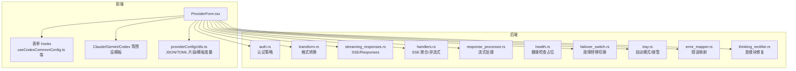
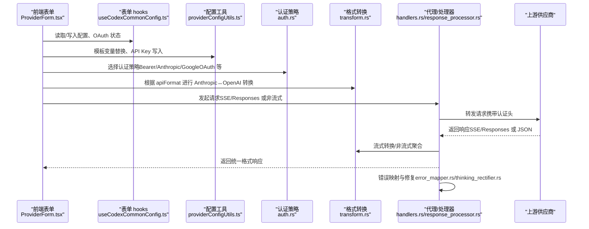
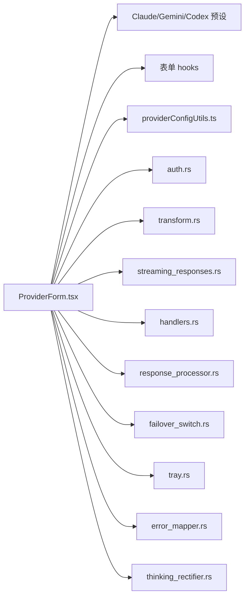

# 自定义供应商开发

<cite>
**本文引用的文件**
- [universalProviderPresets.ts](file://src/config/universalProviderPresets.ts)
- [cc-switch-main/src/config/universalProviderPresets.ts](file://cc-switch-main/src/config/universalProviderPresets.ts)
- [providerConfigUtils.ts](file://src/utils/providerConfigUtils.ts)
- [auth.rs](file://src-tauri/src/proxy/providers/auth.rs)
- [transform.rs](file://src-tauri/src/proxy/providers/transform.rs)
- [streaming_responses.rs](file://src-tauri/src/proxy/providers/streaming_responses.rs)
- [handlers.rs](file://src-tauri/src/proxy/handlers.rs)
- [response_processor.rs](file://src-tauri/src/proxy/response_processor.rs)
- [health.rs](file://src-tauri/src/proxy/health.rs)
- [failover_switch.rs](file://src-tauri/src/proxy/failover_switch.rs)
- [claudeProviderPresets.ts](file://src/config/claudeProviderPresets.ts)
- [ProviderForm.tsx](file://src/components/providers/forms/ProviderForm.tsx)
- [useCodexCommonConfig.ts](file://src/components/providers/forms/hooks/useCodexCommonConfig.ts)
- [en.json](file://src/i18n/locales/en.json)
- [tray.rs](file://src-tauri/src/tray.rs)
- [stream_check.rs](file://src-tauri/src/services/stream_check.rs)
- [error_mapper.rs](file://src-tauri/src/proxy/error_mapper.rs)
- [thinking_rectifier.rs](file://src-tauri/src/proxy/thinking_rectifier.rs)
</cite>

## 目录
1. [简介](#简介)
2. [项目结构](#项目结构)
3. [核心组件](#核心组件)
4. [架构总览](#架构总览)
5. [详细组件分析](#详细组件分析)
6. [依赖关系分析](#依赖关系分析)
7. [性能考量](#性能考量)
8. [故障排查指南](#故障排查指南)
9. [结论](#结论)
10. [附录](#附录)

## 简介
本指南面向希望为 CC Switch 自定义开发“AI 供应商插件”的工程师，涵盖以下关键主题：
- 供应商配置模板设计与实现
- 认证机制（API Key、OAuth 等）的接入方式
- 供应商 API 集成流程（请求格式转换、响应处理、流式与非流式）
- 健康检查与故障转移机制
- 统一供应商配置系统的工作原理与适配策略
- 开发示例、测试方法与调试技巧

目标是帮助你在不深入 Rust 后端的情况下，也能快速完成新供应商的前端配置与模板对接，并理解后端如何处理认证、格式转换与错误映射。

## 项目结构
围绕“供应商”能力，项目在前端与后端分别提供了配置模板、表单、工具函数与后端代理/转换层：
- 前端
  - 供应商预设模板：Claude/Gemini/Codex/OpenCode/OpenClaw/Hermes 等
  - 供应商表单：ProviderForm 及其 hooks，负责渲染字段、模板变量、通用配置片段、OAuth 状态等
  - 配置工具：providerConfigUtils 提供 JSON/TOML 配置片段合并、API Key 读取/写入、模板变量替换等
- 后端
  - 认证与策略：auth.rs 定义多种认证策略（Bearer、Anthropic、GoogleOAuth 等）
  - 格式转换：transform.rs 实现 Anthropic↔OpenAI 格式转换
  - 流式处理：streaming_responses.rs、handlers.rs、response_processor.rs 处理 SSE/Responses 流式与非流式聚合
  - 健康检查与故障转移：health.rs（占位）、failover_switch.rs（切换逻辑）、tray.rs（托盘自动模式）
  - 错误映射与修复：error_mapper.rs、thinking_rectifier.rs

图表来源
- [ProviderForm.tsx:1-800](file://src/components/providers/forms/ProviderForm.tsx#L1-L800)
- [useCodexCommonConfig.ts:1-475](file://src/components/providers/forms/hooks/useCodexCommonConfig.ts#L1-L475)
- [claudeProviderPresets.ts:1-800](file://src/config/claudeProviderPresets.ts#L1-L800)
- [providerConfigUtils.ts:1-800](file://src/utils/providerConfigUtils.ts#L1-L800)
- [auth.rs:1-260](file://src-tauri/src/proxy/providers/auth.rs#L1-L260)
- [transform.rs:1-800](file://src-tauri/src/proxy/providers/transform.rs#L1-L800)
- [streaming_responses.rs:1-122](file://src-tauri/src/proxy/providers/streaming_responses.rs#L1-L122)
- [handlers.rs:1369-1585](file://src-tauri/src/proxy/handlers.rs#L1369-L1585)
- [response_processor.rs:190-231](file://src-tauri/src/proxy/response_processor.rs#L190-L231)
- [health.rs:1-8](file://src-tauri/src/proxy/health.rs#L1-L8)
- [failover_switch.rs:1-136](file://src-tauri/src/proxy/failover_switch.rs#L1-L136)
- [tray.rs:381-406](file://src-tauri/src/tray.rs#L381-L406)
- [error_mapper.rs:120-155](file://src-tauri/src/proxy/error_mapper.rs#L120-L155)
- [thinking_rectifier.rs:39-78](file://src-tauri/src/proxy/thinking_rectifier.rs#L39-L78)

章节来源
- [ProviderForm.tsx:1-800](file://src/components/providers/forms/ProviderForm.tsx#L1-L800)
- [claudeProviderPresets.ts:1-800](file://src/config/claudeProviderPresets.ts#L1-L800)
- [providerConfigUtils.ts:1-800](file://src/utils/providerConfigUtils.ts#L1-L800)

## 核心组件
- 供应商预设模板
  - Claude/Gemini/Codex/OpenCode/OpenClaw/Hermes 等预设定义了默认环境变量、图标、主题、API 格式、是否需要 OAuth、模型候选等
  - 通过 ProviderForm 读取并渲染对应字段，支持模板变量替换与通用配置片段抽取/合并
- 认证策略
  - 支持 Anthropic、Bearer、Google、GoogleOAuth、GitHubCopilot、CodexOAuth 等策略
  - 前端表单根据预设的 requiresOAuth 字段与实际认证状态联动
- 配置工具
  - JSON/TOML 配置片段合并/移除、模板变量替换、API Key 读取/写入
  - Codex 专用：TOML wire_api、模型名、聊天推理参数等解析与写入
- 后端代理与转换
  - Anthropic↔OpenAI 格式转换、SSE/Responses 流式转换、非流式聚合
  - 错误映射与常见思维块问题修复（如签名无效、必须以 thinking 开头等）

章节来源
- [claudeProviderPresets.ts:1-800](file://src/config/claudeProviderPresets.ts#L1-L800)
- [ProviderForm.tsx:1-800](file://src/components/providers/forms/ProviderForm.tsx#L1-L800)
- [providerConfigUtils.ts:1-800](file://src/utils/providerConfigUtils.ts#L1-L800)
- [auth.rs:1-260](file://src-tauri/src/proxy/providers/auth.rs#L1-L260)
- [transform.rs:1-800](file://src-tauri/src/proxy/providers/transform.rs#L1-L800)
- [streaming_responses.rs:1-122](file://src-tauri/src/proxy/providers/streaming_responses.rs#L1-L122)
- [handlers.rs:1369-1585](file://src-tauri/src/proxy/handlers.rs#L1369-L1585)
- [response_processor.rs:190-231](file://src-tauri/src/proxy/response_processor.rs#L190-L231)

## 架构总览
下图展示了从前端表单到后端代理的关键流转：表单收集配置→模板变量替换→通用配置片段合并→认证策略选择→格式转换→上游请求→响应处理（流式/非流式）→错误映射与健康检查。

图表来源
- [ProviderForm.tsx:1-800](file://src/components/providers/forms/ProviderForm.tsx#L1-L800)
- [useCodexCommonConfig.ts:1-475](file://src/components/providers/forms/hooks/useCodexCommonConfig.ts#L1-L475)
- [providerConfigUtils.ts:1-800](file://src/utils/providerConfigUtils.ts#L1-L800)
- [auth.rs:1-260](file://src-tauri/src/proxy/providers/auth.rs#L1-L260)
- [transform.rs:1-800](file://src-tauri/src/proxy/providers/transform.rs#L1-L800)
- [handlers.rs:1369-1585](file://src-tauri/src/proxy/handlers.rs#L1369-L1585)
- [response_processor.rs:190-231](file://src-tauri/src/proxy/response_processor.rs#L190-L231)
- [error_mapper.rs:120-155](file://src-tauri/src/proxy/error_mapper.rs#L120-L155)
- [thinking_rectifier.rs:39-78](file://src-tauri/src/proxy/thinking_rectifier.rs#L39-L78)

## 详细组件分析

### 供应商配置模板设计与实现
- 预设结构
  - name、websiteUrl、apiKeyUrl、settingsConfig、category、apiKeyField、templateValues、endpointCandidates、theme、icon/iconColor、apiFormat、providerType/requiresOAuth 等
  - Claude 预设还包含 apiFormat（anthropic/openai_chat/openai_responses/gemini_native）与 providerType（如 github_copilot、codex_oauth）
- 模板变量
  - 通过 TemplateValueConfig 定义 label/placeholder/defaultValue/editorValue，前端在 ProviderForm 中渲染并参与 applyTemplateValues 替换
- 通用配置片段
  - 前端支持从 TOML 配置中抽取通用片段、合并/移除通用片段，Codex 专用的 updateTomlCommonConfigSnippet 与 hasTomlCommonConfigSnippet
- API Key 管理
  - getApiKeyFromConfig/setApiKeyInConfig 支持不同应用的字段差异（ANTHROPIC_AUTH_TOKEN/ANTHROPIC_API_KEY/GEMINI_API_KEY/CODEX_API_KEY）
- 示例参考
  - Claude 预设模板：[claudeProviderPresets.ts:1-800](file://src/config/claudeProviderPresets.ts#L1-L800)
  - Codex 通用配置钩子：[useCodexCommonConfig.ts:1-475](file://src/components/providers/forms/hooks/useCodexCommonConfig.ts#L1-L475)
  - 配置工具函数：[providerConfigUtils.ts:1-800](file://src/utils/providerConfigUtils.ts#L1-L800)

章节来源
- [claudeProviderPresets.ts:1-800](file://src/config/claudeProviderPresets.ts#L1-L800)
- [useCodexCommonConfig.ts:1-475](file://src/components/providers/forms/hooks/useCodexCommonConfig.ts#L1-L475)
- [providerConfigUtils.ts:1-800](file://src/utils/providerConfigUtils.ts#L1-L800)

### 认证机制实现（API Key、OAuth 等）
- 认证策略
  - Anthropic、ClaudeAuth、Bearer、Google、GoogleOAuth、GitHubCopilot、CodexOAuth
  - AuthInfo 结构包含 api_key、strategy、access_token，支持遮蔽日志输出
- OAuth 状态
  - 前端通过 useCopilotAuth/useCodexOauth 管理 Copilot 与 Codex OAuth 的认证状态
  - Codex OAuth 切换时可保留官方登录或回填 API Key，详见测试用例注释
- 授权头生成
  - 根据策略生成对应 Header（如 Authorization: Bearer <token>、x-api-key 等）
- 示例参考
  - 认证策略定义：[auth.rs:1-260](file://src-tauri/src/proxy/providers/auth.rs#L1-L260)
  - OAuth 状态钩子：[ProviderForm.tsx:1-800](file://src/components/providers/forms/ProviderForm.tsx#L1-L800)

章节来源
- [auth.rs:1-260](file://src-tauri/src/proxy/providers/auth.rs#L1-L260)
- [ProviderForm.tsx:1-800](file://src/components/providers/forms/ProviderForm.tsx#L1-L800)

### 供应商 API 集成流程（请求格式转换与响应处理）
- 格式转换
  - Anthropic 请求→OpenAI Chat Completions：strip_leading_anthropic_billing_header、normalize_openai_system_messages、convert_message_to_openai、inject_openai_stream_include_usage
  - OpenAI 响应→Anthropic 响应：openai_to_anthropic、usage 映射与 cache_tokens 处理
- 流式处理
  - Responses API SSE→Anthropic SSE：create_anthropic_sse_stream_from_responses，维护消息索引、工具调用、文本增量等状态
  - 非流式兜底：handlers.rs 中 responses_sse_to_response_value/chat_sse_to_response_value 将 SSE 聚合成完整 JSON
  - response_processor.rs 处理流式响应头、压缩编码检查、复制响应头、创建字节流
- 示例参考
  - 转换实现：[transform.rs:1-800](file://src-tauri/src/proxy/providers/transform.rs#L1-L800)
  - 流式转换：[streaming_responses.rs:1-122](file://src-tauri/src/proxy/providers/streaming_responses.rs#L1-L122)
  - SSE 聚合：[handlers.rs:1369-1585](file://src-tauri/src/proxy/handlers.rs#L1369-L1585)
  - 流式处理：[response_processor.rs:190-231](file://src-tauri/src/proxy/response_processor.rs#L190-L231)

章节来源
- [transform.rs:1-800](file://src-tauri/src/proxy/providers/transform.rs#L1-L800)
- [streaming_responses.rs:1-122](file://src-tauri/src/proxy/providers/streaming_responses.rs#L1-L122)
- [handlers.rs:1369-1585](file://src-tauri/src/proxy/handlers.rs#L1369-L1585)
- [response_processor.rs:190-231](file://src-tauri/src/proxy/response_processor.rs#L190-L231)

### 健康检查与故障转移机制
- 健康检查
  - health.rs 为占位实现，后续可扩展定时探测、成功率统计、降级阈值等
- 故障转移
  - failover_switch.rs：去重控制、代理接管检查、热切换、托盘菜单更新、前端事件发射
  - tray.rs：自动模式启动代理服务、执行接管、开启 auto_failover
  - 国际化文案：en.json 中包含 failover、proxy、health 等相关提示
- 示例参考
  - 故障转移切换：[failover_switch.rs:1-136](file://src-tauri/src/proxy/failover_switch.rs#L1-L136)
  - 托盘自动模式：[tray.rs:381-406](file://src-tauri/src/tray.rs#L381-L406)
  - 健康检查占位：[health.rs:1-8](file://src-tauri/src/proxy/health.rs#L1-L8)
  - 国际化文案：[en.json:272-2434](file://src/i18n/locales/en.json#L272-L2434)

章节来源
- [failover_switch.rs:1-136](file://src-tauri/src/proxy/failover_switch.rs#L1-L136)
- [tray.rs:381-406](file://src-tauri/src/tray.rs#L381-L406)
- [health.rs:1-8](file://src-tauri/src/proxy/health.rs#L1-L8)
- [en.json:272-2434](file://src/i18n/locales/en.json#L272-L2434)

### 统一供应商配置系统（Universal Provider）
- 统一供应商预设
  - 支持跨应用共享（Claude/Gemini/Codex），包含默认应用启用、默认模型配置、网站链接、图标/颜色、描述、是否自定义模板
  - 提供 createUniversalProviderFromPreset 工具，按预设生成统一供应商实例
- 预设列表与查找
  - universalProviderPresets.ts 定义预设集合，findPresetByType 按 providerType 查找
- 示例参考
  - 统一供应商预设（主仓库）：[universalProviderPresets.ts:1-133](file://src/config/universalProviderPresets.ts#L1-L133)
  - 统一供应商预设（cc-switch-main 分支）：[cc-switch-main/src/config/universalProviderPresets.ts:1-163](file://cc-switch-main/src/config/universalProviderPresets.ts#L1-L163)

章节来源
- [universalProviderPresets.ts:1-133](file://src/config/universalProviderPresets.ts#L1-L133)
- [cc-switch-main/src/config/universalProviderPresets.ts:1-163](file://cc-switch-main/src/config/universalProviderPresets.ts#L1-L163)

### 开发示例：集成新的 AI 平台
- 步骤概览
  - 在前端定义预设（settingsConfig/env、apiFormat、apiKeyField、templateValues、endpointCandidates、theme/icon）
  - 在 ProviderForm 中渲染字段并绑定 hooks（如 useCodexCommonConfig）
  - 在后端根据 apiFormat 选择转换逻辑（transform.rs），根据 providerType/requiresOAuth 选择认证策略（auth.rs）
  - 如需流式，确保上游返回 SSE 并由 streaming_responses.rs/handlers.rs 正确聚合
- 关键文件路径
  - 预设模板：[claudeProviderPresets.ts:1-800](file://src/config/claudeProviderPresets.ts#L1-L800)
  - 表单与 hooks：[ProviderForm.tsx:1-800](file://src/components/providers/forms/ProviderForm.tsx#L1-L800)、[useCodexCommonConfig.ts:1-475](file://src/components/providers/forms/hooks/useCodexCommonConfig.ts#L1-L475)
  - 认证策略：[auth.rs:1-260](file://src-tauri/src/proxy/providers/auth.rs#L1-L260)
  - 格式转换：[transform.rs:1-800](file://src-tauri/src/proxy/providers/transform.rs#L1-L800)
  - 流式处理：[streaming_responses.rs:1-122](file://src-tauri/src/proxy/providers/streaming_responses.rs#L1-L122)、[handlers.rs:1369-1585](file://src-tauri/src/proxy/handlers.rs#L1369-L1585)

章节来源
- [claudeProviderPresets.ts:1-800](file://src/config/claudeProviderPresets.ts#L1-L800)
- [ProviderForm.tsx:1-800](file://src/components/providers/forms/ProviderForm.tsx#L1-L800)
- [useCodexCommonConfig.ts:1-475](file://src/components/providers/forms/hooks/useCodexCommonConfig.ts#L1-L475)
- [auth.rs:1-260](file://src-tauri/src/proxy/providers/auth.rs#L1-L260)
- [transform.rs:1-800](file://src-tauri/src/proxy/providers/transform.rs#L1-L800)
- [streaming_responses.rs:1-122](file://src-tauri/src/proxy/providers/streaming_responses.rs#L1-L122)
- [handlers.rs:1369-1585](file://src-tauri/src/proxy/handlers.rs#L1369-L1585)

### 错误处理与调试技巧
- 错误映射
  - 将 ProxyError 映射为 HTTP 状态码（如 401/400/422/504），便于前端统一提示
- 常见思维块问题修复
  - 检测“签名无效”、“必须以 thinking 开头”、“期望 thinking 却发现 tool_use”等错误并进行修复
- 健康检查
  - stream_check.rs 提供模型健康检查结果（状态、耗时、HTTP 状态、错误分类）
- 调试建议
  - 使用国际化的 failover/proxy/health 文案定位问题
  - 检查流式响应的 content-encoding（SSE 通常不应压缩）
  - 核对 wire_api 与 apiFormat 是否匹配（Codex Responses vs Chat Completions）
- 示例参考
  - 错误映射：[error_mapper.rs:120-155](file://src-tauri/src/proxy/error_mapper.rs#L120-L155)
  - 思维块修复：[thinking_rectifier.rs:39-78](file://src-tauri/src/proxy/thinking_rectifier.rs#L39-L78)
  - 健康检查：[stream_check.rs:820-842](file://src-tauri/src/services/stream_check.rs#L820-L842)
  - 国际化文案：[en.json:272-2434](file://src/i18n/locales/en.json#L272-L2434)

章节来源
- [error_mapper.rs:120-155](file://src-tauri/src/proxy/error_mapper.rs#L120-L155)
- [thinking_rectifier.rs:39-78](file://src-tauri/src/proxy/thinking_rectifier.rs#L39-L78)
- [stream_check.rs:820-842](file://src-tauri/src/services/stream_check.rs#L820-L842)
- [en.json:272-2434](file://src/i18n/locales/en.json#L272-L2434)

## 依赖关系分析
- 前端依赖
  - ProviderForm 依赖各应用预设、hooks、配置工具与国际化
  - useCodexCommonConfig 依赖 configApi 与 providerConfigUtils
- 后端依赖
  - 认证策略依赖 AuthInfo/策略枚举
  - 转换与流式处理依赖 SSE/JSON 解析与代理上下文
  - 故障转移依赖数据库状态与托盘菜单更新
- 复杂度与耦合
  - 前端表单与配置工具高内聚，低耦合于后端实现
  - 后端转换层与代理层职责清晰，便于扩展新供应商格式

图表来源
- [ProviderForm.tsx:1-800](file://src/components/providers/forms/ProviderForm.tsx#L1-L800)
- [claudeProviderPresets.ts:1-800](file://src/config/claudeProviderPresets.ts#L1-L800)
- [useCodexCommonConfig.ts:1-475](file://src/components/providers/forms/hooks/useCodexCommonConfig.ts#L1-L475)
- [providerConfigUtils.ts:1-800](file://src/utils/providerConfigUtils.ts#L1-L800)
- [auth.rs:1-260](file://src-tauri/src/proxy/providers/auth.rs#L1-L260)
- [transform.rs:1-800](file://src-tauri/src/proxy/providers/transform.rs#L1-L800)
- [streaming_responses.rs:1-122](file://src-tauri/src/proxy/providers/streaming_responses.rs#L1-L122)
- [handlers.rs:1369-1585](file://src-tauri/src/proxy/handlers.rs#L1369-L1585)
- [response_processor.rs:190-231](file://src-tauri/src/proxy/response_processor.rs#L190-L231)
- [failover_switch.rs:1-136](file://src-tauri/src/proxy/failover_switch.rs#L1-L136)
- [tray.rs:381-406](file://src-tauri/src/tray.rs#L381-L406)
- [error_mapper.rs:120-155](file://src-tauri/src/proxy/error_mapper.rs#L120-L155)
- [thinking_rectifier.rs:39-78](file://src-tauri/src/proxy/thinking_rectifier.rs#L39-L78)

## 性能考量
- 流式处理
  - SSE/Responses 流式传输时避免 content-encoding 压缩，减少解析失败风险
  - 注入 stream_options.include_usage 保证 token/成本统计完整
- 转换开销
  - 格式转换与 JSON/SSE 解析在高频请求下需关注内存与 CPU 占用
- 健康检查
  - 建议异步探测与缓存结果，避免阻塞主请求链路

## 故障排查指南
- 常见症状与定位
  - 401/403：检查 API Key/OAuth 状态与认证策略
  - 422：检查格式转换参数（如 reasoning_effort、max_tokens/max_completion_tokens）
  - 504：检查上游超时与代理配置
  - SSE 解析失败：确认上游未压缩 SSE，或调整代理配置
- 建议步骤
  - 查看国际化提示（failover/proxy/health）
  - 使用健康检查接口验证模型可用性
  - 检查 wire_api 与 apiFormat 是否匹配
  - 核对通用配置片段是否正确合并/移除

章节来源
- [error_mapper.rs:120-155](file://src-tauri/src/proxy/error_mapper.rs#L120-L155)
- [stream_check.rs:820-842](file://src-tauri/src/services/stream_check.rs#L820-L842)
- [en.json:272-2434](file://src/i18n/locales/en.json#L272-L2434)

## 结论
通过统一的供应商预设模板、灵活的认证策略与完善的格式转换/流式处理链路，CC Switch 为自定义供应商开发提供了清晰的扩展点。遵循本文档的模板设计、认证接入与集成流程，即可快速将新的 AI 平台接入系统，并在前端与后端协同下实现稳定、可观测的代理与路由能力。

## 附录
- 相关文件清单
  - 前端
    - [ProviderForm.tsx](file://src/components/providers/forms/ProviderForm.tsx)
    - [claudeProviderPresets.ts](file://src/config/claudeProviderPresets.ts)
    - [useCodexCommonConfig.ts](file://src/components/providers/forms/hooks/useCodexCommonConfig.ts)
    - [providerConfigUtils.ts](file://src/utils/providerConfigUtils.ts)
    - [en.json](file://src/i18n/locales/en.json)
  - 后端
    - [auth.rs](file://src-tauri/src/proxy/providers/auth.rs)
    - [transform.rs](file://src-tauri/src/proxy/providers/transform.rs)
    - [streaming_responses.rs](file://src-tauri/src/proxy/providers/streaming_responses.rs)
    - [handlers.rs](file://src-tauri/src/proxy/handlers.rs)
    - [response_processor.rs](file://src-tauri/src/proxy/response_processor.rs)
    - [health.rs](file://src-tauri/src/proxy/health.rs)
    - [failover_switch.rs](file://src-tauri/src/proxy/failover_switch.rs)
    - [tray.rs](file://src-tauri/src/tray.rs)
    - [error_mapper.rs](file://src-tauri/src/proxy/error_mapper.rs)
    - [thinking_rectifier.rs](file://src-tauri/src/proxy/thinking_rectifier.rs)
    - [stream_check.rs](file://src-tauri/src/services/stream_check.rs)
    - [universalProviderPresets.ts](file://src/config/universalProviderPresets.ts)
    - [cc-switch-main/src/config/universalProviderPresets.ts](file://cc-switch-main/src/config/universalProviderPresets.ts)