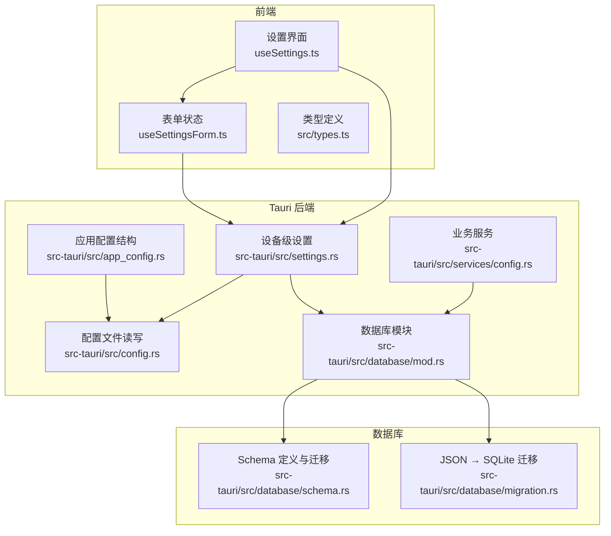
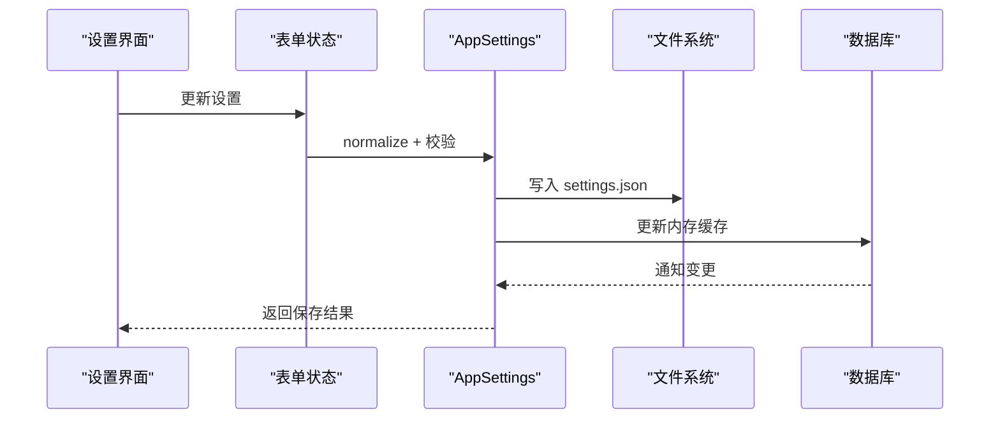
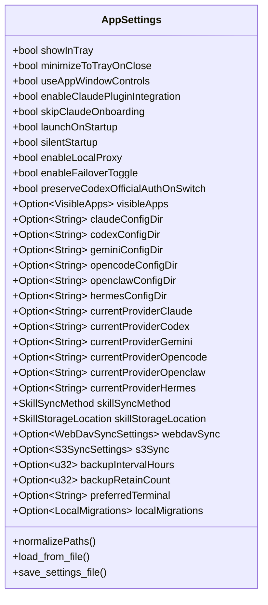
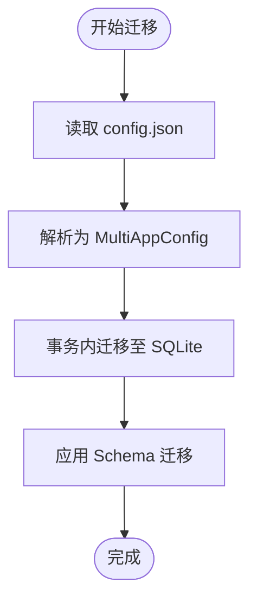
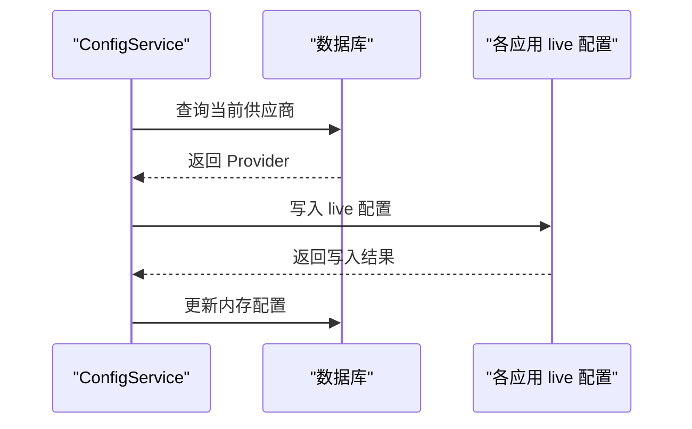
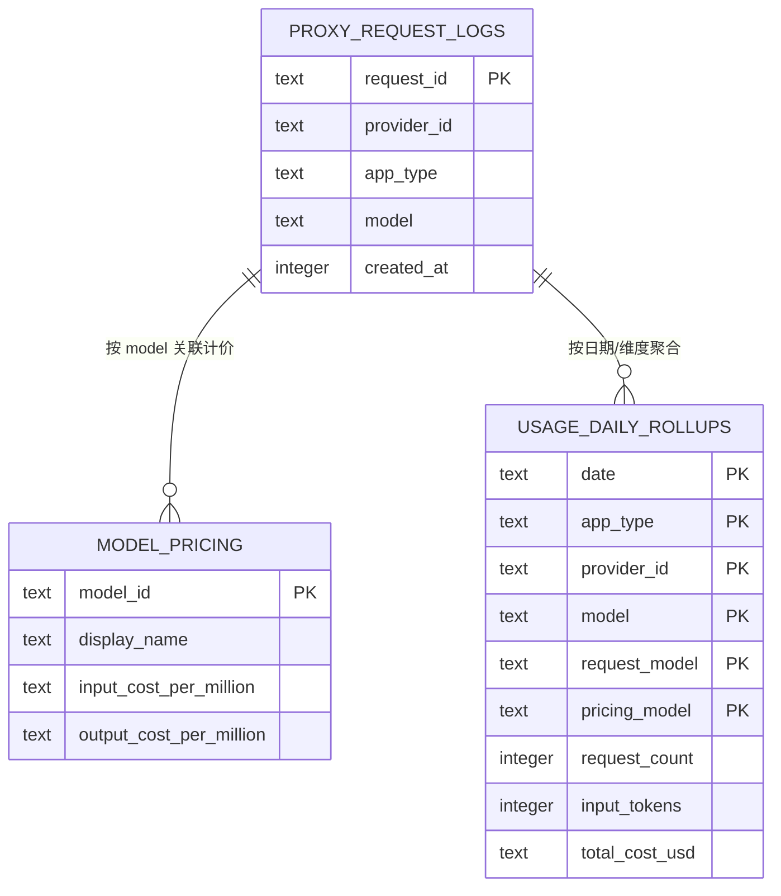
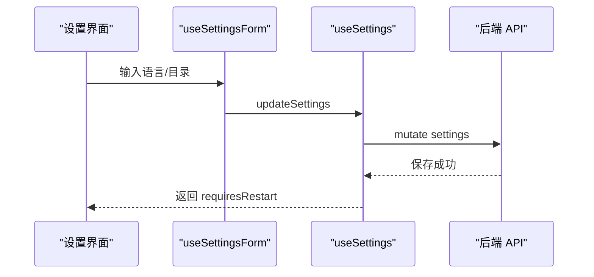
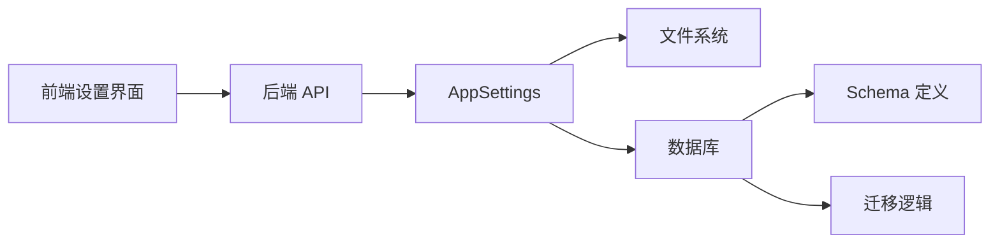

# 配置系统扩展

<cite>
**本文档引用的文件**
- [src/config/appConfig.tsx](file://src/config/appConfig.tsx)
- [src/config/universalProviderPresets.ts](file://src/config/universalProviderPresets.ts)
- [src-tauri/src/config.rs](file://src-tauri/src/config.rs)
- [src-tauri/src/settings.rs](file://src-tauri/src/settings.rs)
- [src-tauri/src/database/mod.rs](file://src-tauri/src/database/mod.rs)
- [src-tauri/src/database/schema.rs](file://src-tauri/src/database/schema.rs)
- [src-tauri/src/database/migration.rs](file://src-tauri/src/database/migration.rs)
- [src-tauri/src/app_config.rs](file://src-tauri/src/app_config.rs)
- [src-tauri/src/services/config.rs](file://src-tauri/src/services/config.rs)
- [src/hooks/useSettings.ts](file://src/hooks/useSettings.ts)
- [src/hooks/useSettingsForm.ts](file://src/hooks/useSettingsForm.ts)
- [src/lib/api/types.ts](file://src/lib/api/types.ts)
- [src/types.ts](file://src/types.ts)
</cite>

## 目录
1. [简介](#简介)
2. [项目结构](#项目结构)
3. [核心组件](#核心组件)
4. [架构总览](#架构总览)
5. [详细组件分析](#详细组件分析)
6. [依赖关系分析](#依赖关系分析)
7. [性能考虑](#性能考虑)
8. [故障排除指南](#故障排除指南)
9. [结论](#结论)
10. [附录](#附录)

## 简介
本指南面向希望为 CC Switch 项目扩展配置系统的开发者，系统性阐述配置系统的架构设计、层次结构、优先级与继承关系，以及如何安全地添加新配置项、实现配置迁移、持久化扩展、热重载机制、验证与错误处理，最后提供可操作的扩展示例与文档生成建议。

## 项目结构
CC Switch 的配置系统由前端 React 层、Tauri Rust 层与数据库层协同组成，采用“文件 + 数据库 + 内存缓存”的混合持久化策略，配合严格的迁移与校验机制，确保跨版本升级的稳定性与一致性。

**图表来源**
- [src/hooks/useSettings.ts:62-511](file://src/hooks/useSettings.ts#L62-L511)
- [src/hooks/useSettingsForm.ts:72-208](file://src/hooks/useSettingsForm.ts#L72-L208)
- [src-tauri/src/config.rs:125-128](file://src-tauri/src/config.rs#L125-L128)
- [src-tauri/src/app_config.rs:467-517](file://src-tauri/src/app_config.rs#L467-L517)
- [src-tauri/src/settings.rs:315-506](file://src-tauri/src/settings.rs#L315-L506)
- [src-tauri/src/database/mod.rs:1-273](file://src-tauri/src/database/mod.rs#L1-L273)
- [src-tauri/src/database/schema.rs:16-364](file://src-tauri/src/database/schema.rs#L16-L364)
- [src-tauri/src/database/migration.rs:10-65](file://src-tauri/src/database/migration.rs#L10-L65)

**章节来源**
- [src/config/appConfig.tsx:11-112](file://src/config/appConfig.tsx#L11-L112)
- [src/config/universalProviderPresets.ts:1-133](file://src/config/universalProviderPresets.ts#L1-L133)
- [src-tauri/src/config.rs:125-128](file://src-tauri/src/config.rs#L125-L128)
- [src-tauri/src/settings.rs:315-506](file://src-tauri/src/settings.rs#L315-L506)
- [src-tauri/src/database/mod.rs:1-273](file://src-tauri/src/database/mod.rs#L1-L273)

## 核心组件
- 前端设置组合层：负责表单状态、目录覆盖、元数据与重启需求管理，以及与后端 API 的交互。
- 设备级设置（AppSettings）：存储设备级别的 UI、目录覆盖、当前供应商 ID、同步与备份策略、终端偏好等，持久化至 `~/.cc-switch/settings.json`。
- 应用配置（MultiAppConfig）：存储供应商、MCP、提示词、通用配置片段等，持久化至 `~/.cc-switch/config.json`，并支持 JSON → SQLite 迁移。
- 数据库层：SQLite 存储供应商、代理配置、使用统计、模型定价等，具备版本迁移与索引优化。
- 配置服务：负责配置导入导出、备份清理、当前供应商到 live 配置的同步。

**章节来源**
- [src/hooks/useSettings.ts:62-511](file://src/hooks/useSettings.ts#L62-L511)
- [src-tauri/src/settings.rs:315-506](file://src-tauri/src/settings.rs#L315-L506)
- [src-tauri/src/app_config.rs:467-517](file://src-tauri/src/app_config.rs#L467-L517)
- [src-tauri/src/database/mod.rs:50-58](file://src-tauri/src/database/mod.rs#L50-L58)

## 架构总览
配置系统采用“文件 + 数据库 + 内存缓存”的分层设计：

- 文件层
  - `~/.cc-switch/settings.json`：设备级设置（UI、目录覆盖、同步策略等）
  - `~/.cc-switch/config.json`：应用配置（供应商、MCP、提示词、通用配置片段）
  - 各应用 live 配置：Claude/Gemini/Codex 的各自配置文件
- 数据库层（SQLite）
  - 供应商、代理、使用统计、模型定价等结构化数据
  - Schema 版本控制与迁移
- 内存缓存层
  - AppSettings 的读写锁缓存，避免频繁 IO 并支持热重载

**图表来源**
- [src/hooks/useSettings.ts:181-305](file://src/hooks/useSettings.ts#L181-L305)
- [src-tauri/src/settings.rs:692-718](file://src-tauri/src/settings.rs#L692-L718)
- [src-tauri/src/config.rs:180-193](file://src-tauri/src/config.rs#L180-L193)

**章节来源**
- [src-tauri/src/settings.rs:646-718](file://src-tauri/src/settings.rs#L646-L718)
- [src-tauri/src/config.rs:180-193](file://src-tauri/src/config.rs#L180-L193)

## 详细组件分析

### 组件 A：设备级设置（AppSettings）与持久化
- 结构与默认值
  - 使用 serde 注解定义字段、默认值与序列化行为，确保前后端一致
  - 目录覆盖、可见应用、同步设置、备份策略、终端偏好等均在结构内声明
- 加载与保存
  - 首次启动从文件加载，失败时回退默认值
  - 保存时进行路径规范化与权限设置（Unix 下 0600）
- 热重载
  - 通过 RwLock<AppSettings> 缓存，提供 reload_settings() 从文件重新加载
  - 与数据库变更钩子配合，触发自动同步

**图表来源**
- [src-tauri/src/settings.rs:315-506](file://src-tauri/src/settings.rs#L315-L506)

**章节来源**
- [src-tauri/src/settings.rs:315-506](file://src-tauri/src/settings.rs#L315-L506)
- [src-tauri/src/settings.rs:584-606](file://src-tauri/src/settings.rs#L584-L606)
- [src-tauri/src/settings.rs:692-718](file://src-tauri/src/settings.rs#L692-L718)

### 组件 B：应用配置（MultiAppConfig）与迁移
- 结构设计
  - 多应用维度的扁平化结构，支持 v2 版本
  - MCP、提示词、通用配置片段等模块化管理
- 迁移机制
  - JSON → SQLite：将 MultiAppConfig 迁移至数据库，事务保证一致性
  - Schema 迁移：版本号驱动，逐版本增量迁移，支持预迁移备份
- 自动导入
  - 首次启动或升级时自动导入提示词文件，避免破坏既有配置

**图表来源**
- [src-tauri/src/database/migration.rs:10-65](file://src-tauri/src/database/migration.rs#L10-L65)
- [src-tauri/src/database/schema.rs:366-470](file://src-tauri/src/database/schema.rs#L366-L470)

**章节来源**
- [src-tauri/src/app_config.rs:467-517](file://src-tauri/src/app_config.rs#L467-L517)
- [src-tauri/src/database/migration.rs:10-65](file://src-tauri/src/database/migration.rs#L10-L65)
- [src-tauri/src/database/schema.rs:366-470](file://src-tauri/src/database/schema.rs#L366-L470)

### 组件 C：配置服务与同步
- 备份与清理
  - 导出时创建带时间戳的备份文件，保留上限控制
- 当前供应商同步
  - 将当前供应商配置写入各应用的 live 配置（Claude/Gemini/Codex）
  - 同步后读回实际写入内容，更新内存中的配置

**图表来源**
- [src-tauri/src/services/config.rs:86-142](file://src-tauri/src/services/config.rs#L86-L142)
- [src-tauri/src/services/config.rs:207-230](file://src-tauri/src/services/config.rs#L207-L230)

**章节来源**
- [src-tauri/src/services/config.rs:15-84](file://src-tauri/src/services/config.rs#L15-L84)
- [src-tauri/src/services/config.rs:86-142](file://src-tauri/src/services/config.rs#L86-L142)
- [src-tauri/src/services/config.rs:207-261](file://src-tauri/src/services/config.rs#L207-L261)

### 组件 D：数据库 Schema 与索引优化
- 表结构与索引
  - 代理请求日志、模型定价、使用统计等关键表建立复合索引
  - 按查询频率优化索引，提升统计与检索性能
- 迁移策略
  - 通过 user_version 控制迁移版本，支持预迁移备份与增量升级
  - 自动真空与外键约束保障数据一致性

**图表来源**
- [src-tauri/src/database/schema.rs:183-296](file://src-tauri/src/database/schema.rs#L183-L296)
- [src-tauri/src/database/schema.rs:220-221](file://src-tauri/src/database/schema.rs#L220-L221)

**章节来源**
- [src-tauri/src/database/mod.rs:182-253](file://src-tauri/src/database/mod.rs#L182-L253)
- [src-tauri/src/database/schema.rs:183-296](file://src-tauri/src/database/schema.rs#L183-L296)

### 组件 E：前端设置与热重载
- 表单状态与语言同步
  - 本地化语言读取与同步，支持即时生效
- 自动保存与手动保存
  - 自动保存用于 UI 实时更新（如开机自启、插件联动）
  - 手动保存用于高级设置，包含系统 API 调用与重启需求判断
- 目录覆盖与重启需求
  - 应用配置目录覆盖变更触发重启需求提示

**图表来源**
- [src/hooks/useSettingsForm.ts:134-164](file://src/hooks/useSettingsForm.ts#L134-L164)
- [src/hooks/useSettings.ts:181-305](file://src/hooks/useSettings.ts#L181-L305)
- [src/hooks/useSettings.ts:309-484](file://src/hooks/useSettings.ts#L309-L484)

**章节来源**
- [src/hooks/useSettingsForm.ts:72-208](file://src/hooks/useSettingsForm.ts#L72-L208)
- [src/hooks/useSettings.ts:62-511](file://src/hooks/useSettings.ts#L62-L511)

## 依赖关系分析
- 前端依赖后端 API 与查询缓存，设置变更通过 mutation 触发后端持久化与同步
- 后端设置模块依赖文件系统与数据库，提供原子写入与缓存刷新
- 数据库模块依赖 Schema 定义与迁移逻辑，确保结构演进的向后兼容

**图表来源**
- [src/hooks/useSettings.ts:62-511](file://src/hooks/useSettings.ts#L62-L511)
- [src-tauri/src/settings.rs:646-718](file://src-tauri/src/settings.rs#L646-L718)
- [src-tauri/src/database/mod.rs:1-273](file://src-tauri/src/database/mod.rs#L1-L273)

**章节来源**
- [src-tauri/src/settings.rs:646-718](file://src-tauri/src/settings.rs#L646-L718)
- [src-tauri/src/database/mod.rs:1-273](file://src-tauri/src/database/mod.rs#L1-L273)

## 性能考虑
- 文件写入采用原子替换（临时文件 + rename），避免半写状态与并发冲突
- 数据库启用外键与增量真空，减少碎片化与锁竞争
- 关键查询建立复合索引，降低统计与检索延迟
- 内存缓存减少频繁 IO，配合变更钩子实现近实时同步

[本节为通用指导，无需特定文件引用]

## 故障排除指南
- 配置文件损坏
  - 使用备份目录中的备份文件恢复
  - 通过 `reload_settings()` 从文件重新加载内存缓存
- 数据库版本不兼容
  - 检查 user_version 与 SCHEMA_VERSION，必要时执行预迁移备份与升级
- 同步失败
  - 检查各应用 live 配置写入权限与路径
  - 查看服务日志定位具体错误

**章节来源**
- [src-tauri/src/services/config.rs:15-84](file://src-tauri/src/services/config.rs#L15-L84)
- [src-tauri/src/settings.rs:762-772](file://src-tauri/src/settings.rs#L762-L772)
- [src-tauri/src/database/mod.rs:123-136](file://src-tauri/src/database/mod.rs#L123-L136)

## 结论
CC Switch 的配置系统通过清晰的层次划分、严格的迁移与校验机制、完善的持久化与热重载能力，为扩展新配置项提供了坚实基础。遵循本文档的流程与最佳实践，可安全、可控地实现配置扩展与版本升级。

[本节为总结，无需特定文件引用]

## 附录

### 配置层次结构与优先级
- 层次
  - 设备级设置（settings.json）：UI、目录覆盖、同步策略
  - 应用配置（config.json）：供应商、MCP、提示词、通用配置片段
  - 数据库：结构化数据与统计
- 优先级
  - 目录覆盖优先于数据库 is_current
  - 设备级设置优先于应用配置片段
  - 数据库变更通过钩子触发自动同步

**章节来源**
- [src-tauri/src/settings.rs:389-411](file://src-tauri/src/settings.rs#L389-L411)
- [src-tauri/src/app_config.rs:467-517](file://src-tauri/src/app_config.rs#L467-L517)

### 新配置项添加流程
- 类型定义
  - 在前端类型定义中新增字段，提供默认值与校验规则
  - 在后端结构体中声明字段与 serde 注解
- 默认值与校验
  - 使用 serde 默认函数与 skip_serializing_if 控制序列化
  - 在 save 时进行 normalize 与 validate
- 持久化与迁移
  - 文件持久化：原子写入，路径规范化
  - 数据库持久化：Schema 增量迁移，索引优化
- 热重载
  - 通过内存缓存与变更钩子实现近实时更新
  - 提供 reload_settings() 用于导入/恢复场景

**章节来源**
- [src/types.ts:324-427](file://src/types.ts#L324-L427)
- [src-tauri/src/settings.rs:692-718](file://src-tauri/src/settings.rs#L692-L718)
- [src-tauri/src/config.rs:180-193](file://src-tauri/src/config.rs#L180-L193)
- [src-tauri/src/database/schema.rs:220-221](file://src-tauri/src/database/schema.rs#L220-L221)

### 配置迁移机制实现
- JSON → SQLite 迁移
  - 事务内迁移，失败回滚
  - 迁移后清理旧字段，更新索引
- Schema 迁移
  - user_version 控制版本，逐版本增量迁移
  - 预迁移备份，防止升级失败

**章节来源**
- [src-tauri/src/database/migration.rs:10-65](file://src-tauri/src/database/migration.rs#L10-L65)
- [src-tauri/src/database/schema.rs:366-470](file://src-tauri/src/database/schema.rs#L366-L470)

### 配置持久化扩展（数据库字段与索引）
- 新增字段
  - 在 create_tables 中添加列定义
  - 在 apply_schema_migrations 中添加迁移逻辑
- 索引优化
  - 为高频查询列建立复合索引
  - 定期执行增量真空与外键检查

**章节来源**
- [src-tauri/src/database/schema.rs:18-364](file://src-tauri/src/database/schema.rs#L18-L364)
- [src-tauri/src/database/mod.rs:182-253](file://src-tauri/src/database/mod.rs#L182-L253)

### 配置热重载实现
- 变更监听
  - 数据库 update_hook 监听 INSERT/UPDATE/DELETE
  - 文件系统监控（如需）结合轮询或事件
- 动态更新
  - 通过 RwLock<AppSettings> 实现读写分离
  - 提供 reload_settings() 从文件重新加载

**章节来源**
- [src-tauri/src/database/mod.rs:80-90](file://src-tauri/src/database/mod.rs#L80-L90)
- [src-tauri/src/settings.rs:762-772](file://src-tauri/src/settings.rs#L762-L772)

### 配置验证与错误处理
- 文件校验
  - 读取失败回退默认值，记录警告日志
  - JSON 解析失败抛出本地化错误
- 运行时检查
  - 目录覆盖路径规范化与存在性检查
  - 同步失败时返回错误并提示用户

**章节来源**
- [src-tauri/src/config.rs:152-161](file://src-tauri/src/config.rs#L152-L161)
- [src-tauri/src/settings.rs:584-606](file://src-tauri/src/settings.rs#L584-L606)

### 配置扩展示例
- 示例：添加“主题偏好”配置
  - 前端：在 Settings 类型中新增 theme 字段，提供默认值
  - 后端：在 AppSettings 中声明字段与默认函数
  - 持久化：settings.json 中序列化/反序列化
  - 热重载：通过内存缓存与变更钩子实现
- 示例：添加“统一供应商（Universal Provider）”配置
  - 前端：在 UniversalProvider 类型中新增字段
  - 后端：在 UniversalProvider 结构体中声明
  - 持久化：config.json 中序列化/反序列化
  - 迁移：在 MultiAppConfig 中扩展序列化逻辑

**章节来源**
- [src/types.ts:543-559](file://src/types.ts#L543-L559)
- [src/config/universalProviderPresets.ts:18-37](file://src/config/universalProviderPresets.ts#L18-L37)
- [src-tauri/src/app_config.rs:467-517](file://src-tauri/src/app_config.rs#L467-L517)

### 配置文档与帮助信息生成
- 文档生成
  - 基于类型定义与 serde 注解生成配置参考
  - 为每个字段提供默认值、取值范围与说明
- 帮助信息
  - 在设置界面提供字段说明与示例
  - 通过本地化资源提供多语言帮助

**章节来源**
- [src/types.ts:324-427](file://src/types.ts#L324-L427)
- [src-tauri/src/app_config.rs:417-465](file://src-tauri/src/app_config.rs#L417-L465)