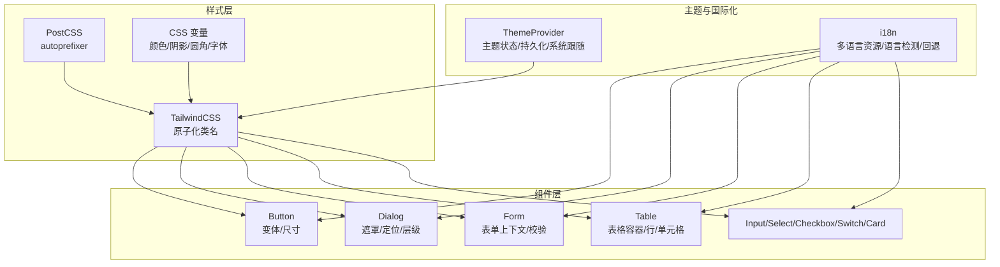
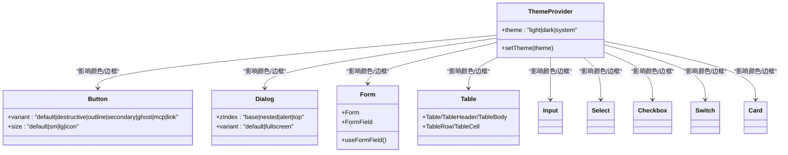
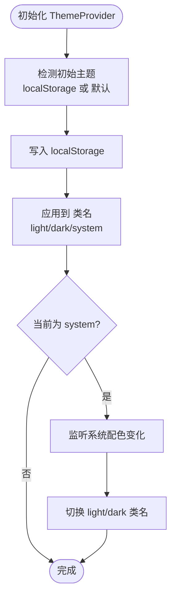
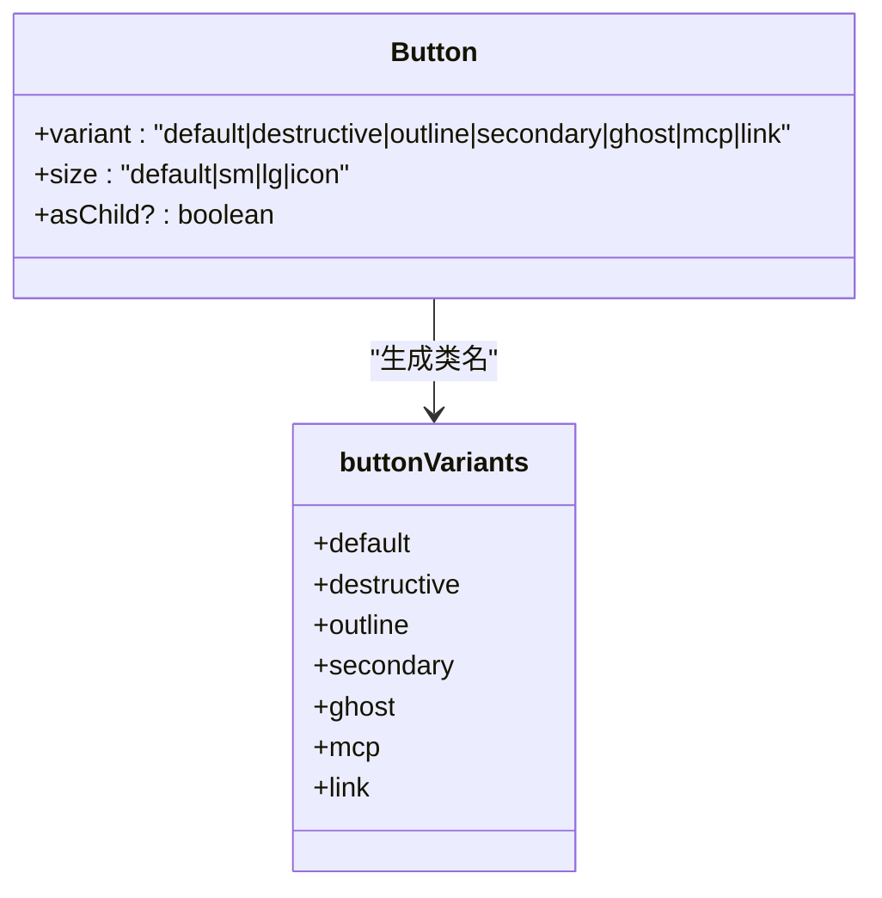
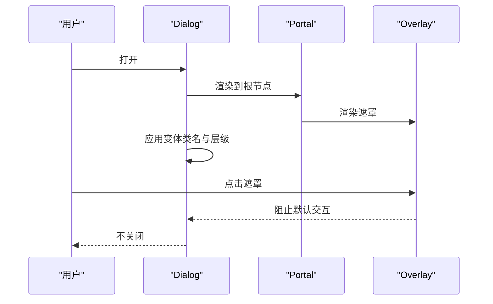
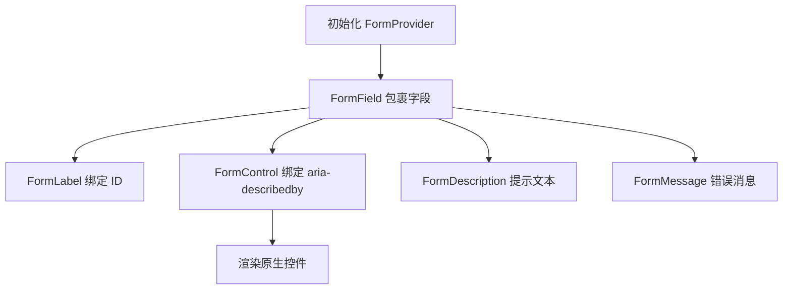
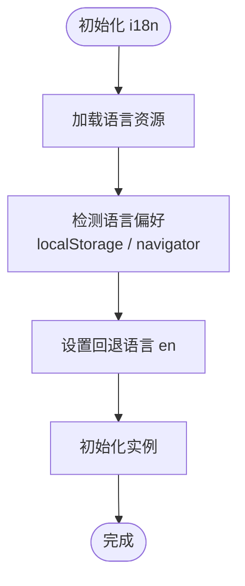
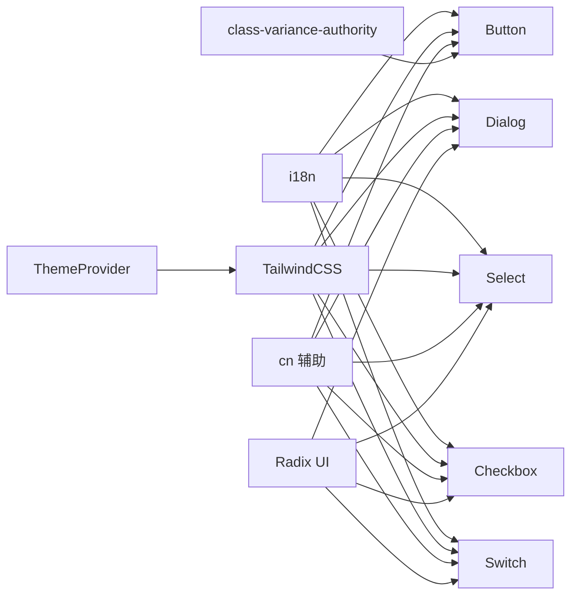

# UI 框架

<cite>
**本文引用的文件**
- [index.css](file://src/index.css)
- [tailwind.config.cjs](file://tailwind.config.cjs)
- [postcss.config.cjs](file://postcss.config.cjs)
- [button.tsx](file://src/components/ui/button.tsx)
- [dialog.tsx](file://src/components/ui/dialog.tsx)
- [form.tsx](file://src/components/ui/form.tsx)
- [table.tsx](file://src/components/ui/table.tsx)
- [input.tsx](file://src/components/ui/input.tsx)
- [select.tsx](file://src/components/ui/select.tsx)
- [checkbox.tsx](file://src/components/ui/checkbox.tsx)
- [switch.tsx](file://src/components/ui/switch.tsx)
- [card.tsx](file://src/components/ui/card.tsx)
- [theme-provider.tsx](file://src/components/theme-provider.tsx)
- [index.ts](file://src/i18n/index.ts)
- [en.json](file://src/i18n/locales/en.json)
- [zh.json](file://src/i18n/locales/zh.json)
</cite>

## 目录
1. [简介](#简介)
2. [项目结构](#项目结构)
3. [核心组件](#核心组件)
4. [架构总览](#架构总览)
5. [详细组件分析](#详细组件分析)
6. [依赖关系分析](#依赖关系分析)
7. [性能考量](#性能考量)
8. [故障排查指南](#故障排查指南)
9. [结论](#结论)
10. [附录](#附录)

## 简介
本文件面向 CC Switch 的 UI 框架，系统性阐述基于 TailwindCSS 的原子化样式体系、组件库设计与主题系统、国际化（i18n）机制，以及样式优化策略、浏览器兼容性与无障碍访问实践。文档以“渐进加深”的方式组织，既适合初学者理解整体架构，也便于资深工程师深入分析实现细节。

## 项目结构
UI 框架围绕“样式层 + 组件层 + 主题与国际化层”展开：
- 样式层：通过 TailwindCSS 提供原子化类名与设计令牌，结合 PostCSS 自动前缀与构建管线。
- 组件层：基于 Radix UI 构建语义化、可组合、可无障碍访问的基础 UI 组件。
- 主题与国际化：提供明/暗/跟随系统三种主题模式与多语言切换能力。

图表来源
- [tailwind.config.cjs:1-174](file://tailwind.config.cjs#L1-L174)
- [postcss.config.cjs:1-8](file://postcss.config.cjs#L1-L8)
- [index.css:1-194](file://src/index.css#L1-L194)
- [button.tsx:1-66](file://src/components/ui/button.tsx#L1-L66)
- [dialog.tsx:1-158](file://src/components/ui/dialog.tsx#L1-L158)
- [form.tsx:1-166](file://src/components/ui/form.tsx#L1-L166)
- [table.tsx:1-122](file://src/components/ui/table.tsx#L1-L122)
- [input.tsx:1-28](file://src/components/ui/input.tsx#L1-L28)
- [select.tsx:1-117](file://src/components/ui/select.tsx#L1-L117)
- [checkbox.tsx:1-29](file://src/components/ui/checkbox.tsx#L1-L29)
- [switch.tsx:1-27](file://src/components/ui/switch.tsx#L1-L27)
- [card.tsx:1-87](file://src/components/ui/card.tsx#L1-L87)
- [theme-provider.tsx:1-155](file://src/components/theme-provider.tsx#L1-L155)
- [index.ts:1-93](file://src/i18n/index.ts#L1-L93)

章节来源
- [tailwind.config.cjs:1-174](file://tailwind.config.cjs#L1-L174)
- [postcss.config.cjs:1-8](file://postcss.config.cjs#L1-L8)
- [index.css:1-194](file://src/index.css#L1-L194)

## 核心组件
本节概览 UI 组件库的关键构件及其职责：
- Button：提供多种视觉变体（默认/危险/轮廓/次级/幽灵/MCP/链接）与尺寸（默认/小/大/图标），统一聚焦环与禁用态。
- Dialog：提供遮罩层、内容区、标题、描述、页脚等结构化布局，支持层级映射与全屏变体。
- Form：基于 react-hook-form 的表单上下文，提供字段容器、标签、控件、描述与错误消息。
- Table：提供表格容器、表头/体/尾、行、单元格与标题/说明/注释。
- Input/Select/Checkbox/Switch/Card：基础输入、选择器、复选框、开关与卡片布局组件。

章节来源
- [button.tsx:1-66](file://src/components/ui/button.tsx#L1-L66)
- [dialog.tsx:1-158](file://src/components/ui/dialog.tsx#L1-L158)
- [form.tsx:1-166](file://src/components/ui/form.tsx#L1-L166)
- [table.tsx:1-122](file://src/components/ui/table.tsx#L1-L122)
- [input.tsx:1-28](file://src/components/ui/input.tsx#L1-L28)
- [select.tsx:1-117](file://src/components/ui/select.tsx#L1-L117)
- [checkbox.tsx:1-29](file://src/components/ui/checkbox.tsx#L1-L29)
- [switch.tsx:1-27](file://src/components/ui/switch.tsx#L1-L27)
- [card.tsx:1-87](file://src/components/ui/card.tsx#L1-L87)

## 架构总览
UI 框架采用“样式即设计令牌 + 组件即组合”的架构：
- 设计令牌：通过 CSS 变量集中管理背景、前景、主色、次色、边框、输入、环等，支持明/暗两套值。
- 原子化样式：TailwindCSS 将设计令牌映射为类名，组件内部仅拼装类名，实现高内聚低耦合。
- 组件组合：每个组件暴露受控属性与可选的变体/尺寸，通过 cn 辅助函数合并类名。
- 主题系统：ThemeProvider 统一管理主题状态、持久化与系统跟随，动态切换根元素类名。
- 国际化：i18n 初始化语言检测、资源加载与回退策略，组件通过翻译键渲染文案。

图表来源
- [theme-provider.tsx:1-155](file://src/components/theme-provider.tsx#L1-L155)
- [button.tsx:1-66](file://src/components/ui/button.tsx#L1-L66)
- [dialog.tsx:1-158](file://src/components/ui/dialog.tsx#L1-L158)
- [form.tsx:1-166](file://src/components/ui/form.tsx#L1-L166)
- [table.tsx:1-122](file://src/components/ui/table.tsx#L1-L122)
- [input.tsx:1-28](file://src/components/ui/input.tsx#L1-L28)
- [select.tsx:1-117](file://src/components/ui/select.tsx#L1-L117)
- [checkbox.tsx:1-29](file://src/components/ui/checkbox.tsx#L1-L29)
- [switch.tsx:1-27](file://src/components/ui/switch.tsx#L1-L27)
- [card.tsx:1-87](file://src/components/ui/card.tsx#L1-L87)

## 详细组件分析

### 样式系统与主题
- 设计令牌与颜色变量
  - 在基础层中定义 :root 与 .dark 两套 CSS 变量，覆盖背景、前景、卡片、弹窗、主/次、静音/强调、破坏性、边框、输入、环等。
  - Tailwind 配置将这些变量映射为颜色与阴影、圆角、字体族、动画等扩展。
- 原子化类名与组合
  - 组件内部通过 cn 合并类名，结合 Tailwind 原子类实现一致的视觉与交互。
- 主题系统
  - ThemeProvider 支持 light/dark/system，默认 system；主题变更持久化至 localStorage；监听系统主题变化；与原生窗口主题联动（Tauri）。

图表来源
- [theme-provider.tsx:27-128](file://src/components/theme-provider.tsx#L27-L128)
- [index.css:5-61](file://src/index.css#L5-L61)
- [tailwind.config.cjs:4-41](file://tailwind.config.cjs#L4-L41)

章节来源
- [index.css:1-194](file://src/index.css#L1-L194)
- [tailwind.config.cjs:1-174](file://tailwind.config.cjs#L1-L174)
- [postcss.config.cjs:1-8](file://postcss.config.cjs#L1-L8)
- [theme-provider.tsx:1-155](file://src/components/theme-provider.tsx#L1-L155)

### Button 组件
- 变体与尺寸
  - 变体：default（主）、destructive（危险）、outline（轮廓）、secondary（次）、ghost（幽灵）、mcp（MCP 专属）、link（链接）。
  - 尺寸：default/sm/lg/icon。
- 行为特性
  - 统一的圆角、字体、过渡与聚焦环；禁用态统一透明度与事件拦截。
- 使用建议
  - 优先使用变体表达语义，使用尺寸控制密度；必要时通过 asChild 与 Slot 实现语义化包裹。

图表来源
- [button.tsx:6-43](file://src/components/ui/button.tsx#L6-L43)

章节来源
- [button.tsx:1-66](file://src/components/ui/button.tsx#L1-L66)

### Dialog 组件
- 结构化布局
  - Overlay/Portal/Content/Header/Footer/Title/Description/Close。
- 层级与变体
  - zIndex 映射：base/nested/alert/top；Content 支持 default/fullscreen 两种变体。
- 交互细节
  - 内置动画入场/出场与缩放/滑入滑出；可阻止点击遮罩关闭。
- 最佳实践
  - 使用 Portal 渲染到文档根部，避免父级裁剪；合理设置 zIndex 以避免层级冲突。

图表来源
- [dialog.tsx:13-89](file://src/components/ui/dialog.tsx#L13-L89)

章节来源
- [dialog.tsx:1-158](file://src/components/ui/dialog.tsx#L1-L158)

### Form 组件
- 上下文与钩子
  - FormProvider、FormField、useFormField 提供字段上下文、ID 生成与错误传播。
- 表单元素
  - FormLabel、FormControl、FormDescription、FormMessage 与原生控件组合。
- 无障碍与可访问性
  - 自动绑定 aria-describedby 与错误 ID，聚焦时展示环。
- 使用建议
  - 与 react-hook-form 深度集成，统一错误渲染与交互反馈。

图表来源
- [form.tsx:14-155](file://src/components/ui/form.tsx#L14-L155)

章节来源
- [form.tsx:1-166](file://src/components/ui/form.tsx#L1-L166)

### Table 组件
- 容器与结构
  - Table 包裹滚动容器；TableHeader/TableBody/TableFooter；TableRow/TableCell；TableCaption。
- 交互与状态
  - 行悬停与选中态；边框与分隔线；可选全宽滚动。
- 最佳实践
  - 长列表配合固定表头/体；在移动端可通过横向滚动容器适配。

章节来源
- [table.tsx:1-122](file://src/components/ui/table.tsx#L1-L122)

### Input/Select/Checkbox/Switch/Card
- Input：统一边框、背景、占位符与聚焦环；禁用态与自动纠错关闭。
- Select：触发器、内容区、滚动按钮、选项项与分隔符；支持 popper 定位。
- Checkbox：对齐指示器与禁用态；与表单上下文协同。
- Switch：开关态切换与拇指位移；支持明/暗主题下的颜色差异。
- Card：卡片容器与头部/主体/底部结构化布局。

章节来源
- [input.tsx:1-28](file://src/components/ui/input.tsx#L1-L28)
- [select.tsx:1-117](file://src/components/ui/select.tsx#L1-L117)
- [checkbox.tsx:1-29](file://src/components/ui/checkbox.tsx#L1-L29)
- [switch.tsx:1-27](file://src/components/ui/switch.tsx#L1-L27)
- [card.tsx:1-87](file://src/components/ui/card.tsx#L1-L87)

### 国际化（i18n）
- 语言检测与回退
  - 优先读取 localStorage；否则根据 navigator.language 与 navigator.languages 推断 zh/zh-TW/ja/en；默认 zh。
- 资源加载
  - 加载 en/ja/zh/zh-TW 四种语言包，按 lng 初始化。
- 使用建议
  - 组件通过翻译键渲染文案；复杂参数使用模板占位符；开发阶段可开启 debug 观察缺失键。

图表来源
- [index.ts:13-90](file://src/i18n/index.ts#L13-L90)
- [en.json:1-800](file://src/i18n/locales/en.json#L1-L800)
- [zh.json:1-800](file://src/i18n/locales/zh.json#L1-L800)

章节来源
- [index.ts:1-93](file://src/i18n/index.ts#L1-L93)

## 依赖关系分析
- 组件依赖
  - 组件普遍依赖 Radix UI（如 Dialog、Select、Checkbox、Switch）与 class-variance-authority（CVA）生成变体类名。
  - 组件通过 cn 辅助函数合并类名，确保样式一致性。
- 样式依赖
  - TailwindCSS 依赖 PostCSS autoprefixer；CSS 变量与设计令牌在基础层集中定义。
- 主题与国际化
  - 主题系统与组件样式强耦合；国际化与文案键解耦，组件仅消费翻译键。

图表来源
- [button.tsx:1-66](file://src/components/ui/button.tsx#L1-L66)
- [dialog.tsx:1-158](file://src/components/ui/dialog.tsx#L1-L158)
- [select.tsx:1-117](file://src/components/ui/select.tsx#L1-L117)
- [checkbox.tsx:1-29](file://src/components/ui/checkbox.tsx#L1-L29)
- [switch.tsx:1-27](file://src/components/ui/switch.tsx#L1-L27)
- [index.css:1-194](file://src/index.css#L1-L194)
- [tailwind.config.cjs:1-174](file://tailwind.config.cjs#L1-L174)
- [theme-provider.tsx:1-155](file://src/components/theme-provider.tsx#L1-L155)
- [index.ts:1-93](file://src/i18n/index.ts#L1-L93)

章节来源
- [button.tsx:1-66](file://src/components/ui/button.tsx#L1-L66)
- [dialog.tsx:1-158](file://src/components/ui/dialog.tsx#L1-L158)
- [select.tsx:1-117](file://src/components/ui/select.tsx#L1-L117)
- [checkbox.tsx:1-29](file://src/components/ui/checkbox.tsx#L1-L29)
- [switch.tsx:1-27](file://src/components/ui/switch.tsx#L1-L27)
- [index.css:1-194](file://src/index.css#L1-L194)
- [tailwind.config.cjs:1-174](file://tailwind.config.cjs#L1-L174)
- [theme-provider.tsx:1-155](file://src/components/theme-provider.tsx#L1-L155)
- [index.ts:1-93](file://src/i18n/index.ts#L1-L93)

## 性能考量
- 原子化样式与类名拼装
  - Tailwind 原子类减少重复样式定义，提升构建效率；组件内部仅拼装必要类名，避免过度渲染。
- 动画与过渡
  - 使用 CSS 动画与过渡替代 JS 动画，降低主线程压力；适度使用 backdrop-filter 时注意性能影响。
- 主题切换
  - 通过根元素类名切换，避免逐元素重绘；系统跟随模式仅在必要时更新。
- 国际化
  - 资源按需加载，避免一次性加载全部语言包；生产环境关闭 debug。

## 故障排查指南
- 主题不生效
  - 检查 localStorage 是否写入；确认根元素类名是否包含 light/dark；系统模式下是否监听到媒体查询变化。
- 对话框层级异常
  - 检查 zIndex 参数映射；确认 Portal 是否正确挂载到根节点；Overlay 是否阻止了交互。
- 表单错误不显示
  - 确认 FormProvider 是否包裹；FormField 是否在 FormFieldContext 内；useFormField 是否正确调用。
- 字体与滚动条
  - 检查基础样式是否引入；滚动条隐藏与焦点环样式是否被覆盖。
- 国际化文案缺失
  - 检查翻译键是否存在；语言检测逻辑是否命中预期；回退语言是否正确。

章节来源
- [theme-provider.tsx:74-96](file://src/components/theme-provider.tsx#L74-L96)
- [dialog.tsx:18-37](file://src/components/ui/dialog.tsx#L18-L37)
- [form.tsx:40-61](file://src/components/ui/form.tsx#L40-L61)
- [index.css:148-154](file://src/index.css#L148-L154)
- [index.ts:89-90](file://src/i18n/index.ts#L89-L90)

## 结论
CC Switch 的 UI 框架以 TailwindCSS 为核心，结合 Radix UI 与 CVA，实现了高内聚、可组合、可无障碍访问的组件体系；通过 CSS 变量与主题系统，提供了灵活的主题切换与一致的视觉体验；i18n 机制支持多语言与回退策略，满足全球化需求。整体架构清晰、扩展性强，适合在复杂业务场景中持续演进。

## 附录
- 样式优化策略
  - 优先使用原子类，减少自定义 CSS；合理拆分组件，避免过度嵌套；利用 Tailwind 的 content 配置仅打包使用到的类。
- CSS-in-JS 方案
  - 当前以静态 CSS 为主；如需动态样式，可考虑在组件内部通过内联样式或 CSS 变量实现，但需权衡可维护性与性能。
- 浏览器兼容性
  - 通过 PostCSS autoprefixer 自动添加厂商前缀；关注 CSS 变量与媒体查询在旧版浏览器的行为差异。
- 移动端适配
  - 使用 Tailwind 响应式断点；为触摸目标设置足够尺寸；避免使用仅鼠标交互的组件。
- 无障碍访问
  - 为交互元素提供语义化标签；确保键盘可达与焦点可见；为表单控件绑定描述与错误信息。