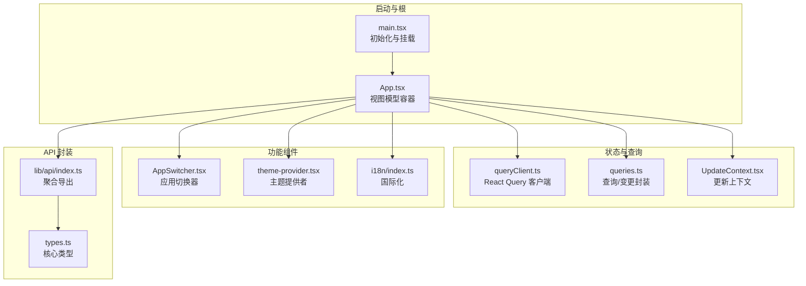
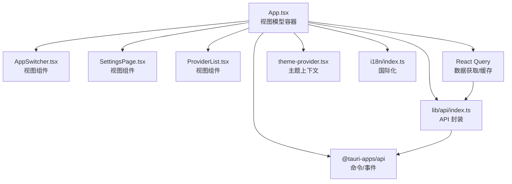
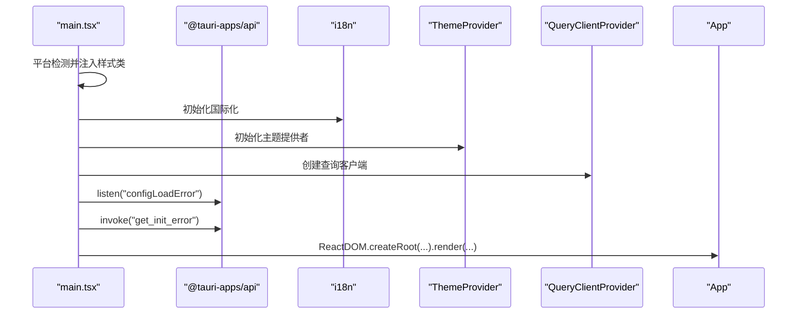
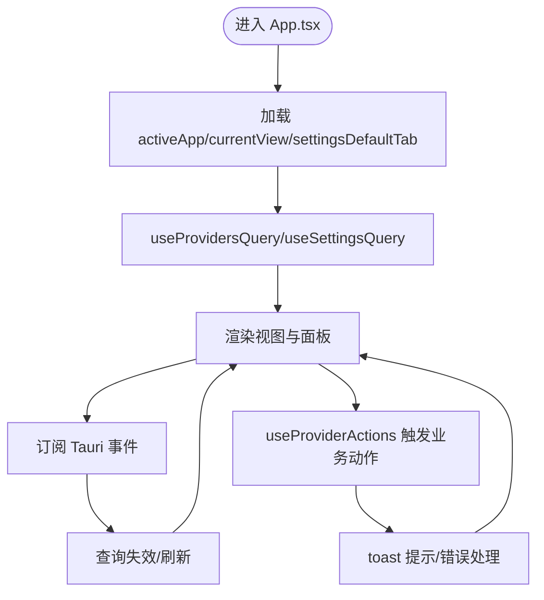
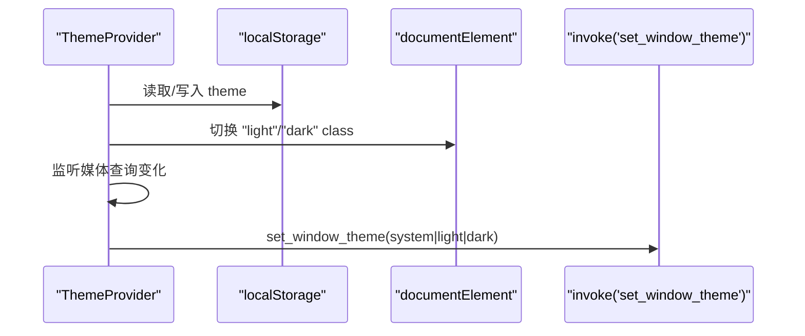
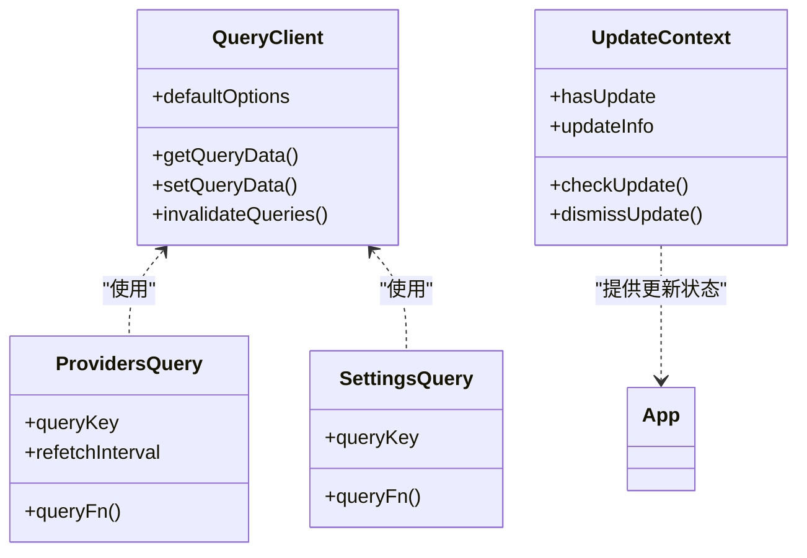
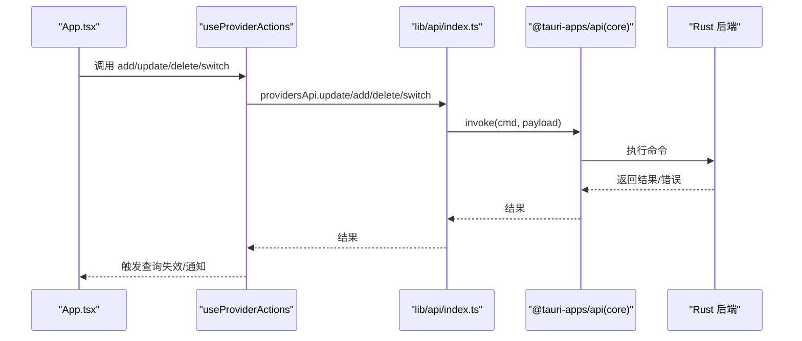
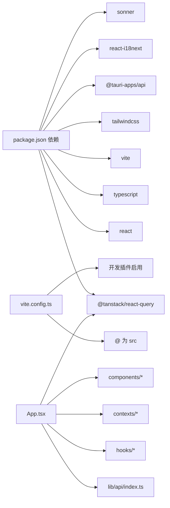

# 前端架构

<cite>
**本文引用的文件**
- [src/main.tsx](file://src/main.tsx)
- [src/App.tsx](file://src/App.tsx)
- [vite.config.ts](file://vite.config.ts)
- [package.json](file://package.json)
- [tailwind.config.cjs](file://tailwind.config.cjs)
- [src/lib/query/index.ts](file://src/lib/query/index.ts)
- [src/lib/query/queryClient.ts](file://src/lib/query/queryClient.ts)
- [src/lib/query/queries.ts](file://src/lib/query/queries.ts)
- [src/components/theme-provider.tsx](file://src/components/theme-provider.tsx)
- [src/i18n/index.ts](file://src/i18n/index.ts)
- [src/hooks/useProviderActions.ts](file://src/hooks/useProviderActions.ts)
- [src/lib/api/index.ts](file://src/lib/api/index.ts)
- [src/types.ts](file://src/types.ts)
- [src/components/AppSwitcher.tsx](file://src/components/AppSwitcher.tsx)
- [src/contexts/UpdateContext.tsx](file://src/contexts/UpdateContext.tsx)
</cite>

## 目录
1. [简介](#简介)
2. [项目结构](#项目结构)
3. [核心组件](#核心组件)
4. [架构总览](#架构总览)
5. [详细组件分析](#详细组件分析)
6. [依赖关系分析](#依赖关系分析)
7. [性能考量](#性能考量)
8. [故障排查指南](#故障排查指南)
9. [结论](#结论)
10. [附录](#附录)

## 简介
本文件面向 CC Switch 项目的前端架构，围绕 React 18 + TypeScript + Vite + TailwindCSS 技术栈，系统阐述 MVVM 架构思想在前端的落地方式，包括组件化设计原则、状态管理模式（React Query + 自定义上下文）、路由系统设计（视图切换）、组件层次结构（从根组件 App.tsx 到功能面板）、前后端通信机制（Tauri 命令调用与 API 封装）、国际化与主题系统、响应式设计、组件生命周期管理、性能优化与内存管理最佳实践。

## 项目结构
前端位于 src 目录，采用“按功能域分层 + 组件化”的组织方式：
- 根入口与启动流程：main.tsx 负责初始化国际化、主题、查询客户端、Tauri 事件监听与应用挂载。
- 核心容器：App.tsx 作为 MVVM 的“视图模型”容器，协调状态、事件与子组件。
- 功能模块：components 下按领域拆分（providers、settings、prompts、skills、mcp、sessions、workspace、openclaw、hermes 等）。
- 查询与状态：lib/query 提供 React Query 客户端、查询与变更封装；自定义 UpdateContext 管理更新提示。
- API 封装：lib/api 汇聚各领域 API（providers、settings、usage、sessions 等），统一对外接口。
- 国际化与主题：i18n 与 theme-provider 实现语言与主题系统。
- 工具与类型：types.ts 定义核心类型；utils、hooks 提供工具函数与业务钩子。

图表来源
- [src/main.tsx:1-104](file://src/main.tsx#L1-L104)
- [src/App.tsx:1-1621](file://src/App.tsx#L1-L1621)
- [src/lib/query/queryClient.ts:1-15](file://src/lib/query/queryClient.ts#L1-L15)
- [src/lib/query/queries.ts:1-156](file://src/lib/query/queries.ts#L1-L156)
- [src/contexts/UpdateContext.tsx:1-156](file://src/contexts/UpdateContext.tsx#L1-L156)
- [src/components/AppSwitcher.tsx:1-131](file://src/components/AppSwitcher.tsx#L1-L131)
- [src/components/theme-provider.tsx:1-155](file://src/components/theme-provider.tsx#L1-L155)
- [src/i18n/index.ts:1-93](file://src/i18n/index.ts#L1-L93)
- [src/lib/api/index.ts:1-31](file://src/lib/api/index.ts#L1-L31)
- [src/types.ts:1-709](file://src/types.ts#L1-L709)

章节来源
- [src/main.tsx:1-104](file://src/main.tsx#L1-L104)
- [src/App.tsx:1-1621](file://src/App.tsx#L1-L1621)
- [vite.config.ts:1-33](file://vite.config.ts#L1-L33)
- [package.json:1-96](file://package.json#L1-L96)
- [tailwind.config.cjs:1-174](file://tailwind.config.cjs#L1-L174)

## 核心组件
- 根入口 main.tsx
  - 初始化国际化、主题、查询客户端、全局 Toaster。
  - 订阅 Tauri 事件（配置加载错误、初始化错误），必要时强制退出。
  - 在 StrictMode 下挂载应用树。
- 核心容器 App.tsx
  - 维护应用与视图状态（activeApp、currentView、settingsDefaultTab 等）。
  - 通过 useProvidersQuery/useSettingsQuery 等查询获取数据，驱动视图渲染。
  - 通过 useProviderActions 等业务钩子封装动作，统一错误处理与通知。
  - 监听 Tauri 事件，触发查询失效与 UI 通知。
  - 管理窗口状态（最大化、装饰）、环境冲突提示、迁移结果提示等。
- 主题与国际化
  - theme-provider.tsx：系统/浅色/深色主题切换，持久化与原生窗口主题同步。
  - i18n/index.ts：多语言资源加载、语言偏好检测与回退策略。
- 查询与状态
  - queryClient.ts：统一的 React Query 客户端配置（重试、过期策略）。
  - queries.ts：供应商列表、设置、用量、会话等查询封装，含自动刷新与缓存策略。
  - UpdateContext.tsx：应用更新检查与提示状态管理。
- API 封装
  - lib/api/index.ts：聚合导出各领域 API（providers、settings、usage、sessions 等）。
  - types.ts：定义 Provider、Settings、Usage、Session 等核心类型。

章节来源
- [src/main.tsx:1-104](file://src/main.tsx#L1-L104)
- [src/App.tsx:164-596](file://src/App.tsx#L164-L596)
- [src/components/theme-provider.tsx:1-155](file://src/components/theme-provider.tsx#L1-L155)
- [src/i18n/index.ts:1-93](file://src/i18n/index.ts#L1-L93)
- [src/lib/query/queryClient.ts:1-15](file://src/lib/query/queryClient.ts#L1-L15)
- [src/lib/query/queries.ts:54-156](file://src/lib/query/queries.ts#L54-L156)
- [src/contexts/UpdateContext.tsx:31-156](file://src/contexts/UpdateContext.tsx#L31-L156)
- [src/lib/api/index.ts:1-31](file://src/lib/api/index.ts#L1-L31)
- [src/types.ts:11-427](file://src/types.ts#L11-L427)

## 架构总览
MVVM 在前端的体现：
- Model：React Query 管理的数据模型（供应商、设置、用量、会话等），配合 lib/api 与 Rust 后端交互。
- ViewModel：App.tsx 作为视图模型容器，负责状态聚合、事件处理、副作用管理与 UI 逻辑编排。
- View：组件层级（AppSwitcher、ProviderList、SettingsPage 等）呈现数据与交互。
- Binding：通过 React 状态、Context、事件监听与查询失效实现双向绑定。

图表来源
- [src/App.tsx:164-596](file://src/App.tsx#L164-L596)
- [src/components/AppSwitcher.tsx:1-131](file://src/components/AppSwitcher.tsx#L1-L131)
- [src/lib/api/index.ts:1-31](file://src/lib/api/index.ts#L1-L31)
- [src/lib/query/queries.ts:54-156](file://src/lib/query/queries.ts#L54-L156)
- [src/components/theme-provider.tsx:1-155](file://src/components/theme-provider.tsx#L1-L155)
- [src/i18n/index.ts:1-93](file://src/i18n/index.ts#L1-L93)

## 详细组件分析

### 根入口与启动流程（main.tsx）
- 平台检测：根据 UA/Platform 为 body 添加类名，便于平台样式适配。
- 初始化：国际化、主题提供者、查询客户端、全局 Toaster。
- 事件订阅：监听后端配置加载错误事件，必要时弹窗并退出。
- 启动早期：通过 invoke 获取初始化错误，避免竞态。
- 挂载：StrictMode 包裹，QueryClientProvider + ThemeProvider + UpdateProvider + App + Toaster。

图表来源
- [src/main.tsx:17-104](file://src/main.tsx#L17-L104)

章节来源
- [src/main.tsx:1-104](file://src/main.tsx#L1-L104)

### 视图模型容器（App.tsx）
- 状态管理
  - 应用与视图：activeApp、currentView、settingsDefaultTab、isWindowMaximized。
  - 可见应用：根据 settingsData.visibleApps 决定可用应用集合。
  - 环境冲突：启动与切换时检查冲突，弹出横幅提示。
  - 迁移结果：启动后检查配置与技能迁移结果，toast 提示。
- 数据查询
  - useProvidersQuery：按应用维度获取供应商列表与当前供应商 ID，代理运行时 10s 自动刷新。
  - useSettingsQuery：获取设置，驱动窗口装饰、代理状态等。
  - useUsageQuery：用量查询，支持自动刷新与后台刷新。
  - useSessionsQuery/useSessionMessagesQuery：会话列表与消息查询。
- 业务动作
  - useProviderActions：封装新增/更新/删除/切换供应商、保存用量脚本、设置默认模型等。
  - 代理接管与官方供应商限制：在切换时校验并提示。
- 事件与副作用
  - 订阅 providersApi.onSwitched、universal-provider-synced、webdav/s3 同步状态等事件，触发查询失效与 toast。
  - 窗口状态同步：最大化状态监听与原生窗口装饰同步。
- UI 交互
  - AppSwitcher：应用切换与徽标提示。
  - 各功能面板：Providers、Settings、Prompts、Skills、MCP、Sessions、Workspace、OpenClaw、Hermes 等。

图表来源
- [src/App.tsx:164-596](file://src/App.tsx#L164-L596)
- [src/hooks/useProviderActions.ts:31-393](file://src/hooks/useProviderActions.ts#L31-L393)
- [src/lib/query/queries.ts:54-156](file://src/lib/query/queries.ts#L54-L156)

章节来源
- [src/App.tsx:164-596](file://src/App.tsx#L164-L596)
- [src/hooks/useProviderActions.ts:31-393](file://src/hooks/useProviderActions.ts#L31-L393)
- [src/lib/query/queries.ts:54-156](file://src/lib/query/queries.ts#L54-L156)

### 主题系统（theme-provider.tsx）
- 支持 light/dark/system 三种模式，持久化到 localStorage。
- 根节点 class 切换，媒体查询监听系统主题变化。
- 通过 invoke 同步原生窗口主题（Windows/macOS 标题栏）。

图表来源
- [src/components/theme-provider.tsx:27-128](file://src/components/theme-provider.tsx#L27-L128)

章节来源
- [src/components/theme-provider.tsx:1-155](file://src/components/theme-provider.tsx#L1-L155)

### 国际化（i18n/index.ts）
- 资源：zh、zh-TW、en、ja。
- 语言选择：localStorage > 浏览器语言 > 回退 en。
- 配置：禁用转义、开发模式可开启调试。

章节来源
- [src/i18n/index.ts:1-93](file://src/i18n/index.ts#L1-L93)

### 状态管理（React Query + 自定义上下文）
- React Query
  - queryClient.ts：默认重试、窗口聚焦刷新、过期策略。
  - queries.ts：供应商、设置、用量、会话等查询封装，含自动刷新与缓存时间控制。
- 自定义上下文
  - UpdateContext.tsx：应用更新检查、提示状态与持久化。

图表来源
- [src/lib/query/queryClient.ts:1-15](file://src/lib/query/queryClient.ts#L1-L15)
- [src/lib/query/queries.ts:54-156](file://src/lib/query/queries.ts#L54-L156)
- [src/contexts/UpdateContext.tsx:31-156](file://src/contexts/UpdateContext.tsx#L31-L156)

章节来源
- [src/lib/query/queryClient.ts:1-15](file://src/lib/query/queryClient.ts#L1-L15)
- [src/lib/query/queries.ts:54-156](file://src/lib/query/queries.ts#L54-L156)
- [src/contexts/UpdateContext.tsx:31-156](file://src/contexts/UpdateContext.tsx#L31-L156)

### API 封装与前后端通信
- API 聚合：lib/api/index.ts 汇总 providers、settings、usage、sessions 等。
- 通信方式：
  - Tauri 命令：invoke 调用后端命令（如 get_init_error、get_migration_result）。
  - 事件：listen 订阅后端事件（configLoadError、universal-provider-synced、同步状态等）。
  - 业务封装：useProviderActions 等钩子对 API 调用进行统一封装与错误处理。

图表来源
- [src/hooks/useProviderActions.ts:31-393](file://src/hooks/useProviderActions.ts#L31-L393)
- [src/lib/api/index.ts:1-31](file://src/lib/api/index.ts#L1-L31)
- [src/App.tsx:339-363](file://src/App.tsx#L339-L363)

章节来源
- [src/hooks/useProviderActions.ts:31-393](file://src/hooks/useProviderActions.ts#L31-L393)
- [src/lib/api/index.ts:1-31](file://src/lib/api/index.ts#L1-L31)
- [src/App.tsx:339-363](file://src/App.tsx#L339-L363)

### 组件层次结构与路由设计
- 视图枚举：providers、settings、prompts、skills、skillsDiscovery、mcp、agents、universal、sessions、workspace、openclawEnv、openclawTools、openclawAgents、hermesMemory。
- 视图切换：currentView 状态与键盘快捷键（Esc 返回 providers/skillsDiscovery）。
- 应用切换：AppSwitcher.tsx 基于 visibleApps 控制可用应用集合。
- 视图与应用耦合：部分视图仅对特定应用开放（如 sessions 仅对 claude/codex/opencode/openclaw/gemini/hermes 支持）。

章节来源
- [src/App.tsx:94-162](file://src/App.tsx#L94-L162)
- [src/components/AppSwitcher.tsx:21-67](file://src/components/AppSwitcher.tsx#L21-L67)

### 国际化与主题系统
- 国际化：i18n/index.ts 加载多语言资源，按用户偏好与系统语言选择语言。
- 主题：theme-provider.tsx 支持系统跟随、浅色、深色，持久化与原生窗口主题同步。

章节来源
- [src/i18n/index.ts:1-93](file://src/i18n/index.ts#L1-L93)
- [src/components/theme-provider.tsx:1-155](file://src/components/theme-provider.tsx#L1-L155)

### 响应式设计
- TailwindCSS：content 覆盖 src 下所有文件，darkMode 使用 selector 选择器，自定义颜色、阴影、圆角、动画与字体栈。
- 组件层面：通过类名组合实现响应式布局与紧凑/展开模式（如 AppSwitcher 的 compact）。

章节来源
- [tailwind.config.cjs:1-174](file://tailwind.config.cjs#L1-L174)
- [src/components/AppSwitcher.tsx:120-125](file://src/components/AppSwitcher.tsx#L120-L125)

## 依赖关系分析
- 技术栈依赖：React 18、TypeScript、Vite、TailwindCSS、@tanstack/react-query、@tauri-apps/*、react-i18next、sonner 等。
- 构建配置：Vite 配置别名 @ 指向 src，开发时启用 code-inspector 插件，生产构建输出 dist。
- 依赖耦合：
  - App.tsx 依赖 queryClient、queries、api、hooks、contexts、components。
  - hooks 依赖 api 与 queryClient；api 依赖 @tauri-apps/api。
  - theme-provider 与 i18n 为基础层，被上层组件依赖。

图表来源
- [package.json:42-94](file://package.json#L42-L94)
- [vite.config.ts:6-31](file://vite.config.ts#L6-L31)
- [src/App.tsx:1-1621](file://src/App.tsx#L1-L1621)
- [src/lib/api/index.ts:1-31](file://src/lib/api/index.ts#L1-L31)

章节来源
- [package.json:1-96](file://package.json#L1-L96)
- [vite.config.ts:1-33](file://vite.config.ts#L1-L33)

## 性能考量
- 查询缓存与过期
  - queryClient 默认 staleTime=0、refetchOnWindowFocus=true，避免陈旧数据。
  - 供应商列表在代理运行时 10s 自动刷新，确保实时性。
  - 用量查询根据 autoQueryInterval 动态设置 staleTime 与 refetchInterval，后台继续刷新。
- GC 与内存
  - 用量查询 gcTime=10 分钟，减少内存占用。
  - keepPreviousData 用于平滑切换，避免闪烁。
- UI 响应
  - Framer Motion 动画与紧凑布局（toolbar 自适应）提升交互体验。
  - Toast 统一错误与成功提示，避免阻塞主流程。
- 构建与开发
  - Vite 开发服务器端口固定，严格端口避免冲突。
  - code-inspector 插件仅在开发启用，降低生产体积。

章节来源
- [src/lib/query/queryClient.ts:3-14](file://src/lib/query/queryClient.ts#L3-L14)
- [src/lib/query/queries.ts:60-135](file://src/lib/query/queries.ts#L60-L135)
- [src/App.tsx:240-241](file://src/App.tsx#L240-L241)

## 故障排查指南
- 配置加载失败
  - 后端通过事件推送 configLoadError，前端弹窗并退出，避免损坏配置运行。
- 同步状态失败
  - 监听 webdav/s3 同步状态事件，自动失效设置查询并在 toast 中提示错误。
- 环境冲突
  - 启动与切换应用时检查冲突，弹出横幅并支持一次性隐藏。
- 迁移结果
  - 启动后检查配置与技能迁移结果，toast 成功/失败信息。
- 错误处理策略
  - 统一使用 extractErrorMessage 与 toast.error，避免未捕获异常。
  - 代理接管与官方供应商限制：切换前校验并提示风险。

章节来源
- [src/main.tsx:39-87](file://src/main.tsx#L39-L87)
- [src/App.tsx:365-404](file://src/App.tsx#L365-L404)
- [src/App.tsx:464-563](file://src/App.tsx#L464-L563)
- [src/hooks/useProviderActions.ts:210-230](file://src/hooks/useProviderActions.ts#L210-L230)

## 结论
CC Switch 前端以 MVVM 思想为核心，结合 React 18 + TypeScript + Vite + TailwindCSS，构建了高内聚、低耦合的组件体系。通过 React Query 实现高效的数据获取与缓存，配合自定义上下文与 API 封装，形成清晰的视图模型容器与视图层分工。Tauri 命令与事件机制无缝衔接后端能力，国际化与主题系统完善用户体验。整体架构具备良好的可维护性、可扩展性与性能表现。

## 附录
- 关键类型定义参考：Provider、Settings、Usage、Session、UniversalProvider、OpenClaw 等。
- 查询键与失效策略：按应用维度划分，代理运行时自动刷新，后台继续查询，合理设置 staleTime 与 gcTime。
- 组件命名规范：功能域/文件名语义明确，遵循领域分层与单一职责。

章节来源
- [src/types.ts:11-427](file://src/types.ts#L11-L427)
- [src/lib/query/queries.ts:54-156](file://src/lib/query/queries.ts#L54-L156)
- [src/components/AppSwitcher.tsx:1-131](file://src/components/AppSwitcher.tsx#L1-L131)