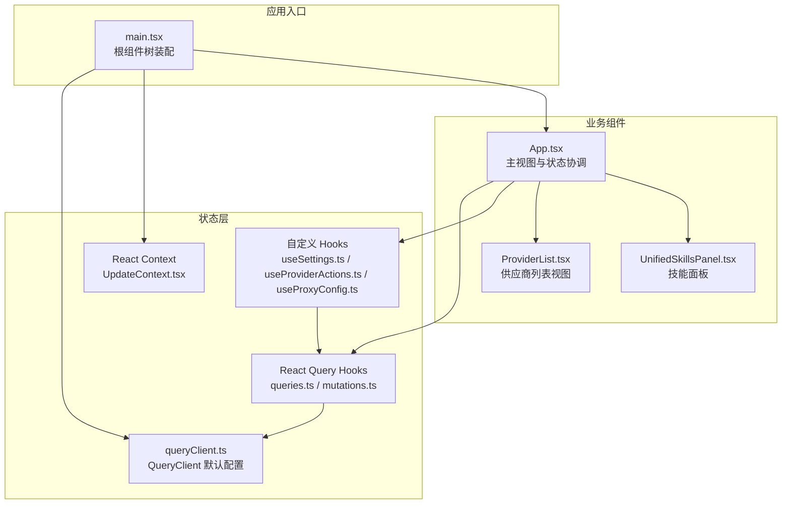
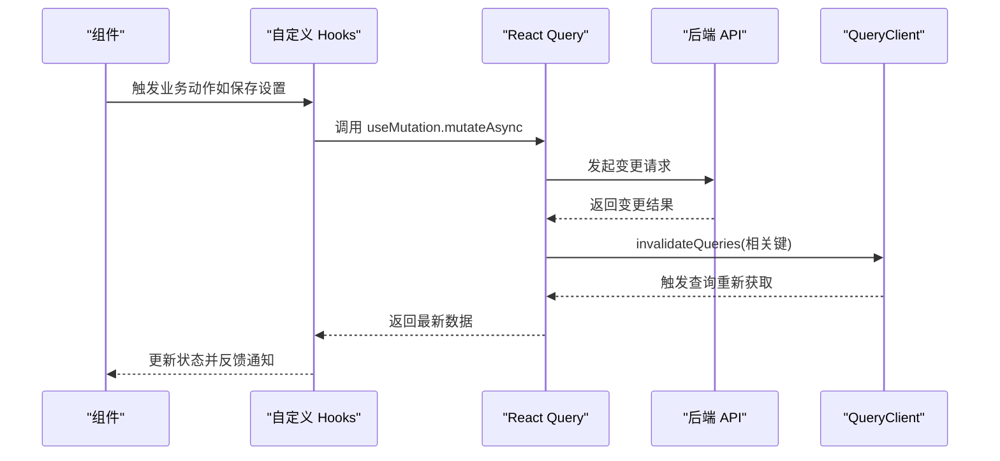
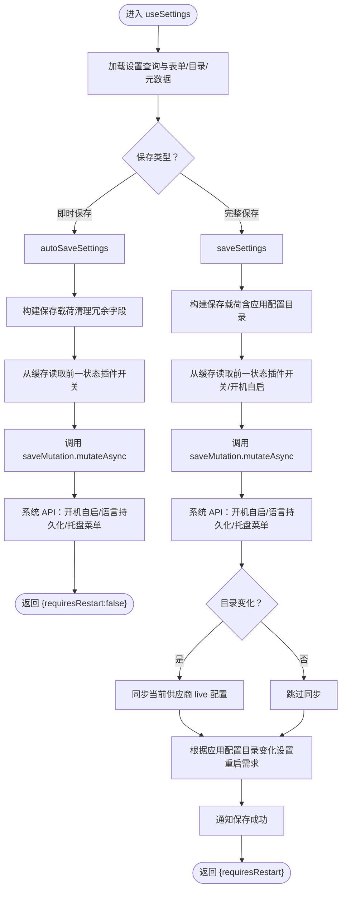
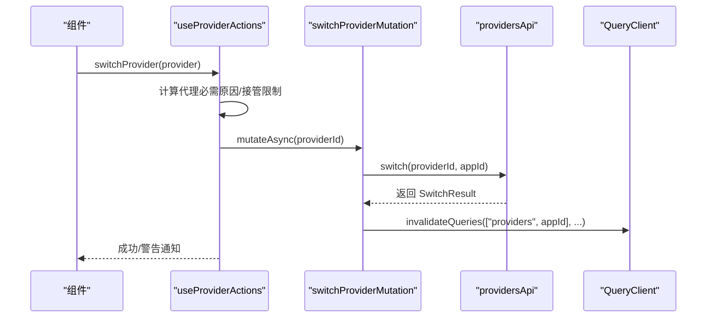
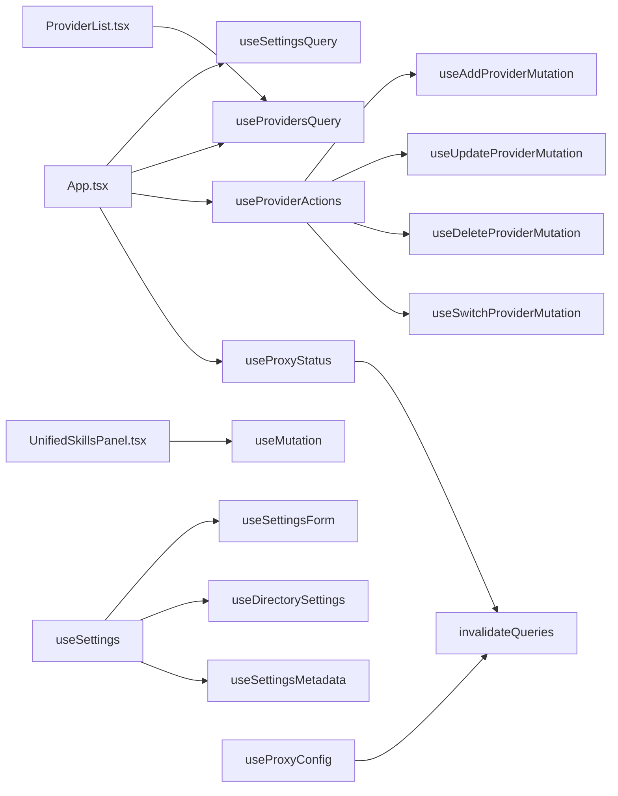

# 状态管理

<cite>
**本文引用的文件**
- [src/main.tsx](file://src/main.tsx)
- [src/App.tsx](file://src/App.tsx)
- [src/contexts/UpdateContext.tsx](file://src/contexts/UpdateContext.tsx)
- [src/hooks/useSettings.ts](file://src/hooks/useSettings.ts)
- [src/hooks/useSettingsForm.ts](file://src/hooks/useSettingsForm.ts)
- [src/hooks/useDirectorySettings.ts](file://src/hooks/useDirectorySettings.ts)
- [src/hooks/useSettingsMetadata.ts](file://src/hooks/useSettingsMetadata.ts)
- [src/hooks/useProviderActions.ts](file://src/hooks/useProviderActions.ts)
- [src/hooks/useProxyConfig.ts](file://src/hooks/useProxyConfig.ts)
- [src/hooks/useProxyStatus.ts](file://src/hooks/useProxyStatus.ts)
- [src/lib/query/index.ts](file://src/lib/query/index.ts)
- [src/lib/query/queryClient.ts](file://src/lib/query/queryClient.ts)
- [src/lib/query/queries.ts](file://src/lib/query/queries.ts)
- [src/lib/query/mutations.ts](file://src/lib/query/mutations.ts)
- [src/lib/query/proxy.ts](file://src/lib/query/proxy.ts)
- [src/lib/schemas/settings.ts](file://src/lib/schemas/settings.ts)
- [src/components/providers/ProviderList.tsx](file://src/components/providers/ProviderList.tsx)
- [src/components/skills/UnifiedSkillsPanel.tsx](file://src/components/skills/UnifiedSkillsPanel.tsx)
- [tests/hooks/useSettings.test.tsx](file://tests/hooks/useSettings.test.tsx)
- [tests/hooks/useAddProviderMutation.test.tsx](file://tests/hooks/useAddProviderMutation.test.tsx)
</cite>

## 目录
1. [简介](#简介)
2. [项目结构](#项目结构)
3. [核心组件](#核心组件)
4. [架构总览](#架构总览)
5. [详细组件分析](#详细组件分析)
6. [依赖关系分析](#依赖关系分析)
7. [性能考量](#性能考量)
8. [故障排查指南](#故障排查指南)
9. [结论](#结论)
10. [附录](#附录)

## 简介
本文件系统性梳理 CC Switch 的前端状态管理机制，重点覆盖以下方面：
- 多层次状态架构：React Query 状态缓存、Zustand（通过上下文）状态管理、React Context 上下文管理的组合使用
- 自定义 Hooks 设计模式：useSettings、useProviderActions、useProxyConfig 等的核心实现与职责边界
- 全局状态与局部状态划分原则、状态更新触发机制、状态持久化策略
- 状态规范化、缓存策略、并发状态更新处理最佳实践
- 状态调试工具、性能优化技巧、状态迁移策略

## 项目结构
CC Switch 的状态管理由三层协同构成：
- React Query 层：负责远端数据的获取、缓存、失效与并发控制，统一管理“全局状态”（设置、供应商、用量、会话等）
- 自定义 Hooks 层：对 React Query 的结果进行组合、封装与业务编排，形成“领域状态”（设置表单、目录、元数据、供应商动作、代理配置等）
- React Context 层：提供轻量、跨组件共享的状态（如更新提示），并结合本地存储实现“持久化 UI 状态”

图表来源
- [src/main.tsx:73-101](file://src/main.tsx#L73-L101)
- [src/lib/query/queryClient.ts:1-15](file://src/lib/query/queryClient.ts#L1-L15)
- [src/lib/query/queries.ts:1-156](file://src/lib/query/queries.ts#L1-L156)
- [src/lib/query/mutations.ts:1-373](file://src/lib/query/mutations.ts#L1-L373)
- [src/hooks/useSettings.ts:62-512](file://src/hooks/useSettings.ts#L62-L512)
- [src/hooks/useProviderActions.ts:31-393](file://src/hooks/useProviderActions.ts#L31-L393)
- [src/hooks/useProxyConfig.ts:14-49](file://src/hooks/useProxyConfig.ts#L14-L49)
- [src/contexts/UpdateContext.tsx:31-156](file://src/contexts/UpdateContext.tsx#L31-L156)
- [src/App.tsx:164-200](file://src/App.tsx#L164-L200)

章节来源
- [src/main.tsx:1-104](file://src/main.tsx#L1-L104)
- [src/App.tsx:164-200](file://src/App.tsx#L164-L200)
- [src/contexts/UpdateContext.tsx:31-156](file://src/contexts/UpdateContext.tsx#L31-L156)
- [src/lib/query/queryClient.ts:1-15](file://src/lib/query/queryClient.ts#L1-L15)

## 核心组件
- React Query 客户端与默认配置：集中定义重试、过期时间、窗口焦点重取等行为，确保全局一致性
- 查询与变更钩子：封装对远端 API 的调用，统一处理成功/失败后的缓存失效与 UI 通知
- 自定义 Hooks：将多个查询/变更组合为业务语义明确的状态与动作，如设置表单、目录管理、元数据、供应商动作、代理配置
- React Context：提供轻量持久化 UI 状态（如更新提示），避免跨层级传递

章节来源
- [src/lib/query/index.ts:1-6](file://src/lib/query/index.ts#L1-L6)
- [src/lib/query/queries.ts:90-156](file://src/lib/query/queries.ts#L90-L156)
- [src/lib/query/mutations.ts:361-373](file://src/lib/query/mutations.ts#L361-L373)
- [src/hooks/useSettings.ts:62-512](file://src/hooks/useSettings.ts#L62-L512)
- [src/hooks/useProviderActions.ts:31-393](file://src/hooks/useProviderActions.ts#L31-L393)
- [src/hooks/useProxyConfig.ts:14-49](file://src/hooks/useProxyConfig.ts#L14-L49)
- [src/contexts/UpdateContext.tsx:31-156](file://src/contexts/UpdateContext.tsx#L31-L156)

## 架构总览
CC Switch 的状态管理采用“查询驱动 + 领域组合 + 轻量上下文”的分层架构：
- 查询驱动：通过 useQuery/useMutation 管理远端数据，配合 queryClient.invalidateQueries 实现精确失效
- 领域组合：useSettings、useProviderActions、useProxyConfig 等将查询、变更与业务逻辑整合，暴露简洁的接口
- 轻量上下文：UpdateContext 管理更新提示等 UI 状态，结合 localStorage 实现持久化

图表来源
- [src/hooks/useSettings.ts:309-484](file://src/hooks/useSettings.ts#L309-L484)
- [src/lib/query/mutations.ts:361-373](file://src/lib/query/mutations.ts#L361-L373)
- [src/lib/query/queries.ts:90-95](file://src/lib/query/queries.ts#L90-L95)

## 详细组件分析

### useSettings：设置状态组合层
- 职责边界
  - 组合 useSettingsForm、useDirectorySettings、useSettingsMetadata，形成统一的设置状态与动作
  - 实现即时保存与完整保存两种策略，分别处理不同场景下的副作用与系统 API 调用
- 关键实现要点
  - 使用 queryClient.getQueryData 在 mutate 前捕获实时缓存值，避免闭包中的数据滞后导致竞态
  - 对 Claude 插件集成、开机自启、语言偏好、托盘菜单等进行细粒度同步
  - 通过 saveMutation.invalidateQueries 保证远端与本地状态一致
- 状态持久化
  - 语言偏好持久化到 localStorage
  - 便携模式与重启需求等元数据通过本地状态与 UI 提示管理

图表来源
- [src/hooks/useSettings.ts:181-305](file://src/hooks/useSettings.ts#L181-L305)
- [src/hooks/useSettings.ts:309-484](file://src/hooks/useSettings.ts#L309-L484)
- [src/hooks/useSettingsForm.ts:134-164](file://src/hooks/useSettingsForm.ts#L134-L164)
- [src/hooks/useDirectorySettings.ts:233-253](file://src/hooks/useDirectorySettings.ts#L233-L253)
- [src/hooks/useSettingsMetadata.ts:50-52](file://src/hooks/useSettingsMetadata.ts#L50-L52)

章节来源
- [src/hooks/useSettings.ts:62-512](file://src/hooks/useSettings.ts#L62-L512)
- [src/hooks/useSettingsForm.ts:72-209](file://src/hooks/useSettingsForm.ts#L72-L209)
- [src/hooks/useDirectorySettings.ts:119-374](file://src/hooks/useDirectorySettings.ts#L119-L374)
- [src/hooks/useSettingsMetadata.ts:18-62](file://src/hooks/useSettingsMetadata.ts#L18-L62)

### useProviderActions：供应商动作编排
- 职责边界
  - 将新增、更新、删除、切换供应商等动作封装为统一接口
  - 处理代理要求提示、接管模式限制、Claude 插件同步等业务规则
- 关键实现要点
  - 在切换前根据供应商类型与代理状态计算“代理必需原因”，并给出警告
  - 在代理接管激活时阻止切换到官方供应商
  - 切换成功后按需失效相关查询缓存，确保 UI 与后端一致
- 并发与一致性
  - 使用 useMutation 管理变更，成功后统一失效相关查询键
  - 对托盘菜单更新等副作用进行 try/catch，避免阻断主流程

图表来源
- [src/hooks/useProviderActions.ts:152-283](file://src/hooks/useProviderActions.ts#L152-L283)
- [src/lib/query/mutations.ts:241-315](file://src/lib/query/mutations.ts#L241-L315)

章节来源
- [src/hooks/useProviderActions.ts:31-393](file://src/hooks/useProviderActions.ts#L31-L393)
- [src/lib/query/mutations.ts:129-315](file://src/lib/query/mutations.ts#L129-L315)

### useProxyConfig / useProxyStatus：代理配置与状态
- 职责边界
  - useProxyConfig：查询与更新代理配置，成功后失效代理配置与状态查询
  - useProxyStatus：查询代理运行状态与接管状态，支持按需轮询
- 关键实现要点
  - 使用 invoke 调用后端命令，统一通过 queryClient.invalidateQueries 触发刷新
  - 对错误进行本地化提示，提升可观测性

章节来源
- [src/hooks/useProxyConfig.ts:14-49](file://src/hooks/useProxyConfig.ts#L14-L49)
- [src/hooks/useProxyStatus.ts:19-38](file://src/hooks/useProxyStatus.ts#L19-L38)
- [src/lib/query/proxy.ts:12-51](file://src/lib/query/proxy.ts#L12-L51)

### UpdateContext：轻量上下文状态
- 职责边界
  - 管理应用更新提示的“已关闭版本”等 UI 状态
  - 结合 localStorage 实现持久化，支持版本迁移与重置
- 关键实现要点
  - 使用 useRef 防止重复检查
  - 在组件挂载时延迟检查更新，避免影响启动体验

章节来源
- [src/contexts/UpdateContext.tsx:31-156](file://src/contexts/UpdateContext.tsx#L31-L156)

### 查询与变更：规范化与缓存策略
- 查询规范
  - useSettingsQuery：获取设备级设置
  - useProvidersQuery：获取供应商列表与当前供应商 ID，支持代理运行时定时刷新
  - useUsageQuery：用量查询，支持动态 staleTime 与后台定时刷新
  - useSessionsQuery / useSessionMessagesQuery：会话与消息查询
- 变更规范
  - useSaveSettingsMutation：保存设置后失效设置查询
  - useAddProviderMutation / useUpdateProviderMutation / useDeleteProviderMutation / useSwitchProviderMutation：统一处理成功/失败后的缓存失效与通知
- 缓存策略
  - 默认 staleTime 为 0，避免陈旧数据干扰
  - 对代理状态与会话等高频变化数据设置 refetchInterval
  - 对后台定时任务使用 refetchIntervalInBackground

章节来源
- [src/lib/query/queries.ts:90-156](file://src/lib/query/queries.ts#L90-L156)
- [src/lib/query/mutations.ts:13-373](file://src/lib/query/mutations.ts#L13-L373)
- [src/lib/query/queryClient.ts:1-15](file://src/lib/query/queryClient.ts#L1-L15)

## 依赖关系分析
- 组件与 Hooks 的依赖
  - App.tsx 依赖 useSettingsQuery、useProvidersQuery、useProviderActions、useProxyStatus 等
  - ProviderList.tsx 依赖 useProvidersQuery 与 useSettingsQuery
  - UnifiedSkillsPanel.tsx 依赖 useMutation 与 toast
- Hooks 之间的耦合
  - useSettings 组合 useSettingsForm、useDirectorySettings、useSettingsMetadata
  - useProviderActions 组合 useAdd/Update/Delete/SwitchProviderMutation
  - useProxyConfig 与 useProxyStatus 与 queryClient 协作
- 外部依赖
  - @tanstack/react-query：统一的查询/变更与缓存管理
  - sonner：全局通知
  - @tauri-apps/api：与后端通信

图表来源
- [src/App.tsx:180-200](file://src/App.tsx#L180-L200)
- [src/components/providers/ProviderList.tsx:358-395](file://src/components/providers/ProviderList.tsx#L358-L395)
- [src/components/skills/UnifiedSkillsPanel.tsx:173-206](file://src/components/skills/UnifiedSkillsPanel.tsx#L173-L206)
- [src/hooks/useSettings.ts:68-104](file://src/hooks/useSettings.ts#L68-L104)
- [src/hooks/useProviderActions.ts:39-42](file://src/hooks/useProviderActions.ts#L39-L42)
- [src/hooks/useProxyConfig.ts:30-32](file://src/hooks/useProxyConfig.ts#L30-L32)

章节来源
- [src/App.tsx:164-200](file://src/App.tsx#L164-L200)
- [src/components/providers/ProviderList.tsx:358-395](file://src/components/providers/ProviderList.tsx#L358-L395)
- [src/components/skills/UnifiedSkillsPanel.tsx:173-206](file://src/components/skills/UnifiedSkillsPanel.tsx#L173-L206)
- [src/hooks/useSettings.ts:62-125](file://src/hooks/useSettings.ts#L62-L125)
- [src/hooks/useProviderActions.ts:31-69](file://src/hooks/useProviderActions.ts#L31-L69)
- [src/hooks/useProxyConfig.ts:14-49](file://src/hooks/useProxyConfig.ts#L14-L49)

## 性能考量
- 查询缓存与过期
  - 默认 staleTime 为 0，确保数据新鲜度；对高频状态（代理状态）设置 refetchInterval
  - 对后台定时任务使用 refetchIntervalInBackground，减少前台干扰
- 并发与竞态
  - 在 mutate 前通过 queryClient.getQueryData 捕获实时缓存值，避免闭包滞后
  - 对批量变更采用统一失效策略，减少重复查询
- UI 交互
  - 使用 keepPreviousData 与 placeholderData 减少列表闪烁
  - 对长耗时操作使用 isPending 状态反馈，避免重复提交

## 故障排查指南
- 设置保存失败
  - 检查 useSaveSettingsMutation 的 onSuccess 是否正确失效设置查询
  - 查看 useSettings 的 autoSaveSettings/saveSettings 中系统 API 调用链路（开机自启、语言持久化、托盘菜单）
- 供应商切换异常
  - 关注 useProviderActions 的代理必需原因与接管限制逻辑
  - 确认相关查询键（["providers", appId]、["claudeDesktopStatus"] 等）是否被正确失效
- 代理状态不刷新
  - 检查 useProxyStatus 的 refetchInterval 与 placeholderData 配置
  - 确认 useProxyConfig 的 onSuccess 是否调用了 invalidateQueries
- 更新提示不显示
  - 检查 UpdateContext 的 checkUpdate 流程与 localStorage 版本键迁移逻辑

章节来源
- [src/hooks/useSettings.ts:309-484](file://src/hooks/useSettings.ts#L309-L484)
- [src/hooks/useProviderActions.ts:152-283](file://src/hooks/useProviderActions.ts#L152-L283)
- [src/hooks/useProxyStatus.ts:19-38](file://src/hooks/useProxyStatus.ts#L19-L38)
- [src/hooks/useProxyConfig.ts:28-40](file://src/hooks/useProxyConfig.ts#L28-L40)
- [src/contexts/UpdateContext.tsx:63-105](file://src/contexts/UpdateContext.tsx#L63-L105)

## 结论
CC Switch 的状态管理通过 React Query 的强约束与自定义 Hooks 的高内聚，实现了“查询驱动 + 领域组合 + 轻量上下文”的清晰分层。该架构在保证数据一致性的同时，提供了良好的扩展性与可维护性。建议在后续迭代中持续完善：
- 对复杂业务场景引入 Zustand 或 Redux Toolkit，进一步降低跨组件状态耦合
- 增加状态快照与回滚能力，提升调试与恢复效率
- 强化类型安全与 Schema 校验，确保状态规范化与持久化一致性

## 附录
- 状态持久化清单
  - 语言偏好：localStorage
  - 更新提示关闭：localStorage（含版本键迁移）
  - 应用配置目录覆盖：settingsApi 与 queryClient
- 测试参考
  - useSettings 行为测试：mock useSettingsQuery、useSaveSettingsMutation、useQueryClient.getQueryData
  - 供应商变更测试：mock providersApi 与 queryClient

章节来源
- [src/hooks/useSettings.ts:273-284](file://src/hooks/useSettings.ts#L273-L284)
- [src/contexts/UpdateContext.tsx:42-59](file://src/contexts/UpdateContext.tsx#L42-L59)
- [tests/hooks/useSettings.test.tsx:44-82](file://tests/hooks/useSettings.test.tsx#L44-L82)
- [tests/hooks/useAddProviderMutation.test.tsx:42-52](file://tests/hooks/useAddProviderMutation.test.tsx#L42-L52)