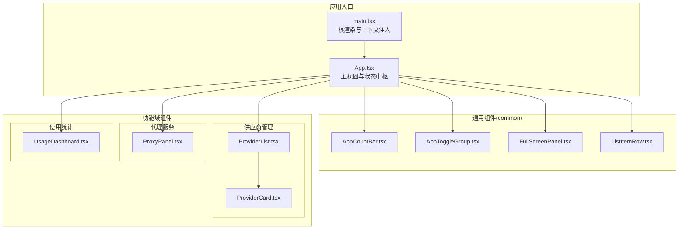
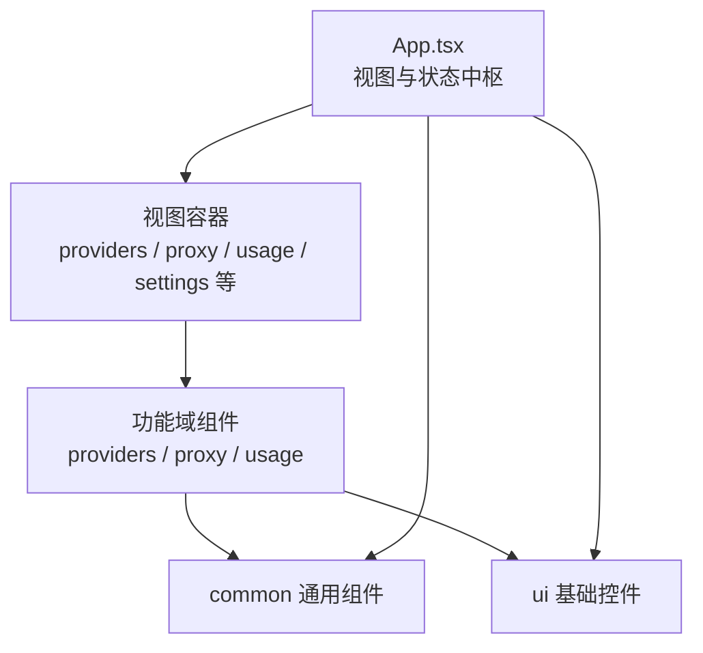
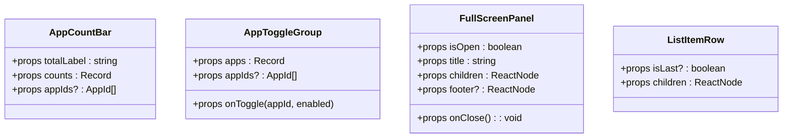
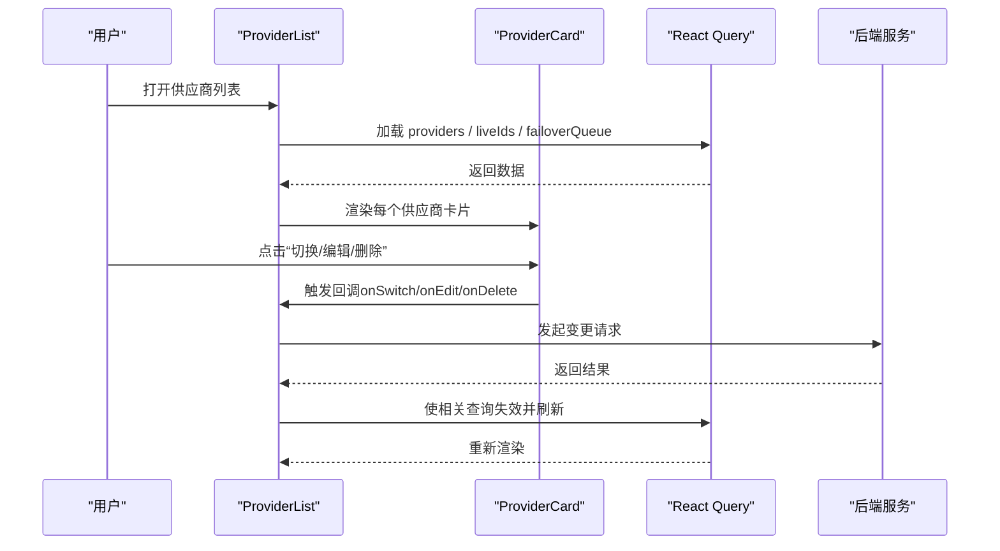
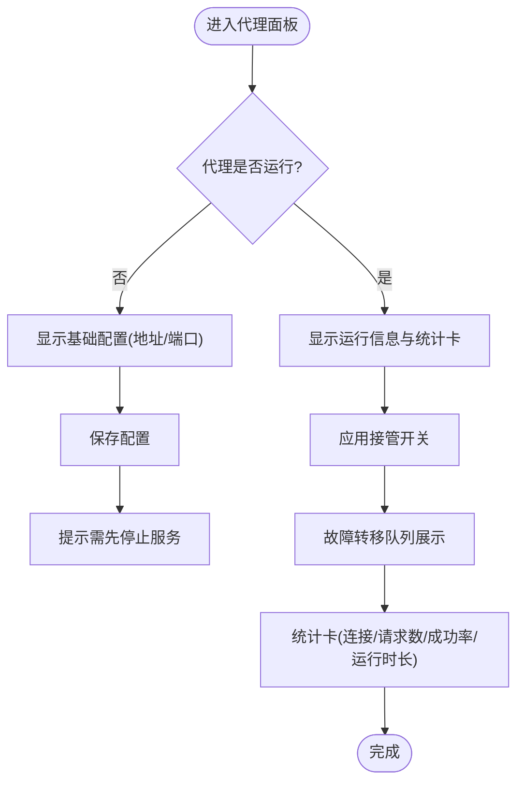
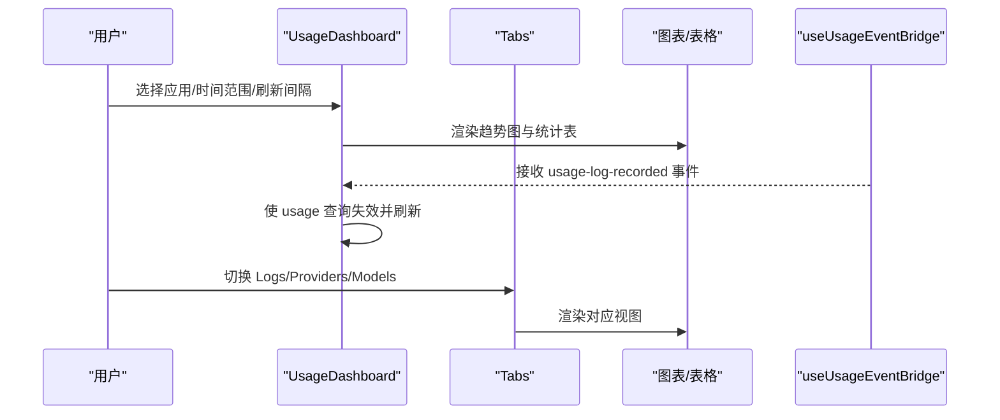
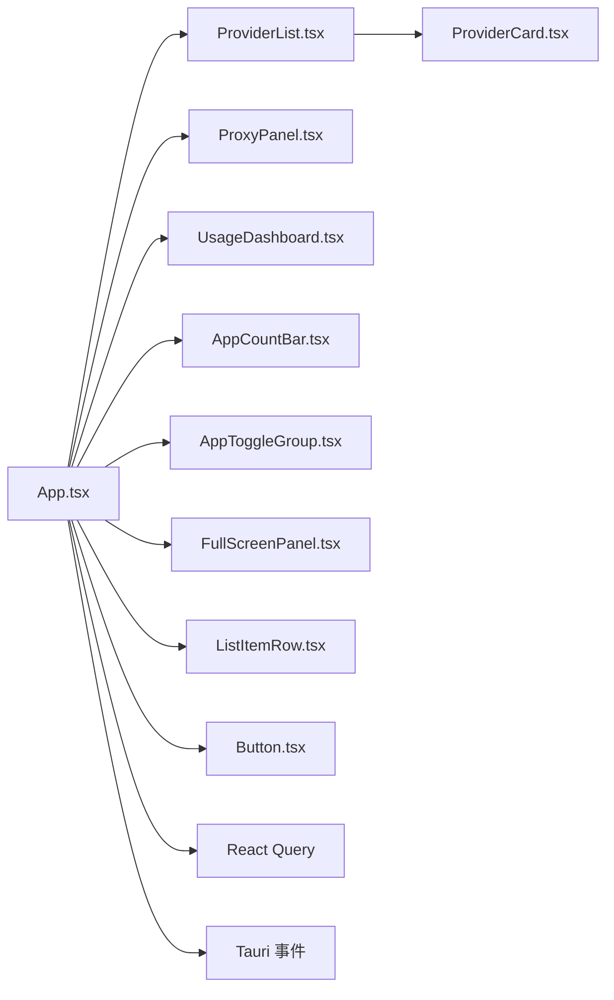

# 组件架构

<cite>
**本文引用的文件**
- [src/App.tsx](file://src/App.tsx)
- [src/main.tsx](file://src/main.tsx)
- [src/components/common/AppCountBar.tsx](file://src/components/common/AppCountBar.tsx)
- [src/components/common/AppToggleGroup.tsx](file://src/components/common/AppToggleGroup.tsx)
- [src/components/common/FullScreenPanel.tsx](file://src/components/common/FullScreenPanel.tsx)
- [src/components/common/ListItemRow.tsx](file://src/components/common/ListItemRow.tsx)
- [src/components/providers/ProviderList.tsx](file://src/components/providers/ProviderList.tsx)
- [src/components/providers/ProviderCard.tsx](file://src/components/providers/ProviderCard.tsx)
- [src/components/proxy/ProxyPanel.tsx](file://src/components/proxy/ProxyPanel.tsx)
- [src/components/usage/UsageDashboard.tsx](file://src/components/usage/UsageDashboard.tsx)
- [src/components/ui/button.tsx](file://src/components/ui/button.tsx)
</cite>

## 目录
1. [简介](#简介)
2. [项目结构](#项目结构)
3. [核心组件](#核心组件)
4. [架构总览](#架构总览)
5. [详细组件分析](#详细组件分析)
6. [依赖分析](#依赖分析)
7. [性能考量](#性能考量)
8. [故障排查指南](#故障排查指南)
9. [结论](#结论)
10. [附录](#附录)

## 简介
本文件系统性梳理 CC Switch 基于 React 的组件化架构，聚焦以下目标：
- 组件层次结构与父子关系
- 通用组件（common）的设计模式与复用策略
- 功能组件（供应商管理、代理服务、使用统计等）的组织方式与职责边界
- 组件间通信机制（props 传递、事件处理、状态提升）
- 生命周期管理、条件渲染、动态组件加载等实现要点

## 项目结构
CC Switch 采用“按功能域分层 + 通用 UI 组件复用”的组织方式：
- 根入口与上下文：应用根组件负责视图切换、窗口控制、事件监听与全局状态桥接
- 功能域组件：providers、proxy、usage、settings、ui 等
- 通用组件：common 下的 AppCountBar、AppToggleGroup、FullScreenPanel、ListItemRow 等
- UI 基础：ui 目录下的 Button、Input、Dialog 等基础控件，配合变体与尺寸规范

图表来源
- [src/main.tsx:1-104](file://src/main.tsx#L1-L104)
- [src/App.tsx:164-242](file://src/App.tsx#L164-L242)
- [src/components/common/AppCountBar.tsx:12-36](file://src/components/common/AppCountBar.tsx#L12-L36)
- [src/components/common/AppToggleGroup.tsx:16-50](file://src/components/common/AppToggleGroup.tsx#L16-L50)
- [src/components/common/FullScreenPanel.tsx:30-158](file://src/components/common/FullScreenPanel.tsx#L30-L158)
- [src/components/common/ListItemRow.tsx:8-21](file://src/components/common/ListItemRow.tsx#L8-L21)
- [src/components/providers/ProviderList.tsx:73-93](file://src/components/providers/ProviderList.tsx#L73-L93)
- [src/components/providers/ProviderCard.tsx:135-165](file://src/components/providers/ProviderCard.tsx#L135-L165)
- [src/components/proxy/ProxyPanel.tsx:41-46](file://src/components/proxy/ProxyPanel.tsx#L41-L46)
- [src/components/usage/UsageDashboard.tsx:40-46](file://src/components/usage/UsageDashboard.tsx#L40-L46)

章节来源
- [src/main.tsx:1-104](file://src/main.tsx#L1-L104)
- [src/App.tsx:164-242](file://src/App.tsx#L164-L242)

## 核心组件
- 根入口与上下文
  - main.tsx：根渲染、主题与通知上下文注入、事件监听与初始化错误处理
  - App.tsx：主视图状态、应用与视图切换、窗口控制、环境冲突提示、全局事件桥接、Provider 列表与操作、功能页（代理、使用统计等）

- 通用组件（common）
  - AppCountBar：按应用维度展示计数徽章，支持自定义 appIds
  - AppToggleGroup：应用可见性切换的图标化工具条
  - FullScreenPanel：全屏面板容器，支持门户渲染、拖拽区域、键盘 ESC 关闭、页脚区
  - ListItemRow：列表行容器，提供悬停态与分隔线

- 功能组件
  - ProviderList：供应商列表，支持搜索、拖拽排序、故障转移队列、Claude Desktop 状态提示、流式检测确认
  - ProviderCard：单个供应商卡片，聚合操作、用量展示、健康度与路由标记
  - ProxyPanel：代理服务面板，运行状态、接管开关、队列展示、统计卡、基础配置（地址/端口）
  - UsageDashboard：使用统计仪表盘，时间范围选择、应用过滤、趋势图、日志/提供商/模型统计表、定价配置

章节来源
- [src/main.tsx:1-104](file://src/main.tsx#L1-L104)
- [src/App.tsx:164-242](file://src/App.tsx#L164-L242)
- [src/components/common/AppCountBar.tsx:12-36](file://src/components/common/AppCountBar.tsx#L12-L36)
- [src/components/common/AppToggleGroup.tsx:16-50](file://src/components/common/AppToggleGroup.tsx#L16-L50)
- [src/components/common/FullScreenPanel.tsx:30-158](file://src/components/common/FullScreenPanel.tsx#L30-L158)
- [src/components/common/ListItemRow.tsx:8-21](file://src/components/common/ListItemRow.tsx#L8-L21)
- [src/components/providers/ProviderList.tsx:73-93](file://src/components/providers/ProviderList.tsx#L73-L93)
- [src/components/providers/ProviderCard.tsx:135-165](file://src/components/providers/ProviderCard.tsx#L135-L165)
- [src/components/proxy/ProxyPanel.tsx:41-46](file://src/components/proxy/ProxyPanel.tsx#L41-L46)
- [src/components/usage/UsageDashboard.tsx:40-46](file://src/components/usage/UsageDashboard.tsx#L40-L46)

## 架构总览
组件架构遵循“自上而下”的视图驱动与“自下而上”的能力组合：
- 视图层：App.tsx 维护 activeApp、currentView、visibleApps 等状态，决定渲染哪些功能页
- 业务域：providers、proxy、usage 等域组件封装各自的数据获取、状态与交互
- 通用层：common 提供跨域复用的 UI 片段；ui 提供基础控件与变体
- 事件与桥接：Tauri 事件监听、React Query 缓存失效、全局 Toast 提示

图表来源
- [src/App.tsx:164-242](file://src/App.tsx#L164-L242)
- [src/components/common/AppCountBar.tsx:12-36](file://src/components/common/AppCountBar.tsx#L12-L36)
- [src/components/common/FullScreenPanel.tsx:30-158](file://src/components/common/FullScreenPanel.tsx#L30-L158)
- [src/components/ui/button.tsx:51-62](file://src/components/ui/button.tsx#L51-L62)

## 详细组件分析

### 通用组件（common）设计模式
- AppCountBar
  - 设计要点：接收 totalLabel、counts 与可选 appIds，按 APP_IDS 渲染徽章，支持透明背景与圆角边框
  - 复用策略：在多处统计展示场景复用，减少重复布局代码
- AppToggleGroup
  - 设计要点：基于 APP_ICON_MAP 渲染图标与颜色类，支持 enabled 切换与 Tooltip 提示
  - 复用策略：在设置页与主界面顶部快速切换应用可见性
- FullScreenPanel
  - 设计要点：门户渲染至 document.body，统一头部、内容、页脚结构；ESC 键处理与文本输入框避让；拖拽区域与窗口装饰同步
  - 复用策略：作为弹层/全屏对话框的统一容器，屏蔽复杂 DOM 与键盘事件细节
- ListItemRow
  - 设计要点：提供统一的列表行容器，支持 hover 背景与分隔线
  - 复用策略：在设置页、对话框列表等场景保持一致的行样式与交互

图表来源
- [src/components/common/AppCountBar.tsx:6-16](file://src/components/common/AppCountBar.tsx#L6-L16)
- [src/components/common/AppToggleGroup.tsx:10-20](file://src/components/common/AppToggleGroup.tsx#L10-L20)
- [src/components/common/FullScreenPanel.tsx:14-20](file://src/components/common/FullScreenPanel.tsx#L14-L20)
- [src/components/common/ListItemRow.tsx:3-6](file://src/components/common/ListItemRow.tsx#L3-L6)

章节来源
- [src/components/common/AppCountBar.tsx:12-36](file://src/components/common/AppCountBar.tsx#L12-L36)
- [src/components/common/AppToggleGroup.tsx:16-50](file://src/components/common/AppToggleGroup.tsx#L16-L50)
- [src/components/common/FullScreenPanel.tsx:30-158](file://src/components/common/FullScreenPanel.tsx#L30-L158)
- [src/components/common/ListItemRow.tsx:8-21](file://src/components/common/ListItemRow.tsx#L8-L21)

### 供应商管理组件（providers）
- ProviderList
  - 职责：渲染供应商列表、支持搜索、拖拽排序、故障转移队列、Claude Desktop 状态提示、流式检测确认
  - 关键点：根据应用类型与配置累加模式（OpenCode/OpenClaw/Hermes）判断 isInConfig；根据 isProxyTakeover 与 failoverQueue 决定高亮与优先级
  - 交互：键盘快捷键（Cmd/Ctrl+F 打开搜索、Esc 关闭）、ConfirmDialog 弹窗
- ProviderCard
  - 职责：单个供应商卡片，聚合操作按钮、用量展示、健康度与路由标记、多套餐展开
  - 关键点：根据 isCurrent、isInConfig、isProxyTakeover、activeProviderId 等状态决定边框颜色与高亮；对不同应用类型（Claude/Codex/Gemini/OpenClaw/Hermes）做差异化展示

图表来源
- [src/components/providers/ProviderList.tsx:73-93](file://src/components/providers/ProviderList.tsx#L73-L93)
- [src/components/providers/ProviderCard.tsx:135-165](file://src/components/providers/ProviderCard.tsx#L135-L165)

章节来源
- [src/components/providers/ProviderList.tsx:73-93](file://src/components/providers/ProviderList.tsx#L73-L93)
- [src/components/providers/ProviderCard.tsx:135-165](file://src/components/providers/ProviderCard.tsx#L135-L165)

### 代理服务组件（proxy）
- ProxyPanel
  - 职责：代理服务开关、应用接管开关、运行状态展示、日志开关、故障转移队列、统计卡、基础配置（地址/端口）
  - 关键点：运行时才显示接管开关；地址/端口保存前需停止服务；支持 IPv4/IPv6/localhost 校验；实时统计卡与队列项高亮当前供应商

图表来源
- [src/components/proxy/ProxyPanel.tsx:41-46](file://src/components/proxy/ProxyPanel.tsx#L41-L46)
- [src/components/proxy/ProxyPanel.tsx:222-609](file://src/components/proxy/ProxyPanel.tsx#L222-L609)

章节来源
- [src/components/proxy/ProxyPanel.tsx:41-46](file://src/components/proxy/ProxyPanel.tsx#L41-L46)
- [src/components/proxy/ProxyPanel.tsx:222-609](file://src/components/proxy/ProxyPanel.tsx#L222-L609)

### 使用统计组件（usage）
- UsageDashboard
  - 职责：仪表盘主入口，提供应用过滤、时间范围选择、刷新间隔切换、趋势图、日志/提供商/模型统计表、定价配置面板
  - 关键点：监听后端事件实现日志实时刷新；Tabs 切换不同统计视图；日期范围解析与本地化格式化

图表来源
- [src/components/usage/UsageDashboard.tsx:40-46](file://src/components/usage/UsageDashboard.tsx#L40-L46)
- [src/components/usage/UsageDashboard.tsx:76-223](file://src/components/usage/UsageDashboard.tsx#L76-L223)

章节来源
- [src/components/usage/UsageDashboard.tsx:40-46](file://src/components/usage/UsageDashboard.tsx#L40-L46)
- [src/components/usage/UsageDashboard.tsx:76-223](file://src/components/usage/UsageDashboard.tsx#L76-L223)

### UI 基础组件（ui）
- Button
  - 设计要点：基于变体（default/secondary/destructive/outline/ghost/mcp/link）与尺寸（default/sm/lg/icon）生成类名；支持 asChild 透传
  - 复用策略：在各功能页统一按钮风格，减少重复样式代码

章节来源
- [src/components/ui/button.tsx:51-62](file://src/components/ui/button.tsx#L51-L62)

## 依赖分析
- 组件耦合与内聚
  - ProviderList 与 ProviderCard：强内聚的列表-单项关系，ProviderList 通过 props 控制 ProviderCard 的行为（当前项、是否在配置、是否在队列、是否接管等）
  - App.tsx 与功能页：通过 currentView 与 visibleApps 控制渲染，形成“状态驱动视图”的清晰边界
- 外部依赖与集成点
  - React Query：用于缓存与查询失效，支撑 ProviderList、ProxyPanel、UsageDashboard 的数据刷新
  - Tauri 事件：App.tsx 监听 universal-provider-synced、webdav/s3 同步状态、代理警告等事件，触发 UI 提示与查询刷新
  - 平台特性：window 状态同步、拖拽区域、平台特定样式类

图表来源
- [src/App.tsx:164-242](file://src/App.tsx#L164-L242)
- [src/components/providers/ProviderList.tsx:73-93](file://src/components/providers/ProviderList.tsx#L73-L93)
- [src/components/providers/ProviderCard.tsx:135-165](file://src/components/providers/ProviderCard.tsx#L135-L165)
- [src/components/proxy/ProxyPanel.tsx:41-46](file://src/components/proxy/ProxyPanel.tsx#L41-L46)
- [src/components/usage/UsageDashboard.tsx:40-46](file://src/components/usage/UsageDashboard.tsx#L40-L46)
- [src/components/common/AppCountBar.tsx:12-36](file://src/components/common/AppCountBar.tsx#L12-L36)
- [src/components/common/AppToggleGroup.tsx:16-50](file://src/components/common/AppToggleGroup.tsx#L16-L50)
- [src/components/common/FullScreenPanel.tsx:30-158](file://src/components/common/FullScreenPanel.tsx#L30-L158)
- [src/components/common/ListItemRow.tsx:8-21](file://src/components/common/ListItemRow.tsx#L8-L21)
- [src/components/ui/button.tsx:51-62](file://src/components/ui/button.tsx#L51-L62)

章节来源
- [src/App.tsx:164-242](file://src/App.tsx#L164-L242)

## 性能考量
- 查询与缓存
  - ProviderList 与 UsageDashboard 使用 React Query 管理查询，通过失效与重验证减少不必要的网络请求
- 条件渲染与懒加载
  - ProviderList 在加载中与空状态分别渲染骨架与空态组件，避免大列表一次性渲染
  - FullScreenPanel 使用门户渲染，仅在 isOpen 时挂载，降低顶层节点数量
- 事件与状态
  - App.tsx 对窗口大小变化与装饰状态进行节流式同步，避免频繁重绘
- 图表与表格
  - UsageDashboard 的 Tabs 切换采用动画过渡，减少闪烁；统计卡按需高亮，降低视觉噪音

## 故障排查指南
- 代理服务
  - 若地址/端口无效，ProxyPanel 会在保存前进行格式校验并提示；若服务未运行，仅允许查看基础配置
  - 应用接管开关仅在代理运行时显示，避免无效操作
- 供应商切换
  - 官方供应商在接管模式下可能被阻止，ProviderCard 会显示相应提示
  - 故障转移队列中的供应商会显示健康徽章与优先级标签，便于定位问题
- 环境冲突
  - App.tsx 在启动与切换应用时检查环境变量冲突，出现冲突时显示横幅并允许用户忽略
- 日志与通知
  - Tauri 事件触发的错误与警告通过 toast 统一提示，便于快速定位问题

章节来源
- [src/components/proxy/ProxyPanel.tsx:124-198](file://src/components/proxy/ProxyPanel.tsx#L124-L198)
- [src/components/providers/ProviderCard.tsx:210-218](file://src/components/providers/ProviderCard.tsx#L210-L218)
- [src/App.tsx:464-563](file://src/App.tsx#L464-L563)

## 结论
CC Switch 的组件架构以 App.tsx 为核心，围绕“视图状态—功能域组件—通用组件—基础 UI”的层级组织，实现了：
- 明确的职责分离与高内聚低耦合
- 可复用的通用组件与一致的 UI 变体
- 健壮的事件与状态桥接，确保前端与后端协同
- 良好的性能与可维护性，适合持续扩展与演进

## 附录
- 组件通信机制
  - Props 传递：父组件向子组件传递数据与回调，如 ProviderList 向 ProviderCard 传递 isCurrent、isInConfig、onSwitch 等
  - 事件处理：子组件通过回调向上抛出动作，父组件集中处理并更新状态或发起请求
  - 状态提升：App.tsx 维护 activeApp、currentView、visibleApps 等全局状态，实现跨页共享
- 生命周期管理
  - useEffect：用于窗口状态同步、事件订阅、环境冲突检查、迁移结果提示等
  - useQuery/useMutation：统一数据获取与变更流程，结合失效策略实现自动刷新
- 条件渲染与动态加载
  - ProviderList 根据搜索词与过滤条件动态筛选；FullScreenPanel 按 isOpen 动态挂载；Tabs 按需渲染不同统计视图