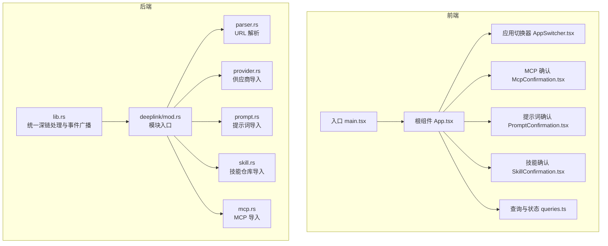
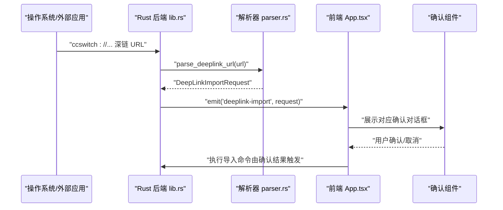
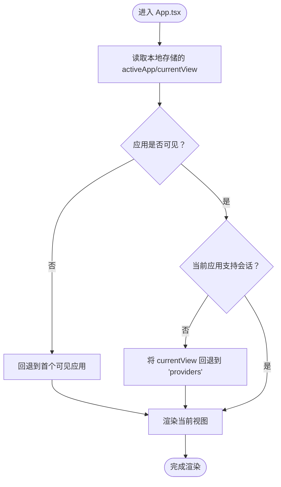
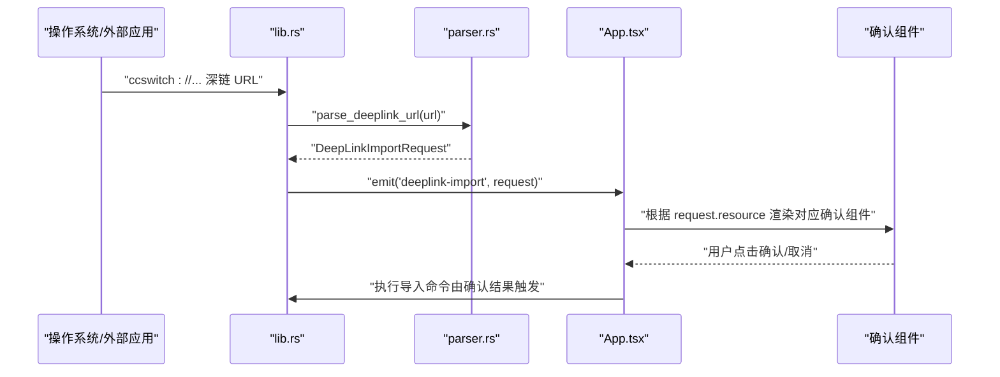
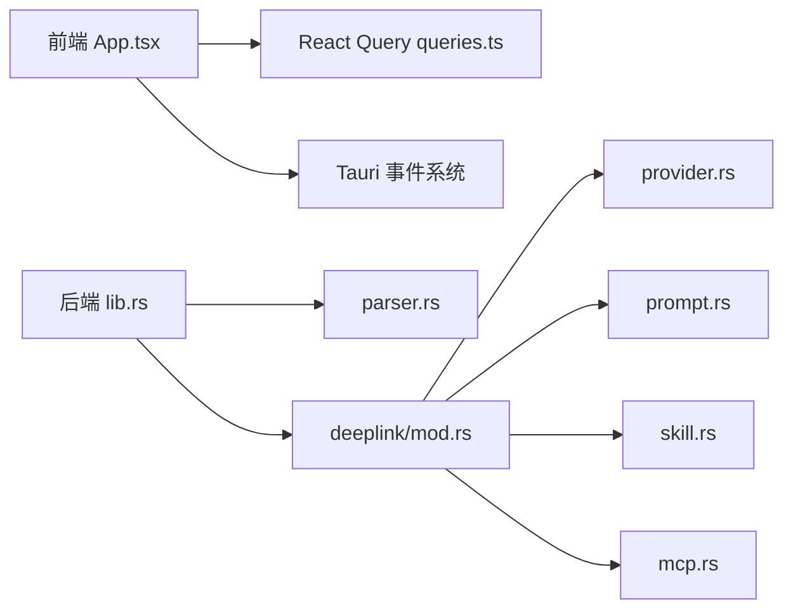

# 路由系统

<cite>
**本文引用的文件**
- [src/App.tsx](file://src/App.tsx)
- [src/main.tsx](file://src/main.tsx)
- [src/components/AppSwitcher.tsx](file://src/components/AppSwitcher.tsx)
- [src/components/deeplink/McpConfirmation.tsx](file://src/components/deeplink/McpConfirmation.tsx)
- [src/components/deeplink/PromptConfirmation.tsx](file://src/components/deeplink/PromptConfirmation.tsx)
- [src/components/deeplink/SkillConfirmation.tsx](file://src/components/deeplink/SkillConfirmation.tsx)
- [src/lib/query/queries.ts](file://src/lib/query/queries.ts)
- [src-tauri/src/lib.rs](file://src-tauri/src/lib.rs)
- [src-tauri/src/deeplink/mod.rs](file://src-tauri/src/deeplink/mod.rs)
- [src-tauri/src/deeplink/parser.rs](file://src-tauri/src/deeplink/parser.rs)
- [src-tauri/src/deeplink/provider.rs](file://src-tauri/src/deeplink/provider.rs)
- [src-tauri/src/deeplink/prompt.rs](file://src-tauri/src/deeplink/prompt.rs)
- [src-tauri/src/deeplink/skill.rs](file://src-tauri/src/deeplink/skill.rs)
- [src-tauri/src/deeplink/mcp.rs](file://src-tauri/src/deeplink/mcp.rs)
- [src-tauri/src/deeplink/utils.rs](file://src-tauri/src/deeplink/utils.rs)
- [src-tauri/src/deeplink/tests.rs](file://src-tauri/src/deeplink/tests.rs)
</cite>

## 目录
1. [简介](#简介)
2. [项目结构](#项目结构)
3. [核心组件](#核心组件)
4. [架构总览](#架构总览)
5. [详细组件分析](#详细组件分析)
6. [依赖分析](#依赖分析)
7. [性能考量](#性能考量)
8. [故障排查指南](#故障排查指南)
9. [结论](#结论)
10. [附录](#附录)

## 简介
本文件系统性梳理 CC Switch 的前端路由与深链接（DeepLink）机制。CC Switch 基于 React Router 构建前端界面，采用“应用维度 + 视图维度”的双层导航模型：顶层通过应用切换器在多个 AI 应用间切换，底层通过视图（View）在各功能面板之间切换。路由系统同时承载以下职责：
- 页面导航与视图状态管理
- 路由守卫与权限控制（通过应用可见性、会话支持能力、代理接管状态等）
- 动态路由与参数传递（通过本地存储与查询状态）
- 深度链接（DeepLink）协议解析与导入确认流程
- 性能优化（查询缓存、后台刷新、懒加载策略）
- 安全与合规（URL 脱敏、事件驱动的导入流程）

## 项目结构
前端路由与导航相关的关键位置如下：
- 入口与根组件：src/main.tsx、src/App.tsx
- 应用切换器：src/components/AppSwitcher.tsx
- 查询与状态：src/lib/query/queries.ts
- 深度链接确认对话框：src/components/deeplink/*.tsx
- 深度链接后端解析与事件广播：src-tauri/src/deeplink/* 与 src-tauri/src/lib.rs

图表来源
- [src/main.tsx:1-104](file://src/main.tsx#L1-L104)
- [src/App.tsx:164-800](file://src/App.tsx#L164-L800)
- [src/components/AppSwitcher.tsx:1-131](file://src/components/AppSwitcher.tsx#L1-L131)
- [src/components/deeplink/McpConfirmation.tsx:1-76](file://src/components/deeplink/McpConfirmation.tsx#L1-L76)
- [src/components/deeplink/PromptConfirmation.tsx:1-64](file://src/components/deeplink/PromptConfirmation.tsx#L1-L64)
- [src/components/deeplink/SkillConfirmation.tsx:1-47](file://src/components/deeplink/SkillConfirmation.tsx#L1-L47)
- [src/lib/query/queries.ts:1-156](file://src/lib/query/queries.ts#L1-L156)
- [src-tauri/src/lib.rs:107-1520](file://src-tauri/src/lib.rs#L107-L1520)
- [src-tauri/src/deeplink/mod.rs](file://src-tauri/src/deeplink/mod.rs)
- [src-tauri/src/deeplink/parser.rs](file://src-tauri/src/deeplink/parser.rs)
- [src-tauri/src/deeplink/provider.rs](file://src-tauri/src/deeplink/provider.rs)
- [src-tauri/src/deeplink/prompt.rs](file://src-tauri/src/deeplink/prompt.rs)
- [src-tauri/src/deeplink/skill.rs](file://src-tauri/src/deeplink/skill.rs)
- [src-tauri/src/deeplink/mcp.rs](file://src-tauri/src/deeplink/mcp.rs)

章节来源
- [src/main.tsx:1-104](file://src/main.tsx#L1-L104)
- [src/App.tsx:164-800](file://src/App.tsx#L164-L800)
- [src/components/AppSwitcher.tsx:1-131](file://src/components/AppSwitcher.tsx#L1-L131)
- [src/lib/query/queries.ts:1-156](file://src/lib/query/queries.ts#L1-L156)

## 核心组件
- 应用切换器（AppSwitcher）：负责在多应用间切换，并持久化最近使用的应用。
- 根组件（App）：维护当前应用（activeApp）、当前视图（currentView）、设置默认标签页、对话框状态等；根据应用能力动态调整视图与视图回退。
- 查询与状态（queries.ts）：提供供应商列表、设置、用量、会话等查询钩子，支持后台刷新与缓存策略。
- 深度链接确认组件：针对不同资源类型（MCP、提示词、技能）提供导入前的预览与确认。

章节来源
- [src/components/AppSwitcher.tsx:32-131](file://src/components/AppSwitcher.tsx#L32-L131)
- [src/App.tsx:94-171](file://src/App.tsx#L94-L171)
- [src/lib/query/queries.ts:54-156](file://src/lib/query/queries.ts#L54-L156)
- [src/components/deeplink/McpConfirmation.tsx:6-76](file://src/components/deeplink/McpConfirmation.tsx#L6-L76)
- [src/components/deeplink/PromptConfirmation.tsx:6-64](file://src/components/deeplink/PromptConfirmation.tsx#L6-L64)
- [src/components/deeplink/SkillConfirmation.tsx:4-47](file://src/components/deeplink/SkillConfirmation.tsx#L4-L47)

## 架构总览
CC Switch 的路由系统由“前端状态机 + 后端深链解析”构成：
- 前端状态机：以 activeApp 与 currentView 为核心，结合可见应用、会话支持能力、代理接管状态等，决定可用视图与回退策略。
- 后端深链解析：统一接收 ccswitch:// 协议，解析资源类型与参数，向前端广播 deeplink-import 事件，由前端确认并导入。

图表来源
- [src-tauri/src/lib.rs:119-1520](file://src-tauri/src/lib.rs#L119-L1520)
- [src-tauri/src/deeplink/parser.rs](file://src-tauri/src/deeplink/parser.rs)
- [src/App.tsx:164-800](file://src/App.tsx#L164-L800)
- [src/components/deeplink/McpConfirmation.tsx:1-76](file://src/components/deeplink/McpConfirmation.tsx#L1-L76)
- [src/components/deeplink/PromptConfirmation.tsx:1-64](file://src/components/deeplink/PromptConfirmation.tsx#L1-L64)
- [src/components/deeplink/SkillConfirmation.tsx:1-47](file://src/components/deeplink/SkillConfirmation.tsx#L1-L47)

## 详细组件分析

### 应用切换与视图管理
- 应用维度（activeApp）：通过 AppSwitcher 切换，持久化至本地存储；受可见应用设置影响，若当前应用不可见则回退到首个可见应用。
- 视图维度（currentView）：支持 providers、settings、prompts、skills、skillsDiscovery、mcp、agents、universal、sessions、workspace、openclawEnv、openclawTools、openclawAgents、hermesMemory 等；当切换到不支持会话的应用时，自动回退到 providers。
- 设置默认标签页：settings 默认标签页通过状态管理，便于快速定位设置项。
- 代理接管与视图联动：当代理接管生效时，部分操作与视图呈现会相应变化。

图表来源
- [src/App.tsx:164-225](file://src/App.tsx#L164-L225)
- [src/components/AppSwitcher.tsx:32-67](file://src/components/AppSwitcher.tsx#L32-L67)

章节来源
- [src/App.tsx:94-171](file://src/App.tsx#L94-L171)
- [src/App.tsx:164-225](file://src/App.tsx#L164-L225)
- [src/components/AppSwitcher.tsx:32-67](file://src/components/AppSwitcher.tsx#L32-L67)

### 路由守卫与动态路由
- 路由守卫（应用维度）：通过可见应用设置与应用切换逻辑实现“不可见即回退”，避免无效导航。
- 路由守卫（视图维度）：对不支持会话的应用，强制回退到 providers，确保界面一致性。
- 动态路由（视图参数）：currentView 与 activeApp 作为动态参数，配合本地存储实现“深链接”式的初始状态恢复（通过 URL 参数可扩展）。
- 权限与能力控制：根据 sharedFeatureApp 与 hasSessionSupport 等布尔值，动态启用/隐藏相关视图与功能。

章节来源
- [src/App.tsx:195-225](file://src/App.tsx#L195-L225)
- [src/App.tsx:279-286](file://src/App.tsx#L279-L286)

### 深度链接（DeepLink）实现机制
- 协议与入口：统一处理 ccswitch:// 协议，解析资源类型与参数，向前端广播 deeplink-import 事件。
- 前端确认：根据资源类型（MCP、提示词、技能）展示对应的确认对话框，允许用户预览导入内容并决定是否导入。
- 安全与脱敏：日志中对 URL 进行脱敏处理，避免敏感信息泄露。
- 平台注册：在 Linux/Windows 调试模式下按需注册深链处理器，避免覆盖用户自定义配置。

图表来源
- [src-tauri/src/lib.rs:119-1520](file://src-tauri/src/lib.rs#L119-L1520)
- [src-tauri/src/deeplink/parser.rs](file://src-tauri/src/deeplink/parser.rs)
- [src-tauri/src/deeplink/mcp.rs](file://src-tauri/src/deeplink/mcp.rs)
- [src-tauri/src/deeplink/prompt.rs](file://src-tauri/src/deeplink/prompt.rs)
- [src-tauri/src/deeplink/skill.rs](file://src-tauri/src/deeplink/skill.rs)
- [src-tauri/src/deeplink/provider.rs](file://src-tauri/src/deeplink/provider.rs)
- [src/App.tsx:164-800](file://src/App.tsx#L164-L800)
- [src/components/deeplink/McpConfirmation.tsx:1-76](file://src/components/deeplink/McpConfirmation.tsx#L1-L76)
- [src/components/deeplink/PromptConfirmation.tsx:1-64](file://src/components/deeplink/PromptConfirmation.tsx#L1-L64)
- [src/components/deeplink/SkillConfirmation.tsx:1-47](file://src/components/deeplink/SkillConfirmation.tsx#L1-L47)

章节来源
- [src-tauri/src/lib.rs:119-1520](file://src-tauri/src/lib.rs#L119-L1520)
- [src-tauri/src/deeplink/mod.rs](file://src-tauri/src/deeplink/mod.rs)
- [src-tauri/src/deeplink/parser.rs](file://src-tauri/src/deeplink/parser.rs)
- [src-tauri/src/deeplink/mcp.rs](file://src-tauri/src/deeplink/mcp.rs)
- [src-tauri/src/deeplink/prompt.rs](file://src-tauri/src/deeplink/prompt.rs)
- [src-tauri/src/deeplink/skill.rs](file://src-tauri/src/deeplink/skill.rs)
- [src-tauri/src/deeplink/provider.rs](file://src-tauri/src/deeplink/provider.rs)
- [src/App.tsx:164-800](file://src/App.tsx#L164-L800)
- [src/components/deeplink/McpConfirmation.tsx:1-76](file://src/components/deeplink/McpConfirmation.tsx#L1-L76)
- [src/components/deeplink/PromptConfirmation.tsx:1-64](file://src/components/deeplink/PromptConfirmation.tsx#L1-L64)
- [src/components/deeplink/SkillConfirmation.tsx:1-47](file://src/components/deeplink/SkillConfirmation.tsx#L1-L47)

### 查询字符串与路由状态管理
- 本地存储：activeApp 与 currentView 通过本地存储持久化，实现“深链接”式的初始状态恢复。
- 查询缓存与后台刷新：通过 React Query 的 useQuery、staleTime、refetchInterval 等策略，实现后台定时刷新与缓存复用，减少重复请求。
- 状态联动：代理运行状态、接管状态、当前应用等会影响查询刷新频率与视图呈现。

章节来源
- [src/App.tsx:138-178](file://src/App.tsx#L138-L178)
- [src/lib/query/queries.ts:54-156](file://src/lib/query/queries.ts#L54-L156)

### 移动端与桌面端适配
- 桌面端：通过窗口装饰、拖拽区域、最大化状态同步等实现原生窗口体验。
- 移动端：当前代码未直接体现移动端路由适配逻辑，但可通过响应式 UI 与视图紧凑模式（如 AppSwitcher 的 compact）实现基础适配。

章节来源
- [src/App.tsx:419-462](file://src/App.tsx#L419-L462)
- [src/components/AppSwitcher.tsx:118-125](file://src/components/AppSwitcher.tsx#L118-L125)

## 依赖分析
- 前端依赖
  - React Router：用于页面导航与视图切换（在现有代码中通过状态机实现）
  - React Query：用于数据获取、缓存与后台刷新
  - Tauri 事件系统：用于深链事件监听与广播
- 后端依赖
  - tauri-plugin-deep-link：深链协议处理
  - URL 解析与资源分发：按资源类型路由到 provider/prompt/skill/mcp 导入模块

图表来源
- [src/App.tsx:164-800](file://src/App.tsx#L164-L800)
- [src/lib/query/queries.ts:1-156](file://src/lib/query/queries.ts#L1-L156)
- [src-tauri/src/lib.rs:119-1520](file://src-tauri/src/lib.rs#L119-L1520)
- [src-tauri/src/deeplink/mod.rs](file://src-tauri/src/deeplink/mod.rs)
- [src-tauri/src/deeplink/parser.rs](file://src-tauri/src/deeplink/parser.rs)
- [src-tauri/src/deeplink/provider.rs](file://src-tauri/src/deeplink/provider.rs)
- [src-tauri/src/deeplink/prompt.rs](file://src-tauri/src/deeplink/prompt.rs)
- [src-tauri/src/deeplink/skill.rs](file://src-tauri/src/deeplink/skill.rs)
- [src-tauri/src/deeplink/mcp.rs](file://src-tauri/src/deeplink/mcp.rs)

章节来源
- [src-tauri/src/lib.rs:119-1520](file://src-tauri/src/lib.rs#L119-L1520)
- [src-tauri/src/deeplink/mod.rs](file://src-tauri/src/deeplink/mod.rs)

## 性能考量
- 查询缓存与复用：通过 React Query 的 staleTime、gcTime、keepPreviousData 等策略，降低重复请求与闪烁。
- 后台定时刷新：代理运行时对供应商列表进行周期性刷新，保证状态实时性。
- 组件渲染优化：使用动画库与条件渲染，避免不必要的重绘。
- 深链处理：仅在 ccswitch:// 协议命中时触发解析与事件广播，避免全局监听开销。

章节来源
- [src/lib/query/queries.ts:60-88](file://src/lib/query/queries.ts#L60-L88)
- [src/lib/query/queries.ts:116-135](file://src/lib/query/queries.ts#L116-L135)
- [src-tauri/src/lib.rs:119-1520](file://src-tauri/src/lib.rs#L119-L1520)

## 故障排查指南
- 深链无法触发
  - 检查后端是否正确注册深链处理器（Linux/Windows 调试模式下按需注册）
  - 查看日志中是否输出“Deep link URL detected”与“Emitted deeplink-import event”
- 前端未收到深链事件
  - 确认前端是否监听了 deeplink-import 事件
  - 检查确认组件是否正确根据资源类型渲染
- URL 脱敏与安全
  - 日志中 URL 已脱敏，避免敏感信息泄露
- 配置加载失败
  - 后端会在配置加载失败时弹窗并退出，避免应用在损坏配置下运行

章节来源
- [src-tauri/src/lib.rs:119-1520](file://src-tauri/src/lib.rs#L119-L1520)
- [src-tauri/src/deeplink/tests.rs](file://src-tauri/src/deeplink/tests.rs)
- [src/main.tsx:39-71](file://src/main.tsx#L39-L71)

## 结论
CC Switch 的路由系统以“应用 + 视图”的双层状态机为核心，结合 React Query 实现高效的数据获取与缓存，通过 Tauri 事件系统实现深链协议的统一解析与导入确认。系统在安全性、性能与用户体验方面做了平衡：深链事件驱动导入、URL 脱敏、后台刷新与缓存策略、以及应用/视图维度的守卫机制，共同保障了复杂场景下的稳定性与易用性。

## 附录
- 深度链接资源类型
  - provider：供应商导入
  - prompt：提示词导入
  - skill：技能仓库导入
  - mcp：MCP 服务器导入
- 前端确认组件
  - McpConfirmation：展示 MCP 服务器列表与目标应用
  - PromptConfirmation：展示提示词内容预览
  - SkillConfirmation：展示技能仓库地址与分支信息

章节来源
- [src-tauri/src/deeplink/provider.rs](file://src-tauri/src/deeplink/provider.rs)
- [src-tauri/src/deeplink/prompt.rs](file://src-tauri/src/deeplink/prompt.rs)
- [src-tauri/src/deeplink/skill.rs](file://src-tauri/src/deeplink/skill.rs)
- [src-tauri/src/deeplink/mcp.rs](file://src-tauri/src/deeplink/mcp.rs)
- [src/components/deeplink/McpConfirmation.tsx:1-76](file://src/components/deeplink/McpConfirmation.tsx#L1-L76)
- [src/components/deeplink/PromptConfirmation.tsx:1-64](file://src/components/deeplink/PromptConfirmation.tsx#L1-L64)
- [src/components/deeplink/SkillConfirmation.tsx:1-47](file://src/components/deeplink/SkillConfirmation.tsx#L1-L47)