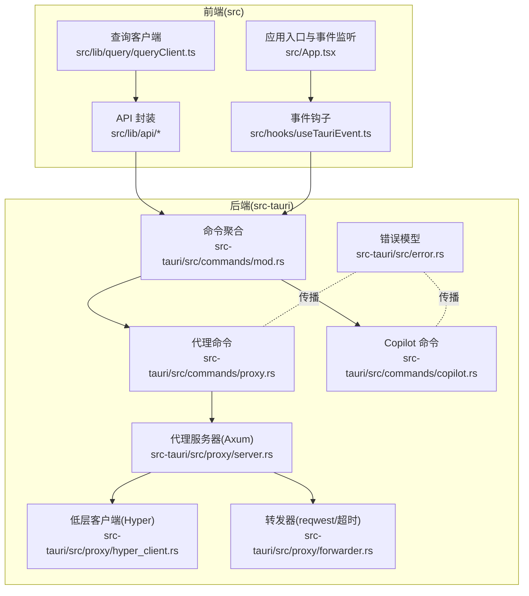
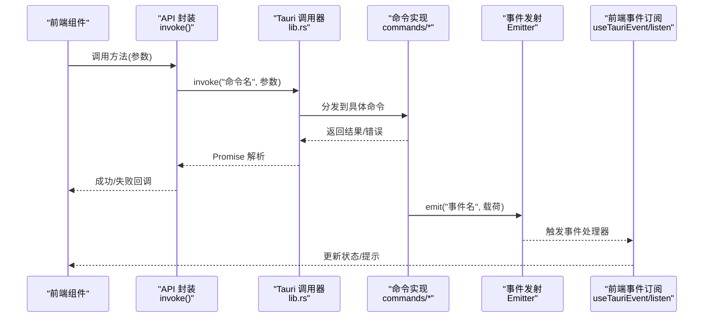
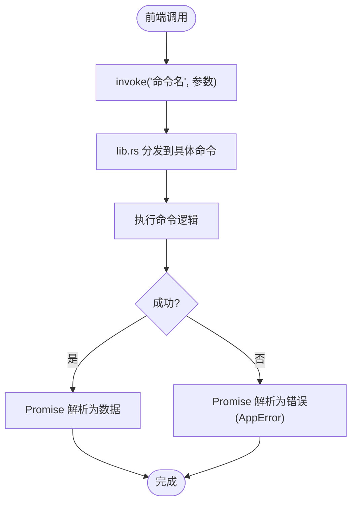
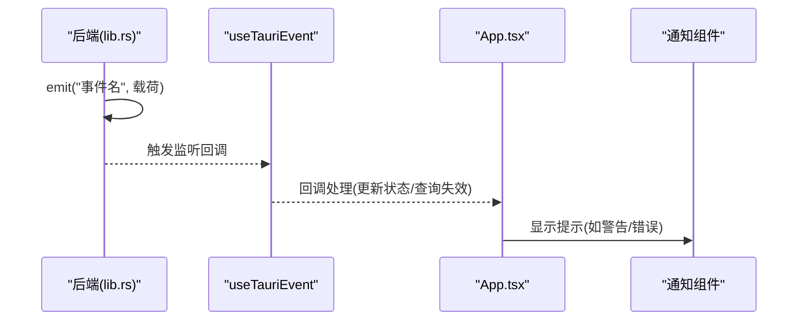
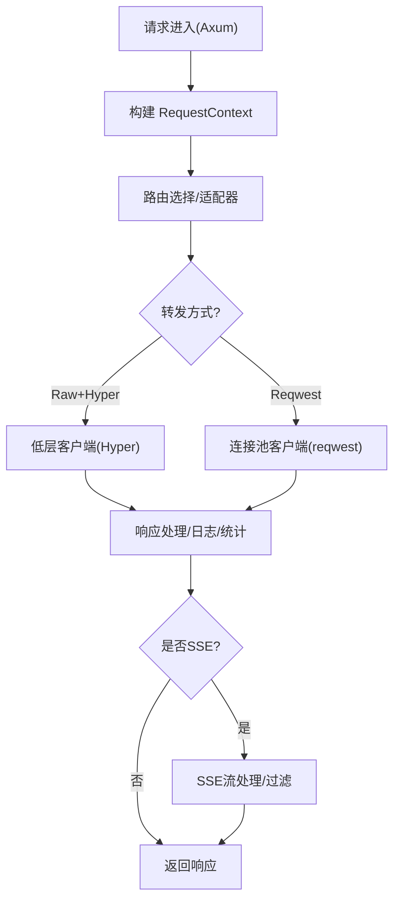
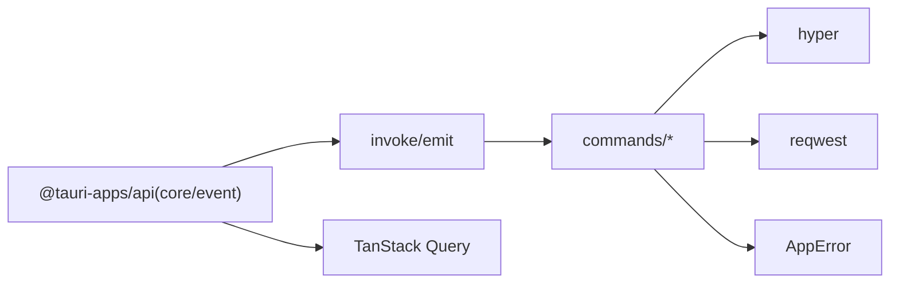

# 通信层

<cite>
**本文引用的文件**
- [src-tauri/src/lib.rs](file://src-tauri/src/lib.rs)
- [src-tauri/src/main.rs](file://src-tauri/src/main.rs)
- [src-tauri/src/commands/mod.rs](file://src-tauri/src/commands/mod.rs)
- [src-tauri/src/commands/proxy.rs](file://src-tauri/src/commands/proxy.rs)
- [src-tauri/src/commands/copilot.rs](file://src-tauri/src/commands/copilot.rs)
- [src-tauri/src/error.rs](file://src-tauri/src/error.rs)
- [src-tauri/src/proxy/hyper_client.rs](file://src-tauri/src/proxy/hyper_client.rs)
- [src-tauri/src/proxy/forwarder.rs](file://src-tauri/src/proxy/forwarder.rs)
- [src-tauri/src/proxy/server.rs](file://src-tauri/src/proxy/server.rs)
- [src-tauri/tauri.conf.json](file://src-tauri/tauri.conf.json)
- [src/lib/api/index.ts](file://src/lib/api/index.ts)
- [src/lib/api/providers.ts](file://src/lib/api/providers.ts)
- [src/lib/api/settings.ts](file://src/lib/api/settings.ts)
- [src/lib/api/auth.ts](file://src/lib/api/auth.ts)
- [src/lib/api/types.ts](file://src/lib/api/types.ts)
- [src/hooks/useTauriEvent.ts](file://src/hooks/useTauriEvent.ts)
- [src/App.tsx](file://src/App.tsx)
- [src/lib/query/queryClient.ts](file://src/lib/query/queryClient.ts)
- [package.json](file://package.json)
</cite>

## 目录
1. [引言](#引言)
2. [项目结构](#项目结构)
3. [核心组件](#核心组件)
4. [架构总览](#架构总览)
5. [详细组件分析](#详细组件分析)
6. [依赖关系分析](#依赖关系分析)
7. [性能考量](#性能考量)
8. [故障排查指南](#故障排查指南)
9. [结论](#结论)
10. [附录](#附录)

## 引言
本文件面向 CC Switch 项目的前后端通信层，系统性阐述基于 Tauri 命令系统的 IPC 通信机制，涵盖命令定义、参数传递、返回值处理；前端 API 封装策略（错误处理、重试机制、超时控制）；事件系统设计（监听、广播、生命周期管理）；异步通信处理模式（Promise 包装、错误边界、Loading 状态管理）；以及通信安全、性能优化与调试工具使用。同时补充 WebSocket 通信、HTTP 请求封装、文件系统访问等特殊通信场景的实践要点。

## 项目结构
- 前端位于 src/，采用 React + TypeScript，通过 @tauri-apps/api/core 的 invoke 与后端命令交互，并通过 @tauri-apps/api/event 的 listen 订阅后端事件。
- 后端位于 src-tauri/，采用 Tauri 2.x + Rust，命令通过 #[tauri::command] 宏声明，集中注册在 lib.rs 的 invoke_handler 中。
- 命令按领域分层组织于 src-tauri/src/commands/ 下，例如代理、认证、设置、MCP 等。
- 代理模块提供 HTTP 代理能力，内部使用 hyper/reqwest 实现请求转发、超时控制与 SSE 处理。
- 配置方面，tauri.conf.json 中定义了 CSP、IPC 通道与深链插件等安全与集成策略。



图表来源
- [src/lib/api/index.ts:1-31](file://src/lib/api/index.ts#L1-L31)
- [src-tauri/src/commands/mod.rs:1-69](file://src-tauri/src/commands/mod.rs#L1-L69)
- [src-tauri/src/commands/proxy.rs:1-40](file://src-tauri/src/commands/proxy.rs#L1-L40)
- [src-tauri/src/commands/copilot.rs:1-31](file://src-tauri/src/commands/copilot.rs#L1-L31)
- [src-tauri/src/proxy/server.rs:1-30](file://src-tauri/src/proxy/server.rs#L1-L30)
- [src-tauri/src/proxy/hyper_client.rs:245-671](file://src-tauri/src/proxy/hyper_client.rs#L245-L671)
- [src-tauri/src/proxy/forwarder.rs:1878-1901](file://src-tauri/src/proxy/forwarder.rs#L1878-L1901)
- [src-tauri/src/error.rs:1-147](file://src-tauri/src/error.rs#L1-L147)

章节来源
- [src-tauri/src/lib.rs:1124-1457](file://src-tauri/src/lib.rs#L1124-L1457)
- [src-tauri/src/main.rs:1-23](file://src-tauri/src/main.rs#L1-L23)
- [src-tauri/tauri.conf.json:1-57](file://src-tauri/tauri.conf.json#L1-L57)

## 核心组件
- Tauri 命令系统
  - 命令定义：在 src-tauri/src/commands/*.rs 中使用 #[tauri::command] 声明，统一导出于 src-tauri/src/commands/mod.rs，并在 lib.rs 的 invoke_handler 中集中注册。
  - 参数与返回值：命令函数接收 State 或参数，返回 Result<T, String> 或 Result<T, AppError>，AppError 实现序列化以便前端解析。
- 前端 API 封装
  - 通过 invoke("命令名", { ... }) 调用后端命令，返回 Promise。
  - API 模块按领域拆分（providers、settings、auth、mcp 等），统一导出于 src/lib/api/index.ts。
  - 类型约束：AppId 作为应用标识，确保前后端一致。
- 事件系统
  - 后端通过 Emitter 发射事件（如 deeplink-import、deeplink-error、provider-switched）。
  - 前端使用 useTauriEvent 或 listen 订阅事件，自动管理注册与卸载。
- 异步通信与状态管理
  - 前端使用 TanStack Query 的 queryClient 管理缓存、重试与失效策略。
  - 事件驱动的状态更新（如 S3 同步状态变更）结合 toast 提示与查询失效。

章节来源
- [src-tauri/src/commands/mod.rs:1-69](file://src-tauri/src/commands/mod.rs#L1-L69)
- [src-tauri/src/lib.rs:1124-1457](file://src-tauri/src/lib.rs#L1124-L1457)
- [src-tauri/src/error.rs:1-147](file://src-tauri/src/error.rs#L1-L147)
- [src/lib/api/index.ts:1-31](file://src/lib/api/index.ts#L1-L31)
- [src/lib/api/types.ts:1-10](file://src/lib/api/types.ts#L1-L10)
- [src/hooks/useTauriEvent.ts:1-39](file://src/hooks/useTauriEvent.ts#L1-L39)
- [src/App.tsx:390-431](file://src/App.tsx#L390-L431)
- [src/lib/query/queryClient.ts:1-15](file://src/lib/query/queryClient.ts#L1-L15)

## 架构总览
下图展示从前端 API 调用到后端命令执行，再到事件广播与前端状态更新的完整链路。



图表来源
- [src-tauri/src/lib.rs:1124-1457](file://src-tauri/src/lib.rs#L1124-L1457)
- [src/lib/api/providers.ts:125-132](file://src/lib/api/providers.ts#L125-L132)
- [src/hooks/useTauriEvent.ts:1-39](file://src/hooks/useTauriEvent.ts#L1-L39)

## 详细组件分析

### 命令系统与参数传递
- 命令定义与注册
  - 命令在 commands/*.rs 中声明，统一导出并在 lib.rs 的 generate_handler! 中注册，确保 invoke 能正确分发。
  - 示例：代理相关命令（启动/停止代理服务器）位于 commands/proxy.rs。
- 参数与返回值
  - 命令函数接收 tauri::State 与参数，返回 Result<T, String> 或 AppError。
  - AppError 实现序列化，便于前端解析并呈现本地化错误信息。
- 前端调用约定
  - API 模块统一使用 invoke("命令名", 参数)，返回 Promise。
  - 类型约束通过 AppId 保证前后端一致。



图表来源
- [src-tauri/src/commands/proxy.rs:1-40](file://src-tauri/src/commands/proxy.rs#L1-L40)
- [src-tauri/src/error.rs:1-147](file://src-tauri/src/error.rs#L1-L147)
- [src/lib/api/settings.ts:102-150](file://src/lib/api/settings.ts#L102-L150)

章节来源
- [src-tauri/src/commands/mod.rs:1-69](file://src-tauri/src/commands/mod.rs#L1-L69)
- [src-tauri/src/commands/proxy.rs:1-40](file://src-tauri/src/commands/proxy.rs#L1-L40)
- [src-tauri/src/error.rs:1-147](file://src-tauri/src/error.rs#L1-L147)
- [src/lib/api/settings.ts:102-150](file://src/lib/api/settings.ts#L102-L150)

### 前端 API 封装策略
- 统一入口
  - API 模块按领域拆分，统一导出至 src/lib/api/index.ts，便于按需引入。
- 错误处理
  - 命令返回的 AppError 序列化为字符串，前端可据此进行本地化提示或降级处理。
- 重试与超时
  - 查询层使用 TanStack Query 的 queryClient，默认开启有限重试与窗口焦点重拉取策略。
  - 代理模块对流式与非流式请求分别设置超时策略，避免长连接阻塞。
- 加载状态管理
  - 结合查询状态（isLoading、isFetching）与事件驱动的状态更新，实现细粒度 Loading 状态。

```mermaid
classDiagram
class ProvidersAPI {
+getAll(appId)
+getCurrent(appId)
+add(provider, appId, addToLive?)
+update(provider, appId, originalId?)
+delete(id, appId)
+switch(id, appId)
+onSwitched(handler)
}
class SettingsAPI {
+get()
+save(settings)
+openFileDialog()
+webdavTestConnection(settings, preserveEmptyPassword?)
+webdavSyncUpload()
+webdavSyncDownload()
}
class AuthAPI {
+authStartLogin(provider, githubDomain?)
+authPollForAccount(provider, deviceCode, githubDomain?)
+authListAccounts(provider)
+authGetStatus(provider)
+authRemoveAccount(provider, accountId)
+authSetDefaultAccount(provider, accountId)
+authLogout(provider)
}
ProvidersAPI --> "invoke" : "调用命令"
SettingsAPI --> "invoke" : "调用命令"
AuthAPI --> "invoke" : "调用命令"
```

图表来源
- [src/lib/api/providers.ts:1-241](file://src/lib/api/providers.ts#L1-L241)
- [src/lib/api/settings.ts:1-150](file://src/lib/api/settings.ts#L1-L150)
- [src/lib/api/auth.ts:1-107](file://src/lib/api/auth.ts#L1-L107)
- [src/lib/api/index.ts:1-31](file://src/lib/api/index.ts#L1-L31)

章节来源
- [src/lib/api/providers.ts:1-241](file://src/lib/api/providers.ts#L1-L241)
- [src/lib/api/settings.ts:1-150](file://src/lib/api/settings.ts#L1-L150)
- [src/lib/api/auth.ts:1-107](file://src/lib/api/auth.ts#L1-L107)
- [src/lib/query/queryClient.ts:1-15](file://src/lib/query/queryClient.ts#L1-L15)

### 事件系统设计
- 后端事件
  - 通过 Emitter 发射事件，如 deeplink-import、deeplink-error、provider-switched、proxy-official-warning 等。
- 前端订阅
  - useTauriEvent 在 useEffect 内部异步注册监听，自动管理卸载，避免重复样板代码。
  - App.tsx 中订阅多个后端事件，结合 i18n 与 toast 提示用户。
- 生命周期管理
  - 注册与卸载在组件挂载/卸载阶段自动完成，避免内存泄漏与重复监听。



图表来源
- [src-tauri/src/lib.rs:124-182](file://src-tauri/src/lib.rs#L124-L182)
- [src/hooks/useTauriEvent.ts:1-39](file://src/hooks/useTauriEvent.ts#L1-L39)
- [src/App.tsx:390-431](file://src/App.tsx#L390-L431)

章节来源
- [src-tauri/src/lib.rs:124-182](file://src-tauri/src/lib.rs#L124-L182)
- [src/hooks/useTauriEvent.ts:1-39](file://src/hooks/useTauriEvent.ts#L1-L39)
- [src/App.tsx:390-431](file://src/App.tsx#L390-L431)

### 异步通信处理模式
- Promise 包装
  - invoke 返回 Promise，前端以 async/await 或 .then/.catch 处理。
- 错误边界
  - AppError 序列化为字符串，前端可捕获并进行本地化提示。
- Loading 状态
  - 查询层通过 queryClient 控制重试与失效；事件驱动的状态更新用于即时反馈。

章节来源
- [src-tauri/src/error.rs:108-121](file://src-tauri/src/error.rs#L108-L121)
- [src/lib/query/queryClient.ts:1-15](file://src/lib/query/queryClient.ts#L1-L15)

### WebSocket 与 HTTP 请求封装
- WebSocket
  - 项目中未发现直接的 WebSocket 命令或 API 封装，若需使用可在后端新增命令并通过前端 invoke 调用。
- HTTP 请求
  - 代理模块使用 hyper/reqwest 实现请求转发与响应处理，支持超时控制、SSE 流式处理与头部大小写保留。
  - 流式请求与非流式请求采用不同超时策略，避免长连接误判。



图表来源
- [src-tauri/src/proxy/server.rs:1-30](file://src-tauri/src/proxy/server.rs#L1-L30)
- [src-tauri/src/proxy/hyper_client.rs:245-671](file://src-tauri/src/proxy/hyper_client.rs#L245-L671)
- [src-tauri/src/proxy/forwarder.rs:1878-1901](file://src-tauri/src/proxy/forwarder.rs#L1878-L1901)

章节来源
- [src-tauri/src/proxy/server.rs:1-30](file://src-tauri/src/proxy/server.rs#L1-L30)
- [src-tauri/src/proxy/hyper_client.rs:245-671](file://src-tauri/src/proxy/hyper_client.rs#L245-L671)
- [src-tauri/src/proxy/forwarder.rs:1878-1901](file://src-tauri/src/proxy/forwarder.rs#L1878-L1901)

### 文件系统访问
- 前端通过命令调用后端执行文件操作（如打开文件对话框、读写配置文件），避免直接暴露文件系统 API。
- 命令层负责参数校验与错误包装，前端仅接收结构化结果。

章节来源
- [src/lib/api/settings.ts:102-150](file://src/lib/api/settings.ts#L102-L150)
- [src-tauri/src/commands/mod.rs:1-69](file://src-tauri/src/commands/mod.rs#L1-L69)

## 依赖关系分析
- 前端依赖
  - @tauri-apps/api 提供 invoke 与事件监听能力。
  - TanStack Query 提供查询缓存与重试策略。
- 后端依赖
  - Tauri 2.x 提供命令系统与事件发射。
  - hyper/reqwest 用于高性能 HTTP 转发与超时控制。
  - 自定义错误模型 AppError 支持序列化与本地化。



图表来源
- [src-tauri/src/lib.rs:1124-1457](file://src-tauri/src/lib.rs#L1124-L1457)
- [src-tauri/src/proxy/hyper_client.rs:245-671](file://src-tauri/src/proxy/hyper_client.rs#L245-L671)
- [src-tauri/src/proxy/forwarder.rs:1878-1901](file://src-tauri/src/proxy/forwarder.rs#L1878-L1901)
- [src-tauri/src/error.rs:1-147](file://src-tauri/src/error.rs#L1-L147)

章节来源
- [src-tauri/src/lib.rs:1124-1457](file://src-tauri/src/lib.rs#L1124-L1457)
- [src-tauri/src/proxy/hyper_client.rs:245-671](file://src-tauri/src/proxy/hyper_client.rs#L245-L671)
- [src-tauri/src/proxy/forwarder.rs:1878-1901](file://src-tauri/src/proxy/forwarder.rs#L1878-L1901)
- [src-tauri/src/error.rs:1-147](file://src-tauri/src/error.rs#L1-L147)

## 性能考量
- 超时与重试
  - 代理模块对流式与非流式请求分别设置超时，避免长时间占用连接。
  - 查询层默认有限重试与窗口焦点重拉取，减少网络抖动影响。
- 连接复用
  - 非流式请求优先使用 reqwest 连接池，降低 TLS 握手成本。
- 日志与可观测性
  - 关键路径记录请求 URI、头数量、代理配置等信息，便于定位性能瓶颈。

章节来源
- [src-tauri/src/proxy/forwarder.rs:1878-1901](file://src-tauri/src/proxy/forwarder.rs#L1878-L1901)
- [src-tauri/src/proxy/hyper_client.rs:245-671](file://src-tauri/src/proxy/hyper_client.rs#L245-L671)
- [src/lib/query/queryClient.ts:1-15](file://src/lib/query/queryClient.ts#L1-L15)

## 故障排查指南
- 常见错误类型
  - IO/JSON/TOML/HTTP 状态等错误通过 AppError 统一封装，前端可解析为本地化消息。
- 代理相关问题
  - 若代理停止失败，检查接管状态；确保无应用仍处于接管状态。
- 事件未触发
  - 确认事件名称拼写一致，useTauriEvent 是否在组件挂载期间注册。
- 调试工具
  - 开发环境使用 pnpm tauri dev 启动，结合日志输出定位问题。

章节来源
- [src-tauri/src/error.rs:1-147](file://src-tauri/src/error.rs#L1-L147)
- [src-tauri/src/commands/proxy.rs:18-40](file://src-tauri/src/commands/proxy.rs#L18-L40)
- [src/hooks/useTauriEvent.ts:1-39](file://src/hooks/useTauriEvent.ts#L1-L39)
- [package.json:1-45](file://package.json#L1-L45)

## 结论
CC Switch 的通信层以 Tauri 命令系统为核心，结合前端 API 封装与事件系统，实现了稳定、可维护且具备良好性能的 IPC 通信。通过统一的错误模型、查询层重试与超时策略、以及代理模块的高性能转发，满足复杂场景下的可靠性与用户体验需求。未来扩展可围绕 WebSocket、更细粒度的事件与状态管理、以及更丰富的调试与监控能力展开。

## 附录
- 安全配置
  - tauri.conf.json 中的 CSP 与 connect-src 限制了资源加载与 IPC 访问范围，保障运行时安全。
- 开发与测试
  - 前端使用 vitest + MSW 模拟 Tauri API 调用；后端使用 cargo test 进行单元测试。

章节来源
- [src-tauri/tauri.conf.json:28-34](file://src-tauri/tauri.conf.json#L28-L34)
- [package.json:1-45](file://package.json#L1-L45)