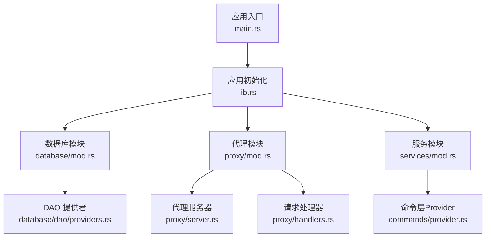
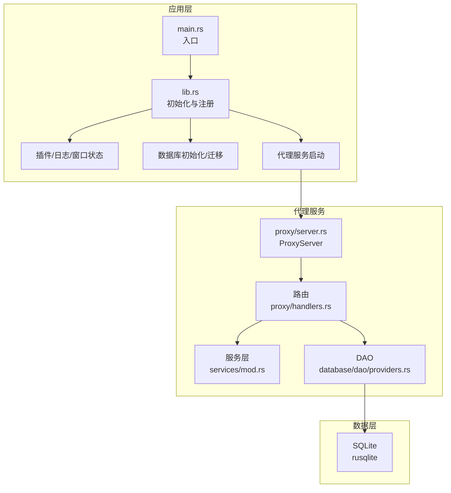
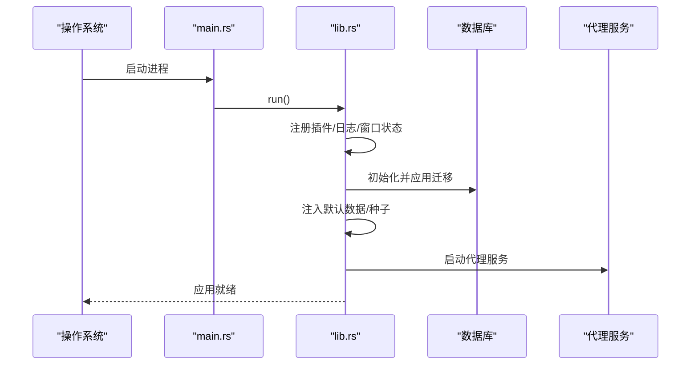
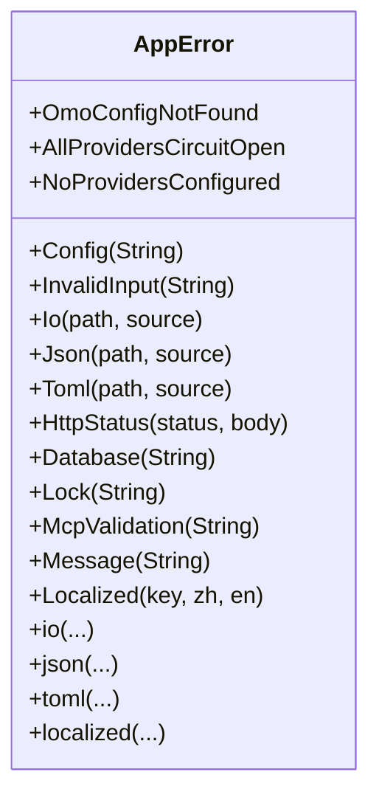
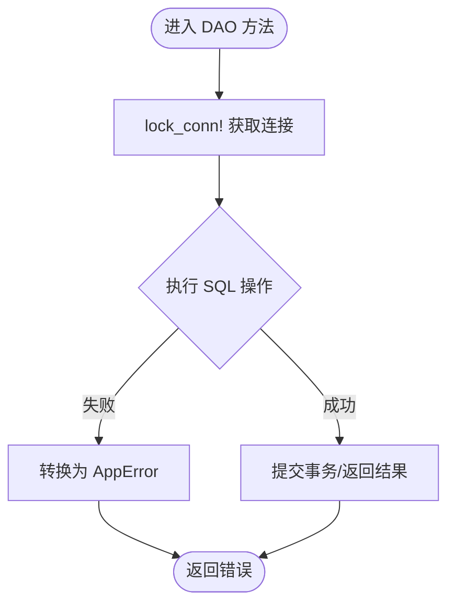
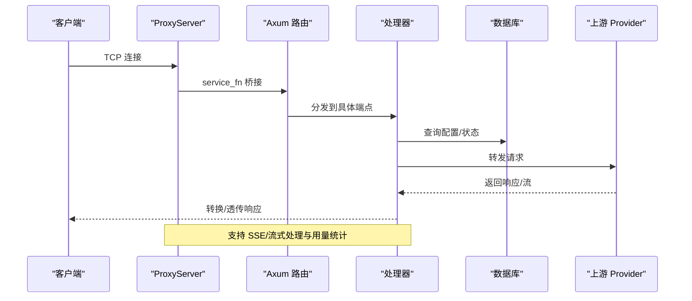
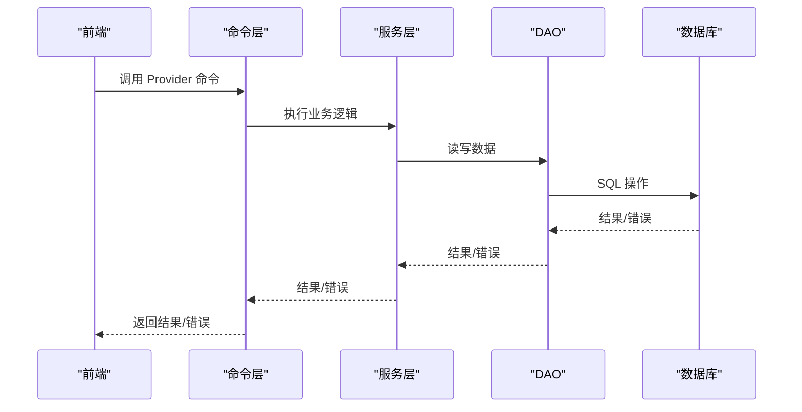
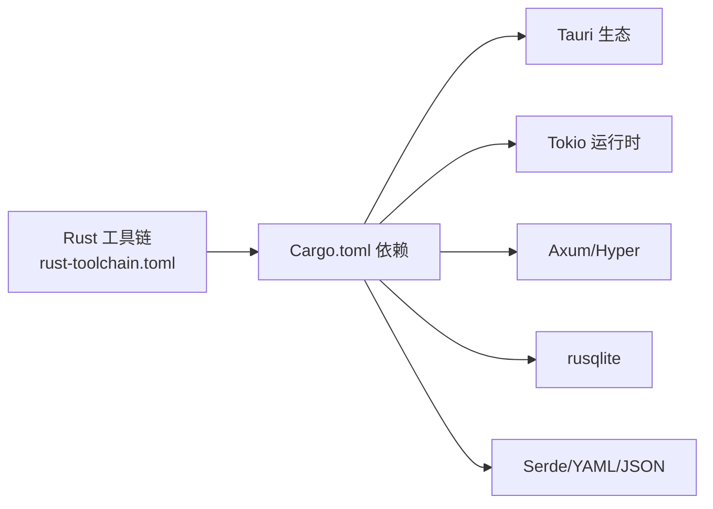

# Rust 编程基础

<cite>
**本文引用的文件**
- [Cargo.toml](file://src-tauri/Cargo.toml)
- [lib.rs](file://src-tauri/src/lib.rs)
- [main.rs](file://src-tauri/src/main.rs)
- [error.rs](file://src-tauri/src/error.rs)
- [mod.rs](file://src-tauri/src/database/mod.rs)
- [providers.rs](file://src-tauri/src/database/dao/providers.rs)
- [mod.rs](file://src-tauri/src/proxy/mod.rs)
- [server.rs](file://src-tauri/src/proxy/server.rs)
- [handlers.rs](file://src-tauri/src/proxy/handlers.rs)
- [mod.rs](file://src-tauri/src/services/mod.rs)
- [provider.rs](file://src-tauri/src/commands/provider.rs)
- [rust-toolchain.toml](file://rust-toolchain.toml)
</cite>

## 目录
1. [引言](#引言)
2. [项目结构](#项目结构)
3. [核心组件](#核心组件)
4. [架构总览](#架构总览)
5. [详细组件分析](#详细组件分析)
6. [依赖关系分析](#依赖关系分析)
7. [性能考量](#性能考量)
8. [故障排查指南](#故障排查指南)
9. [结论](#结论)
10. [附录](#附录)

## 引言
本章节面向希望系统掌握 CC Switch 项目中 Rust 编程基础的读者，围绕系统级编程的关键优势展开：内存安全保证、零成本抽象、并发模型。我们将结合 CC Switch 的实际实现，深入讲解所有权系统、借用检查器、生命周期管理，以及在项目中广泛使用的特性：Result 错误处理、Option 可选值、模式匹配、宏系统、异步编程（Tokio 运行时、Future/Stream）、包管理与构建配置。同时给出常见 Rust 模式与最佳实践的参考路径，帮助读者快速理解并应用到实际开发中。

## 项目结构
CC Switch 的 Rust 侧位于 src-tauri 目录，采用模块化组织，核心模块包括：
- 应用入口与初始化：main.rs、lib.rs
- 错误体系：error.rs
- 数据库与 DAO：database/mod.rs、database/dao/providers.rs
- 代理服务：proxy/mod.rs、proxy/server.rs、proxy/handlers.rs
- 服务层：services/mod.rs
- 命令层（Tauri 命令）：commands/provider.rs 等
- 依赖与构建：Cargo.toml、rust-toolchain.toml

图示来源
- [main.rs:1-23](file://src-tauri/src/main.rs#L1-L23)
- [lib.rs:1-120](file://src-tauri/src/lib.rs#L1-L120)
- [mod.rs:1-60](file://src-tauri/src/database/mod.rs#L1-L60)
- [server.rs:1-60](file://src-tauri/src/proxy/server.rs#L1-L60)
- [handlers.rs:1-60](file://src-tauri/src/proxy/handlers.rs#L1-L60)
- [providers.rs:1-40](file://src-tauri/src/database/dao/providers.rs#L1-L40)
- [mod.rs:1-40](file://src-tauri/src/services/mod.rs#L1-L40)
- [provider.rs:1-40](file://src-tauri/src/commands/provider.rs#L1-L40)

章节来源
- [Cargo.toml:1-110](file://src-tauri/Cargo.toml#L1-L110)
- [main.rs:1-23](file://src-tauri/src/main.rs#L1-L23)
- [lib.rs:1-120](file://src-tauri/src/lib.rs#L1-L120)

## 核心组件
- 应用入口与初始化：负责平台兼容性设置、插件注册、日志初始化、数据库初始化、迁移与种子数据注入、代理服务启动等。
- 错误体系：统一的 AppError 枚举，结合 thiserror/anyhow 提供可读的错误链与上下文。
- 数据库与 DAO：基于 rusqlite 的 SQLite 数据持久化，提供供应商、MCP、提示词、技能、设置等表的访问。
- 代理服务：基于 Axum/Hyper 的 HTTP 代理，支持多 Provider 故障转移、SSE 流式处理、熔断器、会话与用量统计。
- 服务层：ProviderService、ProxyService 等业务服务，封装复杂逻辑并暴露给命令层。
- 命令层：通过 #[tauri::command] 注解暴露到前端，协调服务层与数据库层。

章节来源
- [lib.rs:200-520](file://src-tauri/src/lib.rs#L200-L520)
- [error.rs:6-63](file://src-tauri/src/error.rs#L6-L63)
- [mod.rs:72-160](file://src-tauri/src/database/mod.rs#L72-L160)
- [server.rs:53-92](file://src-tauri/src/proxy/server.rs#L53-L92)
- [mod.rs:32-47](file://src-tauri/src/services/mod.rs#L32-L47)
- [provider.rs:21-71](file://src-tauri/src/commands/provider.rs#L21-L71)

## 架构总览
下图展示了 Rust 侧从应用入口到数据库与代理服务的整体交互：

图示来源
- [main.rs:1-23](file://src-tauri/src/main.rs#L1-L23)
- [lib.rs:220-520](file://src-tauri/src/lib.rs#L220-L520)
- [server.rs:94-140](file://src-tauri/src/proxy/server.rs#L94-L140)
- [handlers.rs:48-64](file://src-tauri/src/proxy/handlers.rs#L48-L64)
- [providers.rs:18-40](file://src-tauri/src/database/dao/providers.rs#L18-L40)
- [mod.rs:32-47](file://src-tauri/src/services/mod.rs#L32-L47)

## 详细组件分析

### 应用入口与初始化（main.rs、lib.rs）
- 入口设置：在 Windows Release 下隐藏控制台窗口；Linux 上设置 WebKit 环境变量以规避渲染问题。
- 初始化流程：注册单实例回调、深链 URL 处理、窗口关闭策略、日志系统（单文件覆盖）、数据库初始化与迁移、默认数据注入、代理服务启动、托盘菜单更新等。
- 关键点：日志初始化采用 tauri-plugin-log，数据库采用 rusqlite，迁移与种子数据通过 lib.rs 的初始化逻辑完成。

图示来源
- [main.rs:1-23](file://src-tauri/src/main.rs#L1-L23)
- [lib.rs:220-520](file://src-tauri/src/lib.rs#L220-L520)

章节来源
- [main.rs:1-23](file://src-tauri/src/main.rs#L1-L23)
- [lib.rs:220-520](file://src-tauri/src/lib.rs#L220-L520)

### 错误处理体系（error.rs）
- 使用 thiserror 定义统一的 AppError 枚举，覆盖配置、IO、JSON/TOML、HTTP 状态、数据库、锁、MCP 校验、本地化消息等场景。
- 提供便捷构造函数（如 io/json/toml/localized），并实现 From<T> 与序列化，便于跨层传递与前端展示。
- 与 anyhow 配合，形成“可读错误链 + 业务错误枚举”的混合策略。

图示来源
- [error.rs:6-94](file://src-tauri/src/error.rs#L6-L94)

章节来源
- [error.rs:6-147](file://src-tauri/src/error.rs#L6-L147)

### 数据库与 DAO（database/mod.rs、database/dao/providers.rs）
- 数据库封装：使用 Mutex 包裹 rusqlite::Connection，提供安全的多线程访问；初始化时启用外键与增量自动清理；支持内存数据库用于测试。
- DAO 提供者：提供供应商的增删改查、当前供应商切换、自定义端点维护、OMO 供应商互斥切换、种子数据注入等。
- 关键宏：lock_conn! 宏简化锁获取与错误转换，避免 unwrap。

图示来源
- [mod.rs:61-71](file://src-tauri/src/database/mod.rs#L61-L71)
- [providers.rs:180-278](file://src-tauri/src/database/dao/providers.rs#L180-L278)

章节来源
- [mod.rs:72-160](file://src-tauri/src/database/mod.rs#L72-L160)
- [providers.rs:18-109](file://src-tauri/src/database/dao/providers.rs#L18-L109)

### 代理服务（proxy/mod.rs、proxy/server.rs、proxy/handlers.rs）
- 代理服务器：基于 Axum/Hyper，手动 accept 循环，保留请求头大小写，支持健康检查、状态查询、多 API 前缀路由。
- 状态与共享：ProxyState 持有 Database、ProxyConfig、ProxyStatus、ProviderRouter、FailoverSwitchManager 等共享状态，使用 Arc+RwLock 线程安全共享。
- 请求处理：handlers.rs 将请求转换为 RequestContext，选择 Provider，转发并处理响应，支持流式与非流式转换、SSE 日志与用量统计、超时控制。
- 异步与并发：使用 tokio::spawn 启动服务器任务，tokio::sync::oneshot 用于优雅关闭，tokio::select! 处理 accept 与关闭信号。

图示来源
- [server.rs:138-223](file://src-tauri/src/proxy/server.rs#L138-L223)
- [handlers.rs:105-147](file://src-tauri/src/proxy/handlers.rs#L105-L147)
- [handlers.rs:564-570](file://src-tauri/src/proxy/handlers.rs#L564-L570)

章节来源
- [server.rs:53-92](file://src-tauri/src/proxy/server.rs#L53-L92)
- [server.rs:94-140](file://src-tauri/src/proxy/server.rs#L94-L140)
- [handlers.rs:105-147](file://src-tauri/src/proxy/handlers.rs#L105-L147)

### 服务层与命令层（services/mod.rs、commands/provider.rs）
- 服务层：ProviderService、ProxyService 等封装业务逻辑，与数据库与代理层协作。
- 命令层：通过 #[tauri::command] 暴露到前端，如获取/切换供应商、导入默认配置、测试端点延迟、查询用量脚本等。

图示来源
- [mod.rs:32-47](file://src-tauri/src/services/mod.rs#L32-L47)
- [provider.rs:21-71](file://src-tauri/src/commands/provider.rs#L21-L71)

章节来源
- [mod.rs:1-47](file://src-tauri/src/services/mod.rs#L1-L47)
- [provider.rs:21-71](file://src-tauri/src/commands/provider.rs#L21-L71)

## 依赖关系分析
- 语言与工具链：rust-toolchain.toml 指定 channel 与组件（rustfmt、clippy），确保团队一致性。
- 依赖生态：Cargo.toml 明确列出核心依赖，包括 Tauri 生态、Tokio、Axum、Hyper、rusqlite、serde 等。
- 平台特定依赖：针对 macOS/Windows/Linux 的插件与库（如 winreg、objc2、webkit2gtk）按需引入。

图示来源
- [rust-toolchain.toml:1-5](file://rust-toolchain.toml#L1-L5)
- [Cargo.toml:25-82](file://src-tauri/Cargo.toml#L25-L82)

章节来源
- [rust-toolchain.toml:1-5](file://rust-toolchain.toml#L1-L5)
- [Cargo.toml:1-110](file://src-tauri/Cargo.toml#L1-L110)

## 性能考量
- 数据库优化：启用外键与增量自动清理，启动时进行空间回收；提供内存数据库用于测试，降低 IO 压力。
- 代理性能：手动 accept 循环减少中间层开销；保留请求头大小写避免上游兼容性问题；流式处理与 SSE 日志在性能与可观测性之间平衡。
- 运行时配置：Tokio features 包含 macros、rt-multi-thread、time、sync，满足多线程与定时任务需求；release 配置启用 LTO、符号裁剪与 panic=unwind，兼顾体积与调试能力。

章节来源
- [mod.rs:118-160](file://src-tauri/src/database/mod.rs#L118-L160)
- [server.rs:138-140](file://src-tauri/src/proxy/server.rs#L138-L140)
- [Cargo.toml:99-106](file://src-tauri/Cargo.toml#L99-L106)

## 故障排查指南
- 错误类型：优先查看 AppError 枚举，定位是配置、IO、JSON、HTTP、数据库还是业务错误。
- 日志：应用初始化阶段会创建单文件日志，便于定位启动与迁移问题；代理服务在连接错误与流式处理中记录 debug 级别日志。
- 数据库：若迁移失败或数据库损坏，初始化流程会弹窗提示用户选择退出或重试；可通过备份与预迁移备份恢复。
- 代理：若代理端口冲突或绑定失败，查看 bind 错误；若连接异常，关注 accept/连接错误日志。

章节来源
- [error.rs:6-63](file://src-tauri/src/error.rs#L6-L63)
- [lib.rs:300-420](file://src-tauri/src/lib.rs#L300-L420)
- [server.rs:94-114](file://src-tauri/src/proxy/server.rs#L94-L114)

## 结论
CC Switch 的 Rust 实现充分体现了系统级编程的优势：通过所有权与借用检查保障内存安全，通过零成本抽象（如宏、trait、迭代器）提升开发效率，通过 Tokio 的异步模型实现高并发与低资源占用。项目在错误处理、数据持久化、代理服务与命令层之间建立了清晰的边界与协作关系，适合在大型桌面应用中推广 Rust 的工程化实践。

## 附录
- 常见 Rust 模式与最佳实践参考路径（以源码路径代替具体代码）：
  - 错误处理：[AppError 枚举与构造函数:6-94](file://src-tauri/src/error.rs#L6-L94)
  - Option/Result 模式：[数据库 DAO 方法返回 Result:18-40](file://src-tauri/src/database/dao/providers.rs#L18-L40)
  - 模式匹配：[代理处理器中的匹配与转换:105-147](file://src-tauri/src/proxy/handlers.rs#L105-L147)
  - 宏系统：[lock_conn! 宏:61-71](file://src-tauri/src/database/mod.rs#L61-L71)
  - 异步与并发：[代理服务器启动与关闭:94-140](file://src-tauri/src/proxy/server.rs#L94-L140)
  - 包管理与构建：[Cargo.toml 依赖与特性:18-82](file://src-tauri/Cargo.toml#L18-L82)、[rust-toolchain.toml:1-5](file://rust-toolchain.toml#L1-L5)