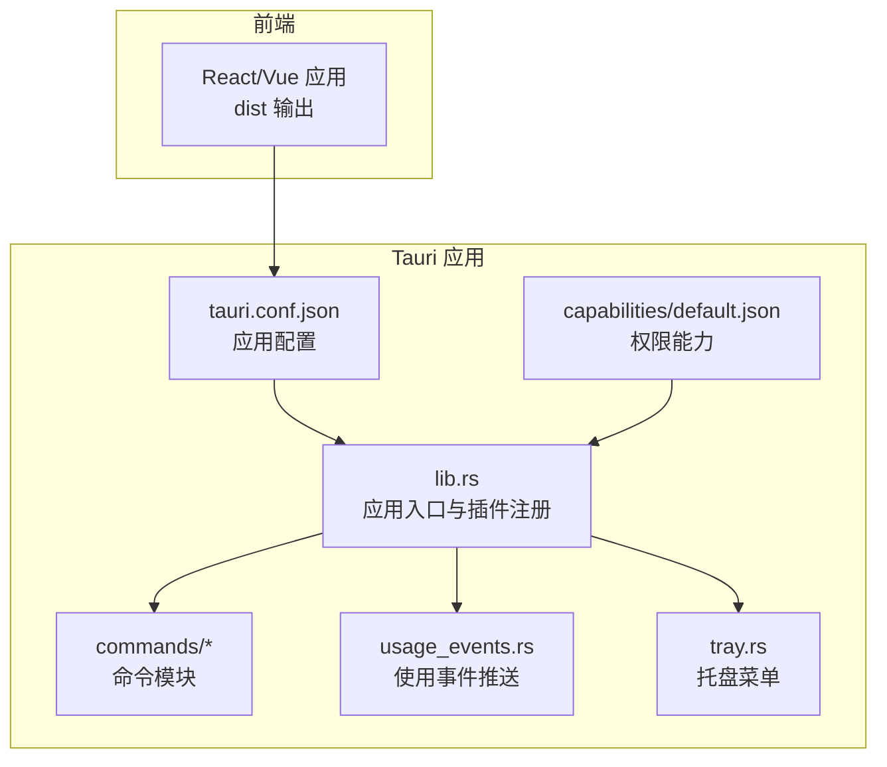
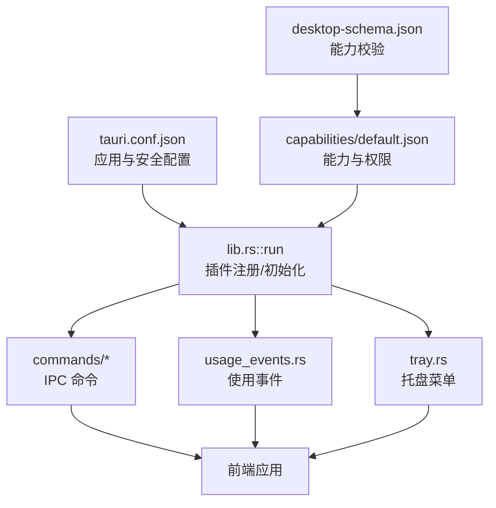
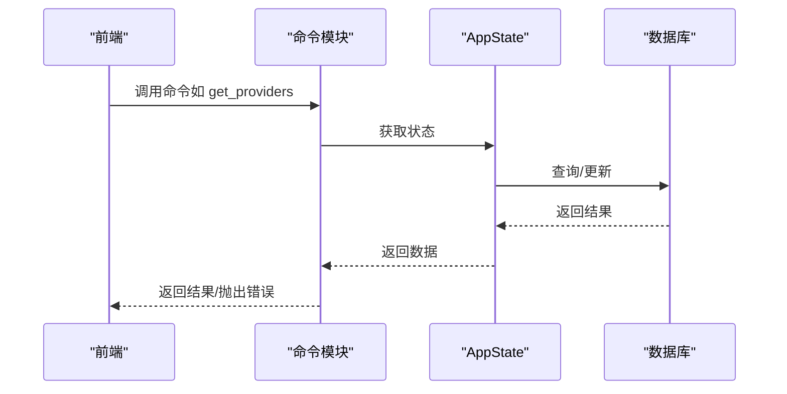
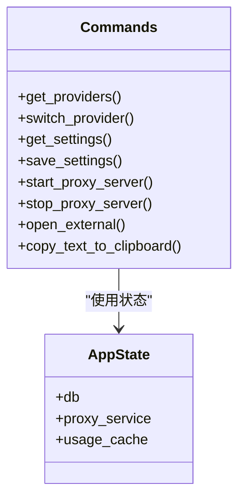
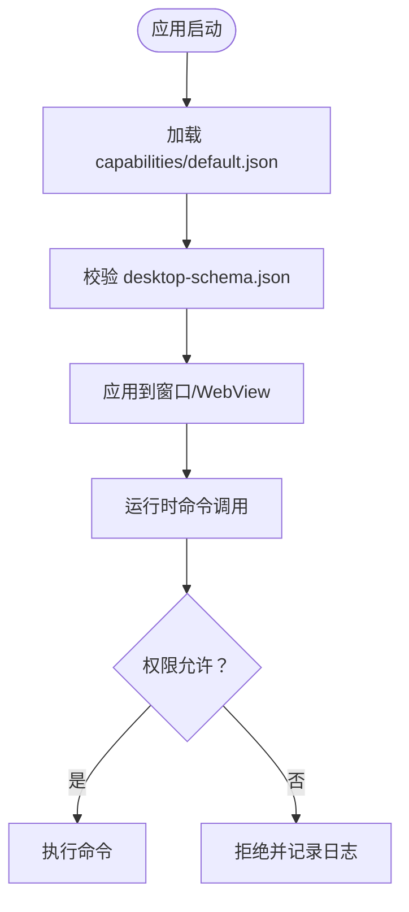
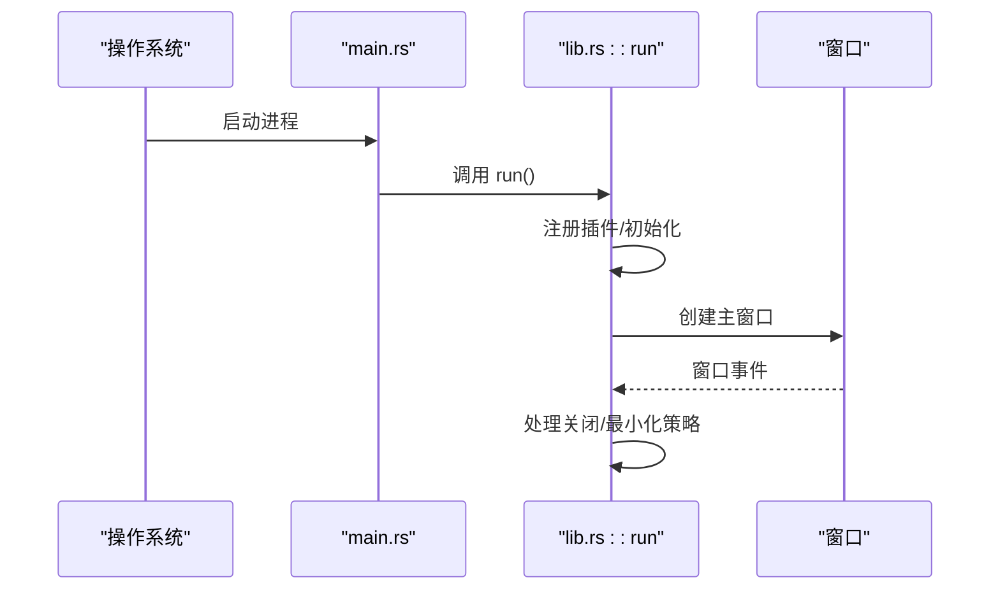
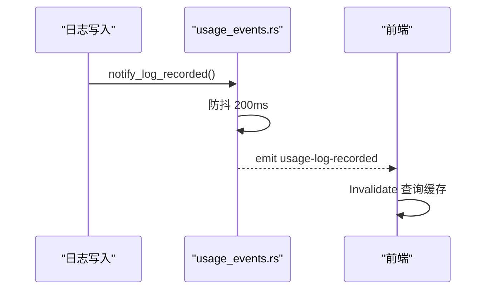
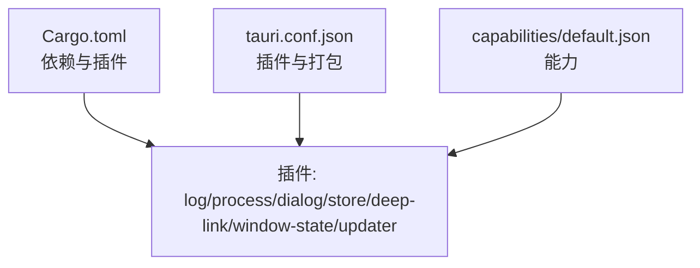

# Tauri 框架

<cite>
**本文引用的文件**
- [Cargo.toml](file://src-tauri/Cargo.toml)
- [tauri.conf.json](file://src-tauri/tauri.conf.json)
- [lib.rs](file://src-tauri/src/lib.rs)
- [main.rs](file://src-tauri/src/main.rs)
- [default.json](file://src-tauri/capabilities/default.json)
- [capabilities.json](file://src-tauri/gen/schemas/capabilities.json)
- [desktop-schema.json](file://src-tauri/gen/schemas/desktop-schema.json)
- [mod.rs](file://src-tauri/src/commands/mod.rs)
- [misc.rs](file://src-tauri/src/commands/misc.rs)
- [settings.rs](file://src-tauri/src/commands/settings.rs)
- [proxy.rs](file://src-tauri/src/commands/proxy.rs)
- [provider.rs](file://src-tauri/src/commands/provider.rs)
- [tray.rs](file://src-tauri/src/tray.rs)
- [usage_events.rs](file://src-tauri/src/usage_events.rs)
- [init_status.rs](file://src-tauri/src/init_status.rs)
</cite>

## 目录
1. [简介](#简介)
2. [项目结构](#项目结构)
3. [核心组件](#核心组件)
4. [架构总览](#架构总览)
5. [详细组件分析](#详细组件分析)
6. [依赖关系分析](#依赖关系分析)
7. [性能考量](#性能考量)
8. [故障排查指南](#故障排查指南)
9. [结论](#结论)
10. [附录](#附录)

## 简介
本文件面向 CC Switch 项目中的 Tauri 2 框架部分，系统性阐述其核心架构与实现细节，涵盖前端与后端桥接机制、命令系统、权限与安全模型、生命周期管理、跨平台适配、事件系统与 IPC 通信、数据序列化方式，并提供配置示例与最佳实践建议。内容基于仓库中的 Rust 后端与 Tauri 配置文件进行深入分析，帮助开发者理解并扩展应用能力。

## 项目结构
- 前端位于根目录的渲染进程资源，Tauri 通过构建配置指向 dist 输出目录。
- 后端 Rust 代码集中在 src-tauri，包含应用入口、命令模块、插件注册、窗口与托盘管理、事件系统等。
- 权限与能力通过 capabilities 与 JSON Schema 定义，结合 Tauri 配置文件进行声明式授权。

图表来源
- [tauri.conf.json:1-70](file://src-tauri/tauri.conf.json#L1-L70)
- [default.json:1-22](file://src-tauri/capabilities/default.json#L1-L22)
- [lib.rs:220-362](file://src-tauri/src/lib.rs#L220-L362)

章节来源
- [tauri.conf.json:1-70](file://src-tauri/tauri.conf.json#L1-L70)
- [Cargo.toml:1-110](file://src-tauri/Cargo.toml#L1-L110)

## 核心组件
- 应用入口与生命周期
  - 应用入口在 main.rs 中设置平台特定行为（如 Linux WebKit 环境变量），随后调用 lib.rs::run。
  - lib.rs::run 构建 Builder，注册插件（日志、进程、对话框、存储、窗口状态、深链、单实例等），完成数据库初始化、配置迁移、托盘菜单、事件推送等启动流程。
- 命令系统
  - 通过 #[tauri::command] 宏导出 Rust 函数到前端 IPC，命令按功能拆分在 commands 子模块中，统一在 mod.rs 汇总导出。
- 权限与能力
  - 通过 capabilities/default.json 声明默认能力与权限集合，结合 desktop-schema.json 的 JSON Schema 校验能力定义。
- 事件系统与 IPC
  - 使用 Emitter 发射事件（如 deeplink-import、deeplink-error、usage-log-recorded、proxy-flags-changed 等），前端通过监听这些事件实现 UI 与状态联动。
- 托盘与窗口
  - 托盘菜单动态构建，支持按应用分区显示供应商列表、自动模式、轻量模式、退出等操作；窗口事件处理（关闭最小化到托盘、任务栏策略等）。

章节来源
- [main.rs:1-23](file://src-tauri/src/main.rs#L1-L23)
- [lib.rs:220-362](file://src-tauri/src/lib.rs#L220-L362)
- [mod.rs:1-69](file://src-tauri/src/commands/mod.rs#L1-L69)
- [default.json:1-22](file://src-tauri/capabilities/default.json#L1-L22)
- [desktop-schema.json:1-120](file://src-tauri/gen/schemas/desktop-schema.json#L1-L120)

## 架构总览
Tauri 2 在 CC Switch 中采用“声明式能力 + 插件化 + 命令系统”的架构：
- 配置层：tauri.conf.json 定义产品元信息、窗口属性、安全策略（CSP）、插件与打包配置。
- 能力层：capabilities/default.json 与 desktop-schema.json 定义窗口与 webview 的权限边界。
- 运行时层：lib.rs 注册插件、初始化数据库与日志、构建窗口与托盘、注册命令；commands/* 实现具体业务命令。
- 事件层：usage_events.rs 与 tray.rs 等模块通过 Emitter 推送事件到前端。

图表来源
- [tauri.conf.json:1-70](file://src-tauri/tauri.conf.json#L1-L70)
- [default.json:1-22](file://src-tauri/capabilities/default.json#L1-L22)
- [desktop-schema.json:1-120](file://src-tauri/gen/schemas/desktop-schema.json#L1-L120)
- [lib.rs:220-362](file://src-tauri/src/lib.rs#L220-L362)

## 详细组件分析

### 前端与后端桥接机制（IPC）
- 命令导出
  - 所有命令通过 #[tauri::command] 宏声明，Rust 函数签名自动映射到前端 IPC 调用。
  - 命令模块按功能拆分，统一在 mod.rs 汇总，便于维护与扩展。
- 事件发射
  - 使用 app.emit 发射事件，前端通过 Emitter 监听；如 deeplink-import、deeplink-error、usage-log-recorded、proxy-flags-changed 等。
- 状态与上下文
  - 通过 tauri::State 获取 AppState，实现跨命令的状态共享与数据库访问。

图表来源
- [provider.rs:21-35](file://src-tauri/src/commands/provider.rs#L21-L35)
- [settings.rs:60-72](file://src-tauri/src/commands/settings.rs#L60-L72)

章节来源
- [mod.rs:1-69](file://src-tauri/src/commands/mod.rs#L1-L69)
- [provider.rs:1-120](file://src-tauri/src/commands/provider.rs#L1-L120)
- [settings.rs:1-120](file://src-tauri/src/commands/settings.rs#L1-L120)

### 命令系统实现
- 命令分类
  - 基础命令：misc.rs（外部链接、剪贴板、工具版本探测、生命周期动作等）
  - 设置命令：settings.rs（获取/保存设置、自动启动、日志配置等）
  - 代理命令：proxy.rs（代理服务启停、接管状态、配置更新、熔断器等）
  - 供应商命令：provider.rs（供应商 CRUD、切换、用量查询、自定义端点等）
- 命令特性
  - 异步实现，使用 tokio::task::spawn_blocking 处理阻塞操作（如剪贴板、工具探测）。
  - 参数与返回值通过 serde 序列化，确保跨语言传输一致性。

图表来源
- [misc.rs:21-80](file://src-tauri/src/commands/misc.rs#L21-L80)
- [settings.rs:60-120](file://src-tauri/src/commands/settings.rs#L60-L120)
- [proxy.rs:10-82](file://src-tauri/src/commands/proxy.rs#L10-L82)
- [provider.rs:21-120](file://src-tauri/src/commands/provider.rs#L21-L120)

章节来源
- [misc.rs:1-200](file://src-tauri/src/commands/misc.rs#L1-L200)
- [settings.rs:1-120](file://src-tauri/src/commands/settings.rs#L1-L120)
- [proxy.rs:1-120](file://src-tauri/src/commands/proxy.rs#L1-L120)
- [provider.rs:1-120](file://src-tauri/src/commands/provider.rs#L1-L120)

### 权限管理模型（能力与插件）
- 能力定义
  - default.json 声明默认能力与权限集合，限定窗口 main 的访问范围与命令权限。
- 能力校验
  - desktop-schema.json 提供 JSON Schema，约束能力字段（identifier、permissions、windows、webviews 等）。
- 插件权限
  - 通过 tauri.conf.json 的 plugins 字段启用 deep-link、updater 等插件，并在 capabilities 中授予相应权限。

图表来源
- [default.json:1-22](file://src-tauri/capabilities/default.json#L1-L22)
- [desktop-schema.json:38-120](file://src-tauri/gen/schemas/desktop-schema.json#L38-L120)
- [tauri.conf.json:56-68](file://src-tauri/tauri.conf.json#L56-L68)

章节来源
- [default.json:1-22](file://src-tauri/capabilities/default.json#L1-L22)
- [capabilities.json:1-1](file://src-tauri/gen/schemas/capabilities.json#L1-L1)
- [desktop-schema.json:1-120](file://src-tauri/gen/schemas/desktop-schema.json#L1-L120)
- [tauri.conf.json:56-68](file://src-tauri/tauri.conf.json#L56-L68)

### 生命周期管理（启动到窗口）
- 启动阶段
  - main.rs 设置平台特定环境变量，调用 lib.rs::run。
  - lib.rs::run 注册插件、初始化日志、数据库与配置迁移、托盘菜单、深链处理、窗口事件等。
- 窗口管理
  - 通过 tauri.conf.json 定义窗口属性（标题栏样式、尺寸、最小化到托盘策略等）。
  - on_window_event 拦截 CloseRequested，根据设置决定最小化到托盘或直接退出。

图表来源
- [main.rs:1-23](file://src-tauri/src/main.rs#L1-L23)
- [lib.rs:220-362](file://src-tauri/src/lib.rs#L220-L362)
- [tauri.conf.json:13-27](file://src-tauri/tauri.conf.json#L13-L27)

章节来源
- [main.rs:1-23](file://src-tauri/src/main.rs#L1-L23)
- [lib.rs:220-362](file://src-tauri/src/lib.rs#L220-L362)
- [tauri.conf.json:13-27](file://src-tauri/tauri.conf.json#L13-L27)

### 跨平台支持（Windows/macOS/Linux）
- Windows
  - 设置 AppUserModelID，深链注册（调试模式下显式注册），任务栏策略。
- macOS
  - Dock 可见性与激活策略控制，托盘图标资源。
- Linux
  - 设置 WebKit 环境变量规避 DMA-BUF/合成器问题，托盘菜单与窗口修复。

章节来源
- [lib.rs:72-86](file://src-tauri/src/lib.rs#L72-L86)
- [lib.rs:220-362](file://src-tauri/src/lib.rs#L220-L362)
- [tray.rs:679-696](file://src-tauri/src/tray.rs#L679-L696)

### 事件系统与 IPC 通信
- 事件类型
  - 深链事件：deeplink-import、deeplink-error
  - 使用事件：usage-log-recorded
  - 代理与切换事件：proxy-flags-changed、provider-switched
- 推送机制
  - usage_events.rs 提供全局 AppHandle 注入与防抖合并推送，避免高频写入导致前端频繁刷新。
  - tray.rs 动态构建托盘菜单并发射事件，支持自动模式与供应商切换。

图表来源
- [usage_events.rs:42-68](file://src-tauri/src/usage_events.rs#L42-L68)

章节来源
- [lib.rs:124-182](file://src-tauri/src/lib.rs#L124-L182)
- [usage_events.rs:1-69](file://src-tauri/src/usage_events.rs#L1-L69)
- [tray.rs:321-485](file://src-tauri/src/tray.rs#L321-L485)

### 数据序列化方式
- 命令参数与返回值
  - 通过 serde（derive）自动序列化/反序列化，确保跨语言传输一致性。
- 事件负载
  - 使用 serde_json::json! 构造事件负载，前端通过监听事件名接收数据。

章节来源
- [misc.rs:99-112](file://src-tauri/src/commands/misc.rs#L99-L112)
- [settings.rs:60-72](file://src-tauri/src/commands/settings.rs#L60-L72)

## 依赖关系分析
- 依赖与插件
  - Cargo.toml 声明 tauri 2 与众多插件（日志、进程、对话框、存储、深链、窗口状态、更新器等），并针对平台引入额外依赖（如 Linux WebKit、Windows 注册表）。
- 能力与插件耦合
  - capabilities/default.json 与 tauri.conf.json 的 plugins 字段共同决定可用能力与命令访问范围。

图表来源
- [Cargo.toml:25-96](file://src-tauri/Cargo.toml#L25-L96)
- [tauri.conf.json:56-68](file://src-tauri/tauri.conf.json#L56-L68)
- [default.json:8-21](file://src-tauri/capabilities/default.json#L8-L21)

章节来源
- [Cargo.toml:25-96](file://src-tauri/Cargo.toml#L25-L96)
- [tauri.conf.json:56-68](file://src-tauri/tauri.conf.json#L56-L68)
- [default.json:8-21](file://src-tauri/capabilities/default.json#L8-L21)

## 性能考量
- 启动性能
  - profile.release 配置（LTO、strip、优化级别）有助于减小二进制体积与提升运行效率。
- I/O 与阻塞
  - 使用 spawn_blocking 处理剪贴板等阻塞操作，避免阻塞异步运行时。
- 事件推送
  - usage_events.rs 的 200ms 防抖合并减少前端无效刷新，提升交互流畅度。
- 数据库与迁移
  - 启动阶段进行配置迁移与数据库初始化，失败时弹出对话框让用户选择重试，避免应用不可用。

章节来源
- [Cargo.toml:99-106](file://src-tauri/Cargo.toml#L99-L106)
- [misc.rs:38-51](file://src-tauri/src/commands/misc.rs#L38-L51)
- [usage_events.rs:42-68](file://src-tauri/src/usage_events.rs#L42-L68)
- [lib.rs:363-446](file://src-tauri/src/lib.rs#L363-L446)

## 故障排查指南
- 深链处理
  - handle_deeplink_url 负责解析深链 URL 并发射 deeplink-import/deeplink-error 事件；若解析失败，检查 URL 格式与前端监听。
- 代理与接管
  - stop_proxy_server 在仍有应用接管时拒绝停止；检查 get_proxy_takeover_status 与 set_proxy_takeover_for_app 的状态。
- 托盘菜单
  - refresh_tray_menu 与 schedule_tray_refresh 用于动态更新菜单标题；若菜单不更新，检查状态锁与调度逻辑。
- 初始化错误
  - init_status 提供一次性初始化错误与迁移结果状态，前端可通过 get_init_error/get_migration_result/get_skills_migration_result 获取。

章节来源
- [lib.rs:124-182](file://src-tauri/src/lib.rs#L124-L182)
- [proxy.rs:18-40](file://src-tauri/src/commands/proxy.rs#L18-L40)
- [tray.rs:665-776](file://src-tauri/src/tray.rs#L665-L776)
- [init_status.rs:17-53](file://src-tauri/src/init_status.rs#L17-L53)

## 结论
CC Switch 的 Tauri 2 实现以声明式能力为核心，结合插件化与命令系统，提供了清晰的前后端桥接、完善的事件驱动与状态管理、稳健的跨平台适配与安全模型。通过合理的启动流程、防抖事件推送与阻塞 I/O 处理，整体具备良好的性能与可维护性。建议在扩展新功能时遵循现有命令模块划分与能力声明规范，确保权限边界清晰与安全性可控。

## 附录
- 配置示例与最佳实践
  - 应用配置
    - 在 tauri.conf.json 中设置窗口属性、CSP、插件与打包选项。
  - 能力与权限
    - 在 capabilities/default.json 中声明窗口与权限集合，配合 desktop-schema.json 校验。
  - 插件启用
    - 在 tauri.conf.json 的 plugins 字段启用所需插件，并在 capabilities 中授予相应权限。
  - 命令扩展
    - 新增命令时，按功能拆分到 commands 子模块并在 mod.rs 汇总导出；使用 #[tauri::command] 宏声明。
  - 事件推送
    - 使用 usage_events.rs 的全局 AppHandle 与防抖机制推送高频事件，避免前端过度刷新。
  - 跨平台注意
    - Windows：设置 AppUserModelID、深链注册；Linux：设置 WebKit 环境变量；macOS：Dock 与激活策略控制。

章节来源
- [tauri.conf.json:1-70](file://src-tauri/tauri.conf.json#L1-L70)
- [default.json:1-22](file://src-tauri/capabilities/default.json#L1-L22)
- [desktop-schema.json:1-120](file://src-tauri/gen/schemas/desktop-schema.json#L1-L120)
- [lib.rs:220-362](file://src-tauri/src/lib.rs#L220-L362)
- [usage_events.rs:30-68](file://src-tauri/src/usage_events.rs#L30-L68)