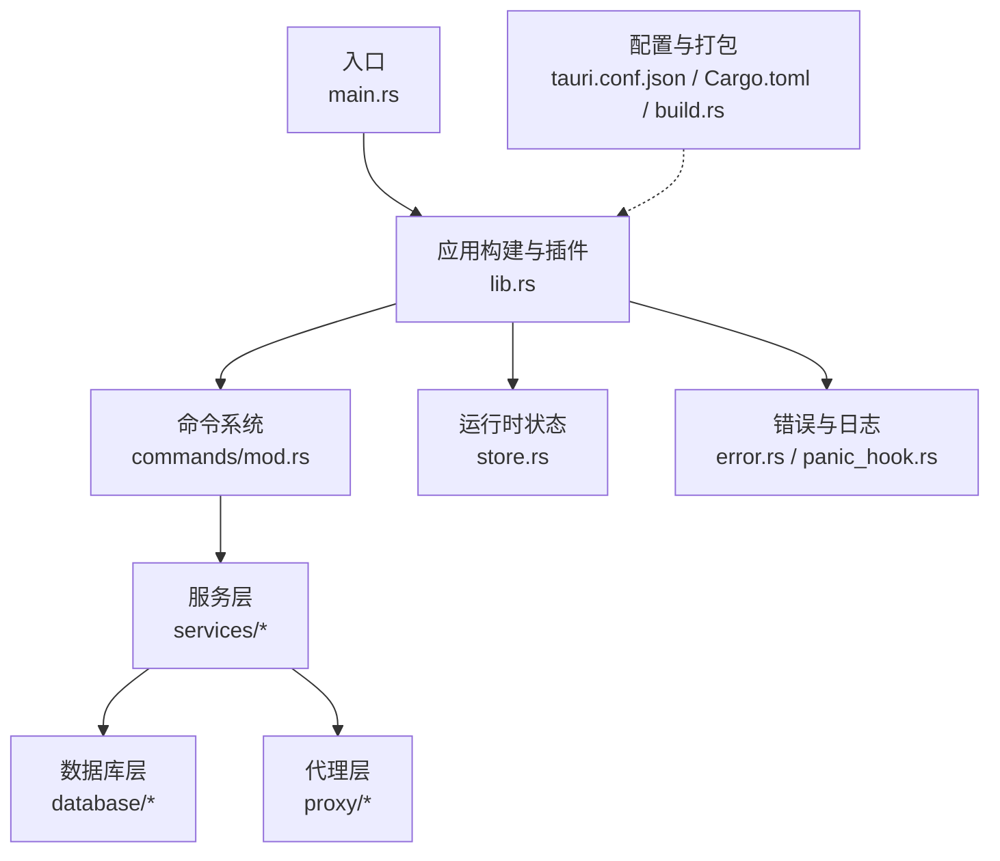
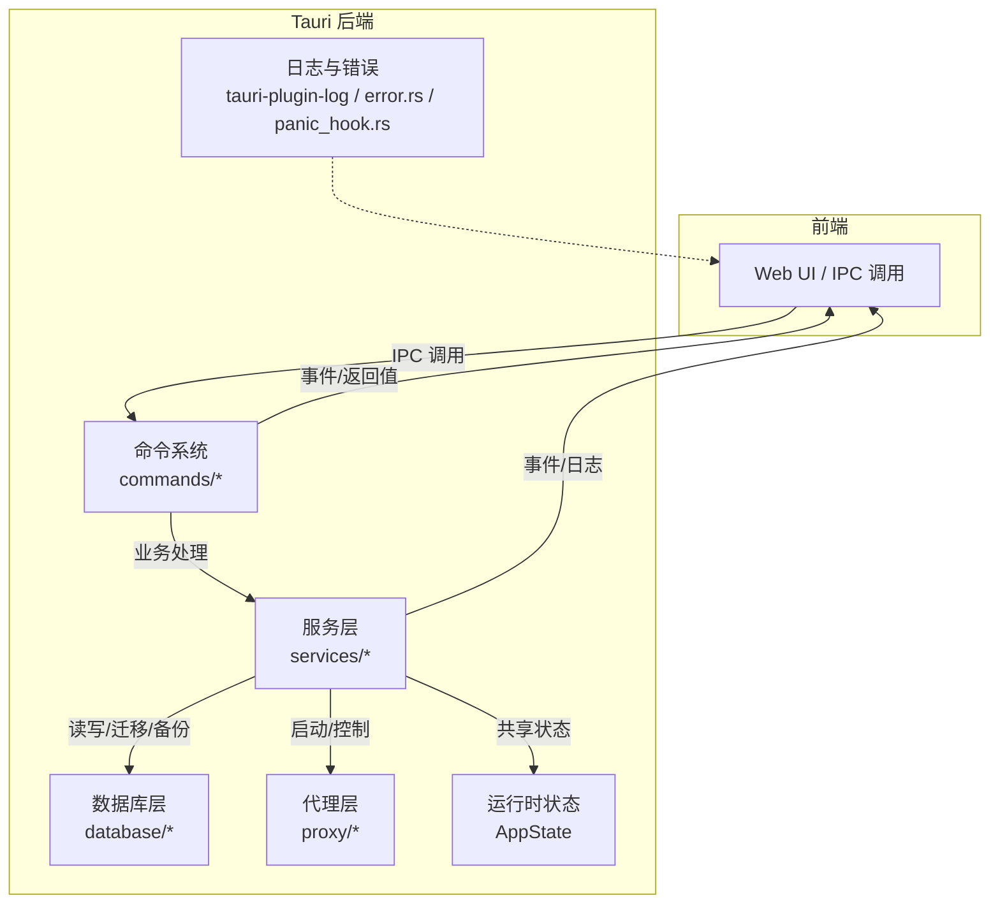
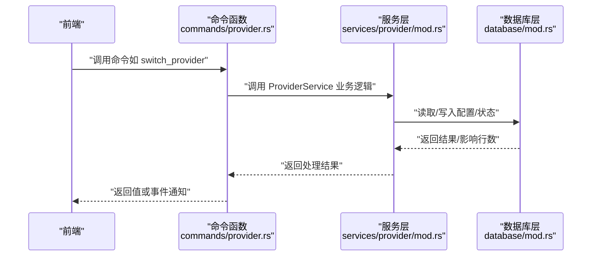
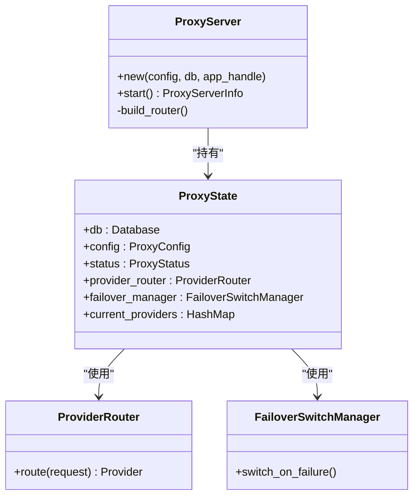
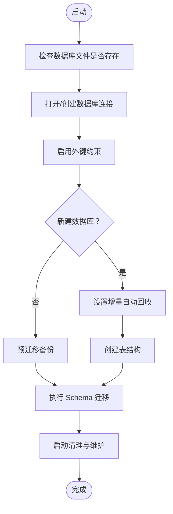
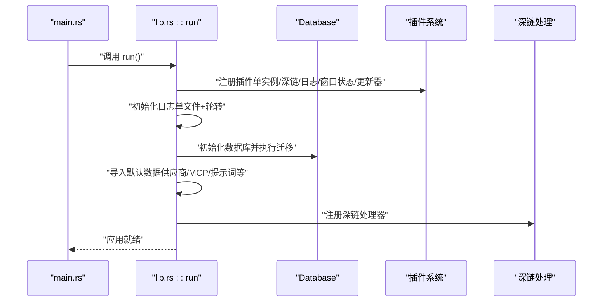
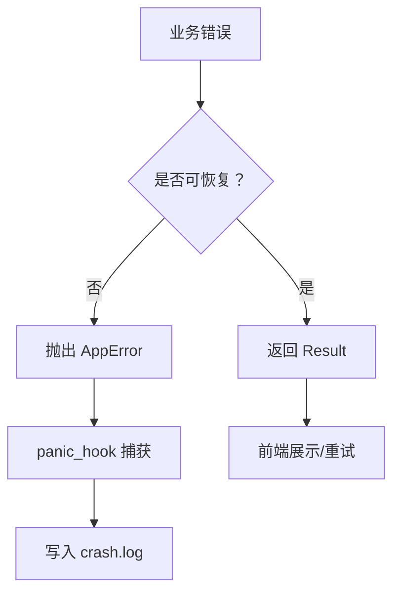
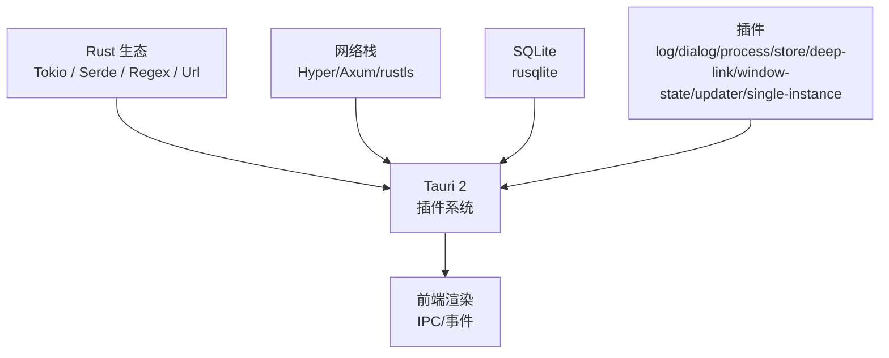

# 后端架构

<cite>
**本文引用的文件**
- [Cargo.toml](file://src-tauri/Cargo.toml)
- [main.rs](file://src-tauri/src/main.rs)
- [lib.rs](file://src-tauri/src/lib.rs)
- [tauri.conf.json](file://src-tauri/tauri.conf.json)
- [build.rs](file://src-tauri/build.rs)
- [commands/mod.rs](file://src-tauri/src/commands/mod.rs)
- [commands/provider.rs](file://src-tauri/src/commands/provider.rs)
- [services/mod.rs](file://src-tauri/src/services/mod.rs)
- [services/provider/mod.rs](file://src-tauri/src/services/provider/mod.rs)
- [database/mod.rs](file://src-tauri/src/database/mod.rs)
- [proxy/mod.rs](file://src-tauri/src/proxy/mod.rs)
- [proxy/server.rs](file://src-tauri/src/proxy/server.rs)
- [store.rs](file://src-tauri/src/store.rs)
- [panic_hook.rs](file://src-tauri/src/panic_hook.rs)
- [error.rs](file://src-tauri/src/error.rs)
</cite>

## 目录
1. [简介](#简介)
2. [项目结构](#项目结构)
3. [核心组件](#核心组件)
4. [架构总览](#架构总览)
5. [详细组件分析](#详细组件分析)
6. [依赖关系分析](#依赖关系分析)
7. [性能考量](#性能考量)
8. [故障排查指南](#故障排查指南)
9. [结论](#结论)
10. [附录](#附录)

## 简介
本文件面向 CC Switch 项目的后端架构，围绕基于 Tauri 2 + Rust 的技术栈进行系统化说明。重点涵盖：
- Rust 在系统级编程中的优势：内存安全、并发模型、性能特性
- Tauri 框架的架构原理：前端与后端桥接、命令系统、权限与插件体系
- 后端服务的模块化设计：代理服务、数据库服务、配置管理、任务调度等
- 异步编程模式、错误处理机制、日志系统
- 性能优化策略、内存管理、线程安全
- 与前端的通信协议、数据序列化、事件驱动架构

## 项目结构
后端代码位于 src-tauri 目录，采用“模块化 + 分层”的组织方式：
- 入口与构建：main.rs、lib.rs、tauri.conf.json、build.rs
- 命令层：commands/ 下按功能划分命令模块，统一导出并通过 #[tauri::command] 注解暴露给前端
- 服务层：services/ 提供业务逻辑封装，如 ProviderService、ProxyService、UsageCache 等
- 数据层：database/ 封装 SQLite 持久化、DAO、迁移与备份
- 代理层：proxy/ 实现本地 HTTP 代理、路由、熔断、故障转移、SSE、会话管理等
- 运行时状态：store.rs 定义 AppState，集中管理数据库、代理服务、用量缓存
- 错误与异常：error.rs 定义统一错误类型，panic_hook.rs 提供崩溃日志记录
- 配置与插件：tauri.conf.json 定义窗口、CSP、插件与打包参数；Cargo.toml 管理依赖与特性

图表来源
- [main.rs:1-23](file://src-tauri/src/main.rs#L1-L23)
- [lib.rs:1-120](file://src-tauri/src/lib.rs#L1-L120)
- [commands/mod.rs:1-69](file://src-tauri/src/commands/mod.rs#L1-L69)
- [services/mod.rs:1-47](file://src-tauri/src/services/mod.rs#L1-L47)
- [database/mod.rs:1-60](file://src-tauri/src/database/mod.rs#L1-L60)
- [proxy/mod.rs:1-60](file://src-tauri/src/proxy/mod.rs#L1-L60)
- [store.rs:1-24](file://src-tauri/src/store.rs#L1-L24)
- [error.rs:1-60](file://src-tauri/src/error.rs#L1-L60)
- [panic_hook.rs:1-60](file://src-tauri/src/panic_hook.rs#L1-L60)
- [tauri.conf.json:1-70](file://src-tauri/tauri.conf.json#L1-L70)
- [Cargo.toml:1-110](file://src-tauri/Cargo.toml#L1-L110)
- [build.rs:1-29](file://src-tauri/build.rs#L1-L29)

章节来源
- [main.rs:1-23](file://src-tauri/src/main.rs#L1-L23)
- [lib.rs:1-120](file://src-tauri/src/lib.rs#L1-L120)
- [tauri.conf.json:1-70](file://src-tauri/tauri.conf.json#L1-L70)
- [Cargo.toml:1-110](file://src-tauri/Cargo.toml#L1-L110)
- [build.rs:1-29](file://src-tauri/build.rs#L1-L29)

## 核心组件
- 应用入口与生命周期
  - main.rs：平台特定配置（Linux WebKit 环境变量），调用 lib.rs::run 启动应用
  - lib.rs：构建 Tauri Builder，注册插件（单实例、深链、进程、对话框、存储、窗口状态、日志、更新器）、初始化日志、数据库、迁移、默认数据导入、托盘菜单、深链事件分发
- 命令系统
  - commands/mod.rs：聚合各功能命令模块，统一导出
  - commands/provider.rs：提供供应商 CRUD、切换、导入默认配置等命令，通过 #[tauri::command] 暴露给前端
- 服务层
  - services/mod.rs：导出核心服务，如 ProviderService、ProxyService、UsageCache 等
  - services/provider/mod.rs：实现供应商业务逻辑（导入、切换、校验、与 live 配置同步等）
- 数据层
  - database/mod.rs：封装数据库初始化、Schema 版本控制、迁移、DAO、备份、清理与增量维护
- 代理层
  - proxy/mod.rs：导出代理相关类型与组件（熔断器、路由、会话、SSE、使用统计等）
  - proxy/server.rs：基于 Axum + Hyper 的本地 HTTP 代理服务器，支持故障转移、头部大小写保留、并发连接处理
- 运行时状态
  - store.rs：AppState 聚合数据库、代理服务、用量缓存，作为 Tauri State 传递给命令与服务
- 错误与日志
  - error.rs：统一 AppError 枚举，支持序列化与本地化消息
  - panic_hook.rs：全局 panic hook，将崩溃信息写入 crash.log，包含系统信息、位置与完整 backtrace

章节来源
- [main.rs:1-23](file://src-tauri/src/main.rs#L1-L23)
- [lib.rs:220-420](file://src-tauri/src/lib.rs#L220-L420)
- [commands/mod.rs:1-69](file://src-tauri/src/commands/mod.rs#L1-L69)
- [commands/provider.rs:1-200](file://src-tauri/src/commands/provider.rs#L1-L200)
- [services/mod.rs:1-47](file://src-tauri/src/services/mod.rs#L1-L47)
- [services/provider/mod.rs:1-200](file://src-tauri/src/services/provider/mod.rs#L1-L200)
- [database/mod.rs:72-160](file://src-tauri/src/database/mod.rs#L72-L160)
- [proxy/mod.rs:1-60](file://src-tauri/src/proxy/mod.rs#L1-L60)
- [proxy/server.rs:32-120](file://src-tauri/src/proxy/server.rs#L32-L120)
- [store.rs:1-24](file://src-tauri/src/store.rs#L1-L24)
- [error.rs:1-147](file://src-tauri/src/error.rs#L1-L147)
- [panic_hook.rs:71-185](file://src-tauri/src/panic_hook.rs#L71-L185)

## 架构总览
下图展示 CC Switch 后端在 Tauri 2 + Rust 下的整体架构：前端通过 IPC 调用后端命令，命令经服务层处理，必要时访问数据库或启动代理服务，最终通过事件或返回值与前端交互。

图表来源
- [lib.rs:260-360](file://src-tauri/src/lib.rs#L260-L360)
- [commands/mod.rs:1-69](file://src-tauri/src/commands/mod.rs#L1-L69)
- [services/mod.rs:1-47](file://src-tauri/src/services/mod.rs#L1-L47)
- [database/mod.rs:1-60](file://src-tauri/src/database/mod.rs#L1-L60)
- [proxy/mod.rs:1-60](file://src-tauri/src/proxy/mod.rs#L1-L60)
- [store.rs:1-24](file://src-tauri/src/store.rs#L1-L24)
- [error.rs:1-60](file://src-tauri/src/error.rs#L1-L60)
- [panic_hook.rs:71-185](file://src-tauri/src/panic_hook.rs#L71-L185)

## 详细组件分析

### 命令系统与前端桥接
- 命令注册与导出
  - commands/mod.rs 聚合各命令模块并通过 pub use 导出，统一暴露给 Tauri
  - commands/provider.rs 展示典型命令模式：#[tauri::command] + State<AppState> + Result<T, String>
- 前端调用流程
  - 前端通过 IPC 调用后端命令，命令在后端线程池中执行，返回结果或触发事件
  - 错误通过 Result<T, String> 或事件上报前端，避免异常泄漏到前端

图表来源
- [commands/provider.rs:102-110](file://src-tauri/src/commands/provider.rs#L102-L110)
- [services/provider/mod.rs:1-120](file://src-tauri/src/services/provider/mod.rs#L1-L120)
- [database/mod.rs:118-160](file://src-tauri/src/database/mod.rs#L118-L160)

章节来源
- [commands/mod.rs:1-69](file://src-tauri/src/commands/mod.rs#L1-L69)
- [commands/provider.rs:1-200](file://src-tauri/src/commands/provider.rs#L1-L200)
- [services/provider/mod.rs:1-200](file://src-tauri/src/services/provider/mod.rs#L1-L200)
- [database/mod.rs:72-160](file://src-tauri/src/database/mod.rs#L72-L160)

### 代理服务与故障转移
- 代理服务器
  - proxy/server.rs 基于 Axum + Hyper 构建 HTTP 代理，支持自定义头部大小写保留、并发连接、优雅关闭
  - 通过 ProxyState 共享数据库、配置、状态、ProviderRouter、故障转移管理器等
- 故障转移与熔断
  - 代理层导出 CircuitBreaker、ProviderRouter、FailoverSwitchManager 等组件，实现多 Provider 的健康检查与自动切换
- SSE 与会话
  - 支持 SSE 流式响应、会话 ID 提取与管理，保障流式体验与一致性

图表来源
- [proxy/server.rs:32-120](file://src-tauri/src/proxy/server.rs#L32-L120)
- [proxy/mod.rs:38-60](file://src-tauri/src/proxy/mod.rs#L38-L60)

章节来源
- [proxy/server.rs:1-200](file://src-tauri/src/proxy/server.rs#L1-L200)
- [proxy/mod.rs:1-60](file://src-tauri/src/proxy/mod.rs#L1-L60)

### 数据库服务与迁移
- 数据库初始化
  - database/mod.rs::Database::init 创建/打开 SQLite 文件，启用外键与增量自动回收，执行 Schema 迁移
  - 支持预迁移备份、增量维护（清理旧日志、rollup、incremental_vacuum）
- DAO 与迁移
  - DAO 子模块负责具体表的读写；migration 模块处理从旧 JSON 配置到 SQLite 的迁移
- 并发与线程安全
  - 使用 Mutex 包装 rusqlite::Connection，配合 lock_conn! 宏安全获取锁，避免跨线程竞争

图表来源
- [database/mod.rs:92-160](file://src-tauri/src/database/mod.rs#L92-L160)

章节来源
- [database/mod.rs:1-273](file://src-tauri/src/database/mod.rs#L1-L273)

### 配置管理与启动流程
- 启动阶段
  - lib.rs::run 在 Tauri setup 阶段完成：日志初始化、数据库初始化与迁移、默认数据导入、深链注册、托盘菜单、窗口状态等
- 配置与插件
  - tauri.conf.json 定义窗口、CSP、插件（deep-link、updater、log 等）与打包参数
  - Cargo.toml 管理依赖与特性，如 test-hooks、release 优化配置

图表来源
- [main.rs:1-23](file://src-tauri/src/main.rs#L1-L23)
- [lib.rs:300-420](file://src-tauri/src/lib.rs#L300-L420)
- [tauri.conf.json:1-70](file://src-tauri/tauri.conf.json#L1-L70)
- [Cargo.toml:1-110](file://src-tauri/Cargo.toml#L1-L110)

章节来源
- [lib.rs:220-420](file://src-tauri/src/lib.rs#L220-L420)
- [tauri.conf.json:1-70](file://src-tauri/tauri.conf.json#L1-L70)
- [Cargo.toml:1-110](file://src-tauri/Cargo.toml#L1-L110)

### 错误处理与日志系统
- 错误模型
  - error.rs::AppError 提供统一错误类型，支持序列化与本地化消息，便于前端解析与展示
- 日志系统
  - tauri-plugin-log 输出到 stdout 与应用配置目录下的单文件日志，支持轮转与本地时区
- 崩溃处理
  - panic_hook.rs 全局 hook 捕获 panic，写入 crash.log，包含系统信息、位置与完整 backtrace

图表来源
- [error.rs:1-147](file://src-tauri/src/error.rs#L1-L147)
- [panic_hook.rs:71-185](file://src-tauri/src/panic_hook.rs#L71-L185)

章节来源
- [error.rs:1-147](file://src-tauri/src/error.rs#L1-L147)
- [panic_hook.rs:1-206](file://src-tauri/src/panic_hook.rs#L1-L206)

## 依赖关系分析
- 语言与运行时
  - Rust 1.85 + Tokio（多线程运行时、异步任务、信号量/锁）
  - 编译期优化：release 配置启用 LTO、Thin LTO、符号剥离与 panic=unwind
- 网络与协议
  - Hyper + Axum 提供高性能 HTTP 服务器与中间件生态
  - CORS、TLS（rustls）、SSE、流式响应处理
- 数据与持久化
  - rusqlite + Mutex 包装连接，DAO 抽象与迁移脚本
- 插件与系统集成
  - tauri-plugin-*：日志、对话框、进程、存储、深链、窗口状态、更新器、单实例
  - tauri.conf.json：CSP、窗口、打包、深链 schemes

图表来源
- [Cargo.toml:25-82](file://src-tauri/Cargo.toml#L25-L82)
- [tauri.conf.json:28-68](file://src-tauri/tauri.conf.json#L28-L68)

章节来源
- [Cargo.toml:1-110](file://src-tauri/Cargo.toml#L1-L110)
- [tauri.conf.json:1-70](file://src-tauri/tauri.conf.json#L1-L70)

## 性能考量
- 并发与异步
  - 使用 tokio::sync::RwLock 与 Arc 共享状态，避免频繁拷贝；命令与服务层广泛采用 async/await
- I/O 与数据库
  - 数据库连接通过 Mutex 包装，DAO 层统一加锁；增量维护（incremental_vacuum）减少碎片
- 网络栈
  - Hyper HTTP/1.1 手动 accept loop，保留原始头部大小写，减少上游差异带来的兼容性问题
- 编译优化
  - release 配置启用 LTO 与 Thin LTO，优化二进制体积与运行时性能
- 资源与线程
  - 代理服务器按需启动，优雅关闭；日志单文件轮转，避免磁盘膨胀

[本节为通用性能建议，不直接分析具体文件]

## 故障排查指南
- 查看日志
  - 日志文件位于应用配置目录下的 logs/cc-switch.log，支持单文件覆盖与轮转
- 崩溃诊断
  - 崩溃信息写入 crash.log，包含系统信息、位置与完整 backtrace
- 数据库问题
  - 启动时若迁移失败或数据库损坏，应用会弹窗提示用户重试或退出；可检查数据库文件与权限
- 深链与单实例
  - 单实例回调会尝试聚焦窗口并处理深链 URL；若无深链，会记录预期行为

章节来源
- [lib.rs:320-360](file://src-tauri/src/lib.rs#L320-L360)
- [panic_hook.rs:71-185](file://src-tauri/src/panic_hook.rs#L71-L185)
- [error.rs:1-147](file://src-tauri/src/error.rs#L1-L147)

## 结论
CC Switch 后端以 Tauri 2 + Rust 为基础，结合模块化设计与清晰的分层职责，实现了稳定、可扩展且高性能的本地代理与配置管理能力。通过统一的命令系统、服务层抽象、数据库迁移与日志/错误体系，系统在复杂场景下仍能保持良好的可维护性与可观测性。

[本节为总结性内容，不直接分析具体文件]

## 附录
- 关键路径参考
  - 应用入口与启动：[main.rs:1-23](file://src-tauri/src/main.rs#L1-L23)，[lib.rs:220-420](file://src-tauri/src/lib.rs#L220-L420)
  - 命令与服务：[commands/mod.rs:1-69](file://src-tauri/src/commands/mod.rs#L1-L69)，[services/mod.rs:1-47](file://src-tauri/src/services/mod.rs#L1-L47)
  - 数据库与迁移：[database/mod.rs:1-273](file://src-tauri/src/database/mod.rs#L1-L273)
  - 代理服务器：[proxy/server.rs:1-200](file://src-tauri/src/proxy/server.rs#L1-L200)
  - 错误与日志：[error.rs:1-147](file://src-tauri/src/error.rs#L1-L147)，[panic_hook.rs:1-206](file://src-tauri/src/panic_hook.rs#L1-L206)
  - 配置与打包：[tauri.conf.json:1-70](file://src-tauri/tauri.conf.json#L1-L70)，[Cargo.toml:1-110](file://src-tauri/Cargo.toml#L1-L110)，[build.rs:1-29](file://src-tauri/build.rs#L1-L29)