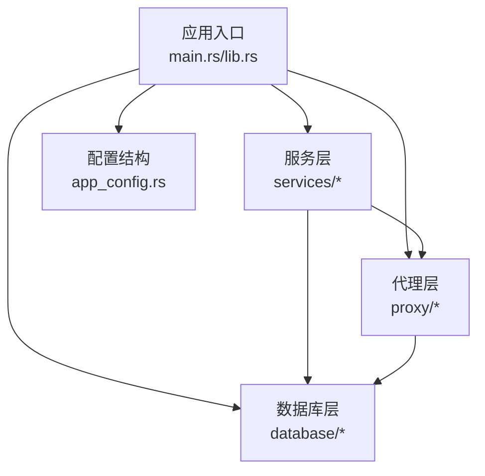
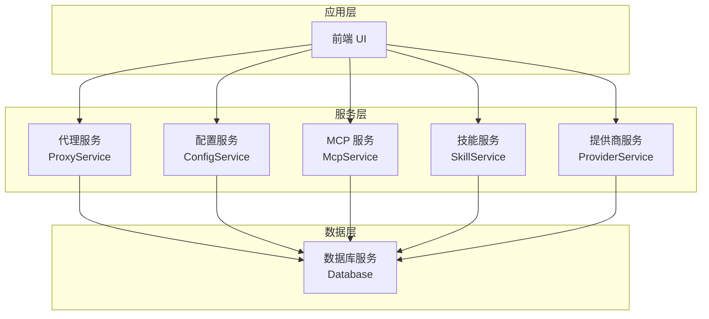
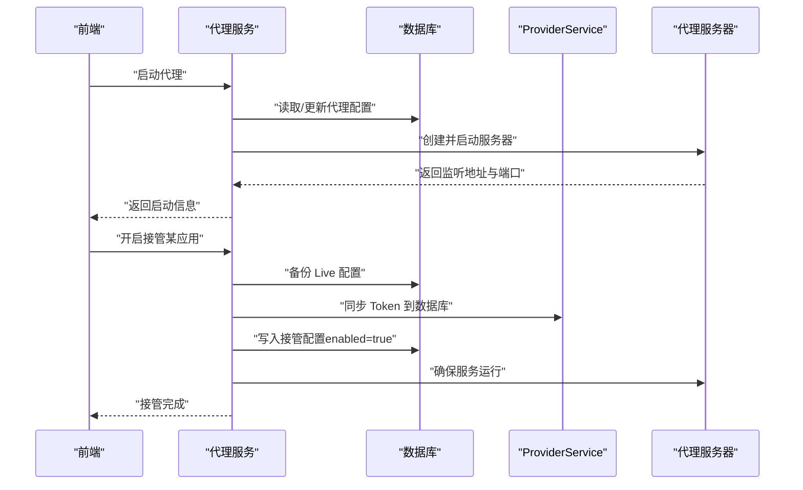
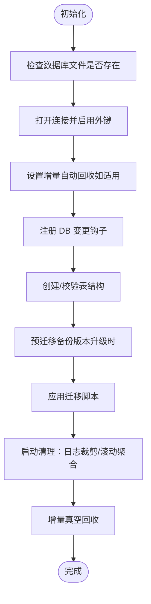
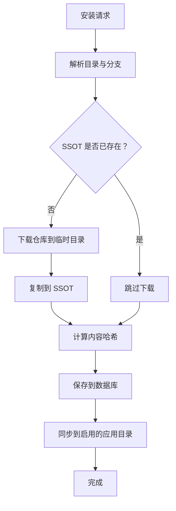
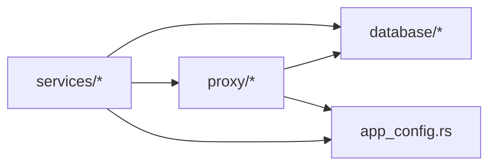

# 服务模块

<cite>
**本文引用的文件**
- [src-tauri/src/lib.rs](file://src-tauri/src/lib.rs)
- [src-tauri/src/main.rs](file://src-tauri/src/main.rs)
- [src-tauri/Cargo.toml](file://src-tauri/Cargo.toml)
- [src-tauri/src/services/mod.rs](file://src-tauri/src/services/mod.rs)
- [src-tauri/src/database/mod.rs](file://src-tauri/src/database/mod.rs)
- [src-tauri/src/proxy/mod.rs](file://src-tauri/src/proxy/mod.rs)
- [src-tauri/src/services/provider/mod.rs](file://src-tauri/src/services/provider/mod.rs)
- [src-tauri/src/services/proxy.rs](file://src-tauri/src/services/proxy.rs)
- [src-tauri/src/services/config.rs](file://src-tauri/src/services/config.rs)
- [src-tauri/src/services/skill.rs](file://src-tauri/src/services/skill.rs)
- [src-tauri/src/services/mcp.rs](file://src-tauri/src/services/mcp.rs)
- [src-tauri/src/app_config.rs](file://src-tauri/src/app_config.rs)
</cite>

## 目录
1. [简介](#简介)
2. [项目结构](#项目结构)
3. [核心组件](#核心组件)
4. [架构总览](#架构总览)
5. [详细组件分析](#详细组件分析)
6. [依赖分析](#依赖分析)
7. [性能考虑](#性能考虑)
8. [故障排查指南](#故障排查指南)
9. [结论](#结论)
10. [附录](#附录)

## 简介
本文件面向 CC Switch 项目的后端服务模块，系统性阐述其模块化设计与职责划分，涵盖代理服务、数据库服务、配置管理、任务调度、MCP 与技能管理等核心能力。文档重点说明：
- 各服务模块的边界与接口
- 服务间的通信机制与数据流转
- 生命周期管理、启动顺序与优雅关闭
- 错误处理策略、异常传播与降级机制
- 监控、性能指标与日志记录
- 扩展与自定义的最佳实践

## 项目结构
后端服务主要位于 src-tauri 目录，采用“模块化 + 业务服务层”的组织方式：
- 顶层入口负责应用初始化、插件注册、日志与数据库初始化
- services 子模块提供业务服务（代理、配置、MCP、技能、提供商等）
- database 子模块提供 SQLite 数据持久化与迁移
- proxy 子模块提供本地代理服务器与路由、故障转移、流式处理等能力
- app_config 定义跨应用配置结构与工具函数

图示来源
- [src-tauri/src/main.rs:1-23](file://src-tauri/src/main.rs#L1-L23)
- [src-tauri/src/lib.rs:220-470](file://src-tauri/src/lib.rs#L220-L470)
- [src-tauri/src/services/mod.rs:1-47](file://src-tauri/src/services/mod.rs#L1-L47)
- [src-tauri/src/database/mod.rs:1-273](file://src-tauri/src/database/mod.rs#L1-L273)
- [src-tauri/src/proxy/mod.rs:1-60](file://src-tauri/src/proxy/mod.rs#L1-L60)
- [src-tauri/src/app_config.rs:1-120](file://src-tauri/src/app_config.rs#L1-L120)

章节来源
- [src-tauri/src/main.rs:1-23](file://src-tauri/src/main.rs#L1-L23)
- [src-tauri/src/lib.rs:220-470](file://src-tauri/src/lib.rs#L220-L470)
- [src-tauri/src/services/mod.rs:1-47](file://src-tauri/src/services/mod.rs#L1-L47)
- [src-tauri/src/database/mod.rs:1-273](file://src-tauri/src/database/mod.rs#L1-L273)
- [src-tauri/src/proxy/mod.rs:1-60](file://src-tauri/src/proxy/mod.rs#L1-L60)
- [src-tauri/src/app_config.rs:1-120](file://src-tauri/src/app_config.rs#L1-L120)

## 核心组件
- 代理服务（ProxyService）
  - 职责：启动/停止本地代理、Live 配置接管与恢复、故障转移、并发切换锁、与 UI 状态联动
  - 关键接口：start/start_with_takeover/set_takeover_for_app/get_takeover_status
- 数据库服务（Database）
  - 职责：SQLite 连接、表结构与迁移、DAO 访问、变更钩子通知、增量自动回收
  - 关键接口：init/memory/backup_database_file/apply_schema_migrations
- 配置服务（ConfigService）
  - 职责：配置导入导出、备份清理、当前供应商同步到各应用 Live 配置
  - 关键接口：create_backup/sync_current_providers_to_live
- 提供商服务（ProviderService）
  - 职责：提供商 CRUD、切换、校验、与 Live 配置同步、通用配置合并
  - 关键接口：update/add/import_default_config/sync_current_to_live
- 技能服务（SkillService）
  - 职责：SSOT 统一管理、安装/卸载、同步到各应用目录、备份与迁移
  - 关键接口：install/uninstall/get_all_installed/sync_to_app_dir
- MCP 服务（McpService）
  - 职责：统一结构的 MCP 服务器管理、按应用启用/禁用、导入与同步
  - 关键接口：get_all_servers/upsert_server/toggle_app/sync_all_enabled
- 应用配置（app_config）
  - 职责：多应用配置结构、应用类型枚举、MCP/Gemini/Prompt 等统一模型

章节来源
- [src-tauri/src/services/proxy.rs:1-200](file://src-tauri/src/services/proxy.rs#L1-L200)
- [src-tauri/src/database/mod.rs:72-180](file://src-tauri/src/database/mod.rs#L72-L180)
- [src-tauri/src/services/config.rs:1-120](file://src-tauri/src/services/config.rs#L1-L120)
- [src-tauri/src/services/provider/mod.rs:45-120](file://src-tauri/src/services/provider/mod.rs#L45-L120)
- [src-tauri/src/services/skill.rs:440-560](file://src-tauri/src/services/skill.rs#L440-L560)
- [src-tauri/src/services/mcp.rs:1-120](file://src-tauri/src/services/mcp.rs#L1-L120)
- [src-tauri/src/app_config.rs:338-420](file://src-tauri/src/app_config.rs#L338-L420)

## 架构总览
服务模块围绕“状态中心（AppState）+ 多服务协同”的架构展开：
- AppState 作为全局状态容器，持有 Database 实例与各 Service 的引用
- 代理服务在启动时读取/更新代理配置，必要时接管各应用 Live 配置
- 数据库服务贯穿所有业务操作，提供事务一致性与迁移保障
- 配置服务负责与 Live 配置的双向同步与备份
- 技能与 MCP 服务通过统一结构集中管理，按应用启用状态同步到各应用目录

图示来源
- [src-tauri/src/lib.rs:440-520](file://src-tauri/src/lib.rs#L440-L520)
- [src-tauri/src/services/mod.rs:32-47](file://src-tauri/src/services/mod.rs#L32-L47)
- [src-tauri/src/database/mod.rs:72-160](file://src-tauri/src/database/mod.rs#L72-L160)

## 详细组件分析

### 代理服务（ProxyService）
- 功能边界
  - 代理生命周期管理：启动、停止、端口持久化（动态端口回写）
  - Live 配置接管：备份、同步 Token、写入代理地址与占位符、恢复
  - 故障转移与并发控制：切换锁、健康状态清理、UI 状态联动
- 接口定义
  - start/start_with_takeover：启动代理（可带接管）
  - set_takeover_for_app：按应用开启/关闭接管
  - get_takeover_status：查询接管状态
  - set_app_handle：注入 AppHandle 用于 UI 事件
- 依赖关系
  - 依赖 Database 读取/更新代理配置、备份、健康状态
  - 依赖 ProviderService 构建有效配置、写入 Live
  - 依赖 proxy 子模块（server、router、response_handler 等）实现转发与处理
- 数据流
  - 启动前：读取全局/应用代理配置，必要时设置 enabled=true
  - 接管流程：备份 Live → 同步 Token 到数据库 → 写入接管配置 → 启动服务
  - 关闭接管：恢复 Live → 删除备份 → 清理健康状态 → 条件停止服务

图示来源
- [src-tauri/src/services/proxy.rs:399-565](file://src-tauri/src/services/proxy.rs#L399-L565)
- [src-tauri/src/services/proxy.rs:605-782](file://src-tauri/src/services/proxy.rs#L605-L782)
- [src-tauri/src/services/provider/mod.rs:30-45](file://src-tauri/src/services/provider/mod.rs#L30-L45)

章节来源
- [src-tauri/src/services/proxy.rs:1-200](file://src-tauri/src/services/proxy.rs#L1-L200)
- [src-tauri/src/services/proxy.rs:399-565](file://src-tauri/src/services/proxy.rs#L399-L565)
- [src-tauri/src/services/proxy.rs:605-782](file://src-tauri/src/services/proxy.rs#L605-L782)
- [src-tauri/src/proxy/mod.rs:1-60](file://src-tauri/src/proxy/mod.rs#L1-L60)

### 数据库服务（Database）
- 功能边界
  - SQLite 连接封装与外键/自动回收配置
  - 表结构与迁移（SCHEMA_VERSION）
  - DAO 访问与变更钩子（通知自动同步服务）
  - 备份与预迁移备份、增量真空回收
- 接口定义
  - init/memory：初始化/内存数据库
  - create_tables/apply_schema_migrations：建表与迁移
  - ensure_incremental_auto_vacuum：启用增量自动回收
  - 多类 DAO 方法（提供商、MCP、提示词、技能、代理等）
- 依赖关系
  - 依赖 rusqlite 连接与 hooks
  - 依赖 schema.rs 与 migration.rs
  - 通过变更钩子通知 webdav/s3 自动同步
- 生命周期
  - 应用启动时初始化，执行迁移与清理
  - 运行期通过 hooks 触发自动同步

图示来源
- [src-tauri/src/database/mod.rs:92-160](file://src-tauri/src/database/mod.rs#L92-L160)
- [src-tauri/src/database/mod.rs:182-253](file://src-tauri/src/database/mod.rs#L182-L253)

章节来源
- [src-tauri/src/database/mod.rs:1-273](file://src-tauri/src/database/mod.rs#L1-L273)

### 配置服务（ConfigService）
- 功能边界
  - 配置备份与清理（保留 N 份）
  - 当前供应商同步到各应用 Live 配置（Claude/Codex/Gemini）
  - 与 app_config 的 MultiAppConfig 协作
- 接口定义
  - create_backup：为 config.json 创建带时间戳的备份
  - sync_current_providers_to_live：批量同步当前供应商
  - 各应用的同步实现（Claude/Codex/Gemini）
- 依赖关系
  - 依赖 app_config 的 AppType/MultiAppConfig
  - 依赖各应用 Live 配置读写模块

章节来源
- [src-tauri/src/services/config.rs:1-120](file://src-tauri/src/services/config.rs#L1-L120)
- [src-tauri/src/services/config.rs:144-262](file://src-tauri/src/services/config.rs#L144-L262)
- [src-tauri/src/app_config.rs:468-520](file://src-tauri/src/app_config.rs#L468-L520)

### 提供商服务（ProviderService）
- 功能边界
  - 提供商 CRUD、切换、校验与排序更新
  - 与 Live 配置的导入/同步（含通用配置合并）
  - 代理接管期间对 Live 的写入与保护
- 接口定义
  - update/add：更新/新增提供商
  - import_default_config/sync_current_to_live：导入默认配置与同步
  - validate_provider_settings/extract_credentials：校验与凭据提取
- 依赖关系
  - 依赖 Database 读写提供商
  - 依赖 app_config 的 AppType/Provider 结构
  - 依赖 proxy 的接管逻辑

章节来源
- [src-tauri/src/services/provider/mod.rs:45-120](file://src-tauri/src/services/provider/mod.rs#L45-L120)
- [src-tauri/src/services/provider/mod.rs:24-45](file://src-tauri/src/services/provider/mod.rs#L24-L45)

### 技能服务（SkillService）
- 功能边界
  - SSOT（单一事实源）：统一安装目录 ~/.cc-switch/skills/
  - 安装/卸载/更新检测：下载仓库、复制/符号链接、计算哈希
  - 同步到各应用目录：按启用状态同步
  - 备份与迁移：卸载备份、Agents lock 解析、仓库迁移
- 接口定义
  - install：下载并安装到 SSOT，保存记录，同步到应用
  - uninstall：从应用与 SSOT 删除，创建备份
  - get_all_installed：查询已安装技能
  - sync_to_app_dir：按应用同步
- 依赖关系
  - 依赖 Database 保存安装记录与启用状态
  - 依赖 app_config 的 AppType/SkillApps

图示来源
- [src-tauri/src/services/skill.rs:567-780](file://src-tauri/src/services/skill.rs#L567-L780)

章节来源
- [src-tauri/src/services/skill.rs:440-560](file://src-tauri/src/services/skill.rs#L440-L560)
- [src-tauri/src/services/skill.rs:567-780](file://src-tauri/src/services/skill.rs#L567-L780)

### MCP 服务（McpService）
- 功能边界
  - 统一结构的 MCP 服务器管理（McpServer）
  - 按应用启用/禁用、同步到各应用 Live 配置
  - 从各应用导入 MCP 服务器（Claude/Codex/Gemini/OpenCode/Hermes）
- 接口定义
  - get_all_servers/upsert_server/delete_server：CRUD
  - toggle_app：按应用启用/禁用
  - sync_all_enabled：批量同步
  - import_from_*：从各应用导入
- 依赖关系
  - 依赖 Database 存储统一结构
  - 依赖 mcp 子模块写入各应用 Live 配置

章节来源
- [src-tauri/src/services/mcp.rs:1-120](file://src-tauri/src/services/mcp.rs#L1-L120)
- [src-tauri/src/services/mcp.rs:248-438](file://src-tauri/src/services/mcp.rs#L248-L438)

### 应用配置（app_config）
- 功能边界
  - 多应用配置结构（MultiAppConfig）
  - 应用类型枚举（AppType）
  - MCP/Gemini/Prompt 等统一模型
- 作用
  - 为服务层提供跨应用配置的统一视图与工具函数
  - 为 ConfigService/ProviderService/McpService 等提供结构化输入

章节来源
- [src-tauri/src/app_config.rs:338-420](file://src-tauri/src/app_config.rs#L338-L420)
- [src-tauri/src/app_config.rs:468-520](file://src-tauri/src/app_config.rs#L468-L520)

## 依赖分析
- 模块耦合
  - services 层依赖 database 层（DAO 访问）
  - proxy 层依赖 database 层（配置、备份、健康状态）
  - services 层相互协作（如 ProviderService 与 ProxyService 的接管配合）
- 外部依赖
  - 数据库：rusqlite
  - HTTP/代理：tokio、hyper、axum、tower
  - 日志：tauri-plugin-log
  - 配置与序列化：serde、toml、serde_json
- 循环依赖
  - 通过模块化拆分与公共导出避免循环依赖

图示来源
- [src-tauri/src/services/mod.rs:1-47](file://src-tauri/src/services/mod.rs#L1-L47)
- [src-tauri/src/database/mod.rs:1-273](file://src-tauri/src/database/mod.rs#L1-L273)
- [src-tauri/src/proxy/mod.rs:1-60](file://src-tauri/src/proxy/mod.rs#L1-L60)
- [src-tauri/src/app_config.rs:1-120](file://src-tauri/src/app_config.rs#L1-L120)

章节来源
- [src-tauri/Cargo.toml:25-83](file://src-tauri/Cargo.toml#L25-L83)
- [src-tauri/src/services/mod.rs:1-47](file://src-tauri/src/services/mod.rs#L1-L47)
- [src-tauri/src/database/mod.rs:1-273](file://src-tauri/src/database/mod.rs#L1-L273)
- [src-tauri/src/proxy/mod.rs:1-60](file://src-tauri/src/proxy/mod.rs#L1-L60)
- [src-tauri/src/app_config.rs:1-120](file://src-tauri/src/app_config.rs#L1-L120)

## 性能考虑
- 数据库性能
  - 启用外键与增量自动回收，减少碎片与写放大
  - 启动时执行清理与滚动聚合，降低运行期开销
- 代理性能
  - 动态端口回写，避免重复绑定与资源浪费
  - 并发切换锁避免竞态与重复写入
- I/O 优化
  - 技能安装采用符号链接优先（可选），减少磁盘占用
  - 备份与清理策略控制磁盘使用上限

## 故障排查指南
- 代理启动失败
  - 检查代理配置与端口占用，确认动态端口回写成功
  - 查看接管状态与备份是否存在
- 数据库初始化失败
  - 检查权限与路径，查看迁移错误并重试
  - 如需，执行预迁移备份后再重试
- Live 配置接管异常
  - 检查备份是否完整，确认接管标志与 Live 匹配
  - 恢复流程会清理备份与健康状态，必要时重新接管
- 技能安装失败
  - 检查网络与仓库可用性，确认目录安全与内容哈希
  - 查看卸载备份与 SSOT 目录状态

章节来源
- [src-tauri/src/services/proxy.rs:513-565](file://src-tauri/src/services/proxy.rs#L513-L565)
- [src-tauri/src/database/mod.rs:124-158](file://src-tauri/src/database/mod.rs#L124-L158)
- [src-tauri/src/services/skill.rs:659-720](file://src-tauri/src/services/skill.rs#L659-L720)

## 结论
CC Switch 的服务模块以“状态中心 + 业务服务层 + 数据持久化 + 代理网关”的方式实现了高内聚、低耦合的后端架构。通过统一的配置结构与数据库迁移机制，确保了跨应用的一致性与可演进性；代理服务的接管与故障转移能力提升了用户体验与稳定性；技能与 MCP 的统一管理降低了维护成本。建议在扩展新功能时遵循现有模块边界与接口契约，优先使用数据库与配置服务提供的能力，确保一致的日志、备份与迁移策略。

## 附录
- 生命周期与启动顺序
  - 应用入口初始化日志与数据库
  - 初始化数据库（含迁移与清理）
  - 加载/导入默认配置与种子供应商
  - 初始化各业务服务（Provider/MCP/Skill/Proxy）
  - 注册深链与窗口事件处理器
- 优雅关闭
  - 代理服务在无接管应用时停止
  - 数据库执行增量真空回收
  - 清理临时文件与缓存

章节来源
- [src-tauri/src/lib.rs:300-470](file://src-tauri/src/lib.rs#L300-L470)
- [src-tauri/src/services/proxy.rs:764-782](file://src-tauri/src/services/proxy.rs#L764-L782)
- [src-tauri/src/database/mod.rs:144-158](file://src-tauri/src/database/mod.rs#L144-L158)