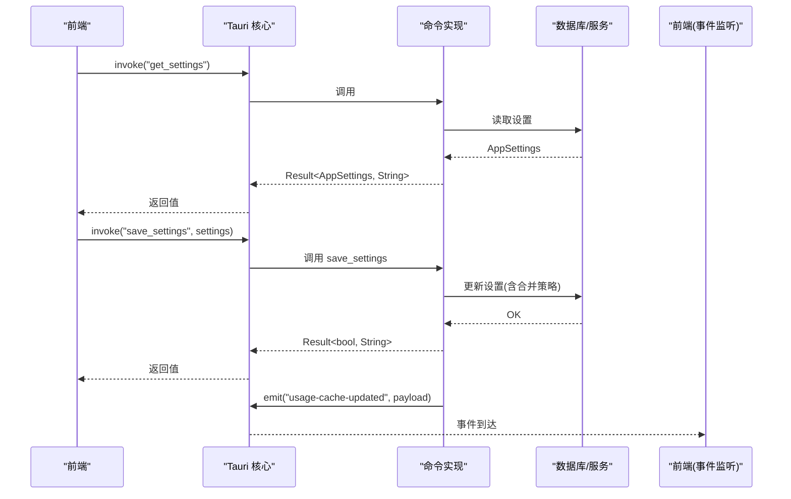
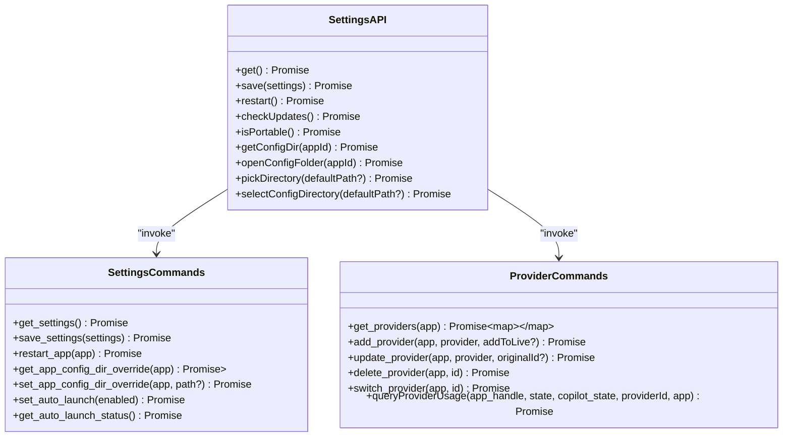
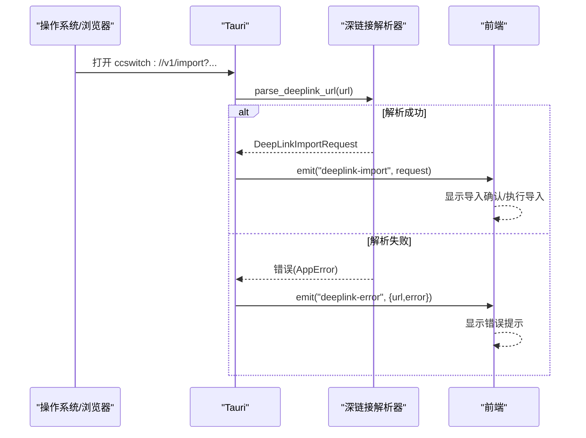
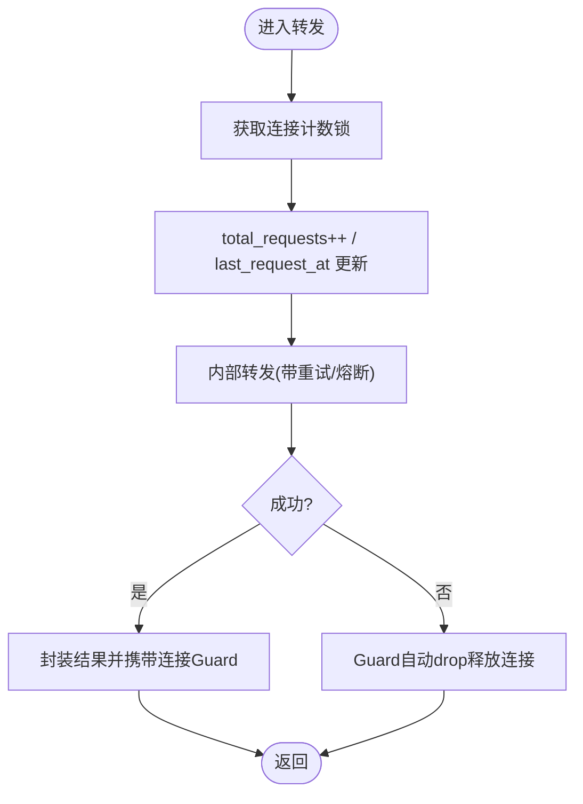
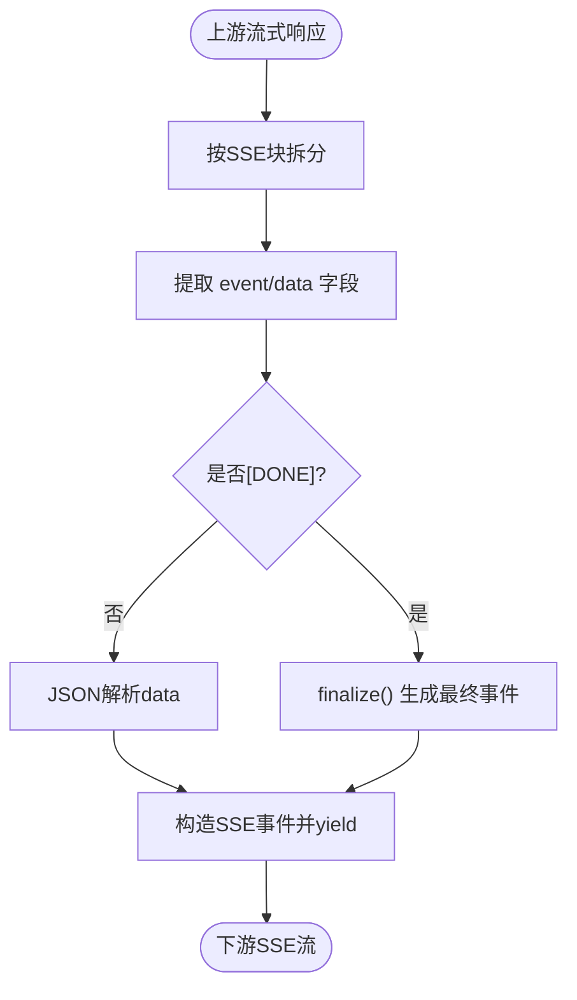
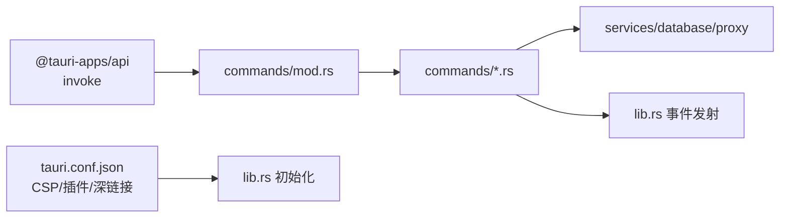

# 通信协议

<cite>
**本文引用的文件**
- [src-tauri/tauri.conf.json](file://src-tauri/tauri.conf.json)
- [src-tauri/src/main.rs](file://src-tauri/src/main.rs)
- [src-tauri/src/lib.rs](file://src-tauri/src/lib.rs)
- [src-tauri/src/commands/mod.rs](file://src-tauri/src/commands/mod.rs)
- [src-tauri/src/commands/provider.rs](file://src-tauri/src/commands/provider.rs)
- [src-tauri/src/commands/settings.rs](file://src-tauri/src/commands/settings.rs)
- [src-tauri/src/deeplink/mod.rs](file://src-tauri/src/deeplink/mod.rs)
- [src-tauri/src/deeplink/parser.rs](file://src-tauri/src/deeplink/parser.rs)
- [src-tauri/src/deeplink/tests.rs](file://src-tauri/src/deeplink/tests.rs)
- [src/lib/api/settings.ts](file://src/lib/api/settings.ts)
- [src/lib/api/types.ts](file://src/lib/api/types.ts)
- [src-tauri/src/proxy/forwarder.rs](file://src-tauri/src/proxy/forwarder.rs)
- [src-tauri/src/proxy/response_processor.rs](file://src-tauri/src/proxy/response_processor.rs)
- [src-tauri/src/proxy/providers/streaming.rs](file://src-tauri/src/proxy/providers/streaming.rs)
- [src-tauri/src/proxy/providers/streaming_codex_chat.rs](file://src-tauri/src/proxy/providers/streaming_codex_chat.rs)
- [src-tauri/src/proxy/providers/streaming_responses.rs](file://src-tauri/src/proxy/providers/streaming_responses.rs)
- [src-tauri/src/database/dao/proxy.rs](file://src-tauri/src/database/dao/proxy.rs)
- [src-tauri/gen/schemas/desktop-schema.json](file://src-tauri/gen/schemas/desktop-schema.json)
- [src-tauri/gen/schemas/macOS-schema.json](file://src-tauri/gen/schemas/macOS-schema.json)
</cite>

## 目录
1. [简介](#简介)
2. [项目结构](#项目结构)
3. [核心组件](#核心组件)
4. [架构总览](#架构总览)
5. [详细组件分析](#详细组件分析)
6. [依赖关系分析](#依赖关系分析)
7. [性能考量](#性能考量)
8. [故障排除指南](#故障排除指南)
9. [结论](#结论)

## 简介
本文件系统性阐述 CC Switch 的通信协议与实现，覆盖前端与后端（Tauri/Rust）之间的命令调用、事件传递、数据序列化、IPC 机制、深链接协议、异步通信模式、安全与输入校验、性能优化与连接池管理，并提供调试与排障建议。目标读者既包括开发者也包括对技术细节感兴趣的高级用户。

## 项目结构
- 前端通过 @tauri-apps/api 的 invoke 机制调用后端命令，命令在后端以 #[tauri::command] 注册，统一由命令模块导出。
- 后端以 Tauri Builder 初始化插件、窗口事件、日志与数据库等基础设施，深链接通过 tauri-plugin-deep-link 插件处理。
- 代理与流式响应处理位于 proxy 子系统，负责转发、超时、熔断、SSE 转换与使用统计。

```mermaid
graph TB
FE["前端<br/>React + Tauri API"] --> CMD["命令注册<br/>commands/mod.rs"]
CMD --> BACK["后端命令实现<br/>commands/*.rs"]
BACK --> EVT["事件发射<br/>lib.rs emit"]
FE <-- "事件监听" <-- EVT
BACK --> DL["深链接处理<br/>deeplink/*"]
BACK --> PROXY["代理与流式处理<br/>proxy/*"]
```

图示来源
- [src-tauri/src/commands/mod.rs:1-69](file://src-tauri/src/commands/mod.rs#L1-L69)
- [src-tauri/src/lib.rs:267-301](file://src-tauri/src/lib.rs#L267-L301)
- [src-tauri/src/deeplink/mod.rs:1-139](file://src-tauri/src/deeplink/mod.rs#L1-L139)
- [src-tauri/src/proxy/forwarder.rs:318-353](file://src-tauri/src/proxy/forwarder.rs#L318-L353)

章节来源
- [src-tauri/src/main.rs:1-23](file://src-tauri/src/main.rs#L1-L23)
- [src-tauri/src/lib.rs:220-301](file://src-tauri/src/lib.rs#L220-L301)
- [src-tauri/tauri.conf.json:1-70](file://src-tauri/tauri.conf.json#L1-L70)

## 核心组件
- Tauri 命令系统：前端通过 invoke("命令名", 参数) 调用，后端以 #[tauri::command] 声明，返回 Result<T, String> 或异步结果。
- 事件系统：后端通过 Emitter 发射事件（如 deeplink-import、deeplink-error、usage-cache-updated），前端监听并处理。
- 深链接协议：ccswitch://v1/import，解析 query 参数，按资源类型分派处理。
- 代理与流式：统一转发、超时与熔断控制，SSE 事件转换，使用统计与缓存。
- 配置与持久化：设置合并策略、日志级别动态调整、数据库代理配置读写。

章节来源
- [src/lib/api/settings.ts:1-61](file://src/lib/api/settings.ts#L1-L61)
- [src-tauri/src/commands/settings.rs:59-85](file://src-tauri/src/commands/settings.rs#L59-L85)
- [src-tauri/src/lib.rs:119-182](file://src-tauri/src/lib.rs#L119-L182)
- [src-tauri/src/deeplink/parser.rs:11-68](file://src-tauri/src/deeplink/parser.rs#L11-L68)
- [src-tauri/src/proxy/forwarder.rs:318-353](file://src-tauri/src/proxy/forwarder.rs#L318-L353)

## 架构总览
从前端到后端的典型调用链：前端调用 invoke -> Tauri 注册命令 -> 后端服务/数据库/代理处理 -> 可能发射事件 -> 前端消费事件或接收返回值。



图示来源
- [src/lib/api/settings.ts:26-61](file://src/lib/api/settings.ts#L26-L61)
- [src-tauri/src/commands/settings.rs:59-85](file://src-tauri/src/commands/settings.rs#L59-L85)
- [src-tauri/src/commands/provider.rs:372-411](file://src-tauri/src/commands/provider.rs#L372-L411)
- [src-tauri/src/lib.rs:119-182](file://src-tauri/src/lib.rs#L119-L182)

## 详细组件分析

### Tauri 命令系统与数据序列化
- 命令注册：commands/mod.rs 汇总导出所有命令模块，前端以字符串命令名调用。
- 参数与返回：命令函数签名统一使用 State、AppHandle 等 Tauri 状态，返回 Result<T, String>，T 一般为 serde 可序列化结构。
- 前端 API：settings.ts 定义了 get/save/restart 等方法，内部通过 invoke 调用后端命令。
- 类型约束：前端 AppId 类型与后端命令参数 app 对齐，确保跨边界一致性。



图示来源
- [src/lib/api/settings.ts:26-61](file://src/lib/api/settings.ts#L26-L61)
- [src-tauri/src/commands/provider.rs:21-110](file://src-tauri/src/commands/provider.rs#L21-L110)
- [src-tauri/src/commands/settings.rs:59-113](file://src-tauri/src/commands/settings.rs#L59-L113)

章节来源
- [src-tauri/src/commands/mod.rs:1-69](file://src-tauri/src/commands/mod.rs#L1-L69)
- [src/lib/api/settings.ts:1-61](file://src/lib/api/settings.ts#L1-L61)
- [src/lib/api/types.ts:1-10](file://src/lib/api/types.ts#L1-L10)

### 事件传递与深链接协议
- 事件发射：handle_deeplink_url 在解析深链接成功或失败时分别发射 deeplink-import 与 deeplink-error 事件。
- 深链接格式：ccswitch://v1/import?resource=...，按 resource 分派到 provider/prompt/mcp/skill。
- 参数校验：解析器对 scheme、版本、路径、必填参数进行严格校验，非法输入抛出 AppError。
- 前端处理：前端监听 deeplink-import 事件，展示导入确认或错误提示。



图示来源
- [src-tauri/src/lib.rs:119-182](file://src-tauri/src/lib.rs#L119-L182)
- [src-tauri/src/deeplink/parser.rs:11-68](file://src-tauri/src/deeplink/parser.rs#L11-L68)
- [src-tauri/src/deeplink/tests.rs:66-109](file://src-tauri/src/deeplink/tests.rs#L66-L109)

章节来源
- [src-tauri/src/lib.rs:119-182](file://src-tauri/src/lib.rs#L119-L182)
- [src-tauri/src/deeplink/mod.rs:30-139](file://src-tauri/src/deeplink/mod.rs#L30-L139)
- [src-tauri/src/deeplink/parser.rs:11-68](file://src-tauri/src/deeplink/parser.rs#L11-L68)

### IPC 与消息格式、传输协议、缓冲区管理
- IPC 通道：前端通过 @tauri-apps/api 的 invoke 与后端建立 IPC 通道，命令调用采用 JSON 序列化参数与返回值。
- 传输协议：Tauri 在桌面端使用基于内核的 IPC（ipc:），CSP 中包含 connect-src 'self' ipc:，确保受控访问。
- 缓冲区管理：代理层在转发请求时维护连接计数与状态，使用 Guard 在作用域结束时回收连接，避免泄漏。
- 超时与熔断：代理配置包含首字节、空闲、非流式超时，以及熔断阈值与最小请求数，保障稳定性。



图示来源
- [src-tauri/src/proxy/forwarder.rs:318-353](file://src-tauri/src/proxy/forwarder.rs#L318-L353)
- [src-tauri/tauri.conf.json:28-34](file://src-tauri/tauri.conf.json#L28-L34)

章节来源
- [src-tauri/tauri.conf.json:28-34](file://src-tauri/tauri.conf.json#L28-L34)
- [src-tauri/src/proxy/forwarder.rs:318-353](file://src-tauri/src/proxy/forwarder.rs#L318-L353)
- [src-tauri/src/database/dao/proxy.rs:238-272](file://src-tauri/src/database/dao/proxy.rs#L238-L272)

### 异步通信模式、Promise 包装与错误传播
- 前端 Promise：settings.ts 中的每个 API 方法均返回 Promise，内部以 await invoke 调用后端命令。
- 后端异步：命令可声明为 async，内部使用 tokio::task 与 RwLock 等并发原语，确保线程安全。
- 错误传播：命令返回 Result<T, String>，前端捕获异常并通过 toast 或错误对话框反馈；深链接解析失败时发射 deeplink-error 事件。
- 事件驱动：后端在关键操作（如用量查询）完成后发射 usage-cache-updated 事件，前端通过查询缓存或重新拉取数据。

章节来源
- [src/lib/api/settings.ts:26-61](file://src/lib/api/settings.ts#L26-L61)
- [src-tauri/src/commands/provider.rs:372-411](file://src-tauri/src/commands/provider.rs#L372-L411)
- [src-tauri/src/lib.rs:119-182](file://src-tauri/src/lib.rs#L119-L182)

### 安全考虑：权限验证、输入校验、输出过滤
- 权限模型：Tauri 2 的能力与权限模型通过 JSON 架构定义，desktop-schema.json 与 macOS-schema.json 描述允许/拒绝范围。
- 输入校验：深链接解析器对 scheme、版本、路径、必填参数进行严格校验；代理配置读取时若缺失则初始化默认值。
- 输出过滤：日志系统支持单文件覆盖与轮转，敏感 URL 的查询参数在日志中脱敏显示；深链接 URL 在日志中仅保留必要键。

章节来源
- [src-tauri/gen/schemas/desktop-schema.json:286-328](file://src-tauri/gen/schemas/desktop-schema.json#L286-L328)
- [src-tauri/gen/schemas/macOS-schema.json:286-328](file://src-tauri/gen/schemas/macOS-schema.json#L286-L328)
- [src-tauri/src/deeplink/parser.rs:11-68](file://src-tauri/src/deeplink/parser.rs#L11-L68)
- [src-tauri/src/lib.rs:88-117](file://src-tauri/src/lib.rs#L88-L117)

### 代理与流式响应处理
- 统一转发：forward_with_retry 在客户端请求维度记录统计与连接数，内部转发后将连接 Guard 附着于结果。
- SSE 转换：针对不同上游（Codex Chat、Gemini、Responses）进行事件拆分与拼接，最终以标准 SSE 格式输出。
- 使用统计：解析流式事件中的 token 使用，写入数据库并触发 usage-cache-updated 事件。



图示来源
- [src-tauri/src/proxy/providers/streaming_codex_chat.rs:925-950](file://src-tauri/src/proxy/providers/streaming_codex_chat.rs#L925-L950)
- [src-tauri/src/proxy/providers/streaming_gemini.rs:447-467](file://src-tauri/src/proxy/providers/streaming_gemini.rs#L447-L467)
- [src-tauri/src/proxy/providers/streaming_responses.rs:835-859](file://src-tauri/src/proxy/providers/streaming_responses.rs#L835-L859)

章节来源
- [src-tauri/src/proxy/forwarder.rs:318-353](file://src-tauri/src/proxy/forwarder.rs#L318-L353)
- [src-tauri/src/proxy/response_processor.rs:1-33](file://src-tauri/src/proxy/response_processor.rs#L1-L33)
- [src-tauri/src/proxy/providers/streaming.rs:494-509](file://src-tauri/src/proxy/providers/streaming.rs#L494-L509)

## 依赖关系分析
- 前端依赖 @tauri-apps/api 进行命令调用；命令注册集中在 commands/mod.rs，按功能模块划分。
- 后端通过 tauri.conf.json 配置 CSP、插件与深链接方案；lib.rs 初始化插件与事件处理。
- 代理层依赖数据库配置与服务层，提供统一的转发、超时与熔断策略。



图示来源
- [src-tauri/src/commands/mod.rs:1-69](file://src-tauri/src/commands/mod.rs#L1-L69)
- [src-tauri/src/lib.rs:267-301](file://src-tauri/src/lib.rs#L267-L301)
- [src-tauri/tauri.conf.json:28-61](file://src-tauri/tauri.conf.json#L28-L61)

章节来源
- [src-tauri/src/commands/mod.rs:1-69](file://src-tauri/src/commands/mod.rs#L1-L69)
- [src-tauri/src/lib.rs:267-301](file://src-tauri/src/lib.rs#L267-L301)
- [src-tauri/tauri.conf.json:28-61](file://src-tauri/tauri.conf.json#L28-L61)

## 性能考量
- 连接池与并发：ActiveConnectionGuard 在作用域结束时回收连接，避免长连接泄漏；转发前增加连接计数，结束后减少，确保上限可控。
- 超时与熔断：代理配置提供首字节、空闲、非流式超时与熔断阈值，降低慢请求与故障扩散风险。
- 批量与缓存：日志与使用统计采用批量写入与缓存策略，减少频繁 IO；前端通过查询缓存与事件驱动更新，降低重复请求。
- 事件驱动：通过 usage-cache-updated 等事件，前端可增量更新 UI，避免轮询带来的额外负载。

章节来源
- [src-tauri/src/proxy/forwarder.rs:318-353](file://src-tauri/src/proxy/forwarder.rs#L318-L353)
- [src-tauri/src/database/dao/proxy.rs:238-272](file://src-tauri/src/database/dao/proxy.rs#L238-L272)
- [src-tauri/src/commands/provider.rs:372-411](file://src-tauri/src/commands/provider.rs#L372-L411)

## 故障排除指南
- 深链接无法打开：
  - 检查 tauri.conf.json 中 deep-link 插件配置与 schemes。
  - 查看 handle_deeplink_url 日志，确认 URL 是否以 ccswitch:// 开头、版本是否为 v1、路径是否为 /import。
  - 若解析失败，前端将收到 deeplink-error 事件，可在 UI 中提示用户。
- 命令调用失败：
  - 前端捕获 Promise 拒绝，查看后端日志与错误字符串。
  - 检查命令参数类型与必填项，确保与后端签名一致。
- 代理超时/熔断：
  - 调整代理配置中的超时与熔断阈值；关注日志中失败计数与错误率。
- 日志与脱敏：
  - 日志系统单文件覆盖，URL 脱敏仅保留键；若需排查，临时提升日志级别并观察脱敏后的 URL 结构。

章节来源
- [src-tauri/tauri.conf.json:56-61](file://src-tauri/tauri.conf.json#L56-L61)
- [src-tauri/src/lib.rs:88-117](file://src-tauri/src/lib.rs#L88-L117)
- [src-tauri/src/deeplink/parser.rs:11-68](file://src-tauri/src/deeplink/parser.rs#L11-L68)
- [src-tauri/src/database/dao/proxy.rs:238-272](file://src-tauri/src/database/dao/proxy.rs#L238-L272)

## 结论
CC Switch 的通信协议以 Tauri 命令系统为核心，结合严格的深链接解析、事件驱动与代理流式处理，实现了稳定、可观测且可扩展的前后端通信。通过 CSP 与权限模型强化安全，通过超时/熔断与连接管理保障性能，配合日志与事件实现高效排障。建议在生产环境中持续监控代理指标与日志，定期评估深链接与命令调用的健壮性与用户体验。