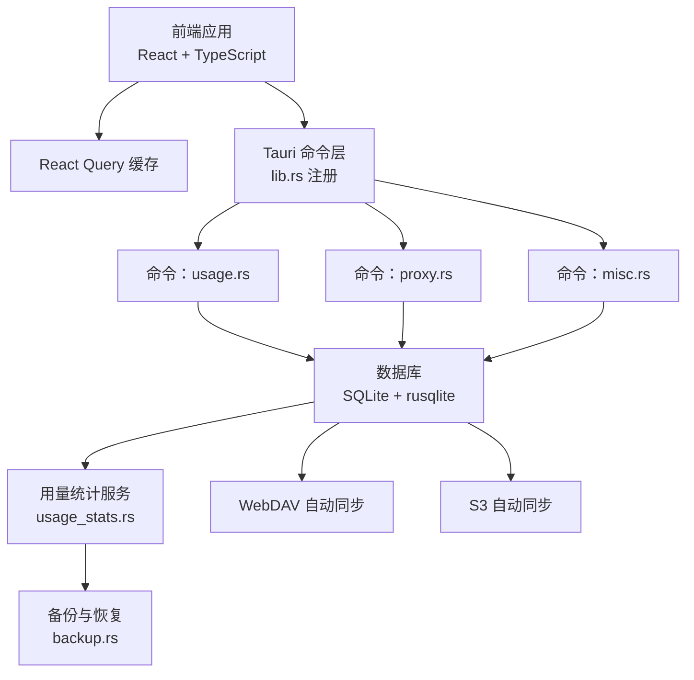
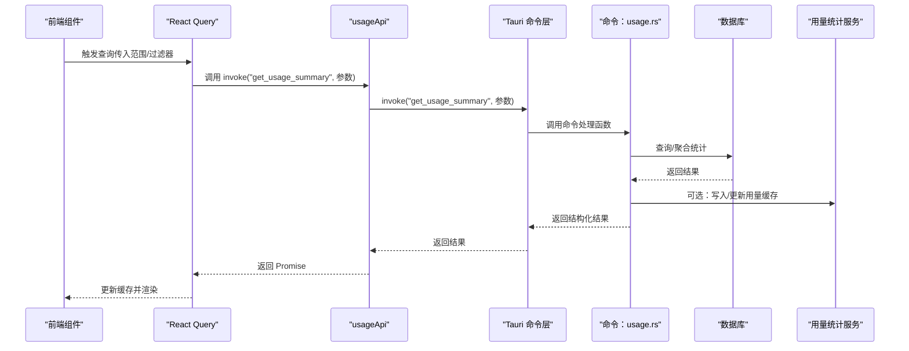
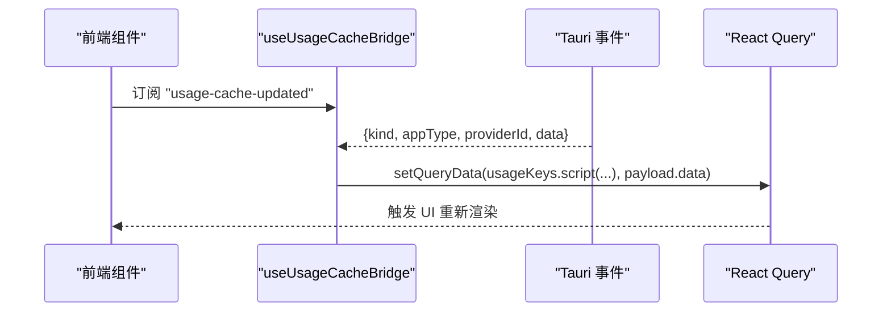
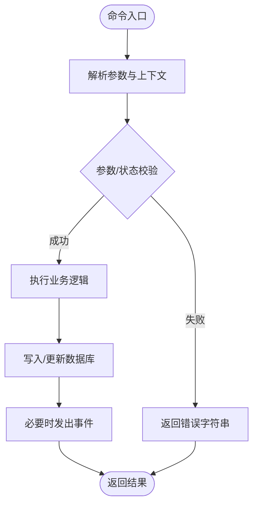
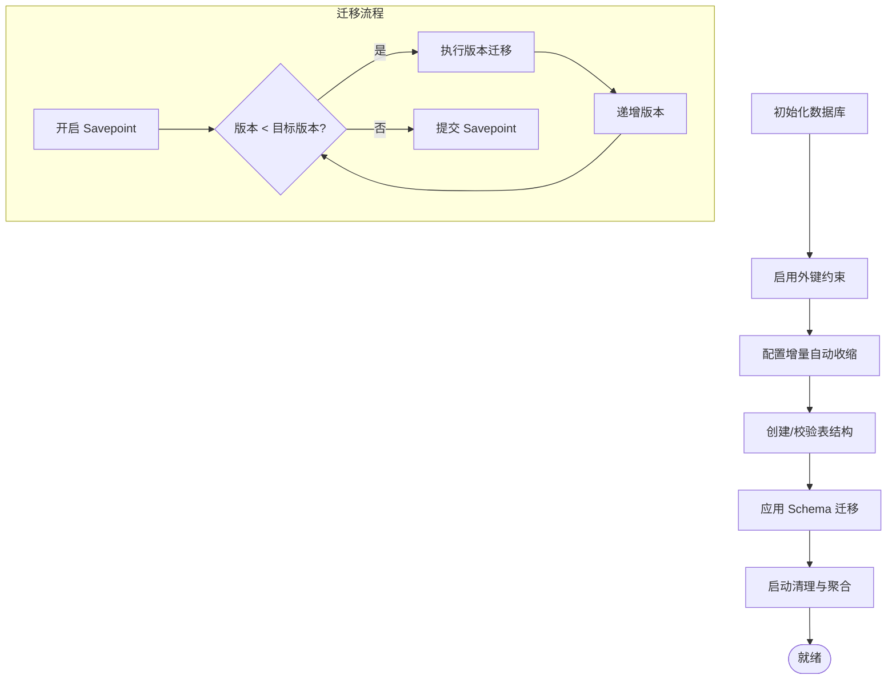
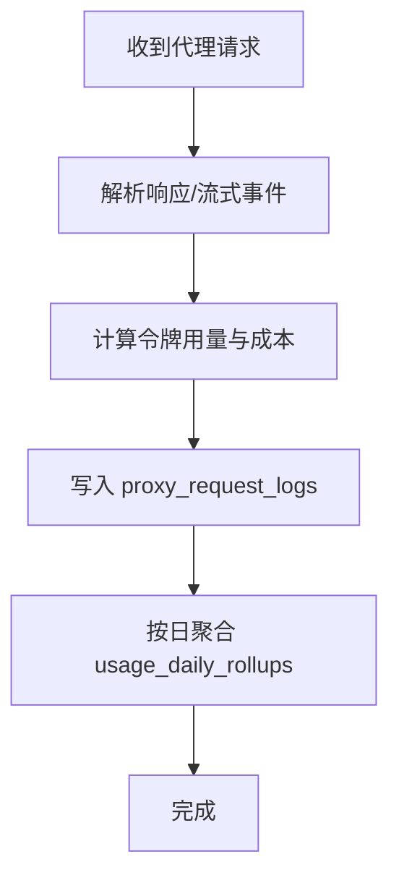
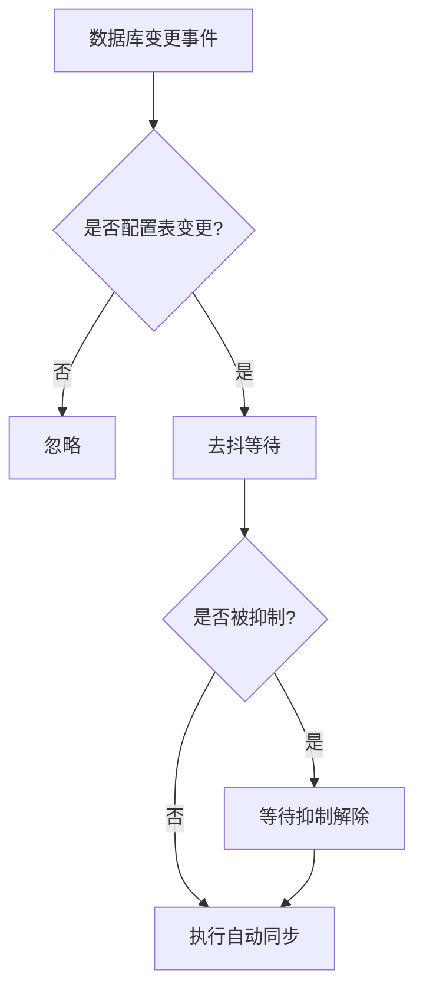
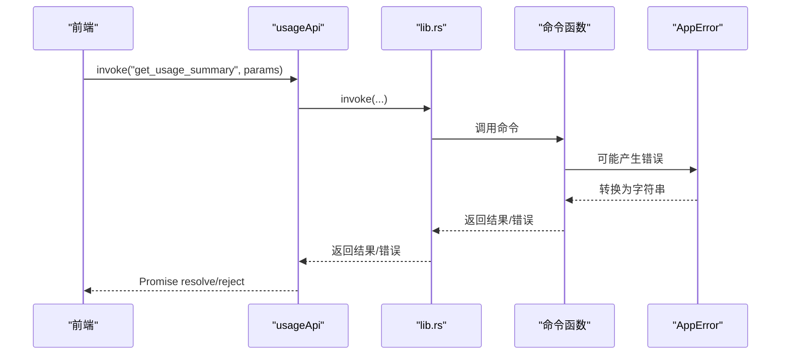
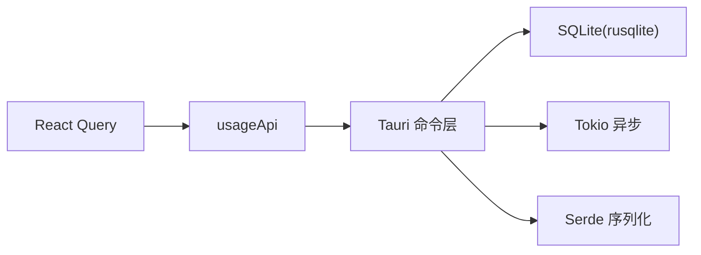

# 数据流设计

<cite>
**本文引用的文件**
- [src/lib/query/usage.ts](file://src/lib/query/usage.ts)
- [src/lib/api/usage.ts](file://src/lib/api/usage.ts)
- [src/hooks/useUsageCacheBridge.ts](file://src/hooks/useUsageCacheBridge.ts)
- [src/hooks/useTauriEvent.ts](file://src/hooks/useTauriEvent.ts)
- [src-tauri/src/lib.rs](file://src-tauri/src/lib.rs)
- [src-tauri/src/commands/usage.rs](file://src-tauri/src/commands/usage.rs)
- [src-tauri/src/commands/proxy.rs](file://src-tauri/src/commands/proxy.rs)
- [src-tauri/src/commands/misc.rs](file://src-tauri/src/commands/misc.rs)
- [src-tauri/src/database/mod.rs](file://src-tauri/src/database/mod.rs)
- [src-tauri/src/database/schema.rs](file://src-tauri/src/database/schema.rs)
- [src-tauri/src/database/backup.rs](file://src-tauri/src/database/backup.rs)
- [src-tauri/src/services/usage_stats.rs](file://src-tauri/src/services/usage_stats.rs)
- [src-tauri/src/services/webdav_auto_sync.rs](file://src-tauri/src/services/webdav_auto_sync.rs)
- [src-tauri/src/services/s3_auto_sync.rs](file://src-tauri/src/services/s3_auto_sync.rs)
- [src-tauri/src/proxy/usage/logger.rs](file://src-tauri/src/proxy/usage/logger.rs)
- [src-tauri/src/proxy/usage/parser.rs](file://src-tauri/src/proxy/usage/parser.rs)
- [src-tauri/src/config.rs](file://src-tauri/src/config.rs)
- [src-tauri/src/error.rs](file://src-tauri/src/error.rs)
</cite>

## 目录
1. [简介](#简介)
2. [项目结构](#项目结构)
3. [核心组件](#核心组件)
4. [架构总览](#架构总览)
5. [详细组件分析](#详细组件分析)
6. [依赖关系分析](#依赖关系分析)
7. [性能考虑](#性能考虑)
8. [故障排查指南](#故障排查指南)
9. [结论](#结论)
10. [附录](#附录)

## 简介
本文件面向 CC Switch 项目的数据流设计，系统性阐述从配置文件、数据库到前端组件状态的完整数据流转过程。重点覆盖以下方面：
- 数据生命周期：获取、缓存、状态同步、持久化
- 前端数据流：React Query 查询缓存、状态提升、事件驱动更新
- 后端数据流：数据库事务、数据验证、业务逻辑处理、API 响应格式
- 跨进程通信：Tauri 命令参数传递、返回值处理、错误传播
- 一致性与并发：变更钩子、自动同步、并发抑制、事务保护
- 性能优化：增量自动收缩、索引与查询优化、批量写入
- 数据迁移与兼容：Schema 版本迁移、预迁移备份、导入导出与恢复
- 备份与恢复：数据库快照、增量备份、恢复流程与安全 ID

## 项目结构
CC Switch 采用前后端分离的双进程架构：
- 前端（React + TypeScript）：负责 UI、用户交互、查询缓存与状态管理
- 后端（Rust + Tauri）：负责配置管理、数据库、代理与用量统计、自动同步、备份恢复

图示来源
- [src-tauri/src/lib.rs:1124-1154](file://src-tauri/src/lib.rs#L1124-L1154)
- [src-tauri/src/commands/usage.rs](file://src-tauri/src/commands/usage.rs)
- [src-tauri/src/commands/proxy.rs:1-40](file://src-tauri/src/commands/proxy.rs#L1-L40)
- [src-tauri/src/commands/misc.rs:78-97](file://src-tauri/src/commands/misc.rs#L78-L97)
- [src-tauri/src/database/mod.rs:72-160](file://src-tauri/src/database/mod.rs#L72-L160)
- [src-tauri/src/services/usage_stats.rs](file://src-tauri/src/services/usage_stats.rs)
- [src-tauri/src/services/webdav_auto_sync.rs](file://src-tauri/src/services/webdav_auto_sync.rs)
- [src-tauri/src/services/s3_auto_sync.rs](file://src-tauri/src/services/s3_auto_sync.rs)
- [src-tauri/src/database/backup.rs:369-399](file://src-tauri/src/database/backup.rs#L369-L399)

章节来源
- [src-tauri/src/lib.rs:1124-1154](file://src-tauri/src/lib.rs#L1124-L1154)
- [src-tauri/src/database/mod.rs:1-273](file://src-tauri/src/database/mod.rs#L1-L273)

## 核心组件
- 前端查询与缓存
  - React Query 查询键与选项：定义查询粒度、刷新间隔、后台刷新等
  - 用量 API 封装：统一调用 Tauri 命令，屏蔽底层实现细节
  - 用量缓存桥接：接收后端事件，同步前端缓存，保持前后端缓存一致
  - Tauri 事件钩子：统一事件订阅与清理，避免竞态
- 后端命令与服务
  - 命令注册：集中注册所有 Tauri 命令，暴露给前端
  - 用量命令：提供用量查询、脚本测试、统计数据等接口
  - 代理命令：启动/停止代理服务、接管与恢复
  - 杂项命令：初始化错误、迁移结果、技能迁移结果等一次性提示
  - 数据库：封装连接、表结构、迁移、备份与恢复
  - 自动同步：WebDAV/S3 自动同步，带去抖与并发抑制
  - 用量统计：汇总与聚合，支持日级 rollup
  - 代理用量日志：解析与记录请求日志，支持错误分类与计价

章节来源
- [src/lib/query/usage.ts:1-320](file://src/lib/query/usage.ts#L1-L320)
- [src/lib/api/usage.ts:1-148](file://src/lib/api/usage.ts#L1-L148)
- [src/hooks/useUsageCacheBridge.ts:1-43](file://src/hooks/useUsageCacheBridge.ts#L1-L43)
- [src/hooks/useTauriEvent.ts:1-40](file://src/hooks/useTauriEvent.ts#L1-L40)
- [src-tauri/src/lib.rs:1124-1154](file://src-tauri/src/lib.rs#L1124-L1154)
- [src-tauri/src/commands/usage.rs](file://src-tauri/src/commands/usage.rs)
- [src-tauri/src/commands/proxy.rs:1-40](file://src-tauri/src/commands/proxy.rs#L1-L40)
- [src-tauri/src/commands/misc.rs:78-97](file://src-tauri/src/commands/misc.rs#L78-L97)
- [src-tauri/src/database/mod.rs:72-160](file://src-tauri/src/database/mod.rs#L72-L160)
- [src-tauri/src/services/webdav_auto_sync.rs](file://src-tauri/src/services/webdav_auto_sync.rs)
- [src-tauri/src/services/s3_auto_sync.rs](file://src-tauri/src/services/s3_auto_sync.rs)
- [src-tauri/src/services/usage_stats.rs](file://src-tauri/src/services/usage_stats.rs)
- [src-tauri/src/proxy/usage/logger.rs:441-454](file://src-tauri/src/proxy/usage/logger.rs#L441-L454)
- [src-tauri/src/proxy/usage/parser.rs:851-895](file://src-tauri/src/proxy/usage/parser.rs#L851-L895)

## 架构总览
从前端到后端的数据流遵循“命令-服务-数据库”的分层设计，前端通过 Tauri invoke 调用后端命令，命令层协调服务与数据库完成业务处理，并通过事件或直接返回值向前端反馈。

图示来源
- [src/lib/api/usage.ts:50-88](file://src/lib/api/usage.ts#L50-L88)
- [src-tauri/src/commands/usage.rs](file://src-tauri/src/commands/usage.rs)
- [src-tauri/src/database/mod.rs:118-160](file://src-tauri/src/database/mod.rs#L118-L160)
- [src-tauri/src/services/usage_stats.rs](file://src-tauri/src/services/usage_stats.rs)

## 详细组件分析

### 前端数据流：React Query 与事件桥接
- 查询键与刷新策略
  - 使用层级化的查询键，结合时间范围、应用类型、模型等维度，确保缓存命中与失效精准
  - 默认后台刷新间隔为固定毫秒数，避免频繁轮询造成资源浪费
- 用量 API
  - 统一封装 invoke 调用，参数包含起止时间、应用类型、过滤条件、分页等
  - 返回结构化数据类型，便于前端直接消费
- 用量缓存桥接
  - 监听后端发出的“usage-cache-updated”事件，将 payload 同步到 React Query 缓存
  - 避免托盘触发的刷新与前端缓存不一致的问题
- 事件钩子
  - 封装 Tauri 事件订阅，自动处理异步注册与卸载，减少样板代码与竞态风险

图示来源
- [src/hooks/useUsageCacheBridge.ts:27-42](file://src/hooks/useUsageCacheBridge.ts#L27-L42)
- [src/hooks/useTauriEvent.ts:8-38](file://src/hooks/useTauriEvent.ts#L8-L38)

章节来源
- [src/lib/query/usage.ts:32-123](file://src/lib/query/usage.ts#L32-L123)
- [src/lib/api/usage.ts:20-147](file://src/lib/api/usage.ts#L20-L147)
- [src/hooks/useUsageCacheBridge.ts:1-43](file://src/hooks/useUsageCacheBridge.ts#L1-L43)
- [src/hooks/useTauriEvent.ts:1-40](file://src/hooks/useTauriEvent.ts#L1-L40)

### 后端数据流：命令、服务与数据库
- 命令注册与调用
  - 在 lib.rs 中集中注册命令，前端通过 invoke 名称调用
  - 命令函数通过 tauri::State 获取 AppState，进而访问数据库、代理服务、用量缓存
- 用量命令
  - 提供汇总、趋势、提供商/模型统计、请求日志、脚本测试等接口
  - 参数校验与错误转换为字符串返回前端
- 代理命令
  - 启动/停止代理服务，支持接管状态检查与恢复
  - 防止在仍有应用处于接管状态时停止服务
- 杂项命令
  - 初始化错误一次性提示
  - JSON→SQLite 迁移结果一次性提示
  - Skills 自动导入迁移结果一次性提示

图示来源
- [src-tauri/src/lib.rs:1124-1154](file://src-tauri/src/lib.rs#L1124-L1154)
- [src-tauri/src/commands/usage.rs](file://src-tauri/src/commands/usage.rs)
- [src-tauri/src/commands/proxy.rs:10-40](file://src-tauri/src/commands/proxy.rs#L10-L40)
- [src-tauri/src/commands/misc.rs:78-97](file://src-tauri/src/commands/misc.rs#L78-L97)

章节来源
- [src-tauri/src/lib.rs:1124-1154](file://src-tauri/src/lib.rs#L1124-L1154)
- [src-tauri/src/commands/usage.rs](file://src-tauri/src/commands/usage.rs)
- [src-tauri/src/commands/proxy.rs:1-40](file://src-tauri/src/commands/proxy.rs#L1-L40)
- [src-tauri/src/commands/misc.rs:78-97](file://src-tauri/src/commands/misc.rs#L78-L97)

### 数据库与迁移：Schema、备份与恢复
- 数据库初始化
  - 打开数据库文件，启用外键与增量自动收缩
  - 注册数据库变更钩子，触发 WebDAV/S3 自动同步
  - 应用 Schema 迁移，确保表结构与版本一致
  - 启动时清理旧日志与聚合，释放空间
- Schema 管理
  - 定义各表结构与索引，支持按应用类型拆分配置
  - 迁移流程以 Savepoint 包裹，失败回滚，成功提交
  - 逐版本迁移，兼容旧版本字段补齐与表结构调整
- 备份与恢复
  - 导出为 SQL 文本，包含 user_version 与时间戳
  - 支持从备份文件恢复数据库，并进行必要的迁移与种子数据填充
  - 备份文件名与路径规范化，防止路径穿越与非法字符

图示来源
- [src-tauri/src/database/mod.rs:96-160](file://src-tauri/src/database/mod.rs#L96-L160)
- [src-tauri/src/database/schema.rs:366-470](file://src-tauri/src/database/schema.rs#L366-L470)
- [src-tauri/src/database/backup.rs:369-399](file://src-tauri/src/database/backup.rs#L369-L399)
- [src-tauri/src/database/backup.rs:583-620](file://src-tauri/src/database/backup.rs#L583-L620)

章节来源
- [src-tauri/src/database/mod.rs:72-160](file://src-tauri/src/database/mod.rs#L72-L160)
- [src-tauri/src/database/schema.rs:16-364](file://src-tauri/src/database/schema.rs#L16-L364)
- [src-tauri/src/database/backup.rs:369-399](file://src-tauri/src/database/backup.rs#L369-L399)
- [src-tauri/src/database/backup.rs:583-620](file://src-tauri/src/database/backup.rs#L583-L620)

### 代理与用量统计：日志解析与计价
- 代理用量日志
  - 记录请求 ID、提供商、应用类型、模型、令牌用量、成本、延迟、状态码、错误信息、会话 ID、是否流式、成本倍率、创建时间等
  - 支持错误分类与 HTTP 状态码映射
- 用量解析
  - 解析不同来源的响应，处理缓存读取与输入令牌的饱和减法，避免负值
  - 支持 OpenRouter 等平台的流式响应转换与解析
- 用量统计服务
  - 汇总请求总数、输入/输出/缓存读取/创建令牌数、真实总令牌、缓存命中率等
  - 日级 rollup 聚合，支持按应用类型、提供商、模型、请求模型、计价模型等维度

图示来源
- [src-tauri/src/proxy/usage/logger.rs:441-454](file://src-tauri/src/proxy/usage/logger.rs#L441-L454)
- [src-tauri/src/proxy/usage/parser.rs:851-895](file://src-tauri/src/proxy/usage/parser.rs#L851-L895)
- [src-tauri/src/services/usage_stats.rs:2669-2685](file://src-tauri/src/services/usage_stats.rs#L2669-L2685)

章节来源
- [src-tauri/src/proxy/usage/logger.rs:441-454](file://src-tauri/src/proxy/usage/logger.rs#L441-L454)
- [src-tauri/src/proxy/usage/parser.rs:851-895](file://src-tauri/src/proxy/usage/parser.rs#L851-L895)
- [src-tauri/src/services/usage_stats.rs:2669-2685](file://src-tauri/src/services/usage_stats.rs#L2669-L2685)

### 自动同步与并发控制：WebDAV/S3
- 自动同步机制
  - 监听数据库变更事件，对配置类表（providers/settings）触发同步
  - 去抖与最大等待时间限制，避免高频事件导致的抖动
  - 并发抑制：通过原子计数器控制同步深度，避免递归触发
- 同步触发条件
  - 仅对配置相关表变更触发，日志与统计表变更不触发同步
  - 支持禁用自动同步时的判断

图示来源
- [src-tauri/src/database/mod.rs:80-90](file://src-tauri/src/database/mod.rs#L80-L90)
- [src-tauri/src/services/webdav_auto_sync.rs](file://src-tauri/src/services/webdav_auto_sync.rs)
- [src-tauri/src/services/s3_auto_sync.rs](file://src-tauri/src/services/s3_auto_sync.rs)

章节来源
- [src-tauri/src/database/mod.rs:80-90](file://src-tauri/src/database/mod.rs#L80-L90)
- [src-tauri/src/services/webdav_auto_sync.rs](file://src-tauri/src/services/webdav_auto_sync.rs)
- [src-tauri/src/services/s3_auto_sync.rs](file://src-tauri/src/services/s3_auto_sync.rs)

### 跨进程通信：Tauri 命令与错误传播
- 参数传递与返回值
  - 前端通过 invoke 传递参数对象，后端命令函数接收并返回结构化结果或错误字符串
  - 命令注册集中于 lib.rs，便于维护与扩展
- 错误传播
  - 后端内部错误统一转换为 AppError，最终以字符串形式返回前端
  - 前端捕获 invoke 异常，统一转换为 Error 对象，保留原始信息

图示来源
- [src-tauri/src/lib.rs:1124-1154](file://src-tauri/src/lib.rs#L1124-L1154)
- [src/lib/api/usage.ts:50-88](file://src/lib/api/usage.ts#L50-L88)
- [src-tauri/src/error.rs:65-112](file://src-tauri/src/error.rs#L65-L112)

章节来源
- [src-tauri/src/lib.rs:1124-1154](file://src-tauri/src/lib.rs#L1124-L1154)
- [src/lib/api/usage.ts:20-147](file://src/lib/api/usage.ts#L20-L147)
- [src-tauri/src/error.rs:1-147](file://src-tauri/src/error.rs#L1-L147)

## 依赖关系分析
- 前端依赖
  - React Query：查询缓存与刷新策略
  - Tauri API：invoke 与事件监听
  - 类型系统：统一的用量、日志、定价等类型定义
- 后端依赖
  - rusqlite：SQLite 访问与事务
  - tokio：异步通道与任务调度
  - tauri：命令注册与事件发射
  - serde：序列化与反序列化

图示来源
- [src/lib/query/usage.ts:1-10](file://src/lib/query/usage.ts#L1-L10)
- [src/lib/api/usage.ts:1-20](file://src/lib/api/usage.ts#L1-L20)
- [src-tauri/src/lib.rs:1124-1154](file://src-tauri/src/lib.rs#L1124-L1154)
- [src-tauri/src/database/mod.rs:44-46](file://src-tauri/src/database/mod.rs#L44-L46)

章节来源
- [src/lib/query/usage.ts:1-10](file://src/lib/query/usage.ts#L1-L10)
- [src/lib/api/usage.ts:1-20](file://src/lib/api/usage.ts#L1-L20)
- [src-tauri/src/lib.rs:1124-1154](file://src-tauri/src/lib.rs#L1124-L1154)
- [src-tauri/src/database/mod.rs:44-46](file://src-tauri/src/database/mod.rs#L44-L46)

## 性能考虑
- 数据库层面
  - 增量自动收缩：避免数据库膨胀，减少碎片
  - 索引优化：为常用查询字段建立索引，加速统计与日志检索
  - 启动清理：定期清理旧日志与聚合，释放空间
- 前端层面
  - 后台刷新间隔：默认 30 秒，兼顾实时性与性能
  - 查询键粒度：按应用类型、模型、时间范围等维度精确缓存
- 后端层面
  - 自动同步去抖：1 秒去抖，最大等待 10 秒，平衡实时性与吞吐
  - 并发抑制：避免同步递归触发
  - 事务保护：迁移与备份使用 Savepoint，失败回滚

## 故障排查指南
- 初始化错误一次性提示
  - 前端早期主动拉取初始化错误，避免事件订阅竞态导致的提示缺失
- 迁移结果一次性提示
  - JSON→SQLite 迁移与 Skills 自动导入迁移结果仅返回一次，前端显示一次性 Toast
- 数据库错误
  - AppError 统一错误格式，前端可解析为结构化错误
- 代理与用量
  - 代理停止前检查接管状态，防止在接管期间停止服务
  - 用量日志记录错误分类与 HTTP 状态码，便于定位问题

章节来源
- [src-tauri/src/commands/misc.rs:78-97](file://src-tauri/src/commands/misc.rs#L78-L97)
- [src-tauri/src/error.rs:1-147](file://src-tauri/src/error.rs#L1-L147)
- [src-tauri/src/commands/proxy.rs:18-34](file://src-tauri/src/commands/proxy.rs#L18-L34)
- [src-tauri/src/proxy/usage/logger.rs:441-454](file://src-tauri/src/proxy/usage/logger.rs#L441-L454)

## 结论
CC Switch 的数据流设计以“命令-服务-数据库”为核心，结合前端 React Query 缓存与后端事件桥接，实现了从前端配置、代理路由、用量统计到持久化的完整闭环。通过严格的迁移与备份机制、自动同步与并发控制、以及统一的错误传播，系统在保证数据一致性的同时，兼顾了性能与可维护性。建议在扩展新功能时遵循现有分层与命名规范，确保数据流的一致性与可观测性。

## 附录
- 配置文件与路径
  - 应用配置目录与文件路径、Claude 配置路径、MCP 配置路径等
  - 原子写入与键排序，确保配置文件的确定性输出与安全性
- API 响应格式
  - 用量汇总、趋势、提供商/模型统计、请求日志、脚本测试、限额检查等接口的返回结构
- 数据一致性与并发
  - 数据库变更钩子触发自动同步，WebDAV/S3 自动同步具备去抖与并发抑制
- 性能优化策略
  - 增量自动收缩、索引优化、后台刷新间隔、事务保护、批量写入

章节来源
- [src-tauri/src/config.rs:89-128](file://src-tauri/src/config.rs#L89-L128)
- [src-tauri/src/config.rs:180-259](file://src-tauri/src/config.rs#L180-L259)
- [src/lib/api/usage.ts:20-147](file://src/lib/api/usage.ts#L20-L147)
- [src-tauri/src/database/mod.rs:80-90](file://src-tauri/src/database/mod.rs#L80-L90)
- [src-tauri/src/services/webdav_auto_sync.rs](file://src-tauri/src/services/webdav_auto_sync.rs)
- [src-tauri/src/services/s3_auto_sync.rs](file://src-tauri/src/services/s3_auto_sync.rs)