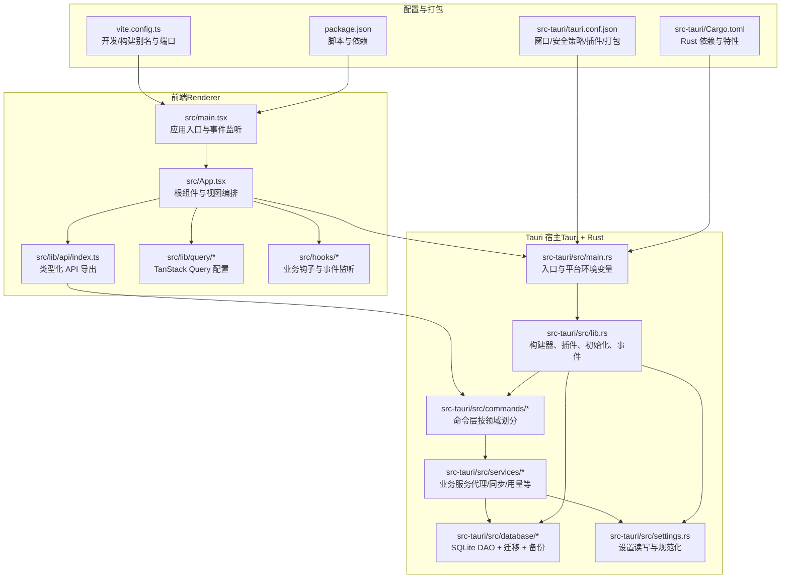
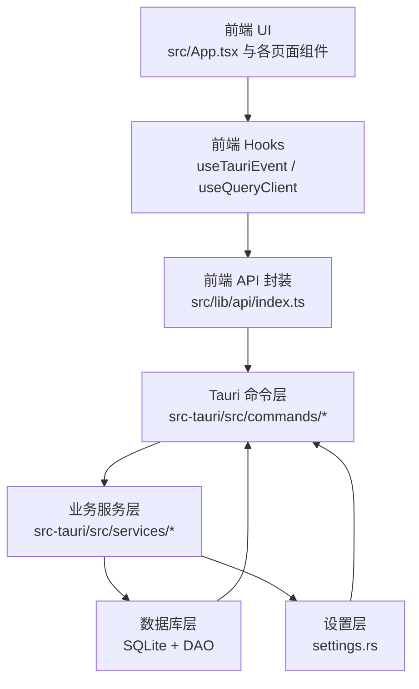
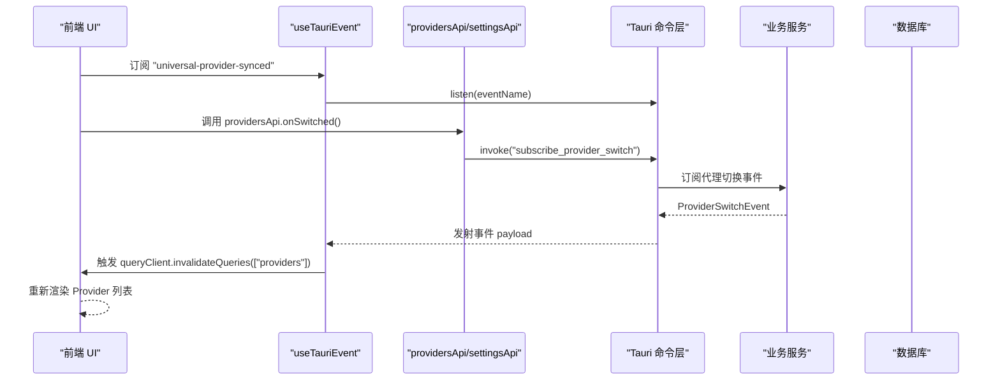
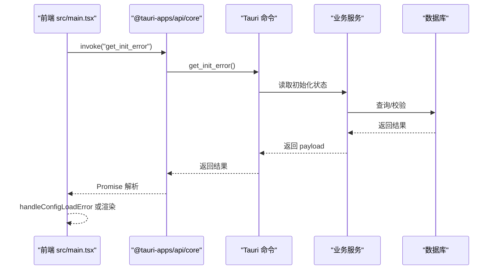
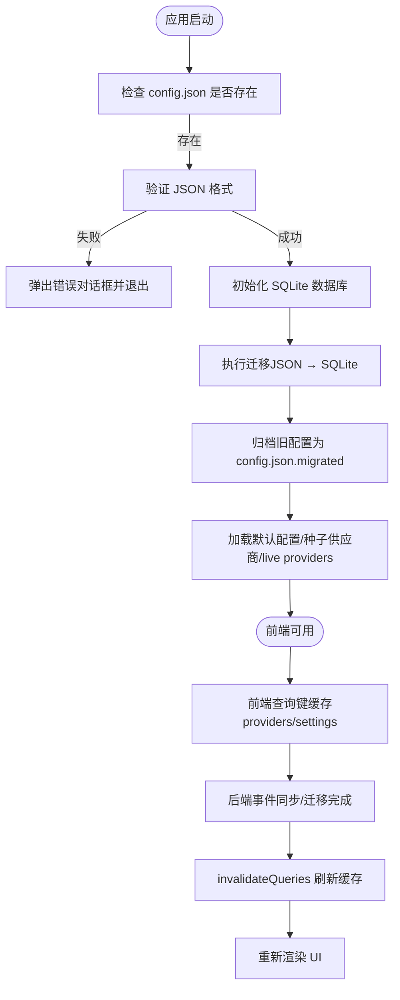
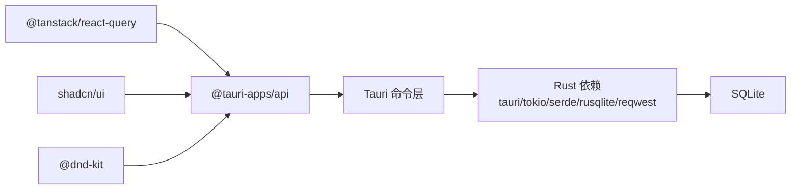

# 架构设计

<cite>
**本文引用的文件**
- [src/main.tsx](file://src/main.tsx)
- [src/App.tsx](file://src/App.tsx)
- [src-tauri/src/main.rs](file://src-tauri/src/main.rs)
- [src-tauri/src/lib.rs](file://src-tauri/src/lib.rs)
- [src-tauri/Cargo.toml](file://src-tauri/Cargo.toml)
- [src-tauri/tauri.conf.json](file://src-tauri/tauri.conf.json)
- [vite.config.ts](file://vite.config.ts)
- [package.json](file://package.json)
- [src/hooks/useTauriEvent.ts](file://src/hooks/useTauriEvent.ts)
- [src/lib/api/index.ts](file://src/lib/api/index.ts)
- [src-tauri/src/commands/mod.rs](file://src-tauri/src/commands/mod.rs)
- [src-tauri/src/commands/proxy.rs](file://src-tauri/src/commands/proxy.rs)
- [src-tauri/src/database/mod.rs](file://src-tauri/src/database/mod.rs)
- [src-tauri/src/settings.rs](file://src-tauri/src/settings.rs)
</cite>

## 目录
1. [简介](#简介)
2. [项目结构](#项目结构)
3. [核心组件](#核心组件)
4. [架构总览](#架构总览)
5. [详细组件分析](#详细组件分析)
6. [依赖分析](#依赖分析)
7. [性能考虑](#性能考虑)
8. [故障排查指南](#故障排查指南)
9. [结论](#结论)
10. [附录](#附录)

## 简介
本文件为 CC Switch 项目的架构设计文档，面向前端（React + TypeScript + Vite + TailwindCSS）与后端（Tauri + Rust）的混合架构，系统性阐述：
- 整体架构模式与分层设计
- 前端 MVVM 模式与组件化原则
- Tauri 命令系统与前后端通信机制
- 数据流：从配置文件到数据库再到组件状态的完整链路
- 错误处理与事件驱动的组件通信
- 系统边界、模块依赖与集成模式
- 架构决策的技术考量与权衡

## 项目结构
项目采用“前端渲染 + Tauri 宿主 + Rust 后端服务”的双层架构：
- 前端层：React + TypeScript + Vite，TailwindCSS 样式，TanStack Query 状态管理，shadcn/ui 组件库，@dnd-kit 拖拽，i18n 国际化。
- 后端层：Tauri 2.8 + Rust，提供命令接口、业务服务、SQLite 数据持久化、代理与会话管理、深链处理、托盘菜单、自动更新等。

图表来源
- [src/main.tsx:1-104](file://src/main.tsx#L1-L104)
- [src/App.tsx:1-800](file://src/App.tsx#L1-L800)
- [src-tauri/src/main.rs:1-23](file://src-tauri/src/main.rs#L1-L23)
- [src-tauri/src/lib.rs:1-800](file://src-tauri/src/lib.rs#L1-L800)
- [src-tauri/src/commands/mod.rs:1-69](file://src-tauri/src/commands/mod.rs#L1-L69)
- [src-tauri/src/database/mod.rs:1-273](file://src-tauri/src/database/mod.rs#L1-L273)
- [src-tauri/src/settings.rs:680-730](file://src-tauri/src/settings.rs#L680-L730)
- [vite.config.ts:1-33](file://vite.config.ts#L1-L33)
- [package.json:1-96](file://package.json#L1-L96)
- [src-tauri/tauri.conf.json:1-70](file://src-tauri/tauri.conf.json#L1-L70)
- [src-tauri/Cargo.toml:1-110](file://src-tauri/Cargo.toml#L1-L110)

章节来源
- [src/main.tsx:1-104](file://src/main.tsx#L1-L104)
- [src/App.tsx:1-800](file://src/App.tsx#L1-L800)
- [src-tauri/src/main.rs:1-23](file://src-tauri/src/main.rs#L1-L23)
- [src-tauri/src/lib.rs:1-800](file://src-tauri/src/lib.rs#L1-L800)
- [vite.config.ts:1-33](file://vite.config.ts#L1-L33)
- [package.json:1-96](file://package.json#L1-L96)
- [src-tauri/tauri.conf.json:1-70](file://src-tauri/tauri.conf.json#L1-L70)
- [src-tauri/Cargo.toml:1-110](file://src-tauri/Cargo.toml#L1-L110)

## 核心组件
- 前端入口与事件桥接：负责平台检测、早期初始化错误处理、事件监听与应用挂载。
- 根组件与视图编排：集中管理应用与视图状态、窗口控制、环境冲突检测、通知与迁移结果提示。
- Tauri 宿主与初始化：统一注册插件、日志、深链、窗口状态、数据库初始化与迁移、托盘菜单、自动更新。
- 命令系统：按领域划分的命令模块，暴露给前端调用，如代理、设置、提供商、MCP、技能、用量等。
- 数据持久化：SQLite 数据库，DAO 分层，Schema 迁移与增量维护，变更钩子联动自动同步。
- 设置与配置：设置文件读写与规范化，前端安全脱敏传输，敏感字段清理。
- 通信与事件：前端 useTauriEvent 钩子统一订阅，后端通过 Emitter 发射事件，前端通过 TanStack Query 使状态一致。

章节来源
- [src/main.tsx:1-104](file://src/main.tsx#L1-L104)
- [src/App.tsx:1-800](file://src/App.tsx#L1-L800)
- [src-tauri/src/lib.rs:1-800](file://src-tauri/src/lib.rs#L1-L800)
- [src-tauri/src/commands/mod.rs:1-69](file://src-tauri/src/commands/mod.rs#L1-L69)
- [src-tauri/src/database/mod.rs:1-273](file://src-tauri/src/database/mod.rs#L1-L273)
- [src-tauri/src/settings.rs:680-730](file://src-tauri/src/settings.rs#L680-L730)
- [src/hooks/useTauriEvent.ts:1-40](file://src/hooks/useTauriEvent.ts#L1-L40)
- [src/lib/api/index.ts:1-31](file://src/lib/api/index.ts#L1-L31)

## 架构总览
CC Switch 采用“前端 MVVM + Tauri 命令桥 + Rust 服务层 + SQLite 数据层”的分层架构：
- 前端负责视图与交互，通过 @tauri-apps/api 的 invoke/listen 与后端通信。
- 后端通过 tauri::command 注解暴露命令，统一在 src/commands/* 中按领域组织。
- 业务服务在 services/* 中实现，DAO 在 database/dao/* 中访问 SQLite。
- 数据流从配置文件（settings.json、live config）到 SQLite，再回到前端状态与 UI。

图表来源
- [src/App.tsx:1-800](file://src/App.tsx#L1-L800)
- [src/hooks/useTauriEvent.ts:1-40](file://src/hooks/useTauriEvent.ts#L1-L40)
- [src/lib/api/index.ts:1-31](file://src/lib/api/index.ts#L1-L31)
- [src-tauri/src/commands/mod.rs:1-69](file://src-tauri/src/commands/mod.rs#L1-L69)
- [src-tauri/src/database/mod.rs:1-273](file://src-tauri/src/database/mod.rs#L1-L273)
- [src-tauri/src/settings.rs:680-730](file://src-tauri/src/settings.rs#L680-L730)

## 详细组件分析

### 前端：MVVM 与组件化
- 视图层（View）：Provider、Settings、Prompts、Skills、MCP、Agents、Universal、Sessions、Workspace、OpenClaw/Tools/Agents、Hermes Memory 等面板组件。
- 模型层（Model）：通过 TanStack Query 的 queryClient 管理远端数据缓存与失效；useSettingsQuery/useProvidersQuery 等查询钩子提供数据源。
- 视图模型（ViewModel）：useProviderActions、useProxyStatus、useTauriEvent 等钩子将 UI 与业务逻辑解耦，封装跨组件的状态与副作用。
- 事件驱动：useTauriEvent 统一订阅后端事件，自动处理注册/卸载，避免竞态与样板代码。

图表来源
- [src/App.tsx:335-363](file://src/App.tsx#L335-L363)
- [src/hooks/useTauriEvent.ts:1-40](file://src/hooks/useTauriEvent.ts#L1-L40)
- [src/lib/api/index.ts:1-31](file://src/lib/api/index.ts#L1-L31)

章节来源
- [src/App.tsx:1-800](file://src/App.tsx#L1-L800)
- [src/hooks/useTauriEvent.ts:1-40](file://src/hooks/useTauriEvent.ts#L1-L40)
- [src/lib/api/index.ts:1-31](file://src/lib/api/index.ts#L1-L31)

### Tauri 命令系统与前后端通信
- 命令注册：在 src-tauri/src/commands/mod.rs 中按领域聚合导出命令，前端通过 @tauri-apps/api/core 的 invoke 调用。
- 事件发射：后端通过 Emitter 发射事件（如 "deeplink-import"/"webdav-sync-status-updated"），前端通过 useTauriEvent 订阅。
- 安全策略：tauri.conf.json 中 CSP 限制 connect-src，仅允许 'self'、ipc:、http://ipc.localhost、https:、http:，保障 IPC 通道安全。
- 插件体系：dialog/process/store/updater/log 等插件在 setup 阶段注册，提供对话框、进程、存储、更新、日志能力。

图表来源
- [src/main.tsx:73-101](file://src/main.tsx#L73-L101)
- [src-tauri/src/commands/mod.rs:1-69](file://src-tauri/src/commands/mod.rs#L1-L69)
- [src-tauri/tauri.conf.json:28-34](file://src-tauri/tauri.conf.json#L28-L34)

章节来源
- [src-tauri/src/commands/mod.rs:1-69](file://src-tauri/src/commands/mod.rs#L1-L69)
- [src-tauri/tauri.conf.json:1-70](file://src-tauri/tauri.conf.json#L1-L70)
- [src/main.tsx:1-104](file://src/main.tsx#L1-L104)

### 数据流：配置文件 → 数据库 → 组件状态
- 配置加载与迁移：启动时检查 config.json 是否存在，若存在则验证并迁移至 SQLite；迁移成功后归档旧文件。
- 数据持久化：SQLite 表结构与迁移在 database/schema.rs 中定义，DAO 在 database/dao/* 中实现；变更钩子触发自动同步。
- 前端状态：通过 TanStack Query 的查询键（如 ["providers"]、["settings"]）缓存数据，事件驱动触发失效与重取。

图表来源
- [src-tauri/src/lib.rs:363-445](file://src-tauri/src/lib.rs#L363-L445)
- [src-tauri/src/database/mod.rs:92-160](file://src-tauri/src/database/mod.rs#L92-L160)
- [src/App.tsx:365-388](file://src/App.tsx#L365-L388)

章节来源
- [src-tauri/src/lib.rs:363-445](file://src-tauri/src/lib.rs#L363-L445)
- [src-tauri/src/database/mod.rs:1-273](file://src-tauri/src/database/mod.rs#L1-L273)
- [src/App.tsx:365-388](file://src/App.tsx#L365-L388)

### 错误处理机制
- 前端：handleConfigLoadError 在收到 "configLoadError" 事件后弹出错误对话框并退出；早期主动 invoke("get_init_error") 避免事件竞态。
- 后端：panic_hook 捕获崩溃并写入日志；show_migration_error_dialog/show_database_init_error_dialog 引导用户重试或退出。
- 设置安全：get_settings_for_frontend 对敏感字段清空，避免前端泄露密钥。

章节来源
- [src/main.tsx:39-61](file://src/main.tsx#L39-L61)
- [src-tauri/src/lib.rs:363-445](file://src-tauri/src/lib.rs#L363-L445)
- [src-tauri/src/settings.rs:680-690](file://src-tauri/src/settings.rs#L680-L690)

### 事件驱动的组件通信
- useTauriEvent 钩子：统一订阅与清理，避免重复样板代码；支持任意 payload 类型。
- 常见事件：universal-provider-synced、webdav-sync-status-updated、s3-sync-status-updated、proxy-official-warning 等。
- 与 TanStack Query 协作：事件触发后 invalidateQueries，确保 UI 与后端状态一致。

章节来源
- [src/hooks/useTauriEvent.ts:1-40](file://src/hooks/useTauriEvent.ts#L1-L40)
- [src/App.tsx:365-417](file://src/App.tsx#L365-L417)

## 依赖分析
- 前端依赖：@tauri-apps/api、@tauri-apps/plugin-*、@tanstack/react-query、react-i18next、shadcn/ui、@dnd-kit 等。
- 后端依赖：tauri、tokio、serde、rusqlite、reqwest、hyper、axum、tower、rustls、thiserror、anyhow 等。
- 构建与工具：Vite、TailwindCSS、TypeScript、MSW、vitest、prettier、tailwind-merge 等。

图表来源
- [package.json:42-94](file://package.json#L42-L94)
- [src-tauri/Cargo.toml:25-83](file://src-tauri/Cargo.toml#L25-L83)

章节来源
- [package.json:1-96](file://package.json#L1-L96)
- [src-tauri/Cargo.toml:1-110](file://src-tauri/Cargo.toml#L1-L110)

## 性能考虑
- 前端：Vite 开发服务器端口固定（3000），构建输出目录与别名优化；Tailwind 按需引入减少体积。
- 后端：release 配置启用 LTO、代码压缩与符号剥离；rusqlite 使用 Mutex 包装 Connection 支持多线程；增量自动回收（incremental vacuum）降低磁盘占用。
- 代理与网络：rustls 作为默认加密提供者，启用 TLS1.2+；HTTP 客户端支持 socks 与流式响应。
- 事件与状态：useTauriEvent 避免重复订阅；TanStack Query 缓存与失效策略减少不必要的请求。

## 故障排查指南
- 配置加载失败：前端监听 "configLoadError" 事件并弹出错误对话框；后端在初始化阶段验证 JSON 并引导用户修复。
- 数据库初始化失败：弹出对话框提示用户重试或退出；迁移失败时保留旧配置以便恢复。
- 代理停止受限：若仍有应用处于接管状态，停止代理会返回错误提示，需先关闭对应应用接管。
- 日志定位：日志文件位于应用配置目录下的 logs/cc-switch.log，支持单文件覆盖与轮转。

章节来源
- [src/main.tsx:39-61](file://src/main.tsx#L39-L61)
- [src-tauri/src/lib.rs:363-445](file://src-tauri/src/lib.rs#L363-L445)
- [src-tauri/src/commands/proxy.rs:18-34](file://src-tauri/src/commands/proxy.rs#L18-L34)

## 结论
CC Switch 通过清晰的前后端分层与事件驱动机制，实现了稳定的数据流与良好的用户体验。前端以 MVVM 与组件化为核心，后端以 Tauri 命令系统与 Rust 服务层为基础，配合 SQLite 数据持久化与自动迁移，形成可扩展、可维护的桌面应用架构。未来可在以下方面持续优化：进一步细化命令粒度、增强错误分类与重试策略、完善自动化测试覆盖、探索更细粒度的缓存与失效策略。

## 附录
- 开发与构建：前端使用 Vite + React + TS，后端使用 Tauri + Rust；通过 package.json 脚本与 tauri.conf.json 配置开发/构建流程。
- 测试：前端使用 vitest + MSW + @testing-library/react；后端使用 cargo test；提供测试钩子特性以支持集成测试。

章节来源
- [vite.config.ts:1-33](file://vite.config.ts#L1-L33)
- [package.json:6-16](file://package.json#L6-L16)
- [src-tauri/tauri.conf.json:6-11](file://src-tauri/tauri.conf.json#L6-L11)