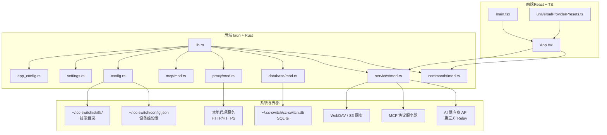
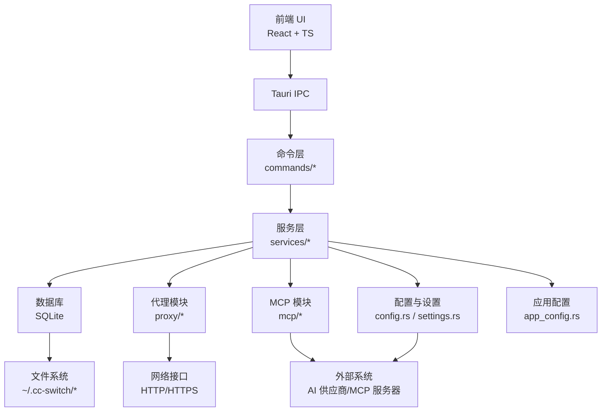
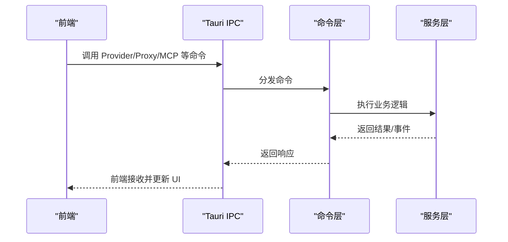
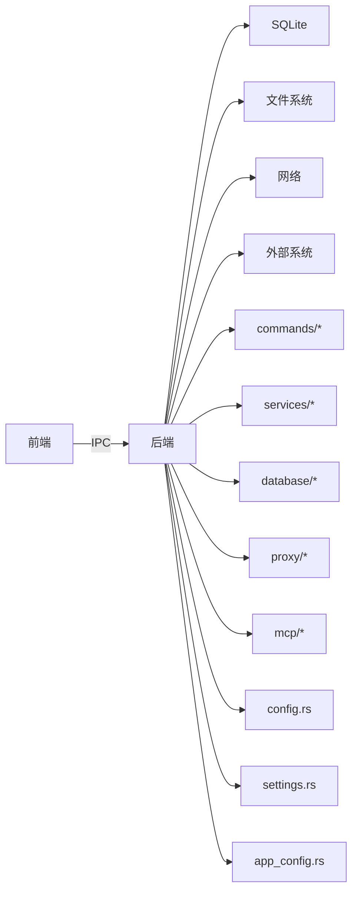

# 系统边界

<cite>
**本文引用的文件**
- [README.md](file://README.md)
- [src/main.tsx](file://src/main.tsx)
- [src/App.tsx](file://src/App.tsx)
- [src-tauri/Cargo.toml](file://src-tauri/Cargo.toml)
- [src-tauri/tauri.conf.json](file://src-tauri/tauri.conf.json)
- [package.json](file://package.json)
- [src-tauri/src/lib.rs](file://src-tauri/src/lib.rs)
- [src-tauri/src/commands/mod.rs](file://src-tauri/src/commands/mod.rs)
- [src-tauri/src/services/mod.rs](file://src-tauri/src/services/mod.rs)
- [src-tauri/src/database/mod.rs](file://src-tauri/src/database/mod.rs)
- [src-tauri/src/proxy/mod.rs](file://src-tauri/src/proxy/mod.rs)
- [src-tauri/src/mcp/mod.rs](file://src-tauri/src/mcp/mod.rs)
- [src-tauri/src/config.rs](file://src-tauri/src/config.rs)
- [src-tauri/src/settings.rs](file://src-tauri/src/settings.rs)
- [src-tauri/src/app_config.rs](file://src-tauri/src/app_config.rs)
- [src/config/universalProviderPresets.ts](file://src/config/universalProviderPresets.ts)
</cite>

## 目录
1. [引言](#引言)
2. [项目结构](#项目结构)
3. [核心组件](#核心组件)
4. [架构总览](#架构总览)
5. [详细组件分析](#详细组件分析)
6. [依赖关系分析](#依赖关系分析)
7. [性能考量](#性能考量)
8. [故障排查指南](#故障排查指南)
9. [结论](#结论)
10. [附录](#附录)

## 引言
本文件旨在为 CC Switch 项目建立清晰的系统边界文档，明确界定应用的系统边界、组件职责、模块间依赖与接口、外部系统集成点、安全边界与权限控制、扩展点与插件机制、部署边界与配置管理，以及版本兼容与升级策略。该文档面向开发者与运维人员，帮助理解系统的整体架构与边界。

## 项目结构
CC Switch 采用前端（React + TypeScript）与后端（Tauri + Rust）双层架构，通过 Tauri IPC 实现前后端通信。项目还包含数据库（SQLite）、文件系统（配置与技能目录）、网络接口（代理与外部 API）、以及深链（Deep Link）等边界组件。

**图表来源**
- [src/main.tsx:1-104](file://src/main.tsx#L1-L104)
- [src/App.tsx:1-800](file://src/App.tsx#L1-L800)
- [src-tauri/src/lib.rs:1-120](file://src-tauri/src/lib.rs#L1-L120)
- [src-tauri/src/commands/mod.rs:1-69](file://src-tauri/src/commands/mod.rs#L1-L69)
- [src-tauri/src/services/mod.rs:1-47](file://src-tauri/src/services/mod.rs#L1-L47)
- [src-tauri/src/database/mod.rs:1-273](file://src-tauri/src/database/mod.rs#L1-L273)
- [src-tauri/src/proxy/mod.rs:1-60](file://src-tauri/src/proxy/mod.rs#L1-L60)
- [src-tauri/src/mcp/mod.rs:1-37](file://src-tauri/src/mcp/mod.rs#L1-L37)
- [src-tauri/src/config.rs:1-425](file://src-tauri/src/config.rs#L1-L425)
- [src-tauri/src/settings.rs:1-800](file://src-tauri/src/settings.rs#L1-L800)
- [src-tauri/src/app_config.rs:1-800](file://src-tauri/src/app_config.rs#L1-L800)

**章节来源**
- [README.md:344-384](file://README.md#L344-L384)
- [src/main.tsx:1-104](file://src/main.tsx#L1-L104)
- [src/App.tsx:1-800](file://src/App.tsx#L1-L800)
- [src-tauri/src/lib.rs:1-120](file://src-tauri/src/lib.rs#L1-L120)

## 核心组件
- 前端应用（React + TS）
  - 入口与生命周期：main.tsx 负责初始化、监听配置加载错误事件、渲染根组件。
  - 主界面与业务逻辑：App.tsx 管理视图、应用切换、事件监听、Provider/Proxy/MCP/Skills/Session 等模块交互。
  - 统一供应商预设：universalProviderPresets.ts 提供跨应用共享的供应商模板与模型映射。
- 后端服务（Tauri + Rust）
  - 应用入口与插件：lib.rs 组织命令、服务、数据库、代理、MCP 等模块，注册插件与事件。
  - 命令层：commands/mod.rs 按领域划分命令（auth、mcp、proxy、settings、usage 等）。
  - 服务层：services/mod.rs 定义 Provider、Proxy、MCP、Prompt、Skill、Sync 等业务服务。
  - 数据层：database/mod.rs 提供 SQLite 访问、Schema 管理、DAO 层与迁移。
  - 代理模块：proxy/mod.rs 提供本地代理、故障转移、格式转换、流式处理等能力。
  - MCP 模块：mcp/mod.rs 提供多应用 MCP 服务器导入/同步/验证。
  - 配置与设置：config.rs 提供路径解析、原子写入、配置读取；settings.rs 提供设备级设置与持久化。
  - 应用配置：app_config.rs 定义多应用配置结构、MCP/Skill/Prompt 统一模型与迁移逻辑。
- 系统与外部边界
  - 数据库：~/.cc-switch/cc-switch.db（SQLite）。
  - 配置文件：~/.cc-switch/config.json（设备级设置 JSON）。
  - 技能目录：~/.cc-switch/skills/（符号链接或拷贝）。
  - 本地代理：本地 HTTP/HTTPS 代理服务，支持热切换与格式转换。
  - 外部系统：AI 供应商 API（第三方 Relay）、MCP 协议服务器、WebDAV/S3 同步。

**章节来源**
- [src/main.tsx:1-104](file://src/main.tsx#L1-L104)
- [src/App.tsx:1-800](file://src/App.tsx#L1-L800)
- [src/config/universalProviderPresets.ts:1-133](file://src/config/universalProviderPresets.ts#L1-L133)
- [src-tauri/src/lib.rs:1-120](file://src-tauri/src/lib.rs#L1-L120)
- [src-tauri/src/commands/mod.rs:1-69](file://src-tauri/src/commands/mod.rs#L1-L69)
- [src-tauri/src/services/mod.rs:1-47](file://src-tauri/src/services/mod.rs#L1-L47)
- [src-tauri/src/database/mod.rs:1-273](file://src-tauri/src/database/mod.rs#L1-L273)
- [src-tauri/src/proxy/mod.rs:1-60](file://src-tauri/src/proxy/mod.rs#L1-L60)
- [src-tauri/src/mcp/mod.rs:1-37](file://src-tauri/src/mcp/mod.rs#L1-L37)
- [src-tauri/src/config.rs:1-425](file://src-tauri/src/config.rs#L1-L425)
- [src-tauri/src/settings.rs:1-800](file://src-tauri/src/settings.rs#L1-L800)
- [src-tauri/src/app_config.rs:1-800](file://src-tauri/src/app_config.rs#L1-L800)

## 架构总览
系统采用“前端 UI + 后端服务”的双层架构，通过 Tauri IPC 进行通信。后端以模块化方式组织命令、服务、数据库、代理与 MCP 等子系统，形成清晰的分层与边界。

**图表来源**
- [src-tauri/src/lib.rs:1-120](file://src-tauri/src/lib.rs#L1-L120)
- [src-tauri/src/commands/mod.rs:1-69](file://src-tauri/src/commands/mod.rs#L1-L69)
- [src-tauri/src/services/mod.rs:1-47](file://src-tauri/src/services/mod.rs#L1-L47)
- [src-tauri/src/database/mod.rs:1-273](file://src-tauri/src/database/mod.rs#L1-L273)
- [src-tauri/src/proxy/mod.rs:1-60](file://src-tauri/src/proxy/mod.rs#L1-L60)
- [src-tauri/src/mcp/mod.rs:1-37](file://src-tauri/src/mcp/mod.rs#L1-L37)
- [src-tauri/src/config.rs:1-425](file://src-tauri/src/config.rs#L1-L425)
- [src-tauri/src/settings.rs:1-800](file://src-tauri/src/settings.rs#L1-L800)
- [src-tauri/src/app_config.rs:1-800](file://src-tauri/src/app_config.rs#L1-L800)

## 详细组件分析

### 前端应用（React + TS）
- 入口与生命周期
  - main.tsx 初始化前端，监听后端配置加载错误事件，渲染根组件，提供主题、国际化、TanStack Query Provider 等上下文。
- 主界面与业务逻辑
  - App.tsx 管理应用与视图切换、Provider 列表与操作、代理状态、MCP/Skills/Session 等模块交互，处理深链事件与系统通知。
- 统一供应商预设
  - universalProviderPresets.ts 提供跨应用共享的供应商模板与模型映射，支持 NewAPI 等网关。

**图表来源**
- [src/main.tsx:1-104](file://src/main.tsx#L1-L104)
- [src/App.tsx:1-800](file://src/App.tsx#L1-L800)
- [src-tauri/src/commands/mod.rs:1-69](file://src-tauri/src/commands/mod.rs#L1-L69)
- [src-tauri/src/services/mod.rs:1-47](file://src-tauri/src/services/mod.rs#L1-L47)

**章节来源**
- [src/main.tsx:1-104](file://src/main.tsx#L1-L104)
- [src/App.tsx:1-800](file://src/App.tsx#L1-L800)
- [src/config/universalProviderPresets.ts:1-133](file://src/config/universalProviderPresets.ts#L1-L133)

### 后端服务（Tauri + Rust）

#### 命令层（commands）
- 按领域划分命令，涵盖认证、余额、MCP、代理、设置、使用统计、同步等。
- 通过 Tauri 注册为 IPC 命令，供前端调用。

**章节来源**
- [src-tauri/src/commands/mod.rs:1-69](file://src-tauri/src/commands/mod.rs#L1-L69)

#### 服务层（services）
- ProviderService：提供者 CRUD、切换、回填、排序。
- ProxyService：本地代理、热切换、格式转换、故障转移。
- McpService：MCP 服务器导入/导出、同步、验证。
- PromptService、SkillService、UsageCache、WebDAV/S3 同步等。

**章节来源**
- [src-tauri/src/services/mod.rs:1-47](file://src-tauri/src/services/mod.rs#L1-L47)

#### 数据库层（database）
- SQLite 数据持久化，提供 DAO 层、Schema 管理、迁移、备份与清理。
- 使用 Mutex 包装 Connection，支持并发安全；注册数据库变更钩子以触发自动同步。

**章节来源**
- [src-tauri/src/database/mod.rs:1-273](file://src-tauri/src/database/mod.rs#L1-L273)

#### 代理模块（proxy）
- 提供本地 HTTP/HTTPS 代理、请求转发、格式转换、流式处理、故障转移与电路断路器。
- 支持会话提取、媒体净化、思考预算优化等。

**章节来源**
- [src-tauri/src/proxy/mod.rs:1-60](file://src-tauri/src/proxy/mod.rs#L1-L60)

#### MCP 模块（mcp）
- 支持 Claude、Codex、Gemini、OpenCode、Hermes 的 MCP 服务器导入/同步与验证。
- 提供统一的服务器配置结构与跨应用同步。

**章节来源**
- [src-tauri/src/mcp/mod.rs:1-37](file://src-tauri/src/mcp/mod.rs#L1-L37)

#### 配置与设置（config/settings/app_config）
- config.rs：路径解析、原子写入、配置读取、文件复制/删除。
- settings.rs：设备级设置（UI、目录覆盖、同步、备份、终端等）持久化与缓存。
- app_config.rs：多应用配置结构、MCP/Skill/Prompt 统一模型与迁移逻辑。

**章节来源**
- [src-tauri/src/config.rs:1-425](file://src-tauri/src/config.rs#L1-L425)
- [src-tauri/src/settings.rs:1-800](file://src-tauri/src/settings.rs#L1-L800)
- [src-tauri/src/app_config.rs:1-800](file://src-tauri/src/app_config.rs#L1-L800)

### 系统与外部边界

#### 数据库与文件系统
- SQLite 数据库：~/.cc-switch/cc-switch.db，提供 Provider、MCP、Prompt、Skill、设置等数据持久化。
- 配置文件：~/.cc-switch/config.json（设备级设置 JSON）。
- 技能目录：~/.cc-switch/skills/，支持符号链接与拷贝两种同步方式。

**章节来源**
- [src-tauri/src/database/mod.rs:1-273](file://src-tauri/src/database/mod.rs#L1-L273)
- [src-tauri/src/config.rs:1-425](file://src-tauri/src/config.rs#L1-L425)
- [src-tauri/src/settings.rs:1-800](file://src-tauri/src/settings.rs#L1-L800)

#### 网络接口与代理
- 本地代理：提供 HTTP/HTTPS 代理服务，支持热切换、格式转换、故障转移、会话处理与流式优化。
- 外部系统：对接第三方 AI 供应商 API 与 MCP 协议服务器，支持 WebDAV/S3 同步。

**章节来源**
- [src-tauri/src/proxy/mod.rs:1-60](file://src-tauri/src/proxy/mod.rs#L1-L60)
- [src-tauri/src/services/mod.rs:1-47](file://src-tauri/src/services/mod.rs#L1-L47)

#### 深链（Deep Link）
- 支持 ccswitch:// 协议，解析资源类型与参数，向前端发射事件并可选聚焦主窗口。

**章节来源**
- [src-tauri/src/lib.rs:119-182](file://src-tauri/src/lib.rs#L119-L182)

## 依赖关系分析

**图表来源**
- [src-tauri/src/lib.rs:1-120](file://src-tauri/src/lib.rs#L1-L120)
- [src-tauri/src/commands/mod.rs:1-69](file://src-tauri/src/commands/mod.rs#L1-L69)
- [src-tauri/src/services/mod.rs:1-47](file://src-tauri/src/services/mod.rs#L1-L47)
- [src-tauri/src/database/mod.rs:1-273](file://src-tauri/src/database/mod.rs#L1-L273)
- [src-tauri/src/proxy/mod.rs:1-60](file://src-tauri/src/proxy/mod.rs#L1-L60)
- [src-tauri/src/mcp/mod.rs:1-37](file://src-tauri/src/mcp/mod.rs#L1-L37)
- [src-tauri/src/config.rs:1-425](file://src-tauri/src/config.rs#L1-L425)
- [src-tauri/src/settings.rs:1-800](file://src-tauri/src/settings.rs#L1-L800)
- [src-tauri/src/app_config.rs:1-800](file://src-tauri/src/app_config.rs#L1-L800)

**章节来源**
- [src-tauri/src/lib.rs:1-120](file://src-tauri/src/lib.rs#L1-L120)
- [src-tauri/src/commands/mod.rs:1-69](file://src-tauri/src/commands/mod.rs#L1-L69)
- [src-tauri/src/services/mod.rs:1-47](file://src-tauri/src/services/mod.rs#L1-L47)
- [src-tauri/src/database/mod.rs:1-273](file://src-tauri/src/database/mod.rs#L1-L273)
- [src-tauri/src/proxy/mod.rs:1-60](file://src-tauri/src/proxy/mod.rs#L1-L60)
- [src-tauri/src/mcp/mod.rs:1-37](file://src-tauri/src/mcp/mod.rs#L1-L37)
- [src-tauri/src/config.rs:1-425](file://src-tauri/src/config.rs#L1-L425)
- [src-tauri/src/settings.rs:1-800](file://src-tauri/src/settings.rs#L1-L800)
- [src-tauri/src/app_config.rs:1-800](file://src-tauri/src/app_config.rs#L1-L800)

## 性能考量
- 前端
  - 使用 TanStack Query 进行缓存与同步，减少重复请求。
  - React 组件按需渲染与状态管理，避免不必要的重绘。
- 后端
  - SQLite 使用 Mutex 包装连接，支持并发安全；启用外键与增量自动回收，降低碎片化。
  - 代理模块采用异步流式处理与格式转换，减少内存占用。
  - 日志系统单文件输出与轮转，避免日志膨胀影响性能。
- 部署
  - Release 配置启用 LTO、代码压缩与符号剥离，减小二进制体积。

**章节来源**
- [src-tauri/src/database/mod.rs:1-273](file://src-tauri/src/database/mod.rs#L1-L273)
- [src-tauri/src/proxy/mod.rs:1-60](file://src-tauri/src/proxy/mod.rs#L1-L60)
- [src-tauri/Cargo.toml:98-106](file://src-tauri/Cargo.toml#L98-L106)

## 故障排查指南
- 配置加载失败
  - 前端监听后端的配置加载错误事件，弹出错误对话并强制退出，避免在配置损坏情况下继续运行。
- 数据库初始化失败
  - 后端在初始化数据库时进行循环重试，若用户取消则退出，否则继续重试。
- 日志与崩溃
  - 后端设置 panic hook，记录崩溃日志至 <app_config_dir>/crash.log；日志系统单文件输出并轮转。
- 代理与同步错误
  - 前端监听代理与同步状态事件，出现错误时弹出通知并刷新设置缓存。

**章节来源**
- [src/main.tsx:1-104](file://src/main.tsx#L1-L104)
- [src-tauri/src/lib.rs:363-446](file://src-tauri/src/lib.rs#L363-L446)
- [src-tauri/src/settings.rs:1-800](file://src-tauri/src/settings.rs#L1-L800)

## 结论
CC Switch 通过清晰的前后端分层与模块化设计，实现了对多应用、多供应商、多协议的统一管理。系统边界明确：前端负责 UI 与交互，后端负责业务逻辑与系统集成；数据库与文件系统提供持久化与配置管理；网络接口与代理模块实现对外部系统的接入与优化。通过深链、同步与自动迁移等机制，系统在可用性与可维护性方面具备良好表现。

## 附录

### 安全边界与权限控制
- CSP 与协议
  - tauri.conf.json 中配置了 CSP 与 asset 协议，限制脚本与连接源，保障前端安全。
- 插件权限
  - 通过 capabilities/schema 定义插件权限集合，限制窗口与 webview 的 IPC 访问范围。
- 敏感信息
  - settings.rs 在前端展示时会清除敏感字段（如 WebDAV/S3 密钥），避免泄露。

**章节来源**
- [src-tauri/tauri.conf.json:28-34](file://src-tauri/tauri.conf.json#L28-L34)
- [src-tauri/gen/schemas/desktop-schema.json:39-100](file://src-tauri/gen/schemas/desktop-schema.json#L39-L100)
- [src-tauri/gen/schemas/macOS-schema.json:39-100](file://src-tauri/gen/schemas/macOS-schema.json#L39-L100)
- [src-tauri/src/settings.rs:680-690](file://src-tauri/src/settings.rs#L680-L690)

### 外部系统集成点
- AI 供应商 API：通过第三方 Relay 与代理模块对接，支持多供应商切换与故障转移。
- MCP 协议：统一导入/同步 Claude、Codex、Gemini、OpenCode、Hermes 的 MCP 服务器。
- 代理服务：本地 HTTP/HTTPS 代理，支持格式转换、流式处理与会话管理。
- 第三方工具：WebDAV/S3 同步、终端集成、开机自启、自动更新等。

**章节来源**
- [src-tauri/src/proxy/mod.rs:1-60](file://src-tauri/src/proxy/mod.rs#L1-L60)
- [src-tauri/src/mcp/mod.rs:1-37](file://src-tauri/src/mcp/mod.rs#L1-L37)
- [src-tauri/src/services/mod.rs:1-47](file://src-tauri/src/services/mod.rs#L1-L47)

### 扩展点与插件机制
- 供应商扩展：通过 ProviderService 与 ProviderManager 支持新增供应商类型与配置。
- MCP 服务器扩展：通过 McpService 支持导入/同步/验证不同应用的 MCP 服务器。
- 插件机制：Tauri 插件体系（process、dialog、store、updater、opener、deep-link 等）提供系统级能力。

**章节来源**
- [src-tauri/src/services/mod.rs:1-47](file://src-tauri/src/services/mod.rs#L1-L47)
- [src-tauri/src/mcp/mod.rs:1-37](file://src-tauri/src/mcp/mod.rs#L1-L37)
- [src-tauri/Cargo.toml:30-38](file://src-tauri/Cargo.toml#L30-L38)

### 部署边界、环境隔离与配置管理
- 部署边界：Tauri 打包为多平台原生应用，包含 updater 插件与 per-user 安装模板。
- 环境隔离：支持通过 CC_SWITCH_TEST_HOME 等环境变量隔离测试数据。
- 配置管理：设备级 settings.json 与应用级 config.json 分离；路径覆盖与原子写入保障一致性。

**章节来源**
- [src-tauri/tauri.conf.json:1-70](file://src-tauri/tauri.conf.json#L1-L70)
- [src-tauri/src/config.rs:20-34](file://src-tauri/src/config.rs#L20-L34)
- [src-tauri/src/settings.rs:509-644](file://src-tauri/src/settings.rs#L509-L644)

### 版本兼容性、向后兼容与升级策略
- 版本兼容：README 提供版本信息与发布说明，前端与后端版本号保持一致。
- 向后兼容：config.rs 与 app_config.rs 提供配置迁移逻辑（v3.8+ 的 SQLite 迁移、Prompt 自动导入、MCP 统一结构迁移）。
- 升级策略：Tauri updater 插件提供自动更新能力；数据库迁移失败时提供重试与退出机制。

**章节来源**
- [README.md:1-50](file://README.md#L1-L50)
- [src-tauri/src/lib.rs:363-446](file://src-tauri/src/lib.rs#L363-L446)
- [src-tauri/src/app_config.rs:519-623](file://src-tauri/src/app_config.rs#L519-L623)