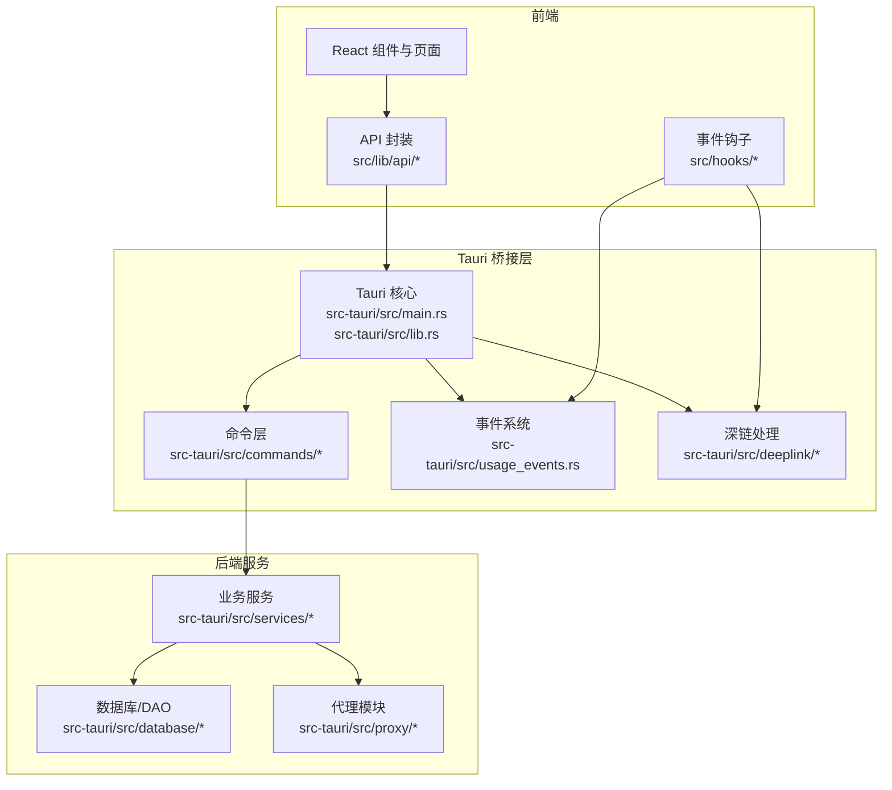
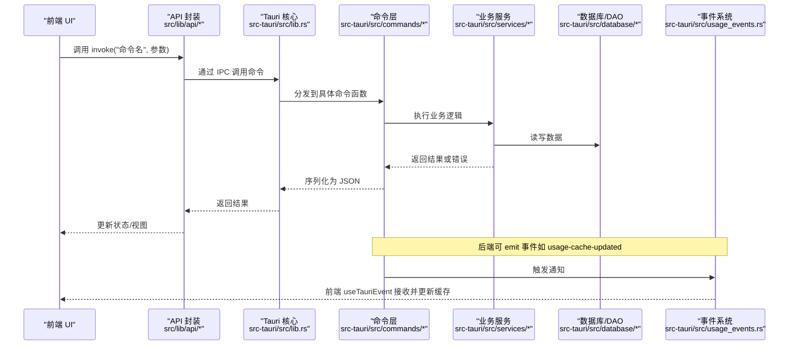
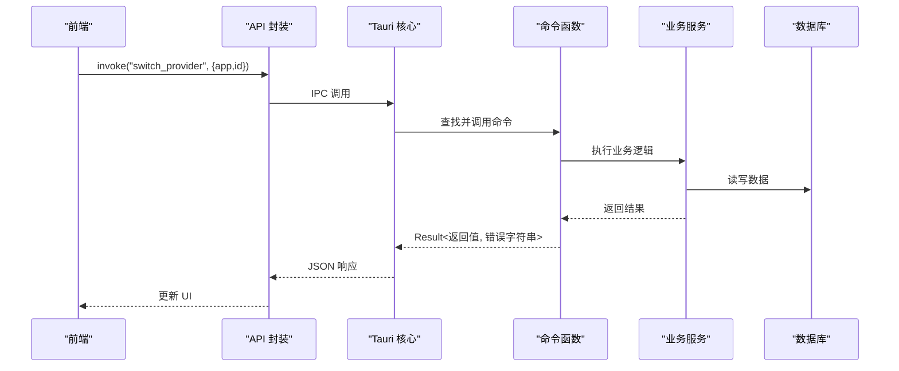
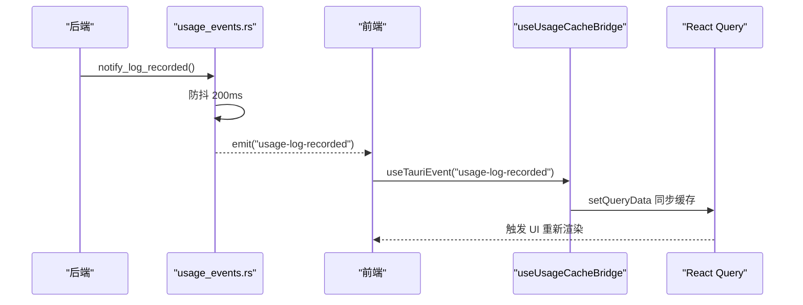
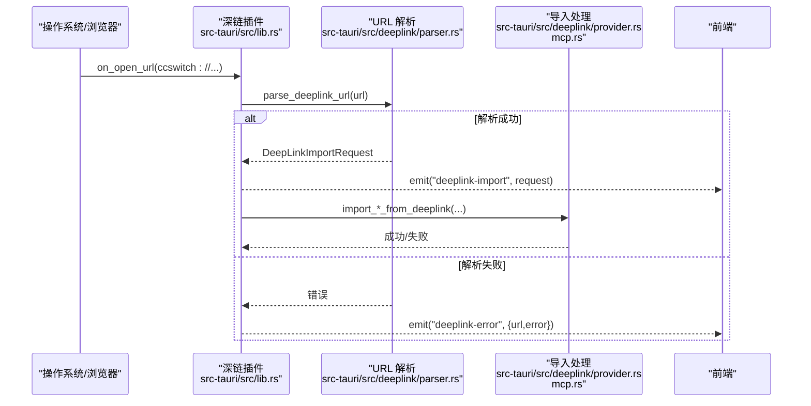
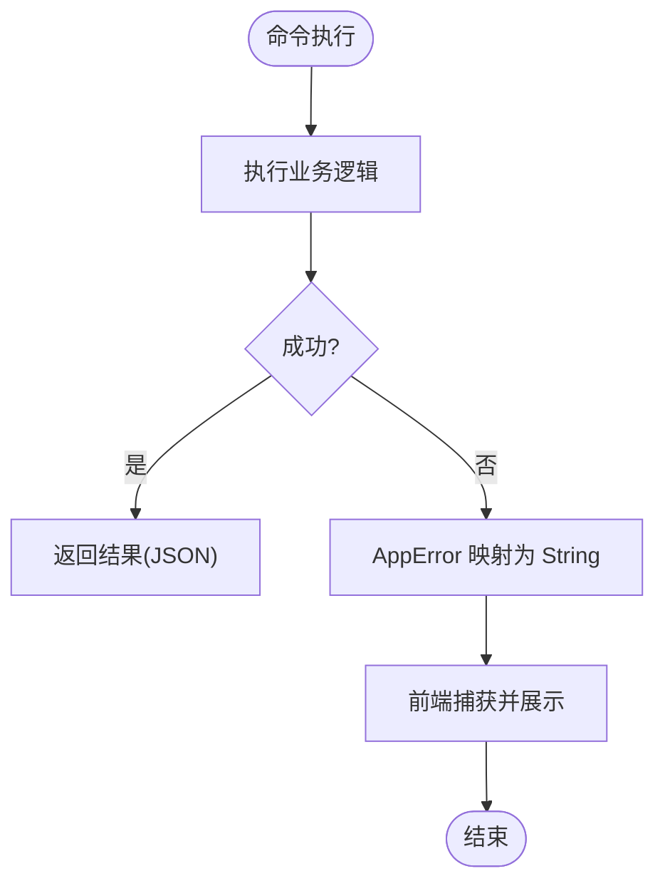
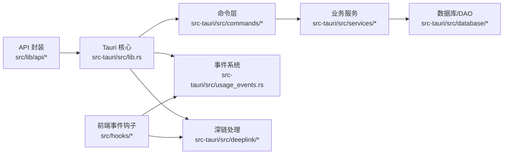

# 通信机制

<cite>
**本文引用的文件**
- [src-tauri/src/main.rs](file://src-tauri/src/main.rs)
- [src-tauri/src/lib.rs](file://src-tauri/src/lib.rs)
- [src-tauri/src/commands/mod.rs](file://src-tauri/src/commands/mod.rs)
- [src-tauri/src/commands/provider.rs](file://src-tauri/src/commands/provider.rs)
- [src-tauri/src/commands/session_manager.rs](file://src-tauri/src/commands/session_manager.rs)
- [src-tauri/src/commands/proxy.rs](file://src-tauri/src/commands/proxy.rs)
- [src-tauri/src/commands/copilot.rs](file://src-tauri/src/commands/copilot.rs)
- [src-tauri/src/error.rs](file://src-tauri/src/error.rs)
- [src-tauri/src/deeplink/mod.rs](file://src-tauri/src/deeplink/mod.rs)
- [src-tauri/src/deeplink/parser.rs](file://src-tauri/src/deeplink/parser.rs)
- [src-tauri/src/deeplink/provider.rs](file://src-tauri/src/deeplink/provider.rs)
- [src-tauri/src/deeplink/mcp.rs](file://src-tauri/src/deeplink/mcp.rs)
- [src-tauri/src/usage_events.rs](file://src-tauri/src/usage_events.rs)
- [src/hooks/useTauriEvent.ts](file://src/hooks/useTauriEvent.ts)
- [src/hooks/useUsageCacheBridge.ts](file://src/hooks/useUsageCacheBridge.ts)
- [src/lib/api/index.ts](file://src/lib/api/index.ts)
- [src/lib/api/subscription.ts](file://src/lib/api/subscription.ts)
- [src/lib/api/model-test.ts](file://src/lib/api/model-test.ts)
- [src-tauri/tauri.conf.json](file://src-tauri/tauri.conf.json)
- [package.json](file://package.json)
</cite>

## 目录
1. [简介](#简介)
2. [项目结构](#项目结构)
3. [核心组件](#核心组件)
4. [架构总览](#架构总览)
5. [详细组件分析](#详细组件分析)
6. [依赖关系分析](#依赖关系分析)
7. [性能考量](#性能考量)
8. [故障排查指南](#故障排查指南)
9. [结论](#结论)
10. [附录](#附录)

## 简介
本文件系统性阐述 CC Switch 的通信机制，涵盖前端与后端之间的多种通信方式与协议：
- Tauri 命令系统：命令注册、调用、参数与返回值的类型安全、错误传播。
- IPC 与事件系统：事件订阅、发布、异步通知与桥接。
- 深链接协议：ccswitch:// 的解析、导入与事件分发。
- 数据序列化与反序列化：JSON、Base64、类型安全保证。
- 安全性、性能优化与超时处理。
- 外部应用集成与第三方服务对接。

## 项目结构
前端与后端通过 Tauri 桥接形成统一应用，前端负责 UI 与交互，后端负责业务逻辑、系统集成与事件驱动。

图示来源
- [src-tauri/src/main.rs:1-23](file://src-tauri/src/main.rs#L1-L23)
- [src-tauri/src/lib.rs:1-120](file://src-tauri/src/lib.rs#L1-L120)
- [src-tauri/src/commands/mod.rs:1-69](file://src-tauri/src/commands/mod.rs#L1-L69)
- [src-tauri/src/usage_events.rs:1-69](file://src-tauri/src/usage_events.rs#L1-L69)
- [src-tauri/src/deeplink/mod.rs:1-139](file://src-tauri/src/deeplink/mod.rs#L1-L139)

章节来源
- [src-tauri/src/main.rs:1-23](file://src-tauri/src/main.rs#L1-L23)
- [src-tauri/src/lib.rs:1-800](file://src-tauri/src/lib.rs#L1-L800)
- [src-tauri/src/commands/mod.rs:1-69](file://src-tauri/src/commands/mod.rs#L1-L69)

## 核心组件
- 命令系统：通过 #[tauri::command] 注解暴露 Rust 函数为前端可调用的命令，参数与返回值经由 serde JSON 序列化/反序列化。
- 事件系统：后端通过 Emitter 发布事件，前端通过 useTauriEvent 订阅；提供防抖与桥接以提升体验与一致性。
- 深链接：统一处理 ccswitch:// URL，解析为请求模型并发射事件，驱动前端导入流程。
- 错误模型：统一的 AppError 类型，支持本地化与结构化错误字符串，便于前后端一致处理。
- 安全与 CSP：严格的内容安全策略，限制连接源与资源协议，保障 IPC 与网络访问安全。

章节来源
- [src-tauri/src/commands/provider.rs:1-800](file://src-tauri/src/commands/provider.rs#L1-L800)
- [src-tauri/src/commands/session_manager.rs:1-86](file://src-tauri/src/commands/session_manager.rs#L1-L86)
- [src-tauri/src/commands/proxy.rs:1-40](file://src-tauri/src/commands/proxy.rs#L1-L40)
- [src-tauri/src/commands/copilot.rs:1-31](file://src-tauri/src/commands/copilot.rs#L1-L31)
- [src-tauri/src/error.rs:1-147](file://src-tauri/src/error.rs#L1-L147)
- [src-tauri/src/usage_events.rs:1-69](file://src-tauri/src/usage_events.rs#L1-L69)
- [src-tauri/src/deeplink/mod.rs:1-139](file://src-tauri/src/deeplink/mod.rs#L1-L139)
- [src-tauri/tauri.conf.json:1-57](file://src-tauri/tauri.conf.json#L1-L57)

## 架构总览
下图展示从前端命令调用到后端处理与事件通知的完整链路，以及深链接导入与事件驱动的流程。

图示来源
- [src-tauri/src/lib.rs:1-182](file://src-tauri/src/lib.rs#L1-L182)
- [src-tauri/src/commands/mod.rs:1-69](file://src-tauri/src/commands/mod.rs#L1-L69)
- [src-tauri/src/usage_events.rs:1-69](file://src-tauri/src/usage_events.rs#L1-L69)
- [src/lib/api/index.ts:1-31](file://src/lib/api/index.ts#L1-L31)

## 详细组件分析

### Tauri 命令系统与调用流程
- 命令注册：命令通过 #[tauri::command] 注解自动注册，参数与返回值由 serde JSON 序列化/反序列化。
- 参数与返回：命令函数接收 State、AppHandle 等上下文，返回 Result<T, String>，错误转换为字符串传递给前端。
- 示例命令：
  - 供应商管理：获取/切换/增删改查、导入默认配置、测试端点延迟等。
  - 会话管理：扫描、加载消息、启动终端、删除会话。
  - 代理控制：启动/停止代理服务，支持恢复 Live 配置。
  - Copilot 认证：设备码流程与认证状态管理。

图示来源
- [src-tauri/src/commands/provider.rs:1-1165](file://src-tauri/src/commands/provider.rs#L1-L1165)
- [src-tauri/src/commands/session_manager.rs:1-86](file://src-tauri/src/commands/session_manager.rs#L1-L86)
- [src-tauri/src/commands/proxy.rs:1-40](file://src-tauri/src/commands/proxy.rs#L1-L40)
- [src-tauri/src/commands/copilot.rs:1-31](file://src-tauri/src/commands/copilot.rs#L1-L31)

章节来源
- [src-tauri/src/commands/provider.rs:1-800](file://src-tauri/src/commands/provider.rs#L1-L800)
- [src-tauri/src/commands/session_manager.rs:1-86](file://src-tauri/src/commands/session_manager.rs#L1-L86)
- [src-tauri/src/commands/proxy.rs:1-40](file://src-tauri/src/commands/proxy.rs#L1-L40)
- [src-tauri/src/commands/copilot.rs:1-31](file://src-tauri/src/commands/copilot.rs#L1-L31)

### 事件驱动架构与异步通知
- 事件订阅：前端通过 useTauriEvent 订阅事件，自动处理注册与卸载，避免样板代码。
- 事件发布：后端在关键路径（如使用统计写入）emit 事件，前端通过 useUsageCacheBridge 同步到 React Query 缓存。
- 防抖与一致性：使用 OnceLock 注入 AppHandle，200ms 防抖合并多次通知，避免前端频繁刷新。

图示来源
- [src-tauri/src/usage_events.rs:1-69](file://src-tauri/src/usage_events.rs#L1-L69)
- [src/hooks/useUsageCacheBridge.ts:1-43](file://src/hooks/useUsageCacheBridge.ts#L1-L43)
- [src/hooks/useTauriEvent.ts:1-40](file://src/hooks/useTauriEvent.ts#L1-L40)

章节来源
- [src-tauri/src/usage_events.rs:1-69](file://src-tauri/src/usage_events.rs#L1-L69)
- [src/hooks/useUsageCacheBridge.ts:1-43](file://src/hooks/useUsageCacheBridge.ts#L1-L43)
- [src/hooks/useTauriEvent.ts:1-40](file://src/hooks/useTauriEvent.ts#L1-L40)

### 深链接协议与外部应用集成
- 协议与版本：ccswitch://v1/import，支持 provider、prompt、mcp、skill 资源导入。
- 解析与校验：解析 URL 参数，校验版本与资源类型，支持 Base64 配置文件合并。
- 导入流程：将请求转换为 Provider/MCP/Prompt/Skill 结构，委托服务层导入，并可选择启用为当前配置。
- 事件分发：成功解析后发射 deeplink-import 事件；解析失败发射 deeplink-error 事件，前端据此展示提示。

图示来源
- [src-tauri/src/lib.rs:119-182](file://src-tauri/src/lib.rs#L119-L182)
- [src-tauri/src/deeplink/parser.rs:249-323](file://src-tauri/src/deeplink/parser.rs#L249-L323)
- [src-tauri/src/deeplink/mod.rs:1-139](file://src-tauri/src/deeplink/mod.rs#L1-L139)
- [src-tauri/src/deeplink/provider.rs:1-42](file://src-tauri/src/deeplink/provider.rs#L1-L42)
- [src-tauri/src/deeplink/mcp.rs:1-75](file://src-tauri/src/deeplink/mcp.rs#L1-L75)

章节来源
- [src-tauri/src/lib.rs:119-182](file://src-tauri/src/lib.rs#L119-L182)
- [src-tauri/src/deeplink/parser.rs:249-323](file://src-tauri/src/deeplink/parser.rs#L249-L323)
- [src-tauri/src/deeplink/mod.rs:1-139](file://src-tauri/src/deeplink/mod.rs#L1-L139)
- [src-tauri/src/deeplink/provider.rs:1-42](file://src-tauri/src/deeplink/provider.rs#L1-L42)
- [src-tauri/src/deeplink/mcp.rs:1-75](file://src-tauri/src/deeplink/mcp.rs#L1-L75)

### 错误处理与异常传播
- 错误类型：统一的 AppError，覆盖配置、输入、IO、JSON/TOML、HTTP、断路器、数据库、OMO 等场景。
- 本地化：支持 zh/en 的本地化错误，便于国际化展示。
- 传播路径：命令层将错误转换为字符串返回；前端通过 API 封装捕获并展示；事件层对失败进行记录与降级处理。
- 结构化错误：提供 format_skill_error 生成结构化 JSON 错误字符串，便于前端解析与展示。

图示来源
- [src-tauri/src/error.rs:1-147](file://src-tauri/src/error.rs#L1-L147)
- [src-tauri/src/commands/provider.rs:1-800](file://src-tauri/src/commands/provider.rs#L1-L800)

章节来源
- [src-tauri/src/error.rs:1-147](file://src-tauri/src/error.rs#L1-L147)
- [src-tauri/src/commands/provider.rs:1-800](file://src-tauri/src/commands/provider.rs#L1-L800)

### 数据序列化与类型安全
- JSON：命令参数与返回值、深链请求模型、事件负载均采用 serde JSON。
- Base64：深链配置文件字段 config 采用 Base64 编码，避免特殊字符与长度限制。
- 类型安全：前端通过 src/lib/api/index.ts 暴露强类型接口，命令层通过 serde 类型约束保证序列化/反序列化安全。
- 本地化与结构化：错误与事件负载采用统一结构，前端可稳定解析。

章节来源
- [src-tauri/src/deeplink/mod.rs:1-139](file://src-tauri/src/deeplink/mod.rs#L1-L139)
- [src/lib/api/index.ts:1-31](file://src/lib/api/index.ts#L1-L31)
- [src-tauri/src/error.rs:114-121](file://src-tauri/src/error.rs#L114-L121)

### 安全性考虑
- 内容安全策略（CSP）：限制 connect-src 为 'self'、ipc:、http://ipc.localhost、https、http，减少 XSS 与中间人攻击风险。
- 资源协议：assetProtocol.enable=true，限定资源加载范围。
- 深链注册：在 Linux/Windows 调试模式下显式注册，避免覆盖用户自定义配置。
- 日志脱敏：redact_url_for_log 对 URL 中敏感参数进行脱敏记录。

章节来源
- [src-tauri/tauri.conf.json:28-34](file://src-tauri/tauri.conf.json#L28-L34)
- [src-tauri/src/lib.rs:88-117](file://src-tauri/src/lib.rs#L88-L117)
- [src-tauri/src/lib.rs:771-807](file://src-tauri/src/lib.rs#L771-L807)

### 性能优化与超时处理
- 防抖事件：usage-events 使用 200ms 防抖合并多次通知，降低前端刷新频率。
- 代理与流式处理：代理模块对 SSE/流式响应进行错误聚合与诊断，避免无头尾信息的裸错误误导。
- 超时配置：前端提供流式健康检查配置（超时、重试、空闲等），后端命令层按需传入。
- 线程池：命令层使用 async_runtime::spawn_blocking 处理阻塞操作，避免阻塞主线程。

章节来源
- [src-tauri/src/usage_events.rs:22-28](file://src-tauri/src/usage_events.rs#L22-L28)
- [src-tauri/src/proxy/handlers.rs:1492-1645](file://src-tauri/src/proxy/handlers.rs#L1492-L1645)
- [src/lib/api/model-test.ts:1-67](file://src/lib/api/model-test.ts#L1-L67)
- [src-tauri/src/commands/session_manager.rs:28-58](file://src-tauri/src/commands/session_manager.rs#L28-L58)

## 依赖关系分析

图示来源
- [src-tauri/src/lib.rs:1-120](file://src-tauri/src/lib.rs#L1-L120)
- [src-tauri/src/commands/mod.rs:1-69](file://src-tauri/src/commands/mod.rs#L1-L69)
- [src-tauri/src/usage_events.rs:1-69](file://src-tauri/src/usage_events.rs#L1-L69)
- [src-tauri/src/deeplink/mod.rs:1-139](file://src-tauri/src/deeplink/mod.rs#L1-L139)

章节来源
- [src-tauri/src/lib.rs:1-120](file://src-tauri/src/lib.rs#L1-L120)
- [src-tauri/src/commands/mod.rs:1-69](file://src-tauri/src/commands/mod.rs#L1-L69)

## 性能考量
- 事件防抖：200ms 合并多次使用日志写入事件，降低前端刷新压力。
- 命令异步化：阻塞操作放入 spawn_blocking，避免阻塞 Tauri 主线程。
- 序列化开销：命令参数与返回值采用 JSON，建议在高频调用场景下减少不必要的大对象传输。
- 代理流式处理：对上游错误进行聚合与诊断，避免错误风暴影响前端体验。

## 故障排查指南
- 命令调用失败：检查命令返回的错误字符串，定位业务服务或数据库层问题。
- 事件未到达：确认前端 useTauriEvent 订阅是否正确，事件名称是否匹配；检查后端 emit 是否抛出异常。
- 深链接导入失败：查看 deeplink-error 事件负载，核对 URL 参数与版本；确认 Base64 配置是否有效。
- CSP 限制：若出现资源加载失败，检查 tauri.conf.json 中的 CSP 配置与 connect-src 白名单。
- 日志脱敏：注意日志中的 URL 已脱敏，必要时通过非脱敏日志辅助排查。

章节来源
- [src-tauri/src/error.rs:1-147](file://src-tauri/src/error.rs#L1-L147)
- [src-tauri/src/lib.rs:119-182](file://src-tauri/src/lib.rs#L119-L182)
- [src-tauri/tauri.conf.json:28-34](file://src-tauri/tauri.conf.json#L28-L34)

## 结论
CC Switch 的通信机制以 Tauri 为核心，结合命令系统、事件系统与深链接协议，实现了前后端高效、安全、可扩展的协作。通过统一的错误模型、类型安全的序列化与严格的 CSP 策略，系统在复杂代理与多供应商场景下仍能保持稳定与可维护性。事件驱动与防抖机制进一步提升了用户体验与系统性能。

## 附录
- 开发与测试：前端使用 vitest + MSW 模拟 Tauri API 调用；后端使用 cargo test 进行 Rust 测试。
- 项目脚本：package.json 提供开发、构建与测试命令，便于快速迭代。

章节来源
- [package.json:1-45](file://package.json#L1-L45)
- [README.md:427-516](file://README.md#L427-L516)