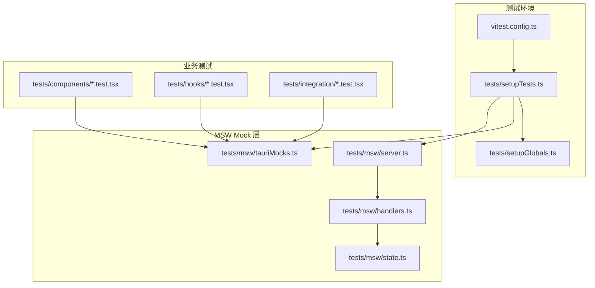
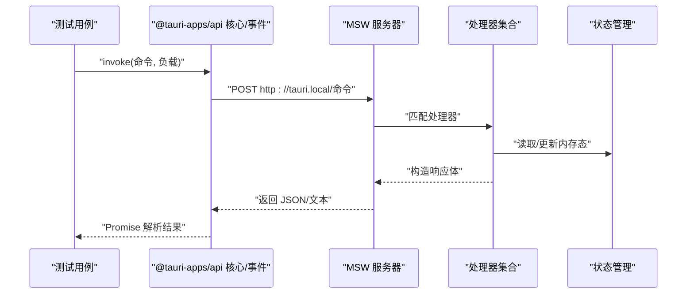
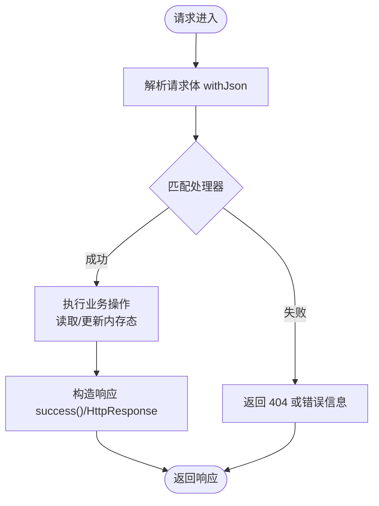
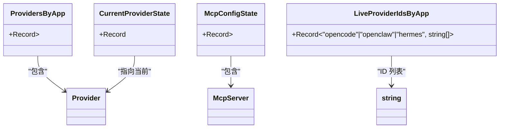
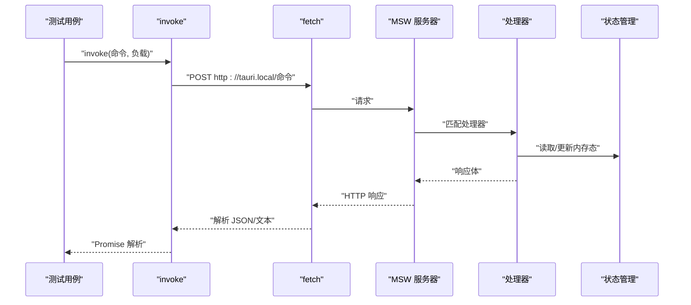
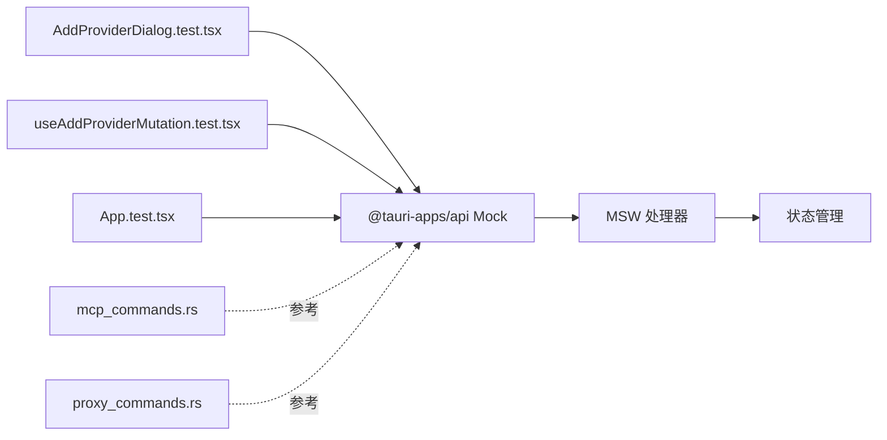

# Mock 服务

<cite>
**本文引用的文件**
- [tests/msw/server.ts](file://tests/msw/server.ts)
- [tests/msw/handlers.ts](file://tests/msw/handlers.ts)
- [tests/msw/state.ts](file://tests/msw/state.ts)
- [tests/msw/tauriMocks.ts](file://tests/msw/tauriMocks.ts)
- [tests/setupTests.ts](file://tests/setupTests.ts)
- [tests/setupGlobals.ts](file://tests/setupGlobals.ts)
- [vitest.config.ts](file://vitest.config.ts)
- [tests/components/AddProviderDialog.test.tsx](file://tests/components/AddProviderDialog.test.tsx)
- [tests/hooks/useAddProviderMutation.test.tsx](file://tests/hooks/useAddProviderMutation.test.tsx)
- [tests/integration/App.test.tsx](file://tests/integration/App.test.tsx)
- [src-tauri/tests/mcp_commands.rs](file://src-tauri/tests/mcp_commands.rs)
- [src-tauri/tests/proxy_commands.rs](file://src-tauri/tests/proxy_commands.rs)
</cite>

## 目录
1. [简介](#简介)
2. [项目结构](#项目结构)
3. [核心组件](#核心组件)
4. [架构总览](#架构总览)
5. [详细组件分析](#详细组件分析)
6. [依赖关系分析](#依赖关系分析)
7. [性能考量](#性能考量)
8. [故障排查指南](#故障排查指南)
9. [结论](#结论)
10. [附录](#附录)

## 简介
本文件面向 CC Switch 项目的 Mock 服务测试，系统性阐述如何基于 MSW（Mock Service Worker）与 Vitest 在前端侧模拟 Tauri 命令调用、服务端点与响应数据，覆盖以下主题：
- MSW 的配置与使用：服务端点模拟、请求体解析、响应构造与状态管理
- API 模拟实现：HTTP 方法、状态码与响应头的模拟策略
- 状态管理 Mock：全局状态与组件状态的模拟与重置
- Tauri 命令 Mock 测试策略：命令参数校验与返回值模拟
- 复杂场景 Mock：错误场景与边界条件的设计
- Mock 数据的维护与更新策略

## 项目结构
Mock 服务相关代码集中在 tests/msw 目录，配合 Vitest 设置文件与测试入口，形成完整的前端 Mock 测试体系。

**图表来源**
- [vitest.config.ts:1-21](file://vitest.config.ts#L1-L21)
- [tests/setupGlobals.ts:1-36](file://tests/setupGlobals.ts#L1-L36)
- [tests/setupTests.ts:1-35](file://tests/setupTests.ts#L1-L35)
- [tests/msw/server.ts:1-5](file://tests/msw/server.ts#L1-L5)
- [tests/msw/handlers.ts:1-384](file://tests/msw/handlers.ts#L1-L384)
- [tests/msw/state.ts:1-434](file://tests/msw/state.ts#L1-L434)
- [tests/msw/tauriMocks.ts:1-66](file://tests/msw/tauriMocks.ts#L1-L66)

**章节来源**
- [vitest.config.ts:1-21](file://vitest.config.ts#L1-L21)
- [tests/setupGlobals.ts:1-36](file://tests/setupGlobals.ts#L1-L36)
- [tests/setupTests.ts:1-35](file://tests/setupTests.ts#L1-L35)

## 核心组件
- MSW 服务器与处理器
  - 服务器实例化与处理器注册：通过统一入口导出 server，集中管理所有 Mock 请求。
  - 处理器集合：按功能域分组（如 Provider、Session、MCP、Settings、Proxy、Failover 等），每个处理器负责特定 Tauri 命令的请求解析与响应构造。
- 状态管理 Mock
  - 内存态：以纯内存对象保存各应用的 Provider 列表、当前 Provider、会话列表、会话消息、MCP 配置等。
  - 状态操作：提供增删改查、排序、启用/禁用、重置等操作函数，确保测试前后状态可预测。
- Tauri 命令 Mock
  - 通过 @tauri-apps/api 的模块级 Mock，将 invoke 与事件监听封装为对本地 Mock 服务器的 HTTP 调用，实现与真实 Tauri 行为一致的测试体验。
  - 提供 emitTauriEvent 工具用于触发事件回调，便于测试事件驱动逻辑。

**章节来源**
- [tests/msw/server.ts:1-5](file://tests/msw/server.ts#L1-L5)
- [tests/msw/handlers.ts:1-384](file://tests/msw/handlers.ts#L1-L384)
- [tests/msw/state.ts:1-434](file://tests/msw/state.ts#L1-L434)
- [tests/msw/tauriMocks.ts:1-66](file://tests/msw/tauriMocks.ts#L1-L66)

## 架构总览
下图展示前端测试中 Mock 服务的整体交互流程：Vitest 测试通过 @tauri-apps/api 的 Mock 实现调用 Tauri 命令，MSW 拦截请求并根据处理器逻辑返回响应；状态管理 Mock 提供稳定的内存态以支撑测试断言。

**图表来源**
- [tests/msw/tauriMocks.ts:7-30](file://tests/msw/tauriMocks.ts#L7-L30)
- [tests/msw/handlers.ts:42-383](file://tests/msw/handlers.ts#L42-L383)
- [tests/msw/state.ts:268-433](file://tests/msw/state.ts#L268-L433)

## 详细组件分析

### MSW 服务器与处理器
- 服务器初始化
  - 使用 setupServer 注册处理器数组，统一暴露 server，便于在测试生命周期内启动/关闭。
- 处理器设计
  - 统一前缀：所有处理器以固定主机地址作为前缀，避免与真实网络冲突。
  - 请求体解析：通用 withJson 辅助函数解析请求体，处理空体与异常情况。
  - 成功响应：success 辅助函数统一返回 JSON 响应。
  - 错误场景：部分处理器显式返回 404 等状态码，模拟真实错误路径。
- 功能域划分
  - Provider 管理：新增、更新、删除、切换、排序、重置等。
  - 会话管理：列出会话、获取消息、批量删除等。
  - MCP 配置：查询、启用/禁用、新增/更新、删除等。
  - 设置与目录：读取/保存设置、选择目录、覆盖配置目录等。
  - 代理与熔断：代理状态、接管状态、失败队列、熔断器配置与统计等。

**图表来源**
- [tests/msw/handlers.ts:30-41](file://tests/msw/handlers.ts#L30-L41)
- [tests/msw/handlers.ts:42-383](file://tests/msw/handlers.ts#L42-L383)

**章节来源**
- [tests/msw/server.ts:1-5](file://tests/msw/server.ts#L1-L5)
- [tests/msw/handlers.ts:1-384](file://tests/msw/handlers.ts#L1-L384)

### 状态管理 Mock（内存态）
- 数据模型
  - Provider：按应用类型分组存储，含排序索引、分类、创建时间等字段。
  - 当前 Provider：记录各应用当前选中项。
  - 会话与消息：以键值对形式存储会话元数据与消息列表。
  - MCP 配置：按应用类型存储服务器配置与启用状态。
  - 设置：语言、托盘行为、配置目录等。
- 关键操作
  - 增删改查：提供 add/update/delete/list 等方法。
  - 排序与切换：支持批量排序更新与当前 Provider 切换。
  - 重置：resetProviderState 将所有状态恢复至默认值，保证测试隔离。
- 深拷贝策略
  - 所有读取接口均返回深拷贝，避免测试间互相污染。

**图表来源**
- [tests/msw/state.ts:11-17](file://tests/msw/state.ts#L11-L17)
- [tests/msw/state.ts:19-75](file://tests/msw/state.ts#L19-L75)
- [tests/msw/state.ts:153-197](file://tests/msw/state.ts#L153-L197)

**章节来源**
- [tests/msw/state.ts:1-434](file://tests/msw/state.ts#L1-L434)

### Tauri 命令 Mock 测试策略
- 模块级 Mock
  - @tauri-apps/api/core 的 invoke：通过 fetch 发送 POST 请求到本地 Mock 服务器，解析响应体或抛出错误。
  - @tauri-apps/api/event 的 listen：实现内存事件监听器集合，emitTauriEvent 触发回调。
  - @tauri-apps/api/path：提供常用路径工具的 Mock 实现。
- 测试生命周期
  - setupTests 中在 beforeAll 启动 MSW，在 afterEach 重置处理器与状态，在 afterAll 关闭服务器。
  - setupGlobals 提供 ResizeObserver 与 localStorage 的 polyfill，确保组件渲染与状态持久化相关逻辑正常。

**图表来源**
- [tests/msw/tauriMocks.ts:7-30](file://tests/msw/tauriMocks.ts#L7-L30)
- [tests/setupTests.ts:10-34](file://tests/setupTests.ts#L10-L34)

**章节来源**
- [tests/msw/tauriMocks.ts:1-66](file://tests/msw/tauriMocks.ts#L1-L66)
- [tests/setupTests.ts:1-35](file://tests/setupTests.ts#L1-L35)
- [tests/setupGlobals.ts:1-36](file://tests/setupGlobals.ts#L1-L36)

### 复杂场景 Mock 设计
- 错误场景
  - Provider 切换不存在的 ID：处理器返回 404，模拟真实错误路径。
  - 导入配置缺失文件：返回错误信息，验证前端提示与回退逻辑。
- 边界条件
  - 空请求体：withJson 对空体安全处理，避免解析异常。
  - 未处理请求：setupTests 中 server.listen 配置 onUnhandledRequest 为 warn，便于发现遗漏的处理器。
- 事件驱动
  - 通过 emitTauriEvent 主动触发事件回调，验证订阅逻辑与状态联动。

**章节来源**
- [tests/msw/handlers.ts:88-92](file://tests/msw/handlers.ts#L88-L92)
- [tests/msw/handlers.ts:289-294](file://tests/msw/handlers.ts#L289-L294)
- [tests/setupTests.ts:10-11](file://tests/setupTests.ts#L10-L11)

### Mock 数据的维护与更新策略
- 默认数据
  - createDefaultProviders/createDefaultSessions 等工厂函数集中定义初始数据，便于统一维护。
- 测试隔离
  - resetProviderState 在 afterEach 中调用，确保每次测试从干净状态开始。
- 可插拔状态
  - setSessionFixtures 允许测试阶段注入定制会话与消息，提升场景覆盖度。
- 版本演进
  - 新增处理器时同步更新状态操作函数，保持内存态与 API 行为一致。

**章节来源**
- [tests/msw/state.ts:19-152](file://tests/msw/state.ts#L19-L152)
- [tests/msw/state.ts:202-266](file://tests/msw/state.ts#L202-L266)
- [tests/msw/state.ts:424-433](file://tests/msw/state.ts#L424-L433)
- [tests/setupTests.ts:25-30](file://tests/setupTests.ts#L25-L30)

## 依赖关系分析
- 组件测试依赖
  - AddProviderDialog.test.tsx：通过局部 Mock 替换 UI 组件，验证表单提交与自定义端点逻辑。
  - useAddProviderMutation.test.tsx：使用 hoisted mocks 与 QueryClientProvider 包装，验证添加 Provider 的业务逻辑与副作用。
- 集成测试依赖
  - App.test.tsx：通过大量局部 Mock 渲染主应用，验证 Provider 列表、切换、编辑、创建等端到端流程。
- 后端命令测试参考
  - mcp_commands.rs 与 proxy_commands.rs：展示 Rust 侧命令测试的断言风格与错误处理，为前端 MSW 场景提供一致性参考。

**图表来源**
- [tests/components/AddProviderDialog.test.tsx:1-129](file://tests/components/AddProviderDialog.test.tsx#L1-L129)
- [tests/hooks/useAddProviderMutation.test.tsx:1-137](file://tests/hooks/useAddProviderMutation.test.tsx#L1-L137)
- [tests/integration/App.test.tsx:1-200](file://tests/integration/App.test.tsx#L1-L200)
- [tests/msw/tauriMocks.ts:7-30](file://tests/msw/tauriMocks.ts#L7-L30)
- [src-tauri/tests/mcp_commands.rs:1-200](file://src-tauri/tests/mcp_commands.rs#L1-L200)
- [src-tauri/tests/proxy_commands.rs:1-79](file://src-tauri/tests/proxy_commands.rs#L1-L79)

**章节来源**
- [tests/components/AddProviderDialog.test.tsx:1-129](file://tests/components/AddProviderDialog.test.tsx#L1-L129)
- [tests/hooks/useAddProviderMutation.test.tsx:1-137](file://tests/hooks/useAddProviderMutation.test.tsx#L1-L137)
- [tests/integration/App.test.tsx:1-200](file://tests/integration/App.test.tsx#L1-L200)
- [src-tauri/tests/mcp_commands.rs:1-200](file://src-tauri/tests/mcp_commands.rs#L1-L200)
- [src-tauri/tests/proxy_commands.rs:1-79](file://src-tauri/tests/proxy_commands.rs#L1-L79)

## 性能考量
- MSW 服务器常驻：在 beforeAll 启动，减少重复初始化开销。
- 最小化处理器数量：按功能域分组，避免重复匹配逻辑。
- 深拷贝成本控制：仅在读取接口进行深拷贝，避免频繁复制大对象。
- 测试隔离：通过 afterEach 重置处理器与状态，避免跨用例干扰导致的重复渲染与查询。

## 故障排查指南
- 未处理请求
  - 现象：控制台警告“onUnhandledRequest”。
  - 处理：为新命令补充对应处理器，或在开发阶段临时调整为 ignore。
- invoke 失败
  - 现象：抛出错误或返回空响应。
  - 处理：检查请求体是否为空或格式错误；确认处理器是否正确解析负载并返回响应。
- 状态不一致
  - 现象：测试间相互影响。
  - 处理：确保 resetProviderState 在 afterEach 调用；避免直接修改全局变量。
- 事件未触发
  - 现象：监听回调未被调用。
  - 处理：确认 emitTauriEvent 是否在测试中被调用，且监听器未被提前移除。

**章节来源**
- [tests/setupTests.ts:10-11](file://tests/setupTests.ts#L10-L11)
- [tests/msw/tauriMocks.ts:41-44](file://tests/msw/tauriMocks.ts#L41-L44)
- [tests/setupTests.ts:25-30](file://tests/setupTests.ts#L25-L30)

## 结论
CC Switch 的 Mock 服务测试以 MSW 为核心，结合 @tauri-apps/api 的模块级 Mock 与内存态状态管理，实现了对 Tauri 命令、API 行为与复杂场景的高保真模拟。通过统一的测试生命周期与可插拔的状态注入机制，既保证了测试的稳定性，又提升了可维护性与扩展性。建议在新增功能时同步完善处理器与状态操作，并遵循现有断言风格与错误处理策略，确保 Mock 数据与真实行为的一致性。

## 附录
- 常用测试命令
  - 运行全部单元测试：pnpm test:unit
  - 监听模式：pnpm test:unit:watch
  - 带覆盖率：pnpm test:unit --coverage
- 参考后端命令测试
  - MCP 命令测试：src-tauri/tests/mcp_commands.rs
  - 代理命令测试：src-tauri/tests/proxy_commands.rs