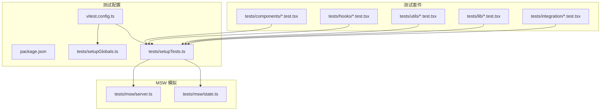
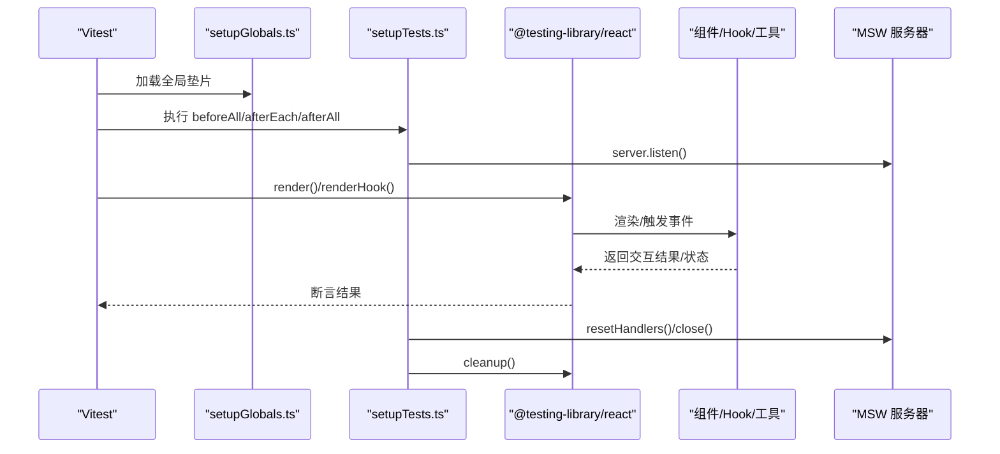
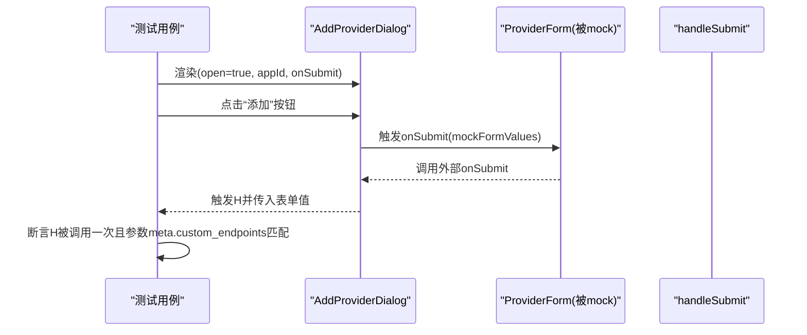
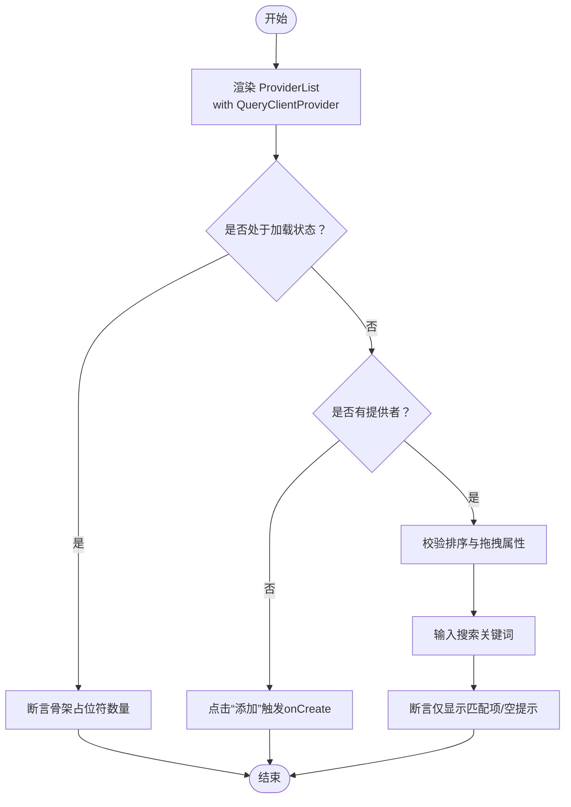
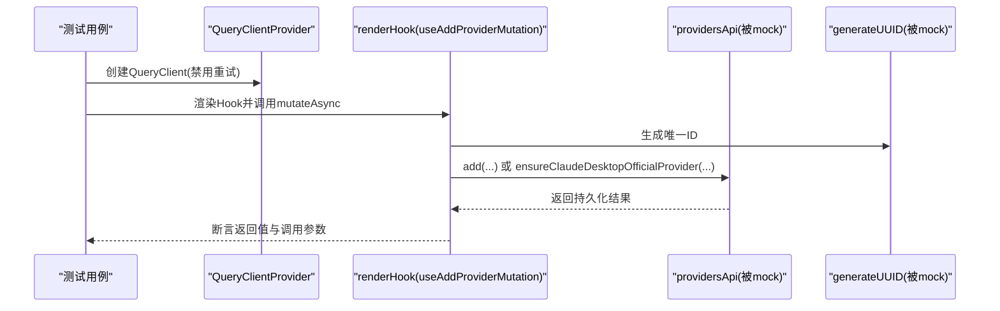
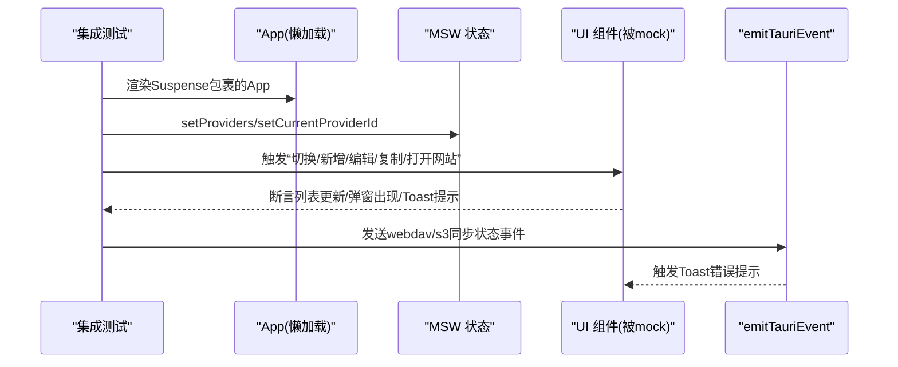
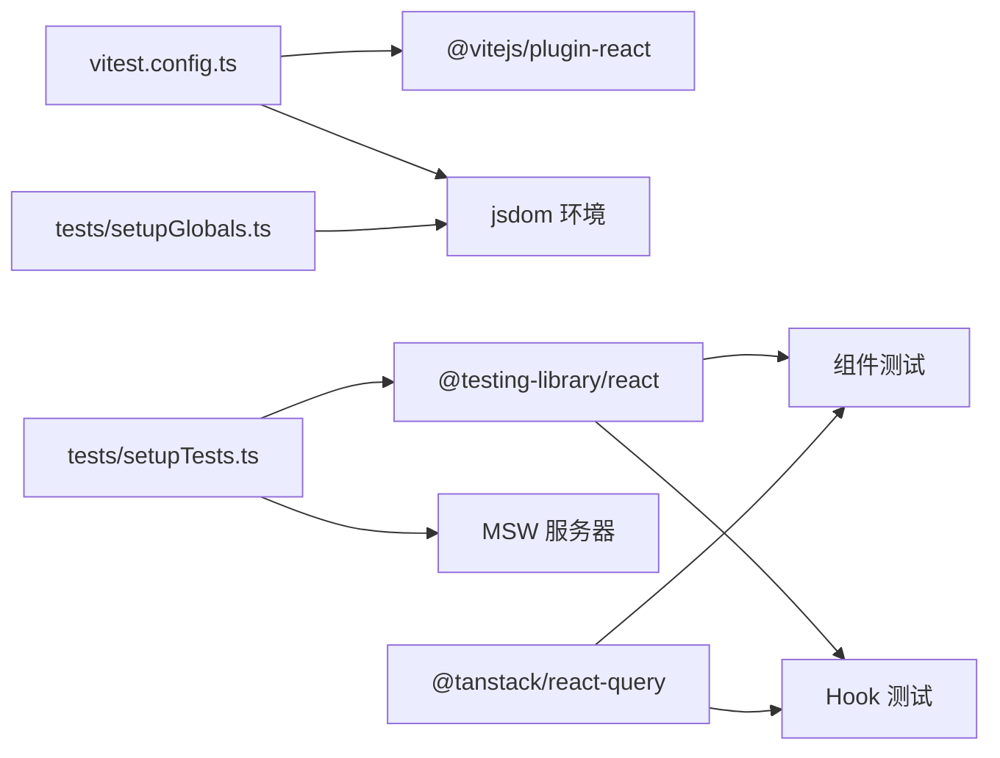

# 前端测试

<cite>
**本文引用的文件**
- [vitest.config.ts](file://vitest.config.ts)
- [package.json](file://package.json)
- [tests/setupTests.ts](file://tests/setupTests.ts)
- [tests/setupGlobals.ts](file://tests/setupGlobals.ts)
- [tests/components/AddProviderDialog.test.tsx](file://tests/components/AddProviderDialog.test.tsx)
- [tests/components/ProviderList.test.tsx](file://tests/components/ProviderList.test.tsx)
- [tests/hooks/useAddProviderMutation.test.tsx](file://tests/hooks/useAddProviderMutation.test.tsx)
- [tests/utils/deepClone.test.ts](file://tests/utils/deepClone.test.ts)
- [tests/utils/testQueryClient.ts](file://tests/utils/testQueryClient.ts)
- [tests/integration/App.test.tsx](file://tests/integration/App.test.tsx)
- [tests/msw/server.ts](file://tests/msw/server.ts)
- [tests/msw/state.ts](file://tests/msw/state.ts)
- [tests/lib/userAgent.test.ts](file://tests/lib/userAgent.test.ts)
- [src/utils/providerConfigUtils.test.ts](file://src/utils/providerConfigUtils.test.ts)
</cite>

## 目录
1. [简介](#简介)
2. [项目结构](#项目结构)
3. [核心组件](#核心组件)
4. [架构总览](#架构总览)
5. [详细组件分析](#详细组件分析)
6. [依赖关系分析](#依赖关系分析)
7. [性能考量](#性能考量)
8. [故障排查指南](#故障排查指南)
9. [结论](#结论)
10. [附录](#附录)

## 简介
本文件面向 CC Switch 项目的前端测试体系，系统性阐述 Vitest 测试框架的配置与使用、测试环境与全局配置、React 组件测试策略、自定义 Hook 测试方法、工具函数测试最佳实践、集成测试设计与实现，以及测试覆盖率与测试数据管理策略。目标是帮助开发者快速理解并高效扩展测试覆盖范围，确保代码质量与可维护性。

## 项目结构
CC Switch 的前端测试主要位于 tests 目录下，采用按“功能域”分层组织：组件测试、Hooks 测试、配置与工具函数测试、MSW 模拟服务、以及端到端集成测试。Vitest 作为核心测试运行器，配合 @testing-library/react 进行 DOM 渲染与交互断言，使用 MSW 提供网络请求模拟，通过 setupGlobals 与 setupTests 提供统一的全局垫片与清理逻辑。

图表来源
- [vitest.config.ts:12-20](file://vitest.config.ts#L12-L20)
- [tests/setupTests.ts:1-35](file://tests/setupTests.ts#L1-L35)
- [tests/setupGlobals.ts:1-36](file://tests/setupGlobals.ts#L1-L36)
- [tests/msw/server.ts:1-5](file://tests/msw/server.ts#L1-L5)
- [tests/msw/state.ts:1-434](file://tests/msw/state.ts#L1-L434)

章节来源
- [vitest.config.ts:1-21](file://vitest.config.ts#L1-L21)
- [package.json:15-16](file://package.json#L15-L16)
- [tests/setupTests.ts:1-35](file://tests/setupTests.ts#L1-L35)
- [tests/setupGlobals.ts:1-36](file://tests/setupGlobals.ts#L1-L36)

## 核心组件
- Vitest 配置与脚本
  - 使用 jsdom 环境，启用全局断言与别名路径，加载 setupGlobals 与 setupTests。
  - 覆盖率输出格式包含文本与 LCOV。
- 全局垫片与清理
  - 为 jsdom/happy-dom 注入 ResizeObserver polyfill，并提供 localStorage 的最小实现。
  - 在每次测试后清理 DOM、重置 MSW 处理器、清理 Mock。
- 国际化与网络模拟
  - 初始化 i18n 并在测试中注入资源；通过 MSW server 拦截网络请求，集中管理状态。

章节来源
- [vitest.config.ts:12-20](file://vitest.config.ts#L12-L20)
- [tests/setupGlobals.ts:1-36](file://tests/setupGlobals.ts#L1-L36)
- [tests/setupTests.ts:10-34](file://tests/setupTests.ts#L10-L34)

## 架构总览
下图展示了测试运行的关键流程：Vitest 启动 -> 加载全局垫片与测试初始化 -> 渲染组件或挂载 Hook -> 触发用户交互或异步操作 -> 断言结果 -> 清理与收尾。

图表来源
- [tests/setupTests.ts:10-34](file://tests/setupTests.ts#L10-L34)
- [tests/msw/server.ts:1-5](file://tests/msw/server.ts#L1-L5)

## 详细组件分析

### 组件测试：AddProviderDialog
- 测试目标
  - 验证对话框在提交表单时正确传递 ProviderForm 返回的自定义端点。
  - 验证缺失自定义端点时回退到配置中的 baseUrl。
- 关键策略
  - 使用 vi.mock 对子组件进行隔离，模拟表单提交行为。
  - 通过 fireEvent 与 waitFor 断言回调调用次数与参数。
- 断言要点
  - 提交后的 meta.custom_endpoints 结构与值符合预期。
  - onOpenChange 被调用以关闭对话框。

图表来源
- [tests/components/AddProviderDialog.test.tsx:62-88](file://tests/components/AddProviderDialog.test.tsx#L62-L88)
- [tests/components/AddProviderDialog.test.tsx:90-127](file://tests/components/AddProviderDialog.test.tsx#L90-L127)

章节来源
- [tests/components/AddProviderDialog.test.tsx:1-129](file://tests/components/AddProviderDialog.test.tsx#L1-L129)

### 组件测试：ProviderList
- 测试目标
  - 骨架屏渲染、空状态与创建回调、排序顺序与拖拽属性、搜索过滤与空提示。
- 关键策略
  - 通过 vi.mock 替换复杂依赖（拖拽、流检查、自动降级队列等），聚焦列表渲染与交互。
  - 使用 QueryClientProvider 包裹，确保查询相关行为一致。
- 断言要点
  - 排序顺序由 useDragSort 返回决定。
  - 搜索输入改变后，仅显示匹配项并出现空提示。
  - 动作按钮点击触发对应回调。

图表来源
- [tests/components/ProviderList.test.tsx:144-308](file://tests/components/ProviderList.test.tsx#L144-L308)

章节来源
- [tests/components/ProviderList.test.tsx:1-310](file://tests/components/ProviderList.test.tsx#L1-L310)

### 自定义 Hook 测试：useAddProviderMutation
- 测试目标
  - 官方预设提供者的去重与生成新 ID；重复实例化时返回持久化种子行。
- 关键策略
  - 使用 hoisted mocks 隔离 API 与 UUID 工具，确保每次测试前重置。
  - 通过 QueryClientProvider 包裹 renderHook，禁用重试保证确定性。
- 断言要点
  - mutateAsync 返回的提供者 ID 与生成策略一致。
  - 当存在官方种子时，直接返回该种子而非新增。

图表来源
- [tests/hooks/useAddProviderMutation.test.tsx:67-135](file://tests/hooks/useAddProviderMutation.test.tsx#L67-L135)

章节来源
- [tests/hooks/useAddProviderMutation.test.tsx:1-137](file://tests/hooks/useAddProviderMutation.test.tsx#L1-L137)

### 工具函数测试：deepClone
- 测试目标
  - 当浏览器不支持 structuredClone 时，回退到自定义深拷贝逻辑。
- 关键策略
  - 使用 vi.stubGlobal 临时移除 structuredClone，验证回退分支。
  - 断言克隆对象与原对象相互独立，时间戳等类型保持语义正确。
- 断言要点
  - 修改克隆对象不影响原对象。
  - 时间对象克隆后值相等但对象不同。

章节来源
- [tests/utils/deepClone.test.ts:1-31](file://tests/utils/deepClone.test.ts#L1-L31)

### 工具函数测试：isValidUserAgentHeader
- 测试目标
  - 严格遵循后端 HeaderValue 字节规则，接受可见 ASCII、非 ASCII、制表符，拒绝换行、NUL、DEL 等控制字符。
- 关键策略
  - 使用边界值与特殊字符构造用例，覆盖空字符串、空白、可见字符、非 ASCII、制表符与多种控制字符。
- 断言要点
  - 空白与可见 ASCII 通过；控制字符与 DEL 拒绝。

章节来源
- [tests/lib/userAgent.test.ts:1-35](file://tests/lib/userAgent.test.ts#L1-L35)

### 工具函数测试：providerConfigUtils（源码）
- 测试目标
  - Codex 远程压缩配置的启用与禁用逻辑，保留内置保留提供者不变。
- 关键策略
  - 以 TOML 片段为输入，验证改写后是否满足期望的启用/禁用状态与保留规则。
- 断言要点
  - 启用时将自定义提供者重命名为 OpenAI；禁用时恢复原名称。
  - 内置保留提供者不被改写。

章节来源
- [src/utils/providerConfigUtils.test.ts:1-53](file://src/utils/providerConfigUtils.test.ts#L1-L53)

### 集成测试：App 与 MSW
- 测试目标
  - 端到端覆盖提供者切换、使用脚本弹窗、新增/编辑/复制提供者、打开网站、后台同步失败提示等场景。
- 关键策略
  - 通过 MSW state 管理多应用提供者集合、当前选中与实时 ID 列表。
  - 使用 emitTauriEvent 模拟真实事件，验证 Toast 提示与 UI 反馈。
- 断言要点
  - 切换应用后列表内容变化；复制提供者生成新 ID 且避免冲突。
  - 同步失败事件触发错误提示；异常兜底不抛出。

图表来源
- [tests/integration/App.test.tsx:159-355](file://tests/integration/App.test.tsx#L159-L355)
- [tests/msw/state.ts:268-324](file://tests/msw/state.ts#L268-L324)

章节来源
- [tests/integration/App.test.tsx:1-356](file://tests/integration/App.test.tsx#L1-L356)

## 依赖关系分析
- 测试运行器与插件
  - Vitest 通过 @vitejs/plugin-react 与路径别名 @ 支持 TSX 与项目结构。
- 测试环境与工具
  - jsdom 环境满足 DOM API；@testing-library/react 提供易用的查询与事件模拟；MSW 提供稳定的服务端行为。
- 查询客户端与状态
  - @tanstack/react-query 在组件与 Hook 测试中广泛使用，测试通过禁用重试保证确定性。
- 全局与清理
  - setupGlobals 与 setupTests 负责垫片与清理，避免跨测试污染。

图表来源
- [vitest.config.ts:5-11](file://vitest.config.ts#L5-L11)
- [tests/setupTests.ts:1-35](file://tests/setupTests.ts#L1-L35)
- [tests/setupGlobals.ts:1-36](file://tests/setupGlobals.ts#L1-L36)

章节来源
- [vitest.config.ts:1-21](file://vitest.config.ts#L1-L21)
- [package.json:21-40](file://package.json#L21-L40)
- [tests/utils/testQueryClient.ts:1-11](file://tests/utils/testQueryClient.ts#L1-L11)

## 性能考量
- 禁用查询重试
  - 在测试中统一禁用查询与变更的重试，减少不确定因素与等待时间。
- Mock 优先
  - 对第三方库、网络与复杂逻辑进行 Mock，降低测试执行时间与外部依赖风险。
- 清理与复位
  - 每个测试结束后清理 DOM、重置 MSW 处理器与 Mock，避免内存泄漏与状态串扰。

章节来源
- [tests/hooks/useAddProviderMutation.test.tsx:43-48](file://tests/hooks/useAddProviderMutation.test.tsx#L43-L48)
- [tests/components/ProviderList.test.tsx:113-121](file://tests/components/ProviderList.test.tsx#L113-L121)
- [tests/setupTests.ts:25-30](file://tests/setupTests.ts#L25-L30)

## 故障排查指南
- 常见问题与定位
  - ResizeObserver 未定义导致组件渲染异常：确认 setupGlobals 已加载。
  - localStorage 访问报错：确认 setupGlobals 中 localStorage polyfill 生效。
  - 国际化文案缺失导致断言失败：确认 setupTests 中 i18n 初始化资源已注入。
  - 网络请求未命中预期处理器：检查 MSW server 是否监听、handlers 是否正确注册、afterEach 是否 reset。
  - 异步断言超时：使用 waitFor 包裹断言，或调整 Mock 响应时间。
- 建议流程
  - 逐步缩小范围：先运行最小可复现用例，再增加断言。
  - 查看覆盖率报告：定位未覆盖路径，补充边界用例。
  - 使用调试日志：在关键节点打印中间状态，结合断言失败信息定位。

章节来源
- [tests/setupGlobals.ts:1-36](file://tests/setupGlobals.ts#L1-L36)
- [tests/setupTests.ts:10-34](file://tests/setupTests.ts#L10-L34)
- [tests/msw/server.ts:1-5](file://tests/msw/server.ts#L1-L5)

## 结论
CC Switch 的前端测试体系以 Vitest 为核心，结合 @testing-library/react、MSW 与统一的全局垫片/清理机制，实现了组件、Hook、工具函数与集成场景的全面覆盖。通过 Mock 与确定性配置，测试具备高稳定性与可维护性；通过 MSW 状态管理，端到端场景得以可控地重现。建议持续完善边界与错误路径用例，保持覆盖率稳定提升。

## 附录

### 测试覆盖率与报告
- 覆盖率输出
  - 文本与 LCOV 格式同时输出，便于本地查看与 CI 报告。
- 建议阈值
  - 行、分支、函数、语句覆盖率建议不低于 80%，关键路径不低于 90%。
- 生成方式
  - 通过 Vitest 命令运行并生成报告，结合 CI 工具进行趋势跟踪。

章节来源
- [vitest.config.ts:16-18](file://vitest.config.ts#L16-L18)
- [package.json:15-16](file://package.json#L15-L16)

### 测试数据管理策略
- MSW 状态
  - 通过 tests/msw/state.ts 统一管理各应用提供者、当前选中、实时 ID、会话与 MCP 配置等，支持 reset 与更新。
- 测试夹具
  - 在集成测试中通过 setProviders/setCurrentProviderId 等 API 注入初始数据，确保测试可重复。
- 查询客户端
  - 使用 tests/utils/testQueryClient.ts 创建禁用重试的 QueryClient，避免异步不确定性。

章节来源
- [tests/msw/state.ts:19-85](file://tests/msw/state.ts#L19-L85)
- [tests/msw/state.ts:268-324](file://tests/msw/state.ts#L268-L324)
- [tests/utils/testQueryClient.ts:1-11](file://tests/utils/testQueryClient.ts#L1-L11)