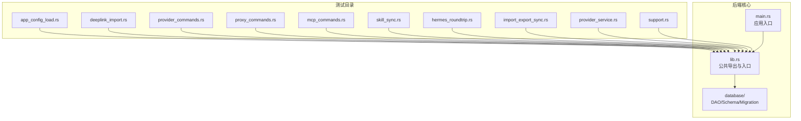
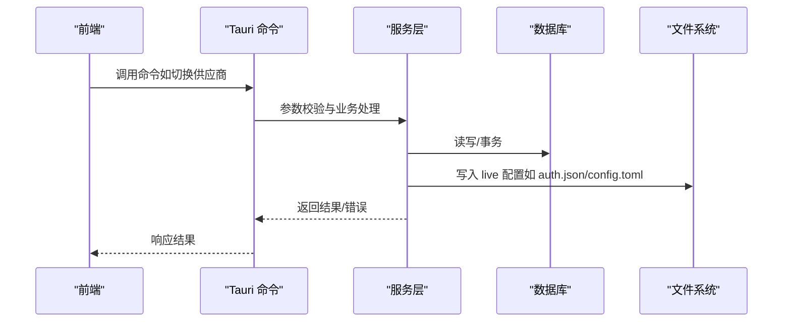
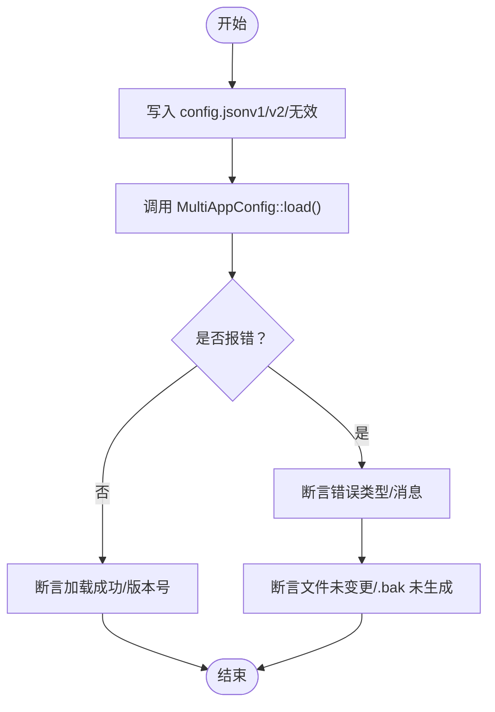
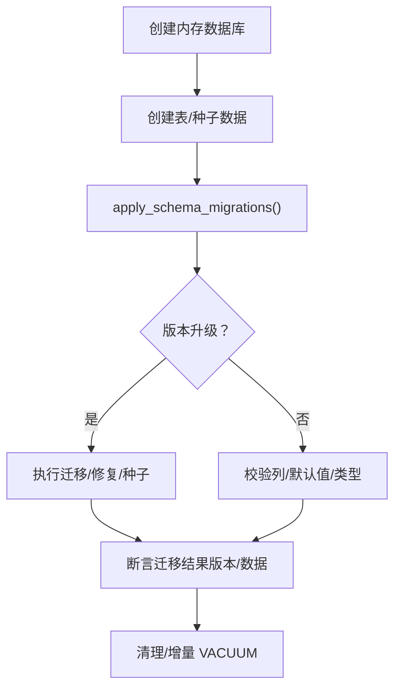
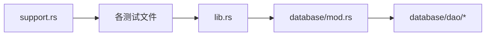

# 后端测试

<cite>
**本文引用的文件**
- [Cargo.toml](file://src-tauri/Cargo.toml)
- [lib.rs](file://src-tauri/src/lib.rs)
- [main.rs](file://src-tauri/src/main.rs)
- [support.rs](file://src-tauri/tests/support.rs)
- [app_config_load.rs](file://src-tauri/tests/app_config_load.rs)
- [deeplink_import.rs](file://src-tauri/tests/deeplink_import.rs)
- [provider_commands.rs](file://src-tauri/tests/provider_commands.rs)
- [proxy_commands.rs](file://src-tauri/tests/proxy_commands.rs)
- [mcp_commands.rs](file://src-tauri/tests/mcp_commands.rs)
- [skill_sync.rs](file://src-tauri/tests/skill_sync.rs)
- [hermes_roundtrip.rs](file://src-tauri/tests/hermes_roundtrip.rs)
- [import_export_sync.rs](file://src-tauri/tests/import_export_sync.rs)
- [provider_service.rs](file://src-tauri/tests/provider_service.rs)
- [tests.rs](file://src-tauri/src/database/tests.rs)
- [mod.rs](file://src-tauri/src/database/mod.rs)
- [mod.rs](file://src-tauri/src/database/dao/mod.rs)
</cite>

## 目录
1. [简介](#简介)
2. [项目结构](#项目结构)
3. [核心组件](#核心组件)
4. [架构总览](#架构总览)
5. [详细组件分析](#详细组件分析)
6. [依赖关系分析](#依赖关系分析)
7. [性能考虑](#性能考虑)
8. [故障排查指南](#故障排查指南)
9. [结论](#结论)
10. [附录](#附录)

## 简介
本文件面向 CC Switch 项目的 Rust 后端测试，系统性阐述测试策略与最佳实践，涵盖：
- Rust 测试框架与测试组织方式
- Tauri 命令系统的测试策略（命令调用与返回值验证）
- 数据库操作测试（Schema 迁移、DAO 层、事务处理）
- 服务层测试（业务逻辑与错误处理）
- 异步与并发测试
- 性能与内存泄漏检测建议

## 项目结构
Rust 后端测试主要集中在 src-tauri/tests 目录，采用按功能域分组的组织方式：
- app_config_load.rs：配置加载与迁移错误场景
- deeplink_import.rs：深链导入与持久化验证
- provider_commands.rs：供应商导入/切换命令测试
- proxy_commands.rs：代理计费参数命令测试（异步）
- mcp_commands.rs：MCP 服务器导入/同步测试
- skill_sync.rs：技能导入/同步/卸载/备份测试
- hermes_roundtrip.rs：Hermes 配置读写透传测试
- import_export_sync.rs：配置导入导出与同步测试
- provider_service.rs：服务层业务逻辑测试（异步/并发）

此外，数据库模块在 src-tauri/src/database 下提供 DAO 层与 Schema 迁移，配套在 src-tauri/src/database/tests.rs 中进行数据库层测试。

图表来源
- [lib.rs:1-800](file://src-tauri/src/lib.rs#L1-L800)
- [main.rs:1-23](file://src-tauri/src/main.rs#L1-L23)
- [support.rs:1-84](file://src-tauri/tests/support.rs#L1-L84)

章节来源
- [Cargo.toml:1-110](file://src-tauri/Cargo.toml#L1-L110)
- [lib.rs:1-800](file://src-tauri/src/lib.rs#L1-L800)
- [main.rs:1-23](file://src-tauri/src/main.rs#L1-L23)

## 核心组件
- 测试支持工具（support.rs）
  - 隔离测试 HOME 目录，避免污染真实用户数据
  - 提供全局互斥锁，避免并发写入冲突
  - 创建内存/磁盘数据库实例，支持迁移测试
- 数据库模块（database/mod.rs）
  - Database 封装 rusqlite 连接，提供 init/memory、Schema 迁移、自动清理与定价数据种子
  - DAO 层按领域划分（providers/mcp/prompts/skills/settings 等）
- 命令与服务（lib.rs）
  - Tauri 命令导出，供前端调用
  - ProviderService、McpService、SkillService 等服务层逻辑

章节来源
- [support.rs:1-84](file://src-tauri/tests/support.rs#L1-L84)
- [mod.rs:1-273](file://src-tauri/src/database/mod.rs#L1-L273)
- [mod.rs:1-20](file://src-tauri/src/database/dao/mod.rs#L1-L20)
- [lib.rs:1-800](file://src-tauri/src/lib.rs#L1-L800)

## 架构总览
Rust 后端测试围绕以下层次展开：
- 单元测试：针对函数/模块内部逻辑（如数据库迁移、配置解析）
- 集成测试：跨模块协作（如 ProviderService 切换、MCP 同步）
- 端到端测试：通过命令/服务接口验证业务闭环（如深链导入、配置同步）

图表来源
- [lib.rs:1-800](file://src-tauri/src/lib.rs#L1-L800)
- [provider_service.rs:1-800](file://src-tauri/tests/provider_service.rs#L1-L800)
- [import_export_sync.rs:1-800](file://src-tauri/tests/import_export_sync.rs#L1-L800)

## 详细组件分析

### 测试框架与组织
- 使用标准库测试入口与 #[test]/#[tokio::test] 标注
- 通过 support.rs 提供测试夹具（隔离 HOME、互斥锁、数据库实例）
- 采用按功能域分文件的组织方式，便于维护与定位

章节来源
- [Cargo.toml:107-110](file://src-tauri/Cargo.toml#L107-L110)
- [support.rs:1-84](file://src-tauri/tests/support.rs#L1-L84)

### 配置加载与迁移测试（app_config_load.rs）
- 场景覆盖：v1 配置拒绝迁移、畸形 JSON 解析失败、有效 v2 成功加载
- 断言要点：错误类型与消息、文件不变性、不生成 .bak
- 适配策略：通过 ensure_test_home 与 reset_test_fs 隔离测试环境

图表来源
- [app_config_load.rs:1-108](file://src-tauri/tests/app_config_load.rs#L1-L108)

章节来源
- [app_config_load.rs:1-108](file://src-tauri/tests/app_config_load.rs#L1-L108)

### 深链导入测试（deeplink_import.rs）
- 场景覆盖：Claude/Codex 深链导入，验证数据库持久化与字段一致性
- 断言要点：Provider 名称、URL、图标、认证与配置字段均正确落库

章节来源
- [deeplink_import.rs:1-87](file://src-tauri/tests/deeplink_import.rs#L1-L87)

### 供应商命令测试（provider_commands.rs）
- 场景覆盖：首次启动导入、Codex OAuth 行为、切换前后 live 与数据库一致性、缺失供应商错误
- 关键点：enable_codex_official_auth_preservation 开关对 Codex 切换的影响；回填机制保护 live 配置

章节来源
- [provider_commands.rs:1-591](file://src-tauri/tests/provider_commands.rs#L1-L591)

### 代理命令测试（proxy_commands.rs）
- 场景覆盖：默认成本倍数与定价来源的读写与错误处理（异步）
- 关键点：使用 test_mutex 串行化跨 await 持锁，避免竞态

章节来源
- [proxy_commands.rs:1-79](file://src-tauri/tests/proxy_commands.rs#L1-L79)

### MCP 命令测试（mcp_commands.rs）
- 场景覆盖：从 Claude/Codex/Gemini 导入、启用/禁用、同步至 live 配置、无效 JSON 保护
- 关键点：toggle_app/upsert_server/sync_all_enabled 的幂等与一致性；对缺失目录的跳过策略

章节来源
- [mcp_commands.rs:1-770](file://src-tauri/tests/mcp_commands.rs#L1-L770)

### 技能同步测试（skill_sync.rs）
- 场景覆盖：从应用导入、按应用选择、同步到应用、卸载备份与恢复、孤儿符号链接清理
- 关键点：SSOT 与应用目录的双向一致性；备份元数据完整性

章节来源
- [skill_sync.rs:1-428](file://src-tauri/tests/skill_sync.rs#L1-L428)

### Hermes 配置透传测试（hermes_roundtrip.rs）
- 场景覆盖：未知/未来字段透传、rate_limit_delay/key_env 等新增字段保留
- 关键点：写回时保留未知字段，避免 UI 不感知导致的数据丢失

章节来源
- [hermes_roundtrip.rs:1-125](file://src-tauri/tests/hermes_roundtrip.rs#L1-L125)

### 导入/导出与同步测试（import_export_sync.rs）
- 场景覆盖：Claude/Codex live 配置写入、MCP 同步、原子写入回滚、错误路径保护
- 关键点：write_codex_live_atomic 的原子性与回滚；迁移路径对 model_provider 的保留

章节来源
- [import_export_sync.rs:1-800](file://src-tauri/tests/import_export_sync.rs#L1-L800)

### 服务层测试（provider_service.rs）
- 场景覆盖：通用配置迁移、Codex 切换行为（OAuth 保留/第三方覆盖）、代理接管与恢复、默认行为对比
- 关键点：异步测试使用 current_thread 运行时；takeover 期间备份与恢复

章节来源
- [provider_service.rs:1-800](file://src-tauri/tests/provider_service.rs#L1-L800)

### 数据库层测试（database/tests.rs）
- 场景覆盖：Schema 迁移（含未来版本拒绝）、列默认值与类型对齐、v3.8→当前迁移链路、dry-run 校验、定价数据种子
- 关键点：内存数据库 + PRAGMA 外键；增量 VACUUM 与自动清理；rollup 重构与兼容性

图表来源
- [tests.rs:1-800](file://src-tauri/src/database/tests.rs#L1-L800)
- [mod.rs:92-160](file://src-tauri/src/database/mod.rs#L92-L160)

章节来源
- [tests.rs:1-800](file://src-tauri/src/database/tests.rs#L1-L800)
- [mod.rs:1-273](file://src-tauri/src/database/mod.rs#L1-L273)

## 依赖关系分析
- 测试对支持模块的依赖：所有测试均依赖 support.rs 提供的隔离与夹具
- 服务层对数据库的依赖：ProviderService/McpService/SkillService 等通过 Database 实例进行读写
- 命令层对服务层的依赖：lib.rs 中 #[tauri::command] 导出的命令最终委托服务层处理

图表来源
- [support.rs:1-84](file://src-tauri/tests/support.rs#L1-L84)
- [lib.rs:1-800](file://src-tauri/src/lib.rs#L1-L800)
- [mod.rs:1-273](file://src-tauri/src/database/mod.rs#L1-L273)
- [mod.rs:1-20](file://src-tauri/src/database/dao/mod.rs#L1-L20)

章节来源
- [support.rs:1-84](file://src-tauri/tests/support.rs#L1-L84)
- [lib.rs:1-800](file://src-tauri/src/lib.rs#L1-L800)
- [mod.rs:1-273](file://src-tauri/src/database/mod.rs#L1-L273)
- [mod.rs:1-20](file://src-tauri/src/database/dao/mod.rs#L1-L20)

## 性能考虑
- 测试并发控制：通过 test_mutex 串行化跨 await 的持锁，避免竞态与文件系统冲突
- 内存数据库优先：数据库层测试使用内存数据库，减少 I/O 开销
- 增量清理：数据库初始化后执行增量 VACUUM 与 rollup 清理，降低运行期压力
- 异步测试：使用 current_thread 运行时减少上下文切换开销

章节来源
- [support.rs:62-66](file://src-tauri/tests/support.rs#L62-L66)
- [tests.rs:614-635](file://src-tauri/src/database/tests.rs#L614-L635)
- [mod.rs:144-157](file://src-tauri/src/database/mod.rs#L144-L157)

## 故障排查指南
- 配置加载失败
  - 现象：v1 配置拒绝迁移，错误消息包含本地化键
  - 排查：确认 config.json 形状与版本字段；断言文件未被修改
- MCP 同步失败
  - 现象：导入/同步时报错，数据库未写入
  - 排查：检查 live 配置目录是否存在；验证 JSON/TOML 格式；确认应用启用位
- Codex 切换异常
  - 现象：auth.json 未按预期保留或覆盖
  - 排查：核对 enable_codex_official_auth_preservation 开关；确认 OAuth 与第三方 Provider 的差异行为
- 数据库迁移失败
  - 现象：未来版本拒绝或迁移链路中断
  - 排查：检查 user_version 与迁移顺序；使用 dry-run 验证迁移路径

章节来源
- [app_config_load.rs:14-38](file://src-tauri/tests/app_config_load.rs#L14-L38)
- [mcp_commands.rs:258-287](file://src-tauri/tests/mcp_commands.rs#L258-L287)
- [provider_service.rs:526-691](file://src-tauri/tests/provider_service.rs#L526-L691)
- [tests.rs:172-184](file://src-tauri/src/database/tests.rs#L172-L184)

## 结论
本项目的 Rust 后端测试体系完善，覆盖命令层、服务层与数据库层，采用隔离夹具与严格的断言策略，确保业务闭环的正确性与鲁棒性。建议持续补充性能基准测试与内存泄漏检测脚本，进一步提升测试深度。

## 附录
- 测试运行建议
  - 使用 cargo test --lib 或按模块运行特定测试文件
  - 对异步测试使用 --flavor current_thread
  - 在 CI 中增加 --release 与 --locked 以模拟生产环境