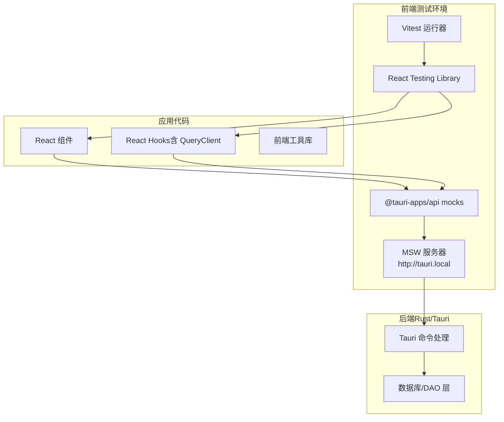
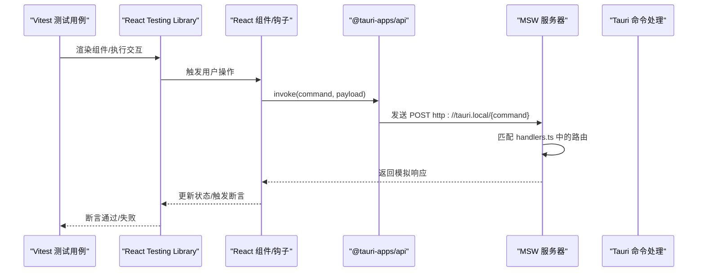
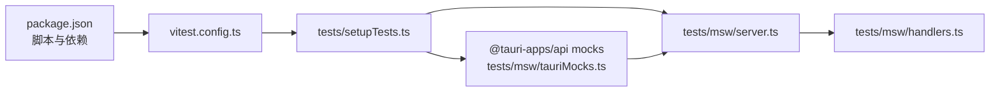

# 测试策略

<cite>
**本文引用的文件**
- [package.json](file://package.json)
- [vite.config.ts](file://vite.config.ts)
- [vitest.config.ts](file://vitest.config.ts)
- [Cargo.toml](file://src-tauri/Cargo.toml)
- [tests/setupGlobals.ts](file://tests/setupGlobals.ts)
- [tests/setupTests.ts](file://tests/setupTests.ts)
- [tests/msw/server.ts](file://tests/msw/server.ts)
- [tests/msw/handlers.ts](file://tests/msw/handlers.ts)
- [tests/msw/tauriMocks.ts](file://tests/msw/tauriMocks.ts)
- [tests/components/AddProviderDialog.test.tsx](file://tests/components/AddProviderDialog.test.tsx)
- [tests/hooks/useAddProviderMutation.test.tsx](file://tests/hooks/useAddProviderMutation.test.tsx)
- [tests/lib/userAgent.test.ts](file://tests/lib/userAgent.test.ts)
- [src/lib/version.test.ts](file://src/lib/version.test.ts)
- [src/utils/providerConfigUtils.test.ts](file://src/utils/providerConfigUtils.test.ts)
</cite>

## 目录
1. [引言](#引言)
2. [项目结构](#项目结构)
3. [核心组件](#核心组件)
4. [架构总览](#架构总览)
5. [详细组件分析](#详细组件分析)
6. [依赖关系分析](#依赖关系分析)
7. [性能考虑](#性能考虑)
8. [故障排查指南](#故障排查指南)
9. [结论](#结论)
10. [附录](#附录)

## 引言
本测试策略文档面向 CC Switch 项目，系统化阐述测试金字塔的实施：单元测试、集成测试与端到端测试的分层策略；前端测试框架（Vitest + React Testing Library）的配置与使用；Rust 后端测试（Tauri 命令与业务模块）的组织方式；Mock 服务（MSW）在测试中的应用（API 模拟与数据模拟）；测试用例设计最佳实践（覆盖率、测试数据管理）；以及持续集成中的测试自动化流程建议。文档同时给出性能测试与安全测试的实施思路，帮助团队建立稳定、可维护且高覆盖率的测试体系。

## 项目结构
CC Switch 采用前后端分离的双栈架构：
- 前端基于 Vite + React + Vitest + React Testing Library，测试通过 Vitest 驱动，使用 MSW 在 Node 环境拦截与模拟 Tauri 命令调用。
- 后端基于 Tauri + Rust，命令通过 @tauri-apps/api/core.invoke 触发，MSW 在测试中以 http://tauri.local 代理这些命令，实现“端到端”式测试体验。

图表来源
- [vitest.config.ts:12-20](file://vitest.config.ts#L12-L20)
- [tests/setupTests.ts:6-8](file://tests/setupTests.ts#L6-L8)
- [tests/msw/tauriMocks.ts:7-30](file://tests/msw/tauriMocks.ts#L7-L30)
- [tests/msw/server.ts:1-5](file://tests/msw/server.ts#L1-L5)
- [tests/msw/handlers.ts:42-383](file://tests/msw/handlers.ts#L42-L383)

章节来源
- [package.json:15-16](file://package.json#L15-L16)
- [vite.config.ts:1-33](file://vite.config.ts#L1-L33)
- [vitest.config.ts:1-21](file://vitest.config.ts#L1-L21)
- [Cargo.toml:1-110](file://src-tauri/Cargo.toml#L1-L110)

## 核心组件
- 测试运行器与环境
  - Vitest：全局启用、JS DOM 环境、setupFiles、覆盖率输出。
  - React Testing Library：断言与交互模拟。
- Mock 服务（MSW）
  - Node 端服务器，拦截 http://tauri.local 下的命令请求，统一返回模拟数据。
  - @tauri-apps/api 的 invoke 与事件监听被 vi.mock 替换，转发至 MSW。
- 前端测试配置
  - setupGlobals.ts：为 jsdom 注入 ResizeObserver 与 localStorage polyfill。
  - setupTests.ts：初始化 i18n、启动/重置 MSW、清理测试状态与 mocks。

章节来源
- [vitest.config.ts:12-20](file://vitest.config.ts#L12-L20)
- [tests/setupGlobals.ts:1-36](file://tests/setupGlobals.ts#L1-L36)
- [tests/setupTests.ts:1-35](file://tests/setupTests.ts#L1-L35)
- [tests/msw/server.ts:1-5](file://tests/msw/server.ts#L1-L5)
- [tests/msw/tauriMocks.ts:1-66](file://tests/msw/tauriMocks.ts#L1-L66)

## 架构总览
下图展示从前端组件/钩子到 MSW、再到 Tauri 命令处理的整体调用链路，体现测试金字塔中“端到端”测试如何在前端环境中复用后端逻辑。

图表来源
- [tests/msw/tauriMocks.ts:7-30](file://tests/msw/tauriMocks.ts#L7-L30)
- [tests/msw/server.ts:1-5](file://tests/msw/server.ts#L1-L5)
- [tests/msw/handlers.ts:42-383](file://tests/msw/handlers.ts#L42-L383)

## 详细组件分析

### 前端测试框架与配置（Vitest + React Testing Library）
- 运行与环境
  - 全局启用、JS DOM 环境、setupFiles 引入 i18n 与 MSW 初始化。
  - 覆盖率输出格式包含文本与 LCOV。
- 全局补丁
  - 注入 ResizeObserver 与 localStorage polyfill，确保第三方组件与状态持久化正常工作。
- 测试生命周期
  - beforeAll：启动 MSW，初始化 i18n。
  - afterEach：清理 DOM、重置 MSW 未处理请求、重置 Mock 状态。
  - afterAll：关闭 MSW。

章节来源
- [vitest.config.ts:12-20](file://vitest.config.ts#L12-L20)
- [tests/setupGlobals.ts:1-36](file://tests/setupGlobals.ts#L1-L36)
- [tests/setupTests.ts:10-34](file://tests/setupTests.ts#L10-L34)

### Mock 服务（MSW）与 Tauri 命令模拟
- MSW 服务器
  - 在 Node 环境启动，注册 handlers.ts 中的全部命令路由。
  - 支持 Provider、Session、MCP、Settings、Proxy、Failover、Circuit Breaker 等多类命令。
- Tauri 命令模拟
  - vi.mock @tauri-apps/api/core 的 invoke，将命令转发到 http://tauri.local/{command}。
  - vi.mock @tauri-apps/api/event 的 listen，提供事件派发能力（emitTauriEvent）。
  - vi.mock @tauri-apps/api/path，提供路径拼接与 homeDir 的模拟实现。
- 状态与数据
  - handlers.ts 内部通过 state 模块维护内存状态（如 providers、settings、sessions），便于测试间隔离与复用。

章节来源
- [tests/msw/server.ts:1-5](file://tests/msw/server.ts#L1-L5)
- [tests/msw/handlers.ts:42-383](file://tests/msw/handlers.ts#L42-L383)
- [tests/msw/tauriMocks.ts:7-66](file://tests/msw/tauriMocks.ts#L7-L66)

### 单元测试（Unit Tests）
- 前端纯函数与工具
  - userAgent 校验：覆盖空/空白、可见 ASCII、非 ASCII、制表符、控制字符等边界。
  - 版本比较与更新判断：语义化版本比较、预发布版本优先级、相等与缺失场景。
  - TOML 配置工具：Codex 远程压缩开关的启用/禁用与保留内置提供者。
- 测试要点
  - 边界值驱动：构造 NUL/DEL 等控制字符，验证严格规则。
  - 语义化版本：多组预发布段对比，确保排序与判断正确。
  - 配置改写：保留非内置提供者名称，仅改写显示名以满足特定功能开关。

章节来源
- [tests/lib/userAgent.test.ts:1-35](file://tests/lib/userAgent.test.ts#L1-L35)
- [src/lib/version.test.ts:1-50](file://src/lib/version.test.ts#L1-L50)
- [src/utils/providerConfigUtils.test.ts:1-53](file://src/utils/providerConfigUtils.test.ts#L1-L53)

### 集成测试（Integration Tests）
- 组件集成
  - AddProviderDialog：校验自定义端点透传与回退逻辑，模拟 ProviderForm 提交行为。
- 钩子集成
  - useAddProviderMutation：模拟 providersApi、sessionsApi、settingsApi 与 UUID 工具，验证官方预设去重与持久化逻辑。
- 测试要点
  - 使用 QueryClientProvider 包裹，禁用重试以保证确定性。
  - 通过 hoisted mocks 与 reset，确保每次用例独立。

章节来源
- [tests/components/AddProviderDialog.test.tsx:1-129](file://tests/components/AddProviderDialog.test.tsx#L1-L129)
- [tests/hooks/useAddProviderMutation.test.tsx:1-137](file://tests/hooks/useAddProviderMutation.test.tsx#L1-L137)

### 端到端测试（E2E）
- E2E 范畴
  - 由于前端测试已通过 MSW 完整拦截命令并返回真实数据结构，前端测试天然具备“端到端”特性：从组件/钩子到后端命令处理的完整链路。
- 实施建议
  - 对关键业务流（新增/编辑 Provider、切换 Provider、导入导出设置、代理与熔断器配置）编写 E2E 场景，结合 MSW 的状态管理与事件派发，模拟真实用户路径。
  - 将 E2E 用例拆分为“无头模式”与“可视化模式”，前者用于 CI，后者用于回归验证。

章节来源
- [tests/msw/handlers.ts:42-383](file://tests/msw/handlers.ts#L42-L383)
- [tests/msw/tauriMocks.ts:7-66](file://tests/msw/tauriMocks.ts#L7-L66)

### Rust 后端测试（Tauri 命令与业务模块）
- 测试组织
  - 命令与服务位于 src-tauri/src/commands 与 src-tauri/src/services，建议在对应模块下新增 tests 子目录或使用 Cargo.toml 中的 features（如 test-hooks）组织测试入口。
- 测试类型
  - 单元测试：针对纯函数、工具模块与数据结构转换。
  - 集成测试：命令处理与数据库/网络交互的组合测试。
- 最佳实践
  - 使用临时数据库与隔离目录，避免跨用例污染。
  - 对外部 HTTP 请求进行 mock 或使用本地回环接口。
  - 对并发与异步逻辑使用 tokio 测试运行器，确保调度可控。

章节来源
- [Cargo.toml:107-110](file://src-tauri/Cargo.toml#L107-L110)

## 依赖关系分析
- 前端测试依赖
  - Vitest 与 React Testing Library 提供断言与渲染。
  - MSW 在 Node 环境拦截命令，@tauri-apps/api 的 mocks 将命令转发至 MSW。
  - setupTests.ts 负责生命周期管理与状态重置。
- 后端依赖
  - Tauri 命令通过 @tauri-apps/api/core.invoke 触发，MSW 以 http://tauri.local 作为统一入口。
  - 数据一致性由 handlers.ts 内部状态与返回值保障。

图表来源
- [package.json:6-16](file://package.json#L6-L16)
- [vitest.config.ts:12-20](file://vitest.config.ts#L12-L20)
- [tests/setupTests.ts:6-8](file://tests/setupTests.ts#L6-L8)
- [tests/msw/server.ts:1-5](file://tests/msw/server.ts#L1-L5)
- [tests/msw/tauriMocks.ts:7-30](file://tests/msw/tauriMocks.ts#L7-L30)

章节来源
- [package.json:1-96](file://package.json#L1-L96)
- [vitest.config.ts:1-21](file://vitest.config.ts#L1-L21)
- [tests/setupTests.ts:1-35](file://tests/setupTests.ts#L1-L35)
- [tests/msw/server.ts:1-5](file://tests/msw/server.ts#L1-L5)
- [tests/msw/tauriMocks.ts:1-66](file://tests/msw/tauriMocks.ts#L1-L66)

## 性能考虑
- 单测性能
  - 使用 hoisted mocks 与最小化依赖注入，避免重复初始化。
  - 禁用查询重试与缓存，减少异步抖动。
- 集成/端到端性能
  - MSW 使用内存状态，避免磁盘 IO；对大体量数据场景，考虑分页或虚拟化。
  - 在 CI 中优先运行单测与小规模集成用例，E2E 用例在 PR 合并后夜间执行。
- 后端性能
  - 对数据库与网络请求进行 mock；对耗时操作使用 tokio::time::sleep 替代真实等待。
  - 使用轻量日志与条件编译特征（如 test-hooks）隔离测试开销。

## 故障排查指南
- 常见问题
  - ResizeObserver 未定义：确认 setupGlobals.ts 已加载。
  - localStorage 访问异常：检查 polyfill 注入是否生效。
  - MSW 未拦截：核对 @tauri-apps/api mocks 是否正确替换 invoke，并确保 http://tauri.local 路由存在。
  - 事件监听无效：确认 setupTests.ts 中 server.listen 与 afterAll 关闭。
- 排查步骤
  - 在 afterEach 中添加 console.log 输出，定位未清理的定时器或订阅。
  - 对复杂交互使用 waitFor 与调试断点，逐步缩小范围。
  - 对后端命令，打印请求体与响应体，核对 handlers.ts 的匹配逻辑。

章节来源
- [tests/setupGlobals.ts:1-36](file://tests/setupGlobals.ts#L1-L36)
- [tests/setupTests.ts:25-34](file://tests/setupTests.ts#L25-L34)
- [tests/msw/tauriMocks.ts:7-30](file://tests/msw/tauriMocks.ts#L7-L30)

## 结论
CC Switch 的测试体系以 Vitest 为核心，结合 MSW 在前端环境完成“端到端”测试体验，有效复用后端命令处理逻辑。通过清晰的测试金字塔分层、完善的 Mock 机制与严格的生命周期管理，项目能够在保证质量的同时提升开发效率。建议在 CI 中引入覆盖率阈值与慢用例告警，持续优化测试执行时间与稳定性。

## 附录
- 覆盖率与报告
  - 覆盖率输出格式包含文本与 LCOV，可在 CI 中上传至覆盖率平台。
- 脚本与命令
  - 单元测试：通过脚本运行 Vitest 并生成报告。
- 持续集成建议
  - 分阶段执行：单测（快速反馈）→ 集成测试（中速）→ 端到端测试（夜间）。
  - 并行化：按目录或功能模块拆分任务，缩短总时长。
- 安全测试
  - 输入校验：对用户输入与外部配置进行严格校验（参考 userAgent 校验）。
  - 权限与路径：对文件系统访问与路径拼接进行模拟与边界测试。

章节来源
- [vitest.config.ts:16-18](file://vitest.config.ts#L16-L18)
- [package.json:15-16](file://package.json#L15-L16)