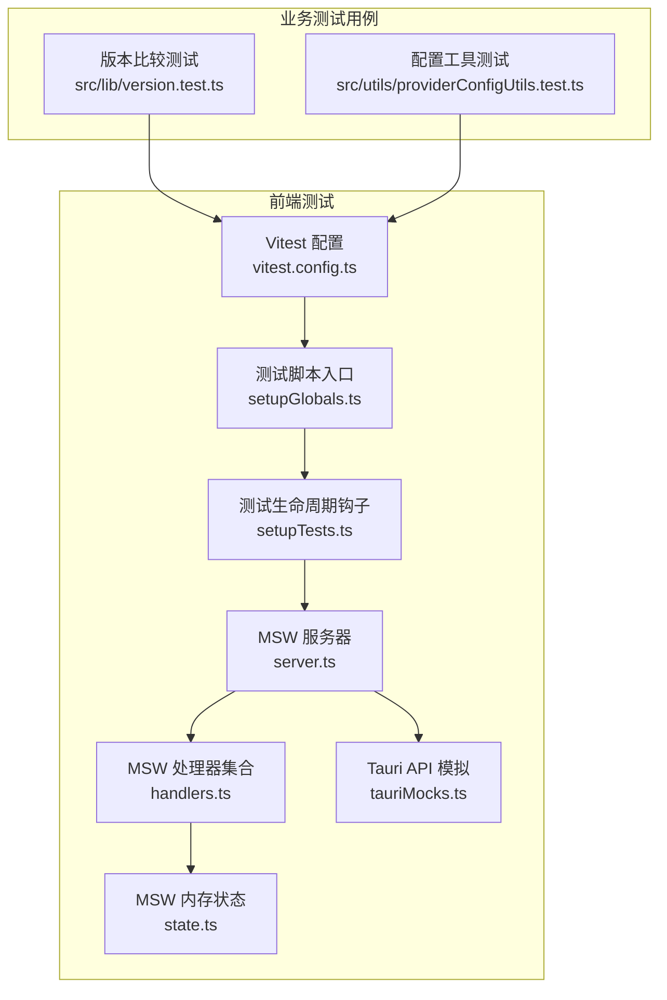
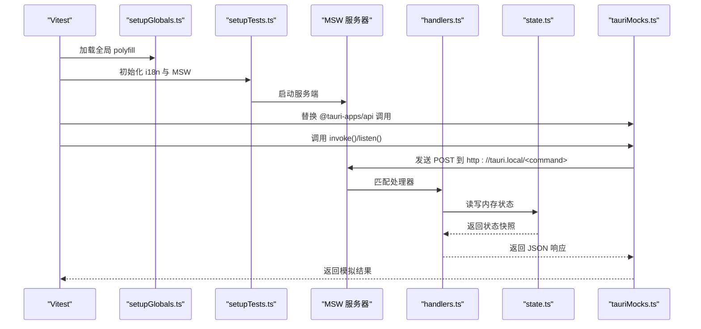
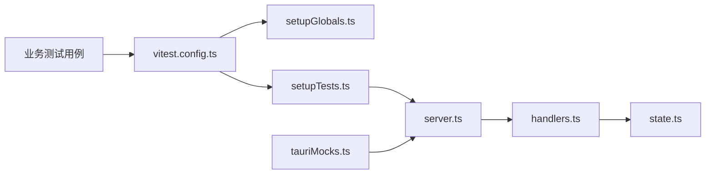

# 测试自动化

<cite>
**本文引用的文件**   
- [package.json](file://package.json)
- [vitest.config.ts](file://vitest.config.ts)
- [tests/setupGlobals.ts](file://tests/setupGlobals.ts)
- [tests/setupTests.ts](file://tests/setupTests.ts)
- [tests/msw/server.ts](file://tests/msw/server.ts)
- [tests/msw/handlers.ts](file://tests/msw/handlers.ts)
- [tests/msw/state.ts](file://tests/msw/state.ts)
- [tests/msw/tauriMocks.ts](file://tests/msw/tauriMocks.ts)
- [src/lib/version.test.ts](file://src/lib/version.test.ts)
- [src/utils/providerConfigUtils.test.ts](file://src/utils/providerConfigUtils.test.ts)
- [README_ZH.md](file://README_ZH.md)
</cite>

## 目录
1. [简介](#简介)
2. [项目结构](#项目结构)
3. [核心组件](#核心组件)
4. [架构总览](#架构总览)
5. [详细组件分析](#详细组件分析)
6. [依赖关系分析](#依赖关系分析)
7. [性能考量](#性能考量)
8. [故障排查指南](#故障排查指南)
9. [结论](#结论)
10. [附录](#附录)

## 简介
本文件面向 CC Switch 项目的测试自动化，系统性阐述单元测试与模拟环境的配置与执行策略，覆盖以下主题：
- 测试框架与运行脚本：基于 Vitest 的单元测试与监听模式
- 测试环境自动化：JS DOM 环境、全局 polyfill、i18n 初始化、MSW 服务端与 Tauri API 模拟
- 测试数据准备：MSW 状态管理与会话/配置/fixtures 的默认值
- 测试报告生成与覆盖率：文本与 LCOV 报告器
- 并行执行与优化：Vitest 默认并发策略与建议
- 失败通知与问题追踪：结合 CI 的通用实践
- 本地开发测试自动化：脚本、命令与最佳实践

## 项目结构
本项目采用“前端 React/Vite + Tauri 后端”的双层架构，测试体系围绕前端单元测试展开，并通过 MSW 模拟 Tauri 前端调用，实现无需真实后端即可完成端到端测试。

图表来源
- [vitest.config.ts:12-20](file://vitest.config.ts#L12-L20)
- [tests/setupGlobals.ts:1-36](file://tests/setupGlobals.ts#L1-L36)
- [tests/setupTests.ts:10-34](file://tests/setupTests.ts#L10-L34)
- [tests/msw/server.ts:1-5](file://tests/msw/server.ts#L1-L5)
- [tests/msw/handlers.ts:42-383](file://tests/msw/handlers.ts#L42-L383)
- [tests/msw/state.ts:19-75](file://tests/msw/state.ts#L19-L75)
- [tests/msw/tauriMocks.ts:7-65](file://tests/msw/tauriMocks.ts#L7-L65)
- [src/lib/version.test.ts:1-50](file://src/lib/version.test.ts#L1-L50)
- [src/utils/providerConfigUtils.test.ts:1-53](file://src/utils/providerConfigUtils.test.ts#L1-L53)

章节来源
- [package.json:6-16](file://package.json#L6-L16)
- [vitest.config.ts:12-20](file://vitest.config.ts#L12-L20)
- [tests/setupGlobals.ts:1-36](file://tests/setupGlobals.ts#L1-L36)
- [tests/setupTests.ts:10-34](file://tests/setupTests.ts#L10-L34)
- [tests/msw/server.ts:1-5](file://tests/msw/server.ts#L1-L5)
- [tests/msw/handlers.ts:42-383](file://tests/msw/handlers.ts#L42-L383)
- [tests/msw/state.ts:19-75](file://tests/msw/state.ts#L19-L75)
- [tests/msw/tauriMocks.ts:7-65](file://tests/msw/tauriMocks.ts#L7-L65)
- [src/lib/version.test.ts:1-50](file://src/lib/version.test.ts#L1-L50)
- [src/utils/providerConfigUtils.test.ts:1-53](file://src/utils/providerConfigUtils.test.ts#L1-L53)

## 核心组件
- 测试运行器与脚本
  - 使用 Vitest 作为测试运行器，提供命令行运行与监听模式，支持覆盖率输出。
  - 前端测试脚本由 package.json 中的 test:unit 与 test:unit:watch 提供。
- 测试环境初始化
  - setupGlobals.ts 提供 ResizeObserver 与 localStorage 的 polyfill，确保组件渲染与存储 API 在 jsdom 环境可用。
  - setupTests.ts 初始化 i18n、启动 MSW 服务器、清理副作用、重置 MSW 状态与 mocks。
- Mock 服务与状态
  - MSW server.ts 统一创建服务端实例；handlers.ts 定义大量 Tauri 前端调用的路由处理器；state.ts 维护内存态（提供者、会话、设置、MCP 配置等）。
  - tauriMocks.ts 将 @tauri-apps/api 的 invoke 与事件监听替换为基于 MSW 的网络调用，使前端逻辑无需真实后端即可工作。
- 覆盖率与报告
  - vitest.config.ts 开启覆盖率，使用文本与 LCOV 报告器，便于在本地与 CI 中生成报告。

章节来源
- [package.json:6-16](file://package.json#L6-L16)
- [vitest.config.ts:12-20](file://vitest.config.ts#L12-L20)
- [tests/setupGlobals.ts:1-36](file://tests/setupGlobals.ts#L1-L36)
- [tests/setupTests.ts:10-34](file://tests/setupTests.ts#L10-L34)
- [tests/msw/server.ts:1-5](file://tests/msw/server.ts#L1-L5)
- [tests/msw/handlers.ts:42-383](file://tests/msw/handlers.ts#L42-L383)
- [tests/msw/state.ts:19-75](file://tests/msw/state.ts#L19-L75)
- [tests/msw/tauriMocks.ts:7-65](file://tests/msw/tauriMocks.ts#L7-L65)

## 架构总览
下图展示前端测试执行的关键路径：Vitest 启动 → 初始化全局与测试钩子 → MSW 服务端监听 → 前端通过 @tauri-apps/api 调用被转发至 MSW → MSW 根据 handlers 与 state 返回模拟结果。

图表来源
- [tests/setupGlobals.ts:1-36](file://tests/setupGlobals.ts#L1-L36)
- [tests/setupTests.ts:10-34](file://tests/setupTests.ts#L10-L34)
- [tests/msw/server.ts:1-5](file://tests/msw/server.ts#L1-L5)
- [tests/msw/handlers.ts:42-383](file://tests/msw/handlers.ts#L42-L383)
- [tests/msw/state.ts:19-75](file://tests/msw/state.ts#L19-L75)
- [tests/msw/tauriMocks.ts:7-65](file://tests/msw/tauriMocks.ts#L7-L65)

## 详细组件分析

### Vitest 配置与运行策略
- 环境与别名
  - 使用 jsdom 作为测试环境，便于 DOM API 与 React Testing Library 场景。
  - 通过路径别名 @ 指向 src，简化导入。
- 全局与设置文件
  - 启用全局模式，加载 setupGlobals.ts 与 setupTests.ts，统一初始化与清理。
- 覆盖率
  - 文本与 LCOV 报告器组合，满足本地阅读与 CI 汇总。

章节来源
- [vitest.config.ts:12-20](file://vitest.config.ts#L12-L20)

### 测试环境初始化与清理
- 全局 polyfill
  - 为 jsdom 缺失的 ResizeObserver 与 localStorage 提供最小实现，避免组件渲染报错。
- i18n 初始化
  - 在测试前初始化 i18n，确保翻译与多语言相关组件可正常渲染。
- MSW 生命周期
  - beforeAll 启动 server，afterEach 清理副作用、重置 handlers 与 mocks，afterAll 关闭 server，保证测试隔离性。

章节来源
- [tests/setupGlobals.ts:1-36](file://tests/setupGlobals.ts#L1-L36)
- [tests/setupTests.ts:10-34](file://tests/setupTests.ts#L10-L34)

### MSW 服务端与处理器
- 服务器
  - server.ts 基于 handlers.ts 导出的处理器数组创建 MSW 服务端实例。
- 处理器
  - handlers.ts 定义了大量以 http://tauri.local 为前缀的命令路由，覆盖提供者 CRUD、会话管理、设置保存、MCP 配置、代理与熔断器状态等。
- 状态
  - state.ts 提供默认提供者、当前激活提供者、会话列表与消息、MCP 配置、应用配置目录覆盖等内存态，支持测试中快速构建 fixture。

章节来源
- [tests/msw/server.ts:1-5](file://tests/msw/server.ts#L1-L5)
- [tests/msw/handlers.ts:42-383](file://tests/msw/handlers.ts#L42-L383)
- [tests/msw/state.ts:19-75](file://tests/msw/state.ts#L19-L75)

### Tauri API 模拟
- invoke 与事件监听
  - tauriMocks.ts 将 @tauri-apps/api/core 的 invoke 与 @tauri-apps/api/event 的 listen 替换为对 http://tauri.local/<command> 的 HTTP 请求与事件分发，从而与 MSW 协同工作。
- 路径与工具函数
  - 对 @tauri-apps/api/path 的 homeDir、join 等方法进行模拟，确保文件路径相关逻辑可测试。

章节来源
- [tests/msw/tauriMocks.ts:7-65](file://tests/msw/tauriMocks.ts#L7-L65)

### 业务测试用例示例
- 版本比较与更新判断
  - version.test.ts 覆盖语义化版本比较、预发布版本优先级、边界情况与更新可用性判断。
- 配置工具
  - providerConfigUtils.test.ts 覆盖 Codex 远程压缩开关的启用/禁用与保留内置提供者的行为。

章节来源
- [src/lib/version.test.ts:1-50](file://src/lib/version.test.ts#L1-L50)
- [src/utils/providerConfigUtils.test.ts:1-53](file://src/utils/providerConfigUtils.test.ts#L1-L53)

## 依赖关系分析
- 组件耦合
  - setupTests.ts 依赖 MSW server 与 state，确保每次测试前后状态一致。
  - tauriMocks.ts 依赖 handlers.ts 的路由约定，invoke 命令需与 handlers 中的路由匹配。
- 外部依赖
  - Vitest 提供测试运行与覆盖率；MSW 提供网络层模拟；Testing Library 提供 DOM 断言能力。

图表来源
- [vitest.config.ts:12-20](file://vitest.config.ts#L12-L20)
- [tests/setupGlobals.ts:1-36](file://tests/setupGlobals.ts#L1-L36)
- [tests/setupTests.ts:10-34](file://tests/setupTests.ts#L10-L34)
- [tests/msw/server.ts:1-5](file://tests/msw/server.ts#L1-L5)
- [tests/msw/handlers.ts:42-383](file://tests/msw/handlers.ts#L42-L383)
- [tests/msw/state.ts:19-75](file://tests/msw/state.ts#L19-L75)
- [tests/msw/tauriMocks.ts:7-65](file://tests/msw/tauriMocks.ts#L7-L65)
- [src/lib/version.test.ts:1-50](file://src/lib/version.test.ts#L1-L50)
- [src/utils/providerConfigUtils.test.ts:1-53](file://src/utils/providerConfigUtils.test.ts#L1-L53)

## 性能考量
- 并行执行
  - Vitest 默认以并发任务方式运行测试文件，充分利用多核 CPU；对于存在共享状态（如 MSW 内存状态）的测试，建议通过合理的 beforeEach/afterEach 与 resetHandlers 保持隔离，避免不必要的串行化。
- 覆盖率开销
  - LCOV 与文本报告会带来额外 IO 与处理成本，可在本地开发使用轻量文本报告，在 CI 中启用 LCOV 以便代码质量平台消费。
- 监听模式
  - 使用 test:unit:watch 可在文件变更时快速反馈，缩短迭代周期；但需注意浏览器/服务端资源占用，必要时限制并发或分组运行。

## 故障排查指南
- 常见问题
  - ResizeObserver 未定义：确认 setupGlobals.ts 已加载。
  - localStorage 未定义：确认 polyfill 注入。
  - i18n 未初始化：确认 setupTests.ts 的 i18n 初始化逻辑。
  - Tauri 命令 404：检查 tauriMocks.ts 是否正确拦截 invoke，以及 handlers.ts 是否包含对应路由。
  - 状态污染：确保 afterEach 中 resetProviderState 与 resetHandlers 被调用。
- 排查步骤
  - 在 setupTests.ts 的 beforeAll/afterEach 中添加日志，定位 MSW 与状态重置时机。
  - 使用 MSW 的 onUnhandledRequest: "warn" 捕捉未匹配路由，辅助定位缺失的 handlers。
  - 通过 vitest --coverage 生成报告，定位低覆盖区域并补充用例。

章节来源
- [tests/setupGlobals.ts:1-36](file://tests/setupGlobals.ts#L1-L36)
- [tests/setupTests.ts:10-34](file://tests/setupTests.ts#L10-L34)
- [tests/msw/handlers.ts:42-383](file://tests/msw/handlers.ts#L42-L383)
- [tests/msw/state.ts:202-266](file://tests/msw/state.ts#L202-L266)

## 结论
CC Switch 的测试自动化以 Vitest 为核心，结合 MSW 与 Tauri API 模拟，实现了无需真实后端的完整前端测试闭环。通过统一的初始化与清理流程、完善的内存状态管理与丰富的处理器集合，测试具备良好的可维护性与扩展性。建议在 CI 中启用 LCOV 报告并在本地使用监听模式提升效率，同时关注共享状态隔离与未处理请求的监控，持续完善测试覆盖面。

## 附录
- 本地运行测试
  - 运行全部单元测试：参考脚本与说明
  - 监听模式：自动重跑
  - 带覆盖率报告：在本地与 CI 中均可生成文本与 LCOV 报告
- CI 集成建议
  - 使用 LCOV 报告上传至代码质量平台
  - 将未处理请求警告作为 CI 警告级别处理，防止遗漏新接口
  - 将测试覆盖率阈值纳入 PR 质量门禁

章节来源
- [package.json:6-16](file://package.json#L6-L16)
- [README_ZH.md:450-483](file://README_ZH.md#L450-L483)