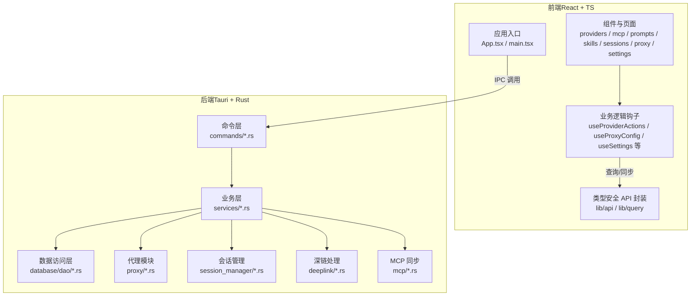
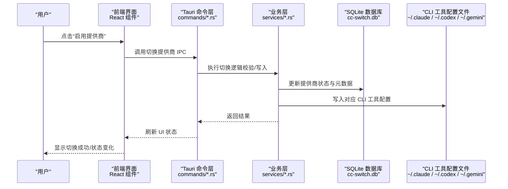
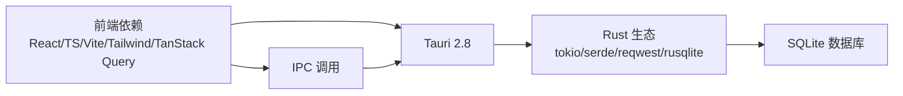

# 快速开始

<cite>
**本文引用的文件**
- [README.md](file://README.md)
- [package.json](file://package.json)
- [rust-toolchain.toml](file://rust-toolchain.toml)
- [Cargo.toml](file://src-tauri/Cargo.toml)
- [tauri.conf.json](file://src-tauri/tauri.conf.json)
- [1.2 安装指南.md](file://docs/user-manual/en/1-getting-started/1.2-installation.md)
- [1.3 界面总览.md](file://docs/user-manual/en/1-getting-started/1.3-interface.md)
- [1.4 快速开始.md](file://docs/user-manual/en/1-getting-started/1.4-quickstart.md)
- [2.1 添加提供商.md](file://docs/user-manual/en/2-providers/2.1-add.md)
- [2.2 切换提供商.md](file://docs/user-manual/en/2-providers/2.2-switch.md)
- [5.1 配置文件.md](file://docs/user-manual/en/5-faq/5.1-config-files.md)
- [5.2 常见问题.md](file://docs/user-manual/en/5-faq/5.2-questions.md)
- [5.4 环境变量冲突.md](file://docs/user-manual/en/5-faq/5.4-env-conflict.md)
- [1.5 设置.md](file://docs/user-manual/en/1-getting-started/1.5-settings.md)
</cite>

## 目录
1. [简介](#简介)
2. [项目结构](#项目结构)
3. [核心组件](#核心组件)
4. [架构总览](#架构总览)
5. [详细组件分析](#详细组件分析)
6. [依赖关系分析](#依赖关系分析)
7. [性能与资源建议](#性能与资源建议)
8. [故障排除指南](#故障排除指南)
9. [结论](#结论)
10. [附录](#附录)

## 简介
本指南面向首次使用 CC Switch 的用户，帮助你在约 15 分钟内完成安装、配置与首次运行。内容涵盖：
- 环境与系统要求（Node.js、pnpm、Rust、Tauri CLI、操作系统版本）
- 多种安装方式（Homebrew、手动下载、Arch Linux）
- 首次运行配置（添加第一个提供商、基本切换、系统托盘使用）
- 常见问题与故障排除
- 实际操作截图与代码示例路径（以源码路径代替具体代码）

## 项目结构
CC Switch 是基于 Tauri 2 + Rust 后端与 React + TypeScript 前端的跨平台桌面应用，支持 Windows、macOS、Linux。核心目录与职责概览如下：
- src/：前端（React + TS），包含组件、Hooks、国际化、类型定义等
- src-tauri/：后端（Rust），包含命令层、服务层、数据库访问层、代理模块、会话管理、深链处理等
- 文档与手册：docs/user-manual/en 下提供安装、界面、快速开始、提供商管理、代理与故障排查等详细说明
- 平台打包：tauri.conf.json 定义产品名、窗口、安全策略、图标、更新器与深链方案；各平台最小系统版本在配置中声明

图表来源
- [tauri.conf.json:1-70](file://src-tauri/tauri.conf.json#L1-L70)
- [Cargo.toml:1-110](file://src-tauri/Cargo.toml#L1-L110)

章节来源
- [README.md:480-518](file://README.md#L480-L518)
- [tauri.conf.json:1-70](file://src-tauri/tauri.conf.json#L1-L70)

## 核心组件
- 提供商管理：支持 7 款工具（Claude Code、Claude Desktop、Codex、Gemini CLI、OpenCode、OpenClaw、Hermes），内置 50+ 预设，支持通用提供商跨应用同步
- 本地代理与自动切换：格式转换、健康监测、熔断器、用量统计
- MCP、提示词与技能：统一面板管理，跨应用双向同步
- 系统托盘：后台驻留、轻量模式、按应用子菜单快速切换
- 数据存储：SQLite 单一真实来源（SSOT），设备级 JSON 配置，自动备份与导入导出

章节来源
- [README.md:178-213](file://README.md#L178-L213)
- [README.md:273-292](file://README.md#L273-L292)

## 架构总览
下图展示从前端到后端的关键交互路径，以及 IPC 调用与数据流向。

图表来源
- [2.2 切换提供商.md:1-128](file://docs/user-manual/en/2-providers/2.2-switch.md#L1-L128)
- [5.1 配置文件.md:1-363](file://docs/user-manual/en/5-faq/5.1-config-files.md#L1-L363)

章节来源
- [2.2 切换提供商.md:1-128](file://docs/user-manual/en/2-providers/2.2-switch.md#L1-L128)
- [5.1 配置文件.md:1-363](file://docs/user-manual/en/5-faq/5.1-config-files.md#L1-L363)

## 详细组件分析

### 环境与系统要求
- 开发与运行环境
  - Node.js 18+
  - pnpm 8+
  - Rust 1.85+（仓库使用 1.95 channel，构建时 rust-version 为 1.85.0）
  - Tauri CLI 2.8+
- 系统要求
  - Windows：10 及以上
  - macOS：12（Monterey）及以上
  - Linux：Ubuntu 22.04+ / Debian 11+ / Fedora 34+ 及主流发行版

章节来源
- [README.md:389-395](file://README.md#L389-L395)
- [README.md:295-299](file://README.md#L295-L299)
- [package.json:1-96](file://package.json#L1-L96)
- [rust-toolchain.toml:1-5](file://rust-toolchain.toml#L1-L5)
- [Cargo.toml:9](file://src-tauri/Cargo.toml#L9)
- [tauri.conf.json:52-54](file://src-tauri/tauri.conf.json#L52-L54)

### 安装方式
- Windows
  - MSI 安装器或便携版压缩包
- macOS
  - Homebrew（推荐）：brew install --cask cc-switch
  - 手动下载：从发布页下载 .dmg 或 .zip，拖拽至应用程序
- Arch Linux
  - paru -S cc-switch-bin
- 其他 Linux 发行版
  - .deb（Debian/Ubuntu）、.rpm（Fedora/RHEL/openSUSE）、AppImage（通用）

章节来源
- [1.2 安装指南.md:105-187](file://docs/user-manual/en/1-getting-started/1.2-installation.md#L105-L187)
- [1.2 安装指南.md:189-228](file://docs/user-manual/en/1-getting-started/1.2-installation.md#L189-L228)

### 首次运行配置（15 分钟清单）
- 步骤 1：添加提供商
  - 在主界面点击右上角“+”按钮，选择预设或“自定义”，输入 API Key，点击“添加”
  - 预设自动填充端点，减少手工配置
- 步骤 2：切换提供商
  - 主界面：点击目标提供商卡片上的“启用”
  - 系统托盘：右键托盘图标，进入对应应用子菜单，直接点击提供商名称
- 步骤 3：生效与验证
  - Claude Code：即时生效（热重载）
  - Codex/Gemini/OpenCode/OpenClaw：重启终端或对应 CLI 工具后生效
  - 验证方法：启动对应 CLI，输入简单问题进行测试

章节来源
- [1.4 快速开始.md:5-77](file://docs/user-manual/en/1-getting-started/1.4-quickstart.md#L5-L77)
- [2.2 切换提供商.md:53-106](file://docs/user-manual/en/2-providers/2.2-switch.md#L53-L106)
- [1.3 界面总览.md:94-144](file://docs/user-manual/en/1-getting-started/1.3-interface.md#L94-L144)

### 系统托盘使用
- 托盘菜单结构：打开主窗口、应用子菜单（Claude/Codex/Gemini）、提供商列表、轻量模式开关、退出
- 子菜单显示当前提供商名称与缓存用量摘要（订阅配额/使用脚本摘要）
- 轻量模式：关闭主窗口，仅保留托盘运行，降低资源占用；再次唤醒时按需重建主窗口

章节来源
- [1.3 界面总览.md:94-144](file://docs/user-manual/en/1-getting-started/1.3-interface.md#L94-L144)
- [1.5 设置.md:50-69](file://docs/user-manual/en/1-getting-started/1.5-settings.md#L50-L69)

### 添加提供商（更多选项与高级配置）
- 预设提供商：覆盖 Claude/Claude Desktop/Codex/Gemini/OpenCode/OpenClaw/Hermes 的常见上游
- 自定义配置：按工具格式填写 JSON/TOML/ENV 等配置文件
- 通用提供商：在多个应用间共享配置，支持保存并立即同步
- 深链导入与数据库备份导入：一键导入分享链接或历史备份

章节来源
- [2.1 添加提供商.md:11-653](file://docs/user-manual/en/2-providers/2.1-add.md#L11-L653)

### 数据与配置位置
- CC Switch 数据库与文件
  - 数据库：~/.cc-switch/cc-switch.db（SSOT）
  - 设备设置：~/.cc-switch/settings.json
  - 技能与备份：~/.cc-switch/skills/、~/.cc-switch/skill-backups/
  - 备份：~/.cc-switch/backups/
- CLI 工具配置目录
  - Claude：~/.claude/
  - Codex：~/.codex/
  - Gemini：~/.gemini/
  - OpenCode：~/.config/opencode/
  - OpenClaw：~/.openclaw/
  - Hermes：~/.hermes/

章节来源
- [5.1 配置文件.md:3-363](file://docs/user-manual/en/5-faq/5.1-config-files.md#L3-L363)

## 依赖关系分析
- 前端依赖
  - React 18、TypeScript、Vite、TailwindCSS、TanStack Query、i18n、shadcn/ui 等
- 后端依赖
  - Tauri 2.8、Rust 生态（tokio、serde、reqwest、rusqlite、hyper 等）
- 平台与打包
  - macOS 最低系统版本 12；Windows 安装器与便携版；Linux 支持多包格式与 AppImage

图表来源
- [package.json:42-94](file://package.json#L42-L94)
- [Cargo.toml:25-83](file://src-tauri/Cargo.toml#L25-L83)

章节来源
- [package.json:1-96](file://package.json#L1-L96)
- [Cargo.toml:1-110](file://src-tauri/Cargo.toml#L1-L110)
- [tauri.conf.json:52-54](file://src-tauri/tauri.conf.json#L52-L54)

## 性能与资源建议
- 轻量模式：长时间后台运行时可启用轻量模式，显著降低内存占用
- 代理与自动切换：在代理开启且接管应用请求时，可获得更稳定的可用性与用量统计
- 环境变量冲突检测：当系统环境变量与应用配置冲突时，应用会发出警告，避免被意外覆盖

章节来源
- [1.5 设置.md:50-69](file://docs/user-manual/en/1-getting-started/1.5-settings.md#L50-L69)
- [5.4 环境变量冲突.md:1-109](file://docs/user-manual/en/5-faq/5.4-env-conflict.md#L1-L109)

## 故障排除指南
- 安装相关
  - macOS：已签名与公证，直接安装；若无法打开，尝试重新下载最新版本
  - Windows：缺少 WebView2 运行库或被杀软拦截，分别安装运行库或加入白名单
  - Linux：AppImage 无执行权限或沙箱限制，赋予执行权限或使用 --no-sandbox 参数
- 切换不生效
  - 确认已重启对应 CLI 工具；部分工具无需重启（如 Claude Code、Gemini）
- 代理服务
  - 端口被占用：检查端口占用并释放或恢复默认端口
  - 请求超时：检查网络、直连上游 API 排查
- 环境变量冲突
  - 应用顶部出现黄色警告，可一键查看冲突详情并自动备份后移除
- 数据与迁移
  - 导入覆盖现有配置前建议先导出备份；数据库损坏可从 backups 恢复

章节来源
- [5.2 常见问题.md:3-266](file://docs/user-manual/en/5-faq/5.2-questions.md#L3-L266)
- [5.4 环境变量冲突.md:14-109](file://docs/user-manual/en/5-faq/5.4-env-conflict.md#L14-L109)

## 结论
通过本快速开始指南，你可以在 15 分钟内完成 CC Switch 的安装与首次配置，掌握添加提供商、切换与系统托盘使用的完整流程，并具备基础的故障排除能力。随着使用深入，可进一步探索代理、MCP、提示词与技能扩展等功能。

## 附录
- 实际操作截图与示例路径（以源码路径代替具体代码）
  - 首次运行界面与托盘菜单示意：[1.3 界面总览.md:1-191](file://docs/user-manual/en/1-getting-started/1.3-interface.md#L1-L191)
  - 添加提供商与预设列表：[2.1 添加提供商.md:11-653](file://docs/user-manual/en/2-providers/2.1-add.md#L11-L653)
  - 切换提供商与生效方式：[2.2 切换提供商.md:1-128](file://docs/user-manual/en/2-providers/2.2-switch.md#L1-L128)
  - 验证配置的命令示例：[1.4 快速开始.md:55-77](file://docs/user-manual/en/1-getting-started/1.4-quickstart.md#L55-L77)
  - 数据与配置位置：[5.1 配置文件.md:3-363](file://docs/user-manual/en/5-faq/5.1-config-files.md#L3-L363)
  - 环境变量冲突处理：[5.4 环境变量冲突.md:14-109](file://docs/user-manual/en/5-faq/5.4-env-conflict.md#L14-L109)