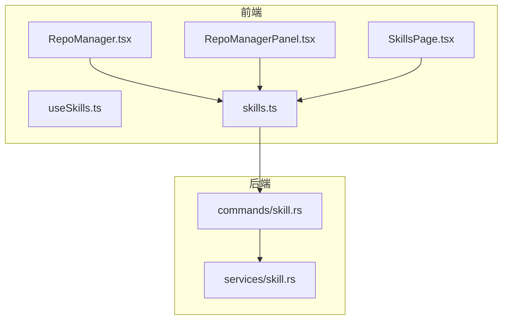
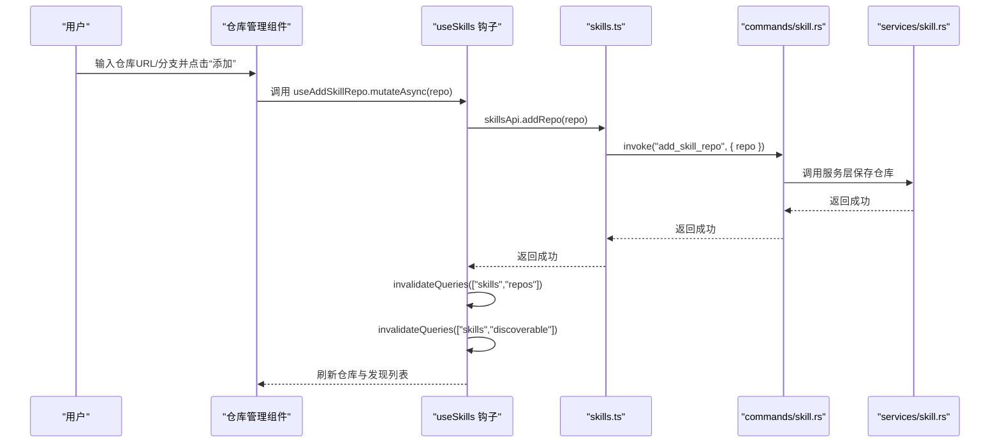
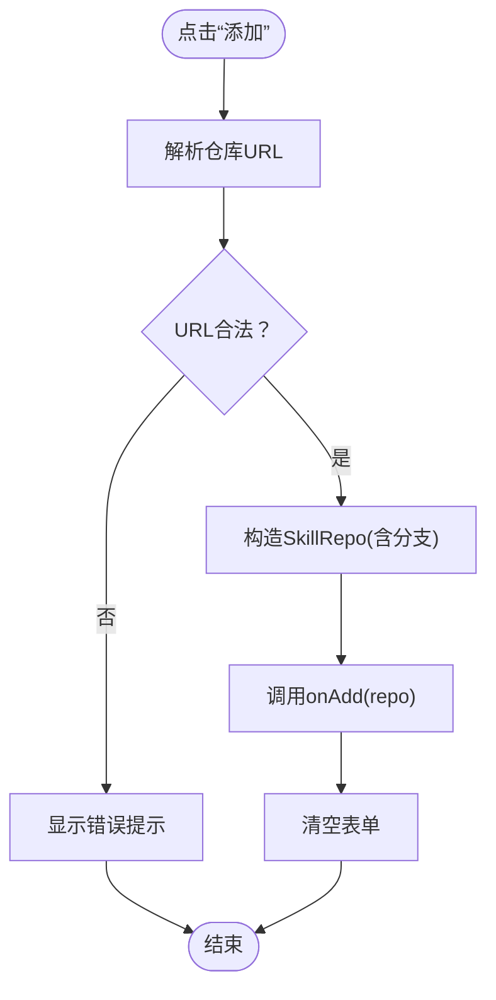
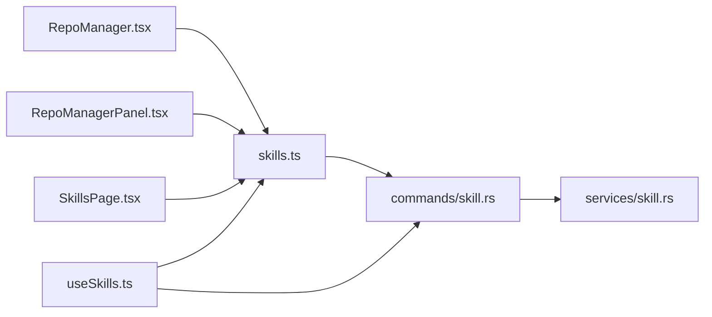

# 技能仓库管理

<cite>
**本文引用的文件**
- [RepoManager.tsx](file://src/components/skills/RepoManager.tsx)
- [RepoManagerPanel.tsx](file://src/components/skills/RepoManagerPanel.tsx)
- [useSkills.ts](file://src/hooks/useSkills.ts)
- [skills.ts](file://src/lib/api/skills.ts)
- [skill.rs](file://src-tauri/src/commands/skill.rs)
- [skill.rs（服务层）](file://src-tauri/src/services/skill.rs)
- [SkillsPage.tsx](file://src/components/skills/SkillsPage.tsx)
- [en.json](file://src/i18n/locales/en.json)
- [3.3-skills.md](file://docs/user-manual/en/3-extensions/3.3-skills.md)
</cite>

## 目录
1. [简介](#简介)
2. [项目结构](#项目结构)
3. [核心组件](#核心组件)
4. [架构总览](#架构总览)
5. [详细组件分析](#详细组件分析)
6. [依赖关系分析](#依赖关系分析)
7. [性能考量](#性能考量)
8. [故障排除指南](#故障排除指南)
9. [结论](#结论)
10. [附录](#附录)

## 简介
本指南面向 CC Switch 的“技能仓库管理”功能，帮助用户理解技能仓库的概念与作用，掌握仓库的添加、删除与配置管理方法；同时详解仓库管理面板的功能特性（仓库列表展示、表单校验与删除确认流程）、仓库配置参数（所有者、名称、分支与 URL 设置）、以及仓库同步机制（技能列表的自动刷新与增量更新）。文末提供最佳实践与故障排除建议，帮助您高效、稳定地管理技能仓库。

## 项目结构
技能仓库管理涉及前端 UI 组件、React Query 钩子、API 层与 Rust 后端命令与服务层。关键文件如下：
- 前端仓库管理组件：RepoManager.tsx、RepoManagerPanel.tsx
- 前端查询与变更钩子：useSkills.ts
- 前端 API 封装：skills.ts
- 后端命令层：skill.rs（命令定义）
- 后端服务层：skill.rs（服务逻辑）
- 主页集成：SkillsPage.tsx
- 国际化文案：en.json
- 用户手册：3.3-skills.md

图表来源
- [RepoManager.tsx:1-203](file://src/components/skills/RepoManager.tsx#L1-L203)
- [RepoManagerPanel.tsx:1-197](file://src/components/skills/RepoManagerPanel.tsx#L1-L197)
- [SkillsPage.tsx:1-619](file://src/components/skills/SkillsPage.tsx#L1-L619)
- [useSkills.ts:220-257](file://src/hooks/useSkills.ts#L220-L257)
- [skills.ts:252-267](file://src/lib/api/skills.ts#L252-L267)
- [skill.rs（命令层）:295-323](file://src-tauri/src/commands/skill.rs#L295-L323)
- [skill.rs（服务层）:101-112](file://src-tauri/src/services/skill.rs#L101-L112)

章节来源
- [RepoManager.tsx:1-203](file://src/components/skills/RepoManager.tsx#L1-L203)
- [RepoManagerPanel.tsx:1-197](file://src/components/skills/RepoManagerPanel.tsx#L1-L197)
- [SkillsPage.tsx:1-619](file://src/components/skills/SkillsPage.tsx#L1-L619)
- [useSkills.ts:220-257](file://src/hooks/useSkills.ts#L220-L257)
- [skills.ts:252-267](file://src/lib/api/skills.ts#L252-L267)
- [skill.rs（命令层）:295-323](file://src-tauri/src/commands/skill.rs#L295-L323)
- [skill.rs（服务层）:101-112](file://src-tauri/src/services/skill.rs#L101-L112)

## 核心组件
- 仓库管理弹窗组件（RepoManager.tsx）：提供仓库添加表单、URL/分支解析、错误提示与仓库列表展示。
- 仓库管理全屏面板（RepoManagerPanel.tsx）：与 SkillsPage 集成，提供仓库增删与打开仓库页面的能力。
- 查询与变更钩子（useSkills.ts）：封装仓库列表查询、添加仓库、删除仓库等 Mutation。
- 前端 API（skills.ts）：封装 getRepos/addRepo/removeRepo 等调用。
- 后端命令（commands/skill.rs）：暴露 get_skill_repos/add_skill_repo/remove_skill_repo 等命令。
- 后端服务（services/skill.rs）：定义 SkillRepo 数据结构与默认仓库集合。

章节来源
- [RepoManager.tsx:17-33](file://src/components/skills/RepoManager.tsx#L17-L33)
- [RepoManagerPanel.tsx:11-25](file://src/components/skills/RepoManagerPanel.tsx#L11-L25)
- [useSkills.ts:220-257](file://src/hooks/useSkills.ts#L220-L257)
- [skills.ts:252-267](file://src/lib/api/skills.ts#L252-L267)
- [skill.rs（命令层）:295-323](file://src-tauri/src/commands/skill.rs#L295-L323)
- [skill.rs（服务层）:101-112](file://src-tauri/src/services/skill.rs#L101-L112)

## 架构总览
仓库管理的端到端流程如下：
- 用户在仓库管理面板输入仓库 URL 与分支，前端进行基础校验后调用 addRepo。
- 前端通过 skillsApi 调用 Tauri 命令 add_skill_repo，后端写入数据库并使仓库生效。
- 前端通过 useDiscoverableSkills 与 useSkillRepos 查询技能与仓库，实现技能列表的自动刷新与增量更新。
- 删除仓库时，前端调用 removeRepo，后端删除数据库记录，前端刷新仓库与发现列表。

图表来源
- [RepoManager.tsx:67-89](file://src/components/skills/RepoManager.tsx#L67-L89)
- [useSkills.ts:233-242](file://src/hooks/useSkills.ts#L233-L242)
- [skills.ts:259-262](file://src/lib/api/skills.ts#L259-L262)
- [skill.rs（命令层）:301-309](file://src-tauri/src/commands/skill.rs#L301-L309)
- [skill.rs（服务层）:101-112](file://src-tauri/src/services/skill.rs#L101-L112)

## 详细组件分析

### 仓库管理弹窗组件（RepoManager.tsx）
- 功能要点
  - 表单字段：仓库 URL、分支；支持空分支默认为 main。
  - URL 解析：支持 https://github.com/{owner}/{name}、{owner}/{name}、https://github.com/{owner}/{name}.git 等格式。
  - 错误处理：非法 URL 显示错误提示；添加失败捕获异常并提示。
  - 仓库列表：展示 owner/name、分支、技能数量统计；提供“查看仓库”“删除仓库”操作。
- 关键行为
  - handleAdd：解析 URL → 构造 SkillRepo → 调用 onAdd → 清空表单。
  - handleOpenRepo：调用外部浏览器打开仓库页面。
  - getSkillCount：按仓库与分支统计技能数量。

图表来源
- [RepoManager.tsx:47-97](file://src/components/skills/RepoManager.tsx#L47-L97)

章节来源
- [RepoManager.tsx:39-97](file://src/components/skills/RepoManager.tsx#L39-L97)

### 仓库管理全屏面板（RepoManagerPanel.tsx）
- 功能要点
  - 与 SkillsPage 集成，作为全屏面板展示仓库管理界面。
  - 提供仓库添加表单与仓库列表，支持打开仓库与删除仓库。
- 关键行为
  - parseRepoUrl：与弹窗一致的 URL 解析。
  - handleAdd：调用 onAdd 并重置表单。
  - handleOpenRepo：打开仓库页面。
  - 列表项：显示仓库分支与技能数量徽标。

章节来源
- [RepoManagerPanel.tsx:31-84](file://src/components/skills/RepoManagerPanel.tsx#L31-L84)
- [RepoManagerPanel.tsx:149-191](file://src/components/skills/RepoManagerPanel.tsx#L149-L191)

### 前端查询与变更钩子（useSkills.ts）
- 仓库查询：useSkillRepos 返回仓库列表。
- 仓库变更：
  - useAddSkillRepo：调用 addRepo，成功后失效 ["skills","repos"] 与 ["skills","discoverable"] 查询。
  - useRemoveSkillRepo：调用 removeRepo，成功后同样失效上述查询。
- 技能发现与安装：配合 useDiscoverableSkills 与 useInstallSkill，实现技能列表的自动刷新与增量更新。

章节来源
- [useSkills.ts:223-257](file://src/hooks/useSkills.ts#L223-L257)
- [SkillsPage.tsx:84-86](file://src/components/skills/SkillsPage.tsx#L84-L86)
- [SkillsPage.tsx:243-281](file://src/components/skills/SkillsPage.tsx#L243-L281)

### 前端 API（skills.ts）
- 暴露 getRepos/addRepo/removeRepo 方法，底层通过 Tauri invoke 调用后端命令。
- 仓库管理 API 定义位于 252-267 行。

章节来源
- [skills.ts:252-267](file://src/lib/api/skills.ts#L252-L267)

### 后端命令与服务层（commands/skill.rs、services/skill.rs）
- 命令层
  - get_skill_repos：返回仓库列表。
  - add_skill_repo：保存仓库。
  - remove_skill_repo：删除仓库。
- 服务层
  - SkillRepo 结构体：owner、name、branch、enabled。
  - 默认仓库集合：包含多个预置仓库，便于初次使用即有技能源。

章节来源
- [skill.rs（命令层）:295-323](file://src-tauri/src/commands/skill.rs#L295-L323)
- [skill.rs（服务层）:101-112](file://src-tauri/src/services/skill.rs#L101-L112)
- [skill.rs（服务层）:133-165](file://src-tauri/src/services/skill.rs#L133-L165)

### 主页集成（SkillsPage.tsx）
- 仓库管理入口：SkillsPage 提供打开仓库管理面板的入口。
- 列表刷新：当仓库变更时，通过 refetchDiscoverable 与 refetchRepos 触发刷新。
- 仓库计数：在添加仓库后，等待发现列表刷新，计算该仓库下技能数量并提示。

章节来源
- [SkillsPage.tsx:56-619](file://src/components/skills/SkillsPage.tsx#L56-L619)
- [SkillsPage.tsx:243-281](file://src/components/skills/SkillsPage.tsx#L243-L281)

## 依赖关系分析
- 组件依赖
  - RepoManager.tsx/RepoManagerPanel.tsx 依赖 skillsApi 与本地状态。
  - SkillsPage.tsx 依赖 useSkills 钩子与仓库管理面板。
- 查询与变更
  - useSkillRepos 与 useAddSkillRepo/useRemoveSkillRepo 通过 React Query 管理缓存与失效。
- 后端耦合
  - commands/skill.rs 与 services/skill.rs 提供仓库 CRUD 的持久化与默认仓库支持。

图表来源
- [RepoManager.tsx:1-203](file://src/components/skills/RepoManager.tsx#L1-L203)
- [RepoManagerPanel.tsx:1-197](file://src/components/skills/RepoManagerPanel.tsx#L1-L197)
- [SkillsPage.tsx:1-619](file://src/components/skills/SkillsPage.tsx#L1-L619)
- [useSkills.ts:220-257](file://src/hooks/useSkills.ts#L220-L257)
- [skills.ts:252-267](file://src/lib/api/skills.ts#L252-L267)
- [skill.rs（命令层）:295-323](file://src-tauri/src/commands/skill.rs#L295-L323)
- [skill.rs（服务层）:101-112](file://src-tauri/src/services/skill.rs#L101-L112)

章节来源
- [RepoManager.tsx:1-203](file://src/components/skills/RepoManager.tsx#L1-L203)
- [RepoManagerPanel.tsx:1-197](file://src/components/skills/RepoManagerPanel.tsx#L1-L197)
- [SkillsPage.tsx:1-619](file://src/components/skills/SkillsPage.tsx#L1-L619)
- [useSkills.ts:220-257](file://src/hooks/useSkills.ts#L220-L257)
- [skills.ts:252-267](file://src/lib/api/skills.ts#L252-L267)
- [skill.rs（命令层）:295-323](file://src-tauri/src/commands/skill.rs#L295-L323)
- [skill.rs（服务层）:101-112](file://src-tauri/src/services/skill.rs#L101-L112)

## 性能考量
- 缓存与失效
  - 仓库与发现列表查询使用 React Query 的 staleTime 与 keepPreviousData，减少不必要的网络请求。
  - 仓库变更后通过 invalidateQueries 触发局部刷新，避免全量重载。
- 增量更新
  - 添加/删除仓库后，仅刷新 ["skills","repos"] 与 ["skills","discoverable"]，提升交互流畅度。
- 默认仓库
  - 服务层提供默认仓库集合，降低首次使用的配置成本。

章节来源
- [useSkills.ts:223-257](file://src/hooks/useSkills.ts#L223-L257)
- [skill.rs（服务层）:133-165](file://src-tauri/src/services/skill.rs#L133-L165)

## 故障排除指南
- 仓库列表为空
  - 可能原因：网络问题导致无法访问 GitHub；仓库配置错误。
  - 解决方案：检查网络连接、点击“刷新”重试、核对仓库配置。
- 添加仓库失败
  - 可能原因：URL 格式不正确；网络异常；权限不足。
  - 解决方案：确保 URL 为 https://github.com/{owner}/{name} 或 {owner}/{name} 格式；检查网络与权限。
- 删除仓库后技能仍可见
  - 说明：删除仓库不会立即从已安装列表移除其技能，但不会再更新。
  - 建议：如需彻底移除，请在主面板执行卸载操作。
- 更新按钮不显示
  - 可能原因：远程仓库无新内容；尚未完成最新扫描。
  - 解决方案：点击“刷新”重新扫描；确认仓库配置指向正确的分支与路径。

章节来源
- [3.3-skills.md:247-286](file://docs/user-manual/en/3-extensions/3.3-skills.md#L247-L286)
- [SkillsPage.tsx:491-516](file://src/components/skills/SkillsPage.tsx#L491-L516)

## 结论
技能仓库管理通过清晰的前端组件、完善的查询与变更钩子、以及可靠的后端命令与服务层，实现了仓库的便捷添加、删除与配置管理。结合自动刷新与增量更新机制，用户可以高效地维护技能生态。遵循本文的最佳实践与故障排除建议，可进一步提升仓库管理的稳定性与效率。

## 附录

### 仓库配置参数说明
- 所有者（Owner）：GitHub 用户名或组织名。
- 名称（Name）：仓库名称。
- 分支（Branch）：默认 main。
- URL 设置：支持多种常见格式，组件会自动解析并标准化。

章节来源
- [RepoManager.tsx:47-65](file://src/components/skills/RepoManager.tsx#L47-L65)
- [RepoManagerPanel.tsx:39-52](file://src/components/skills/RepoManagerPanel.tsx#L39-L52)

### 仓库同步机制说明
- 自动刷新：仓库变更后，前端通过 React Query 使仓库与发现列表失效并重新拉取。
- 增量更新：仅影响仓库与发现列表两个查询，避免全量刷新带来的性能损耗。
- 默认仓库：服务层内置多个默认仓库，便于快速开始。

章节来源
- [useSkills.ts:233-257](file://src/hooks/useSkills.ts#L233-L257)
- [skill.rs（服务层）:133-165](file://src-tauri/src/services/skill.rs#L133-L165)

### 最佳实践
- 仓库选择策略
  - 优先选择官方或社区维护良好的仓库；关注 README 与更新频率。
  - 对于私有仓库，确保网络可达且具备访问权限。
- 性能优化建议
  - 合理使用“刷新”按钮，避免频繁重复刷新。
  - 仅添加必要的仓库，减少发现列表扫描压力。
- 故障排除
  - 出现网络问题时，先检查代理与防火墙设置。
  - 若仓库 URL 解析失败，确认格式是否符合要求。

章节来源
- [3.3-skills.md:247-286](file://docs/user-manual/en/3-extensions/3.3-skills.md#L247-L286)