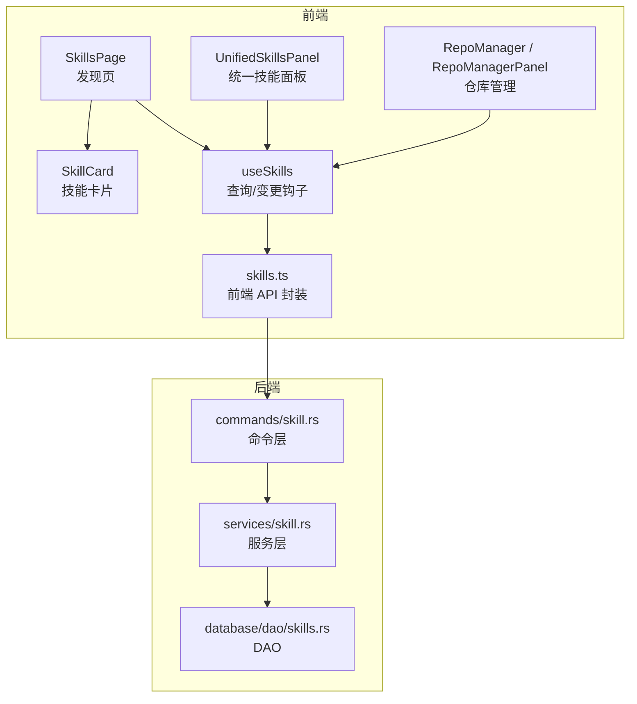
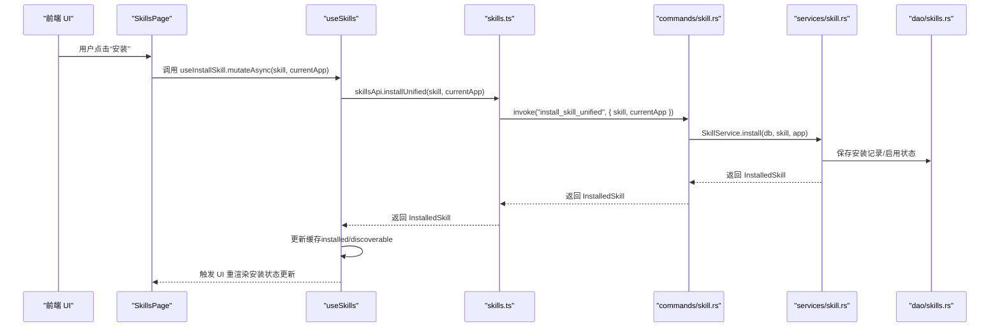
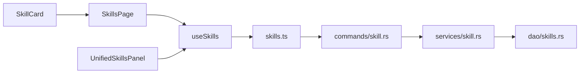
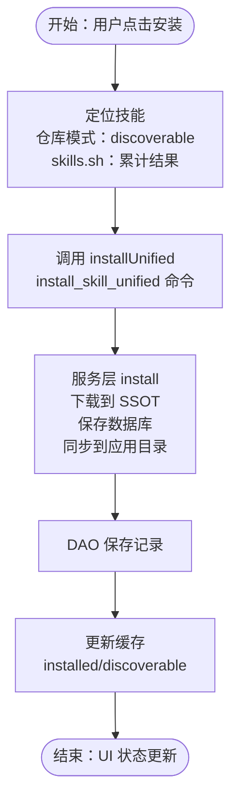

# 技能发现与安装

<cite>
**本文引用的文件**
- [SkillCard.tsx](file://src/components/skills/SkillCard.tsx)
- [SkillsPage.tsx](file://src/components/skills/SkillsPage.tsx)
- [UnifiedSkillsPanel.tsx](file://src/components/skills/UnifiedSkillsPanel.tsx)
- [RepoManager.tsx](file://src/components/skills/RepoManager.tsx)
- [RepoManagerPanel.tsx](file://src/components/skills/RepoManagerPanel.tsx)
- [useSkills.ts](file://src/hooks/useSkills.ts)
- [skills.ts](file://src/lib/api/skills.ts)
- [skill.rs](file://src-tauri/src/services/skill.rs)
- [skill.rs（命令层）](file://src-tauri/src/commands/skill.rs)
- [skills.rs（DAO）](file://src-tauri/src/database/dao/skills.rs)
- [appConfig.tsx](file://src/config/appConfig.tsx)
- [skillErrorParser.ts](file://src/lib/errors/skillErrorParser.ts)
</cite>

## 目录
1. [简介](#简介)
2. [项目结构](#项目结构)
3. [核心组件](#核心组件)
4. [架构总览](#架构总览)
5. [详细组件分析](#详细组件分析)
6. [依赖关系分析](#依赖关系分析)
7. [性能考量](#性能考量)
8. [故障排查指南](#故障排查指南)
9. [结论](#结论)
10. [附录](#附录)

## 简介
本指南面向 CC Switch 的“技能发现与安装”功能，帮助你理解以下内容：
- 技能发现机制：如何从 GitHub 仓库与 skills.sh 平台获取技能信息
- 技能卡片交互：技能信息展示、安装状态显示与一键安装
- 安装流程技术实现：安装请求发送、进度与状态反馈、错误处理
- 搜索模式：仓库模式与 skills.sh 模式的切换与配置
- 实际安装示例、状态变化与常见问题解决

## 项目结构
技能相关功能主要分布在前端组件、Hooks、API 层以及 Rust 后端服务与命令层：
- 前端组件：技能卡片、发现页、统一技能面板、仓库管理器
- Hooks：封装查询与变更逻辑（安装、卸载、仓库增删、搜索等）
- API 层：统一暴露后端能力（invoke 调用）
- 后端服务：统一管理安装、卸载、同步、备份、更新检测等
- 数据库：持久化已安装技能与仓库配置

图表来源
- [SkillsPage.tsx:1-619](file://src/components/skills/SkillsPage.tsx#L1-L619)
- [SkillCard.tsx:1-168](file://src/components/skills/SkillCard.tsx#L1-L168)
- [UnifiedSkillsPanel.tsx:1-800](file://src/components/skills/UnifiedSkillsPanel.tsx#L1-L800)
- [RepoManager.tsx:1-203](file://src/components/skills/RepoManager.tsx#L1-L203)
- [RepoManagerPanel.tsx:1-197](file://src/components/skills/RepoManagerPanel.tsx#L1-L197)
- [useSkills.ts:1-359](file://src/hooks/useSkills.ts#L1-L359)
- [skills.ts:1-284](file://src/lib/api/skills.ts#L1-L284)
- [skill.rs（命令层）:1-337](file://src-tauri/src/commands/skill.rs#L1-L337)
- [skill.rs（服务层）:1-800](file://src-tauri/src/services/skill.rs#L1-L800)
- [skills.rs（DAO）:1-264](file://src-tauri/src/database/dao/skills.rs#L1-L264)

章节来源
- [SkillsPage.tsx:1-619](file://src/components/skills/SkillsPage.tsx#L1-L619)
- [useSkills.ts:1-359](file://src/hooks/useSkills.ts#L1-L359)
- [skills.ts:1-284](file://src/lib/api/skills.ts#L1-L284)
- [skill.rs（命令层）:1-337](file://src-tauri/src/commands/skill.rs#L1-L337)
- [skill.rs（服务层）:1-800](file://src-tauri/src/services/skill.rs#L1-L800)
- [skills.rs（DAO）:1-264](file://src-tauri/src/database/dao/skills.rs#L1-L264)

## 核心组件
- 技能卡片（SkillCard）：展示技能基本信息、安装状态徽章、安装/卸载按钮、README 链接等
- 发现页（SkillsPage）：提供仓库模式与 skills.sh 模式切换、搜索、筛选、安装入口
- 统一技能面板（UnifiedSkillsPanel）：展示已安装技能、应用启用状态、卸载、更新等
- 仓库管理（RepoManager/RepoManagerPanel）：添加/删除 GitHub 仓库、查看仓库内技能数量
- Hooks（useSkills）：封装查询与变更（安装、卸载、仓库增删、搜索等），并维护缓存一致性
- API（skills.ts）：前端对后端命令的统一封装，提供 discover、install、uninstall、searchSkillsSh 等
- 后端服务（services/skill.rs）：统一安装/卸载/同步/备份/更新检测等业务逻辑
- 命令层（commands/skill.rs）：暴露 Tauri 命令，桥接前端与后端服务
- 数据库（dao/skills.rs）：持久化技能与仓库配置

章节来源
- [SkillCard.tsx:1-168](file://src/components/skills/SkillCard.tsx#L1-L168)
- [SkillsPage.tsx:1-619](file://src/components/skills/SkillsPage.tsx#L1-L619)
- [UnifiedSkillsPanel.tsx:1-800](file://src/components/skills/UnifiedSkillsPanel.tsx#L1-L800)
- [RepoManager.tsx:1-203](file://src/components/skills/RepoManager.tsx#L1-L203)
- [RepoManagerPanel.tsx:1-197](file://src/components/skills/RepoManagerPanel.tsx#L1-L197)
- [useSkills.ts:1-359](file://src/hooks/useSkills.ts#L1-L359)
- [skills.ts:1-284](file://src/lib/api/skills.ts#L1-L284)
- [skill.rs（服务层）:1-800](file://src-tauri/src/services/skill.rs#L1-L800)
- [skill.rs（命令层）:1-337](file://src-tauri/src/commands/skill.rs#L1-L337)
- [skills.rs（DAO）:1-264](file://src-tauri/src/database/dao/skills.rs#L1-L264)

## 架构总览
技能发现与安装采用“前端组件 + Hooks + API 封装 + 命令层 + 服务层 + 数据库”的分层设计，核心流程如下：

图表来源
- [SkillsPage.tsx:197-236](file://src/components/skills/SkillsPage.tsx#L197-L236)
- [useSkills.ts:69-110](file://src/hooks/useSkills.ts#L69-L110)
- [skills.ts:154-160](file://src/lib/api/skills.ts#L154-L160)
- [skill.rs（命令层）:52-65](file://src-tauri/src/commands/skill.rs#L52-L65)
- [skill.rs（服务层）:567-780](file://src-tauri/src/services/skill.rs#L567-L780)
- [skills.rs（DAO）:106-136](file://src-tauri/src/database/dao/skills.rs#L106-L136)

## 详细组件分析

### 技能卡片（SkillCard）
- 功能要点
  - 展示技能名称、描述、仓库归属、安装次数徽章
  - 已安装状态下显示“已安装”徽章
  - 提供“查看 README”“安装/卸载”按钮，禁用状态由 loading 控制
  - 仓库目录与名称不同时显示目录信息
- 交互细节
  - 安装/卸载时设置 loading，防止重复点击
  - README 链接通过 settingsApi.openExternal 打开外部链接
- 错误处理
  - 打开链接失败时记录日志，不影响其他流程

章节来源
- [SkillCard.tsx:1-168](file://src/components/skills/SkillCard.tsx#L1-L168)

### 发现页（SkillsPage）
- 搜索模式与切换
  - 仓库模式：基于 discoverable 列表，支持关键词搜索、仓库筛选、安装状态筛选
  - skills.sh 模式：支持关键词搜索，分页加载，显示 installs 数量
  - 无仓库且 discoverable 为空时自动切换到 skills.sh
- 安装流程
  - 根据当前搜索源定位技能（discoverable 或 skills.sh 结果）
  - 调用 useInstallSkill.mutateAsync，成功后提示并更新缓存
  - 失败时通过 formatSkillError 解析并弹出友好提示
- 仓库管理
  - 支持添加/删除仓库，添加后刷新 discoverable 列表并统计仓库内技能数
- 状态与提示
  - loading/空态/无结果态均有明确 UI 提示
  - 加载更多 skills.sh 结果时支持分页增量加载

章节来源
- [SkillsPage.tsx:1-619](file://src/components/skills/SkillsPage.tsx#L1-L619)

### 统一技能面板（UnifiedSkillsPanel）
- 已安装技能展示
  - 展示每个技能的名称、描述、来源（仓库/本地）、应用启用状态徽章
  - 支持一键卸载、更新、切换应用启用状态
- 批量与导入
  - 支持扫描未管理技能并导入
  - 支持从 ZIP 安装多个技能
- 备份与恢复
  - 支持列出/删除/恢复技能备份
- 更新检测
  - 支持检查更新并批量更新

章节来源
- [UnifiedSkillsPanel.tsx:1-800](file://src/components/skills/UnifiedSkillsPanel.tsx#L1-L800)

### 仓库管理（RepoManager / RepoManagerPanel）
- 功能
  - 添加 GitHub 仓库（owner/name，可选 branch，默认 main）
  - 删除仓库
  - 查看仓库内技能数量
  - 打开仓库页面
- 输入校验
  - 支持多种 URL 格式（https、owner/name、带 .git）
  - 校验失败时显示错误提示

章节来源
- [RepoManager.tsx:1-203](file://src/components/skills/RepoManager.tsx#L1-L203)
- [RepoManagerPanel.tsx:1-197](file://src/components/skills/RepoManagerPanel.tsx#L1-L197)

### Hooks（useSkills）
- 查询类
  - useInstalledSkills：已安装技能列表（staleTime 优化）
  - useDiscoverableSkills：可安装技能列表（staleTime 优化）
  - useSkillRepos：仓库列表
  - useSearchSkillsSh：skills.sh 搜索（分页、防抖）
- 变更类
  - useInstallSkill：安装技能，成功后更新 installed 与 discoverable 缓存
  - useUninstallSkill：卸载技能，成功后更新 installed 与 discoverable 缓存
  - useAddSkillRepo / useRemoveSkillRepo：仓库增删
  - useImportSkillsFromApps / useInstallSkillsFromZip：导入与 ZIP 安装
  - useCheckSkillUpdates / useUpdateSkill：更新检测与更新
- 缓存一致性
  - 安装/卸载成功后直接 setQueryData，避免全量刷新

章节来源
- [useSkills.ts:1-359](file://src/hooks/useSkills.ts#L1-L359)

### API 封装（skills.ts）
- 统一管理 API（v3.10.0+）
  - getInstalled、getBackups、deleteBackup、installUnified、uninstallUnified、restoreBackup、toggleApp、scanUnmanaged、importFromApps、discoverAvailable、checkUpdates、updateSkill、migrateStorage、searchSkillsSh、installFromZip、openZipFileDialog
- 兼容旧 API
  - getAll、install、uninstall 等（按应用区分）

章节来源
- [skills.ts:1-284](file://src/lib/api/skills.ts#L1-L284)

### 后端服务（services/skill.rs）
- 统一管理方法
  - install：下载到 SSOT（~/.cc-switch/skills/ 或 ~/.agents/skills/），保存数据库，同步到目标应用目录
  - uninstall：从应用目录与 SSOT 删除，生成卸载备份
  - discover_available：从仓库扫描可安装技能
  - check_updates/update_skill：更新检测与更新
  - sync_to_app_dir：按应用启用状态同步
- 路径与权限
  - get_ssot_dir/get_app_skills_dir：根据设置与覆盖路径解析目录
  - 权限不足时返回结构化错误（GET_HOME_DIR_FAILED）
- 错误处理
  - 下载超时（DOWNLOAD_TIMEOUT）、技能目录冲突（SKILL_DIRECTORY_CONFLICT）、仓库信息缺失（MISSING_REPO_INFO）等

章节来源
- [skill.rs（服务层）:1-800](file://src-tauri/src/services/skill.rs#L1-L800)

### 命令层（commands/skill.rs）
- 暴露 Tauri 命令
  - install_skill_unified、uninstall_skill_unified、restore_skill_backup、toggle_skill_app、scan_unmanaged_skills、import_skills_from_apps、discover_available_skills、check_skill_updates、update_skill、migrate_skill_storage、search_skills_sh、install_skills_from_zip
- 参数解析与错误转换
  - 将 Rust 错误转换为字符串返回前端

章节来源
- [skill.rs（命令层）:1-337](file://src-tauri/src/commands/skill.rs#L1-L337)

### 数据库（dao/skills.rs）
- 已安装技能 CRUD
  - get_all_installed_skills、get_installed_skill、save_skill、delete_skill、update_skill_apps、update_skill_hash
- 仓库 CRUD
  - get_skill_repos、save_skill_repo、delete_skill_repo、init_default_skill_repos（补充默认仓库）

章节来源
- [skills.rs（DAO）:1-264](file://src-tauri/src/database/dao/skills.rs#L1-L264)

### 错误解析（skillErrorParser）
- 结构化解析
  - 支持解析后端返回的 JSON 错误（code/context/suggestion）
- 国际化映射
  - 将错误码与建议映射到 i18n key，生成用户可读提示
- 使用场景
  - 安装失败时统一格式化错误消息并提示

章节来源
- [skillErrorParser.ts:1-109](file://src/lib/errors/skillErrorParser.ts#L1-L109)

## 依赖关系分析
- 组件耦合
  - SkillsPage 依赖 useSkills 与 SkillCard，负责聚合搜索、筛选与安装
  - SkillCard 仅依赖外部 onInstall/onUninstall 回调，低耦合
  - UnifiedSkillsPanel 依赖 useSkills 与多个变更钩子，承担已安装技能管理
- 前后端依赖
  - 前端通过 skills.ts 调用 Tauri 命令，命令层转发至服务层，服务层操作数据库
- 数据一致性
  - 安装/卸载通过 setQueryData 直接更新缓存，避免不必要的网络请求
- 外部依赖
  - GitHub 仓库扫描、skills.sh 搜索、系统文件系统（SSOT 目录）

图表来源
- [SkillsPage.tsx:1-619](file://src/components/skills/SkillsPage.tsx#L1-L619)
- [SkillCard.tsx:1-168](file://src/components/skills/SkillCard.tsx#L1-L168)
- [UnifiedSkillsPanel.tsx:1-800](file://src/components/skills/UnifiedSkillsPanel.tsx#L1-L800)
- [useSkills.ts:1-359](file://src/hooks/useSkills.ts#L1-L359)
- [skills.ts:1-284](file://src/lib/api/skills.ts#L1-L284)
- [skill.rs（命令层）:1-337](file://src-tauri/src/commands/skill.rs#L1-L337)
- [skill.rs（服务层）:1-800](file://src-tauri/src/services/skill.rs#L1-L800)
- [skills.rs（DAO）:1-264](file://src-tauri/src/database/dao/skills.rs#L1-L264)

## 性能考量
- 缓存策略
  - useInstalledSkills/useDiscoverableSkills 使用 staleTime 与 keepPreviousData，减少首次进入的网络请求
- 查询优化
  - skills.sh 搜索启用 enabled 与 staleTime，避免频繁请求
  - 分页加载（limit/offset）控制结果规模
- UI 体验
  - 安装/卸载按钮禁用 loading，避免重复提交
  - 空态与无结果态提供明确提示，减少无效等待

[本节为通用指导，不涉及具体文件分析]

## 故障排查指南
- 常见错误与建议
  - 下载超时：检查网络与代理，稍后重试
  - 仓库 URL 无效：确认 owner/name 格式与 .git 后缀
  - 技能目录冲突：不同仓库同名目录需先卸载再安装
  - 权限不足：检查 HOME 目录权限
  - ZIP 无技能：检查压缩包内容与结构
- 错误解析与提示
  - 后端返回结构化错误时，前端通过 formatSkillError 显示可读提示与建议
- 日志与诊断
  - 安装失败时控制台输出错误信息，便于定位问题

章节来源
- [skillErrorParser.ts:1-109](file://src/lib/errors/skillErrorParser.ts#L1-L109)
- [SkillsPage.tsx:214-236](file://src/components/skills/SkillsPage.tsx#L214-L236)
- [skill.rs（服务层）:567-780](file://src-tauri/src/services/skill.rs#L567-L780)

## 结论
CC Switch 的技能发现与安装功能通过清晰的前后端分层与缓存策略，提供了流畅的用户体验。仓库模式与 skills.sh 模式互补，既支持自建仓库的精细化管理，也支持公共平台的便捷发现。统一的服务层与命令层确保了安装/卸载/更新等关键流程的稳定性与可维护性。

[本节为总结性内容，不涉及具体文件分析]

## 附录

### 不同搜索模式的使用方法
- 仓库模式
  - 添加仓库：在仓库管理中输入 owner/name（支持多种格式），可选 branch，默认 main
  - 搜索与筛选：支持关键词、仓库、安装状态筛选
  - 安装：在卡片上点击“安装”，选择当前应用后完成安装
- skills.sh 模式
  - 搜索：输入关键词，按回车或点击“查询”开始搜索
  - 分页加载：点击“加载更多”继续获取结果
  - 安装：与仓库模式相同，安装后状态即时更新

章节来源
- [SkillsPage.tsx:318-322](file://src/components/skills/SkillsPage.tsx#L318-L322)
- [RepoManager.tsx:47-89](file://src/components/skills/RepoManager.tsx#L47-L89)
- [RepoManagerPanel.tsx:39-76](file://src/components/skills/RepoManagerPanel.tsx#L39-L76)

### 技能安装示例与状态变化
- 示例步骤
  - 仓库模式：在发现页选择技能 → 点击“安装” → 选择当前应用 → 成功后 discoverable 与 installed 缓存同步更新
  - skills.sh 模式：搜索技能 → 点击“安装” → 成功后同上
- 状态变化
  - 安装中：按钮显示加载动画，安装完成后显示“已安装”徽章
  - 卸载：统一面板中点击“卸载”，可生成备份并从各应用目录移除

章节来源
- [SkillsPage.tsx:197-236](file://src/components/skills/SkillsPage.tsx#L197-L236)
- [useSkills.ts:69-110](file://src/hooks/useSkills.ts#L69-L110)
- [UnifiedSkillsPanel.tsx:142-171](file://src/components/skills/UnifiedSkillsPanel.tsx#L142-L171)

### 技能安装流程的技术实现（代码级）

图表来源
- [SkillsPage.tsx:197-236](file://src/components/skills/SkillsPage.tsx#L197-L236)
- [useSkills.ts:69-110](file://src/hooks/useSkills.ts#L69-L110)
- [skills.ts:154-160](file://src/lib/api/skills.ts#L154-L160)
- [skill.rs（命令层）:52-65](file://src-tauri/src/commands/skill.rs#L52-L65)
- [skill.rs（服务层）:567-780](file://src-tauri/src/services/skill.rs#L567-L780)
- [skills.rs（DAO）:106-136](file://src-tauri/src/database/dao/skills.rs#L106-L136)