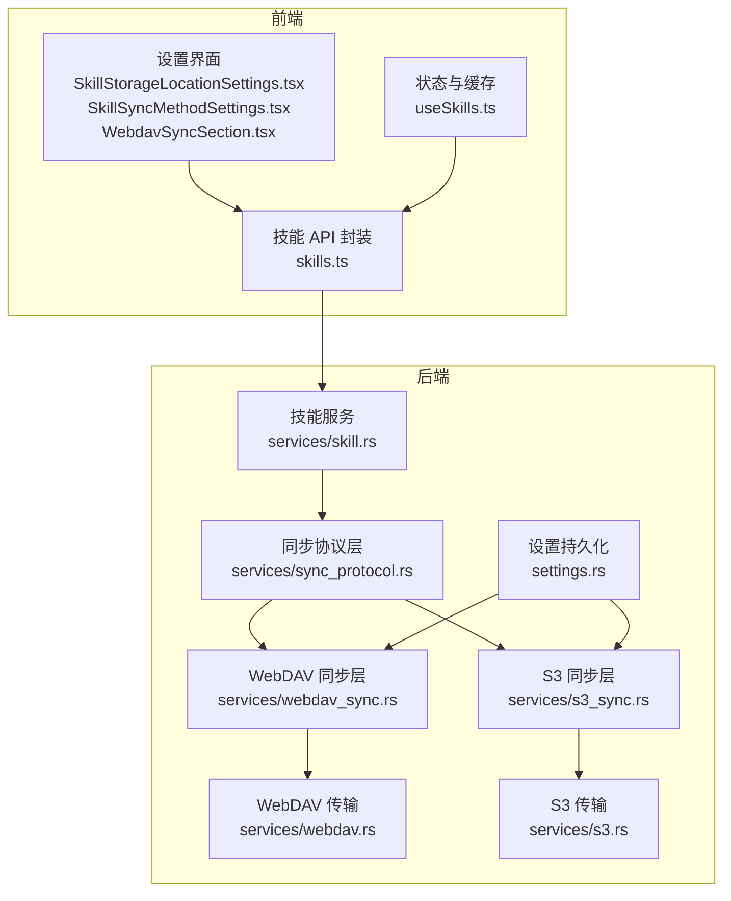
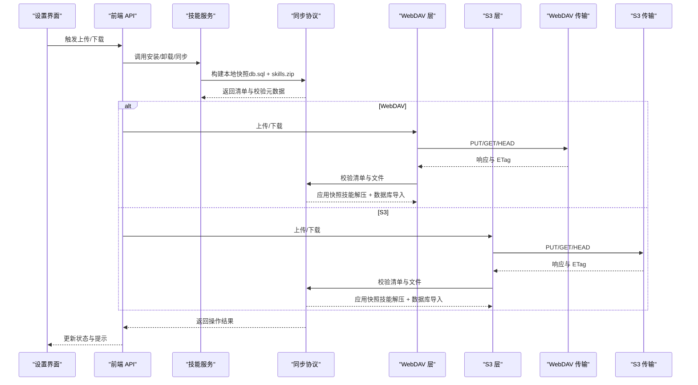
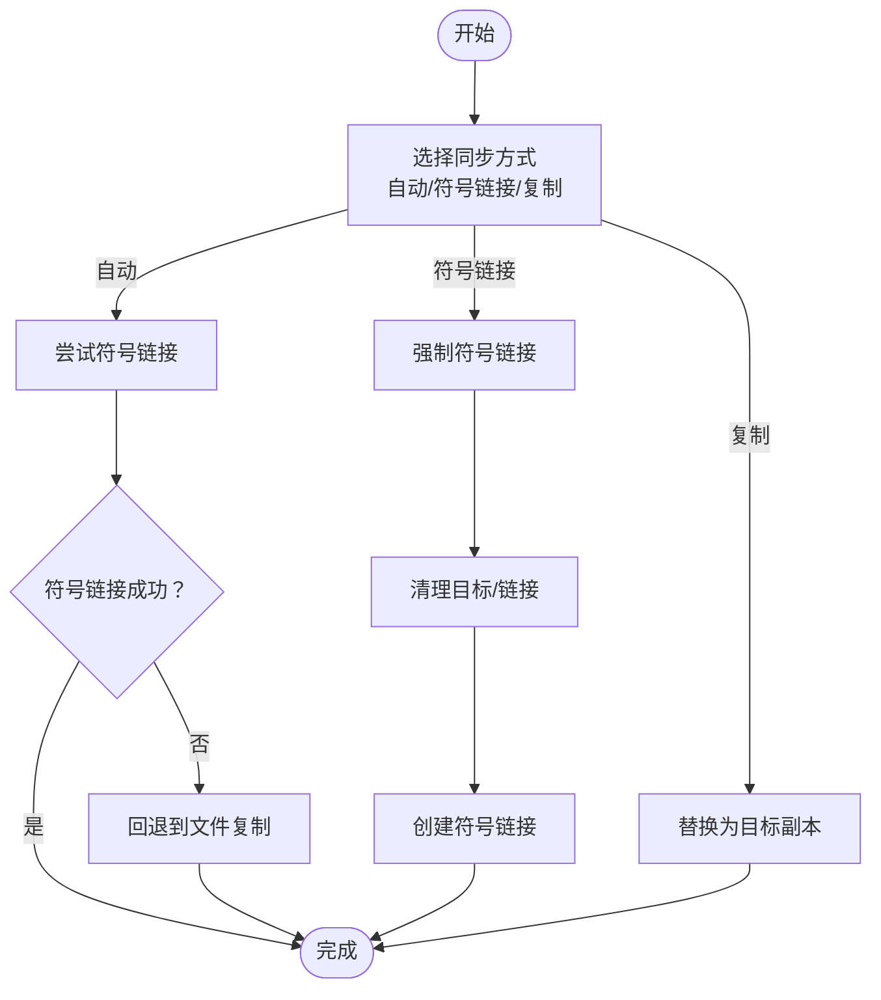
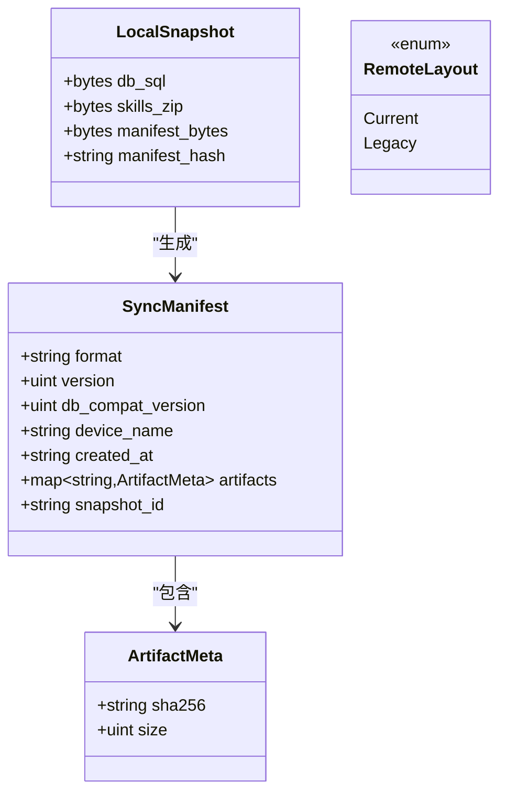
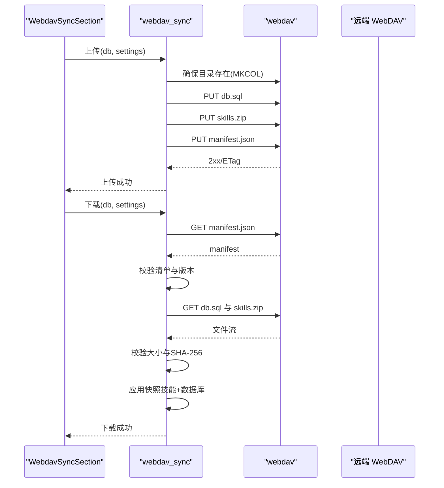
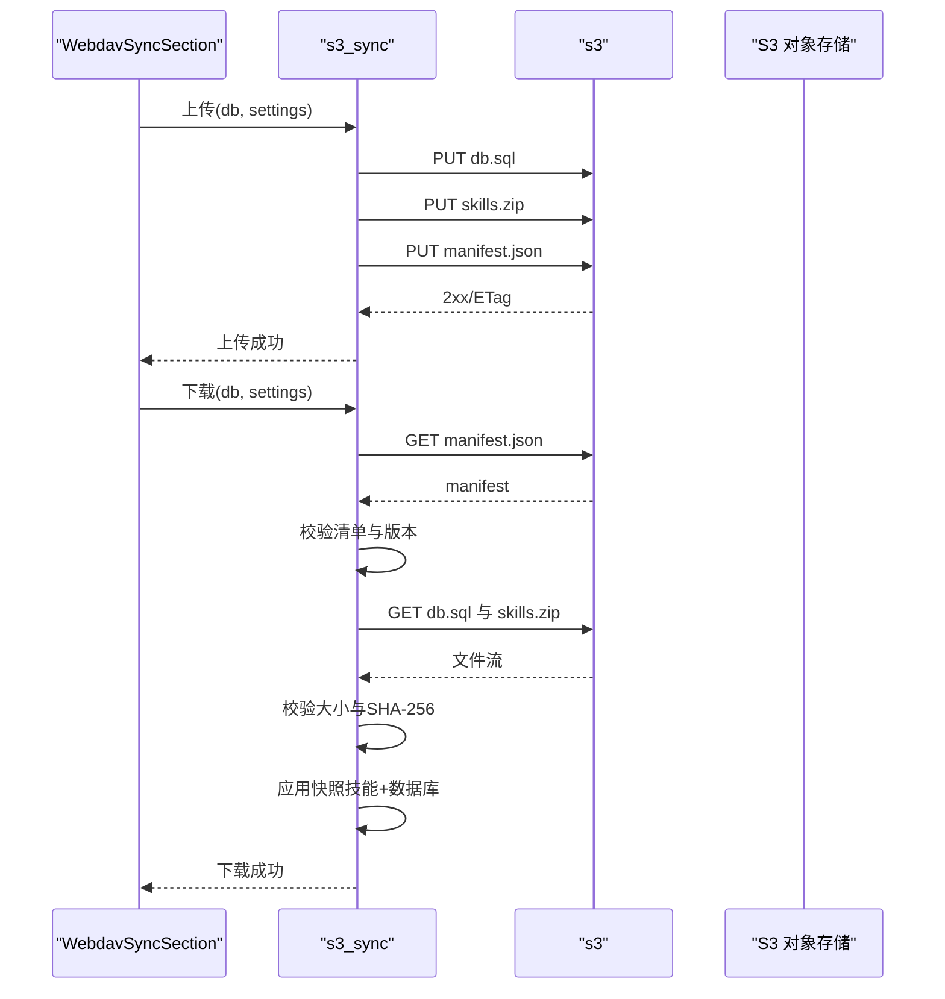
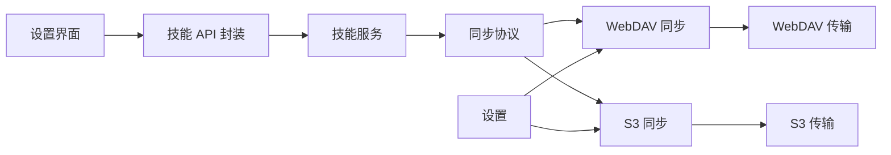

# 技能存储与同步

<cite>
**本文引用的文件**
- [src-tauri/src/services/skill.rs](file://src-tauri/src/services/skill.rs)
- [src-tauri/src/services/sync_protocol.rs](file://src-tauri/src/services/sync_protocol.rs)
- [src-tauri/src/services/webdav_sync.rs](file://src-tauri/src/services/webdav_sync.rs)
- [src-tauri/src/services/s3_sync.rs](file://src-tauri/src/services/s3_sync.rs)
- [src-tauri/src/services/webdav.rs](file://src-tauri/src/services/webdav.rs)
- [src-tauri/src/services/s3.rs](file://src-tauri/src/services/s3.rs)
- [src-tauri/src/settings.rs](file://src-tauri/src/settings.rs)
- [src/components/settings/SkillStorageLocationSettings.tsx](file://src/components/settings/SkillStorageLocationSettings.tsx)
- [src/components/settings/SkillSyncMethodSettings.tsx](file://src/components/settings/SkillSyncMethodSettings.tsx)
- [src/components/settings/WebdavSyncSection.tsx](file://src/components/settings/WebdavSyncSection.tsx)
- [src/hooks/useSkills.ts](file://src/hooks/useSkills.ts)
- [src/lib/api/skills.ts](file://src/lib/api/skills.ts)
- [src/types.ts](file://src/types.ts)
</cite>

## 目录
1. [简介](#简介)
2. [项目结构](#项目结构)
3. [核心组件](#核心组件)
4. [架构总览](#架构总览)
5. [详细组件分析](#详细组件分析)
6. [依赖关系分析](#依赖关系分析)
7. [性能考虑](#性能考虑)
8. [故障排除指南](#故障排除指南)
9. [结论](#结论)
10. [附录](#附录)

## 简介
本指南面向 CC Switch 的“技能存储与同步”功能，系统阐述以下主题：
- 技能文件的存储机制：SSOT（单一事实源）目录、CC Switch 管理目录与统一标准目录（~/.agents/skills/）的选择与迁移。
- 两种安装同步方式：符号链接（symlink）与文件复制（copy）的技术差异、适用场景与回退策略。
- 技能同步策略：本地存储结构、文件组织方式、版本管理与协议兼容性。
- 云同步方案：WebDAV 与 S3 的配置、认证、同步流程、冲突与一致性处理。
- 性能优化：缓存策略、增量同步思路、带宽与并发控制建议。
- 错误处理、断点续传与数据完整性验证。

## 项目结构
围绕技能存储与同步的关键代码分布在前后端两部分：
- 前端（React + Tauri 前端）：设置面板、UI 控件、API 调用封装。
- 后端（Rust）：技能服务、同步协议、WebDAV/S3 传输层、设置持久化。

图表来源
- [src/components/settings/SkillStorageLocationSettings.tsx:1-166](file://src/components/settings/SkillStorageLocationSettings.tsx#L1-166)
- [src/components/settings/SkillSyncMethodSettings.tsx:1-79](file://src/components/settings/SkillSyncMethodSettings.tsx#L1-79)
- [src/components/settings/WebdavSyncSection.tsx:1-800](file://src/components/settings/WebdavSyncSection.tsx#L1-800)
- [src/hooks/useSkills.ts:1-359](file://src/hooks/useSkills.ts#L1-359)
- [src/lib/api/skills.ts:1-284](file://src/lib/api/skills.ts#L1-284)
- [src-tauri/src/services/skill.rs:1-800](file://src-tauri/src/services/skill.rs#L1-800)
- [src-tauri/src/services/sync_protocol.rs:1-649](file://src-tauri/src/services/sync_protocol.rs#L1-649)
- [src-tauri/src/services/webdav_sync.rs:1-336](file://src-tauri/src/services/webdav_sync.rs#L1-336)
- [src-tauri/src/services/s3_sync.rs:1-320](file://src-tauri/src/services/s3_sync.rs#L1-320)
- [src-tauri/src/services/webdav.rs:1-555](file://src-tauri/src/services/webdav.rs#L1-555)
- [src-tauri/src/services/s3.rs:1-927](file://src-tauri/src/services/s3.rs#L1-927)
- [src-tauri/src/settings.rs:413-439](file://src-tauri/src/settings.rs#L413-439)

章节来源
- [src-tauri/src/services/skill.rs:1-800](file://src-tauri/src/services/skill.rs#L1-800)
- [src-tauri/src/services/sync_protocol.rs:1-649](file://src-tauri/src/services/sync_protocol.rs#L1-649)
- [src-tauri/src/services/webdav_sync.rs:1-336](file://src-tauri/src/services/webdav_sync.rs#L1-336)
- [src-tauri/src/services/s3_sync.rs:1-320](file://src-tauri/src/services/s3_sync.rs#L1-320)
- [src-tauri/src/services/webdav.rs:1-555](file://src-tauri/src/services/webdav.rs#L1-555)
- [src-tauri/src/services/s3.rs:1-927](file://src-tauri/src/services/s3.rs#L1-927)
- [src-tauri/src/settings.rs:413-439](file://src-tauri/src/settings.rs#L413-439)
- [src/components/settings/SkillStorageLocationSettings.tsx:1-166](file://src/components/settings/SkillStorageLocationSettings.tsx#L1-166)
- [src/components/settings/SkillSyncMethodSettings.tsx:1-79](file://src/components/settings/SkillSyncMethodSettings.tsx#L1-79)
- [src/components/settings/WebdavSyncSection.tsx:1-800](file://src/components/settings/WebdavSyncSection.tsx#L1-800)
- [src/hooks/useSkills.ts:1-359](file://src/hooks/useSkills.ts#L1-359)
- [src/lib/api/skills.ts:1-284](file://src/lib/api/skills.ts#L1-284)
- [src/types.ts:1-200](file://src/types.ts#L1-200)

## 核心组件
- 技能服务（SkillService）
  - 统一管理 SSOT（单一事实源）目录，支持 CC Switch 管理目录与统一标准目录。
  - 提供安装、卸载、同步到应用目录、扫描未管理技能、从 ZIP 安装等能力。
  - 支持符号链接与文件复制两种同步方式，并具备自动回退逻辑。
- 同步协议层（sync_protocol）
  - 定义协议常量、清单（manifest）结构、快照构建与校验、应用快照、设备名检测与去噪。
  - 提供跨传输层（WebDAV/S3）的一致性保障：清单校验、大小与哈希校验、原子替换与回滚。
- 传输层（WebDAV/S3）
  - WebDAV：目录创建、PUT/GET/HEAD、ETag 获取、错误诊断与服务提示。
  - S3：AWS Signature V4 签名、虚拟主机与路径风格 URL、错误诊断与提示。
- 设置与 UI
  - 技能存储位置设置：支持在 CC Switch 管理目录与统一标准目录之间迁移。
  - 同步方式设置：支持自动（优先 symlink，失败回退 copy）、symlink、copy。
  - WebDAV/S3 设置面板：连接测试、远程信息获取、上传/下载、自动同步确认与保存。

章节来源
- [src-tauri/src/services/skill.rs:25-47](file://src-tauri/src/services/skill.rs#L25-47)
- [src-tauri/src/services/skill.rs:479-557](file://src-tauri/src/services/skill.rs#L479-557)
- [src-tauri/src/services/skill.rs:1611-1647](file://src-tauri/src/services/skill.rs#L1611-1647)
- [src-tauri/src/services/sync_protocol.rs:21-34](file://src-tauri/src/services/sync_protocol.rs#L21-34)
- [src-tauri/src/services/sync_protocol.rs:62-101](file://src-tauri/src/services/sync_protocol.rs#L62-101)
- [src-tauri/src/services/sync_protocol.rs:105-162](file://src-tauri/src/services/sync_protocol.rs#L105-162)
- [src-tauri/src/services/sync_protocol.rs:248-305](file://src-tauri/src/services/sync_protocol.rs#L248-305)
- [src-tauri/src/services/webdav_sync.rs:53-107](file://src-tauri/src/services/webdav_sync.rs#L53-107)
- [src-tauri/src/services/webdav_sync.rs:109-161](file://src-tauri/src/services/webdav_sync.rs#L109-161)
- [src-tauri/src/services/s3_sync.rs:41-90](file://src-tauri/src/services/s3_sync.rs#L41-90)
- [src-tauri/src/services/s3_sync.rs:92-131](file://src-tauri/src/services/s3_sync.rs#L92-131)
- [src-tauri/src/services/webdav.rs:131-159](file://src-tauri/src/services/webdav.rs#L131-159)
- [src-tauri/src/services/webdav.rs:224-248](file://src-tauri/src/services/webdav.rs#L224-248)
- [src-tauri/src/services/s3.rs:324-359](file://src-tauri/src/services/s3.rs#L324-359)
- [src-tauri/src/services/s3.rs:361-403](file://src-tauri/src/services/s3.rs#L361-403)
- [src-tauri/src/settings.rs:413-439](file://src-tauri/src/settings.rs#L413-439)
- [src/components/settings/SkillStorageLocationSettings.tsx:24-68](file://src/components/settings/SkillStorageLocationSettings.tsx#L24-68)
- [src/components/settings/SkillSyncMethodSettings.tsx:11-48](file://src/components/settings/SkillSyncMethodSettings.tsx#L11-48)
- [src/components/settings/WebdavSyncSection.tsx:234-650](file://src/components/settings/WebdavSyncSection.tsx#L234-650)

## 架构总览
技能存储与同步采用“协议无关 + 传输无关”的分层设计：
- 协议层：定义清单、快照、校验与应用流程，保证不同传输介质的一致性。
- 传输层：WebDAV 与 S3 分别实现上传/下载/校验，统一路由到协议层。
- 服务层：技能服务负责 SSOT、应用目录同步与迁移。
- 设置层：持久化同步配置与状态，提供 UI 交互入口。

图表来源
- [src-tauri/src/services/sync_protocol.rs:105-162](file://src-tauri/src/services/sync_protocol.rs#L105-162)
- [src-tauri/src/services/webdav_sync.rs:64-107](file://src-tauri/src/services/webdav_sync.rs#L64-107)
- [src-tauri/src/services/s3_sync.rs:48-90](file://src-tauri/src/services/s3_sync.rs#L48-90)
- [src-tauri/src/services/webdav.rs:224-248](file://src-tauri/src/services/webdav.rs#L224-248)
- [src-tauri/src/services/s3.rs:361-403](file://src-tauri/src/services/s3.rs#L361-403)
- [src/lib/api/skills.ts:136-283](file://src/lib/api/skills.ts#L136-283)

## 详细组件分析

### 技能存储与同步方式
- SSOT（单一事实源）目录
  - 支持两种存储位置：CC Switch 管理目录（~/.cc-switch/skills/）与统一标准目录（~/.agents/skills/）。
  - 可通过设置面板进行迁移，迁移过程中会统计成功/跳过/错误数量并反馈。
- 同步方式
  - 自动（默认）：优先尝试符号链接，失败则回退到文件复制。
  - symlink：强制使用符号链接，若目标已存在则先清理再创建。
  - copy：强制复制，适合不支持符号链接的环境或平台。
- 同步流程
  - 从 SSOT 源目录复制/链接到各应用的 skills 目录。
  - 对于符号链接，会进行安全检查，确保目标在仓库范围内，防止路径穿越。
  - 对于复制，会递归复制目录或文件，必要时创建父目录。

图表来源
- [src-tauri/src/services/skill.rs:1611-1647](file://src-tauri/src/services/skill.rs#L1611-1647)
- [src-tauri/src/services/skill.rs:2506-2527](file://src-tauri/src/services/skill.rs#L2506-2527)
- [src/components/settings/SkillSyncMethodSettings.tsx:11-48](file://src/components/settings/SkillSyncMethodSettings.tsx#L11-48)
- [src/components/settings/SkillStorageLocationSettings.tsx:24-68](file://src/components/settings/SkillStorageLocationSettings.tsx#L24-68)

章节来源
- [src-tauri/src/services/skill.rs:479-557](file://src-tauri/src/services/skill.rs#L479-557)
- [src-tauri/src/services/skill.rs:1611-1647](file://src-tauri/src/services/skill.rs#L1611-1647)
- [src-tauri/src/services/skill.rs:2506-2527](file://src-tauri/src/services/skill.rs#L2506-2527)
- [src/components/settings/SkillStorageLocationSettings.tsx:24-68](file://src/components/settings/SkillStorageLocationSettings.tsx#L24-68)
- [src/components/settings/SkillSyncMethodSettings.tsx:11-48](file://src/components/settings/SkillSyncMethodSettings.tsx#L11-48)

### 同步协议与版本管理
- 协议版本
  - 协议格式：cc-switch-webdav-sync
  - 协议版本：v2
  - 数据库兼容版本：db-v6（当前）与 db-v5（历史兼容）
- 快照与清单
  - 本地快照包含：db.sql、skills.zip 与 manifest.json。
  - 清单包含：格式、版本、数据库兼容版本、设备名、创建时间、制品清单（含 SHA-256 与大小）。
- 校验与应用
  - 远端清单校验：格式、协议版本、数据库兼容版本。
  - 文件校验：大小与 SHA-256 匹配。
  - 应用顺序：先替换技能，再导入数据库；数据库导入失败时回滚技能。
- 设备名与去噪
  - 从环境变量或系统命令获取设备名，去除控制字符并限制长度。

图表来源
- [src-tauri/src/services/sync_protocol.rs:62-101](file://src-tauri/src/services/sync_protocol.rs#L62-101)
- [src-tauri/src/services/sync_protocol.rs:105-162](file://src-tauri/src/services/sync_protocol.rs#L105-162)
- [src-tauri/src/services/sync_protocol.rs:186-246](file://src-tauri/src/services/sync_protocol.rs#L186-246)

章节来源
- [src-tauri/src/services/sync_protocol.rs:21-34](file://src-tauri/src/services/sync_protocol.rs#L21-34)
- [src-tauri/src/services/sync_protocol.rs:105-162](file://src-tauri/src/services/sync_protocol.rs#L105-162)
- [src-tauri/src/services/sync_protocol.rs:186-246](file://src-tauri/src/services/sync_protocol.rs#L186-246)
- [src-tauri/src/services/sync_protocol.rs:248-305](file://src-tauri/src/services/sync_protocol.rs#L248-305)
- [src-tauri/src/services/sync_protocol.rs:309-340](file://src-tauri/src/services/sync_protocol.rs#L309-340)

### WebDAV 同步
- 连接与目录准备
  - 连接测试：PROPFIND Depth=0。
  - 目录创建：MKCOL，对歧义状态进行 PROPFIND 验证。
- 上传/下载流程
  - 上传：先上传 db.sql 与 skills.zip，最后上传 manifest.json。
  - 下载：先获取 manifest，校验清单与数据库兼容版本，再下载并校验制品，最后应用快照。
  - ETag：上传后尝试获取 ETag，作为后续一致性参考。
- 错误处理与服务提示
  - 针对不同状态码给出针对性提示（如坚果云的特殊提示）。
  - URL 敏感信息脱敏输出。

图表来源
- [src-tauri/src/services/webdav_sync.rs:53-107](file://src-tauri/src/services/webdav_sync.rs#L53-107)
- [src-tauri/src/services/webdav_sync.rs:109-161](file://src-tauri/src/services/webdav_sync.rs#L109-161)
- [src-tauri/src/services/webdav_sync.rs:163-187](file://src-tauri/src/services/webdav_sync.rs#L163-187)
- [src-tauri/src/services/webdav.rs:131-159](file://src-tauri/src/services/webdav.rs#L131-159)
- [src-tauri/src/services/webdav.rs:161-222](file://src-tauri/src/services/webdav.rs#L161-222)
- [src-tauri/src/services/webdav.rs:224-248](file://src-tauri/src/services/webdav.rs#L224-248)
- [src-tauri/src/services/webdav.rs:368-401](file://src-tauri/src/services/webdav.rs#L368-401)

章节来源
- [src-tauri/src/services/webdav_sync.rs:53-107](file://src-tauri/src/services/webdav_sync.rs#L53-107)
- [src-tauri/src/services/webdav_sync.rs:109-161](file://src-tauri/src/services/webdav_sync.rs#L109-161)
- [src-tauri/src/services/webdav_sync.rs:163-187](file://src-tauri/src/services/webdav_sync.rs#L163-187)
- [src-tauri/src/services/webdav.rs:131-159](file://src-tauri/src/services/webdav.rs#L131-159)
- [src-tauri/src/services/webdav.rs:161-222](file://src-tauri/src/services/webdav.rs#L161-222)
- [src-tauri/src/services/webdav.rs:224-248](file://src-tauri/src/services/webdav.rs#L224-248)
- [src-tauri/src/services/webdav.rs:368-401](file://src-tauri/src/services/webdav.rs#L368-401)
- [src/components/settings/WebdavSyncSection.tsx:234-650](file://src/components/settings/WebdavSyncSection.tsx#L234-650)

### S3 同步
- 连接与签名
  - 连接测试：HEAD bucket。
  - 请求签名：AWS Signature V4，支持虚拟主机（AWS）与路径风格（自定义端点）。
- 上传/下载流程
  - 上传：先上传 db.sql 与 skills.zip，最后上传 manifest.json。
  - 下载：先获取 manifest，校验清单与版本，再下载并校验制品，最后应用快照。
  - ETag：上传后尝试获取 ETag，作为后续一致性参考。
- 错误处理与提示
  - 针对鉴权失败、桶不存在等状态码给出明确提示。

图表来源
- [src-tauri/src/services/s3_sync.rs:41-90](file://src-tauri/src/services/s3_sync.rs#L41-90)
- [src-tauri/src/services/s3_sync.rs:92-131](file://src-tauri/src/services/s3_sync.rs#L92-131)
- [src-tauri/src/services/s3_sync.rs:133-164](file://src-tauri/src/services/s3_sync.rs#L133-164)
- [src-tauri/src/services/s3.rs:324-359](file://src-tauri/src/services/s3.rs#L324-359)
- [src-tauri/src/services/s3.rs:361-403](file://src-tauri/src/services/s3.rs#L361-403)
- [src-tauri/src/services/s3.rs:405-472](file://src-tauri/src/services/s3.rs#L405-472)

章节来源
- [src-tauri/src/services/s3_sync.rs:41-90](file://src-tauri/src/services/s3_sync.rs#L41-90)
- [src-tauri/src/services/s3_sync.rs:92-131](file://src-tauri/src/services/s3_sync.rs#L92-131)
- [src-tauri/src/services/s3_sync.rs:133-164](file://src-tauri/src/services/s3_sync.rs#L133-164)
- [src-tauri/src/services/s3.rs:324-359](file://src-tauri/src/services/s3.rs#L324-359)
- [src-tauri/src/services/s3.rs:361-403](file://src-tauri/src/services/s3.rs#L361-403)
- [src-tauri/src/services/s3.rs:405-472](file://src-tauri/src/services/s3.rs#L405-472)
- [src/components/settings/WebdavSyncSection.tsx:650-800](file://src/components/settings/WebdavSyncSection.tsx#L650-800)

### 设置与 UI
- 技能存储位置设置
  - 支持在 CC Switch 管理目录与统一标准目录之间切换。
  - 切换前会提示已安装技能数量，避免误操作。
- 同步方式设置
  - 自动（默认）显示为 symlink，实际行为遵循“优先 symlink，失败回退 copy”。
  - 支持直接选择 symlink 或 copy。
- WebDAV/S3 设置面板
  - 连接测试、远程信息获取、上传/下载确认、自动同步开关与保存。
  - WebDAV 支持预设服务（如坚果云、Nextcloud、Synology）与自定义 URL。
  - S3 支持多种厂商与自定义端点，自动填充区域占位符。

章节来源
- [src/components/settings/SkillStorageLocationSettings.tsx:24-68](file://src/components/settings/SkillStorageLocationSettings.tsx#L24-68)
- [src/components/settings/SkillSyncMethodSettings.tsx:11-48](file://src/components/settings/SkillSyncMethodSettings.tsx#L11-48)
- [src/components/settings/WebdavSyncSection.tsx:234-650](file://src/components/settings/WebdavSyncSection.tsx#L234-650)
- [src-tauri/src/settings.rs:413-439](file://src-tauri/src/settings.rs#L413-439)

## 依赖关系分析
- 组件耦合
  - 协议层与传输层松耦合：协议层只关心清单与制品，不关心具体传输细节。
  - 服务层依赖协议层：安装/卸载/同步均通过协议层保证一致性。
  - UI 通过 API 封装调用后端命令，避免直接访问底层模块。
- 外部依赖
  - WebDAV：HTTP 客户端、Basic 认证、MKCOL/PROPFIND/HEAD/GET/PUT。
  - S3：HTTP 客户端、AWS Signature V4 签名、虚拟主机/路径风格 URL。
- 循环依赖
  - 未见循环依赖迹象；协议层被传输层与服务层共同依赖。

图表来源
- [src/lib/api/skills.ts:136-283](file://src/lib/api/skills.ts#L136-283)
- [src-tauri/src/services/skill.rs:1-800](file://src-tauri/src/services/skill.rs#L1-800)
- [src-tauri/src/services/sync_protocol.rs:1-649](file://src-tauri/src/services/sync_protocol.rs#L1-649)
- [src-tauri/src/services/webdav_sync.rs:1-336](file://src-tauri/src/services/webdav_sync.rs#L1-336)
- [src-tauri/src/services/s3_sync.rs:1-320](file://src-tauri/src/services/s3_sync.rs#L1-320)
- [src-tauri/src/services/webdav.rs:1-555](file://src-tauri/src/services/webdav.rs#L1-555)
- [src-tauri/src/services/s3.rs:1-927](file://src-tauri/src/services/s3.rs#L1-927)
- [src-tauri/src/settings.rs:413-439](file://src-tauri/src/settings.rs#L413-439)

章节来源
- [src/lib/api/skills.ts:136-283](file://src/lib/api/skills.ts#L136-283)
- [src-tauri/src/services/skill.rs:1-800](file://src-tauri/src/services/skill.rs#L1-800)
- [src-tauri/src/services/sync_protocol.rs:1-649](file://src-tauri/src/services/sync_protocol.rs#L1-649)
- [src-tauri/src/services/webdav_sync.rs:1-336](file://src-tauri/src/services/webdav_sync.rs#L1-336)
- [src-tauri/src/services/s3_sync.rs:1-320](file://src-tauri/src/services/s3_sync.rs#L1-320)
- [src-tauri/src/services/webdav.rs:1-555](file://src-tauri/src/services/webdav.rs#L1-555)
- [src-tauri/src/services/s3.rs:1-927](file://src-tauri/src/services/s3.rs#L1-927)
- [src-tauri/src/settings.rs:413-439](file://src-tauri/src/settings.rs#L413-439)

## 性能考虑
- 缓存策略
  - 前端使用 React Query 缓存技能列表与发现结果，避免重复请求。
  - 建议在频繁切换应用或刷新页面时利用缓存减少网络与 IO 压力。
- 增量同步思路
  - 协议层已提供清单与哈希校验，可扩展为基于清单的增量判断（当前实现为全量制品校验）。
  - 对于大型 skills.zip，可考虑分块传输与进度上报（当前实现为整体传输）。
- 带宽与并发
  - 传输层设置了默认与大文件传输的超时时间，建议在网络不稳定时适当增大超时或降低并发。
  - WebDAV/S3 传输层均支持流式读取，避免一次性占用过多内存。
- 磁盘与 CPU
  - 符号链接优先可显著节省磁盘空间与 IO；复制方式在不支持符号链接的平台更可靠。
  - 压缩与哈希计算为 CPU 密集型，建议在后台任务中执行，避免阻塞 UI。

章节来源
- [src/hooks/useSkills.ts:24-63](file://src/hooks/useSkills.ts#L24-63)
- [src-tauri/src/services/sync_protocol.rs:248-305](file://src-tauri/src/services/sync_protocol.rs#L248-305)
- [src-tauri/src/services/webdav.rs:13-15](file://src-tauri/src/services/webdav.rs#L13-15)
- [src-tauri/src/services/s3.rs:15-17](file://src-tauri/src/services/s3.rs#L15-17)

## 故障排除指南
- WebDAV 常见问题
  - 401/403：检查用户名、密码与目录权限；坚果云需使用“第三方应用密码”且 URL 指向 /dav/。
  - 404/MKCOL CONFLICT：确认目录存在或在坚果云上先手动创建顶层目录。
  - URL 脱敏：错误信息中会隐藏凭据与敏感参数，便于安全上报。
- S3 常见问题
  - 401/403：检查 Access Key ID 与 Secret Access Key。
  - 404（HEAD bucket）：检查桶名与区域。
  - 自定义端点：注意路径风格与虚拟主机风格的 URL 构造差异。
- 同步一致性
  - 清单格式/版本不兼容：升级客户端或调整远端布局。
  - 文件大小/哈希不匹配：重新上传或检查网络稳定性。
  - 应用快照失败：数据库导入失败时会回滚技能，确保数据安全。
- 断点续传与重试
  - 传输层采用流式读取与超时控制，建议在网络波动时重试。
  - ETag 用于一致性参考，可在上传后获取并持久化，便于后续比对。

章节来源
- [src-tauri/src/services/webdav.rs:368-401](file://src-tauri/src/services/webdav.rs#L368-401)
- [src-tauri/src/services/webdav.rs:433-468](file://src-tauri/src/services/webdav.rs#L433-468)
- [src-tauri/src/services/s3.rs:273-287](file://src-tauri/src/services/s3.rs#L273-287)
- [src-tauri/src/services/s3.rs:289-320](file://src-tauri/src/services/s3.rs#L289-320)
- [src-tauri/src/services/sync_protocol.rs:248-305](file://src-tauri/src/services/sync_protocol.rs#L248-305)
- [src-tauri/src/services/sync_protocol.rs:309-340](file://src-tauri/src/services/sync_protocol.rs#L309-340)

## 结论
CC Switch 的技能存储与同步通过“协议无关 + 传输无关”的设计实现了高一致性与强健性：
- 以 SSOT 为核心，支持灵活的存储位置与同步方式。
- 以清单与校验为基础，确保跨 WebDAV/S3 的一致性与安全性。
- 以 UI 与设置为入口，提供直观的配置与运维能力。
建议在生产环境中结合网络状况与平台特性选择合适的同步方式与传输方案，并定期校验清单与制品完整性。

## 附录
- 关键术语
  - SSOT：单一事实源（技能文件的集中存放目录）
  - 清单（manifest）：包含协议版本、数据库兼容版本、制品清单与快照 ID 的 JSON 文件
  - 快照（snapshot）：一次完整同步的数据集合（db.sql + skills.zip + manifest.json）
- 相关类型与接口
  - 技能存储位置与同步方式枚举、WebDAV/S3 设置结构、同步状态结构等。

章节来源
- [src/types.ts:1-200](file://src/types.ts#L1-200)
- [src-tauri/src/settings.rs:413-439](file://src-tauri/src/settings.rs#L413-439)
- [src-tauri/src/services/sync_protocol.rs:62-101](file://src-tauri/src/services/sync_protocol.rs#L62-101)