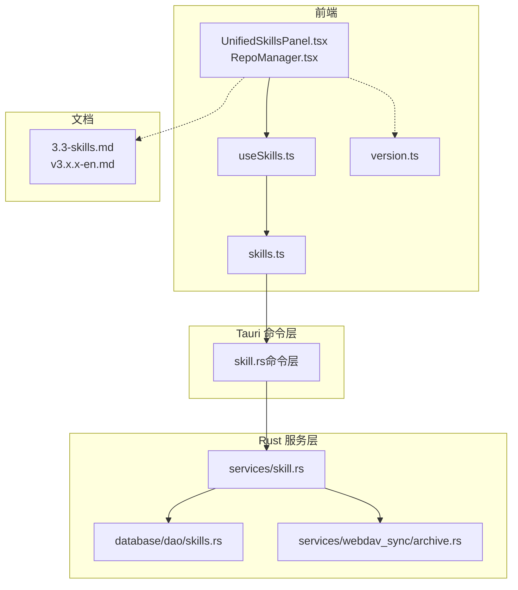
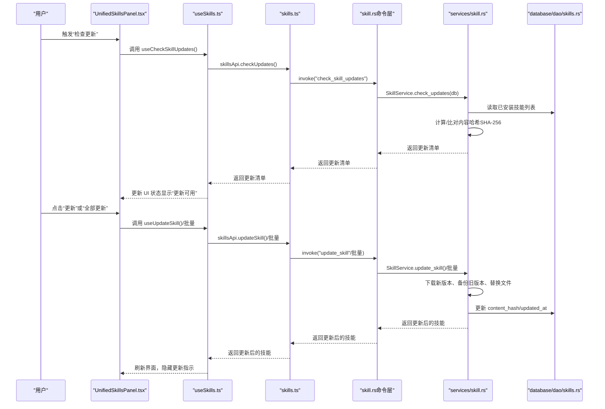
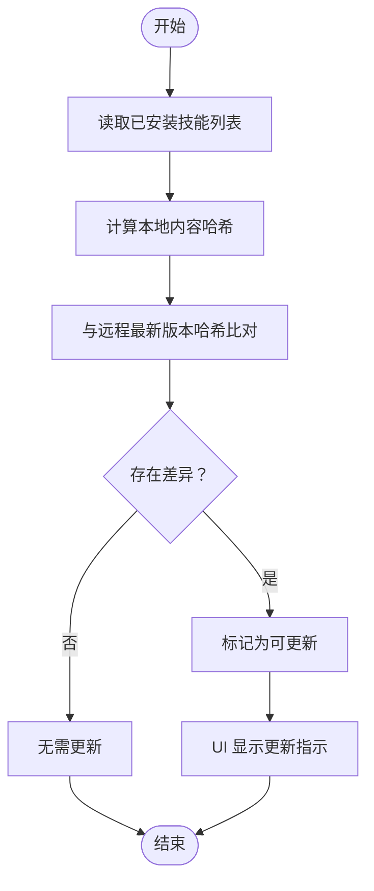
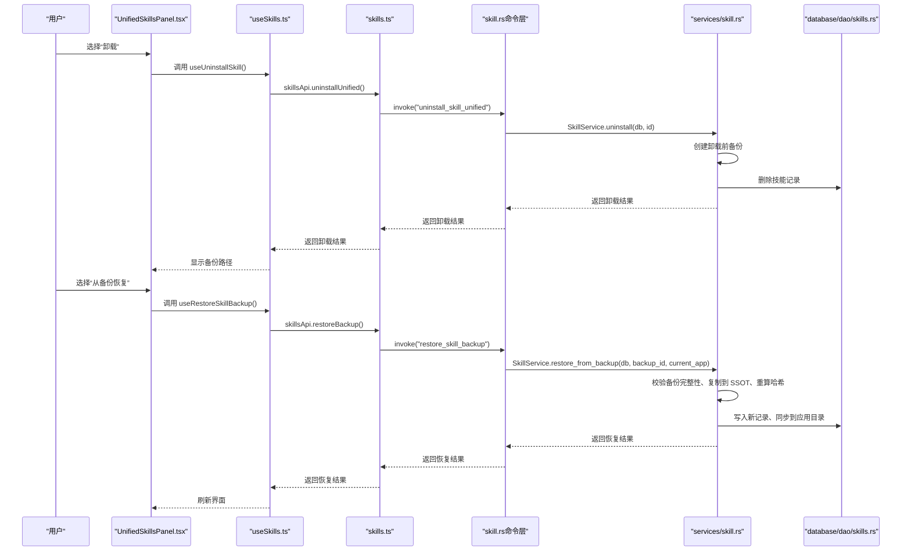
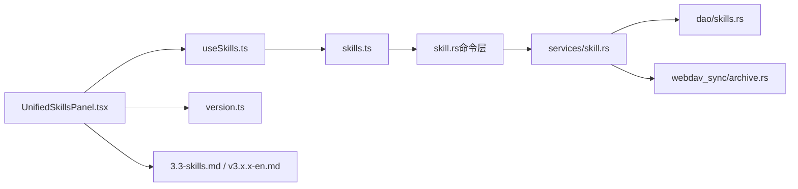

# 技能版本控制

<cite>
**本文引用的文件**
- [version.ts](file://src/lib/version.ts)
- [useSkills.ts](file://src/hooks/useSkills.ts)
- [skills.ts](file://src/lib/api/skills.ts)
- [skill.rs](file://src-tauri/src/services/skill.rs)
- [skill.rs（命令层）](file://src-tauri/src/commands/skill.rs)
- [skills.rs（DAO）](file://src-tauri/src/database/dao/skills.rs)
- [archive.rs](file://src-tauri/src/services/webdav_sync/archive.rs)
- [3.3-skills.md（英文用户手册）](file://docs/user-manual/en/3-extensions/3.3-skills.md)
- [v3.13.0-en.md（发行说明）](file://docs/release-notes/v3.13.0-en.md)
- [v3.16.2-en.md（发行说明）](file://docs/release-notes/v3.16.2-en.md)
- [UnifiedSkillsPanel.tsx](file://src/components/skills/UnifiedSkillsPanel.tsx)
- [RepoManager.tsx](file://src/components/skills/RepoManager.tsx)
- [App.tsx](file://src/App.tsx)
</cite>

## 目录
1. [简介](#简介)
2. [项目结构](#项目结构)
3. [核心组件](#核心组件)
4. [架构总览](#架构总览)
5. [详细组件分析](#详细组件分析)
6. [依赖关系分析](#依赖关系分析)
7. [性能考量](#性能考量)
8. [故障排查指南](#故障排查指南)
9. [结论](#结论)
10. [附录](#附录)

## 简介
本指南面向 CC Switch 的“技能版本控制”能力，围绕以下目标展开：  
- 解释技能版本管理的概念与重要性（版本号规则、更新日志、兼容性说明）。  
- 详解技能更新检查机制（版本比较算法、自动更新通知、手动更新流程）。  
- 深入讲解技能回滚功能（版本历史记录、快照管理、降级操作）。  
- 提供技能版本冲突的处理方法（多版本并存、版本切换、依赖解析）。  
- 总结版本控制的最佳实践（版本发布策略、向后兼容性保证、用户升级指导）。

## 项目结构
技能版本控制涉及前端 UI、React Query 钩子、Tauri 命令层、Rust 服务层与数据库 DAO 层，以及用户手册与发行说明文档。整体分层如下：

图示来源
- [UnifiedSkillsPanel.tsx:1-200](file://src/components/skills/UnifiedSkillsPanel.tsx#L1-L200)
- [useSkills.ts:1-359](file://src/hooks/useSkills.ts#L1-L359)
- [skills.ts:1-284](file://src/lib/api/skills.ts#L1-L284)
- [skill.rs（命令层）:1-200](file://src-tauri/src/commands/skill.rs#L1-L200)
- [skill.rs（服务层）:1-200](file://src-tauri/src/services/skill.rs#L1-L200)
- [skills.rs（DAO）:167-204](file://src-tauri/src/database/dao/skills.rs#L167-L204)
- [archive.rs:145-239](file://src-tauri/src/services/webdav_sync/archive.rs#L145-L239)
- [3.3-skills.md（英文用户手册）:190-287](file://docs/user-manual/en/3-extensions/3.3-skills.md#L190-L287)

章节来源
- [3.3-skills.md（英文用户手册）:1-287](file://docs/user-manual/en/3-extensions/3.3-skills.md#L1-L287)
- [v3.13.0-en.md（发行说明）:89-96](file://docs/release-notes/v3.13.0-en.md#L89-L96)

## 核心组件
- 版本比较与更新检测：前端使用轻量 semver 比较工具与 React Query 钩子驱动的更新检测流程；后端以 SHA-256 内容哈希对比实现精确更新检测。
- 单个与批量更新：支持单个技能更新与“全部更新”批量操作，UI 自动刷新状态。
- 回滚与备份：卸载前自动备份至独立目录，支持从备份恢复；WebDAV/S3 同步也提供技能快照备份。
- 存储位置迁移：可在 CC Switch 内置目录与社区统一目录之间安全迁移，不丢失技能状态。
- 仓库与公共注册表：支持自定义仓库与 skills.sh 公共注册表搜索与安装。

章节来源
- [version.ts:1-86](file://src/lib/version.ts#L1-L86)
- [useSkills.ts:286-359](file://src/hooks/useSkills.ts#L286-L359)
- [skills.ts:136-284](file://src/lib/api/skills.ts#L136-L284)
- [skill.rs（服务层）:1149-1228](file://src-tauri/src/services/skill.rs#L1149-L1228)
- [skill.rs（命令层）:133-158](file://src-tauri/src/commands/skill.rs#L133-L158)
- [skills.rs（DAO）:167-204](file://src-tauri/src/database/dao/skills.rs#L167-L204)
- [archive.rs:145-239](file://src-tauri/src/services/webdav_sync/archive.rs#L145-L239)
- [3.3-skills.md（英文用户手册）:190-287](file://docs/user-manual/en/3-extensions/3.3-skills.md#L190-L287)

## 架构总览
技能版本控制的端到端流程如下：

图示来源
- [UnifiedSkillsPanel.tsx:246-400](file://src/components/skills/UnifiedSkillsPanel.tsx#L246-L400)
- [useSkills.ts:286-359](file://src/hooks/useSkills.ts#L286-L359)
- [skills.ts:197-205](file://src/lib/api/skills.ts#L197-L205)
- [skill.rs（命令层）:133-158](file://src-tauri/src/commands/skill.rs#L133-L158)
- [skill.rs（服务层）:939-1116](file://src-tauri/src/services/skill.rs#L939-L1116)
- [skills.rs（DAO）:167-204](file://src-tauri/src/database/dao/skills.rs#L167-L204)

## 详细组件分析

### 版本号规则与兼容性说明
- 版本号规则：前端采用轻量 semver 比较工具，支持主/次/补丁三段式与预发布标识符段，确保“抢先/预发布通道”不会误报更新。
- 兼容性说明：更新检测基于内容哈希而非版本号，避免因预发布通道导致的误判；同时保留“存储位置切换”与“应用启用状态”的兼容性。

章节来源
- [version.ts:1-86](file://src/lib/version.ts#L1-L86)
- [3.3-skills.md（英文用户手册）:190-218](file://docs/user-manual/en/3-extensions/3.3-skills.md#L190-L218)

### 技能更新检查机制
- 更新检测算法：后端对每个已安装技能计算 SSOT 目录下的内容哈希，与远程仓库最新版本进行比对，任何文件变更即标记为“可更新”。
- 自动更新通知：UI 通过查询钩子周期性拉取更新清单，自动显示“更新可用”指示。
- 手动更新流程：用户点击“更新”或“全部更新”，前端调用相应 mutation，后端执行下载、备份、替换与哈希更新，最后刷新 UI。

图示来源
- [skill.rs（服务层）:939-988](file://src-tauri/src/services/skill.rs#L939-L988)
- [skills.rs（DAO）:167-204](file://src-tauri/src/database/dao/skills.rs#L167-L204)
- [useSkills.ts:286-359](file://src/hooks/useSkills.ts#L286-L359)

章节来源
- [skill.rs（服务层）:939-1116](file://src-tauri/src/services/skill.rs#L939-L1116)
- [useSkills.ts:286-359](file://src/hooks/useSkills.ts#L286-L359)
- [skills.ts:197-205](file://src/lib/api/skills.ts#L197-L205)
- [3.3-skills.md（英文用户手册）:190-218](file://docs/user-manual/en/3-extensions/3.3-skills.md#L190-L218)

### 技能回滚功能
- 备份策略：卸载前自动备份到独立目录，包含技能元数据与文件树；支持删除与从备份恢复。
- 恢复流程：从备份恢复时，校验备份完整性，写入新的 SSOT 目录与数据库记录，再同步到当前应用目录。
- 快照管理：WebDAV/S3 同步过程中，先备份当前技能快照，再应用新快照，失败时可回滚。

图示来源
- [skill.rs（命令层）:67-85](file://src-tauri/src/commands/skill.rs#L67-L85)
- [skill.rs（服务层）:1264-1347](file://src-tauri/src/services/skill.rs#L1264-L1347)
- [skills.rs（DAO）:167-204](file://src-tauri/src/database/dao/skills.rs#L167-L204)
- [useSkills.ts:150-165](file://src/hooks/useSkills.ts#L150-L165)
- [archive.rs:145-239](file://src-tauri/src/services/webdav_sync/archive.rs#L145-L239)

章节来源
- [skill.rs（服务层）:1264-1347](file://src-tauri/src/services/skill.rs#L1264-L1347)
- [useSkills.ts:150-165](file://src/hooks/useSkills.ts#L150-L165)
- [skills.ts:144-173](file://src/lib/api/skills.ts#L144-L173)
- [archive.rs:145-239](file://src-tauri/src/services/webdav_sync/archive.rs#L145-L239)

### 版本冲突与多版本并存
- 多版本并存：通过“存储位置切换”在 CC Switch 内置目录与社区统一目录之间迁移，不改变已安装技能状态；不同来源的同名目录会被识别并跳过。
- 版本切换：通过“应用启用状态”在不同应用间切换技能启用与否，互不影响其他应用的启用状态。
- 依赖解析：技能安装时会解析元数据与目录冲突，避免重复安装；仓库分支与路径配置错误会导致扫描失败，需在 UI 中修正。

章节来源
- [skill.rs（服务层）:1149-1228](file://src-tauri/src/services/skill.rs#L1149-L1228)
- [skill.rs（服务层）:2612-2642](file://src-tauri/src/services/skill.rs#L2612-L2642)
- [RepoManager.tsx:47-97](file://src/components/skills/RepoManager.tsx#L47-L97)
- [3.3-skills.md（英文用户手册）:190-287](file://docs/user-manual/en/3-extensions/3.3-skills.md#L190-L287)

### 版本控制最佳实践
- 版本发布策略：建议采用语义化版本号，配合内容哈希更新检测，减少误报与漏报。
- 向后兼容性：保持仓库分支与路径稳定，避免破坏性变更；必要时提供迁移脚本或提示。
- 用户升级指导：在发行说明中明确更新流程与注意事项；提供一键“全部更新”与“从备份恢复”的便捷入口。

章节来源
- [v3.13.0-en.md（发行说明）:89-96](file://docs/release-notes/v3.13.0-en.md#L89-L96)
- [v3.16.2-en.md（发行说明）:60-91](file://docs/release-notes/v3.16.2-en.md#L60-L91)
- [3.3-skills.md（英文用户手册）:190-287](file://docs/user-manual/en/3-extensions/3.3-skills.md#L190-L287)

## 依赖关系分析
- 前端依赖：UI 通过 React Query 钩子与 API 封装调用 Tauri 命令；版本比较工具用于工具自身版本判断。
- 后端依赖：命令层封装服务层调用；服务层依赖数据库 DAO 读写技能与仓库信息；同步模块负责快照备份与恢复。
- 文档与用户手册：发行说明与用户手册共同定义功能范围与使用流程。

图示来源
- [UnifiedSkillsPanel.tsx:1-200](file://src/components/skills/UnifiedSkillsPanel.tsx#L1-L200)
- [useSkills.ts:1-359](file://src/hooks/useSkills.ts#L1-L359)
- [skills.ts:1-284](file://src/lib/api/skills.ts#L1-L284)
- [skill.rs（命令层）:1-200](file://src-tauri/src/commands/skill.rs#L1-L200)
- [skill.rs（服务层）:1-200](file://src-tauri/src/services/skill.rs#L1-L200)
- [skills.rs（DAO）:167-204](file://src-tauri/src/database/dao/skills.rs#L167-L204)
- [archive.rs:145-239](file://src-tauri/src/services/webdav_sync/archive.rs#L145-L239)
- [version.ts:1-86](file://src/lib/version.ts#L1-L86)
- [3.3-skills.md（英文用户手册）:1-287](file://docs/user-manual/en/3-extensions/3.3-skills.md#L1-L287)

章节来源
- [skill.rs（服务层）:1-200](file://src-tauri/src/services/skill.rs#L1-L200)
- [skills.rs（DAO）:167-204](file://src-tauri/src/database/dao/skills.rs#L167-L204)
- [archive.rs:145-239](file://src-tauri/src/services/webdav_sync/archive.rs#L145-L239)

## 性能考量
- 哈希计算：内容哈希计算为 I/O 密集型操作，建议在批量更新时合并请求，减少多次扫描。
- 并发更新：批量更新应串行或受控并发，避免磁盘争用与网络抖动。
- 缓存策略：前端使用 React Query 缓存已安装技能与更新清单，合理设置 staleTime 与 refetch 策略。
- 网络与权限：仓库访问与下载需考虑网络稳定性与权限问题，失败时提供重试与错误提示。

## 故障排查指南
- 空技能列表：检查网络连接、仓库配置与分支设置，点击“刷新”重试。
- 安装失败：检查磁盘空间与目录权限，确认网络连通性。
- 更新按钮不显示：点击“刷新”重新扫描，确认仓库配置正确。
- 卸载后无法恢复：检查备份目录是否存在，确认备份完整性；必要时从 WebDAV/S3 快照恢复。
- 存储位置迁移失败：检查目标目录权限与磁盘空间，确保无同名冲突。

章节来源
- [3.3-skills.md（英文用户手册）:247-287](file://docs/user-manual/en/3-extensions/3.3-skills.md#L247-L287)
- [skill.rs（服务层）:1264-1347](file://src-tauri/src/services/skill.rs#L1264-L1347)
- [archive.rs:145-239](file://src-tauri/src/services/webdav_sync/archive.rs#L145-L239)

## 结论
CC Switch 的技能版本控制以内容哈希为核心，结合前端 UI 与后端服务层实现了可靠的更新检测、批量更新、回滚与快照管理能力。通过“存储位置切换”与“应用启用状态”实现多版本并存与灵活依赖解析。建议在发布策略中坚持语义化版本与内容哈希双轨验证，在用户手册与发行说明中清晰指引升级流程与风险提示。

## 附录
- 版本比较工具：提供轻量 semver 比较，避免“抢先/预发布通道”误报。
- 更新检测与批量更新：UI 提供“检查更新”“更新”“全部更新”入口，后端以哈希比对实现精准更新。
- 回滚与快照：卸载前自动备份，支持从备份恢复；同步模块提供技能快照备份与回滚。
- 仓库与公共注册表：支持自定义仓库与 skills.sh 搜索安装。

章节来源
- [version.ts:1-86](file://src/lib/version.ts#L1-L86)
- [useSkills.ts:286-359](file://src/hooks/useSkills.ts#L286-L359)
- [skills.ts:136-284](file://src/lib/api/skills.ts#L136-L284)
- [skill.rs（服务层）:1149-1228](file://src-tauri/src/services/skill.rs#L1149-L1228)
- [skill.rs（命令层）:133-158](file://src-tauri/src/commands/skill.rs#L133-L158)
- [skills.rs（DAO）:167-204](file://src-tauri/src/database/dao/skills.rs#L167-L204)
- [archive.rs:145-239](file://src-tauri/src/services/webdav_sync/archive.rs#L145-L239)
- [3.3-skills.md（英文用户手册）:190-287](file://docs/user-manual/en/3-extensions/3.3-skills.md#L190-L287)