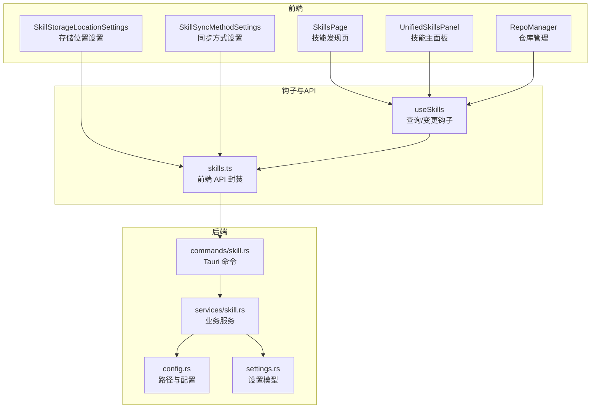
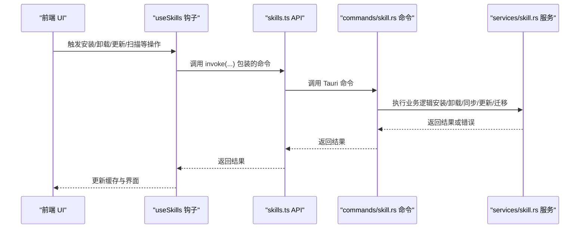
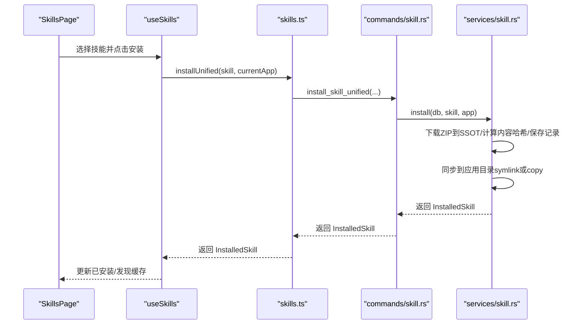
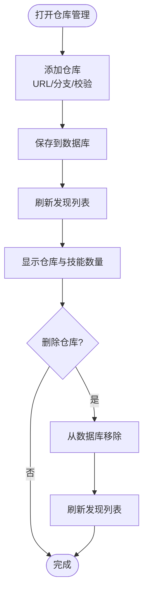
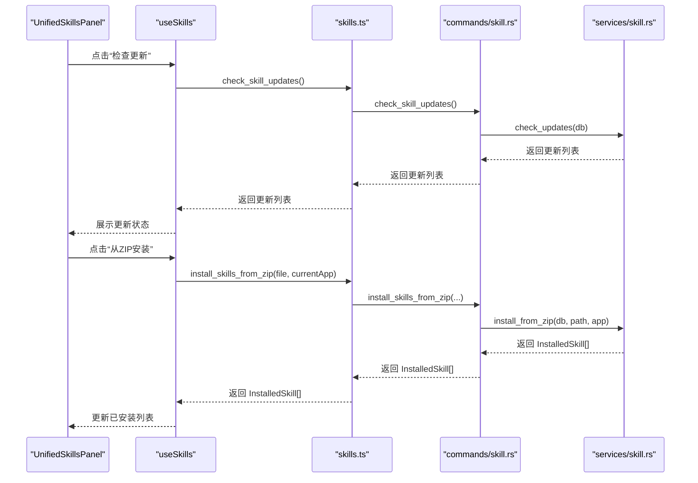
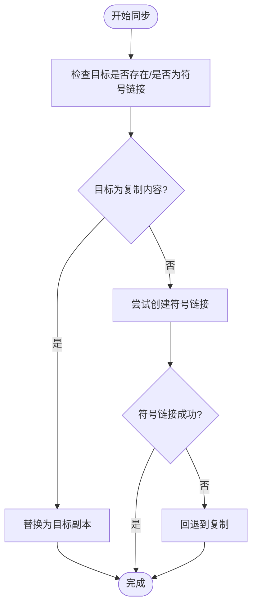
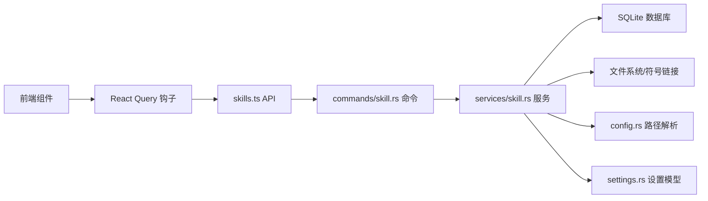

# 技能系统

<cite>
**本文引用的文件**
- [SkillsPage.tsx](file://src/components/skills/SkillsPage.tsx)
- [RepoManager.tsx](file://src/components/skills/RepoManager.tsx)
- [UnifiedSkillsPanel.tsx](file://src/components/skills/UnifiedSkillsPanel.tsx)
- [useSkills.ts](file://src/hooks/useSkills.ts)
- [useSkills.helpers.ts](file://src/hooks/useSkills.helpers.ts)
- [skills.ts](file://src/lib/api/skills.ts)
- [skill.rs](file://src-tauri/src/services/skill.rs)
- [skill.rs（命令层）](file://src-tauri/src/commands/skill.rs)
- [SkillStorageLocationSettings.tsx](file://src/components/settings/SkillStorageLocationSettings.tsx)
- [SkillSyncMethodSettings.tsx](file://src/components/settings/SkillSyncMethodSettings.tsx)
- [settings.rs](file://src-tauri/src/settings.rs)
- [config.rs](file://src-tauri/src/config.rs)
- [3.3-skills.md（中文用户手册）](file://docs/user-manual/zh/3-extensions/3.3-skills.md)
- [5.1-config-files.md（FAQ）](file://docs/user-manual/en/5-faq/5.1-config-files.md)
</cite>

## 目录
1. [简介](#简介)
2. [项目结构](#项目结构)
3. [核心组件](#核心组件)
4. [架构总览](#架构总览)
5. [详细组件分析](#详细组件分析)
6. [依赖关系分析](#依赖关系分析)
7. [性能考量](#性能考量)
8. [故障排除指南](#故障排除指南)
9. [结论](#结论)
10. [附录](#附录)

## 简介
CC Switch 的技能系统（Skills）是一个统一的可复用能力扩展框架，为 Claude、Codex、Gemini、OpenCode、Hermes 等 AI 工具提供标准化的技能安装、管理、同步与更新能力。系统采用“单一事实源（SSOT）”设计，将技能主副本集中存储在 CC Switch 的配置目录中，并按需同步到各应用的技能目录；同时支持符号链接（symlink）与文件复制（copy）两种同步方式，兼顾磁盘空间与兼容性。

## 项目结构
技能系统涉及前端 UI、React Query 钩子、API 层以及 Rust 后端服务与命令层，形成清晰的分层架构：
- 前端 UI：技能发现页、技能主面板、仓库管理弹窗、设置项等
- 钩子层：封装查询与变更操作，统一缓存与状态管理
- API 层：前端调用 Tauri 命令，Rust 后端执行具体逻辑
- 服务层：实现安装、卸载、同步、更新、迁移等核心业务逻辑
- 设置层：持久化技能存储位置与同步方式等用户偏好

图表来源
- [SkillsPage.tsx:1-619](file://src/components/skills/SkillsPage.tsx#L1-L619)
- [UnifiedSkillsPanel.tsx:1-870](file://src/components/skills/UnifiedSkillsPanel.tsx#L1-L870)
- [RepoManager.tsx:1-203](file://src/components/skills/RepoManager.tsx#L1-L203)
- [useSkills.ts:1-359](file://src/hooks/useSkills.ts#L1-L359)
- [skills.ts:1-284](file://src/lib/api/skills.ts#L1-L284)
- [skill.rs（命令层）:1-337](file://src-tauri/src/commands/skill.rs#L1-L337)
- [skill.rs:1-3128](file://src-tauri/src/services/skill.rs#L1-L3128)
- [config.rs:1-200](file://src-tauri/src/config.rs#L1-L200)
- [settings.rs:413-553](file://src-tauri/src/settings.rs#L413-L553)

章节来源
- [SkillsPage.tsx:1-619](file://src/components/skills/SkillsPage.tsx#L1-L619)
- [useSkills.ts:1-359](file://src/hooks/useSkills.ts#L1-L359)
- [skills.ts:1-284](file://src/lib/api/skills.ts#L1-L284)
- [skill.rs（命令层）:1-337](file://src-tauri/src/commands/skill.rs#L1-L337)
- [skill.rs:1-3128](file://src-tauri/src/services/skill.rs#L1-L3128)
- [config.rs:1-200](file://src-tauri/src/config.rs#L1-L200)
- [settings.rs:413-553](file://src-tauri/src/settings.rs#L413-L553)

## 核心组件
- 技能发现页（SkillsPage）：提供仓库与 skills.sh 双源搜索、过滤与安装入口，支持刷新与仓库管理弹窗。
- 技能主面板（UnifiedSkillsPanel）：展示已安装技能、应用启用状态、更新检测与批量更新、从 ZIP 安装、从备份恢复、扫描未管理技能等。
- 仓库管理（RepoManager）：添加/删除自定义仓库，支持从 skills.sh 快速添加。
- 钩子与 API（useSkills、skills.ts）：封装查询与变更操作，统一缓存策略与错误处理。
- 服务与命令（skill.rs、commands/skill.rs）：实现安装、卸载、同步、更新、迁移、ZIP 安装等核心逻辑。
- 设置项（SkillStorageLocationSettings、SkillSyncMethodSettings）：切换存储位置与同步方式。

章节来源
- [SkillsPage.tsx:1-619](file://src/components/skills/SkillsPage.tsx#L1-L619)
- [UnifiedSkillsPanel.tsx:1-870](file://src/components/skills/UnifiedSkillsPanel.tsx#L1-L870)
- [RepoManager.tsx:1-203](file://src/components/skills/RepoManager.tsx#L1-L203)
- [useSkills.ts:1-359](file://src/hooks/useSkills.ts#L1-L359)
- [skills.ts:1-284](file://src/lib/api/skills.ts#L1-L284)
- [skill.rs（命令层）:1-337](file://src-tauri/src/commands/skill.rs#L1-L337)
- [skill.rs:1-3128](file://src-tauri/src/services/skill.rs#L1-L3128)
- [SkillStorageLocationSettings.tsx:1-166](file://src/components/settings/SkillStorageLocationSettings.tsx#L1-L166)
- [SkillSyncMethodSettings.tsx:1-79](file://src/components/settings/SkillSyncMethodSettings.tsx#L1-L79)

## 架构总览
技能系统的统一管理架构基于“单一事实源（SSOT）”：所有技能以 ZIP 形式下载至 SSOT 目录（默认 ~/.cc-switch/skills/ 或 ~/.agents/skills/），随后按需同步到各应用的技能目录。安装/卸载/更新均通过 Rust 服务层执行，前端通过 Tauri 命令调用，保证一致性与可靠性。

图表来源
- [useSkills.ts:1-359](file://src/hooks/useSkills.ts#L1-L359)
- [skills.ts:136-283](file://src/lib/api/skills.ts#L136-L283)
- [skill.rs（命令层）:27-337](file://src-tauri/src/commands/skill.rs#L27-L337)
- [skill.rs:567-780](file://src-tauri/src/services/skill.rs#L567-L780)

章节来源
- [useSkills.ts:1-359](file://src/hooks/useSkills.ts#L1-L359)
- [skills.ts:136-283](file://src/lib/api/skills.ts#L136-L283)
- [skill.rs（命令层）:27-337](file://src-tauri/src/commands/skill.rs#L27-L337)
- [skill.rs:567-780](file://src-tauri/src/services/skill.rs#L567-L780)

## 详细组件分析

### 技能发现与安装流程
- 仓库模式：从已配置仓库扫描技能，支持按仓库、安装状态与关键词过滤，点击“安装”后调用统一安装命令。
- skills.sh 模式：通过搜索接口返回公共注册表结果，支持分页加载与“加载更多”。

图表来源
- [SkillsPage.tsx:197-236](file://src/components/skills/SkillsPage.tsx#L197-L236)
- [useSkills.ts:69-110](file://src/hooks/useSkills.ts#L69-L110)
- [skills.ts:154-160](file://src/lib/api/skills.ts#L154-L160)
- [skill.rs（命令层）:52-65](file://src-tauri/src/commands/skill.rs#L52-L65)
- [skill.rs:567-780](file://src-tauri/src/services/skill.rs#L567-L780)

章节来源
- [SkillsPage.tsx:197-236](file://src/components/skills/SkillsPage.tsx#L197-L236)
- [useSkills.ts:69-110](file://src/hooks/useSkills.ts#L69-L110)
- [skills.ts:154-160](file://src/lib/api/skills.ts#L154-L160)
- [skill.rs（命令层）:52-65](file://src-tauri/src/commands/skill.rs#L52-L65)
- [skill.rs:567-780](file://src-tauri/src/services/skill.rs#L567-L780)

### 仓库管理与自定义仓库
- 添加仓库：支持 GitHub URL 解析与分支填写，默认启用。
- 删除仓库：从数据库移除后，相关技能仍可见但无法更新。
- skills.sh 集成：可在仓库管理弹窗中直接搜索并添加。

图表来源
- [RepoManager.tsx:67-89](file://src/components/skills/RepoManager.tsx#L67-L89)
- [useSkills.ts:233-257](file://src/hooks/useSkills.ts#L233-L257)
- [skills.ts:254-267](file://src/lib/api/skills.ts#L254-L267)

章节来源
- [RepoManager.tsx:67-89](file://src/components/skills/RepoManager.tsx#L67-L89)
- [useSkills.ts:233-257](file://src/hooks/useSkills.ts#L233-L257)
- [skills.ts:254-267](file://src/lib/api/skills.ts#L254-L267)

### 技能主面板与管理
- 已安装技能列表：显示名称、描述、来源、更新状态与应用启用状态。
- 更新检测：基于内容哈希比对，支持单项与批量更新。
- 从 ZIP 安装：打开文件对话框选择 ZIP，扫描包含 SKILL.md 的目录并安装。
- 从备份恢复：列出备份项，支持恢复与删除备份。
- 扫描未管理技能：从各应用目录扫描未受控技能并导入。

图表来源
- [UnifiedSkillsPanel.tsx:230-277](file://src/components/skills/UnifiedSkillsPanel.tsx#L230-L277)
- [useSkills.ts:291-326](file://src/hooks/useSkills.ts#L291-L326)
- [skills.ts:197-205](file://src/lib/api/skills.ts#L197-L205)
- [skill.rs（命令层）:134-158](file://src-tauri/src/commands/skill.rs#L134-L158)
- [skill.rs:2529-2547](file://src-tauri/src/services/skill.rs#L2529-L2547)

章节来源
- [UnifiedSkillsPanel.tsx:230-277](file://src/components/skills/UnifiedSkillsPanel.tsx#L230-L277)
- [useSkills.ts:291-326](file://src/hooks/useSkills.ts#L291-L326)
- [skills.ts:197-205](file://src/lib/api/skills.ts#L197-L205)
- [skill.rs（命令层）:134-158](file://src-tauri/src/commands/skill.rs#L134-L158)
- [skill.rs:2529-2547](file://src-tauri/src/services/skill.rs#L2529-L2547)

### 符号链接与文件复制同步机制
- 自动优先：默认尝试创建符号链接，失败则回退到文件复制。
- 强制方式：可强制使用符号链接或文件复制。
- 安全检查：同步前验证源目录存在 SKILL.md，避免误覆盖目标目录。
- 跨平台：Windows 下对目录符号链接与普通文件删除做了差异化处理。

图表来源
- [skill.rs:1599-1647](file://src-tauri/src/services/skill.rs#L1599-L1647)
- [skill.rs:1655-1687](file://src-tauri/src/services/skill.rs#L1655-L1687)

章节来源
- [skill.rs:1599-1647](file://src-tauri/src/services/skill.rs#L1599-L1647)
- [skill.rs:1655-1687](file://src-tauri/src/services/skill.rs#L1655-L1687)

### 技能版本管理与更新检查
- 内容哈希：安装时计算技能内容哈希，后续通过哈希比对检测更新。
- 单项更新：点击技能卡片上的“更新”按钮进行升级。
- 批量更新：点击“全部更新”，逐个下载并刷新状态。
- 更新检测：手动触发或通过 UI 按钮触发，结果缓存 5 分钟。

章节来源
- [useSkills.ts:291-326](file://src/hooks/useSkills.ts#L291-L326)
- [skills.ts:92-98](file://src/lib/api/skills.ts#L92-L98)
- [skill.rs:1143-1147](file://src-tauri/src/services/skill.rs#L1143-L1147)

### 技能存储位置迁移
- 位置切换：在 CC Switch 内置存储与 ~/.agents/skills 之间切换。
- 迁移流程：先移动文件，再更新设置；失败时仍指向旧位置，保证安全性。
- 用户提示：当存在已安装技能时，弹窗确认后再执行迁移。

章节来源
- [SkillStorageLocationSettings.tsx:34-68](file://src/components/settings/SkillStorageLocationSettings.tsx#L34-L68)
- [useSkills.ts:208-212](file://src/hooks/useSkills.ts#L208-L212)
- [skills.ts:207-212](file://src/lib/api/skills.ts#L207-L212)
- [skill.rs:1149-1182](file://src-tauri/src/services/skill.rs#L1149-L1182)

### 与各 AI 工具的集成与配置同步
- 统一启用状态：技能安装后默认启用当前应用，也可在主面板切换到其他应用。
- 应用目录覆盖：支持为 Claude、Codex、Gemini、OpenCode、OpenClaw、Hermes 等设置自定义配置目录覆盖。
- 同步策略：通过设置项控制同步方式（自动/符号链接/复制）。

章节来源
- [useSkills.ts:170-186](file://src/hooks/useSkills.ts#L170-L186)
- [skills.ts:14-23](file://src/lib/api/skills.ts#L14-L23)
- [settings.rs:413-419](file://src-tauri/src/settings.rs#L413-L419)
- [config.rs:36-123](file://src-tauri/src/config.rs#L36-L123)

## 依赖关系分析
- 前端依赖：React、React Query、Tauri invoke、国际化资源。
- 后端依赖：SQLite 数据库、文件系统、路径解析、跨平台符号链接处理。
- 命令与服务：命令层负责参数解析与错误转换，服务层负责业务逻辑与文件操作。

图表来源
- [useSkills.ts:1-359](file://src/hooks/useSkills.ts#L1-L359)
- [skills.ts:1-284](file://src/lib/api/skills.ts#L1-L284)
- [skill.rs（命令层）:1-337](file://src-tauri/src/commands/skill.rs#L1-L337)
- [skill.rs:1-3128](file://src-tauri/src/services/skill.rs#L1-L3128)
- [config.rs:1-200](file://src-tauri/src/config.rs#L1-L200)
- [settings.rs:413-553](file://src-tauri/src/settings.rs#L413-L553)

章节来源
- [useSkills.ts:1-359](file://src/hooks/useSkills.ts#L1-L359)
- [skills.ts:1-284](file://src/lib/api/skills.ts#L1-L284)
- [skill.rs（命令层）:1-337](file://src-tauri/src/commands/skill.rs#L1-L337)
- [skill.rs:1-3128](file://src-tauri/src/services/skill.rs#L1-L3128)
- [config.rs:1-200](file://src-tauri/src/config.rs#L1-L200)
- [settings.rs:413-553](file://src-tauri/src/settings.rs#L413-L553)

## 性能考量
- 缓存策略：安装/卸载/更新等关键查询使用 React Query 缓存与占位数据，减少重复请求。
- 搜索体验：skills.sh 搜索启用占位数据与较短缓存时间，提升交互流畅度。
- 同步策略：默认自动优先符号链接，失败回退复制，兼顾空间与兼容性。
- 批量更新：提供“全部更新”按钮，减少多次网络请求与 UI 刷新。

## 故障排除指南
- 技能列表为空
  - 可能原因：网络异常、仓库配置错误。
  - 处理建议：检查网络、点击“刷新”、核对仓库配置。
- 安装失败
  - 可能原因：网络超时、磁盘空间不足、权限问题。
  - 处理建议：检查网络与磁盘、确认目录权限。
- 更新按钮不出现
  - 可能原因：远端无变更、尚未完成扫描。
  - 处理建议：点击“刷新”重新扫描，确认仓库指向正确分支与路径。
- 卸载后无法恢复
  - 处理建议：使用“从备份恢复”功能，选择对应备份恢复。
- 同步方式导致的问题
  - 处理建议：在设置中切换“同步方式”为复制，或在 Windows 下以管理员身份运行。

章节来源
- [3.3-skills.md（中文用户手册）:247-287](file://docs/user-manual/zh/3-extensions/3.3-skills.md#L247-L287)
- [5.1-config-files.md（FAQ）:1-73](file://docs/user-manual/en/5-faq/5.1-config-files.md#L1-L73)

## 结论
CC Switch 的技能系统通过统一的 SSOT 与灵活的同步策略，实现了跨应用的技能共享与管理。前端提供直观的发现、安装、更新与备份恢复能力，后端以 Rust 服务层保障稳定性与安全性。用户可根据自身需求选择存储位置与同步方式，并借助批量更新与备份恢复机制高效管理技能生态。

## 附录

### 实际安装示例（步骤说明）
- 仓库模式安装
  1) 在“技能发现”页面选择目标技能卡片。
  2) 点击“安装”，等待安装完成。
  3) 在“技能主面板”确认已安装并启用所需应用。
- 从 ZIP 安装
  1) 在“技能主面板”点击“从 ZIP 安装”。
  2) 选择包含技能的 ZIP 文件。
  3) 系统扫描并安装，完成后在列表中可见。
- 从备份恢复
  1) 在“技能主面板”点击“从备份恢复”。
  2) 选择目标备份并确认恢复。
  3) 技能恢复并为当前应用启用。

章节来源
- [SkillsPage.tsx:197-236](file://src/components/skills/SkillsPage.tsx#L197-L236)
- [UnifiedSkillsPanel.tsx:198-228](file://src/components/skills/UnifiedSkillsPanel.tsx#L198-L228)
- [useSkills.ts:150-165](file://src/hooks/useSkills.ts#L150-L165)

### 配置文件结构（重要路径）
- 存储根目录：~/.cc-switch/
- 数据库：cc-switch.db（存储技能安装记录、仓库配置等）
- 技能主副本：skills/
- 卸载备份：skill-backups/
- 设备设置：settings.json（语言、主题、应用配置目录覆盖等）

章节来源
- [5.1-config-files.md（FAQ）:11-20](file://docs/user-manual/en/5-faq/5.1-config-files.md#L11-L20)
- [config.rs:89-128](file://src-tauri/src/config.rs#L89-L128)