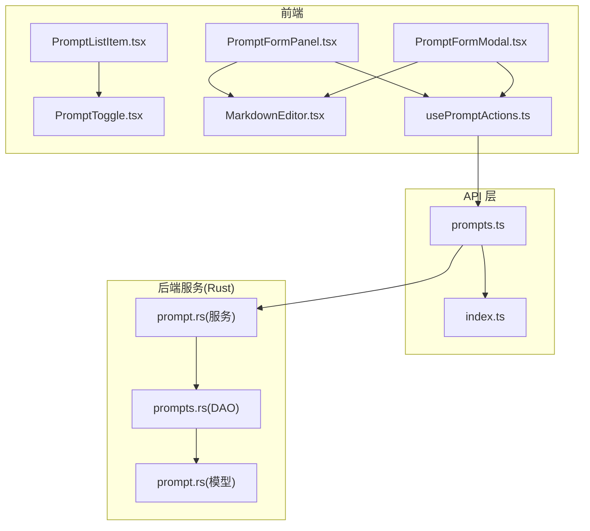
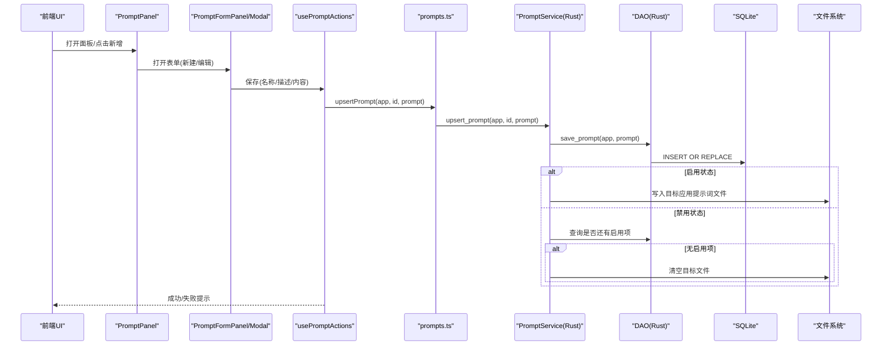
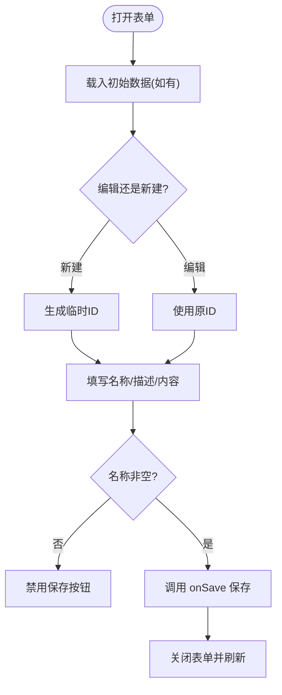
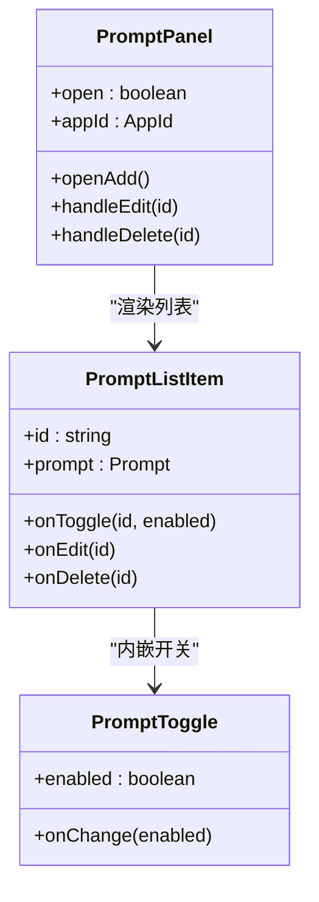
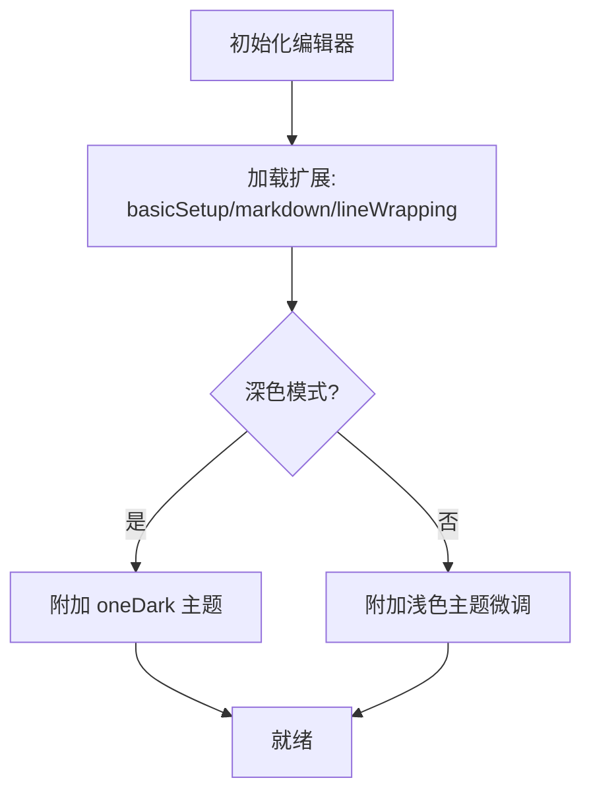
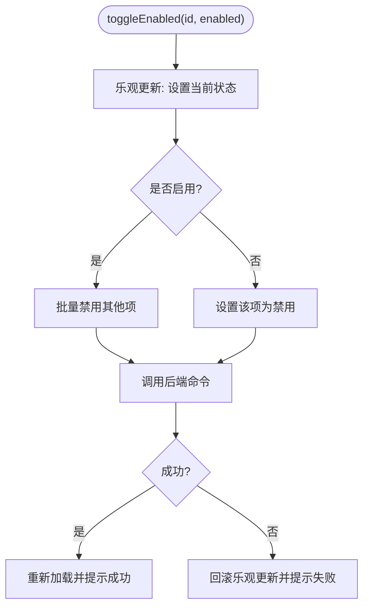
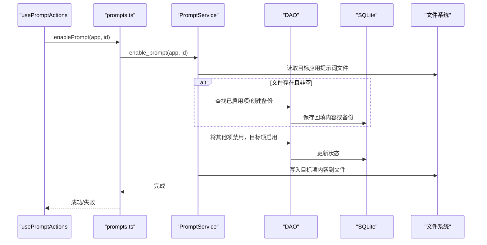
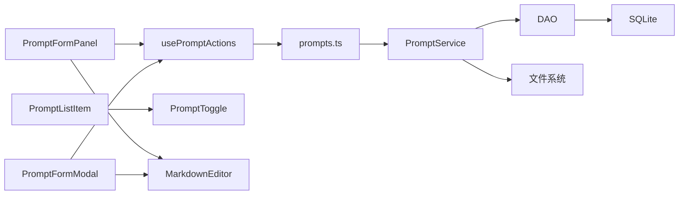

# 提示词创建与编辑

<cite>
**本文引用的文件**
- [PromptFormModal.tsx](file://src/components/prompts/PromptFormModal.tsx)
- [PromptFormPanel.tsx](file://src/components/prompts/PromptFormPanel.tsx)
- [PromptPanel.tsx](file://src/components/prompts/PromptPanel.tsx)
- [PromptListItem.tsx](file://src/components/prompts/PromptListItem.tsx)
- [PromptToggle.tsx](file://src/components/prompts/PromptToggle.tsx)
- [MarkdownEditor.tsx](file://src/components/MarkdownEditor.tsx)
- [usePromptActions.ts](file://src/hooks/usePromptActions.ts)
- [prompts.ts](file://src/lib/api/prompts.ts)
- [index.ts](file://src/lib/api/index.ts)
- [prompt.rs（Rust 数据模型）](file://src-tauri/src/prompt.rs)
- [prompts.rs（DAO）](file://src-tauri/src/database/dao/prompts.rs)
- [prompt.rs（服务层）](file://src-tauri/src/services/prompt.rs)
- [3.2-prompts.md（用户手册）](file://docs/user-manual/zh/3-extensions/3.2-prompts.md)
- [en.json（国际化键）](file://src/i18n/locales/en.json)
</cite>

## 目录
1. [简介](#简介)
2. [项目结构](#项目结构)
3. [核心组件](#核心组件)
4. [架构总览](#架构总览)
5. [详细组件分析](#详细组件分析)
6. [依赖关系分析](#依赖关系分析)
7. [性能考虑](#性能考虑)
8. [故障排查指南](#故障排查指南)
9. [结论](#结论)
10. [附录](#附录)

## 简介
本文件面向 CC Switch 的“提示词（Prompts）”功能，提供从界面使用到后端实现的完整说明。内容涵盖：
- 提示词表单的使用方法：名称设置、描述与内容编辑、配置选项
- Markdown 编辑器的功能特性：语法高亮、实时预览、主题适配与只读模式
- 提示词的保存、更新与删除流程
- 启用/禁用机制与单一激活策略
- 提示词模板使用指南与最佳实践
- 常见问题与性能优化建议

## 项目结构
提示词功能由前端组件与后端服务协同实现，主要涉及：
- 前端：表单面板、列表项、切换开关、Markdown 编辑器、动作钩子
- 后端：数据模型、DAO 层、服务层（含文件写入与回填逻辑）

图表来源
- [PromptFormPanel.tsx:18-154](file://src/components/prompts/PromptFormPanel.tsx#L18-L154)
- [PromptFormModal.tsx:24-160](file://src/components/prompts/PromptFormModal.tsx#L24-L160)
- [PromptListItem.tsx:16-70](file://src/components/prompts/PromptListItem.tsx#L16-L70)
- [PromptToggle.tsx:13-38](file://src/components/prompts/PromptToggle.tsx#L13-L38)
- [MarkdownEditor.tsx:19-156](file://src/components/MarkdownEditor.tsx#L19-L156)
- [usePromptActions.ts:6-151](file://src/hooks/usePromptActions.ts#L6-L151)
- [prompts.ts:14-38](file://src/lib/api/prompts.ts#L14-L38)
- [index.ts:6-6](file://src/lib/api/index.ts#L6-L6)
- [prompt.rs（Rust 数据模型）:3-16](file://src-tauri/src/prompt.rs#L3-L16)
- [prompts.rs（DAO）:11-88](file://src-tauri/src/database/dao/prompts.rs#L11-L88)
- [prompt.rs（服务层）:20-144](file://src-tauri/src/services/prompt.rs#L20-L144)

章节来源
- [PromptPanel.tsx:20-163](file://src/components/prompts/PromptPanel.tsx#L20-L163)
- [PromptFormPanel.tsx:18-154](file://src/components/prompts/PromptFormPanel.tsx#L18-L154)
- [PromptFormModal.tsx:24-160](file://src/components/prompts/PromptFormModal.tsx#L24-L160)
- [MarkdownEditor.tsx:19-156](file://src/components/MarkdownEditor.tsx#L19-L156)
- [usePromptActions.ts:6-151](file://src/hooks/usePromptActions.ts#L6-L151)
- [prompts.ts:14-38](file://src/lib/api/prompts.ts#L14-L38)
- [prompt.rs（Rust 数据模型）:3-16](file://src-tauri/src/prompt.rs#L3-L16)
- [prompts.rs（DAO）:11-88](file://src-tauri/src/database/dao/prompts.rs#L11-L88)
- [prompt.rs（服务层）:20-144](file://src-tauri/src/services/prompt.rs#L20-L144)

## 核心组件
- 表单组件
  - PromptFormPanel：全屏表单，用于创建/编辑提示词
  - PromptFormModal：弹窗表单，用于创建/编辑提示词（移动端/紧凑布局）
- 列表与交互
  - PromptPanel：提示词列表面板，提供新增、编辑、删除、启用/禁用入口
  - PromptListItem：列表项，展示名称、描述、启用开关与操作按钮
  - PromptToggle：提示词专用开关，启用为绿色，禁用为灰色
- 编辑器
  - MarkdownEditor：基于 CodeMirror 的 Markdown 编辑器，支持语法高亮、占位符、主题切换与只读模式
- 动作钩子
  - usePromptActions：封装提示词的加载、保存、删除、启用/禁用、从文件导入等操作
- API 与后端
  - prompts.ts：前端调用后端命令（Tauri invoke）
  - prompt.rs（服务层）：实现提示词启用/禁用、文件写入、回填与导入
  - prompts.rs（DAO）：数据库 CRUD
  - prompt.rs（模型）：提示词数据结构

章节来源
- [PromptFormPanel.tsx:18-154](file://src/components/prompts/PromptFormPanel.tsx#L18-L154)
- [PromptFormModal.tsx:24-160](file://src/components/prompts/PromptFormModal.tsx#L24-L160)
- [PromptPanel.tsx:20-163](file://src/components/prompts/PromptPanel.tsx#L20-L163)
- [PromptListItem.tsx:16-70](file://src/components/prompts/PromptListItem.tsx#L16-L70)
- [PromptToggle.tsx:13-38](file://src/components/prompts/PromptToggle.tsx#L13-L38)
- [MarkdownEditor.tsx:19-156](file://src/components/MarkdownEditor.tsx#L19-L156)
- [usePromptActions.ts:6-151](file://src/hooks/usePromptActions.ts#L6-L151)
- [prompts.ts:14-38](file://src/lib/api/prompts.ts#L14-L38)
- [prompt.rs（Rust 数据模型）:3-16](file://src-tauri/src/prompt.rs#L3-L16)
- [prompts.rs（DAO）:11-88](file://src-tauri/src/database/dao/prompts.rs#L11-L88)
- [prompt.rs（服务层）:20-144](file://src-tauri/src/services/prompt.rs#L20-L144)

## 架构总览
提示词工作流从 UI 到持久化与文件落盘的完整链路如下：

图表来源
- [PromptPanel.tsx:33-91](file://src/components/prompts/PromptPanel.tsx#L33-L91)
- [PromptFormPanel.tsx:66-91](file://src/components/prompts/PromptFormPanel.tsx#L66-L91)
- [usePromptActions.ts:34-60](file://src/hooks/usePromptActions.ts#L34-L60)
- [prompts.ts:19-21](file://src/lib/api/prompts.ts#L19-L21)
- [prompt.rs（服务层）:28-58](file://src-tauri/src/services/prompt.rs#L28-L58)
- [prompts.rs（DAO）:56-76](file://src-tauri/src/database/dao/prompts.rs#L56-L76)

## 详细组件分析

### 表单组件：PromptFormPanel 与 PromptFormModal
- 功能要点
  - 名称必填校验，描述可选，内容为 Markdown 文本
  - 支持暗/亮主题随系统切换，编辑器高度可配置
  - 保存时自动生成时间戳，启用状态继承自初始数据
- 交互流程
  - 新建：id 由时间戳生成；编辑：复用原 id
  - 保存后回调 onClose 关闭表单并刷新列表

图表来源
- [PromptFormPanel.tsx:58-91](file://src/components/prompts/PromptFormPanel.tsx#L58-L91)
- [PromptFormModal.tsx:65-98](file://src/components/prompts/PromptFormModal.tsx#L65-L98)

章节来源
- [PromptFormPanel.tsx:18-154](file://src/components/prompts/PromptFormPanel.tsx#L18-L154)
- [PromptFormModal.tsx:24-160](file://src/components/prompts/PromptFormModal.tsx#L24-L160)

### 列表与交互：PromptPanel、PromptListItem、PromptToggle
- PromptPanel
  - 加载提示词列表，监听面板打开事件自动刷新
  - 支持新增、编辑、删除、启用/禁用
  - 监听“提示词导入”事件，跨应用导入后自动刷新
- PromptListItem
  - 展示名称与可选描述
  - 内嵌 PromptToggle 控制启用状态
  - 提供编辑与删除按钮
- PromptToggle
  - 启用为绿色，禁用为灰色
  - 支持禁用态与无障碍属性

图表来源
- [PromptPanel.tsx:20-163](file://src/components/prompts/PromptPanel.tsx#L20-L163)
- [PromptListItem.tsx:16-70](file://src/components/prompts/PromptListItem.tsx#L16-L70)
- [PromptToggle.tsx:13-38](file://src/components/prompts/PromptToggle.tsx#L13-L38)

章节来源
- [PromptPanel.tsx:20-163](file://src/components/prompts/PromptPanel.tsx#L20-L163)
- [PromptListItem.tsx:16-70](file://src/components/prompts/PromptListItem.tsx#L16-L70)
- [PromptToggle.tsx:13-38](file://src/components/prompts/PromptToggle.tsx#L13-L38)

### Markdown 编辑器：MarkdownEditor
- 特性
  - 语法高亮：基于 @codemirror/lang-markdown
  - 实时预览：编辑器滚动与换行
  - 主题适配：支持深色/浅色模式，浅色模式下微调配色以融入 UI
  - 只读模式：隐藏光标与活动行高亮
  - 占位符：支持国际化占位符文本
- 性能与体验
  - 使用 EditorView 管理状态与更新，外部 value 变更时局部更新
  - 支持最小/最大高度控制，避免布局抖动

图表来源
- [MarkdownEditor.tsx:59-113](file://src/components/MarkdownEditor.tsx#L59-L113)

章节来源
- [MarkdownEditor.tsx:19-156](file://src/components/MarkdownEditor.tsx#L19-L156)

### 动作钩子：usePromptActions
- 职责
  - 加载提示词：同时获取提示词列表与当前文件内容
  - 保存/删除/启用/禁用：封装 toast 提示与乐观更新
  - 切换启用时的“单一激活”策略：先禁用其他项，再启用目标项
- 错误处理
  - 失败时回滚乐观更新并提示错误

图表来源
- [usePromptActions.ts:76-127](file://src/hooks/usePromptActions.ts#L76-L127)

章节来源
- [usePromptActions.ts:6-151](file://src/hooks/usePromptActions.ts#L6-L151)

### API 与后端：prompts.ts 与 Rust 服务
- 前端 API
  - getPrompts、upsertPrompt、deletePrompt、enablePrompt、importFromFile、getCurrentFileContent
- 后端服务
  - upsert_prompt：保存提示词；若启用则写入目标应用提示词文件；若禁用则检查是否还有启用项，无则清空文件
  - enable_prompt：回填 live 文件内容到已启用项或创建备份；然后启用目标项并写入文件
  - import_from_file：从现有文件导入为新提示词
  - get_current_file_content：读取当前文件内容（用于 UI 展示与回填判断）

图表来源
- [prompts.ts:27-29](file://src/lib/api/prompts.ts#L27-L29)
- [prompt.rs（服务层）:73-144](file://src-tauri/src/services/prompt.rs#L73-L144)
- [prompts.rs（DAO）:56-76](file://src-tauri/src/database/dao/prompts.rs#L56-L76)

章节来源
- [prompts.ts:14-38](file://src/lib/api/prompts.ts#L14-L38)
- [prompt.rs（服务层）:28-144](file://src-tauri/src/services/prompt.rs#L28-L144)
- [prompts.rs（DAO）:11-88](file://src-tauri/src/database/dao/prompts.rs#L11-L88)

## 依赖关系分析
- 组件耦合
  - PromptPanel 依赖 usePromptActions 提供的 CRUD 与状态管理
  - PromptFormPanel/Modal 依赖 MarkdownEditor 进行内容编辑
  - PromptListItem 依赖 PromptToggle 控制启用状态
- 外部依赖
  - Tauri invoke：前端通过 prompts.ts 调用后端命令
  - SQLite：DAO 层持久化提示词
  - 文件系统：服务层负责将启用项内容写入目标应用提示词文件

图表来源
- [PromptPanel.tsx:33-40](file://src/components/prompts/PromptPanel.tsx#L33-L40)
- [PromptFormPanel.tsx:6-8](file://src/components/prompts/PromptFormPanel.tsx#L6-L8)
- [PromptFormModal.tsx:3-13](file://src/components/prompts/PromptFormModal.tsx#L3-L13)
- [MarkdownEditor.tsx:1-7](file://src/components/MarkdownEditor.tsx#L1-L7)
- [usePromptActions.ts:4-4](file://src/hooks/usePromptActions.ts#L4-L4)
- [prompts.ts:1-1](file://src/lib/api/prompts.ts#L1-L1)
- [prompt.rs（服务层）:1-1](file://src-tauri/src/services/prompt.rs#L1-L1)
- [prompts.rs（DAO）:1-1](file://src-tauri/src/database/dao/prompts.rs#L1-L1)

章节来源
- [PromptPanel.tsx:33-40](file://src/components/prompts/PromptPanel.tsx#L33-L40)
- [PromptFormPanel.tsx:6-8](file://src/components/prompts/PromptFormPanel.tsx#L6-L8)
- [PromptFormModal.tsx:3-13](file://src/components/prompts/PromptFormModal.tsx#L3-L13)
- [MarkdownEditor.tsx:1-7](file://src/components/MarkdownEditor.tsx#L1-L7)
- [usePromptActions.ts:4-4](file://src/hooks/usePromptActions.ts#L4-L4)
- [prompts.ts:1-1](file://src/lib/api/prompts.ts#L1-L1)
- [prompt.rs（服务层）:1-1](file://src-tauri/src/services/prompt.rs#L1-L1)
- [prompts.rs（DAO）:1-1](file://src-tauri/src/database/dao/prompts.rs#L1-L1)

## 性能考虑
- 编辑器性能
  - 使用 CodeMirror 的增量更新与局部变更，避免全量重绘
  - 最小/最大高度限制减少布局抖动与重排
- 列表渲染
  - 使用 useMemo 对提示词条目进行稳定化，减少子组件重渲染
- 乐观更新
  - 启用切换采用乐观更新，提升交互流畅度；失败时回滚
- 数据加载
  - 同步加载提示词列表与当前文件内容，避免二次网络请求

[本节为通用性能建议，不直接分析具体文件]

## 故障排查指南
- 无法删除已启用的提示词
  - 现象：删除时报错“无法删除已启用的提示词”
  - 原因：服务层在删除时检查启用状态
  - 解决：先禁用再删除
  - 参考
    - [prompt.rs（服务层）:60-71](file://src-tauri/src/services/prompt.rs#L60-L71)
- 启用提示词后未生效
  - 现象：切换启用后文件未更新
  - 排查：确认目标应用提示词文件路径是否存在，服务层写入是否成功
  - 参考
    - [prompt.rs（服务层）:39-55](file://src-tauri/src/services/prompt.rs#L39-L55)
- 回填未触发
  - 现象：切换到不同提示词时未回填 live 文件内容
  - 排查：确认 live 文件存在且内容非空；检查已启用项是否存在
  - 参考
    - [prompt.rs（服务层）:74-121](file://src-tauri/src/services/prompt.rs#L74-L121)
- 导入失败
  - 现象：从文件导入提示词失败
  - 排查：确认文件存在且可读；检查服务层导入逻辑
  - 参考
    - [prompt.rs（服务层）:146-173](file://src-tauri/src/services/prompt.rs#L146-L173)
- 保存失败
  - 现象：保存提示词后提示失败
  - 排查：检查后端日志与数据库写入状态
  - 参考
    - [usePromptActions.ts:34-60](file://src/hooks/usePromptActions.ts#L34-L60)

章节来源
- [prompt.rs（服务层）:60-71](file://src-tauri/src/services/prompt.rs#L60-L71)
- [prompt.rs（服务层）:39-55](file://src-tauri/src/services/prompt.rs#L39-L55)
- [prompt.rs（服务层）:74-121](file://src-tauri/src/services/prompt.rs#L74-L121)
- [prompt.rs（服务层）:146-173](file://src-tauri/src/services/prompt.rs#L146-L173)
- [usePromptActions.ts:34-60](file://src/hooks/usePromptActions.ts#L34-L60)

## 结论
提示词功能通过清晰的前后端分层实现了“所见即所得”的编辑体验与“单一激活”的启用策略。前端提供直观的表单与编辑器，后端保障数据一致性与文件落盘，并通过回填机制保护用户的外部修改。配合国际化与用户手册，用户可以高效地创建、管理与同步提示词。

[本节为总结性内容，不直接分析具体文件]

## 附录

### 提示词表单使用指南
- 名称设置
  - 必填字段，建议简洁明确，便于识别用途
- 描述设置
  - 可选，用于补充说明用途、适用场景或注意事项
- 内容编辑
  - 使用 Markdown 编辑器编写提示词内容
  - 支持语法高亮与实时预览，适合结构化写作
- 配置选项
  - 暗/亮主题随系统切换
  - 只读模式可用于查看与审阅

章节来源
- [PromptFormPanel.tsx:113-151](file://src/components/prompts/PromptFormPanel.tsx#L113-L151)
- [PromptFormModal.tsx:111-143](file://src/components/prompts/PromptFormModal.tsx#L111-L143)
- [MarkdownEditor.tsx:19-156](file://src/components/MarkdownEditor.tsx#L19-L156)

### Markdown 编辑器功能特性
- 语法高亮：基于 Markdown 语言包
- 实时预览：滚动与换行增强阅读体验
- 主题适配：深色/浅色模式自动切换
- 只读模式：隐藏光标与活动行高亮
- 占位符：支持国际化占位符文本

章节来源
- [MarkdownEditor.tsx:59-113](file://src/components/MarkdownEditor.tsx#L59-L113)

### 提示词保存、更新与删除流程
- 保存/更新
  - 前端校验名称非空，生成时间戳，调用后端 upsert
  - 后端保存至数据库；若启用则写入目标应用提示词文件
- 删除
  - 若提示词处于启用状态则拒绝删除；否则执行删除
- 启用/禁用
  - 启用时自动禁用其他项；禁用时若无其他启用项则清空文件

章节来源
- [usePromptActions.ts:34-60](file://src/hooks/usePromptActions.ts#L34-L60)
- [prompt.rs（服务层）:28-58](file://src-tauri/src/services/prompt.rs#L28-L58)
- [prompt.rs（服务层）:60-71](file://src-tauri/src/services/prompt.rs#L60-L71)

### 提示词模板使用指南与最佳实践
- 模板建议
  - 结构化格式：角色定义、核心能力、回复风格、注意事项
  - 示例参考：用户手册中的结构化示例
- 最佳实践
  - 分场景创建多套提示词，便于快速切换
  - 使用描述字段标注适用范围与注意事项
  - 通过回填机制保护手动修改，避免丢失

章节来源
- [3.2-prompts.md（用户手册）:38-63](file://docs/user-manual/zh/3-extensions/3.2-prompts.md#L38-L63)
- [prompt.rs（服务层）:74-121](file://src-tauri/src/services/prompt.rs#L74-L121)

### 提示词示例（结构化编写）
- 示例结构
  - 角色定义：明确 AI 的角色定位
  - 核心能力：列出关键能力与约束
  - 回复风格：统一语言风格与表达方式
  - 注意事项：强调边界与原则
- 参考
  - 用户手册中的示例段落

章节来源
- [3.2-prompts.md（用户手册）:40-63](file://docs/user-manual/zh/3-extensions/3.2-prompts.md#L40-L63)

### 启用/禁用机制与优先级管理
- 单一激活
  - 同一时间仅允许一个提示词处于启用状态
  - 启用新提示词时自动禁用其他项
- 优先级管理
  - 通过启用顺序决定优先级；禁用时若无启用项则清空文件
- 回填保护
  - 切换时自动回填 live 文件内容到已启用项或创建备份

章节来源
- [usePromptActions.ts:76-127](file://src/hooks/usePromptActions.ts#L76-L127)
- [prompt.rs（服务层）:73-144](file://src-tauri/src/services/prompt.rs#L73-L144)

### 常见问题与解决方案
- 无法删除已启用提示词
  - 先禁用再删除
- 启用后文件未更新
  - 检查目标文件路径与写入权限
- 回填未触发
  - 确认 live 文件存在且内容非空
- 导入失败
  - 检查文件存在与可读性
- 保存失败
  - 查看后端日志与数据库状态

章节来源
- [prompt.rs（服务层）:60-71](file://src-tauri/src/services/prompt.rs#L60-L71)
- [prompt.rs（服务层）:146-173](file://src-tauri/src/services/prompt.rs#L146-L173)
- [usePromptActions.ts:34-60](file://src/hooks/usePromptActions.ts#L34-L60)

### 国际化与文案键
- 提示词相关文案键
  - manage、title、addTitle、editTitle、count、enabledName、noneEnabled、name、description、content、contentPlaceholder、loadFailed、saveSuccess、saveFailed、deleteSuccess、deleteFailed、enableSuccess、enableFailed、disableSuccess、disableFailed、importSuccess、importFailed、confirm.deleteTitle、confirm.deleteMessage
- 参考
  - [en.json（国际化键）:1732-1772](file://src/i18n/locales/en.json#L1732-L1772)

章节来源
- [en.json（国际化键）:1732-1772](file://src/i18n/locales/en.json#L1732-L1772)