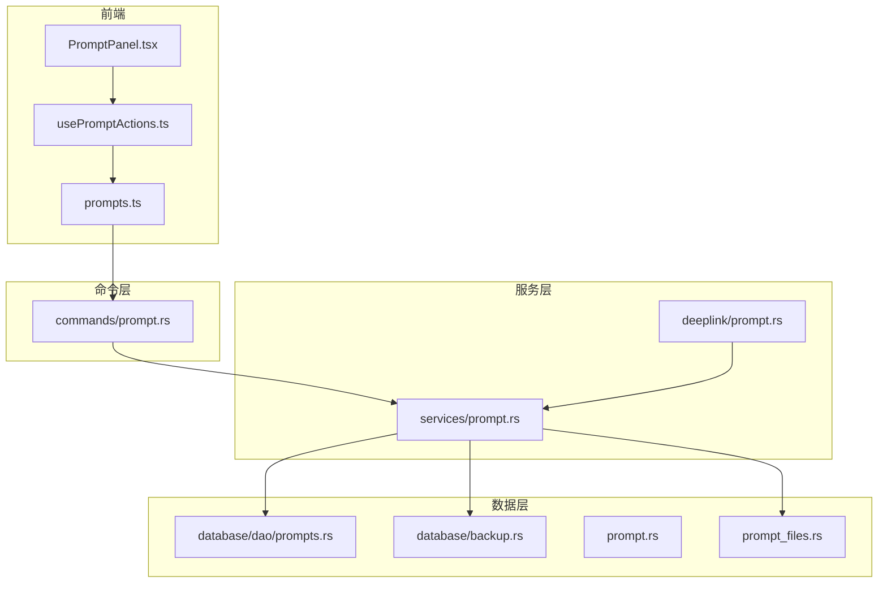
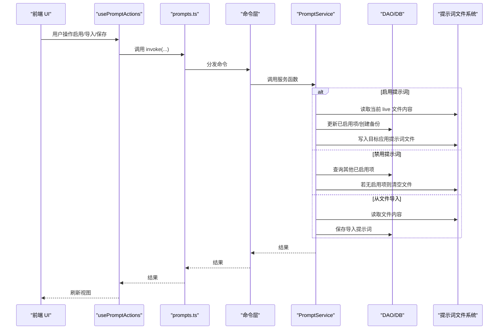
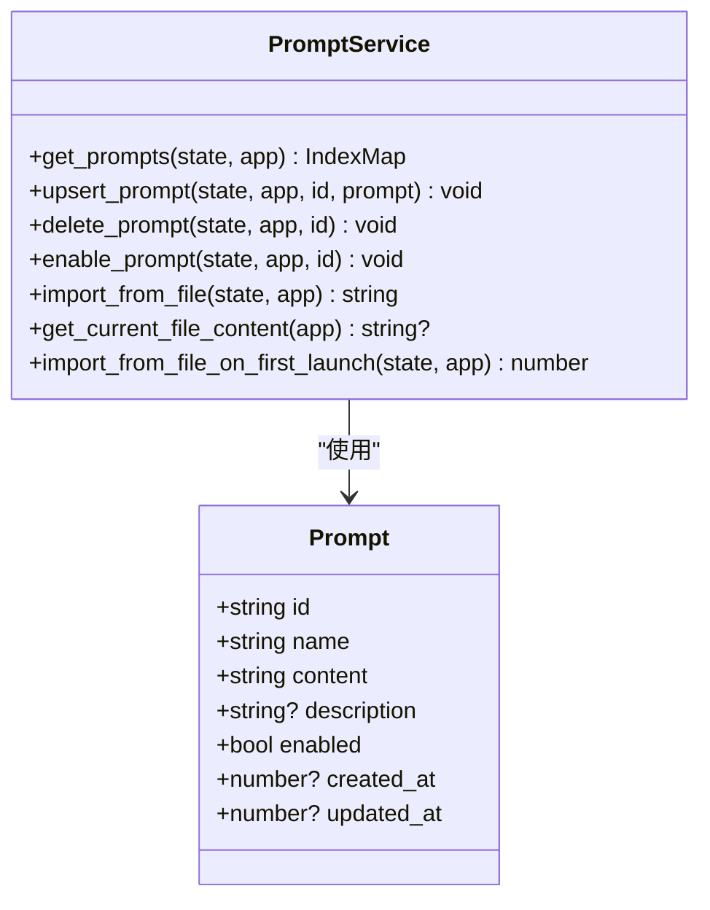
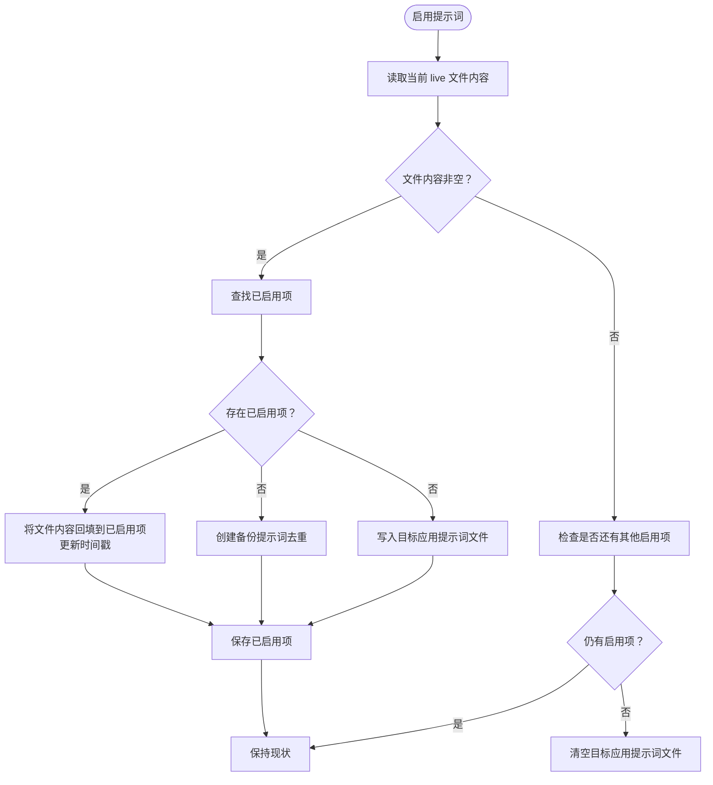
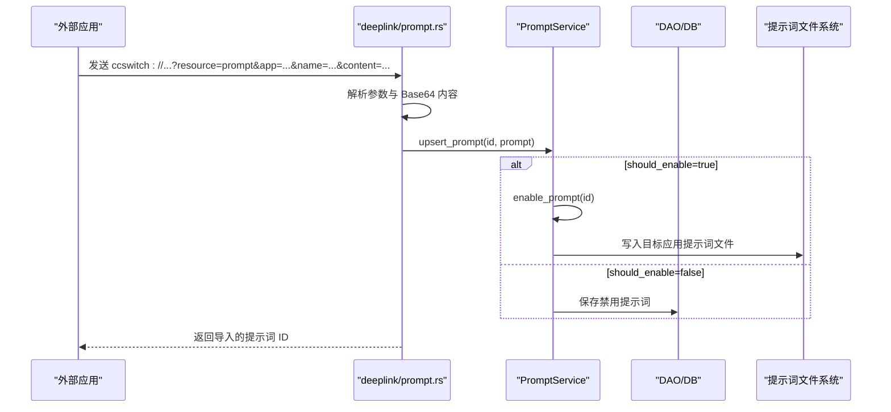
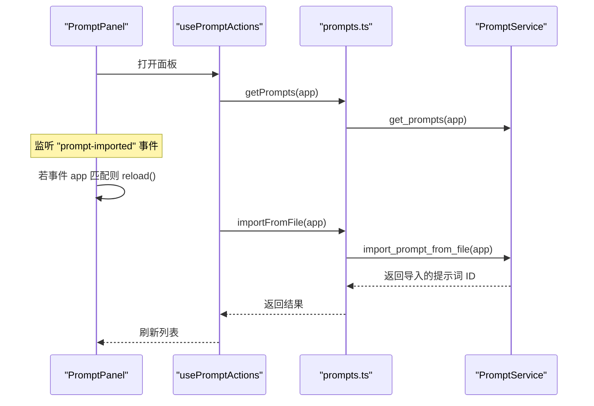
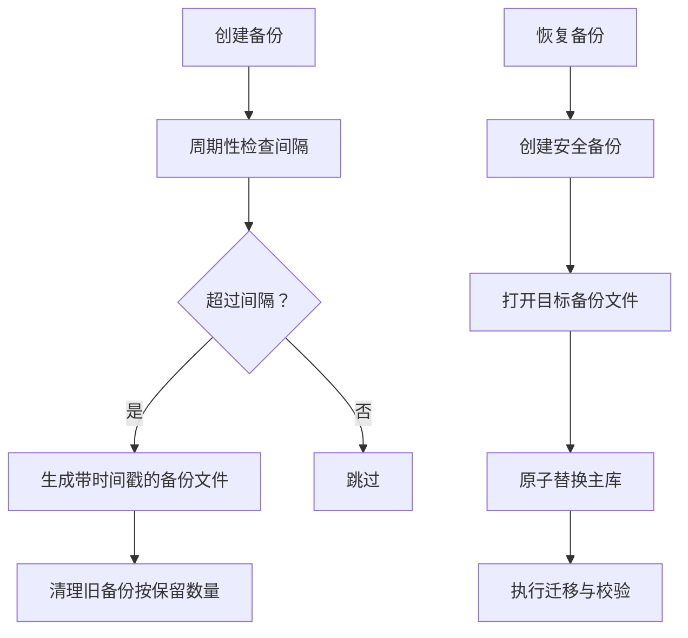
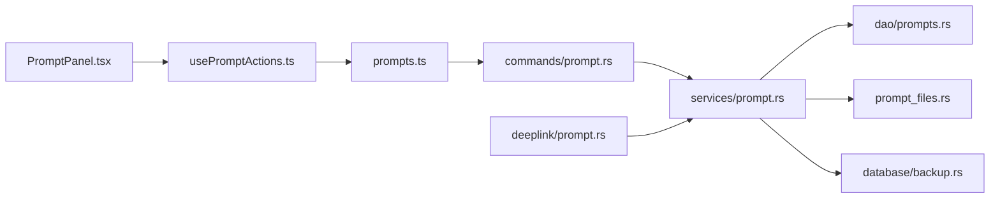

# 提示词同步机制

<cite>
**本文引用的文件**
- [src/components/prompts/PromptPanel.tsx](file://src/components/prompts/PromptPanel.tsx)
- [src/hooks/usePromptActions.ts](file://src/hooks/usePromptActions.ts)
- [src/lib/api/prompts.ts](file://src/lib/api/prompts.ts)
- [src-tauri/src/commands/prompt.rs](file://src-tauri/src/commands/prompt.rs)
- [src-tauri/src/prompt.rs](file://src-tauri/src/prompt.rs)
- [src-tauri/src/prompt_files.rs](file://src-tauri/src/prompt_files.rs)
- [src-tauri/src/services/prompt.rs](file://src-tauri/src/services/prompt.rs)
- [src-tauri/src/deeplink/prompt.rs](file://src-tauri/src/deeplink/prompt.rs)
- [src-tauri/src/database/dao/prompts.rs](file://src-tauri/src/database/dao/prompts.rs)
- [src-tauri/src/database/backup.rs](file://src-tauri/src/database/backup.rs)
- [src/components/settings/BackupListSection.tsx](file://src/components/settings/BackupListSection.tsx)
- [src/hooks/useBackupManager.ts](file://src/hooks/useBackupManager.ts)
</cite>

## 目录
1. [简介](#简介)
2. [项目结构](#项目结构)
3. [核心组件](#核心组件)
4. [架构总览](#架构总览)
5. [详细组件分析](#详细组件分析)
6. [依赖关系分析](#依赖关系分析)
7. [性能考量](#性能考量)
8. [故障排除指南](#故障排除指南)
9. [结论](#结论)
10. [附录](#附录)

## 简介
本文件系统性阐述 CC Switch 的“提示词同步机制”，重点覆盖以下方面：
- 跨应用同步的工作原理：针对 Claude、Codex、Gemini 等工具的提示词文件自动写入与回填保护
- 提示词文件的存储格式与解析机制：CLAUDE.md、AGENTS.md、GEMINI.md 的定位与内容管理
- 深链接导入流程：外部应用通过 ccswitch:// 触发的提示词导入与启用策略
- 冲突处理与回退策略：启用新提示词时的回填、备份与多提示词互斥逻辑
- 备份与恢复：数据库级备份与恢复流程，以及提示词文件内容的回填保护
- 与不同 AI 工具的集成与配置同步规则：各应用的提示词文件命名与路径策略
- 故障排除与性能优化建议：常见问题定位与运行时优化要点

## 项目结构
围绕提示词同步的关键代码分布在前端 React 组件与 Tauri Rust 后端之间，形成清晰的分层：
- 前端层：UI 展示、用户操作、事件监听与 API 调用
- 命令层：Tauri 命令桥接前端调用与后端服务
- 服务层：业务逻辑（提示词 CRUD、文件写入、回填与导入）
- 数据层：SQLite DAO 与数据库备份/恢复

**图表来源**
- [src/components/prompts/PromptPanel.tsx:1-169](file://src/components/prompts/PromptPanel.tsx#L1-L169)
- [src/hooks/usePromptActions.ts:1-153](file://src/hooks/usePromptActions.ts#L1-L153)
- [src/lib/api/prompts.ts:1-39](file://src/lib/api/prompts.ts#L1-L39)
- [src-tauri/src/commands/prompt.rs:1-65](file://src-tauri/src/commands/prompt.rs#L1-L65)
- [src-tauri/src/services/prompt.rs:1-243](file://src-tauri/src/services/prompt.rs#L1-L243)
- [src-tauri/src/deeplink/prompt.rs:1-87](file://src-tauri/src/deeplink/prompt.rs#L1-L87)
- [src-tauri/src/database/dao/prompts.rs:1-89](file://src-tauri/src/database/dao/prompts.rs#L1-L89)
- [src-tauri/src/database/backup.rs:1-861](file://src-tauri/src/database/backup.rs#L1-L861)
- [src-tauri/src/prompt.rs:1-17](file://src-tauri/src/prompt.rs#L1-L17)
- [src-tauri/src/prompt_files.rs:1-58](file://src-tauri/src/prompt_files.rs#L1-L58)

**章节来源**
- [src/components/prompts/PromptPanel.tsx:1-169](file://src/components/prompts/PromptPanel.tsx#L1-L169)
- [src/hooks/usePromptActions.ts:1-153](file://src/hooks/usePromptActions.ts#L1-L153)
- [src/lib/api/prompts.ts:1-39](file://src/lib/api/prompts.ts#L1-L39)
- [src-tauri/src/commands/prompt.rs:1-65](file://src-tauri/src/commands/prompt.rs#L1-L65)
- [src-tauri/src/services/prompt.rs:1-243](file://src-tauri/src/services/prompt.rs#L1-L243)
- [src-tauri/src/deeplink/prompt.rs:1-87](file://src-tauri/src/deeplink/prompt.rs#L1-L87)
- [src-tauri/src/database/dao/prompts.rs:1-89](file://src-tauri/src/database/dao/prompts.rs#L1-L89)
- [src-tauri/src/database/backup.rs:1-861](file://src-tauri/src/database/backup.rs#L1-L861)
- [src-tauri/src/prompt.rs:1-17](file://src-tauri/src/prompt.rs#L1-L17)
- [src-tauri/src/prompt_files.rs:1-58](file://src-tauri/src/prompt_files.rs#L1-L58)

## 核心组件
- 前端提示词面板与动作钩子：负责展示、增删改、启用/禁用、从文件导入，并监听深链导入事件
- Tauri 命令：将前端调用映射到后端服务函数
- 服务层：实现提示词 CRUD、文件写入、回填保护、首次导入、深链导入
- 数据层：SQLite 存储提示词记录；备份/恢复支持数据库级与同步导入场景

关键职责与交互：
- 启用提示词时：回填当前 live 文件内容到已启用项或创建备份，随后写入目标应用的提示词文件
- 禁用提示词：若无其他已启用项则清空文件，避免残留
- 从文件导入：读取现有提示词文件内容，创建导入提示词并入库
- 深链接导入：解析 ccswitch:// 请求参数，创建提示词并可选启用

**章节来源**
- [src/components/prompts/PromptPanel.tsx:42-60](file://src/components/prompts/PromptPanel.tsx#L42-L60)
- [src/hooks/usePromptActions.ts:14-127](file://src/hooks/usePromptActions.ts#L14-L127)
- [src/lib/api/prompts.ts:14-38](file://src/lib/api/prompts.ts#L14-L38)
- [src-tauri/src/commands/prompt.rs:11-64](file://src-tauri/src/commands/prompt.rs#L11-L64)
- [src-tauri/src/services/prompt.rs:20-144](file://src-tauri/src/services/prompt.rs#L20-L144)
- [src-tauri/src/services/prompt.rs:146-183](file://src-tauri/src/services/prompt.rs#L146-L183)
- [src-tauri/src/services/prompt.rs:185-241](file://src-tauri/src/services/prompt.rs#L185-L241)
- [src-tauri/src/deeplink/prompt.rs:14-86](file://src-tauri/src/deeplink/prompt.rs#L14-L86)

## 架构总览
提示词同步在“前端 UI → 命令桥 → 服务层 → 数据层”的链路中完成，同时涉及提示词文件系统的读写与深链接导入。

**图表来源**
- [src/components/prompts/PromptPanel.tsx:16-60](file://src/components/prompts/PromptPanel.tsx#L16-L60)
- [src/hooks/usePromptActions.ts:14-127](file://src/hooks/usePromptActions.ts#L14-L127)
- [src/lib/api/prompts.ts:14-38](file://src/lib/api/prompts.ts#L14-L38)
- [src-tauri/src/commands/prompt.rs:11-64](file://src-tauri/src/commands/prompt.rs#L11-L64)
- [src-tauri/src/services/prompt.rs:20-144](file://src-tauri/src/services/prompt.rs#L20-L144)
- [src-tauri/src/services/prompt.rs:146-183](file://src-tauri/src/services/prompt.rs#L146-L183)

## 详细组件分析

### 提示词模型与数据结构
提示词在数据库中以结构化形式存储，包含唯一标识、名称、内容、描述、启用状态及时间戳。服务层在启用/更新时会写入对应应用的提示词文件。

**图表来源**
- [src-tauri/src/prompt.rs:3-16](file://src-tauri/src/prompt.rs#L3-L16)
- [src-tauri/src/services/prompt.rs:18-242](file://src-tauri/src/services/prompt.rs#L18-L242)

**章节来源**
- [src-tauri/src/prompt.rs:3-16](file://src-tauri/src/prompt.rs#L3-L16)
- [src-tauri/src/services/prompt.rs:20-144](file://src-tauri/src/services/prompt.rs#L20-L144)

### 提示词文件存储与解析
- 文件定位：根据应用类型选择不同的提示词文件名与目录
  - Claude → CLAUDE.md
  - Codex → AGENTS.md
  - Gemini → GEMINI.md
  - OpenCode/OpenClaw/Hermes → AGENTS.md
- 写入策略：启用提示词时写入内容；禁用且无其他启用项时清空文件
- 首次导入：应用启动时若数据库为空且文件存在且非空，则自动导入并启用

**图表来源**
- [src-tauri/src/services/prompt.rs:73-144](file://src-tauri/src/services/prompt.rs#L73-L144)
- [src-tauri/src/services/prompt.rs:185-241](file://src-tauri/src/services/prompt.rs#L185-L241)
- [src-tauri/src/prompt_files.rs:11-40](file://src-tauri/src/prompt_files.rs#L11-L40)

**章节来源**
- [src-tauri/src/prompt_files.rs:11-40](file://src-tauri/src/prompt_files.rs#L11-L40)
- [src-tauri/src/services/prompt.rs:73-144](file://src-tauri/src/services/prompt.rs#L73-L144)
- [src-tauri/src/services/prompt.rs:185-241](file://src-tauri/src/services/prompt.rs#L185-L241)

### 深链接导入流程
外部应用可通过 ccswitch:// 协议发起提示词导入请求，参数包括资源类型、应用类型、名称、内容（Base64）、描述与启用标志。服务层解析后创建提示词并入库，若启用标志为真则进一步启用并写入文件。

**图表来源**
- [src-tauri/src/deeplink/prompt.rs:14-86](file://src-tauri/src/deeplink/prompt.rs#L14-L86)
- [src-tauri/src/services/prompt.rs:28-58](file://src-tauri/src/services/prompt.rs#L28-L58)
- [src-tauri/src/services/prompt.rs:73-144](file://src-tauri/src/services/prompt.rs#L73-L144)

**章节来源**
- [src-tauri/src/deeplink/prompt.rs:14-86](file://src-tauri/src/deeplink/prompt.rs#L14-L86)
- [src-tauri/src/services/prompt.rs:28-58](file://src-tauri/src/services/prompt.rs#L28-L58)

### 前端交互与事件监听
- 前端面板在打开时刷新数据，并监听“prompt-imported”自定义事件，当深链导入成功且目标应用匹配时自动重新加载
- 动作钩子封装了获取、保存、删除、启用/禁用与从文件导入等操作，并提供乐观更新与回滚

**图表来源**
- [src/components/prompts/PromptPanel.tsx:42-60](file://src/components/prompts/PromptPanel.tsx#L42-L60)
- [src/hooks/usePromptActions.ts:14-127](file://src/hooks/usePromptActions.ts#L14-L127)
- [src/lib/api/prompts.ts:14-38](file://src/lib/api/prompts.ts#L14-L38)
- [src-tauri/src/services/prompt.rs:146-183](file://src-tauri/src/services/prompt.rs#L146-L183)

**章节来源**
- [src/components/prompts/PromptPanel.tsx:42-60](file://src/components/prompts/PromptPanel.tsx#L42-L60)
- [src/hooks/usePromptActions.ts:14-127](file://src/hooks/usePromptActions.ts#L14-L127)
- [src/lib/api/prompts.ts:14-38](file://src/lib/api/prompts.ts#L14-L38)

### 备份与恢复（数据库级）
- 支持周期性自动备份、手动备份、列出备份、重命名与删除
- 恢复时先创建安全备份，再原子替换主库；支持同步导入场景下保留本地特定表的数据
- 提供 UI 组件与 Hook 便于设置与操作

**图表来源**
- [src-tauri/src/database/backup.rs:235-295](file://src-tauri/src/database/backup.rs#L235-L295)
- [src-tauri/src/database/backup.rs:297-367](file://src-tauri/src/database/backup.rs#L297-L367)
- [src-tauri/src/database/backup.rs:551-599](file://src-tauri/src/database/backup.rs#L551-L599)
- [src/components/settings/BackupListSection.tsx:64-495](file://src/components/settings/BackupListSection.tsx#L64-L495)
- [src/hooks/useBackupManager.ts:1-60](file://src/hooks/useBackupManager.ts#L1-L60)

**章节来源**
- [src-tauri/src/database/backup.rs:235-295](file://src-tauri/src/database/backup.rs#L235-L295)
- [src-tauri/src/database/backup.rs:297-367](file://src-tauri/src/database/backup.rs#L297-L367)
- [src-tauri/src/database/backup.rs:551-599](file://src-tauri/src/database/backup.rs#L551-L599)
- [src/components/settings/BackupListSection.tsx:64-495](file://src/components/settings/BackupListSection.tsx#L64-L495)
- [src/hooks/useBackupManager.ts:1-60](file://src/hooks/useBackupManager.ts#L1-L60)

## 依赖关系分析
- 前端组件依赖动作钩子，动作钩子依赖 API 封装的 invoke 调用
- 命令层将前端调用映射到服务层函数
- 服务层依赖 DAO 访问数据库，依赖文件系统读写提示词文件，依赖备份模块进行数据库级操作
- 深链接导入独立于命令层，直接调用服务层

**图表来源**
- [src/components/prompts/PromptPanel.tsx:1-169](file://src/components/prompts/PromptPanel.tsx#L1-L169)
- [src/hooks/usePromptActions.ts:1-153](file://src/hooks/usePromptActions.ts#L1-L153)
- [src/lib/api/prompts.ts:1-39](file://src/lib/api/prompts.ts#L1-L39)
- [src-tauri/src/commands/prompt.rs:1-65](file://src-tauri/src/commands/prompt.rs#L1-L65)
- [src-tauri/src/services/prompt.rs:1-243](file://src-tauri/src/services/prompt.rs#L1-L243)
- [src-tauri/src/database/dao/prompts.rs:1-89](file://src-tauri/src/database/dao/prompts.rs#L1-L89)
- [src-tauri/src/prompt_files.rs:1-58](file://src-tauri/src/prompt_files.rs#L1-L58)
- [src-tauri/src/database/backup.rs:1-861](file://src-tauri/src/database/backup.rs#L1-L861)
- [src-tauri/src/deeplink/prompt.rs:1-87](file://src-tauri/src/deeplink/prompt.rs#L1-L87)

**章节来源**
- [src/components/prompts/PromptPanel.tsx:1-169](file://src/components/prompts/PromptPanel.tsx#L1-L169)
- [src/hooks/usePromptActions.ts:1-153](file://src/hooks/usePromptActions.ts#L1-L153)
- [src/lib/api/prompts.ts:1-39](file://src/lib/api/prompts.ts#L1-L39)
- [src-tauri/src/commands/prompt.rs:1-65](file://src-tauri/src/commands/prompt.rs#L1-L65)
- [src-tauri/src/services/prompt.rs:1-243](file://src-tauri/src/services/prompt.rs#L1-L243)
- [src-tauri/src/database/dao/prompts.rs:1-89](file://src-tauri/src/database/dao/prompts.rs#L1-L89)
- [src-tauri/src/prompt_files.rs:1-58](file://src-tauri/src/prompt_files.rs#L1-L58)
- [src-tauri/src/database/backup.rs:1-861](file://src-tauri/src/database/backup.rs#L1-L861)
- [src-tauri/src/deeplink/prompt.rs:1-87](file://src-tauri/src/deeplink/prompt.rs#L1-L87)

## 性能考量
- 启用/禁用提示词时尽量减少文件 IO：仅在必要时写入或清空
- 回填与备份采用幂等判断，避免重复写入与重复备份
- 首次导入时对空内容进行短路，避免不必要的磁盘读取
- 数据库操作使用事务与原子替换，保证一致性与稳定性
- 建议在高并发导入场景下控制导入频率，避免频繁写入文件系统

[本节为通用指导，无需具体文件分析]

## 故障排除指南
- 启用提示词失败
  - 检查目标应用是否支持提示词文件（例如某些桌面应用可能不支持）
  - 查看文件写入权限与路径是否存在
  - 确认数据库连接正常，查看日志中的错误信息
- 禁用提示词后文件未清空
  - 确认数据库中是否存在其他已启用提示词
  - 检查文件是否存在且可写
- 从文件导入失败
  - 确认提示词文件存在且非空
  - 检查文件编码与内容格式
- 深链接导入失败
  - 确认 ccswitch:// 参数完整且 Base64 内容有效
  - 检查应用类型与启用标志是否正确
- 备份/恢复异常
  - 检查备份文件名合法性与路径
  - 确认恢复前的安全备份已创建
  - 查看数据库迁移与校验日志

**章节来源**
- [src-tauri/src/services/prompt.rs:60-71](file://src-tauri/src/services/prompt.rs#L60-L71)
- [src-tauri/src/services/prompt.rs:146-183](file://src-tauri/src/services/prompt.rs#L146-L183)
- [src-tauri/src/deeplink/prompt.rs:14-86](file://src-tauri/src/deeplink/prompt.rs#L14-L86)
- [src-tauri/src/database/backup.rs:551-599](file://src-tauri/src/database/backup.rs#L551-L599)

## 结论
CC Switch 的提示词同步机制通过“数据库 + 文件系统 + 深链接导入”的组合，实现了跨应用的提示词统一管理与安全回填保护。其核心特性包括：
- 启用/禁用时的回填与备份策略，避免丢失原始提示词
- 首次启动时的自动导入，提升用户体验
- 深链接导入的即用即启能力
- 数据库级备份与恢复，保障数据安全

[本节为总结性内容，无需具体文件分析]

## 附录

### 提示词文件与应用映射
- Claude → CLAUDE.md
- Codex → AGENTS.md
- Gemini → GEMINI.md
- OpenCode/OpenClaw/Hermes → AGENTS.md

**章节来源**
- [src-tauri/src/prompt_files.rs:31-37](file://src-tauri/src/prompt_files.rs#L31-L37)

### 同步冲突与回退策略
- 启用新提示词时优先回填当前 live 文件内容到已启用项
- 若无已启用项则创建备份提示词，避免重复备份
- 禁用提示词时若无其他启用项则清空文件
- 删除已启用提示词会被拒绝，防止误删

**章节来源**
- [src-tauri/src/services/prompt.rs:73-144](file://src-tauri/src/services/prompt.rs#L73-L144)
- [src-tauri/src/services/prompt.rs:60-71](file://src-tauri/src/services/prompt.rs#L60-L71)

### 备份与恢复流程（步骤说明）
- 创建备份：周期性或手动触发，生成带时间戳的数据库快照
- 列出备份：按创建时间倒序显示
- 重命名备份：校验新名称合法性并重命名
- 删除备份：校验路径与扩展名
- 恢复备份：先创建安全备份，再原子替换主库并执行迁移

**章节来源**
- [src-tauri/src/database/backup.rs:297-367](file://src-tauri/src/database/backup.rs#L297-L367)
- [src-tauri/src/database/backup.rs:515-549](file://src-tauri/src/database/backup.rs#L515-L549)
- [src-tauri/src/database/backup.rs:601-662](file://src-tauri/src/database/backup.rs#L601-L662)
- [src-tauri/src/database/backup.rs:664-687](file://src-tauri/src/database/backup.rs#L664-L687)
- [src-tauri/src/database/backup.rs:551-599](file://src-tauri/src/database/backup.rs#L551-L599)