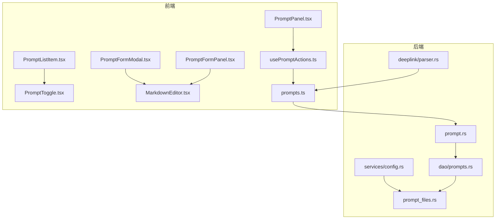
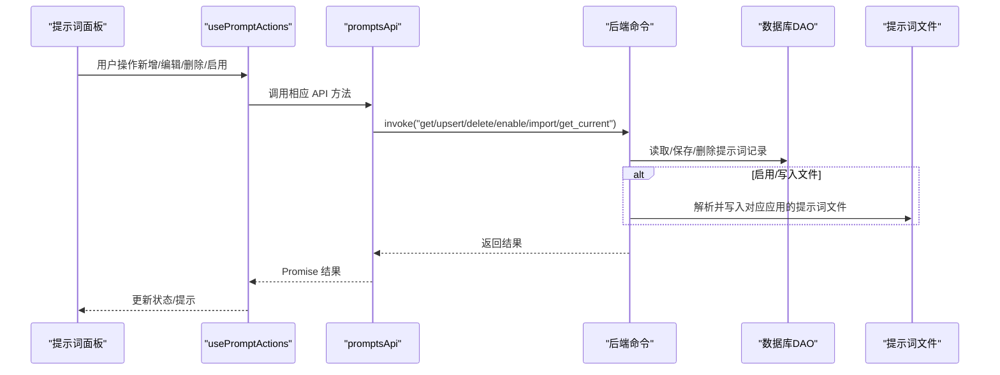
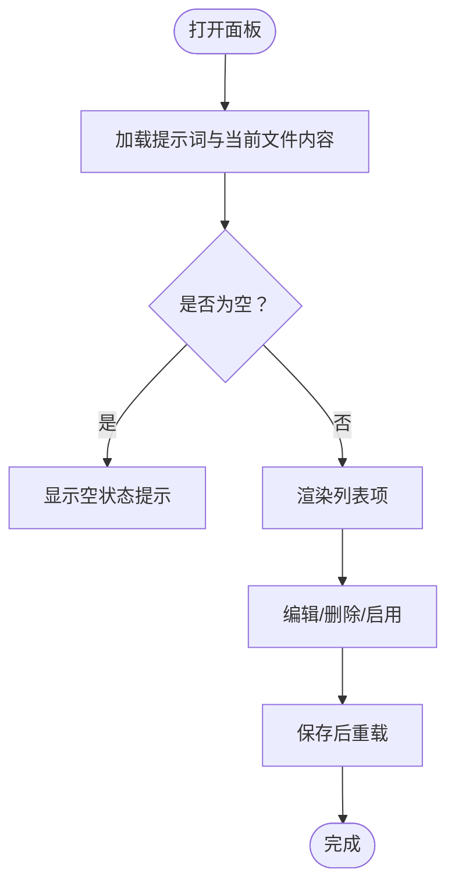
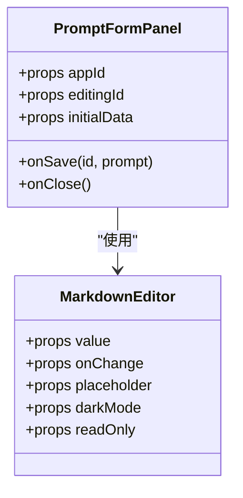
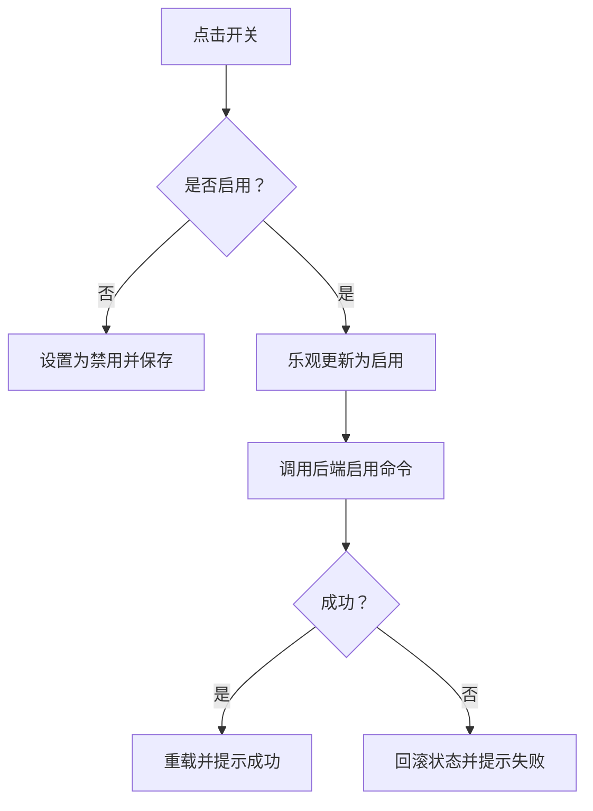
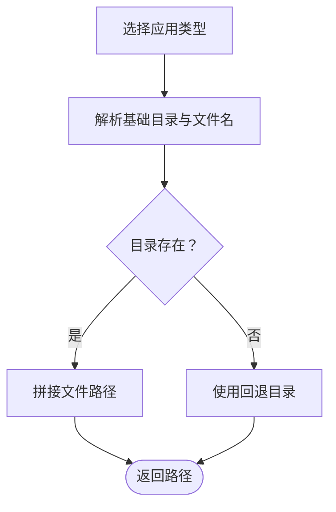
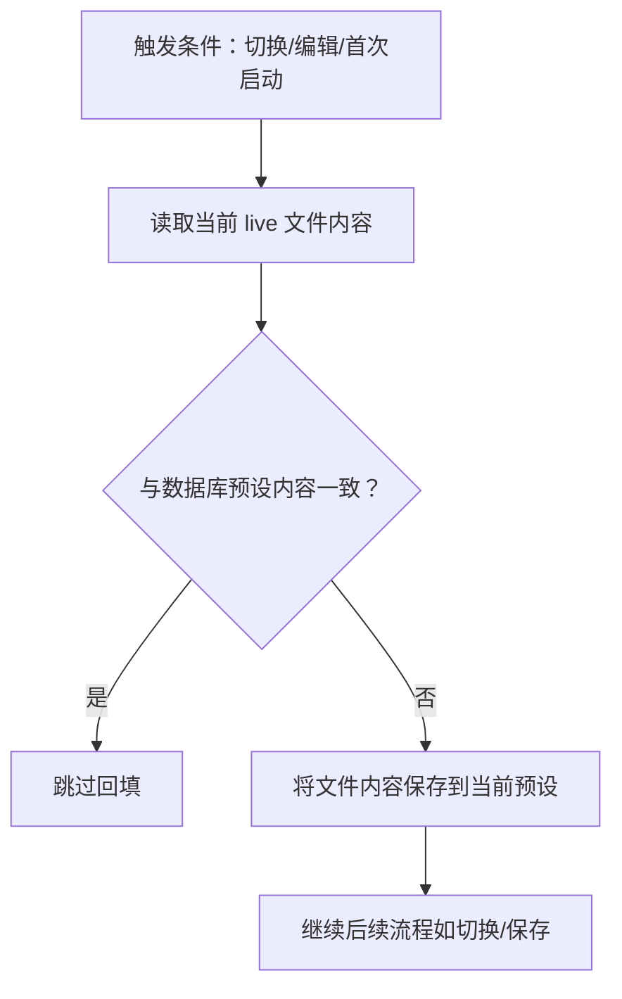
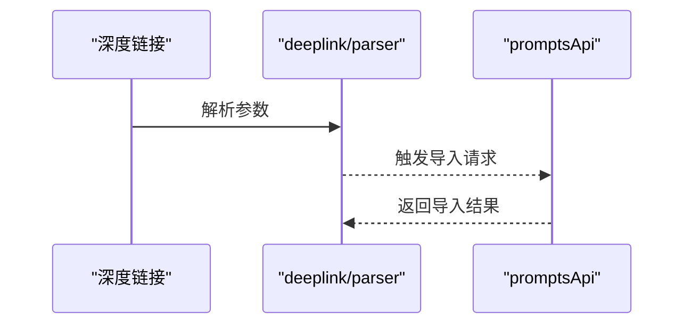
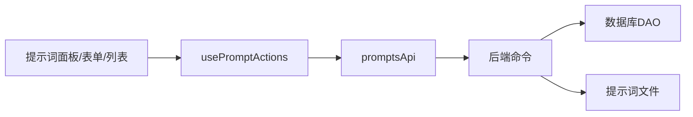

# 提示词管理

<cite>
**本文引用的文件**
- [src/components/prompts/PromptPanel.tsx](file://src/components/prompts/PromptPanel.tsx)
- [src/components/prompts/PromptFormPanel.tsx](file://src/components/prompts/PromptFormPanel.tsx)
- [src/components/prompts/PromptFormModal.tsx](file://src/components/prompts/PromptFormModal.tsx)
- [src/components/prompts/PromptListItem.tsx](file://src/components/prompts/PromptListItem.tsx)
- [src/components/prompts/PromptToggle.tsx](file://src/components/prompts/PromptToggle.tsx)
- [src/components/MarkdownEditor.tsx](file://src/components/MarkdownEditor.tsx)
- [src/hooks/usePromptActions.ts](file://src/hooks/usePromptActions.ts)
- [src/lib/api/prompts.ts](file://src/lib/api/prompts.ts)
- [src/lib/api/index.ts](file://src/lib/api/index.ts)
- [src-tauri/src/prompt.rs](file://src-tauri/src/prompt.rs)
- [src-tauri/src/prompt_files.rs](file://src-tauri/src/prompt_files.rs)
- [src-tauri/src/database/dao/prompts.rs](file://src-tauri/src/database/dao/prompts.rs)
- [src-tauri/src/services/config.rs](file://src-tauri/src/services/config.rs)
- [src-tauri/src/deeplink/parser.rs](file://src-tauri/src/deeplink/parser.rs)
- [src/App.tsx](file://src/App.tsx)
- [docs/user-manual/zh/3-extensions/3.2-prompts.md](file://docs/user-manual/zh/3-extensions/3.2-prompts.md)
- [docs/user-manual/en/3-extensions/3.2-prompts.md](file://docs/user-manual/en/3-extensions/3.2-prompts.md)
</cite>

## 目录
1. [简介](#简介)
2. [项目结构](#项目结构)
3. [核心组件](#核心组件)
4. [架构总览](#架构总览)
5. [详细组件分析](#详细组件分析)
6. [依赖关系分析](#依赖关系分析)
7. [性能考量](#性能考量)
8. [故障排查指南](#故障排查指南)
9. [结论](#结论)
10. [附录](#附录)

## 简介
本章节面向 CC Switch 的提示词管理系统，解释提示词在 AI 对话中的作用与组织方式，覆盖提示词的创建、编辑、管理流程，并重点阐述与各 AI 工具（Claude、Codex、Gemini、OpenCode 等）的集成与配置同步机制。文档同时介绍 Markdown 编辑器与实时预览、跨应用同步策略（CLAUDE.md、AGENTS.md、GEMINI.md）、智能回填保护、模板与分类管理、搜索能力、示例与最佳实践、性能优化以及备份与恢复。

## 项目结构
提示词功能由前端 React 组件与 Tauri 后端服务协同实现，核心文件分布如下：
- 前端组件：提示词面板、表单、列表项、开关、Markdown 编辑器
- 前端 Hook：统一的提示词动作封装（增删改查、启用/禁用、导入）
- API 层：与后端命令交互的封装
- 后端服务：提示词模型、文件路径解析、数据库 DAO、配置同步、深度链接解析
- 文档：用户手册中关于提示词的使用说明

**图表来源**
- [src/components/prompts/PromptPanel.tsx:1-169](file://src/components/prompts/PromptPanel.tsx#L1-L169)
- [src/components/prompts/PromptFormPanel.tsx:1-158](file://src/components/prompts/PromptFormPanel.tsx#L1-L158)
- [src/components/prompts/PromptFormModal.tsx:1-164](file://src/components/prompts/PromptFormModal.tsx#L1-L164)
- [src/components/prompts/PromptListItem.tsx:1-74](file://src/components/prompts/PromptListItem.tsx#L1-L74)
- [src/components/prompts/PromptToggle.tsx:1-42](file://src/components/prompts/PromptToggle.tsx#L1-L42)
- [src/components/MarkdownEditor.tsx:1-160](file://src/components/MarkdownEditor.tsx#L1-L160)
- [src/hooks/usePromptActions.ts:1-153](file://src/hooks/usePromptActions.ts#L1-L153)
- [src/lib/api/prompts.ts:1-39](file://src/lib/api/prompts.ts#L1-L39)
- [src-tauri/src/prompt.rs:1-17](file://src-tauri/src/prompt.rs#L1-L17)
- [src-tauri/src/prompt_files.rs:1-58](file://src-tauri/src/prompt_files.rs#L1-L58)
- [src-tauri/src/database/dao/prompts.rs:1-89](file://src-tauri/src/database/dao/prompts.rs#L1-L89)
- [src-tauri/src/services/config.rs:204-239](file://src-tauri/src/services/config.rs#L204-L239)
- [src-tauri/src/deeplink/parser.rs:200-247](file://src-tauri/src/deeplink/parser.rs#L200-L247)

**章节来源**
- [src/components/prompts/PromptPanel.tsx:1-169](file://src/components/prompts/PromptPanel.tsx#L1-L169)
- [src/components/prompts/PromptFormPanel.tsx:1-158](file://src/components/prompts/PromptFormPanel.tsx#L1-L158)
- [src/components/prompts/PromptFormModal.tsx:1-164](file://src/components/prompts/PromptFormModal.tsx#L1-L164)
- [src/components/prompts/PromptListItem.tsx:1-74](file://src/components/prompts/PromptListItem.tsx#L1-L74)
- [src/components/prompts/PromptToggle.tsx:1-42](file://src/components/prompts/PromptToggle.tsx#L1-L42)
- [src/components/MarkdownEditor.tsx:1-160](file://src/components/MarkdownEditor.tsx#L1-L160)
- [src/hooks/usePromptActions.ts:1-153](file://src/hooks/usePromptActions.ts#L1-L153)
- [src/lib/api/prompts.ts:1-39](file://src/lib/api/prompts.ts#L1-L39)
- [src-tauri/src/prompt.rs:1-17](file://src-tauri/src/prompt.rs#L1-L17)
- [src-tauri/src/prompt_files.rs:1-58](file://src-tauri/src/prompt_files.rs#L1-L58)
- [src-tauri/src/database/dao/prompts.rs:1-89](file://src-tauri/src/database/dao/prompts.rs#L1-L89)
- [src-tauri/src/services/config.rs:204-239](file://src-tauri/src/services/config.rs#L204-L239)
- [src-tauri/src/deeplink/parser.rs:200-247](file://src-tauri/src/deeplink/parser.rs#L200-L247)

## 核心组件
- 提示词面板：展示、分页滚动、新增/编辑/删除、启用/禁用、导入事件监听与重载
- 表单面板/模态：名称、描述、Markdown 内容输入，实时主题适配，保存校验
- 列表项：开关控制、编辑/删除按钮、名称与描述展示
- Markdown 编辑器：基于 CodeMirror 的 Markdown 编辑与实时预览
- 动作 Hook：统一的 CRUD、启用/禁用、导入、乐观更新与回滚、错误提示
- API 封装：与后端命令交互（获取、保存、删除、启用、导入、读取当前文件内容）

**章节来源**
- [src/components/prompts/PromptPanel.tsx:1-169](file://src/components/prompts/PromptPanel.tsx#L1-L169)
- [src/components/prompts/PromptFormPanel.tsx:1-158](file://src/components/prompts/PromptFormPanel.tsx#L1-L158)
- [src/components/prompts/PromptFormModal.tsx:1-164](file://src/components/prompts/PromptFormModal.tsx#L1-L164)
- [src/components/prompts/PromptListItem.tsx:1-74](file://src/components/prompts/PromptListItem.tsx#L1-L74)
- [src/components/prompts/PromptToggle.tsx:1-42](file://src/components/prompts/PromptToggle.tsx#L1-L42)
- [src/components/MarkdownEditor.tsx:1-160](file://src/components/MarkdownEditor.tsx#L1-L160)
- [src/hooks/usePromptActions.ts:1-153](file://src/hooks/usePromptActions.ts#L1-L153)
- [src/lib/api/prompts.ts:1-39](file://src/lib/api/prompts.ts#L1-L39)

## 架构总览
提示词管理采用“前端 UI + Hook + API + 后端命令 + 数据库 + 文件系统”的分层架构。前端负责交互与预览；Hook 负责状态与副作用；API 将命令调用桥接到后端；后端负责模型定义、DAO 访问数据库、解析提示词文件路径、执行写入与回填保护、处理深度链接导入等。

**图表来源**
- [src/components/prompts/PromptPanel.tsx:1-169](file://src/components/prompts/PromptPanel.tsx#L1-L169)
- [src/hooks/usePromptActions.ts:1-153](file://src/hooks/usePromptActions.ts#L1-L153)
- [src/lib/api/prompts.ts:1-39](file://src/lib/api/prompts.ts#L1-L39)
- [src-tauri/src/database/dao/prompts.rs:1-89](file://src-tauri/src/database/dao/prompts.rs#L1-L89)
- [src-tauri/src/prompt_files.rs:1-58](file://src-tauri/src/prompt_files.rs#L1-L58)

## 详细组件分析

### 组件 A：提示词面板与列表
- 职责：渲染提示词列表、统计数量与启用状态、打开新增/编辑表单、确认删除对话框、监听深度链接导入事件并重载
- 关键点：懒加载与重载、事件监听、确认对话框、列表项渲染

**图表来源**
- [src/components/prompts/PromptPanel.tsx:1-169](file://src/components/prompts/PromptPanel.tsx#L1-L169)
- [src/hooks/usePromptActions.ts:1-153](file://src/hooks/usePromptActions.ts#L1-L153)

**章节来源**
- [src/components/prompts/PromptPanel.tsx:1-169](file://src/components/prompts/PromptPanel.tsx#L1-L169)
- [src/components/prompts/PromptListItem.tsx:1-74](file://src/components/prompts/PromptListItem.tsx#L1-L74)

### 组件 B：提示词表单与 Markdown 编辑器
- 职责：表单输入（名称、描述、内容）、保存校验、主题适配、实时预览
- 关键点：文件名映射（不同应用对应不同文件名）、暗/亮主题切换监听、占位符文案

**图表来源**
- [src/components/prompts/PromptFormPanel.tsx:1-158](file://src/components/prompts/PromptFormPanel.tsx#L1-L158)
- [src/components/MarkdownEditor.tsx:1-160](file://src/components/MarkdownEditor.tsx#L1-L160)

**章节来源**
- [src/components/prompts/PromptFormPanel.tsx:1-158](file://src/components/prompts/PromptFormPanel.tsx#L1-L158)
- [src/components/prompts/PromptFormModal.tsx:1-164](file://src/components/prompts/PromptFormModal.tsx#L1-L164)
- [src/components/MarkdownEditor.tsx:1-160](file://src/components/MarkdownEditor.tsx#L1-L160)

### 组件 C：启用/禁用与开关
- 职责：单选启用（互斥）、禁用时回退、乐观更新与失败回滚
- 关键点：启用时对其他提示词进行批量更新；禁用时单独更新；失败时回滚至原状态

**图表来源**
- [src/components/prompts/PromptToggle.tsx:1-42](file://src/components/prompts/PromptToggle.tsx#L1-L42)
- [src/hooks/usePromptActions.ts:76-127](file://src/hooks/usePromptActions.ts#L76-L127)

**章节来源**
- [src/components/prompts/PromptToggle.tsx:1-42](file://src/components/prompts/PromptToggle.tsx#L1-L42)
- [src/hooks/usePromptActions.ts:76-127](file://src/hooks/usePromptActions.ts#L76-L127)

### 组件 D：跨应用同步与文件路径
- 职责：根据应用类型解析提示词文件路径（CLAUDE.md、AGENTS.md、GEMINI.md），并写入对应应用配置目录
- 关键点：不同应用的文件名约定；无主目录时的回退策略；Claude Desktop 不支持提示词

**图表来源**
- [src-tauri/src/prompt_files.rs:1-58](file://src-tauri/src/prompt_files.rs#L1-L58)

**章节来源**
- [src-tauri/src/prompt_files.rs:1-58](file://src-tauri/src/prompt_files.rs#L1-L58)

### 组件 E：智能回填保护机制
- 职责：在切换/编辑/首次启动时，比较 live 文件内容与数据库预设，若不同则将手动修改回填到当前预设，避免丢失
- 关键点：仅在切换到不同预设时触发；无当前预设时不触发；失败不影响切换流程

**图表来源**
- [src-tauri/src/services/config.rs:204-239](file://src-tauri/src/services/config.rs#L204-L239)
- [docs/user-manual/zh/3-extensions/3.2-prompts.md:101-133](file://docs/user-manual/zh/3-extensions/3.2-prompts.md#L101-L133)

**章节来源**
- [src-tauri/src/services/config.rs:204-239](file://src-tauri/src/services/config.rs#L204-L239)
- [docs/user-manual/zh/3-extensions/3.2-prompts.md:101-133](file://docs/user-manual/zh/3-extensions/3.2-prompts.md#L101-L133)
- [docs/user-manual/en/3-extensions/3.2-prompts.md:101-133](file://docs/user-manual/en/3-extensions/3.2-prompts.md#L101-L133)

### 组件 F：深度链接导入与分享
- 职责：解析深度链接参数（名称、内容、描述、启用状态等），触发导入流程
- 关键点：参数校验与错误处理；与导入 API 协同

**图表来源**
- [src-tauri/src/deeplink/parser.rs:200-247](file://src-tauri/src/deeplink/parser.rs#L200-L247)
- [src/lib/api/prompts.ts:31-33](file://src/lib/api/prompts.ts#L31-L33)

**章节来源**
- [src-tauri/src/deeplink/parser.rs:200-247](file://src-tauri/src/deeplink/parser.rs#L200-L247)
- [src/lib/api/prompts.ts:31-33](file://src/lib/api/prompts.ts#L31-L33)
- [docs/user-manual/zh/3-extensions/3.2-prompts.md:146-159](file://docs/user-manual/zh/3-extensions/3.2-prompts.md#L146-L159)

## 依赖关系分析
- 组件耦合：面板依赖 Hook；表单依赖编辑器；列表项依赖开关；Hook 依赖 API；API 依赖后端命令
- 数据流：前端 UI → Hook → API → 后端命令 → 数据库/文件系统
- 外部依赖：CodeMirror（Markdown 编辑器）、Tauri invoke（命令桥接）、SQLite（数据库）

**图表来源**
- [src/components/prompts/PromptPanel.tsx:1-169](file://src/components/prompts/PromptPanel.tsx#L1-L169)
- [src/hooks/usePromptActions.ts:1-153](file://src/hooks/usePromptActions.ts#L1-L153)
- [src/lib/api/prompts.ts:1-39](file://src/lib/api/prompts.ts#L1-L39)
- [src-tauri/src/database/dao/prompts.rs:1-89](file://src-tauri/src/database/dao/prompts.rs#L1-L89)
- [src-tauri/src/prompt_files.rs:1-58](file://src-tauri/src/prompt_files.rs#L1-L58)

**章节来源**
- [src/components/prompts/PromptPanel.tsx:1-169](file://src/components/prompts/PromptPanel.tsx#L1-L169)
- [src/hooks/usePromptActions.ts:1-153](file://src/hooks/usePromptActions.ts#L1-L153)
- [src/lib/api/prompts.ts:1-39](file://src/lib/api/prompts.ts#L1-L39)
- [src-tauri/src/database/dao/prompts.rs:1-89](file://src-tauri/src/database/dao/prompts.rs#L1-L89)
- [src-tauri/src/prompt_files.rs:1-58](file://src-tauri/src/prompt_files.rs#L1-L58)

## 性能考量
- 编辑器性能：CodeMirror 按需初始化与销毁，避免重复实例化；只读模式下移除光标与高亮行样式，减少渲染开销
- 列表渲染：使用 memo 化与稳定键值，减少不必要的重渲染
- 乐观更新：启用/禁用时先更新本地状态，降低等待时间，失败时回滚
- 数据库访问：批量查询与插入使用索引列（应用类型、创建时间等），避免全表扫描
- 文件写入：仅在启用/切换时写入，避免频繁 IO；回填保护在必要时机触发，减少冗余写入

[本节为通用性能建议，无需特定文件引用]

## 故障排查指南
- 无法写入提示词文件
  - 检查应用配置目录是否存在；若不存在，系统会尝试回退到用户主目录
  - 确认当前应用类型支持提示词（例如 Claude Desktop 不支持）
- 启用后未生效
  - 确认当前应用的提示词文件路径正确；检查文件权限
  - 若手动修改过文件，确认回填机制已触发并将更改保存到数据库
- 删除失败或被阻止
  - 已启用的预设需先禁用再删除
- 导入失败
  - 深度链接参数是否完整；后端解析是否报错
- 预览异常
  - 检查编辑器主题与占位符设置；确认暗/亮主题切换监听正常

**章节来源**
- [src-tauri/src/prompt_files.rs:1-58](file://src-tauri/src/prompt_files.rs#L1-L58)
- [docs/user-manual/zh/3-extensions/3.2-prompts.md:94-100](file://docs/user-manual/zh/3-extensions/3.2-prompts.md#L94-L100)
- [src-tauri/src/services/config.rs:204-239](file://src-tauri/src/services/config.rs#L204-L239)

## 结论
提示词管理通过清晰的前后端分层与完善的回填保护机制，实现了多应用、多场景下的提示词统一管理与安全同步。配合 Markdown 编辑器与实时预览，用户可以高效地创建、编辑与维护提示词，并通过深度链接与配置导出实现便捷分享与迁移。

[本节为总结性内容，无需特定文件引用]

## 附录

### 提示词与各 AI 工具的集成与同步
- 支持的应用与文件映射
  - Claude → CLAUDE.md
  - Codex → AGENTS.md
  - Gemini → GEMINI.md
  - OpenCode/OpenClaw/Hermes → AGENTS.md
- 同步目标：启用提示词后写入对应应用的提示词文件
- 不支持：Claude Desktop 暂不支持提示词

**章节来源**
- [src/components/prompts/PromptFormPanel.tsx:27-36](file://src/components/prompts/PromptFormPanel.tsx#L27-L36)
- [src-tauri/src/prompt_files.rs:31-39](file://src-tauri/src/prompt_files.rs#L31-L39)
- [docs/user-manual/zh/3-extensions/3.2-prompts.md:75-84](file://docs/user-manual/zh/3-extensions/3.2-prompts.md#L75-L84)
- [docs/user-manual/en/3-extensions/3.2-prompts.md:75-84](file://docs/user-manual/en/3-extensions/3.2-prompts.md#L75-L84)

### 提示词模板与最佳实践
- 结构化格式建议：角色定义、核心能力、回复风格、注意事项
- 编写建议：简洁明确、可复用性强、与场景匹配
- 分类管理：按用途/领域建立命名规范，便于检索与复用
- 搜索能力：利用名称与描述字段进行筛选与过滤

**章节来源**
- [docs/user-manual/zh/3-extensions/3.2-prompts.md:38-63](file://docs/user-manual/zh/3-extensions/3.2-prompts.md#L38-L63)
- [docs/user-manual/en/3-extensions/3.2-prompts.md:38-63](file://docs/user-manual/en/3-extensions/3.2-prompts.md#L38-L63)

### Markdown 编辑器与实时预览
- 特性：语法高亮、实时预览、常用格式快捷键、暗/亮主题适配
- 使用：在表单中输入提示词内容，编辑器即时反映变化

**章节来源**
- [src/components/MarkdownEditor.tsx:1-160](file://src/components/MarkdownEditor.tsx#L1-L160)
- [src/components/prompts/PromptFormPanel.tsx:144-150](file://src/components/prompts/PromptFormPanel.tsx#L144-L150)

### 智能回填保护详解
- 触发时机：切换到不同预设、编辑当前预设、首次启动
- 保护机制：比较 live 文件与数据库内容，差异即回填
- 失败处理：不影响切换流程，仅记录警告

**章节来源**
- [src-tauri/src/services/config.rs:204-239](file://src-tauri/src/services/config.rs#L204-L239)
- [docs/user-manual/zh/3-extensions/3.2-prompts.md:101-133](file://docs/user-manual/zh/3-extensions/3.2-prompts.md#L101-L133)
- [docs/user-manual/en/3-extensions/3.2-prompts.md:101-133](file://docs/user-manual/en/3-extensions/3.2-prompts.md#L101-L133)

### 深度链接导入与分享
- 导入：通过深度链接参数生成导入请求
- 分享：生成深度链接以便在其他设备或应用间共享提示词

**章节来源**
- [src-tauri/src/deeplink/parser.rs:200-247](file://src-tauri/src/deeplink/parser.rs#L200-L247)
- [docs/user-manual/zh/3-extensions/3.2-prompts.md:148-154](file://docs/user-manual/zh/3-extensions/3.2-prompts.md#L148-L154)

### 备份与恢复
- 导出配置包含所有提示词预设；导入后可恢复历史状态
- 建议定期导出配置，确保数据安全

**章节来源**
- [docs/user-manual/zh/3-extensions/3.2-prompts.md:156-159](file://docs/user-manual/zh/3-extensions/3.2-prompts.md#L156-L159)