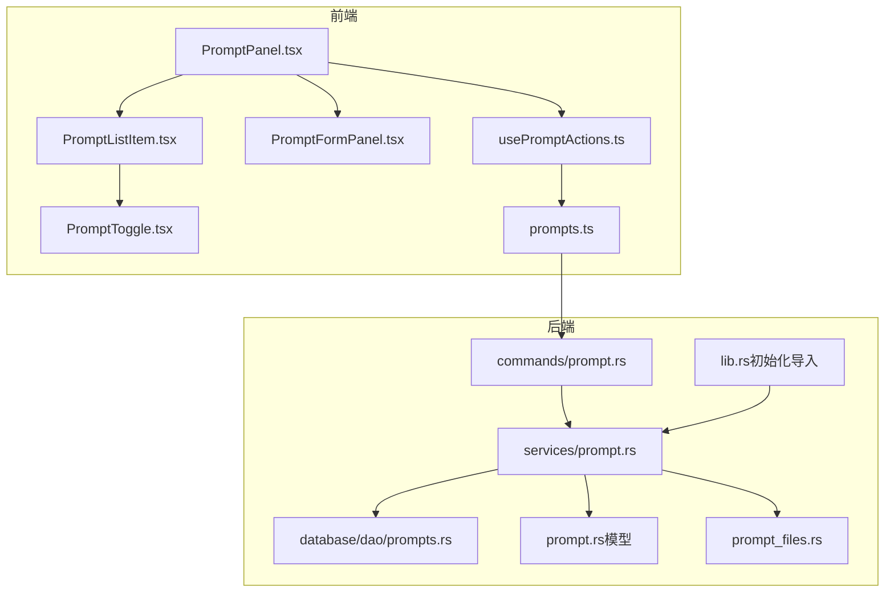
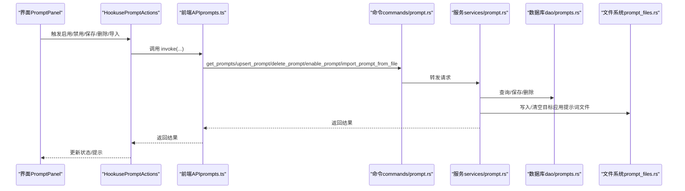
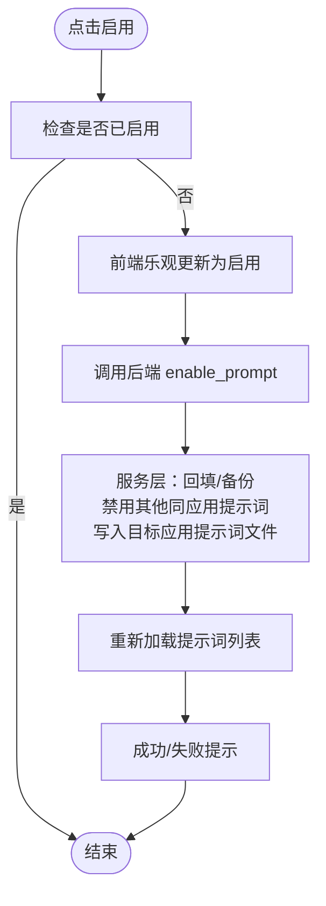
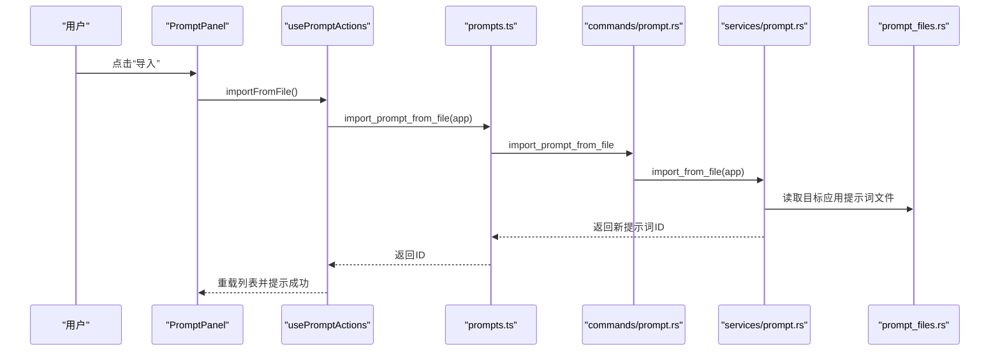
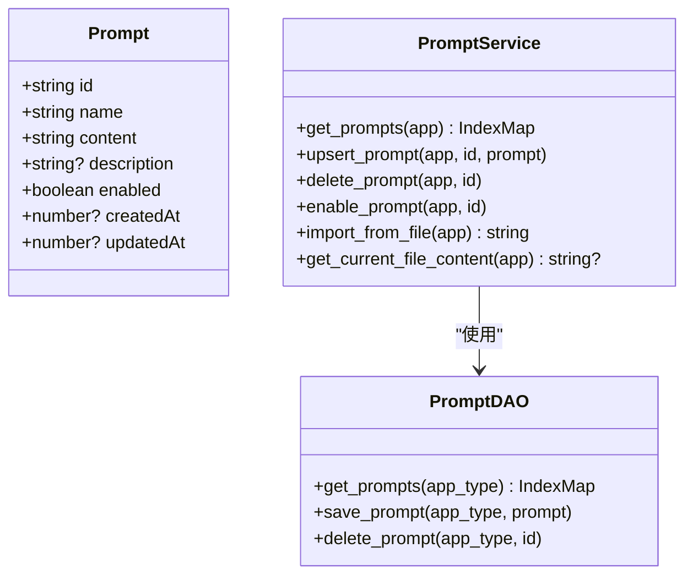
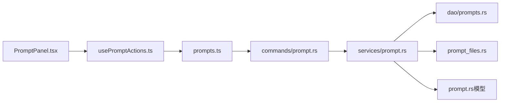

# 提示词管理功能

<cite>
**本文引用的文件**
- [PromptPanel.tsx](file://src/components/prompts/PromptPanel.tsx)
- [PromptListItem.tsx](file://src/components/prompts/PromptListItem.tsx)
- [PromptFormPanel.tsx](file://src/components/prompts/PromptFormPanel.tsx)
- [PromptToggle.tsx](file://src/components/prompts/PromptToggle.tsx)
- [usePromptActions.ts](file://src/hooks/usePromptActions.ts)
- [prompts.ts](file://src/lib/api/prompts.ts)
- [prompt.rs](file://src-tauri/src/prompt.rs)
- [prompt.rs（命令）](file://src-tauri/src/commands/prompt.rs)
- [prompts.rs（DAO）](file://src-tauri/src/database/dao/prompts.rs)
- [prompt.rs（服务）](file://src-tauri/src/services/prompt.rs)
- [prompt_files.rs](file://src-tauri/src/prompt_files.rs)
- [lib.rs](file://src-tauri/src/lib.rs)
- [en.json](file://src/i18n/locales/en.json)
- [3.2-prompts.md（英文用户手册）](file://docs/user-manual/en/3-extensions/3.2-prompts.md)
- [PromptConfirmation.tsx](file://src/components/deeplink/PromptConfirmation.tsx)
- [parser.rs](file://src-tauri/src/deeplink/parser.rs)
</cite>

## 目录
1. [简介](#简介)
2. [项目结构](#项目结构)
3. [核心组件](#核心组件)
4. [架构总览](#架构总览)
5. [详细组件分析](#详细组件分析)
6. [依赖关系分析](#依赖关系分析)
7. [性能考量](#性能考量)
8. [故障排查指南](#故障排查指南)
9. [结论](#结论)
10. [附录](#附录)

## 简介
本文件系统性阐述 CC Switch 的“提示词管理”功能，覆盖提示词列表展示与组织、按应用分类与状态筛选、启用/禁用切换机制与状态指示、搜索与过滤、批量操作、导入导出与数据迁移、版本与历史记录、最佳实践与使用技巧，以及与系统其他模块的集成关系与数据流。

## 项目结构
提示词管理功能由前端 React 组件与 Hook、API 层，以及后端 Tauri 命令、服务层、DAO 与文件系统路径组成。前端负责 UI、交互与本地状态；后端负责持久化、文件写入与跨应用提示词文件路径解析。

**图表来源**
- [PromptPanel.tsx:1-169](file://src/components/prompts/PromptPanel.tsx#L1-L169)
- [PromptListItem.tsx:1-74](file://src/components/prompts/PromptListItem.tsx#L1-L74)
- [PromptFormPanel.tsx:1-158](file://src/components/prompts/PromptFormPanel.tsx#L1-L158)
- [PromptToggle.tsx:1-42](file://src/components/prompts/PromptToggle.tsx#L1-L42)
- [usePromptActions.ts:1-153](file://src/hooks/usePromptActions.ts#L1-L153)
- [prompts.ts:1-39](file://src/lib/api/prompts.ts#L1-L39)
- [prompt.rs（命令）:1-65](file://src-tauri/src/commands/prompt.rs#L1-L65)
- [prompt.rs（服务）:1-243](file://src-tauri/src/services/prompt.rs#L1-L243)
- [prompts.rs（DAO）:1-89](file://src-tauri/src/database/dao/prompts.rs#L1-L89)
- [prompt.rs（模型）:1-17](file://src-tauri/src/prompt.rs#L1-L17)
- [prompt_files.rs:1-58](file://src-tauri/src/prompt_files.rs#L1-L58)
- [lib.rs:739-767](file://src-tauri/src/lib.rs#L739-L767)

**章节来源**
- [PromptPanel.tsx:1-169](file://src/components/prompts/PromptPanel.tsx#L1-L169)
- [usePromptActions.ts:1-153](file://src/hooks/usePromptActions.ts#L1-L153)
- [prompts.ts:1-39](file://src/lib/api/prompts.ts#L1-L39)
- [prompt.rs（命令）:1-65](file://src-tauri/src/commands/prompt.rs#L1-L65)
- [prompt.rs（服务）:1-243](file://src-tauri/src/services/prompt.rs#L1-L243)
- [prompts.rs（DAO）:1-89](file://src-tauri/src/database/dao/prompts.rs#L1-L89)
- [prompt_files.rs:1-58](file://src-tauri/src/prompt_files.rs#L1-L58)
- [lib.rs:739-767](file://src-tauri/src/lib.rs#L739-L767)

## 核心组件
- 前端面板与交互
  - PromptPanel：承载列表、新增/编辑弹窗、删除确认、加载状态与统计展示。
  - PromptListItem：单条提示词项，含名称、描述、启用开关、编辑与删除按钮。
  - PromptFormPanel：新建/编辑表单，支持 Markdown 编辑器与暗色模式感知。
  - PromptToggle：专用开关，启用时绿色，禁用时灰色。
  - usePromptActions：封装 CRUD、启用/禁用、导入、重载等动作，含乐观更新与错误回滚。
- 后端命令与服务
  - commands/prompt.rs：暴露 Tauri 命令，转发到服务层。
  - services/prompt.rs：核心业务逻辑，含启用/禁用写文件、导入文件、首次启动自动导入、备份与回填。
  - database/dao/prompts.rs：数据库访问，提供查询、保存、删除。
  - prompt.rs（模型）：提示词数据结构。
  - prompt_files.rs：根据应用类型解析提示词文件路径。
  - lib.rs：应用启动时对各应用进行“首次启动自动导入”。

**章节来源**
- [PromptPanel.tsx:1-169](file://src/components/prompts/PromptPanel.tsx#L1-L169)
- [PromptListItem.tsx:1-74](file://src/components/prompts/PromptListItem.tsx#L1-L74)
- [PromptFormPanel.tsx:1-158](file://src/components/prompts/PromptFormPanel.tsx#L1-L158)
- [PromptToggle.tsx:1-42](file://src/components/prompts/PromptToggle.tsx#L1-L42)
- [usePromptActions.ts:1-153](file://src/hooks/usePromptActions.ts#L1-L153)
- [prompts.ts:1-39](file://src/lib/api/prompts.ts#L1-L39)
- [prompt.rs（命令）:1-65](file://src-tauri/src/commands/prompt.rs#L1-L65)
- [prompt.rs（服务）:1-243](file://src-tauri/src/services/prompt.rs#L1-L243)
- [prompts.rs（DAO）:1-89](file://src-tauri/src/database/dao/prompts.rs#L1-L89)
- [prompt.rs（模型）:1-17](file://src-tauri/src/prompt.rs#L1-L17)
- [prompt_files.rs:1-58](file://src-tauri/src/prompt_files.rs#L1-L58)
- [lib.rs:739-767](file://src-tauri/src/lib.rs#L739-L767)

## 架构总览
提示词管理采用“前端 Hook + API 调用 + 后端命令/服务/DAO + 文件系统”的分层架构。前端通过 invoke 调用后端命令，命令再委托服务层执行业务逻辑（含数据库与文件系统），服务层确保启用/禁用时原子写入目标应用的提示词文件，并在必要时进行备份与回填。

**图表来源**
- [usePromptActions.ts:1-153](file://src/hooks/usePromptActions.ts#L1-L153)
- [prompts.ts:1-39](file://src/lib/api/prompts.ts#L1-L39)
- [prompt.rs（命令）:1-65](file://src-tauri/src/commands/prompt.rs#L1-L65)
- [prompt.rs（服务）:1-243](file://src-tauri/src/services/prompt.rs#L1-L243)
- [prompts.rs（DAO）:1-89](file://src-tauri/src/database/dao/prompts.rs#L1-L89)
- [prompt_files.rs:1-58](file://src-tauri/src/prompt_files.rs#L1-L58)

## 详细组件分析

### 列表显示与组织
- 列表渲染：PromptPanel 基于 usePromptActions 返回的 prompts 映射渲染，支持空态与加载态。
- 分类与筛选：当前实现按应用隔离（通过 appId 区分），未见前端侧按“状态”筛选的 UI 控件；若需状态筛选，可在前端增加下拉或复选框并在渲染前过滤。
- 统计与提示：顶部展示总数与当前启用项名称，便于快速了解状态。

**章节来源**
- [PromptPanel.tsx:98-126](file://src/components/prompts/PromptPanel.tsx#L98-L126)
- [usePromptActions.ts:14-32](file://src/hooks/usePromptActions.ts#L14-L32)

### 启用/禁用切换机制与状态指示
- 切换策略：启用某提示词时，服务层会将其他同应用提示词统一设为禁用，确保同一应用仅有一个启用项；禁用时若无其他启用项则清空目标应用提示词文件。
- 乐观更新：前端在调用后端前先局部更新内存状态，失败时回滚，提升交互流畅度。
- 状态指示：PromptToggle 使用颜色区分启用/禁用，无障碍属性设置完整。

**图表来源**
- [usePromptActions.ts:76-127](file://src/hooks/usePromptActions.ts#L76-L127)
- [prompt.rs（服务）:73-144](file://src-tauri/src/services/prompt.rs#L73-L144)

**章节来源**
- [PromptToggle.tsx:1-42](file://src/components/prompts/PromptToggle.tsx#L1-L42)
- [usePromptActions.ts:76-127](file://src/hooks/usePromptActions.ts#L76-L127)
- [prompt.rs（服务）:73-144](file://src-tauri/src/services/prompt.rs#L73-L144)

### 搜索与过滤
- 关键词匹配：当前前端未实现列表级搜索输入框与实时过滤逻辑；如需实现，可参考会话模块的搜索思路，在渲染前基于名称/描述进行模糊匹配。
- 应用筛选：通过 appId 实现按应用隔离；若需要跨应用筛选，可在前端增加应用选择器并合并数据源。
- 标签筛选：当前未见标签字段与筛选逻辑；如需扩展，建议在 Prompt 模型中加入标签数组并在前端提供多选筛选器。

**章节来源**
- [PromptPanel.tsx:94-139](file://src/components/prompts/PromptPanel.tsx#L94-L139)
- [3.2-prompts.md（英文用户手册）:135-159](file://docs/user-manual/en/3-extensions/3.2-prompts.md#L135-L159)

### 批量操作
- 当前实现未提供批量删除与批量状态切换的 UI 与后端支持。如需实现，建议：
  - 在列表页增加全选/反选与批量操作按钮。
  - 后端提供批量接口（如批量 upsert/enable/delete），前端逐个调用或优化为一次性事务。
  - 对删除操作增加二次确认与“不可恢复”提示。

**章节来源**
- [PromptPanel.tsx:128-139](file://src/components/prompts/PromptPanel.tsx#L128-L139)
- [usePromptActions.ts:48-60](file://src/hooks/usePromptActions.ts#L48-L60)

### 导入与导出
- 导入文件：支持从目标应用的提示词文件导入为一条新提示词记录，内容默认禁用，便于后续启用。
- 导入深链：支持通过 ccswitch://import/prompt?... 参数导入，参数包含 app、name、content、description、enabled 等。
- 导出：配置导出包含所有提示词，可用于跨设备/环境恢复。
- 首次启动自动导入：当数据库为空且目标应用存在提示词文件时，自动导入并启用，避免丢失历史配置。

**图表来源**
- [usePromptActions.ts:129-139](file://src/hooks/usePromptActions.ts#L129-L139)
- [prompts.ts:31-33](file://src/lib/api/prompts.ts#L31-L33)
- [prompt.rs（命令）:52-58](file://src-tauri/src/commands/prompt.rs#L52-L58)
- [prompt.rs（服务）:146-173](file://src-tauri/src/services/prompt.rs#L146-L173)
- [prompt_files.rs:12-40](file://src-tauri/src/prompt_files.rs#L12-L40)

**章节来源**
- [prompt.rs（服务）:146-173](file://src-tauri/src/services/prompt.rs#L146-L173)
- [prompt.rs（命令）:52-58](file://src-tauri/src/commands/prompt.rs#L52-L58)
- [prompt_files.rs:12-40](file://src-tauri/src/prompt_files.rs#L12-L40)
- [3.2-prompts.md（英文用户手册）:146-159](file://docs/user-manual/en/3-extensions/3.2-prompts.md#L146-L159)

### 版本管理与历史记录
- 自动备份：启用新提示词时，若目标应用 live 文件存在内容，服务层会尝试回填到已启用项或创建一次“原始提示词”备份，避免重复备份。
- 首次启动导入：若数据库为空，自动导入现有提示词文件为一条启用记录，并标记“首次启动自动导入”，便于识别。
- 历史追踪：数据库层记录 createdAt/updatedAt 字段，前端可据此展示时间信息（当前 UI 未直接展示，可通过扩展实现）。

**章节来源**
- [prompt.rs（服务）:73-121](file://src-tauri/src/services/prompt.rs#L73-L121)
- [prompt.rs（服务）:187-241](file://src-tauri/src/services/prompt.rs#L187-L241)
- [prompt.rs（模型）:12-16](file://src-tauri/src/prompt.rs#L12-L16)

### 数据模型与文件路径
- 数据模型：包含 id、name、content、description、enabled、createdAt、updatedAt。
- 文件路径：根据应用类型解析提示词文件路径，不同应用使用不同文件名与基目录。

**图表来源**
- [prompt.rs（模型）:1-17](file://src-tauri/src/prompt.rs#L1-L17)
- [prompt.rs（服务）:21-58](file://src-tauri/src/services/prompt.rs#L21-L58)
- [prompts.rs（DAO）:11-89](file://src-tauri/src/database/dao/prompts.rs#L11-L89)

**章节来源**
- [prompt.rs（模型）:1-17](file://src-tauri/src/prompt.rs#L1-L17)
- [prompt_files.rs:12-40](file://src-tauri/src/prompt_files.rs#L12-L40)

### 与其他模块的集成关系与数据流
- 与应用配置集成：首次启动时，若数据库提示词表为空，遍历各应用尝试从其提示词文件导入，保障无缝迁移。
- 与深链导入集成：解析 ccswitch://import/prompt 参数，构造导入请求并交由服务层落库与写文件。
- 与会话/工作区的关系：提示词管理独立于会话与工作区，但可作为会话初始化的一部分被引用（例如在会话模板中引用某个提示词）。

**章节来源**
- [lib.rs:739-767](file://src-tauri/src/lib.rs#L739-L767)
- [parser.rs:179-247](file://src-tauri/src/deeplink/parser.rs#L179-L247)
- [PromptConfirmation.tsx:1-200](file://src/components/deeplink/PromptConfirmation.tsx#L1-L200)

## 依赖关系分析
- 前端依赖链：PromptPanel 依赖 usePromptActions，后者依赖 prompts.ts（invoke），最终调用后端命令。
- 后端依赖链：命令层依赖服务层，服务层依赖 DAO 与文件系统路径工具，DAO 依赖数据库连接。
- 耦合与内聚：前端与后端通过 Tauri invoke 解耦；服务层集中处理业务规则（启用/禁用、导入、备份），内聚性良好。

**图表来源**
- [PromptPanel.tsx:1-169](file://src/components/prompts/PromptPanel.tsx#L1-L169)
- [usePromptActions.ts:1-153](file://src/hooks/usePromptActions.ts#L1-L153)
- [prompts.ts:1-39](file://src/lib/api/prompts.ts#L1-L39)
- [prompt.rs（命令）:1-65](file://src-tauri/src/commands/prompt.rs#L1-L65)
- [prompt.rs（服务）:1-243](file://src-tauri/src/services/prompt.rs#L1-L243)
- [prompts.rs（DAO）:1-89](file://src-tauri/src/database/dao/prompts.rs#L1-L89)
- [prompt_files.rs:1-58](file://src-tauri/src/prompt_files.rs#L1-L58)
- [prompt.rs（模型）:1-17](file://src-tauri/src/prompt.rs#L1-L17)

**章节来源**
- [PromptPanel.tsx:1-169](file://src/components/prompts/PromptPanel.tsx#L1-L169)
- [usePromptActions.ts:1-153](file://src/hooks/usePromptActions.ts#L1-L153)
- [prompts.ts:1-39](file://src/lib/api/prompts.ts#L1-L39)
- [prompt.rs（命令）:1-65](file://src-tauri/src/commands/prompt.rs#L1-L65)
- [prompt.rs（服务）:1-243](file://src-tauri/src/services/prompt.rs#L1-L243)
- [prompts.rs（DAO）:1-89](file://src-tauri/src/database/dao/prompts.rs#L1-L89)
- [prompt_files.rs:1-58](file://src-tauri/src/prompt_files.rs#L1-L58)
- [prompt.rs（模型）:1-17](file://src-tauri/src/prompt.rs#L1-L17)

## 性能考量
- 乐观更新：启用/禁用时前端先更新状态，减少等待时间，失败时回滚，提升交互体验。
- 数据库查询：按创建时间升序返回，保证稳定排序；建议在大量提示词场景下增加分页或虚拟滚动。
- 文件写入：启用时原子写入目标应用提示词文件，避免中间态；禁用且无其他启用项时清空文件，降低冗余。
- 首次导入幂等：仅在数据库为空时导入，避免重复写入与性能浪费。

[本节为通用性能讨论，无需列出具体文件来源]

## 故障排查指南
- 启用失败：检查目标应用提示词文件是否存在与可写；确认服务层日志输出；查看前端 toast 提示。
- 禁用失败：若提示词处于“已启用”状态且数据库中仍为启用，可能因并发或异常导致；重试或手动刷新页面。
- 导入失败：确认提示词文件存在且内容非空；检查深链参数是否正确；查看服务层错误信息。
- 删除失败：若提示词处于“已启用”状态，服务层会拒绝删除；请先禁用后再删除。
- 首次启动未导入：确认数据库提示词表为空且目标应用提示词文件存在；检查日志中“auto import”相关输出。

**章节来源**
- [prompt.rs（服务）:60-71](file://src-tauri/src/services/prompt.rs#L60-L71)
- [prompt.rs（服务）:187-241](file://src-tauri/src/services/prompt.rs#L187-L241)
- [en.json:1748-1782](file://src/i18n/locales/en.json#L1748-L1782)

## 结论
提示词管理功能在前端与后端之间实现了清晰的职责分离：前端专注交互与状态管理，后端专注业务规则与持久化。当前实现支持按应用隔离、启用/禁用切换、文件导入与自动备份，满足日常使用需求。未来可在前端增加搜索/过滤与批量操作，并考虑引入标签体系与历史版本对比，进一步提升可用性与可维护性。

[本节为总结性内容，无需列出具体文件来源]

## 附录

### 最佳实践与使用技巧
- 为每个应用场景单独创建提示词，避免混用导致行为差异。
- 启用新提示词前，建议先导入现有文件作为备份，防止意外覆盖。
- 使用深链分享提示词时，确保包含 app、name、content 等关键参数。
- 若需要跨应用复用提示词，请分别在各应用中创建相同内容的提示词。
- 定期检查“当前文件内容”与数据库中的内容一致性，避免版本漂移。

**章节来源**
- [3.2-prompts.md（英文用户手册）:135-159](file://docs/user-manual/en/3-extensions/3.2-prompts.md#L135-L159)
- [prompt.rs（服务）:73-121](file://src-tauri/src/services/prompt.rs#L73-L121)