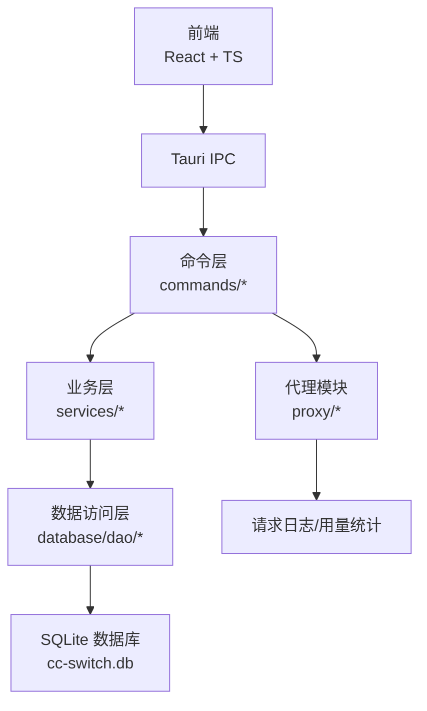
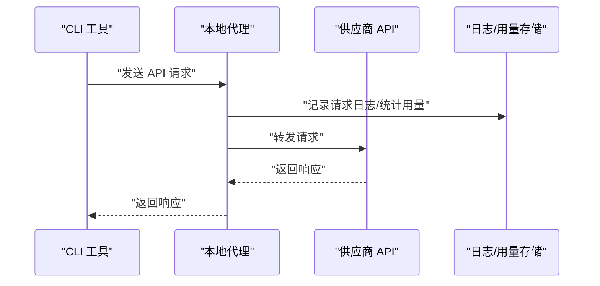
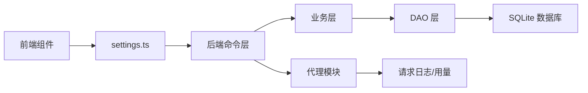

# 故障排除

<cite>
**本文引用的文件**
- [README.md](file://README.md)
- [SUPPORT.md](file://SUPPORT.md)
- [SECURITY.md](file://SECURITY.md)
- [docs/user-manual/zh/1-getting-started/1.2-installation.md](file://docs/user-manual/zh/1-getting-started/1.2-installation.md)
- [docs/user-manual/zh/5-faq/5.1-config-files.md](file://docs/user-manual/zh/5-faq/5.1-config-files.md)
- [docs/user-manual/zh/5-faq/5.2-questions.md](file://docs/user-manual/zh/5-faq/5.2-questions.md)
- [docs/user-manual/zh/5-faq/5.4-env-conflict.md](file://docs/user-manual/zh/5-faq/5.4-env-conflict.md)
- [docs/user-manual/zh/4-proxy/4.1-service.md](file://docs/user-manual/zh/4-proxy/4.1-service.md)
- [docs/user-manual/zh/4-proxy/4.2-routing.md](file://docs/user-manual/zh/4-proxy/4.2-routing.md)
- [docs/user-manual/zh/4-proxy/4.3-failover.md](file://docs/user-manual/zh/4-proxy/4.3-failover.md)
- [src-tauri/src/error.rs](file://src-tauri/src/error.rs)
- [src-tauri/src/proxy/error.rs](file://src-tauri/src/proxy/error.rs)
- [src-tauri/src/services/env_checker.rs](file://src-tauri/src/services/env_checker.rs)
- [src/lib/api/settings.ts](file://src/lib/api/settings.ts)
- [src/components/settings/AboutSection.tsx](file://src/components/settings/AboutSection.tsx)
- [src-tauri/src/proxy/types.rs](file://src-tauri/src/proxy/types.rs)
- [src-tauri/src/proxy/thinking_optimizer.rs](file://src-tauri/src/proxy/thinking_optimizer.rs)
- [src-tauri/src/database/dao/usage_rollup.rs](file://src-tauri/src/database/dao/usage_rollup.rs)
- [src-tauri/src/services/usage_stats.rs](file://src-tauri/src/services/usage_stats.rs)
- [src-tauri/src/database/backup.rs](file://src-tauri/src/database/backup.rs)
- [src-tauri/src/settings.rs](file://src-tauri/src/settings.rs)
</cite>

## 目录
1. [简介](#简介)
2. [项目结构](#项目结构)
3. [核心组件](#核心组件)
4. [架构总览](#架构总览)
5. [详细组件分析](#详细组件分析)
6. [依赖关系分析](#依赖关系分析)
7. [性能考虑](#性能考虑)
8. [故障排除指南](#故障排除指南)
9. [结论](#结论)
10. [附录](#附录)

## 简介
本指南面向 CC Switch 用户与运维人员，聚焦安装、配置、代理服务、故障转移与性能优化等常见问题，提供系统化的诊断方法、排障步骤、错误代码解释、预防与恢复策略，并给出社区支持渠道与紧急处理流程。文档严格依据仓库内的用户手册、错误定义与实现代码，确保可追溯与可操作。

## 项目结构
- 前端采用 React + TypeScript，通过 Tauri IPC 调用后端命令层。
- 后端使用 Rust，提供命令层、业务层、DAO 层与数据库交互，统一以 SQLite 为单一事实源（SSOT）。
- 代理模块负责本地代理、路由、故障转移、熔断器、日志与用量统计。
- 配置与数据存储位于用户目录 ~/.cc-switch/，包含数据库、设置、技能、备份与日志。

图表来源
- [README.md: 344-384:344-384](file://README.md#L344-L384)

章节来源
- [README.md: 344-384:344-384](file://README.md#L344-L384)

## 核心组件
- 代理服务：本地 HTTP 代理，支持日志、用量统计、故障转移与格式转换。
- 应用路由：将特定应用的 API 请求转发至本地代理，便于集中管理与热切换。
- 故障转移与熔断器：基于失败阈值、恢复等待与错误率的自动切换与保护。
- 配置与数据：统一存储于 SQLite，设备级设置与技能目录分离，支持自动备份与导入导出。
- 环境变量冲突检测：自动扫描系统与 shell 配置，避免与应用配置冲突。

章节来源
- [docs/user-manual/zh/4-proxy/4.1-service.md: 1-237:1-237](file://docs/user-manual/zh/4-proxy/4.1-service.md#L1-L237)
- [docs/user-manual/zh/4-proxy/4.2-routing.md: 1-196:1-196](file://docs/user-manual/zh/4-proxy/4.2-routing.md#L1-L196)
- [docs/user-manual/zh/4-proxy/4.3-failover.md: 1-233:1-233](file://docs/user-manual/zh/4-proxy/4.3-failover.md#L1-L233)
- [docs/user-manual/zh/5-faq/5.1-config-files.md: 1-363:1-363](file://docs/user-manual/zh/5-faq/5.1-config-files.md#L1-L363)
- [docs/user-manual/zh/5-faq/5.4-env-conflict.md: 1-109:1-109](file://docs/user-manual/zh/5-faq/5.4-env-conflict.md#L1-L109)

## 架构总览
代理服务工作流（请求从 CLI 工具到供应商再到日志与用量统计）：

图表来源
- [docs/user-manual/zh/4-proxy/4.1-service.md: 116-128:116-128](file://docs/user-manual/zh/4-proxy/4.1-service.md#L116-L128)

章节来源
- [docs/user-manual/zh/4-proxy/4.1-service.md: 116-128:116-128](file://docs/user-manual/zh/4-proxy/4.1-service.md#L116-L128)

## 详细组件分析

### 代理服务与日志
- 启动/停止：支持主界面与设置页开关；修改监听地址/端口需先停止服务。
- 配置：监听地址（127.0.0.1/0.0.0.0）、端口、日志开关。
- 运行状态：服务地址、当前供应商、活跃连接、成功率、运行时间、故障转移队列。
- 日志记录：启用日志后记录时间、应用、供应商、模型、Token、延迟、状态；可在“设置 → 用量”查看。

常见问题与解决
- 端口被占用：更换端口或关闭占用程序。
- 启动失败：检查端口占用、权限与防火墙。
- 请求超时：检查网络、供应商状态与代理配置。

章节来源
- [docs/user-manual/zh/4-proxy/4.1-service.md: 13-237:13-237](file://docs/user-manual/zh/4-proxy/4.1-service.md#L13-L237)

### 应用路由
- 路由原理：开启后修改应用配置，将 API 端点指向本地代理；支持多应用独立路由。
- 路由状态：主界面路由 Logo 与供应商卡片状态指示。
- 关闭路由：恢复原始配置并保存日志。

常见问题与解决
- 路由后请求失败：检查代理运行、供应商配置与网络。
- 关闭路由后配置未恢复：手动编辑供应商后保存，或重新启用再关闭。

章节来源
- [docs/user-manual/zh/4-proxy/4.2-routing.md: 1-196:1-196](file://docs/user-manual/zh/4-proxy/4.2-routing.md#L1-L196)

### 故障转移与熔断器
- 队列配置：按优先级添加/调整/移除备用供应商。
- 自动故障转移：失败时按序切换；支持熔断器（失败阈值、恢复成功阈值、恢复等待时间、错误率阈值、最小请求数）。
- 健康状态：健康/警告/熔断徽章；队列中亦显示健康状态。
- 日志：记录切换时间、原供应商、新供应商与失败原因。

常见问题与解决
- 未触发故障转移：检查代理运行、应用接管、自动故障转移与队列。
- 频繁触发：检查主供应商稳定性、网络与配置；调高阈值或更换主供应商。
- 所有供应商熔断：等待熔断到期或重启代理重置状态。

章节来源
- [docs/user-manual/zh/4-proxy/4.3-failover.md: 1-233:1-233](file://docs/user-manual/zh/4-proxy/4.3-failover.md#L1-L233)

### 配置与数据存储
- 存储位置：~/.cc-switch/，包含 cc-switch.db、settings.json、skills、skill-backups、backups。
- 数据库内容：providers、provider_endpoints、mcp_servers、prompts、skills、skill_repos、proxy_config、proxy_request_logs、provider_health、model_pricing、settings。
- 设备设置：语言、主题、窗口行为、自动启动、各工具配置目录等。
- 自动备份：导入前自动创建，保留最近 10 个备份；支持导出/导入。

章节来源
- [docs/user-manual/zh/5-faq/5.1-config-files.md: 1-363:1-363](file://docs/user-manual/zh/5-faq/5.1-config-files.md#L1-L363)

### 环境变量冲突
- 检测范围：ANTHROPIC_*、OPENAI_*、GEMINI_* 等关键字。
- 检测来源：Windows 注册表与系统环境、macOS/Linux shell 配置文件。
- 处理方式：自动备份并删除选中变量；支持忽略警告与手动处理。
- 最佳实践：使用 CC Switch 管理配置，定期检查冲突，备份重要变量。

章节来源
- [docs/user-manual/zh/5-faq/5.4-env-conflict.md: 1-109:1-109](file://docs/user-manual/zh/5-faq/5.4-env-conflict.md#L1-L109)
- [src-tauri/src/services/env_checker.rs: 1-169:1-169](file://src-tauri/src/services/env_checker.rs#L1-L169)

### 错误与诊断
- 应用错误类型：配置错误、输入无效、IO/JSON/TOML 解析、锁获取失败、HTTP 状态、数据库错误、未配置供应商、所有供应商熔断等。
- 代理错误类型：已在运行、未运行、绑定失败、停止超时/失败、转发失败、无可用供应商、所有供应商熔断、未配置供应商、上游错误、超过最大重试次数、数据库错误、配置错误、认证失败、超时等。
- 诊断接口：前端通过 settingsApi.probeToolInstallations 探测工具安装分布，后端逐工具枚举并判定冲突，生成锚定升级命令；支持静默补诊与批量诊断。

章节来源
- [src-tauri/src/error.rs: 1-147:1-147](file://src-tauri/src/error.rs#L1-L147)
- [src-tauri/src/proxy/error.rs: 1-207:1-207](file://src-tauri/src/proxy/error.rs#L1-L207)
- [src/lib/api/settings.ts: 250-291:250-291](file://src/lib/api/settings.ts#L250-L291)
- [src/components/settings/AboutSection.tsx: 448-507:448-507](file://src/components/settings/AboutSection.tsx#L448-L507)

## 依赖关系分析
- 前端组件通过 Tauri IPC 调用后端命令，命令层封装业务逻辑，DAO 层访问 SQLite。
- 代理模块依赖配置与健康状态，结合熔断器与故障转移队列实现高可用。
- 用量统计依赖代理日志与会话日志，经过去重与汇总后写入 rollup 表。

图表来源
- [README.md: 344-384:344-384](file://README.md#L344-L384)
- [src-tauri/src/database/dao/usage_rollup.rs: 157-202:157-202](file://src-tauri/src/database/dao/usage_rollup.rs#L157-L202)

章节来源
- [README.md: 344-384:344-384](file://README.md#L344-L384)
- [src-tauri/src/database/dao/usage_rollup.rs: 157-202:157-202](file://src-tauri/src/database/dao/usage_rollup.rs#L157-L202)

## 性能考虑
- 代理延迟：路由引入少量延迟（通常 < 10ms），对大多数场景可忽略。
- 日志级别：通过日志配置控制输出级别，调试/追踪级别会增加 IO 与 CPU 开销。
- 用量聚合：每日 rollup 会清理旧明细日志，避免无限增长；合理设置保留策略。
- 思维优化器：针对不同模型自动优化 thinking 配置，减少不必要的预算与 beta 标记，提升吞吐与稳定性。
- 缓存注入：Bedrock 专用优化器支持缓存注入与 TTL 控制，降低重复请求成本。

章节来源
- [docs/user-manual/zh/4-proxy/4.2-routing.md: 166-169:166-169](file://docs/user-manual/zh/4-proxy/4.2-routing.md#L166-L169)
- [src-tauri/src/proxy/types.rs: 239-285:239-285](file://src-tauri/src/proxy/types.rs#L239-L285)
- [src-tauri/src/proxy/thinking_optimizer.rs: 1-206:1-206](file://src-tauri/src/proxy/thinking_optimizer.rs#L1-L206)
- [src-tauri/src/database/dao/usage_rollup.rs: 157-202:157-202](file://src-tauri/src/database/dao/usage_rollup.rs#L157-L202)

## 故障排除指南

### 一、安装问题
- Windows 启动失败
  - 可能原因：缺少 WebView2 运行时、杀毒软件拦截。
  - 解决步骤：安装 Microsoft Edge WebView2，将 CC Switch 加入杀毒软件白名单。
- Linux 启动失败（AppImage）
  - 可能原因：缺少执行权限或沙箱限制。
  - 解决步骤：赋予执行权限；必要时使用 --no-sandbox 参数运行。
- macOS 安装
  - 说明：已签名并公证，可直接安装；如遇问题，尝试从 Releases 页面下载最新版本。

章节来源
- [docs/user-manual/zh/5-faq/5.2-questions.md: 9-31:9-31](file://docs/user-manual/zh/5-faq/5.2-questions.md#L9-L31)
- [docs/user-manual/zh/1-getting-started/1.2-installation.md: 119-163:119-163](file://docs/user-manual/zh/1-getting-started/1.2-installation.md#L119-L163)

### 二、配置错误
- 供应商切换后不生效
  - 说明：CLI 工具需要重新加载配置。
  - 解决步骤：Claude Code：关闭并重新打开终端或重启 IDE；Codex：关闭并重新打开终端；Gemini：托盘切换即时生效。
- API Key 无效
  - 检查步骤：确认 Key 正确、未过期、端点地址正确；使用速度测试验证连接。
- 恢复官方登录
  - 操作步骤：选择“官方登录”预设（Claude/Codex）或“Google 官方”预设（Gemini），点击“启用”，重启对应 CLI 工具，按其登录流程操作。

章节来源
- [docs/user-manual/zh/5-faq/5.2-questions.md: 34-58:34-58](file://docs/user-manual/zh/5-faq/5.2-questions.md#L34-L58)
- [docs/user-manual/zh/5-faq/5.2-questions.md: 43-50:43-50](file://docs/user-manual/zh/5-faq/5.2-questions.md#L43-L50)
- [docs/user-manual/zh/5-faq/5.2-questions.md: 51-58:51-58](file://docs/user-manual/zh/5-faq/5.2-questions.md#L51-L58)

### 三、代理服务异常
- 代理启动失败
  - 检查：端口占用、权限、防火墙。
  - 端口被占用：更换端口或关闭占用程序；或恢复默认端口。
- 请求超时
  - 可能原因：网络问题、供应商服务器问题、代理配置错误。
  - 解决方法：检查网络连接、直接访问供应商 API、检查供应商配置。
- 关闭代理后配置未恢复
  - 可能原因：代理异常退出。
  - 解决方法：编辑当前供应商，检查端点地址并保存以更新配置。

章节来源
- [docs/user-manual/zh/4-proxy/4.1-service.md: 219-237:219-237](file://docs/user-manual/zh/4-proxy/4.1-service.md#L219-L237)
- [docs/user-manual/zh/5-faq/5.2-questions.md: 79-99:79-99](file://docs/user-manual/zh/5-faq/5.2-questions.md#L79-L99)

### 四、故障转移问题
- 未触发故障转移
  - 检查清单：代理服务运行、应用接管开启、自动故障转移开启、队列中有备用供应商。
- 频繁触发故障转移
  - 可能原因：主供应商不稳定、网络问题、配置错误。
  - 解决方法：检查主供应商状态、调高失败阈值、考虑更换主供应商。
- 所有供应商都熔断
  - 解决方法：等待熔断时长到期（默认 60 秒）；或重启代理服务重置状态。

章节来源
- [docs/user-manual/zh/4-proxy/4.3-failover.md: 206-233:206-233](file://docs/user-manual/zh/4-proxy/4.3-failover.md#L206-L233)

### 五、数据与备份问题
- 配置丢失
  - 可能原因：配置目录被删除、数据库损坏。
  - 解决方法：检查 ~/.cc-switch/ 目录是否存在；从备份恢复（~/.cc-switch/backups/）；或从导出的配置文件导入。
- 导入配置失败
  - 可能原因：文件格式错误、版本不兼容。
  - 解决方法：确认文件为 CC Switch 导出的 SQL 备份文件；检查文件完整性。
- 用量统计数据为空
  - 检查清单：代理服务运行、应用接管开启、日志记录开启、有请求通过代理。

章节来源
- [docs/user-manual/zh/5-faq/5.2-questions.md: 129-158:129-158](file://docs/user-manual/zh/5-faq/5.2-questions.md#L129-L158)

### 六、环境相关问题
- 权限设置
  - 代理端口需足够权限；AppImage 需要执行权限；Linux 可能需要安装系统托盘支持。
- 防火墙配置
  - 代理端口需放行；若被阻拦，导致启动失败或请求超时。
- 杀毒软件冲突
  - 可能拦截 WebView2 或应用进程；加入白名单后重试。
- 环境变量冲突
  - 系统环境变量优先级高于配置文件，可能导致 API 密钥或端点被覆盖。
  - 解决方法：通过 CC Switch 自动备份并删除冲突变量；或手动编辑 shell 配置文件/Windows 注册表。

章节来源
- [docs/user-manual/zh/5-faq/5.4-env-conflict.md: 14-109:14-109](file://docs/user-manual/zh/5-faq/5.4-env-conflict.md#L14-L109)
- [docs/user-manual/zh/5-faq/5.2-questions.md: 9-31:9-31](file://docs/user-manual/zh/5-faq/5.2-questions.md#L9-L31)

### 七、错误代码与诊断方法
- 常见错误类型
  - 应用错误：配置错误、输入无效、IO/JSON/TOML 解析、锁获取失败、HTTP 状态、数据库错误、未配置供应商、所有供应商熔断。
  - 代理错误：已在运行、未运行、绑定失败、停止超时/失败、转发失败、无可用供应商、所有供应商熔断、未配置供应商、上游错误、超过最大重试次数、数据库错误、配置错误、认证失败、超时。
- 诊断方法
  - 日志分析：在“设置 → 用量”查看请求日志；根据时间、应用、供应商、模型、Token、延迟、状态定位问题。
  - 环境检查：使用环境变量冲突检测，自动列出冲突变量与来源，支持一键删除与备份。
  - 网络连接测试：直接访问供应商 API，确认网络与端点可达。
  - 工具安装诊断：通过 settingsApi.probeToolInstallations 探测各工具安装分布，识别冲突并生成锚定升级命令。

章节来源
- [src-tauri/src/error.rs: 6-63:6-63](file://src-tauri/src/error.rs#L6-L63)
- [src-tauri/src/proxy/error.rs: 9-77:9-77](file://src-tauri/src/proxy/error.rs#L9-L77)
- [src/lib/api/settings.ts: 250-291:250-291](file://src/lib/api/settings.ts#L250-L291)
- [src/components/settings/AboutSection.tsx: 448-507:448-507](file://src/components/settings/AboutSection.tsx#L448-L507)

### 八、性能调优指南
- 日志级别：在“设置 → 高级 → 日志管理”中控制日志输出级别，避免过度日志造成性能损耗。
- 代理配置：合理设置监听地址（127.0.0.1 仅本机访问更安全）、端口；避免与其他本地服务冲突。
- 故障转移参数：根据场景调整失败阈值、恢复等待时间与错误率阈值；为 Claude 提供更宽松的默认配置。
- 思维优化器：启用 Bedrock 专用优化器（Thinking 优化、缓存注入、TTL），减少不必要的预算与 beta 标记。
- 用量聚合：合理设置保留策略，避免明细日志无限增长；rollup 会清理旧明细日志。

章节来源
- [src-tauri/src/proxy/types.rs: 239-285:239-285](file://src-tauri/src/proxy/types.rs#L239-L285)
- [src-tauri/src/proxy/thinking_optimizer.rs: 1-206:1-206](file://src-tauri/src/proxy/thinking_optimizer.rs#L1-L206)
- [src-tauri/src/database/dao/usage_rollup.rs: 157-202:157-202](file://src-tauri/src/database/dao/usage_rollup.rs#L157-L202)

### 九、系统环境与权限
- 权限设置：确保代理端口可绑定；AppImage 可执行；Linux 安装系统托盘支持。
- 防火墙配置：放行代理端口；若被阻拦，导致启动失败或请求超时。
- 杀毒软件冲突：将 CC Switch 与 WebView2 加入白名单；必要时临时关闭干扰程序进行验证。

章节来源
- [docs/user-manual/zh/5-faq/5.2-questions.md: 9-31:9-31](file://docs/user-manual/zh/5-faq/5.2-questions.md#L9-L31)
- [docs/user-manual/zh/4-proxy/4.1-service.md: 219-237:219-237](file://docs/user-manual/zh/4-proxy/4.1-service.md#L219-L237)

### 十、社区支持与问题报告
- 获取帮助：阅读 FAQ、搜索现有 Issue；使用问题模板提交 Question、Bug、Doc Issue、Feature Request。
- 安全问题：通过 GitHub Security Advisories 私密报告，遵循 48 小时确认、7 天初步评估、14 天关键问题修复的响应流程。
- 社区渠道：GitHub Discussions 用于一般讨论；Bug 报告与功能请求通过相应模板提交。

章节来源
- [SUPPORT.md: 5-60:5-60](file://SUPPORT.md#L5-L60)
- [SECURITY.md: 14-59:14-59](file://SECURITY.md#L14-L59)

### 十一、故障案例分析与解决方案演示
- 案例一：端口被占用导致代理启动失败
  - 现象：启动时报“Address already in use”。
  - 诊断：使用 lsof/netstat 检查端口占用。
  - 解决：关闭占用程序或修改代理端口；恢复默认端口后重试。
- 案例二：环境变量冲突导致 API Key 被覆盖
  - 现象：切换供应商后请求发送到错误端点。
  - 诊断：查看环境变量冲突警告，确认冲突变量来源（Windows 注册表或 shell 配置文件）。
  - 解决：通过 CC Switch 自动备份并删除冲突变量；或手动编辑配置文件。
- 案例三：频繁触发故障转移
  - 现象：主供应商不稳定，频繁切换备用供应商。
  - 诊断：检查主供应商健康状态、网络与配置。
  - 解决：调高失败阈值、延长恢复等待时间，或更换更稳定的主供应商。

章节来源
- [docs/user-manual/zh/4-proxy/4.1-service.md: 211-218:211-218](file://docs/user-manual/zh/4-proxy/4.1-service.md#L211-L218)
- [docs/user-manual/zh/5-faq/5.4-env-conflict.md: 88-95:88-95](file://docs/user-manual/zh/5-faq/5.4-env-conflict.md#L88-L95)
- [docs/user-manual/zh/4-proxy/4.3-failover.md: 216-227:216-227](file://docs/user-manual/zh/4-proxy/4.3-failover.md#L216-L227)

## 结论
通过系统化的安装验证、配置校验、代理与路由检查、故障转移与熔断器参数调优、日志与用量分析，以及环境变量冲突检测与处理，绝大多数问题均可快速定位与解决。建议在生产环境中启用自动备份、合理设置日志级别与熔断参数，并定期检查工具安装与配置一致性，以获得稳定高效的使用体验。

## 附录
- 数据存储位置与结构
  - 目录：~/.cc-switch/
  - 文件：cc-switch.db、settings.json、skills/、skill-backups/、backups/
- 常用命令与路径
  - 代理服务：设置 → 高级 → 代理服务
  - 应用路由：设置 → 高级 → 路由服务 → 应用路由
  - 故障转移：设置 → 高级 → 故障转移
  - 环境变量冲突：界面顶部警告横幅，支持自动检测与一键删除
  - 日志文件：macOS/Linux：~/.cc-switch/logs/；Windows：%APPDATA%\cc-switch\logs\

章节来源
- [docs/user-manual/zh/5-faq/5.1-config-files.md: 5-21:5-21](file://docs/user-manual/zh/5-faq/5.1-config-files.md#L5-L21)
- [docs/user-manual/zh/5-faq/5.2-questions.md: 260-266:260-266](file://docs/user-manual/zh/5-faq/5.2-questions.md#L260-L266)