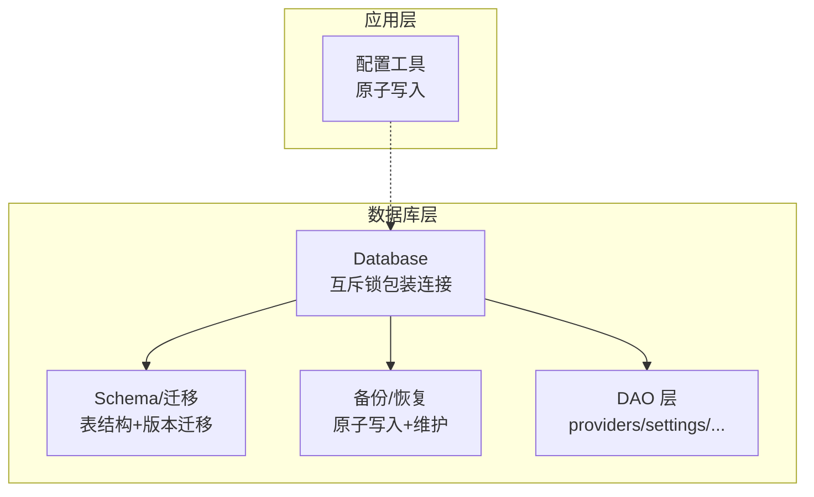
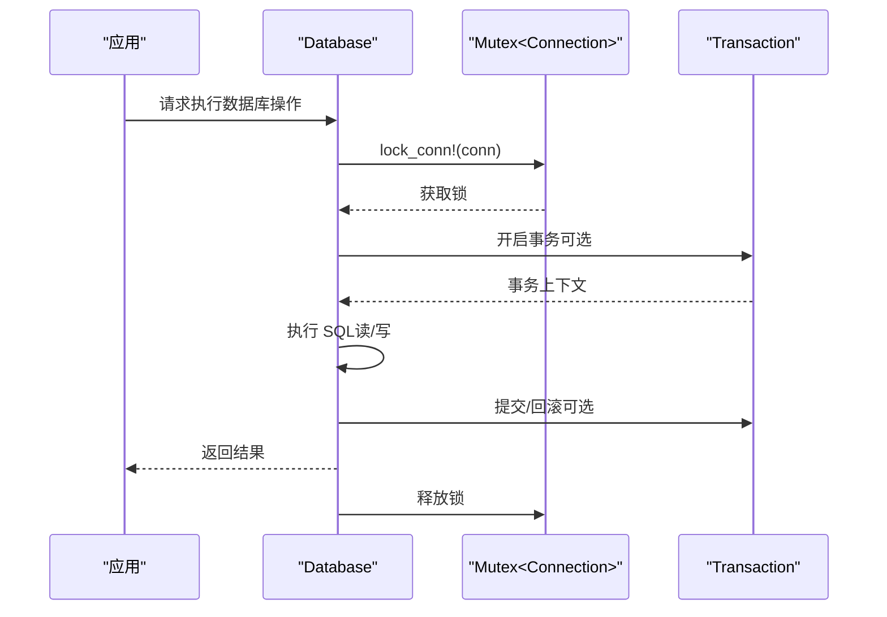
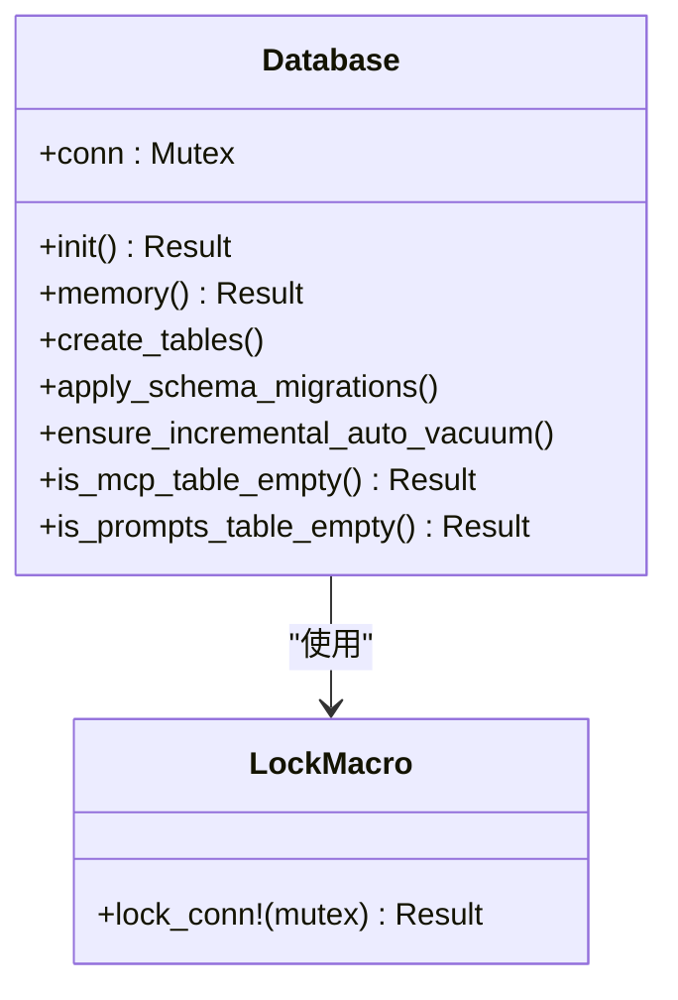
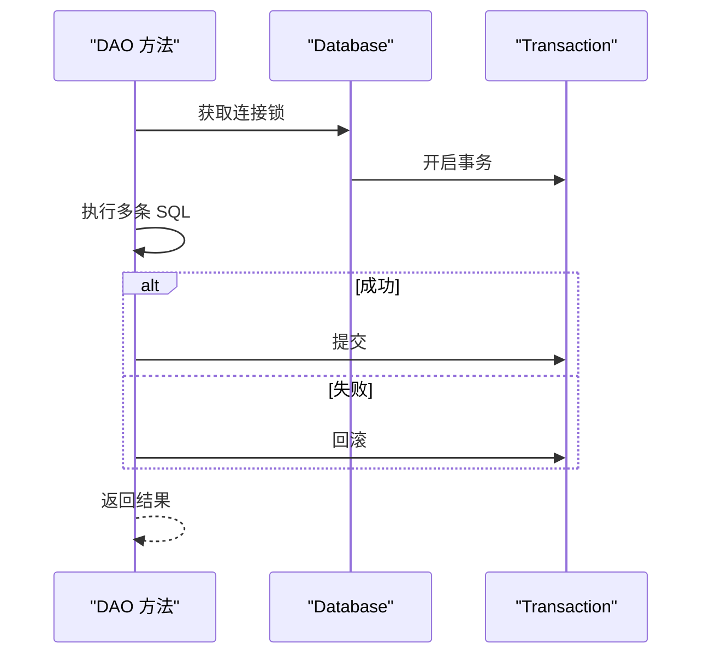
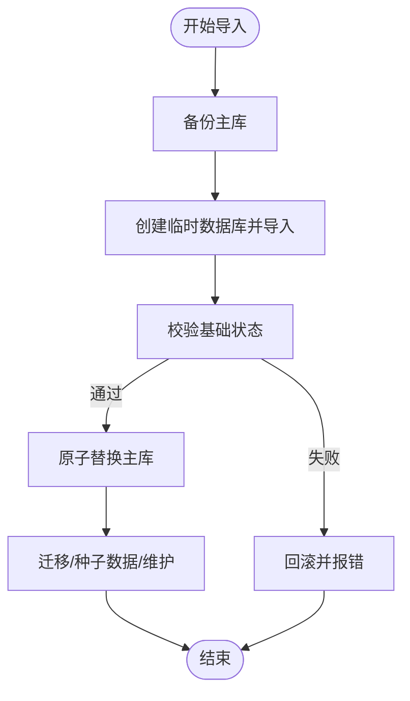
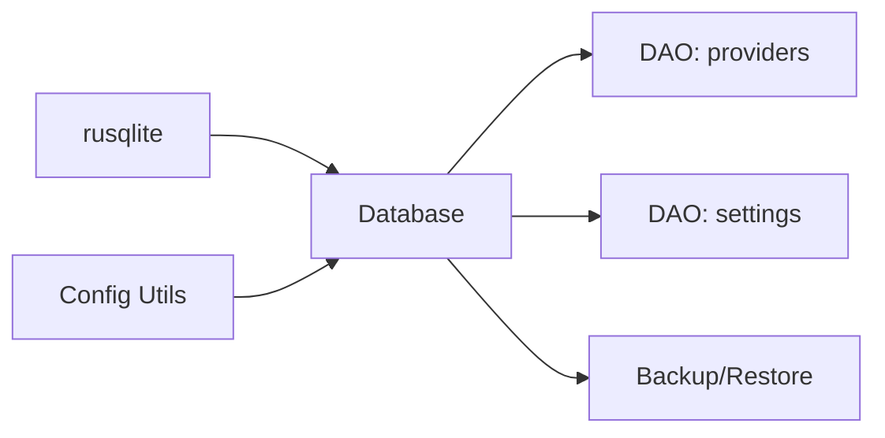

# 并发安全机制

<cite>
**本文引用的文件**
- [src-tauri/src/database/mod.rs](file://src-tauri/src/database/mod.rs)
- [src-tauri/src/database/schema.rs](file://src-tauri/src/database/schema.rs)
- [src-tauri/src/database/backup.rs](file://src-tauri/src/database/backup.rs)
- [src-tauri/src/database/migration.rs](file://src-tauri/src/database/migration.rs)
- [src-tauri/src/database/dao/mod.rs](file://src-tauri/src/database/dao/mod.rs)
- [src-tauri/src/database/dao/providers.rs](file://src-tauri/src/database/dao/providers.rs)
- [src-tauri/src/database/dao/settings.rs](file://src-tauri/src/database/dao/settings.rs)
- [src-tauri/src/config.rs](file://src-tauri/src/config.rs)
</cite>

## 目录
1. [简介](#简介)
2. [项目结构](#项目结构)
3. [核心组件](#核心组件)
4. [架构总览](#架构总览)
5. [详细组件分析](#详细组件分析)
6. [依赖关系分析](#依赖关系分析)
7. [性能考量](#性能考量)
8. [故障排查指南](#故障排查指南)
9. [结论](#结论)
10. [附录](#附录)

## 简介
本文件聚焦 CC Switch 后端数据库的并发安全机制，围绕以下主题展开：
- 数据库锁机制：互斥锁保护、连接池管理、事务隔离级别
- 防止配置损坏：原子写入、一致性保障
- 并发访问控制：读写锁策略、死锁预防
- 连接管理：超时设置、资源清理
- 性能优化建议与最佳实践
- 多线程安全的数据库操作流程

## 项目结构
数据库相关代码主要位于 src-tauri/src/database 目录，采用分层设计：
- database/mod.rs：数据库入口、初始化、锁封装、变更钩子
- database/schema.rs：表结构定义、迁移逻辑、索引与约束
- database/backup.rs：备份/恢复、原子写入、维护任务
- database/migration.rs：从旧 JSON 配置迁移至 SQLite 的事务化流程
- database/dao/*：领域 DAO 层（providers、settings 等），均通过 Database 实例执行
- src-tauri/src/config.rs：应用配置目录与原子写入工具（用于配置文件层面的一致性）

图表来源
- [src-tauri/src/database/mod.rs](file://src-tauri/src/database/mod.rs)
- [src-tauri/src/database/schema.rs](file://src-tauri/src/database/schema.rs)
- [src-tauri/src/database/backup.rs](file://src-tauri/src/database/backup.rs)
- [src-tauri/src/database/dao/mod.rs](file://src-tauri/src/database/dao/mod.rs)
- [src-tauri/src/config.rs](file://src-tauri/src/config.rs)

章节来源
- [src-tauri/src/database/mod.rs](file://src-tauri/src/database/mod.rs)
- [src-tauri/src/database/schema.rs](file://src-tauri/src/database/schema.rs)
- [src-tauri/src/database/backup.rs](file://src-tauri/src/database/backup.rs)
- [src-tauri/src/database/dao/mod.rs](file://src-tauri/src/database/dao/mod.rs)
- [src-tauri/src/config.rs](file://src-tauri/src/config.rs)

## 核心组件
- Database 结构体：以 Mutex 包装 rusqlite::Connection，使连接可在多线程环境中共享
- 互斥锁宏 lock_conn：统一获取连接锁，避免 unwrap panic
- 事务封装：DAO 层与迁移流程广泛使用事务，确保原子性与一致性
- 外键约束与索引：通过 PRAGMA 与建表语句启用外键，建立关键查询索引
- 变更钩子：注册 update_hook，在 INSERT/UPDATE/DELETE 时通知同步服务
- 原子写入：备份与导入流程使用临时数据库 + Backup 原子替换，确保配置损坏防护

章节来源
- [src-tauri/src/database/mod.rs](file://src-tauri/src/database/mod.rs)
- [src-tauri/src/database/backup.rs](file://src-tauri/src/database/backup.rs)
- [src-tauri/src/database/migration.rs](file://src-tauri/src/database/migration.rs)

## 架构总览
数据库并发安全的关键路径如下：
- 初始化阶段：打开连接、启用外键、增量自动回收、注册变更钩子
- 运行阶段：所有数据库操作通过 lock_conn 获取互斥锁；读写操作尽量包裹在事务中
- 维护阶段：周期性清理日志、增量真空、备份与恢复
- 导入/导出：使用内存快照与临时数据库，确保失败不污染主库

图表来源
- [src-tauri/src/database/mod.rs](file://src-tauri/src/database/mod.rs)
- [src-tauri/src/database/dao/providers.rs](file://src-tauri/src/database/dao/providers.rs)
- [src-tauri/src/database/migration.rs](file://src-tauri/src/database/migration.rs)

## 详细组件分析

### 数据库连接与锁机制
- 互斥锁保护：rusqlite::Connection 本身不是 Sync，通过 Mutex 包装实现跨线程共享
- 统一加锁宏：lock_conn! 宏封装锁获取与错误转换，避免裸锁调用导致的 panic
- 外键约束：初始化时启用 PRAGMA foreign_keys = ON，确保参照完整性
- 自动回收：首次运行设置 auto_vacuum = INCREMENTAL，后续通过 ensure_incremental_auto_vacuum 保障
- 变更通知：注册 update_hook，在 INSERT/UPDATE/DELETE 时通知 WebDAV/S3 自动同步

图表来源
- [src-tauri/src/database/mod.rs](file://src-tauri/src/database/mod.rs)

章节来源
- [src-tauri/src/database/mod.rs](file://src-tauri/src/database/mod.rs)

### 事务隔离与一致性
- 事务化 DAO：如保存供应商 save_provider、迁移 migrate_from_json 等均在事务内执行
- 事务提交：成功后 commit，失败回滚，确保原子性
- 事务边界：DAO 方法内部开启事务，避免跨多个 DAO 调用时的不一致

图表来源
- [src-tauri/src/database/dao/providers.rs](file://src-tauri/src/database/dao/providers.rs)
- [src-tauri/src/database/migration.rs](file://src-tauri/src/database/migration.rs)

章节来源
- [src-tauri/src/database/dao/providers.rs](file://src-tauri/src/database/dao/providers.rs)
- [src-tauri/src/database/migration.rs](file://src-tauri/src/database/migration.rs)

### 防止配置损坏与原子写入
- 备份优先：导入前先备份当前数据库，失败时可回滚
- 临时数据库：在内存或临时文件中执行导入，校验通过后再原子替换主库
- 原子替换：使用 Backup::new 将临时库原子写回主库，避免中间态
- 导出过滤：支持导出时跳过本地瞬态表，便于同步
- 维护任务：定期清理日志与聚合数据，执行增量真空回收空间

图表来源
- [src-tauri/src/database/backup.rs](file://src-tauri/src/database/backup.rs)

章节来源
- [src-tauri/src/database/backup.rs](file://src-tauri/src/database/backup.rs)

### 并发访问控制与死锁预防
- 互斥锁策略：所有数据库操作通过 lock_conn 获取连接锁，避免并发读写竞争
- 事务粒度：将相关写操作放入同一事务，减少锁持有时间与冲突概率
- 索引优化：为高频查询建立索引（如代理请求日志、流检查日志），降低锁竞争
- 变更钩子：在 INSERT/UPDATE/DELETE 时触发同步通知，避免轮询带来的额外锁争用

章节来源
- [src-tauri/src/database/mod.rs](file://src-tauri/src/database/mod.rs)
- [src-tauri/src/database/schema.rs](file://src-tauri/src/database/schema.rs)

### 数据库连接管理、超时设置与资源清理
- 连接生命周期：Database::init 打开连接并启用外键；Database::memory 创建内存库用于测试
- 超时设置：代理配置表包含多类超时参数（首字节、空闲、非流式），用于上游请求控制
- 资源清理：启动与周期任务中执行清理日志、增量真空、备份清理，保持数据库健康

章节来源
- [src-tauri/src/database/mod.rs](file://src-tauri/src/database/mod.rs)
- [src-tauri/src/database/schema.rs](file://src-tauri/src/database/schema.rs)
- [src-tauri/src/database/backup.rs](file://src-tauri/src/database/backup.rs)

### 多线程安全的数据库操作最佳实践
- 统一入口：所有数据库操作通过 Database 实例与 lock_conn 宏
- 事务优先：批量写入或强一致需求使用事务
- 读写分离：长事务尽量只读，避免阻塞写入
- 避免嵌套锁：DAO 内部事务完成后尽快释放锁
- 严格校验：导入/恢复前后进行基础状态校验

章节来源
- [src-tauri/src/database/mod.rs](file://src-tauri/src/database/mod.rs)
- [src-tauri/src/database/dao/providers.rs](file://src-tauri/src/database/dao/providers.rs)
- [src-tauri/src/database/backup.rs](file://src-tauri/src/database/backup.rs)

## 依赖关系分析
- Database 依赖 rusqlite::Connection 与 Mutex，提供线程安全的连接封装
- DAO 层依赖 Database 的连接与事务能力，实现领域操作
- 备份模块依赖 Database 的连接与 Backup 能力，实现原子写入
- 配置模块提供应用配置目录与原子写入工具，保障配置文件一致性

图表来源
- [src-tauri/src/database/mod.rs](file://src-tauri/src/database/mod.rs)
- [src-tauri/src/database/dao/providers.rs](file://src-tauri/src/database/dao/providers.rs)
- [src-tauri/src/database/dao/settings.rs](file://src-tauri/src/database/dao/settings.rs)
- [src-tauri/src/database/backup.rs](file://src-tauri/src/database/backup.rs)
- [src-tauri/src/config.rs](file://src-tauri/src/config.rs)

章节来源
- [src-tauri/src/database/mod.rs](file://src-tauri/src/database/mod.rs)
- [src-tauri/src/database/dao/mod.rs](file://src-tauri/src/database/dao/mod.rs)
- [src-tauri/src/database/backup.rs](file://src-tauri/src/database/backup.rs)
- [src-tauri/src/config.rs](file://src-tauri/src/config.rs)

## 性能考量
- 索引优化：为高频查询字段建立索引，减少锁等待与扫描成本
- 事务批处理：将多次写入合并到单个事务，降低锁竞争与 WAL 写入次数
- 增量回收：启用 auto_vacuum = INCREMENTAL，避免大表重建带来的停顿
- 维护任务：定期清理日志与聚合数据，控制表规模，提升查询性能
- 导出/导入：使用内存快照与临时数据库，避免长时间持有主库锁

## 故障排查指南
- 初始化失败：检查外键启用、自动回收设置、表创建与迁移是否成功
- 导入失败：确认导入 SQL 格式、基础状态校验、临时数据库执行结果
- 备份异常：检查备份目录权限、文件名合法性、备份数量限制
- 性能下降：检查索引使用情况、清理任务执行状态、增量真空是否生效
- 配置损坏：利用预导入备份回滚，或使用安全备份进行恢复

章节来源
- [src-tauri/src/database/mod.rs](file://src-tauri/src/database/mod.rs)
- [src-tauri/src/database/backup.rs](file://src-tauri/src/database/backup.rs)
- [src-tauri/src/database/schema.rs](file://src-tauri/src/database/schema.rs)

## 结论
CC Switch 的数据库并发安全机制以互斥锁保护为核心，结合事务化操作、原子写入与维护任务，有效保障了配置一致性与运行稳定性。通过启用外键、索引与增量回收，配合严格的导入/导出流程，系统在多线程环境下实现了可靠的数据库操作。

## 附录
- 事务化 DAO 示例：保存供应商、迁移 JSON 配置
- 原子导入/恢复流程：备份 → 临时库导入 → 校验 → 原子替换
- 超时与维护：代理配置超时参数、周期性清理与增量真空

章节来源
- [src-tauri/src/database/dao/providers.rs](file://src-tauri/src/database/dao/providers.rs)
- [src-tauri/src/database/migration.rs](file://src-tauri/src/database/migration.rs)
- [src-tauri/src/database/backup.rs](file://src-tauri/src/database/backup.rs)
- [src-tauri/src/database/schema.rs](file://src-tauri/src/database/schema.rs)