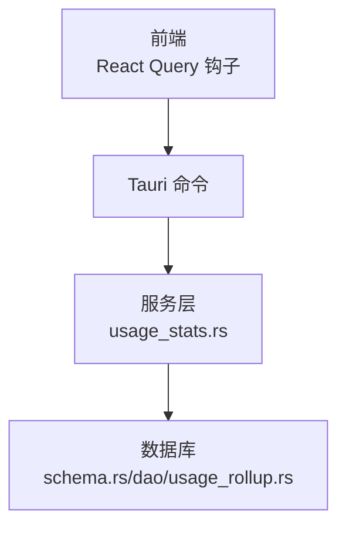
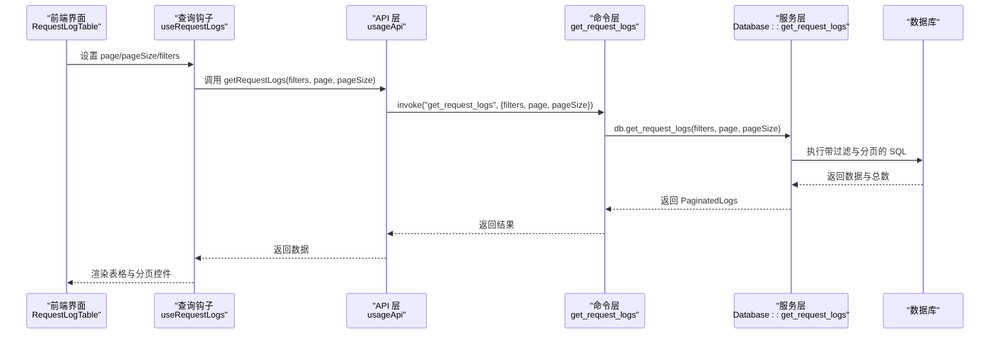
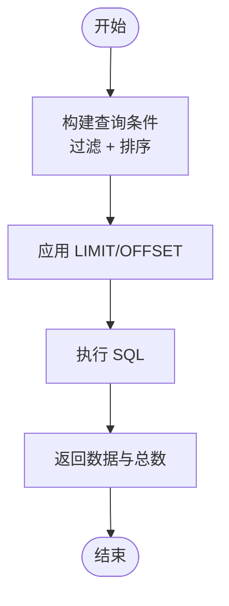
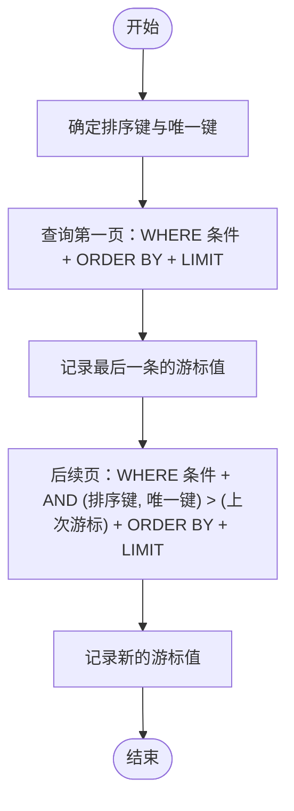
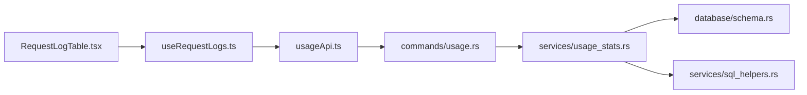

# 分页查询优化

<cite>
**本文档引用的文件**
- [src-tauri/src/services/usage_stats.rs](file://src-tauri/src/services/usage_stats.rs)
- [src-tauri/src/database/schema.rs](file://src-tauri/src/database/schema.rs)
- [src-tauri/src/commands/usage.rs](file://src-tauri/src/commands/usage.rs)
- [src/lib/query/usage.ts](file://src/lib/query/usage.ts)
- [src/lib/api/usage.ts](file://src/lib/api/usage.ts)
- [src/components/usage/RequestLogTable.tsx](file://src/components/usage/RequestLogTable.tsx)
- [src-tauri/src/services/sql_helpers.rs](file://src-tauri/src/services/sql_helpers.rs)
- [src-tauri/src/database/dao/usage_rollup.rs](file://src-tauri/src/database/dao/usage_rollup.rs)
</cite>

## 目录
1. [简介](#简介)
2. [项目结构](#项目结构)
3. [核心组件](#核心组件)
4. [架构总览](#架构总览)
5. [详细组件分析](#详细组件分析)
6. [依赖分析](#依赖分析)
7. [性能考量](#性能考量)
8. [故障排查指南](#故障排查指南)
9. [结论](#结论)
10. [附录](#附录)

## 简介
本文件针对 CC Switch 的分页查询优化进行系统化梳理，重点覆盖以下方面：
- LIMIT/OFFSET 分页策略的实现现状与性能影响
- 键集分页（Keyset Pagination）的原理、适用场景与实现思路
- 复合索引设计原则与查询性能提升策略
- 分页查询的内存使用优化（流式处理与批量加载）
- 分页缓存机制（查询结果缓存与分页状态持久化）
- 最佳实践（查询语句优化、索引使用建议、性能监控指标）

## 项目结构
CC Switch 的分页查询涉及前端查询钩子、Tauri 命令、后端服务层与数据库层的协同：
- 前端：React Query 钩子负责构建查询键、发起请求与缓存管理
- 命令层：Tauri 命令桥接前端与后端服务
- 服务层：业务查询逻辑、SQL 构造与过滤条件
- 数据层：SQLite 表结构与索引定义

**图表来源**
- [src/lib/query/usage.ts:233-259](file://src/lib/query/usage.ts#L233-L259)
- [src-tauri/src/commands/usage.rs:72-90](file://src-tauri/src/commands/usage.rs#L72-L90)
- [src-tauri/src/services/usage_stats.rs:1227-1320](file://src-tauri/src/services/usage_stats.rs#L1227-L1320)
- [src-tauri/src/database/schema.rs:183-220](file://src-tauri/src/database/schema.rs#L183-L220)
- [src-tauri/src/database/dao/usage_rollup.rs:57-180](file://src-tauri/src/database/dao/usage_rollup.rs#L57-L180)

**章节来源**
- [src/lib/query/usage.ts:1-320](file://src/lib/query/usage.ts#L1-L320)
- [src-tauri/src/commands/usage.rs:1-314](file://src-tauri/src/commands/usage.rs#L1-L314)
- [src-tauri/src/services/usage_stats.rs:1-200](file://src-tauri/src/services/usage_stats.rs#L1-L200)
- [src-tauri/src/database/schema.rs:183-220](file://src-tauri/src/database/schema.rs#L183-L220)

## 核心组件
- 前端分页组件：RequestLogTable 负责分页导航、筛选与渲染
- 查询钩子：useRequestLogs 构建查询键并调用 API
- API 层：usageApi 将参数传递给 Tauri 命令
- 命令层：get_request_logs 接收前端参数并调用数据库服务
- 服务层：Database::get_request_logs 实现分页查询与过滤
- 数据层：proxy_request_logs 表与相关索引

**章节来源**
- [src/components/usage/RequestLogTable.tsx:45-122](file://src/components/usage/RequestLogTable.tsx#L45-L122)
- [src/lib/query/usage.ts:233-259](file://src/lib/query/usage.ts#L233-L259)
- [src/lib/api/usage.ts:90-108](file://src/lib/api/usage.ts#L90-L108)
- [src-tauri/src/commands/usage.rs:72-90](file://src-tauri/src/commands/usage.rs#L72-L90)
- [src-tauri/src/services/usage_stats.rs:1227-1320](file://src-tauri/src/services/usage_stats.rs#L1227-L1320)

## 架构总览
前端通过 React Query 发起分页请求，Tauri 命令将请求转发至服务层，服务层构造 SQL 并执行，最终返回分页数据。

**图表来源**
- [src/components/usage/RequestLogTable.tsx:65-73](file://src/components/usage/RequestLogTable.tsx#L65-L73)
- [src/lib/query/usage.ts:233-259](file://src/lib/query/usage.ts#L233-L259)
- [src/lib/api/usage.ts:90-108](file://src/lib/api/usage.ts#L90-L108)
- [src-tauri/src/commands/usage.rs:72-90](file://src-tauri/src/commands/usage.rs#L72-L90)
- [src-tauri/src/services/usage_stats.rs:1227-1320](file://src-tauri/src/services/usage_stats.rs#L1227-L1320)

## 详细组件分析

### LIMIT/OFFSET 分页实现与性能影响
- 实现位置：服务层 Database::get_request_logs 使用 LIMIT 与 OFFSET 进行分页
- 性能问题：
  - OFFSET 越大，数据库需扫描并丢弃更多行，I/O 与 CPU 开销随偏移线性增长
  - 大数据量下排序或复杂过滤会进一步放大延迟
- 当前实现特点：
  - 使用有效日志过滤条件减少重复与会话来源数据干扰
  - 通过索引提升过滤与排序效率（见“索引设计”）

**图表来源**
- [src-tauri/src/services/usage_stats.rs:1227-1320](file://src-tauri/src/services/usage_stats.rs#L1227-L1320)

**章节来源**
- [src-tauri/src/services/usage_stats.rs:1227-1320](file://src-tauri/src/services/usage_stats.rs#L1227-L1320)

### 键集分页（Keyset Pagination）原理与实现思路
- 原理：基于稳定且唯一列（如 created_at、request_id）的“游标”推进，避免 OFFSET
- 优势：
  - 随页码推进性能稳定，适合大数据量滚动加载
  - 对热点数据与频繁变更场景更友好
- 实现要点（概念性说明）：
  - 选择稳定排序键（如 created_at 升序，request_id 作为第二排序键保证唯一性）
  - 每页返回最后一条记录的游标值，下一页以此为起点查询
  - 处理边界：首屏、末屏、并发写入导致的数据跳跃与重复
- 适用场景：
  - 日志类、事件流类数据的持续浏览
  - 需要“从最近到最旧”或“从最旧到最新”的线性浏览

[此图为概念流程图，不对应具体源码文件，故不附“图表来源”]

### 复合索引优化策略
- 现有索引（与分页相关）：
  - idx_request_logs_provider(app_type, provider_id)
  - idx_request_logs_created_at(created_at)
  - idx_request_logs_model(model)
  - idx_request_logs_session(session_id)
  - idx_request_logs_status(status_code)
- 设计原则：
  - 选择高频过滤列与排序列组合建立复合索引
  - 将区分度高且常用于 WHERE 的列放在前面
  - 考虑覆盖索引（包含查询所需列）减少回表
- 针对分页查询的建议：
  - 若常用按时间倒序浏览，优先考虑 (created_at, request_id) 复合索引
  - 若同时按 app_type 与 provider_id 过滤，考虑 (app_type, provider_id, created_at) 或 (provider_id, created_at)

**章节来源**
- [src-tauri/src/database/schema.rs:201-219](file://src-tauri/src/database/schema.rs#L201-L219)

### 分页查询的内存使用优化
- 流式处理：
  - 后端逐行映射（query_map）而非一次性装载到内存
  - 前端仅缓存当前页与必要的查询键，避免全量缓存
- 批量加载：
  - 合理设置 page_size（当前前端默认 20），避免过大批次导致内存峰值
  - 结合自动刷新间隔，平衡实时性与资源占用
- 会话日志去重与裁剪：
  - 通过 effective_usage_log_filter 减少重复与会话来源数据
  - usage_rollup 定期将明细聚合到 rollups 并裁剪明细，降低查询基数

**章节来源**
- [src-tauri/src/services/usage_stats.rs:157-198](file://src-tauri/src/services/usage_stats.rs#L157-L198)
- [src-tauri/src/services/usage_stats.rs:226-250](file://src-tauri/src/services/usage_stats.rs#L226-L250)
- [src-tauri/src/database/dao/usage_rollup.rs:57-180](file://src-tauri/src/database/dao/usage_rollup.rs#L57-L180)

### 分页缓存机制
- 查询结果缓存：
  - React Query 默认启用查询缓存，查询键包含 filters、时间范围、页码与页大小
  - 缓存命中时直接返回，避免重复网络与数据库调用
- 分页状态持久化：
  - 前端页面状态（当前页、筛选条件、时间范围）可通过路由或本地状态维持
  - 建议在用户切换视图或刷新页面后恢复分页状态，提升体验
- 建议：
  - 对高频访问的筛选组合设置较长的缓存时间
  - 对实时性要求高的场景（如近实时日志）设置较短刷新间隔

**章节来源**
- [src/lib/query/usage.ts:102-123](file://src/lib/query/usage.ts#L102-L123)
- [src/lib/query/usage.ts:233-259](file://src/lib/query/usage.ts#L233-L259)
- [src/components/usage/RequestLogTable.tsx:56-86](file://src/components/usage/RequestLogTable.tsx#L56-L86)

## 依赖分析
- 前端依赖链：RequestLogTable -> useRequestLogs -> usageApi -> Tauri 命令 -> 服务层 -> 数据库
- 关键依赖点：
  - effective_usage_log_filter 与 idx_request_logs_* 索引共同决定查询性能
  - sql_helpers::fresh_input_sql 用于跨提供商的输入令牌一致性计算

**图表来源**
- [src/components/usage/RequestLogTable.tsx:20-73](file://src/components/usage/RequestLogTable.tsx#L20-L73)
- [src/lib/query/usage.ts:233-259](file://src/lib/query/usage.ts#L233-L259)
- [src/lib/api/usage.ts:90-108](file://src/lib/api/usage.ts#L90-L108)
- [src-tauri/src/commands/usage.rs:72-90](file://src-tauri/src/commands/usage.rs#L72-L90)
- [src-tauri/src/services/usage_stats.rs:226-250](file://src-tauri/src/services/usage_stats.rs#L226-L250)
- [src-tauri/src/database/schema.rs:201-219](file://src-tauri/src/database/schema.rs#L201-L219)
- [src-tauri/src/services/sql_helpers.rs:31-47](file://src-tauri/src/services/sql_helpers.rs#L31-L47)

**章节来源**
- [src-tauri/src/services/usage_stats.rs:226-250](file://src-tauri/src/services/usage_stats.rs#L226-L250)
- [src-tauri/src/services/sql_helpers.rs:31-47](file://src-tauri/src/services/sql_helpers.rs#L31-L47)

## 性能考量
- LIMIT/OFFSET 优化建议：
  - 优先使用键集分页替代深度 OFFSET
  - 为高频过滤列建立复合索引，减少排序与回表
  - 控制 page_size，避免单页过大
- 查询语句优化：
  - 使用 effective_usage_log_filter 过滤重复与会话来源数据
  - 使用 fresh_input_sql 统一输入令牌口径，避免重复计算
- 索引使用建议：
  - 评估 (created_at, request_id) 或 (provider_id, created_at) 复合索引对分页查询的收益
  - 对 app_type 与 provider_id 的组合查询，确保索引顺序合理
- 性能监控指标：
  - 查询耗时（数据库层）、网络往返时间（前端到后端）
  - 分页页大小与平均数据量
  - 缓存命中率与刷新频率

[本节为通用性能指导，不直接分析具体文件，故不附“章节来源”]

## 故障排查指南
- 分页异常或数据重复：
  - 检查 effective_usage_log_filter 是否正确过滤会话来源与重复行
  - 确认 created_at 与 request_id 的排序与唯一性
- 查询缓慢：
  - 检查相关索引是否存在与是否被使用
  - 观察 page_size 是否过大，适当下调
- 前端分页状态丢失：
  - 确认查询键包含 filters、时间范围与页码
  - 检查刷新间隔设置是否导致状态被覆盖

**章节来源**
- [src-tauri/src/services/usage_stats.rs:226-250](file://src-tauri/src/services/usage_stats.rs#L226-L250)
- [src-tauri/src/database/schema.rs:201-219](file://src-tauri/src/database/schema.rs#L201-L219)
- [src/lib/query/usage.ts:102-123](file://src/lib/query/usage.ts#L102-L123)

## 结论
- 当前实现采用 LIMIT/OFFSET 分页，满足中小规模数据浏览需求
- 针对大规模日志与高并发场景，建议引入键集分页与复合索引优化
- 通过缓存与合理的刷新策略，可在保证实时性的同时降低资源消耗
- 建议持续监控关键指标并根据业务特征迭代索引与分页策略

[本节为总结性内容，不直接分析具体文件，故不附“章节来源”]

## 附录

### 查询键与分页参数
- 查询键包含：preset、自定义起止时间、appType、providerName、model、statusCode、page、pageSize
- 作用：确保相同参数组合命中同一缓存条目，避免重复请求

**章节来源**
- [src/lib/query/usage.ts:102-123](file://src/lib/query/usage.ts#L102-L123)
- [src/lib/query/usage.ts:233-259](file://src/lib/query/usage.ts#L233-L259)

### 有效日志过滤与缓存规范化
- effective_usage_log_filter：过滤会话来源与重复行，提升统计准确性
- fresh_input_sql：统一输入令牌口径，避免不同提供商差异导致的统计偏差

**章节来源**
- [src-tauri/src/services/usage_stats.rs:226-250](file://src-tauri/src/services/usage_stats.rs#L226-L250)
- [src-tauri/src/services/sql_helpers.rs:31-47](file://src-tauri/src/services/sql_helpers.rs#L31-L47)