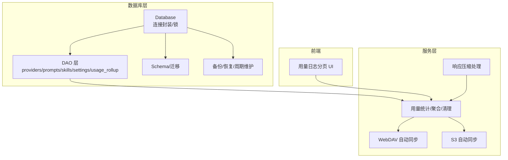
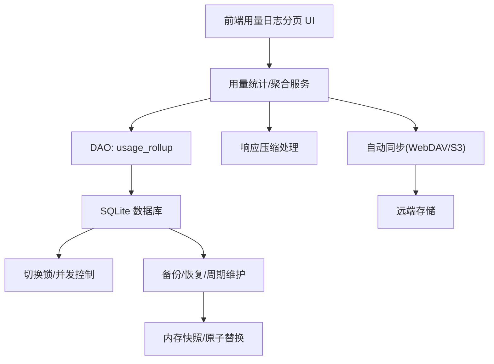
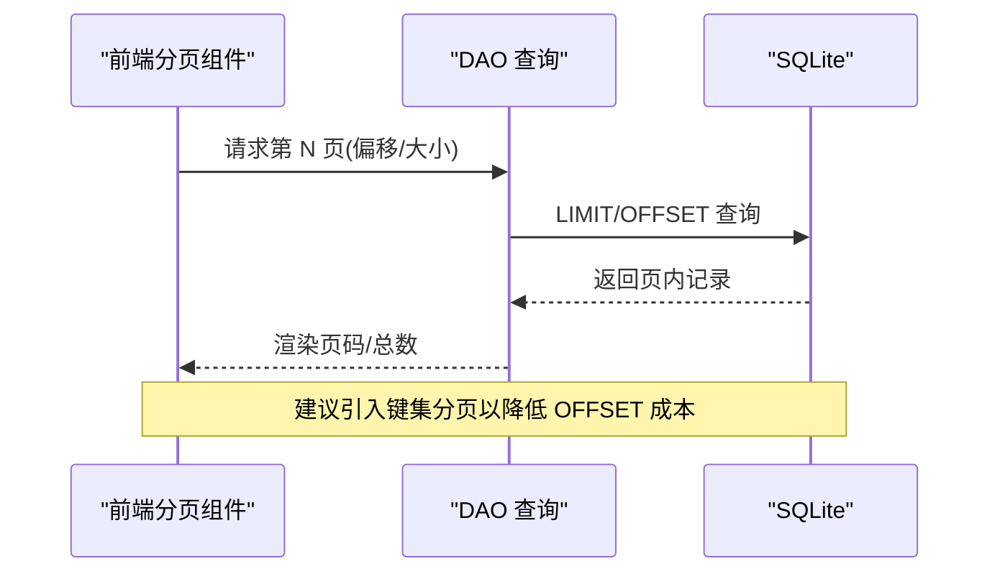
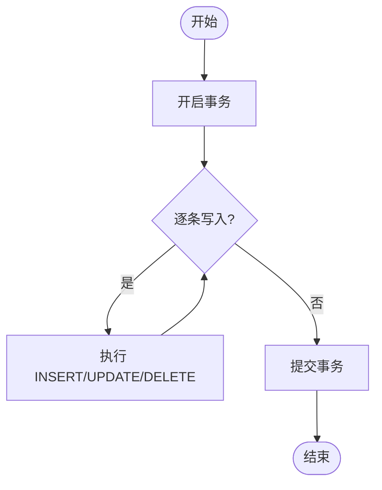
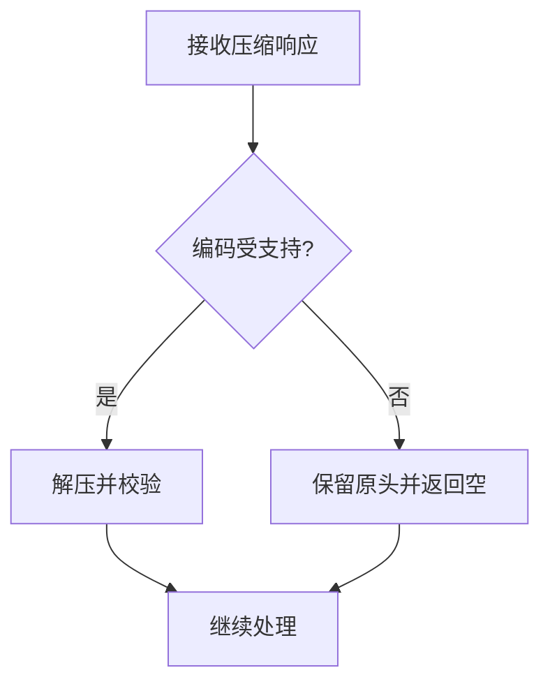
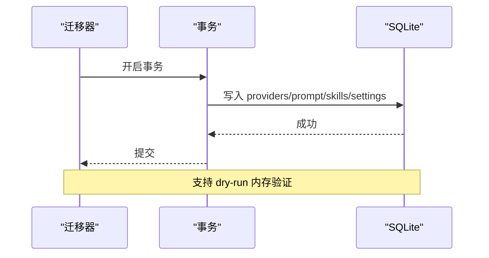
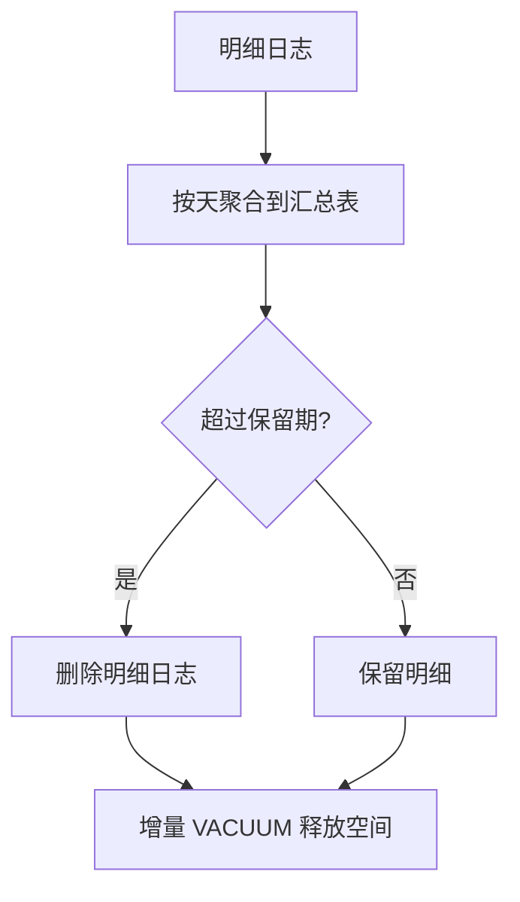
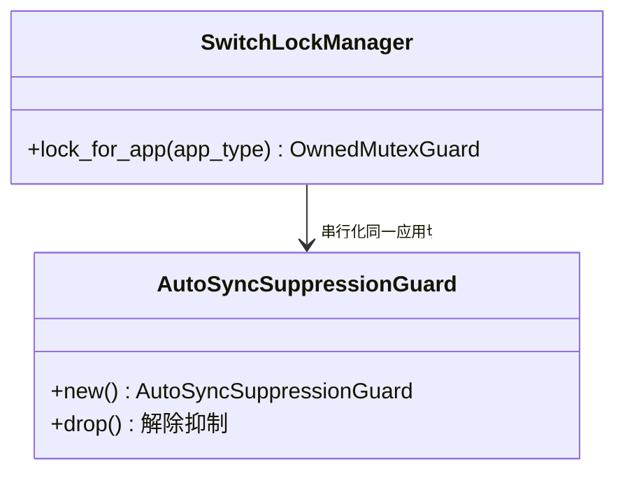
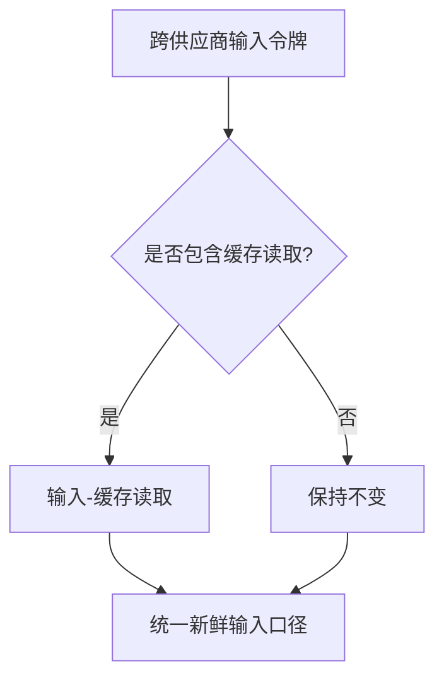
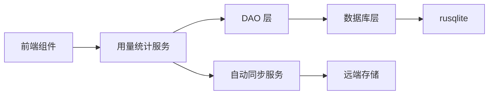

# 大数据量处理

<cite>
**本文引用的文件**
- [src-tauri/src/database/mod.rs](file://src-tauri/src/database/mod.rs)
- [src-tauri/src/database/backup.rs](file://src-tauri/src/database/backup.rs)
- [src-tauri/src/database/migration.rs](file://src-tauri/src/database/migration.rs)
- [src-tauri/src/database/dao/mod.rs](file://src-tauri/src/database/dao/mod.rs)
- [src-tauri/src/database/dao/providers.rs](file://src-tauri/src/database/dao/providers.rs)
- [src-tauri/src/database/dao/prompts.rs](file://src-tauri/src/database/dao/prompts.rs)
- [src-tauri/src/database/dao/skills.rs](file://src-tauri/src/database/dao/skills.rs)
- [src-tauri/src/database/dao/settings.rs](file://src-tauri/src/database/dao/settings.rs)
- [src-tauri/src/database/dao/usage_rollup.rs](file://src-tauri/src/database/dao/usage_rollup.rs)
- [src-tauri/src/database/schema.rs](file://src-tauri/src/database/schema.rs)
- [src-tauri/src/database/dao/stream_check.rs](file://src-tauri/src/database/dao/stream_check.rs)
- [src-tauri/src/services/sql_helpers.rs](file://src-tauri/src/services/sql_helpers.rs)
- [src-tauri/src/proxy/switch_lock.rs](file://src-tauri/src/proxy/switch_lock.rs)
- [src-tauri/src/services/webdav_auto_sync.rs](file://src-tauri/src/services/webdav_auto_sync.rs)
- [src-tauri/src/services/s3_auto_sync.rs](file://src-tauri/src/services/s3_auto_sync.rs)
- [src-tauri/src/services/usage_stats.rs](file://src-tauri/src/services/usage_stats.rs)
- [src-tauri/src/services/skill.rs](file://src-tauri/src/services/skill.rs)
- [src-tauri/src/commands/s3_sync.rs](file://src-tauri/src/commands/s3_sync.rs)
- [src-tauri/src/proxy/response_processor.rs](file://src-tauri/src/proxy/response_processor.rs)
- [src-tauri/src/hermes_config.rs](file://src-tauri/src/hermes_config.rs)
- [src-tauri/src/codex_history_migration.rs](file://src-tauri/src/codex_history_migration.rs)
- [src-tauri/src/services/proxy.rs](file://src-tauri/src/services/proxy.rs)
- [src/components/usage/RequestLogTable.tsx](file://src/components/usage/RequestLogTable.tsx)
</cite>

## 目录
1. [简介](#简介)
2. [项目结构](#项目结构)
3. [核心组件](#核心组件)
4. [架构总览](#架构总览)
5. [详细组件分析](#详细组件分析)
6. [依赖关系分析](#依赖关系分析)
7. [性能考量](#性能考量)
8. [故障排查指南](#故障排查指南)
9. [结论](#结论)
10. [附录](#附录)

## 简介
本文件面向 CC Switch 的大数据量处理优化，围绕以下主题展开：分页查询策略（LIMIT/OFFSET 与键集分页）、批量操作（批量插入/更新/删除）优化、数据压缩与存储优化（去重、压缩算法选择、存储格式）、大数据量迁移与备份（增量备份、在线迁移、数据校验）、数据清理与归档（历史数据清理、冷热分离、长期存储）、并发访问控制与锁优化（读写锁、乐观锁、悲观锁）。文档结合代码级实现与可视化图示，帮助读者快速理解并落地优化方案。

## 项目结构
CC Switch 的数据层采用 Rust + SQLite + Tauri 的组合，核心模块包括：
- 数据库模块：初始化、Schema 管理、备份/恢复、迁移
- DAO 层：按领域划分的数据访问对象（供应商、提示词、Skills、设置等）
- 服务层：自动同步（WebDAV/S3）、用量聚合与清理、缓存与压缩处理
- 前端组件：用量日志表格的分页 UI

图表来源
- [src-tauri/src/database/mod.rs:72-160](file://src-tauri/src/database/mod.rs#L72-L160)
- [src-tauri/src/database/dao/mod.rs:1-20](file://src-tauri/src/database/dao/mod.rs#L1-L20)
- [src-tauri/src/database/backup.rs:45-147](file://src-tauri/src/database/backup.rs#L45-L147)
- [src-tauri/src/services/webdav_auto_sync.rs:1-41](file://src-tauri/src/services/webdav_auto_sync.rs#L1-L41)
- [src-tauri/src/services/s3_auto_sync.rs:1-41](file://src-tauri/src/services/s3_auto_sync.rs#L1-L41)
- [src-tauri/src/services/usage_stats.rs:2548-2756](file://src-tauri/src/services/usage_stats.rs#L2548-L2756)
- [src/components/usage/RequestLogTable.tsx:423-488](file://src/components/usage/RequestLogTable.tsx#L423-L488)

章节来源
- [src-tauri/src/database/mod.rs:1-273](file://src-tauri/src/database/mod.rs#L1-L273)
- [src-tauri/src/database/dao/mod.rs:1-20](file://src-tauri/src/database/dao/mod.rs#L1-L20)
- [src-tauri/src/database/backup.rs:1-861](file://src-tauri/src/database/backup.rs#L1-L861)

## 核心组件
- 数据库连接与锁：使用 Mutex 包装 rusqlite::Connection，提供安全的多线程访问；注册变更钩子以触发自动同步。
- DAO 层：按领域拆分，提供 CRUD 与聚合查询接口；部分查询使用 EXISTS/COUNT 短路优化。
- 备份与迁移：支持 SQL 导出/导入、二进制快照备份、周期性维护（清理旧日志、滚动聚合）。
- 用量聚合与清理：按天滚动聚合明细日志，清理过期明细，降低查询压力。
- 并发控制：应用级切换锁，保证同一应用的切换串行化，避免竞态。
- 自动同步：WebDAV/S3 自动同步，带防抖与抑制机制，避免频繁触发。

章节来源
- [src-tauri/src/database/mod.rs:72-160](file://src-tauri/src/database/mod.rs#L72-L160)
- [src-tauri/src/database/dao/providers.rs:505-574](file://src-tauri/src/database/dao/providers.rs#L505-L574)
- [src-tauri/src/database/backup.rs:235-295](file://src-tauri/src/database/backup.rs#L235-L295)
- [src-tauri/src/database/dao/usage_rollup.rs:87-179](file://src-tauri/src/database/dao/usage_rollup.rs#L87-L179)
- [src-tauri/src/proxy/switch_lock.rs:1-43](file://src-tauri/src/proxy/switch_lock.rs#L1-L43)
- [src-tauri/src/services/webdav_auto_sync.rs:1-41](file://src-tauri/src/services/webdav_auto_sync.rs#L1-L41)
- [src-tauri/src/services/s3_auto_sync.rs:1-41](file://src-tauri/src/services/s3_auto_sync.rs#L1-L41)

## 架构总览
下图展示数据库、DAO、服务与前端之间的交互关系，以及关键优化点（锁、聚合、备份、压缩）：

图表来源
- [src-tauri/src/services/usage_stats.rs:2548-2756](file://src-tauri/src/services/usage_stats.rs#L2548-L2756)
- [src-tauri/src/database/dao/usage_rollup.rs:87-179](file://src-tauri/src/database/dao/usage_rollup.rs#L87-L179)
- [src-tauri/src/database/mod.rs:72-160](file://src-tauri/src/database/mod.rs#L72-L160)
- [src-tauri/src/proxy/switch_lock.rs:1-43](file://src-tauri/src/proxy/switch_lock.rs#L1-L43)
- [src-tauri/src/proxy/response_processor.rs:903-934](file://src-tauri/src/proxy/response_processor.rs#L903-L934)
- [src-tauri/src/services/webdav_auto_sync.rs:1-41](file://src-tauri/src/services/webdav_auto_sync.rs#L1-L41)
- [src-tauri/src/services/s3_auto_sync.rs:1-41](file://src-tauri/src/services/s3_auto_sync.rs#L1-L41)
- [src-tauri/src/database/backup.rs:149-164](file://src-tauri/src/database/backup.rs#L149-L164)

## 详细组件分析

### 分页查询策略：LIMIT/OFFSET 与键集分页
- LIMIT/OFFSET 实现：前端用量日志表格基于页码与总页数计算，动态渲染页码按钮与省略号，支持跳转到指定页。
- 键集分页思路：DAO 层提供“仅读取 id 集合”接口，用于存在性检查与去重（如 live 同步去重），避免全量加载。
- 性能建议：
  - 对高频分页查询建立合适索引（如按时间、应用类型、状态等维度）。
  - 使用游标式键集分页（基于上一页最后键值）可显著降低 OFFSET 开销，适合超大数据集。
  - 前端分页需结合后端“总记录数”估算与“最大页码”限制，防止用户输入过大页码导致查询超时。

图表来源
- [src/components/usage/RequestLogTable.tsx:423-488](file://src/components/usage/RequestLogTable.tsx#L423-L488)
- [src-tauri/src/database/dao/providers.rs:519-536](file://src-tauri/src/database/dao/providers.rs#L519-L536)

章节来源
- [src/components/usage/RequestLogTable.tsx:423-488](file://src/components/usage/RequestLogTable.tsx#L423-L488)
- [src-tauri/src/database/dao/providers.rs:519-536](file://src-tauri/src/database/dao/providers.rs#L519-L536)

### 批量操作优化：批量插入/更新/删除
- 批量插入：DAO 层广泛使用事务包裹（BEGIN/COMMIT），减少单条语句开销；迁移流程使用事务一次性写入。
- 批量更新/删除：DAO 层提供批量更新接口（如更新技能启用状态、内容哈希），减少往返次数。
- 最佳实践：
  - 将多次小更新合并为单次事务，避免 WAL 频繁刷盘。
  - 使用参数化语句与占位符，避免拼接 SQL。
  - 对大体量数据分批处理，设置批次大小上限，避免长时间持有锁。

图表来源
- [src-tauri/src/database/migration.rs:14-23](file://src-tauri/src/database/migration.rs#L14-L23)
- [src-tauri/src/database/dao/skills.rs:156-165](file://src-tauri/src/database/dao/skills.rs#L156-L165)

章节来源
- [src-tauri/src/database/migration.rs:10-65](file://src-tauri/src/database/migration.rs#L10-L65)
- [src-tauri/src/database/dao/skills.rs:106-165](file://src-tauri/src/database/dao/skills.rs#L106-L165)

### 数据压缩与存储优化
- 响应压缩：代理层对压缩响应进行解压，未知编码返回空以保留原始头信息，避免误判。
- 存储格式：SQLite 作为本地存储，支持二进制快照备份与 SQL 导出；导出时对特殊字符进行转义，保证可移植性。
- 去重策略：Hermes 配置写入时进行 YAML 顶层键去重，保留最新值，避免冗余与解析错误。
- 建议：
  - 对大字段（JSON/文本）考虑压缩存储（如 zlib/snappy），结合 Bloom 过滤器加速去重。
  - 使用列式存储或分区表（按日期/应用类型）提升查询效率。

图表来源
- [src-tauri/src/proxy/response_processor.rs:903-934](file://src-tauri/src/proxy/response_processor.rs#L903-L934)
- [src-tauri/src/database/backup.rs:491-513](file://src-tauri/src/database/backup.rs#L491-L513)
- [src-tauri/src/hermes_config.rs:1331-1380](file://src-tauri/src/hermes_config.rs#L1331-L1380)

章节来源
- [src-tauri/src/proxy/response_processor.rs:903-934](file://src-tauri/src/proxy/response_processor.rs#L903-L934)
- [src-tauri/src/database/backup.rs:386-473](file://src-tauri/src/database/backup.rs#L386-L473)
- [src-tauri/src/hermes_config.rs:392-430](file://src-tauri/src/hermes_config.rs#L392-L430)

### 大数据量迁移与备份策略
- 迁移：从旧版 JSON 迁移到 SQLite，使用事务包裹，dry-run 在内存数据库验证，避免破坏生产数据。
- 备份：支持 SQL 导出/导入、二进制快照备份；导入时在临时库执行，校验后再原子替换；支持同步导入时保留本地“仅本地表”。
- 周期维护：定期清理旧的 stream_check_logs 与滚动聚合，必要时执行增量 VACUUM 释放空间。
- 建议：
  - 增量备份：基于 WAL/LSN 的增量快照，结合远程存储（S3/WebDAV）实现异地容灾。
  - 迁移窗口：在低峰时段执行，使用只读副本或只读迁移链路，减少对主库影响。

图表来源
- [src-tauri/src/database/migration.rs:10-65](file://src-tauri/src/database/migration.rs#L10-L65)
- [src-tauri/src/database/backup.rs:88-147](file://src-tauri/src/database/backup.rs#L88-L147)

章节来源
- [src-tauri/src/database/migration.rs:10-65](file://src-tauri/src/database/migration.rs#L10-L65)
- [src-tauri/src/database/backup.rs:45-147](file://src-tauri/src/database/backup.rs#L45-L147)
- [src-tauri/src/database/backup.rs:235-295](file://src-tauri/src/database/backup.rs#L235-L295)

### 数据清理与归档策略
- 滚动聚合：将明细日志按天聚合到汇总表，删除过期明细，降低查询与存储压力。
- 历史清理：启动时清理旧的 stream_check_logs；周期性维护中根据保留天数裁剪。
- 冷热分离：将近期高频访问的明细与历史归档分开存储（如按日期分区），热点走 SSD，冷数据走 HDD 或对象存储。
- 建议：
  - 使用分区表或视图隐藏冷热差异，前端透明访问。
  - 对归档数据建立只读副本，避免影响在线查询。

图表来源
- [src-tauri/src/database/dao/usage_rollup.rs:87-179](file://src-tauri/src/database/dao/usage_rollup.rs#L87-L179)
- [src-tauri/src/database/backup.rs:270-292](file://src-tauri/src/database/backup.rs#L270-L292)

章节来源
- [src-tauri/src/database/dao/usage_rollup.rs:87-179](file://src-tauri/src/database/dao/usage_rollup.rs#L87-L179)
- [src-tauri/src/database/backup.rs:270-295](file://src-tauri/src/database/backup.rs#L270-L295)

### 并发访问控制与锁优化
- 应用级切换锁：同一应用类型内部串行切换，不同应用之间并行，避免 is_current 与 Live 备份不一致。
- 自动同步抑制：在批量写入期间抑制自动同步，减少冲突与抖动。
- 建议：
  - 读多写少场景使用读写锁；写多场景采用队列化写入。
  - 对热点表使用写缓冲与异步落盘，降低阻塞。

图表来源
- [src-tauri/src/proxy/switch_lock.rs:1-43](file://src-tauri/src/proxy/switch_lock.rs#L1-L43)
- [src-tauri/src/services/webdav_auto_sync.rs:21-41](file://src-tauri/src/services/webdav_auto_sync.rs#L21-L41)
- [src-tauri/src/services/s3_auto_sync.rs:21-41](file://src-tauri/src/services/s3_auto_sync.rs#L21-L41)

章节来源
- [src-tauri/src/proxy/switch_lock.rs:1-43](file://src-tauri/src/proxy/switch_lock.rs#L1-L43)
- [src-tauri/src/services/webdav_auto_sync.rs:1-41](file://src-tauri/src/services/webdav_auto_sync.rs#L1-L41)
- [src-tauri/src/services/s3_auto_sync.rs:1-41](file://src-tauri/src/services/s3_auto_sync.rs#L1-L41)

### 用量统计与缓存规范化
- 输入令牌规范化：针对不同供应商的输入令牌语义差异（是否包含缓存读取），提供统一的“新鲜输入”表达式，确保跨供应商聚合准确。
- 用量去重：对会话来源的重复记录进行去重，优先保留代理来源数据，避免重复计费与统计偏差。

图表来源
- [src-tauri/src/services/sql_helpers.rs:21-47](file://src-tauri/src/services/sql_helpers.rs#L21-L47)
- [src-tauri/src/services/usage_stats.rs:2548-2756](file://src-tauri/src/services/usage_stats.rs#L2548-L2756)

章节来源
- [src-tauri/src/services/sql_helpers.rs:1-135](file://src-tauri/src/services/sql_helpers.rs#L1-L135)
- [src-tauri/src/services/usage_stats.rs:2548-2756](file://src-tauri/src/services/usage_stats.rs#L2548-L2756)

## 依赖关系分析
- 数据库层依赖 rusqlite，使用 Mutex 包装连接；注册变更钩子触发自动同步。
- DAO 层依赖数据库连接与事务，提供领域化 CRUD 与聚合。
- 服务层依赖 DAO 与设置项，负责自动同步、用量统计与清理。
- 前端组件依赖用量统计服务，实现分页 UI。

图表来源
- [src-tauri/src/database/mod.rs:42-90](file://src-tauri/src/database/mod.rs#L42-L90)
- [src-tauri/src/database/dao/mod.rs:1-20](file://src-tauri/src/database/dao/mod.rs#L1-L20)
- [src-tauri/src/services/webdav_auto_sync.rs:1-41](file://src-tauri/src/services/webdav_auto_sync.rs#L1-L41)
- [src-tauri/src/services/s3_auto_sync.rs:1-41](file://src-tauri/src/services/s3_auto_sync.rs#L1-L41)

章节来源
- [src-tauri/src/database/mod.rs:42-90](file://src-tauri/src/database/mod.rs#L42-L90)
- [src-tauri/src/database/dao/mod.rs:1-20](file://src-tauri/src/database/dao/mod.rs#L1-L20)

## 性能考量
- 查询优化
  - 使用 EXISTS/COUNT 短路替代 COUNT(*)，在表规模增长时更高效。
  - 对高频查询建立复合索引（如 app_type + created_at）。
  - 采用键集分页替代深度 OFFSET，降低扫描成本。
- 写入优化
  - 批量事务写入，减少 WAL 刷盘频率。
  - 使用参数化语句，避免 SQL 注入与解析开销。
- 存储优化
  - 滚动聚合与定期清理，控制明细表规模。
  - 对大字段考虑压缩存储与 Bloom 过滤去重。
- 并发优化
  - 应用级串行化切换，避免竞态。
  - 自动同步抑制，减少批量写入期间的冲突。

## 故障排查指南
- 备份/恢复
  - 导入 SQL 前会创建主库备份；导入失败会保留原库，避免污染。
  - 同步导入时可保留本地“仅本地表”，确保运行时可重建的数据不丢失。
- 周期维护
  - 启动与周期任务会清理旧日志并执行增量 VACUUM，若失败会记录告警。
- S3/WebDAV 同步
  - 同步过程使用锁保护，错误处理会在锁释放后执行回调，确保一致性。
- 用量统计
  - 若发现统计异常，检查是否存在会话来源重复记录，确认去重逻辑是否生效。

章节来源
- [src-tauri/src/database/backup.rs:88-147](file://src-tauri/src/database/backup.rs#L88-L147)
- [src-tauri/src/database/backup.rs:235-295](file://src-tauri/src/database/backup.rs#L235-L295)
- [src-tauri/src/commands/s3_sync.rs:195-221](file://src-tauri/src/commands/s3_sync.rs#L195-L221)
- [src-tauri/src/services/usage_stats.rs:2548-2756](file://src-tauri/src/services/usage_stats.rs#L2548-L2756)

## 结论
CC Switch 在大数据量处理方面已具备完善的基础设施：事务化批量写入、滚动聚合与周期清理、自动同步与备份、并发控制与锁优化。建议在此基础上进一步引入键集分页、分区存储、压缩与去重策略，以及增量备份与只读副本，以获得更优的吞吐与延迟表现。

## 附录
- 关键实现参考路径
  - 数据库初始化与锁：[src-tauri/src/database/mod.rs:72-160](file://src-tauri/src/database/mod.rs#L72-L160)
  - 备份/恢复与周期维护：[src-tauri/src/database/backup.rs:235-295](file://src-tauri/src/database/backup.rs#L235-L295)
  - 迁移流程：[src-tauri/src/database/migration.rs:10-65](file://src-tauri/src/database/migration.rs#L10-L65)
  - DAO 示例（供应商/提示词/Skills/设置）：[src-tauri/src/database/dao/providers.rs:19-109](file://src-tauri/src/database/dao/providers.rs#L19-L109)，[src-tauri/src/database/dao/prompts.rs:11-54](file://src-tauri/src/database/dao/prompts.rs#L11-L54)，[src-tauri/src/database/dao/skills.rs:16-62](file://src-tauri/src/database/dao/skills.rs#L16-L62)，[src-tauri/src/database/dao/settings.rs:9-34](file://src-tauri/src/database/dao/settings.rs#L9-L34)
  - 用量聚合与清理：[src-tauri/src/database/dao/usage_rollup.rs:87-179](file://src-tauri/src/database/dao/usage_rollup.rs#L87-L179)
  - 并发控制（切换锁）：[src-tauri/src/proxy/switch_lock.rs:1-43](file://src-tauri/src/proxy/switch_lock.rs#L1-L43)
  - 自动同步抑制：[src-tauri/src/services/webdav_auto_sync.rs:1-41](file://src-tauri/src/services/webdav_auto_sync.rs#L1-L41)，[src-tauri/src/services/s3_auto_sync.rs:1-41](file://src-tauri/src/services/s3_auto_sync.rs#L1-L41)
  - 响应压缩处理：[src-tauri/src/proxy/response_processor.rs:903-934](file://src-tauri/src/proxy/response_processor.rs#L903-L934)
  - YAML 去重（Hermes 配置）：[src-tauri/src/hermes_config.rs:1331-1380](file://src-tauri/src/hermes_config.rs#L1331-L1380)
  - Codex 历史迁移：[src-tauri/src/codex_history_migration.rs:687-720](file://src-tauri/src/codex_history_migration.rs#L687-L720)
  - 用量统计去重与断言：[src-tauri/src/services/usage_stats.rs:2548-2756](file://src-tauri/src/services/usage_stats.rs#L2548-L2756)
  - 前端分页 UI：[src/components/usage/RequestLogTable.tsx:423-488](file://src/components/usage/RequestLogTable.tsx#L423-L488)