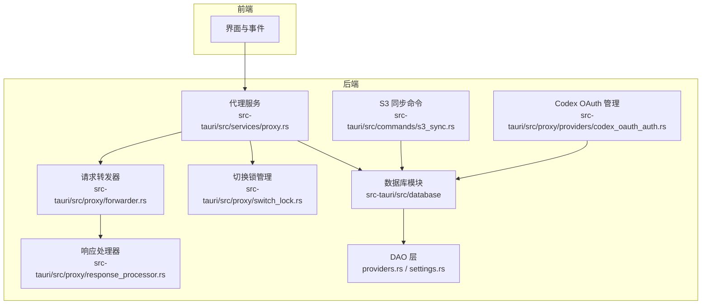
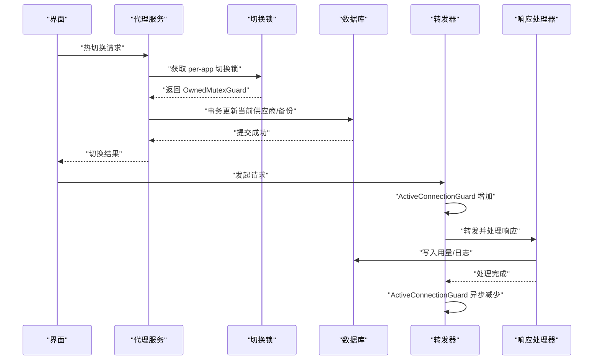
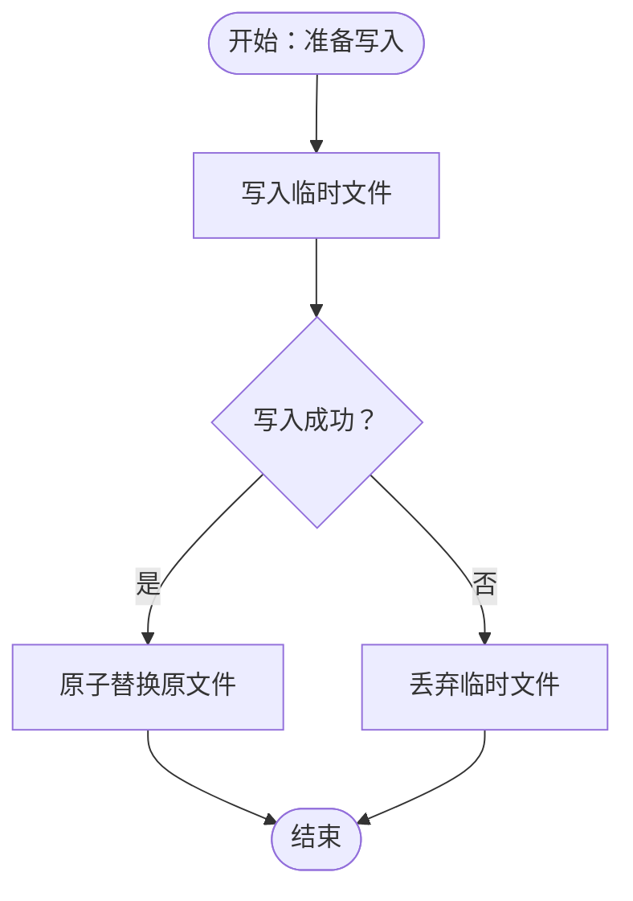
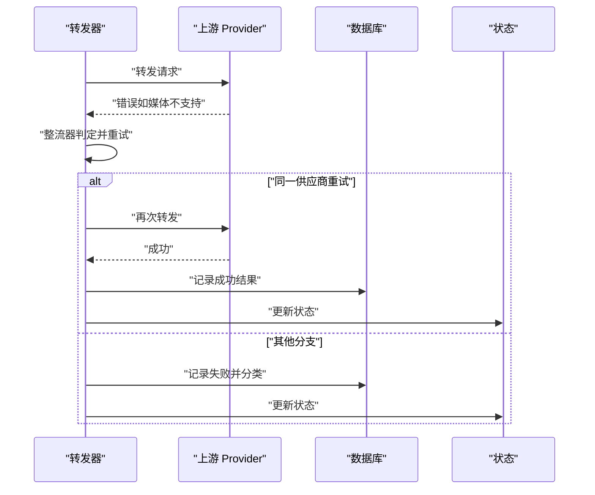
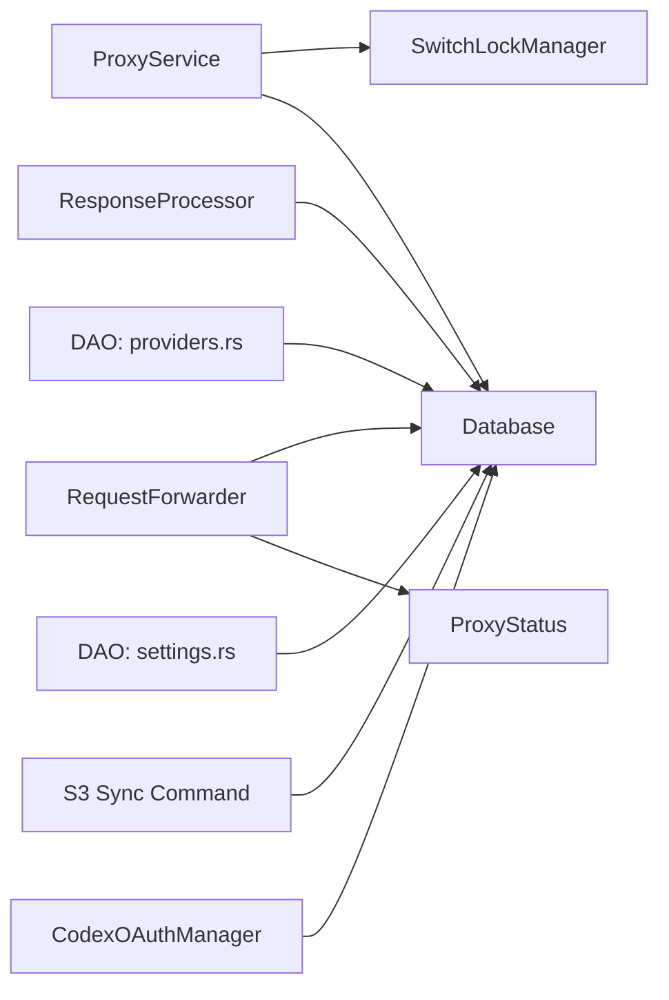

# 并发访问控制

<cite>
**本文引用的文件**
- [src-tauri/src/proxy/switch_lock.rs](file://src-tauri/src/proxy/switch_lock.rs)
- [src-tauri/src/services/proxy.rs](file://src-tauri/src/services/proxy.rs)
- [src-tauri/src/database/mod.rs](file://src-tauri/src/database/mod.rs)
- [src-tauri/src/database/schema.rs](file://src-tauri/src/database/schema.rs)
- [src-tauri/src/database/dao/providers.rs](file://src-tauri/src/database/dao/providers.rs)
- [src-tauri/src/database/dao/settings.rs](file://src-tauri/src/database/dao/settings.rs)
- [src-tauri/src/proxy/forwarder.rs](file://src-tauri/src/proxy/forwarder.rs)
- [src-tauri/src/proxy/response_processor.rs](file://src-tauri/src/proxy/response_processor.rs)
- [src-tauri/src/proxy/providers/codex_oauth_auth.rs](file://src-tauri/src/proxy/providers/codex_oauth_auth.rs)
- [src-tauri/src/commands/s3_sync.rs](file://src-tauri/src/commands/s3_sync.rs)
- [src-tauri/src/services/usage_stats.rs](file://src-tauri/src/services/usage_stats.rs)
- [src-tauri/src/proxy/types.rs](file://src-tauri/src/proxy/types.rs)
</cite>

## 目录
1. [简介](#简介)
2. [项目结构](#项目结构)
3. [核心组件](#核心组件)
4. [架构总览](#架构总览)
5. [详细组件分析](#详细组件分析)
6. [依赖关系分析](#依赖关系分析)
7. [性能考量](#性能考量)
8. [故障排查指南](#故障排查指南)
9. [结论](#结论)
10. [附录](#附录)

## 简介
本文件围绕 CC Switch 的并发访问控制进行系统化梳理，聚焦以下主题：
- 读写锁与互斥锁的实现与应用：包括 per-app 切换锁、OAuth 刷新锁、S3 同步锁等。
- 乐观锁与悲观锁的实践：结合数据库事务、原子写入与回滚策略。
- 数据库连接与并发管理：SQLite 连接封装、事务隔离与迁移。
- 事务隔离级别的选择与配置：PRAGMA 设置与迁移流程。
- 并发冲突解决：死锁检测、超时重试、冲突回滚与资源释放。
- 并发性能监控与调优：活跃连接计数、锁等待时间、瓶颈定位。

## 项目结构
CC Switch 的并发控制主要分布在 Rust 后端（src-tauri）的数据库层、代理层与命令层。前端（React/Tauri）负责 UI 交互与事件通知，后端通过 Tokio 异步运行时协调并发。



图示来源
- [src-tauri/src/services/proxy.rs](file://src-tauri/src/services/proxy.rs)
- [src-tauri/src/proxy/forwarder.rs](file://src-tauri/src/proxy/forwarder.rs)
- [src-tauri/src/proxy/switch_lock.rs](file://src-tauri/src/proxy/switch_lock.rs)
- [src-tauri/src/database/mod.rs](file://src-tauri/src/database/mod.rs)
- [src-tauri/src/database/dao/providers.rs](file://src-tauri/src/database/dao/providers.rs)
- [src-tauri/src/database/dao/settings.rs](file://src-tauri/src/database/dao/settings.rs)
- [src-tauri/src/proxy/response_processor.rs](file://src-tauri/src/proxy/response_processor.rs)
- [src-tauri/src/proxy/providers/codex_oauth_auth.rs](file://src-tauri/src/proxy/providers/codex_oauth_auth.rs)
- [src-tauri/src/commands/s3_sync.rs](file://src-tauri/src/commands/s3_sync.rs)

章节来源
- [src-tauri/src/database/mod.rs](file://src-tauri/src/database/mod.rs)
- [src-tauri/src/database/schema.rs](file://src-tauri/src/database/schema.rs)
- [src-tauri/src/proxy/switch_lock.rs](file://src-tauri/src/proxy/switch_lock.rs)
- [src-tauri/src/services/proxy.rs](file://src-tauri/src/services/proxy.rs)
- [src-tauri/src/proxy/forwarder.rs](file://src-tauri/src/proxy/forwarder.rs)
- [src-tauri/src/proxy/response_processor.rs](file://src-tauri/src/proxy/response_processor.rs)
- [src-tauri/src/proxy/providers/codex_oauth_auth.rs](file://src-tauri/src/proxy/providers/codex_oauth_auth.rs)
- [src-tauri/src/commands/s3_sync.rs](file://src-tauri/src/commands/s3_sync.rs)
- [src-tauri/src/services/usage_stats.rs](file://src-tauri/src/services/usage_stats.rs)
- [src-tauri/src/proxy/types.rs](file://src-tauri/src/proxy/types.rs)

## 核心组件
- 切换锁管理（SwitchLockManager）：基于 RwLock + Mutex 的 per-app 串行化锁，确保同一应用的供应商切换互斥执行。
- 数据库连接封装（Database）：使用 Mutex 包装 rusqlite::Connection，提供初始化、事务、迁移与清理。
- 请求转发器（RequestForwarder）：维护活跃连接计数的 RAII guard，支持超时、熔断与整流器重试。
- 响应处理器（ResponseProcessor）：在数据库读写中使用 lock_conn! 宏安全获取 Mutex 锁。
- OAuth 管理（CodexOAuthManager）：账户粒度的刷新锁，保障令牌刷新的原子性。
- S3 同步命令（S3 Sync）：全局互斥锁保护后台同步任务，确保并发写入安全。
- 代理配置（ProxyConfig）：超时参数与重试上限，直接影响并发吞吐与稳定性。

章节来源
- [src-tauri/src/proxy/switch_lock.rs](file://src-tauri/src/proxy/switch_lock.rs)
- [src-tauri/src/database/mod.rs](file://src-tauri/src/database/mod.rs)
- [src-tauri/src/proxy/forwarder.rs](file://src-tauri/src/proxy/forwarder.rs)
- [src-tauri/src/proxy/response_processor.rs](file://src-tauri/src/proxy/response_processor.rs)
- [src-tauri/src/proxy/providers/codex_oauth_auth.rs](file://src-tauri/src/proxy/providers/codex_oauth_auth.rs)
- [src-tauri/src/commands/s3_sync.rs](file://src-tauri/src/commands/s3_sync.rs)
- [src-tauri/src/proxy/types.rs](file://src-tauri/src/proxy/types.rs)

## 架构总览
下图展示并发控制在关键路径中的协作关系：代理服务通过切换锁串行化供应商切换；转发器管理活跃连接与超时；数据库通过事务与锁保护数据一致性；OAuth 与 S3 同步分别在账户与全局粒度上加锁，避免竞态。



图示来源
- [src-tauri/src/services/proxy.rs](file://src-tauri/src/services/proxy.rs)
- [src-tauri/src/proxy/switch_lock.rs](file://src-tauri/src/proxy/switch_lock.rs)
- [src-tauri/src/database/mod.rs](file://src-tauri/src/database/mod.rs)
- [src-tauri/src/proxy/forwarder.rs](file://src-tauri/src/proxy/forwarder.rs)
- [src-tauri/src/proxy/response_processor.rs](file://src-tauri/src/proxy/response_processor.rs)

## 详细组件分析

### 读写锁与互斥锁：per-app 切换锁
- 设计目标：确保同一应用（如 Claude/Codex/Gemini）的供应商切换串行化，避免并发切换导致 is_current 与 Live 备份不一致。
- 实现要点：
  - 使用 RwLock<HashMap<String, Arc<Mutex<()>>>> 维护 app_type → Mutex 映射。
  - 首次访问时惰性创建锁实例，避免冷启动开销。
  - 返回 OwnedMutexGuard，持有期间其他同 app_type 的切换排队等待。
- 使用场景：
  - 代理服务在执行 set_current_provider 与写入 Live 备份时获取锁。
  - 测试中提供 lock_switch_for_test 辅助验证串行化。

```mermaid
classDiagram
class SwitchLockManager {
+new() SwitchLockManager
+lock_for_app(app_type) OwnedMutexGuard
-locks : RwLock<HashMap<String, Arc<Mutex<()>>>>
}
class ProxyService {
+lock_switch_for_test(app_type) OwnedMutexGuard
-switch_locks : SwitchLockManager
}
SwitchLockManager --> ProxyService : "被依赖"
```

图示来源
- [src-tauri/src/proxy/switch_lock.rs](file://src-tauri/src/proxy/switch_lock.rs)
- [src-tauri/src/services/proxy.rs](file://src-tauri/src/services/proxy.rs)

章节来源
- [src-tauri/src/proxy/switch_lock.rs](file://src-tauri/src/proxy/switch_lock.rs)
- [src-tauri/src/services/proxy.rs](file://src-tauri/src/services/proxy.rs)

### 乐观锁与悲观锁：数据库事务与原子写入
- 悲观锁（事务）：
  - DAO 层广泛使用 rusqlite::Transaction，确保批量更新的原子性（如保存/删除供应商、设置当前供应商）。
  - 通过 SAVEPOINT 与回滚保障迁移过程的数据一致性。
- 乐观锁（版本控制与回滚）：
  - Codex OAuth 原子写入采用“临时文件 + 原子替换”的策略：先写入临时文件，成功后替换原文件，失败则丢弃临时文件，实现写入失败时的回滚。
  - S3 同步命令通过全局互斥锁保护后台任务，确保并发写入安全；错误处理在锁释放后执行，避免死锁。
- 数据库连接与并发：
  - Database 使用 Mutex 包装 Connection，提供 lock_conn! 宏安全获取锁，避免 unwrap panic。
  - 启用外键约束与增量自动整理（auto_vacuum），提升并发写入下的空间回收效率。



图示来源
- [src-tauri/src/proxy/providers/codex_oauth_auth.rs](file://src-tauri/src/proxy/providers/codex_oauth_auth.rs)
- [src-tauri/src/commands/s3_sync.rs](file://src-tauri/src/commands/s3_sync.rs)
- [src-tauri/src/database/mod.rs](file://src-tauri/src/database/mod.rs)

章节来源
- [src-tauri/src/database/dao/providers.rs](file://src-tauri/src/database/dao/providers.rs)
- [src-tauri/src/database/schema.rs](file://src-tauri/src/database/schema.rs)
- [src-tauri/src/database/mod.rs](file://src-tauri/src/database/mod.rs)
- [src-tauri/src/proxy/providers/codex_oauth_auth.rs](file://src-tauri/src/proxy/providers/codex_oauth_auth.rs)
- [src-tauri/src/commands/s3_sync.rs](file://src-tauri/src/commands/s3_sync.rs)

### 数据库连接池与并发管理
- 连接复用：rusqlite::Connection 本身非 Sync，通过 Mutex 包装实现跨线程共享；DAO 层统一通过 lock_conn! 宏获取锁。
- 资源限制：SQLite 通过 PRAGMA 设置（foreign_keys、auto_vacuum）与迁移流程控制资源占用；增量自动整理降低碎片化。
- 并发写入：事务与原子写入策略（临时文件）共同保障并发写入的安全性与一致性。

章节来源
- [src-tauri/src/database/mod.rs](file://src-tauri/src/database/mod.rs)
- [src-tauri/src/database/schema.rs](file://src-tauri/src/database/schema.rs)

### 事务隔离级别与配置
- 隔离级别：SQLite 默认使用“读已提交”语义；通过 PRAGMA foreign_keys = ON 与事务确保参照完整性。
- 迁移与一致性：schema.rs 中使用 SAVEPOINT 与回滚，确保迁移失败时数据库处于一致状态。
- 实践建议：
  - 对于高并发写入场景，优先使用事务包裹批量更新，减少锁竞争。
  - 合理设置 auto_vacuum 与增量整理，避免碎片化影响性能。

章节来源
- [src-tauri/src/database/schema.rs](file://src-tauri/src/database/schema.rs)
- [src-tauri/src/database/mod.rs](file://src-tauri/src/database/mod.rs)

### 并发冲突解决：死锁检测、超时重试与回滚
- 死锁检测：RwLock + Mutex 的组合避免循环等待；OwnedMutexGuard 生命周期结束后自动释放。
- 超时重试：代理转发器支持非流式与流式超时配置，以及基于整流器的“同一供应商重试”策略。
- 冲突回滚：
  - 数据库：事务回滚与 SAVEPOINT 保障迁移与批量更新的一致性。
  - OAuth：临时文件写入失败自动丢弃，避免半写状态。
  - S3：后台任务在锁释放后执行错误处理，避免长时间持锁。



图示来源
- [src-tauri/src/proxy/forwarder.rs](file://src-tauri/src/proxy/forwarder.rs)
- [src-tauri/src/proxy/response_processor.rs](file://src-tauri/src/proxy/response_processor.rs)

章节来源
- [src-tauri/src/proxy/forwarder.rs](file://src-tauri/src/proxy/forwarder.rs)
- [src-tauri/src/proxy/response_processor.rs](file://src-tauri/src/proxy/response_processor.rs)

### 并发性能监控与调优
- 活跃连接计数：ActiveConnectionGuard 在构造时 +1，在 Drop 时异步 -1，覆盖整个响应生命周期，避免 UI 计数过早归零。
- 锁等待分析：通过切换锁与 OAuth 刷新锁的使用，定位热点 app_type 与账户，识别潜在的串行化瓶颈。
- 瓶颈识别与优化：
  - 降低事务跨度：将长事务拆分为多个短事务，减少锁持有时间。
  - 合理设置超时：根据代理配置（非流式/流式超时）与重试上限平衡吞吐与延迟。
  - 使用原子写入：对高频写入场景采用临时文件 + 原子替换，减少写放大。

章节来源
- [src-tauri/src/proxy/forwarder.rs](file://src-tauri/src/proxy/forwarder.rs)
- [src-tauri/src/proxy/types.rs](file://src-tauri/src/proxy/types.rs)

## 依赖关系分析
- 组件耦合：
  - ProxyService 依赖 SwitchLockManager 保证切换串行化。
  - Forwarder 依赖 ProviderRouter 与 ProxyStatus，维护活跃连接计数。
  - DAO 层依赖 Database 的 Mutex 连接封装。
  - ResponseProcessor 在数据库读写中使用 lock_conn! 宏。
- 外部依赖：
  - rusqlite：SQLite 访问与事务。
  - tokio：异步运行时与锁类型（Mutex/RwLock）。
  - serde：序列化配置与元数据。



图示来源
- [src-tauri/src/services/proxy.rs](file://src-tauri/src/services/proxy.rs)
- [src-tauri/src/proxy/switch_lock.rs](file://src-tauri/src/proxy/switch_lock.rs)
- [src-tauri/src/database/mod.rs](file://src-tauri/src/database/mod.rs)
- [src-tauri/src/proxy/forwarder.rs](file://src-tauri/src/proxy/forwarder.rs)
- [src-tauri/src/proxy/response_processor.rs](file://src-tauri/src/proxy/response_processor.rs)
- [src-tauri/src/database/dao/providers.rs](file://src-tauri/src/database/dao/providers.rs)
- [src-tauri/src/database/dao/settings.rs](file://src-tauri/src/database/dao/settings.rs)
- [src-tauri/src/commands/s3_sync.rs](file://src-tauri/src/commands/s3_sync.rs)
- [src-tauri/src/proxy/providers/codex_oauth_auth.rs](file://src-tauri/src/proxy/providers/codex_oauth_auth.rs)

章节来源
- [src-tauri/src/services/proxy.rs](file://src-tauri/src/services/proxy.rs)
- [src-tauri/src/proxy/forwarder.rs](file://src-tauri/src/proxy/forwarder.rs)
- [src-tauri/src/database/dao/providers.rs](file://src-tauri/src/database/dao/providers.rs)
- [src-tauri/src/database/dao/settings.rs](file://src-tauri/src/database/dao/settings.rs)

## 性能考量
- 读写锁与互斥锁的选择：对热点资源使用 RwLock 读写分离，降低读多写少场景的争用；对临界区极短的操作使用 Mutex。
- 事务批处理：将多次写入合并到单个事务中，减少锁竞争与 WAL 写入次数。
- 原子写入策略：对高频写入采用临时文件 + 原子替换，避免频繁 fsync 与锁持有。
- 超时与重试：合理设置非流式与流式超时，避免长时间阻塞；整流器重试仅限同一供应商，减少跨节点失败传播。
- 监控指标：活跃连接计数、锁等待时间、事务提交耗时、迁移耗时与失败率。

## 故障排查指南
- 切换卡顿或不生效：
  - 检查是否持有切换锁（同一 app_type 的其他切换会排队）。
  - 确认 set_current_provider 与 Live 备份写入是否在事务中完成。
- 写入失败或半写：
  - 检查临时文件写入是否成功，失败后是否正确丢弃。
  - 确认 S3 同步锁是否在后台任务完成后释放。
- 响应异常或计费不准确：
  - 检查响应处理器是否在数据库读写中正确获取锁。
  - 核对代理配置的超时与重试设置是否合理。
- 使用量统计异常：
  - 检查 rollup_and_prune 是否定期执行，索引是否完整。

章节来源
- [src-tauri/src/proxy/switch_lock.rs](file://src-tauri/src/proxy/switch_lock.rs)
- [src-tauri/src/database/dao/providers.rs](file://src-tauri/src/database/dao/providers.rs)
- [src-tauri/src/proxy/providers/codex_oauth_auth.rs](file://src-tauri/src/proxy/providers/codex_oauth_auth.rs)
- [src-tauri/src/commands/s3_sync.rs](file://src-tauri/src/commands/s3_sync.rs)
- [src-tauri/src/proxy/response_processor.rs](file://src-tauri/src/proxy/response_processor.rs)
- [src-tauri/src/services/usage_stats.rs](file://src-tauri/src/services/usage_stats.rs)

## 结论
CC Switch 在并发访问控制方面采用了分层策略：通过 per-app 切换锁保证关键路径的串行化，借助数据库事务与原子写入实现数据一致性，利用超时与整流器重试提升鲁棒性。配合活跃连接计数与合理的 PRAGMA 设置，系统在高并发场景下仍能保持稳定与可观的性能。后续可在热点 app_type 与账户上引入更细粒度的锁与批处理策略，进一步降低锁争用与提升吞吐。

## 附录
- 关键配置项（代理）：
  - 非流式超时、流式首字超时、流式空闲超时、最大重试次数。
- 数据库关键 PRAGMA：
  - foreign_keys、auto_vacuum（增量）、incremental_vacuum。
- 常见并发问题定位清单：
  - 是否使用事务包裹批量更新
  - 是否采用原子写入策略
  - 是否正确释放锁（切换锁、OAuth 刷新锁、S3 同步锁）
  - 是否合理设置超时与重试