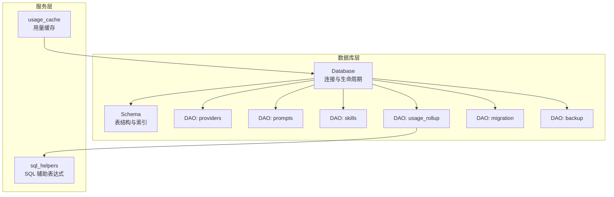
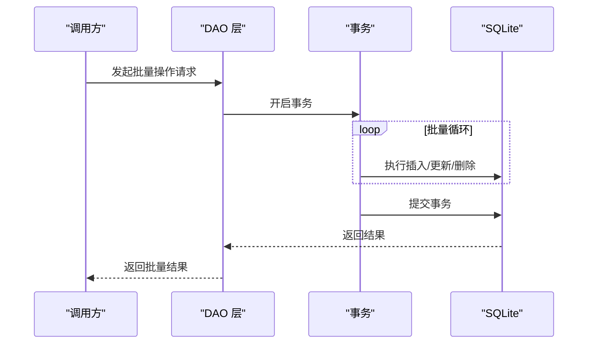
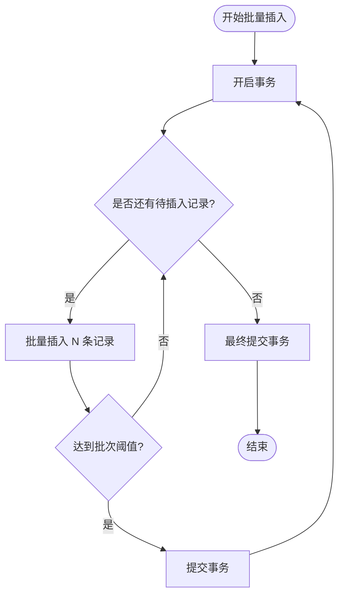
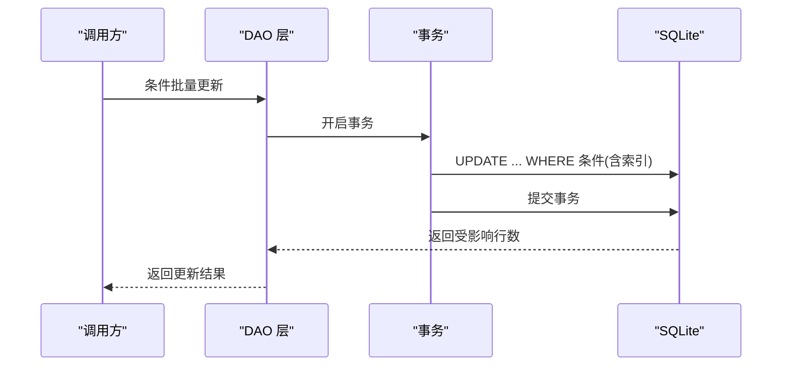
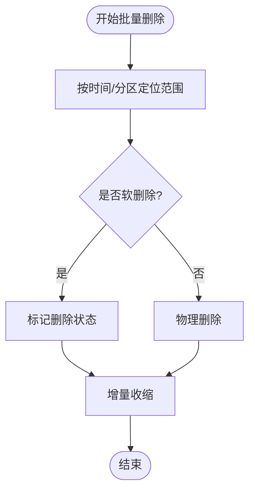
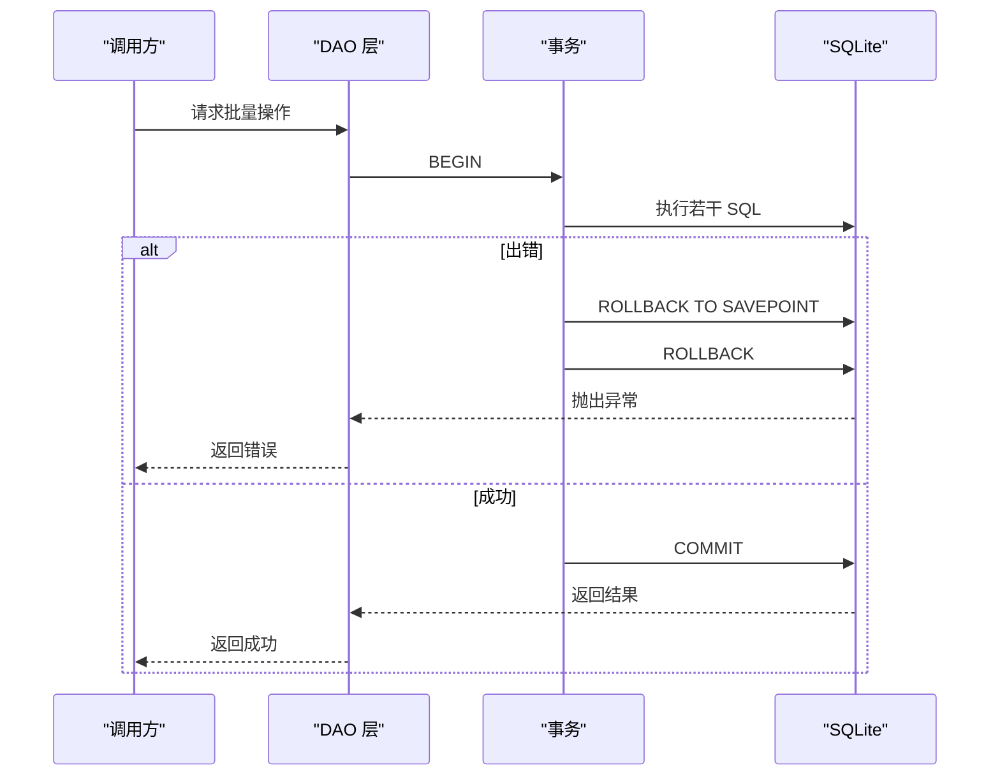
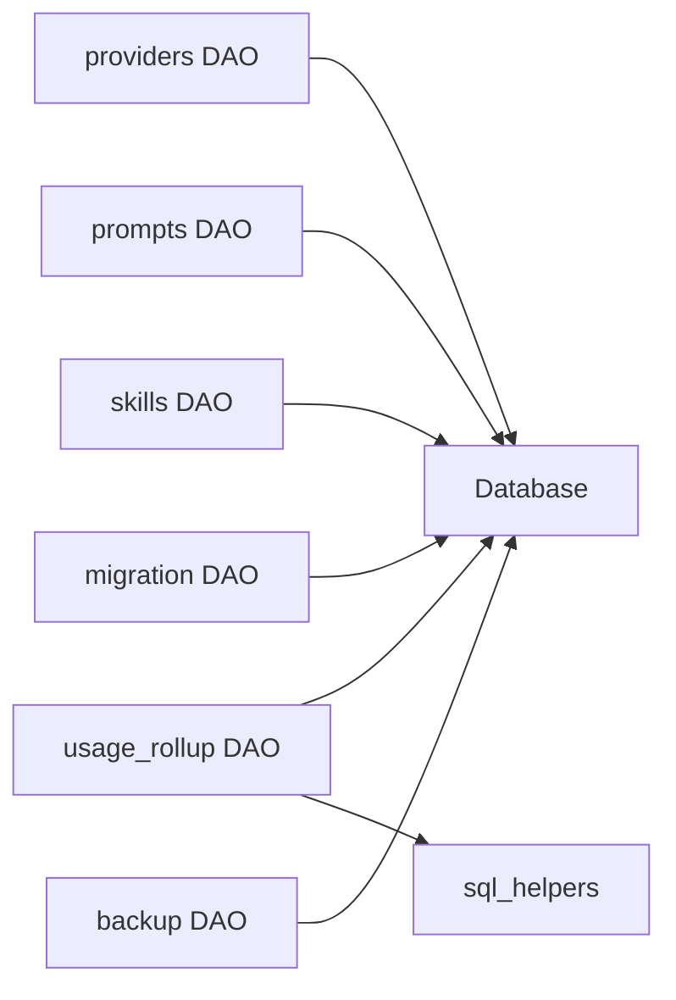

# 批量操作优化

<cite>
**本文引用的文件**
- [src-tauri/src/database/mod.rs](file://src-tauri/src/database/mod.rs)
- [src-tauri/src/database/schema.rs](file://src-tauri/src/database/schema.rs)
- [src-tauri/src/database/dao/providers.rs](file://src-tauri/src/database/dao/providers.rs)
- [src-tauri/src/database/dao/prompts.rs](file://src-tauri/src/database/dao/prompts.rs)
- [src-tauri/src/database/dao/skills.rs](file://src-tauri/src/database/dao/skills.rs)
- [src-tauri/src/database/dao/usage_rollup.rs](file://src-tauri/src/database/dao/usage_rollup.rs)
- [src-tauri/src/database/migration.rs](file://src-tauri/src/database/migration.rs)
- [src-tauri/src/database/backup.rs](file://src-tauri/src/database/backup.rs)
- [src-tauri/src/services/sql_helpers.rs](file://src-tauri/src/services/sql_helpers.rs)
- [src-tauri/src/services/usage_cache.rs](file://src-tauri/src/services/usage_cache.rs)
</cite>

## 目录
1. [简介](#简介)
2. [项目结构](#项目结构)
3. [核心组件](#核心组件)
4. [架构总览](#架构总览)
5. [详细组件分析](#详细组件分析)
6. [依赖分析](#依赖分析)
7. [性能考虑](#性能考虑)
8. [故障排除指南](#故障排除指南)
9. [结论](#结论)
10. [附录](#附录)

## 简介
本文件面向 CC Switch 的批量操作优化，围绕数据库层的批量插入、批量更新与批量删除策略展开，结合事务管理、索引利用、锁竞争控制、内存管理与垃圾回收机制，提供可落地的优化建议与最佳实践。同时涵盖事务原子性、回滚策略、并发控制、错误处理与重试、以及性能监控与调优方法。

## 项目结构
数据库层采用 Rust + rusqlite + SQLite 的轻量架构，核心模块如下：
- 数据库初始化与生命周期管理：负责连接、外键、自动清理、增量自动收缩等
- Schema 定义与迁移：集中管理表结构、索引与迁移逻辑
- DAO 层：按实体划分（providers、prompts、skills、usage_rollup、backup 等）
- 辅助服务：SQL 辅助函数、用量缓存等

**图表来源**
- [src-tauri/src/database/mod.rs:72-160](file://src-tauri/src/database/mod.rs#L72-L160)
- [src-tauri/src/database/schema.rs:16-364](file://src-tauri/src/database/schema.rs#L16-L364)
- [src-tauri/src/database/dao/providers.rs:19-708](file://src-tauri/src/database/dao/providers.rs#L19-L708)
- [src-tauri/src/database/dao/prompts.rs:11-88](file://src-tauri/src/database/dao/prompts.rs#L11-L88)
- [src-tauri/src/database/dao/skills.rs:16-263](file://src-tauri/src/database/dao/skills.rs#L16-L263)
- [src-tauri/src/database/dao/usage_rollup.rs:57-179](file://src-tauri/src/database/dao/usage_rollup.rs#L57-L179)
- [src-tauri/src/database/migration.rs:10-65](file://src-tauri/src/database/migration.rs#L10-L65)
- [src-tauri/src/database/backup.rs:45-147](file://src-tauri/src/database/backup.rs#L45-L147)
- [src-tauri/src/services/sql_helpers.rs:1-47](file://src-tauri/src/services/sql_helpers.rs#L1-L47)
- [src-tauri/src/services/usage_cache.rs:13-85](file://src-tauri/src/services/usage_cache.rs#L13-L85)

**章节来源**
- [src-tauri/src/database/mod.rs:1-273](file://src-tauri/src/database/mod.rs#L1-L273)
- [src-tauri/src/database/schema.rs:1-2559](file://src-tauri/src/database/schema.rs#L1-L2559)

## 核心组件
- 数据库连接与生命周期：提供线程安全的连接封装、外键约束、自动收缩、变更钩子与启动期清理
- Schema 与索引：集中定义表结构、索引与迁移，确保查询与聚合性能
- DAO 批量能力：提供事务封装、批量插入/更新/删除、批量导入/导出与备份恢复
- 使用统计与归档：按天聚合明细日志，清理历史明细，保障长期运行的存储健康

**章节来源**
- [src-tauri/src/database/mod.rs:72-160](file://src-tauri/src/database/mod.rs#L72-L160)
- [src-tauri/src/database/schema.rs:16-364](file://src-tauri/src/database/schema.rs#L16-L364)
- [src-tauri/src/database/dao/usage_rollup.rs:57-179](file://src-tauri/src/database/dao/usage_rollup.rs#L57-L179)

## 架构总览
数据库层通过 DAO 对外暴露批量操作接口，底层以事务包裹，结合索引与清理策略，实现高吞吐、低锁争用与可恢复的批量处理。

**图表来源**
- [src-tauri/src/database/dao/providers.rs:180-278](file://src-tauri/src/database/dao/providers.rs#L180-L278)
- [src-tauri/src/database/migration.rs:14-23](file://src-tauri/src/database/migration.rs#L14-L23)

## 详细组件分析

### 批量插入优化（事务、批量大小与内存）
- 事务封装：所有批量插入均在事务中执行，确保原子性与一致性，降低 WAL/页写放大
- 批量大小：建议分批提交（如 100-1000 条/批），平衡内存占用与 IO 效率
- 内存管理：使用参数化 SQL，避免字符串拼接；必要时使用内存快照导出/导入（见备份模块）

**图表来源**
- [src-tauri/src/database/dao/providers.rs:180-278](file://src-tauri/src/database/dao/providers.rs#L180-L278)
- [src-tauri/src/database/migration.rs:44-65](file://src-tauri/src/database/migration.rs#L44-L65)

**章节来源**
- [src-tauri/src/database/dao/providers.rs:180-278](file://src-tauri/src/database/dao/providers.rs#L180-L278)
- [src-tauri/src/database/migration.rs:12-65](file://src-tauri/src/database/migration.rs#L12-L65)

### 批量更新优化（条件更新、索引利用、锁竞争）
- 条件批量更新：优先使用带索引的 WHERE 条件，避免全表扫描
- 索引利用：对频繁过滤的列建立合适索引（如 app_type、provider_id、created_at 等）
- 锁竞争：将多个更新合并为单事务，减少锁持有时间；必要时拆分为多批小事务

**图表来源**
- [src-tauri/src/database/dao/skills.rs:155-165](file://src-tauri/src/database/dao/skills.rs#L155-L165)
- [src-tauri/src/database/schema.rs:200-220](file://src-tauri/src/database/schema.rs#L200-L220)

**章节来源**
- [src-tauri/src/database/dao/skills.rs:155-165](file://src-tauri/src/database/dao/skills.rs#L155-L165)
- [src-tauri/src/database/schema.rs:200-220](file://src-tauri/src/database/schema.rs#L200-L220)

### 批量删除优化（软删除、分区删除、垃圾回收）
- 软删除策略：通过标记列实现逻辑删除，便于审计与恢复
- 分区删除：按时间分区（如按天/月）进行范围删除，减少锁范围
- 垃圾回收：定期清理历史明细并执行增量收缩，释放空间

**图表来源**
- [src-tauri/src/database/dao/usage_rollup.rs:61-113](file://src-tauri/src/database/dao/usage_rollup.rs#L61-L113)
- [src-tauri/src/database/backup.rs:297-334](file://src-tauri/src/database/backup.rs#L297-L334)

**章节来源**
- [src-tauri/src/database/dao/usage_rollup.rs:57-179](file://src-tauri/src/database/dao/usage_rollup.rs#L57-L179)
- [src-tauri/src/database/backup.rs:297-334](file://src-tauri/src/database/backup.rs#L297-L334)

### 事务管理（原子性、回滚、并发控制）
- 原子性：所有批量操作置于事务中，失败整体回滚
- 回滚策略：使用 SAVEPOINT/ROLLBACK TO 实现局部回滚与重试
- 并发控制：通过连接互斥锁与事务隔离级别控制并发冲突

**图表来源**
- [src-tauri/src/database/dao/usage_rollup.rs:87-113](file://src-tauri/src/database/dao/usage_rollup.rs#L87-L113)
- [src-tauri/src/database/migration.rs:14-23](file://src-tauri/src/database/migration.rs#L14-L23)

**章节来源**
- [src-tauri/src/database/dao/usage_rollup.rs:87-113](file://src-tauri/src/database/dao/usage_rollup.rs#L87-L113)
- [src-tauri/src/database/migration.rs:14-23](file://src-tauri/src/database/migration.rs#L14-L23)

### 错误处理与重试（部分失败、一致性维护）
- 部分失败处理：对单条记录失败进行隔离重试或记录失败清单
- 一致性维护：通过事务与回滚保证整体一致性；对可重试的 I/O 错误进行指数退避重试
- 失败回滚：使用 SAVEPOINT 保护中间状态，失败时精确回滚至最近检查点

**章节来源**
- [src-tauri/src/database/dao/usage_rollup.rs:87-113](file://src-tauri/src/database/dao/usage_rollup.rs#L87-L113)
- [src-tauri/src/database/backup.rs:94-147](file://src-tauri/src/database/backup.rs#L94-L147)

### 性能监控与调优（执行时间、资源使用）
- 执行时间分析：对关键批量操作记录开始/结束时间，计算平均耗时与吞吐
- 资源使用优化：合理设置 WAL/检查点策略、索引选择与查询计划；定期执行增量收缩
- 使用统计缓存：进程内用量缓存减少重复查询开销

**章节来源**
- [src-tauri/src/services/usage_cache.rs:13-85](file://src-tauri/src/services/usage_cache.rs#L13-L85)
- [src-tauri/src/database/mod.rs:144-157](file://src-tauri/src/database/mod.rs#L144-L157)

## 依赖分析
- DAO 依赖 Database 连接与锁；Schema 定义影响查询与索引效率
- 使用统计模块依赖 SQL 辅助函数进行输入令牌归一化与聚合
- 备份模块依赖数据库快照与原子替换，保障导入/导出一致性

**图表来源**
- [src-tauri/src/database/dao/providers.rs:19-708](file://src-tauri/src/database/dao/providers.rs#L19-L708)
- [src-tauri/src/database/dao/prompts.rs:11-88](file://src-tauri/src/database/dao/prompts.rs#L11-L88)
- [src-tauri/src/database/dao/skills.rs:16-263](file://src-tauri/src/database/dao/skills.rs#L16-L263)
- [src-tauri/src/database/dao/usage_rollup.rs:57-179](file://src-tauri/src/database/dao/usage_rollup.rs#L57-L179)
- [src-tauri/src/database/dao/migration.rs:10-65](file://src-tauri/src/database/dao/migration.rs#L10-L65)
- [src-tauri/src/database/dao/backup.rs:45-147](file://src-tauri/src/database/dao/backup.rs#L45-L147)
- [src-tauri/src/services/sql_helpers.rs:1-47](file://src-tauri/src/services/sql_helpers.rs#L1-L47)

**章节来源**
- [src-tauri/src/database/schema.rs:16-364](file://src-tauri/src/database/schema.rs#L16-L364)

## 性能考虑
- 批量大小：根据内存与 IO 能力调整批次大小，避免一次性加载过多数据
- 索引策略：为高频过滤列建立复合索引，减少全表扫描
- 锁粒度：尽量缩短事务持续时间，必要时拆分批次
- 清理与收缩：定期归档明细并执行增量收缩，维持数据库健康体积
- 缓存与去重：对导入/同步场景使用去重与本地快照保留策略，减少冗余数据

## 故障排除指南
- 事务失败：检查 SAVEPOINT/ROLLBACK 流程，确认异常分支是否正确回滚
- 导入失败：验证导出格式与表结构一致性，必要时使用内存快照恢复
- 性能退化：检查索引使用情况与查询计划，评估是否需要重建索引或调整查询

**章节来源**
- [src-tauri/src/database/backup.rs:94-147](file://src-tauri/src/database/backup.rs#L94-L147)
- [src-tauri/src/database/dao/usage_rollup.rs:87-113](file://src-tauri/src/database/dao/usage_rollup.rs#L87-L113)

## 结论
通过事务封装、索引优化、分区删除与增量收缩，CC Switch 的数据库层能够高效支撑大规模批量操作。建议在生产环境中结合批次大小、锁竞争与监控指标进行动态调优，并在导入/导出与归档场景中充分利用事务与快照能力，确保数据一致性与系统稳定性。

## 附录
- SQL 辅助函数：提供输入令牌归一化的 SQL 表达式，统一不同提供商的数据语义
- 用量缓存：进程内缓存提升托盘与用量查询的响应性能

**章节来源**
- [src-tauri/src/services/sql_helpers.rs:1-47](file://src-tauri/src/services/sql_helpers.rs#L1-L47)
- [src-tauri/src/services/usage_cache.rs:13-85](file://src-tauri/src/services/usage_cache.rs#L13-L85)