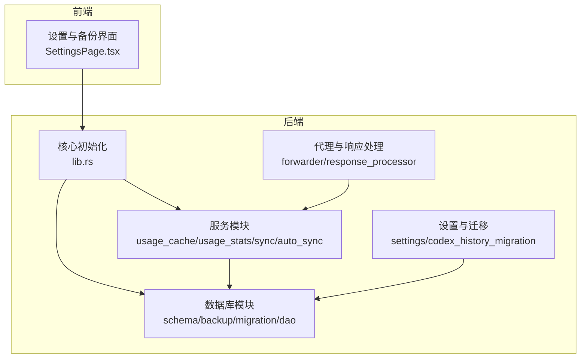
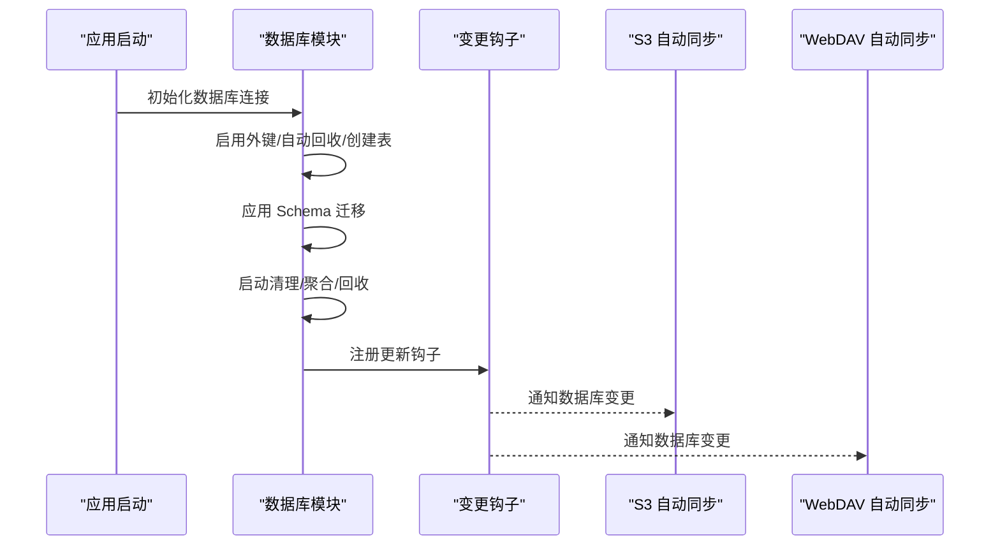
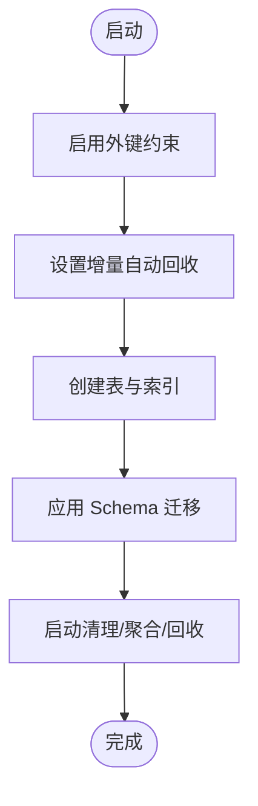
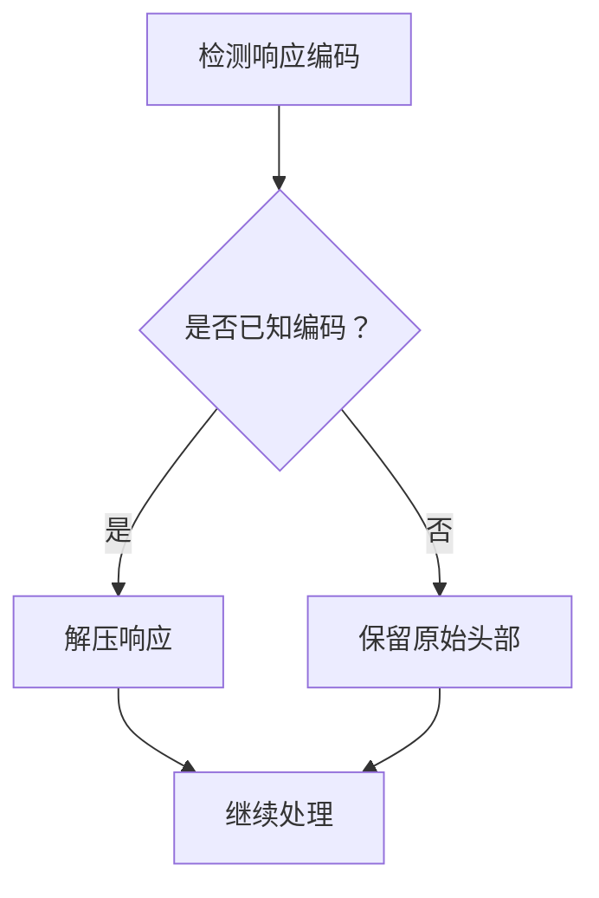
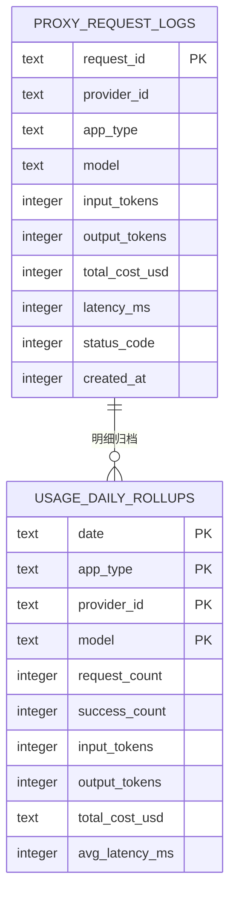
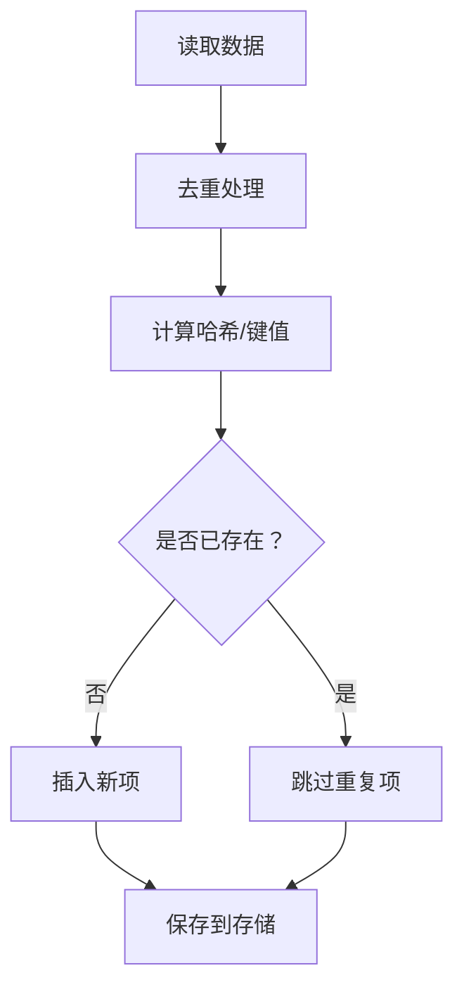
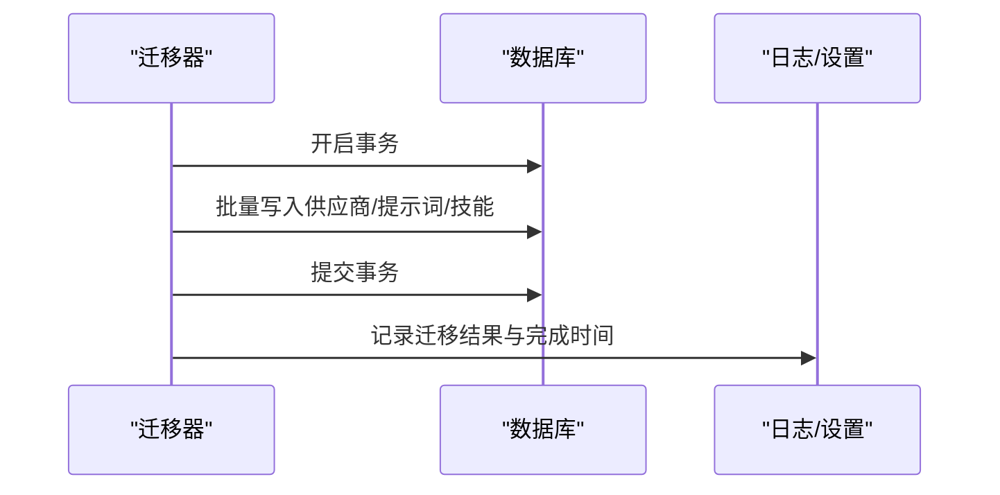
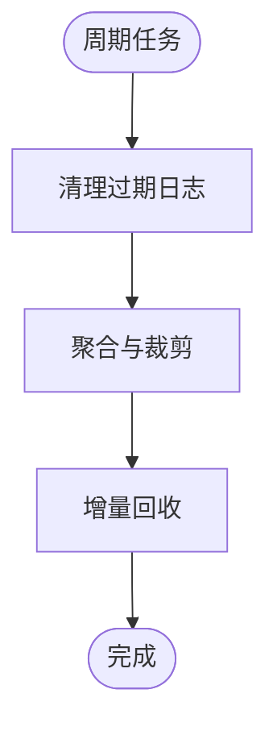
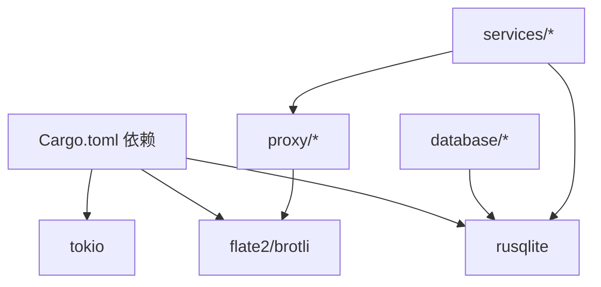

# 数据压缩与存储优化

<cite>
**本文引用的文件**
- [Cargo.toml](file://src-tauri/Cargo.toml)
- [database/mod.rs](file://src-tauri/src/database/mod.rs)
- [database/schema.rs](file://src-tauri/src/database/schema.rs)
- [database/backup.rs](file://src-tauri/src/database/backup.rs)
- [database/migration.rs](file://src-tauri/src/database/migration.rs)
- [database/dao/providers.rs](file://src-tauri/src/database/dao/providers.rs)
- [database/dao/prompts.rs](file://src-tauri/src/database/dao/prompts.rs)
- [services/usage_cache.rs](file://src-tauri/src/services/usage_cache.rs)
- [services/usage_stats.rs](file://src-tauri/src/services/usage_stats.rs)
- [services/s3_auto_sync.rs](file://src-tauri/src/services/s3_auto_sync.rs)
- [services/webdav_auto_sync.rs](file://src-tauri/src/services/webdav_auto_sync.rs)
- [proxy/response_processor.rs](file://src-tauri/src/proxy/response_processor.rs)
- [proxy/forwarder.rs](file://src-tauri/src/proxy/forwarder.rs)
- [codex_history_migration.rs](file://src-tauri/src/codex_history_migration.rs)
- [settings.rs](file://src-tauri/src/settings.rs)
- [lib.rs](file://src-tauri/src/lib.rs)
</cite>

## 目录
1. [简介](#简介)
2. [项目结构](#项目结构)
3. [核心组件](#核心组件)
4. [架构总览](#架构总览)
5. [详细组件分析](#详细组件分析)
6. [依赖关系分析](#依赖关系分析)
7. [性能考量](#性能考量)
8. [故障排查指南](#故障排查指南)
9. [结论](#结论)
10. [附录](#附录)

## 简介
本文件面向 CC Switch 的数据压缩与存储优化，围绕以下主题展开：
- 数据压缩算法选择与应用：对比 LZ4、Zstandard 等算法在不同场景下的性能与适用性，并给出在 CC Switch 中的实际应用建议。
- 存储格式优化策略：二进制序列化、列式存储与压缩存储格式的选择与权衡。
- 数据去重与重复数据处理：基于哈希去重、相似度检测与存储空间节省策略。
- 数据库存储引擎优化配置：WAL 模式、页面大小调整、缓存策略与自动维护。
- 数据迁移过程中的压缩优化：增量压缩、并行压缩与压缩进度监控。
- 存储空间管理策略：自动清理、空间回收与存储配额管理。

## 项目结构
CC Switch 的数据层主要由 Rust 后端与 SQLite 数据库组成，前端通过 Tauri 与后端交互。数据库模块负责表结构、迁移、备份与维护；服务模块负责用量统计、自动同步与代理响应处理；设置与迁移模块负责历史数据迁移与配置管理。

图示来源
- [database/mod.rs:1-273](file://src-tauri/src/database/mod.rs#L1-L273)
- [services/usage_cache.rs:1-46](file://src-tauri/src/services/usage_cache.rs#L1-L46)
- [services/usage_stats.rs:493-846](file://src-tauri/src/services/usage_stats.rs#L493-L846)
- [services/s3_auto_sync.rs:1-41](file://src-tauri/src/services/s3_auto_sync.rs#L1-L41)
- [services/webdav_auto_sync.rs:1-41](file://src-tauri/src/services/webdav_auto_sync.rs#L1-L41)
- [proxy/forwarder.rs:3225-3268](file://src-tauri/src/proxy/forwarder.rs#L3225-L3268)
- [proxy/response_processor.rs:903-934](file://src-tauri/src/proxy/response_processor.rs#L903-L934)
- [codex_history_migration.rs:26-148](file://src-tauri/src/codex_history_migration.rs#L26-L148)
- [settings.rs:292-313](file://src-tauri/src/settings.rs#L292-L313)
- [lib.rs:563-584](file://src-tauri/src/lib.rs#L563-L584)

章节来源
- [database/mod.rs:1-273](file://src-tauri/src/database/mod.rs#L1-L273)
- [Cargo.toml:1-110](file://src-tauri/Cargo.toml#L1-L110)

## 核心组件
- 数据库模块：负责表结构定义、Schema 迁移、备份与维护，以及连接初始化与并发安全。
- 服务模块：用量缓存、用量统计、自动同步（S3/WebDAV）与变更通知。
- 代理与响应处理：请求转发、压缩检测与解压、流式事件处理。
- 设置与迁移：Codex 历史迁移、配置标记与迁移结果记录。
- 前端集成：设置页导出/导入、备份管理与 UI 展示。

章节来源
- [database/schema.rs:1-800](file://src-tauri/src/database/schema.rs#L1-L800)
- [database/backup.rs:1-861](file://src-tauri/src/database/backup.rs#L1-L861)
- [database/migration.rs:1-246](file://src-tauri/src/database/migration.rs#L1-L246)
- [services/usage_cache.rs:1-46](file://src-tauri/src/services/usage_cache.rs#L1-L46)
- [services/usage_stats.rs:493-846](file://src-tauri/src/services/usage_stats.rs#L493-L846)
- [services/s3_auto_sync.rs:1-41](file://src-tauri/src/services/s3_auto_sync.rs#L1-L41)
- [services/webdav_auto_sync.rs:1-41](file://src-tauri/src/services/webdav_auto_sync.rs#L1-L41)
- [proxy/response_processor.rs:903-934](file://src-tauri/src/proxy/response_processor.rs#L903-L934)
- [proxy/forwarder.rs:3225-3268](file://src-tauri/src/proxy/forwarder.rs#L3225-L3268)
- [codex_history_migration.rs:26-148](file://src-tauri/src/codex_history_migration.rs#L26-L148)
- [settings.rs:292-313](file://src-tauri/src/settings.rs#L292-L313)
- [lib.rs:563-584](file://src-tauri/src/lib.rs#L563-L584)

## 架构总览
数据库初始化时启用外键约束与增量自动回收，创建表与索引后执行迁移与维护任务。服务层通过变更钩子感知数据库变化，触发自动同步；代理层在响应处理中进行压缩检测与解压。备份模块提供 SQL 导出/导入与二进制快照备份，支持周期性维护与空间回收。

图示来源
- [database/mod.rs:92-160](file://src-tauri/src/database/mod.rs#L92-L160)
- [database/mod.rs:80-90](file://src-tauri/src/database/mod.rs#L80-L90)
- [services/s3_auto_sync.rs:39-41](file://src-tauri/src/services/s3_auto_sync.rs#L39-L41)
- [services/webdav_auto_sync.rs:39-41](file://src-tauri/src/services/webdav_auto_sync.rs#L39-L41)

## 详细组件分析

### 数据库存储引擎优化与维护
- WAL 模式与自动回收
  - 数据库初始化时启用外键约束与增量自动回收，确保删除/更新后的空间可被回收。
  - 启动时执行清理与聚合，并在必要时触发增量回收，减少碎片与空间浪费。
- 页面大小与缓存策略
  - 通过 PRAGMA 配置实现自动回收与增量回收，提升写入与回收效率。
- 表结构与索引
  - 为高频查询建立索引（如按 provider、时间、状态等），降低查询成本。
- 备份与恢复
  - 支持 SQL 导出/导入与二进制快照备份，提供周期性维护与空间回收能力。

图示来源
- [database/mod.rs:107-157](file://src-tauri/src/database/mod.rs#L107-L157)
- [database/schema.rs:18-364](file://src-tauri/src/database/schema.rs#L18-L364)
- [database/backup.rs:269-294](file://src-tauri/src/database/backup.rs#L269-L294)

章节来源
- [database/mod.rs:92-160](file://src-tauri/src/database/mod.rs#L92-L160)
- [database/mod.rs:182-253](file://src-tauri/src/database/mod.rs#L182-L253)
- [database/schema.rs:18-364](file://src-tauri/src/database/schema.rs#L18-L364)
- [database/backup.rs:235-295](file://src-tauri/src/database/backup.rs#L235-L295)

### 数据压缩算法选择与应用
- 算法特性与适用场景
  - LZ4：高压缩/解压速度，适合实时数据传输与低延迟场景；对重复数据较多的数据效果显著。
  - Zstandard：更高的压缩比与可控压缩级别，适合离线备份与长期存储；CPU 开销相对更高。
- 实际应用建议
  - 对于代理响应的流式数据，优先采用 LZ4 以降低延迟；对 SQL 备份与快照，可考虑 Zstandard 以节省空间。
  - 在 CC Switch 中，代理层对压缩编码进行识别与解压，确保未知编码不被误处理，保持内容一致性。
- 与存储优化结合
  - 压缩策略应与数据库维护（增量回收）协同，避免压缩后频繁写入导致碎片化。

图示来源
- [proxy/response_processor.rs:903-913](file://src-tauri/src/proxy/response_processor.rs#L903-L913)
- [proxy/forwarder.rs:3225-3234](file://src-tauri/src/proxy/forwarder.rs#L3225-L3234)

章节来源
- [proxy/response_processor.rs:903-934](file://src-tauri/src/proxy/response_processor.rs#L903-L934)
- [proxy/forwarder.rs:3225-3268](file://src-tauri/src/proxy/forwarder.rs#L3225-L3268)

### 存储格式优化策略
- 二进制序列化
  - 数据库使用 SQLite，具备高效的二进制存储与索引能力；JSON 字段通过序列化存储，便于跨版本兼容。
- 列式存储
  - 用量统计采用按天聚合（usage_daily_rollups），将明细数据归档为列式统计，降低查询与存储成本。
- 压缩存储格式
  - 备份模块提供二进制快照备份与 SQL 导出两种方式；SQL 导出可作为跨平台兼容方案，二进制快照用于快速恢复。

图示来源
- [database/schema.rs:186-296](file://src-tauri/src/database/schema.rs#L186-L296)
- [services/usage_stats.rs:493-846](file://src-tauri/src/services/usage_stats.rs#L493-L846)

章节来源
- [database/schema.rs:186-296](file://src-tauri/src/database/schema.rs#L186-L296)
- [services/usage_stats.rs:493-846](file://src-tauri/src/services/usage_stats.rs#L493-L846)

### 数据去重与重复数据处理
- 哈希去重
  - 通过集合去重（如技能列表、仓库分支）避免重复项，减少存储冗余。
- 相似度检测
  - 在配置与模板层面进行去重（如 YAML 顶层键去重），确保同一键多次出现时保留最新值。
- 存储空间节省
  - 通过去重与聚合（列式统计）减少重复数据与冗余字段，提升整体存储效率。

图示来源
- [services/skill.rs:2190-2204](file://src-tauri/src/services/skill.rs#L2190-L2204)
- [hermes_config.rs:151-187](file://src-tauri/src/hermes_config.rs#L151-L187)

章节来源
- [services/skill.rs:2190-2204](file://src-tauri/src/services/skill.rs#L2190-L2204)
- [hermes_config.rs:151-187](file://src-tauri/src/hermes_config.rs#L151-L187)

### 数据迁移过程中的压缩优化
- 增量压缩
  - 迁移过程中尽量使用事务与批量写入，减少中间状态对压缩率的影响。
- 并行压缩
  - 对于大规模数据（如历史会话与状态），可分批处理并行迁移，降低单次写入压力。
- 压缩进度监控
  - 通过迁移结果与日志记录（如 Codex 历史迁移）跟踪迁移进度与影响范围。

图示来源
- [database/migration.rs:11-65](file://src-tauri/src/database/migration.rs#L11-L65)
- [codex_history_migration.rs:123-148](file://src-tauri/src/codex_history_migration.rs#L123-L148)
- [settings.rs:292-313](file://src-tauri/src/settings.rs#L292-L313)

章节来源
- [database/migration.rs:11-65](file://src-tauri/src/database/migration.rs#L11-L65)
- [codex_history_migration.rs:123-148](file://src-tauri/src/codex_history_migration.rs#L123-L148)
- [settings.rs:292-313](file://src-tauri/src/settings.rs#L292-L313)

### 存储空间管理策略
- 自动清理
  - 启动时清理过期日志与聚合数据，定期执行增量回收，释放空间。
- 空间回收
  - 通过 PRAGMA 增量回收与 VACUUM 重建，维持数据库健康状态。
- 存储配额管理
  - 通过备份保留策略与周期性维护控制存储占用，避免无限增长。

图示来源
- [database/backup.rs:269-294](file://src-tauri/src/database/backup.rs#L269-L294)
- [database/mod.rs:144-157](file://src-tauri/src/database/mod.rs#L144-L157)

章节来源
- [database/backup.rs:235-295](file://src-tauri/src/database/backup.rs#L235-L295)
- [database/mod.rs:144-157](file://src-tauri/src/database/mod.rs#L144-L157)

## 依赖关系分析
- 外部依赖
  - SQLite（rusqlite）：核心存储引擎，支持 WAL、外键与备份。
  - 压缩库：flate2、brotli（用于压缩/解压），可扩展引入 LZ4/Zstd。
  - 异步运行时（tokio）：支持异步备份、迁移与同步任务。
- 内部耦合
  - 数据库模块与服务模块紧密耦合：变更钩子驱动自动同步。
  - 代理模块与服务模块协作：压缩识别与用量统计联动。

图示来源
- [Cargo.toml:25-82](file://src-tauri/Cargo.toml#L25-L82)
- [database/mod.rs:44-70](file://src-tauri/src/database/mod.rs#L44-L70)
- [services/usage_cache.rs:6-11](file://src-tauri/src/services/usage_cache.rs#L6-L11)

章节来源
- [Cargo.toml:25-82](file://src-tauri/Cargo.toml#L25-L82)

## 性能考量
- 压缩算法选择
  - 实时场景优先 LZ4，离线场景优先 Zstandard；根据数据特征（重复率、体积）动态选择。
- 数据库参数
  - 启用 WAL 与自动回收，合理设置缓存大小与页面大小，平衡吞吐与延迟。
- 查询优化
  - 为高频查询建立索引，使用聚合表（usage_daily_rollups）替代明细查询。
- IO 优化
  - 使用二进制快照备份与原子替换，减少 IO 抖动与数据损坏风险。

## 故障排查指南
- 备份/恢复问题
  - 确认备份文件完整性与格式（CC Switch SQL 头部），检查导入前的安全备份。
- 迁移失败
  - 查看迁移日志与事务回滚信息，确认数据一致性；必要时回滚至安全备份。
- 同步异常
  - 检查变更钩子是否注册成功，确认自动同步抑制深度与防抖机制。
- 用量统计异常
  - 核对明细表与聚合表的时间范围与过滤条件，确保统计口径一致。

章节来源
- [database/backup.rs:166-177](file://src-tauri/src/database/backup.rs#L166-L177)
- [database/migration.rs:14-23](file://src-tauri/src/database/migration.rs#L14-L23)
- [services/s3_auto_sync.rs:39-41](file://src-tauri/src/services/s3_auto_sync.rs#L39-L41)
- [services/webdav_auto_sync.rs:39-41](file://src-tauri/src/services/webdav_auto_sync.rs#L39-L41)
- [services/usage_stats.rs:493-846](file://src-tauri/src/services/usage_stats.rs#L493-L846)

## 结论
CC Switch 的数据压缩与存储优化以 SQLite 为核心，结合 WAL、自动回收与索引优化实现高效稳定的数据管理；通过列式聚合与去重策略降低存储成本；在代理层对压缩进行识别与解压，保障数据一致性；迁移与备份模块提供安全可靠的演进路径。建议在实际部署中根据数据特征与业务需求选择合适的压缩算法与数据库参数，并持续监控维护以保持最佳性能与容量利用率。

## 附录
- 关键实现位置
  - 数据库初始化与维护：[database/mod.rs:92-160](file://src-tauri/src/database/mod.rs#L92-L160)
  - 表结构与索引：[database/schema.rs:18-364](file://src-tauri/src/database/schema.rs#L18-L364)
  - 备份与导入：[database/backup.rs:46-147](file://src-tauri/src/database/backup.rs#L46-L147)
  - 迁移逻辑：[database/migration.rs:11-65](file://src-tauri/src/database/migration.rs#L11-L65)
  - 用量缓存与统计：[services/usage_cache.rs:1-46](file://src-tauri/src/services/usage_cache.rs#L1-L46)、[services/usage_stats.rs:493-846](file://src-tauri/src/services/usage_stats.rs#L493-L846)
  - 自动同步：[services/s3_auto_sync.rs:1-41](file://src-tauri/src/services/s3_auto_sync.rs#L1-L41)、[services/webdav_auto_sync.rs:1-41](file://src-tauri/src/services/webdav_auto_sync.rs#L1-L41)
  - 压缩识别与解压：[proxy/response_processor.rs:903-934](file://src-tauri/src/proxy/response_processor.rs#L903-L934)
  - 请求压缩策略：[proxy/forwarder.rs:3225-3268](file://src-tauri/src/proxy/forwarder.rs#L3225-L3268)
  - 历史迁移与设置：[codex_history_migration.rs:26-148](file://src-tauri/src/codex_history_migration.rs#L26-L148)、[settings.rs:292-313](file://src-tauri/src/settings.rs#L292-L313)
  - 核心初始化与迁移触发：[lib.rs:563-584](file://src-tauri/src/lib.rs#L563-L584)