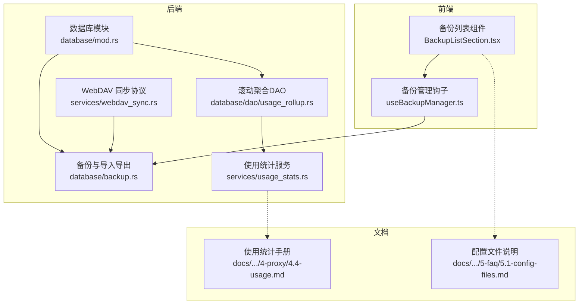
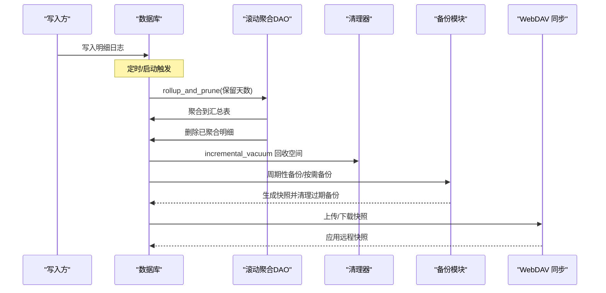
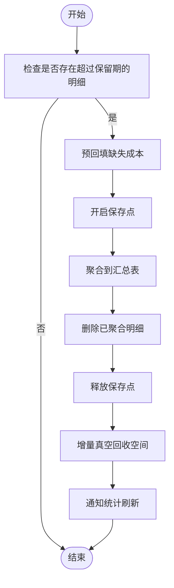
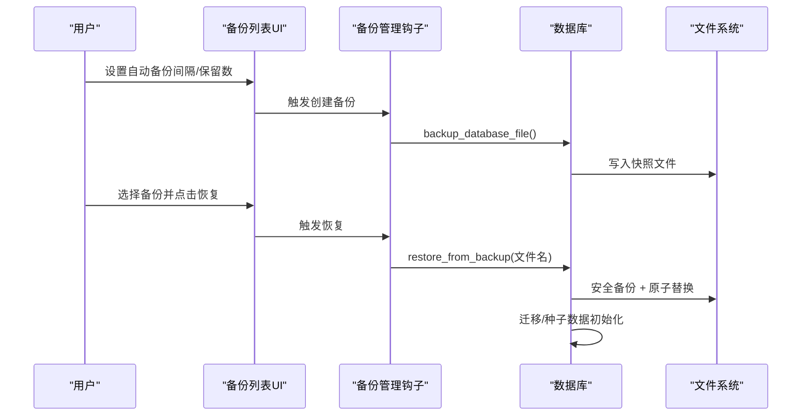
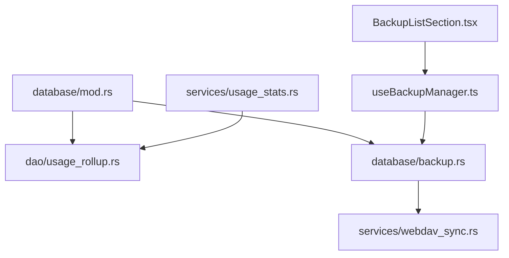

# 数据清理与归档

<cite>
**本文引用的文件**
- [src-tauri/src/database/backup.rs](file://src-tauri/src/database/backup.rs)
- [src-tauri/src/database/dao/usage_rollup.rs](file://src-tauri/src/database/dao/usage_rollup.rs)
- [src-tauri/src/database/mod.rs](file://src-tauri/src/database/mod.rs)
- [src-tauri/src/services/usage_stats.rs](file://src-tauri/src/services/usage_stats.rs)
- [src-tauri/src/services/webdav_sync.rs](file://src-tauri/src/services/webdav_sync.rs)
- [src/components/settings/BackupListSection.tsx](file://src/components/settings/BackupListSection.tsx)
- [src/hooks/useBackupManager.ts](file://src/hooks/useBackupManager.ts)
- [docs/user-manual/en/4-proxy/4.4-usage.md](file://docs/user-manual/en/4-proxy/4.4-usage.md)
- [docs/user-manual/en/5-faq/5.1-config-files.md](file://docs/user-manual/en/5-faq/5.1-config-files.md)
</cite>

## 目录
1. [简介](#简介)
2. [项目结构](#项目结构)
3. [核心组件](#核心组件)
4. [架构总览](#架构总览)
5. [详细组件分析](#详细组件分析)
6. [依赖关系分析](#依赖关系分析)
7. [性能考量](#性能考量)
8. [故障排查指南](#故障排查指南)
9. [结论](#结论)
10. [附录](#附录)

## 简介
本文件系统性阐述 CC Switch 的数据清理与归档策略，覆盖历史数据清理（时间阈值、大小限制、智能清理）、冷热数据分离（热度评估、自动迁移、存储分层）、长期存储优化（压缩、归档格式、访问性能平衡）、数据生命周期管理（创建时间跟踪、到期清理、手动清理）、备份与恢复（增量/全量、灾难恢复）以及数据质量保障（验证、完整性检查、修复机制）。目标是帮助用户与维护者理解并安全地管理应用产生的大量使用统计数据与配置数据。

## 项目结构
围绕数据清理与归档的关键代码分布在 Rust 后端数据库模块、前端备份管理界面与相关文档中：
- 数据库与归档：Rust 层实现 SQLite 数据库的备份、导入导出、周期性维护与滚动聚合。
- 使用统计与去重：Rust 层提供跨源去重、滚动聚合与查询接口。
- 同步协议：WebDAV 同步协议层支持远程快照上传/下载与兼容性校验。
- 用户界面：React 前端提供备份策略设置与备份列表操作。

**图表来源**
- [src/components/settings/BackupListSection.tsx:1-495](file://src/components/settings/BackupListSection.tsx#L1-L495)
- [src/hooks/useBackupManager.ts:1-60](file://src/hooks/useBackupManager.ts#L1-L60)
- [src-tauri/src/database/mod.rs:1-273](file://src-tauri/src/database/mod.rs#L1-L273)
- [src-tauri/src/database/backup.rs:1-861](file://src-tauri/src/database/backup.rs#L1-L861)
- [src-tauri/src/database/dao/usage_rollup.rs:1-534](file://src-tauri/src/database/dao/usage_rollup.rs#L1-L534)
- [src-tauri/src/services/usage_stats.rs:1-800](file://src-tauri/src/services/usage_stats.rs#L1-L800)
- [src-tauri/src/services/webdav_sync.rs:1-336](file://src-tauri/src/services/webdav_sync.rs#L1-L336)
- [docs/user-manual/en/4-proxy/4.4-usage.md:1-199](file://docs/user-manual/en/4-proxy/4.4-usage.md#L1-L199)
- [docs/user-manual/en/5-faq/5.1-config-files.md:1-73](file://docs/user-manual/en/5-faq/5.1-config-files.md#L1-L73)

**章节来源**
- [src-tauri/src/database/mod.rs:1-273](file://src-tauri/src/database/mod.rs#L1-L273)
- [src-tauri/src/database/backup.rs:1-861](file://src-tauri/src/database/backup.rs#L1-L861)
- [src-tauri/src/database/dao/usage_rollup.rs:1-534](file://src-tauri/src/database/dao/usage_rollup.rs#L1-L534)
- [src-tauri/src/services/usage_stats.rs:1-800](file://src-tauri/src/services/usage_stats.rs#L1-L800)
- [src-tauri/src/services/webdav_sync.rs:1-336](file://src-tauri/src/services/webdav_sync.rs#L1-L336)
- [src/components/settings/BackupListSection.tsx:1-495](file://src/components/settings/BackupListSection.tsx#L1-L495)
- [src/hooks/useBackupManager.ts:1-60](file://src/hooks/useBackupManager.ts#L1-L60)
- [docs/user-manual/en/4-proxy/4.4-usage.md:1-199](file://docs/user-manual/en/4-proxy/4.4-usage.md#L1-L199)
- [docs/user-manual/en/5-faq/5.1-config-files.md:1-73](file://docs/user-manual/en/5-faq/5.1-config-files.md#L1-L73)

## 核心组件
- 数据库备份与导入导出：提供二进制快照备份、SQL 导出/导入、WebDAV 同步兼容的数据导出、本地表保留策略等。
- 滚动聚合与清理：将明细日志按自然日聚合到汇总表，并删除已聚合的明细行，同时进行成本回填与去重处理。
- 使用统计服务：提供多维度统计、跨源去重、按日期范围与维度聚合查询。
- WebDAV 同步协议：基于清单的上传/下载流程，支持兼容性版本控制与校验。
- 备份管理前端：提供自动备份间隔、保留数量设置与备份列表操作（创建、重命名、删除、恢复）。

**章节来源**
- [src-tauri/src/database/backup.rs:1-861](file://src-tauri/src/database/backup.rs#L1-L861)
- [src-tauri/src/database/dao/usage_rollup.rs:1-534](file://src-tauri/src/database/dao/usage_rollup.rs#L1-L534)
- [src-tauri/src/services/usage_stats.rs:1-800](file://src-tauri/src/services/usage_stats.rs#L1-L800)
- [src-tauri/src/services/webdav_sync.rs:1-336](file://src-tauri/src/services/webdav_sync.rs#L1-L336)
- [src/components/settings/BackupListSection.tsx:1-495](file://src/components/settings/BackupListSection.tsx#L1-L495)

## 架构总览
数据清理与归档涉及“写入—聚合—清理—备份—同步—恢复”的闭环流程。写入阶段产生明细日志；聚合阶段将旧明细按自然日汇总；清理阶段删除已聚合明细并回收空间；备份阶段定期生成快照并清理过期备份；同步阶段通过 WebDAV 上传/下载快照；恢复阶段在安全备份基础上原子替换数据库。

**图表来源**
- [src-tauri/src/database/dao/usage_rollup.rs:57-180](file://src-tauri/src/database/dao/usage_rollup.rs#L57-L180)
- [src-tauri/src/database/backup.rs:235-295](file://src-tauri/src/database/backup.rs#L235-L295)
- [src-tauri/src/database/mod.rs:144-157](file://src-tauri/src/database/mod.rs#L144-L157)
- [src-tauri/src/services/webdav_sync.rs:63-161](file://src-tauri/src/services/webdav_sync.rs#L63-L161)

## 详细组件分析

### 历史数据清理策略
- 时间阈值清理：按自然日边界对明细日志进行裁剪，保留最近 N 天的明细，其余聚合到汇总表并删除明细。
- 大小限制清理：周期性维护中根据保留策略删除旧日志并执行增量真空回收空间。
- 智能清理算法：在清理前尝试回填缺失的成本字段，避免因定价缺失导致的统计偏差；同时进行跨源去重，避免重复统计。

**图表来源**
- [src-tauri/src/database/dao/usage_rollup.rs:57-180](file://src-tauri/src/database/dao/usage_rollup.rs#L57-L180)
- [src-tauri/src/database/mod.rs:144-157](file://src-tauri/src/database/mod.rs#L144-L157)

**章节来源**
- [src-tauri/src/database/dao/usage_rollup.rs:1-534](file://src-tauri/src/database/dao/usage_rollup.rs#L1-L534)
- [src-tauri/src/database/mod.rs:140-273](file://src-tauri/src/database/mod.rs#L140-L273)

### 冷热数据分离机制
- 数据热度评估：通过明细日志与汇总表的区分实现天然的冷热分层：近期明细为热数据，历史汇总为冷数据。
- 自动迁移策略：滚动聚合将过期明细迁移到汇总表，减少热路径上的写放大与查询压力。
- 存储层级划分：明细表用于高频写入与短期查询，汇总表用于长期统计与报表。

**图表来源**
- [src-tauri/src/database/dao/usage_rollup.rs:115-179](file://src-tauri/src/database/dao/usage_rollup.rs#L115-L179)

**章节来源**
- [src-tauri/src/database/dao/usage_rollup.rs:1-534](file://src-tauri/src/database/dao/usage_rollup.rs#L1-L534)

### 长期存储优化方案
- 压缩存储：数据库采用增量自动回收（incremental auto-vacuum）与增量真空（incremental_vacuum）降低碎片与空间膨胀。
- 归档格式：支持 SQL 文本导出与二进制快照备份，便于跨设备/云同步与离线归档。
- 访问性能平衡：明细表与汇总表分离，明细表仅保留短期数据，查询热点集中在汇总表，兼顾写入吞吐与读取效率。

**章节来源**
- [src-tauri/src/database/backup.rs:1-861](file://src-tauri/src/database/backup.rs#L1-L861)
- [src-tauri/src/database/mod.rs:182-253](file://src-tauri/src/database/mod.rs#L182-L253)

### 数据生命周期管理
- 创建时间跟踪：明细日志包含创建时间戳，用于确定保留期与聚合边界。
- 到期自动清理：启动与周期任务自动执行清理与滚动聚合，确保历史数据及时归档。
- 手动清理策略：用户可通过前端设置自动备份间隔与保留数量，或直接创建/删除/重命名备份。

**章节来源**
- [src-tauri/src/database/mod.rs:144-157](file://src-tauri/src/database/mod.rs#L144-L157)
- [src-tauri/src/database/backup.rs:235-295](file://src-tauri/src/database/backup.rs#L235-L295)
- [src/components/settings/BackupListSection.tsx:165-166](file://src/components/settings/BackupListSection.tsx#L165-L166)

### 数据备份与恢复机制
- 增量备份：周期性检查最新备份时间，超过设定间隔则创建新备份。
- 全量备份：支持一次性创建数据库快照备份，用于手动归档。
- 灾难恢复流程：恢复前先创建安全备份，然后原子替换主库，最后执行必要的迁移与种子数据初始化。

**图表来源**
- [src-tauri/src/database/backup.rs:297-599](file://src-tauri/src/database/backup.rs#L297-L599)
- [src/components/settings/BackupListSection.tsx:87-112](file://src/components/settings/BackupListSection.tsx#L87-L112)
- [src/hooks/useBackupManager.ts:16-29](file://src/hooks/useBackupManager.ts#L16-L29)

**章节来源**
- [src-tauri/src/database/backup.rs:235-599](file://src-tauri/src/database/backup.rs#L235-L599)
- [src/components/settings/BackupListSection.tsx:1-495](file://src/components/settings/BackupListSection.tsx#L1-L495)
- [src/hooks/useBackupManager.ts:1-60](file://src/hooks/useBackupManager.ts#L1-L60)

### 数据质量保证措施
- 数据验证：导入 SQL 前进行格式校验与基础状态检查，确保导入数据有效。
- 完整性检查：导入/恢复过程中使用临时数据库与原子备份，失败不污染主库。
- 修复机制：清理前尝试回填缺失成本，避免统计失真；清理后执行增量真空回收空间。

**章节来源**
- [src-tauri/src/database/backup.rs:83-147](file://src-tauri/src/database/backup.rs#L83-L147)
- [src-tauri/src/database/backup.rs:560-599](file://src-tauri/src/database/backup.rs#L560-L599)
- [src-tauri/src/database/dao/usage_rollup.rs:78-85](file://src-tauri/src/database/dao/usage_rollup.rs#L78-L85)

## 依赖关系分析
- 数据库模块依赖 DAO 与服务层：数据库模块负责初始化与维护，DAO 负责具体表级操作（如滚动聚合），服务层提供统计与查询能力。
- 前端备份管理依赖数据库备份 API：通过 React Query 管理备份列表与操作状态。
- WebDAV 同步依赖数据库快照与清单校验：上传/下载均基于快照与清单的兼容性版本控制。

**图表来源**
- [src-tauri/src/database/mod.rs:1-273](file://src-tauri/src/database/mod.rs#L1-L273)
- [src-tauri/src/database/dao/usage_rollup.rs:1-534](file://src-tauri/src/database/dao/usage_rollup.rs#L1-L534)
- [src-tauri/src/database/backup.rs:1-861](file://src-tauri/src/database/backup.rs#L1-L861)
- [src-tauri/src/services/webdav_sync.rs:1-336](file://src-tauri/src/services/webdav_sync.rs#L1-L336)
- [src-tauri/src/services/usage_stats.rs:1-800](file://src-tauri/src/services/usage_stats.rs#L1-L800)
- [src/components/settings/BackupListSection.tsx:1-495](file://src/components/settings/BackupListSection.tsx#L1-L495)
- [src/hooks/useBackupManager.ts:1-60](file://src/hooks/useBackupManager.ts#L1-L60)

**章节来源**
- [src-tauri/src/database/mod.rs:1-273](file://src-tauri/src/database/mod.rs#L1-L273)
- [src-tauri/src/database/backup.rs:1-861](file://src-tauri/src/database/backup.rs#L1-L861)
- [src-tauri/src/database/dao/usage_rollup.rs:1-534](file://src-tauri/src/database/dao/usage_rollup.rs#L1-L534)
- [src-tauri/src/services/usage_stats.rs:1-800](file://src-tauri/src/services/usage_stats.rs#L1-L800)
- [src-tauri/src/services/webdav_sync.rs:1-336](file://src-tauri/src/services/webdav_sync.rs#L1-L336)
- [src/components/settings/BackupListSection.tsx:1-495](file://src/components/settings/BackupListSection.tsx#L1-L495)
- [src/hooks/useBackupManager.ts:1-60](file://src/hooks/useBackupManager.ts#L1-L60)

## 性能考量
- 写入路径优化：明细表仅保留短期数据，减少写放大；滚动聚合批量处理，降低频繁 IO。
- 查询路径优化：汇总表按自然日聚合，查询热点集中在汇总表，提高统计查询性能。
- 空间回收：增量自动回收与增量真空降低碎片，避免数据库膨胀影响性能。
- 同步效率：WebDAV 上传/下载采用清单与校验，避免不必要的传输与错误重试。

[本节为通用指导，无需列出具体文件来源]

## 故障排查指南
- 备份失败：检查备份目录权限、磁盘空间与自动备份间隔设置；查看日志中的错误信息。
- 恢复失败：确认备份文件名合法、未被篡改；恢复前的安全备份可用于回滚。
- 清理失败：关注清理日志中的警告，确认数据库连接与权限；必要时手动执行增量真空。
- 同步失败：检查 WebDAV 连接、认证信息与远程目录结构；确认清单兼容性与文件校验。

**章节来源**
- [src-tauri/src/database/backup.rs:560-687](file://src-tauri/src/database/backup.rs#L560-L687)
- [src-tauri/src/database/mod.rs:144-157](file://src-tauri/src/database/mod.rs#L144-L157)
- [src-tauri/src/services/webdav_sync.rs:53-161](file://src-tauri/src/services/webdav_sync.rs#L53-L161)

## 结论
CC Switch 的数据清理与归档体系以“明细—汇总—备份—同步—恢复”为核心闭环，结合时间阈值清理、智能成本回填与跨源去重、冷热分层与增量回收、SQL/快照双轨备份与 WebDAV 同步，实现了高效、可靠、可审计的数据生命周期管理。配合前端备份策略设置与可视化操作，用户可在保证数据安全的前提下灵活管理存储与访问性能。

[本节为总结性内容，无需列出具体文件来源]

## 附录
- 数据库内容概览与存储位置参考用户手册中的配置文件说明。
- 使用统计功能与过滤器、去重规则参考使用统计手册。

**章节来源**
- [docs/user-manual/en/5-faq/5.1-config-files.md:1-73](file://docs/user-manual/en/5-faq/5.1-config-files.md#L1-L73)
- [docs/user-manual/en/4-proxy/4.4-usage.md:1-199](file://docs/user-manual/en/4-proxy/4.4-usage.md#L1-L199)