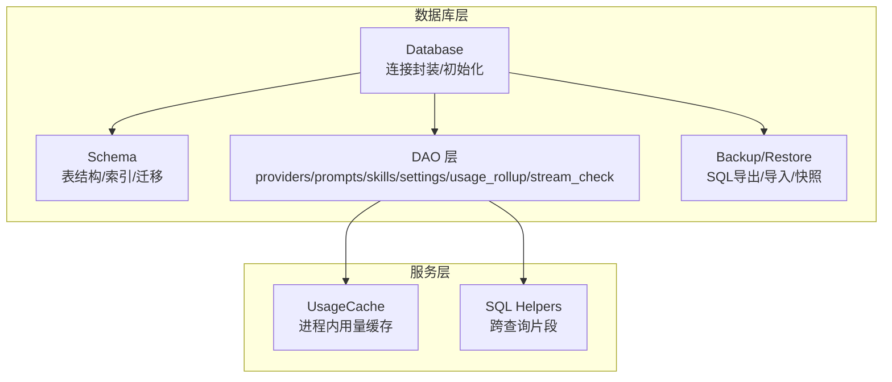
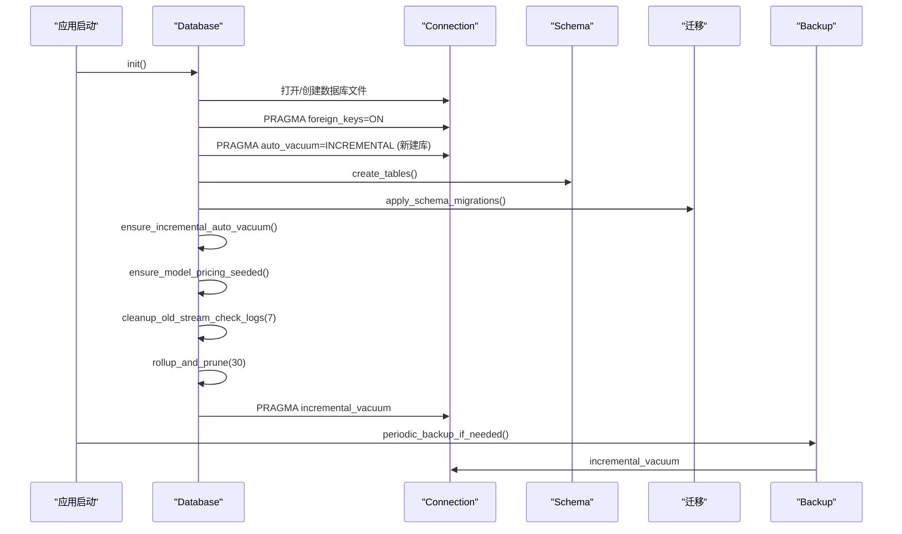
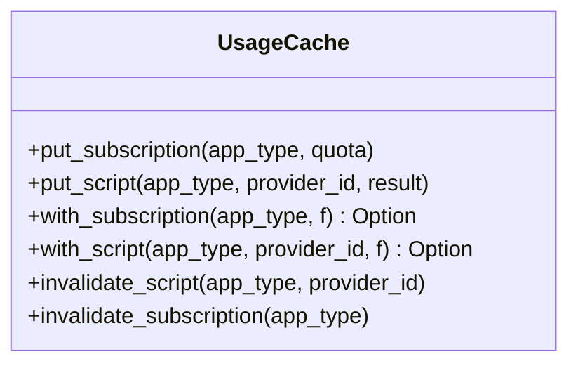
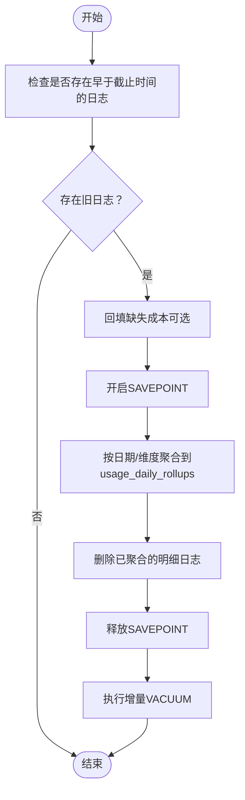
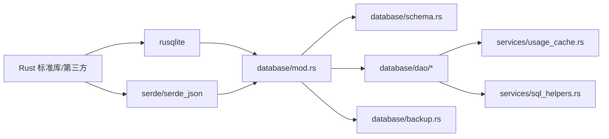

# 性能优化

<cite>
**本文引用的文件**
- [src-tauri/src/database/mod.rs](file://src-tauri/src/database/mod.rs)
- [src-tauri/src/database/schema.rs](file://src-tauri/src/database/schema.rs)
- [src-tauri/src/database/dao/mod.rs](file://src-tauri/src/database/dao/mod.rs)
- [src-tauri/src/database/dao/providers.rs](file://src-tauri/src/database/dao/providers.rs)
- [src-tauri/src/database/dao/prompts.rs](file://src-tauri/src/database/dao/prompts.rs)
- [src-tauri/src/database/dao/skills.rs](file://src-tauri/src/database/dao/skills.rs)
- [src-tauri/src/database/dao/settings.rs](file://src-tauri/src/database/dao/settings.rs)
- [src-tauri/src/database/dao/usage_rollup.rs](file://src-tauri/src/database/dao/usage_rollup.rs)
- [src-tauri/src/database/dao/stream_check.rs](file://src-tauri/src/database/dao/stream_check.rs)
- [src-tauri/src/database/backup.rs](file://src-tauri/src/database/backup.rs)
- [src-tauri/src/database/migration.rs](file://src-tauri/src/database/migration.rs)
- [src-tauri/src/services/usage_cache.rs](file://src-tauri/src/services/usage_cache.rs)
- [src-tauri/src/services/sql_helpers.rs](file://src-tauri/src/services/sql_helpers.rs)
- [src-tauri/Cargo.toml](file://src-tauri/Cargo.toml)
</cite>

## 目录
1. [简介](#简介)
2. [项目结构](#项目结构)
3. [核心组件](#核心组件)
4. [架构总览](#架构总览)
5. [详细组件分析](#详细组件分析)
6. [依赖分析](#依赖分析)
7. [性能考虑](#性能考虑)
8. [故障排查指南](#故障排查指南)
9. [结论](#结论)
10. [附录](#附录)

## 简介
本文件面向 CC Switch 的数据库性能优化，围绕索引策略、查询优化、缓存策略、大数据量处理、性能监控与维护任务展开。文档基于源码实现，结合 SQLite 在本项目中的使用方式，给出可落地的优化建议与最佳实践。

## 项目结构
数据库相关代码集中在 src-tauri/src/database 目录，采用“模块化 + DAO 层”的组织方式：
- 数据库初始化与连接封装：Database 结构体与初始化流程
- 表结构与迁移：schema.rs 定义表与索引，migration.rs 负责 JSON → SQLite 的迁移
- DAO 层：按领域拆分（providers、prompts、skills、settings、usage_rollup、stream_check 等）
- 备份与恢复：backup.rs 提供 SQL 导出/导入与二进制快照备份
- 缓存：usage_cache.rs 提供进程内写穿式用量缓存
- 辅助：sql_helpers.rs 提供跨查询的 SQL 片段复用

图示来源
- [src-tauri/src/database/mod.rs:72-160](file://src-tauri/src/database/mod.rs#L72-L160)
- [src-tauri/src/database/schema.rs:16-364](file://src-tauri/src/database/schema.rs#L16-L364)
- [src-tauri/src/database/dao/mod.rs:1-20](file://src-tauri/src/database/dao/mod.rs#L1-L20)
- [src-tauri/src/database/backup.rs:45-147](file://src-tauri/src/database/backup.rs#L45-L147)
- [src-tauri/src/services/usage_cache.rs:13-85](file://src-tauri/src/services/usage_cache.rs#L13-L85)
- [src-tauri/src/services/sql_helpers.rs:9-47](file://src-tauri/src/services/sql_helpers.rs#L9-L47)

章节来源
- [src-tauri/src/database/mod.rs:1-273](file://src-tauri/src/database/mod.rs#L1-L273)
- [src-tauri/src/database/schema.rs:1-800](file://src-tauri/src/database/schema.rs#L1-L800)
- [src-tauri/src/database/dao/mod.rs:1-20](file://src-tauri/src/database/dao/mod.rs#L1-L20)

## 核心组件
- Database：封装 rusqlite::Connection，使用 Mutex 保证多线程安全；初始化时启用外键与增量自动回收；注册变更钩子；提供表创建、迁移、索引、清理等能力。
- Schema：集中定义表结构、索引与迁移逻辑；包含使用统计明细表与日聚合表、流式健康检查日志表等。
- DAO：按领域提供 CRUD 与业务查询；大量使用参数化查询与事务，减少锁竞争。
- Backup：提供 SQL 导出/导入、二进制快照备份、周期性维护（清理、VACUUM）。
- UsageCache：进程内写穿式缓存，避免频繁查询数据库。
- SQL Helpers：提供跨查询的输入令牌规范化表达式，确保聚合一致性。

章节来源
- [src-tauri/src/database/mod.rs:72-160](file://src-tauri/src/database/mod.rs#L72-L160)
- [src-tauri/src/database/schema.rs:16-364](file://src-tauri/src/database/schema.rs#L16-L364)
- [src-tauri/src/database/dao/providers.rs:19-109](file://src-tauri/src/database/dao/providers.rs#L19-L109)
- [src-tauri/src/database/backup.rs:235-295](file://src-tauri/src/database/backup.rs#L235-L295)
- [src-tauri/src/services/usage_cache.rs:13-85](file://src-tauri/src/services/usage_cache.rs#L13-L85)
- [src-tauri/src/services/sql_helpers.rs:9-47](file://src-tauri/src/services/sql_helpers.rs#L9-L47)

## 架构总览
数据库初始化与运行期关键流程如下：

图示来源
- [src-tauri/src/database/mod.rs:92-160](file://src-tauri/src/database/mod.rs#L92-L160)
- [src-tauri/src/database/schema.rs:366-470](file://src-tauri/src/database/schema.rs#L366-L470)
- [src-tauri/src/database/backup.rs:235-295](file://src-tauri/src/database/backup.rs#L235-L295)

## 详细组件分析

### 索引策略与主键设计
- 主键索引
  - 多数表采用复合主键或单一主键，如 providers 的 (id, app_type)，skills 的 id，settings 的 key，usage_daily_rollups 的复合主键等。复合主键天然形成索引，有利于唯一性约束与点查。
- 复合索引
  - 使用统计明细表 proxy_request_logs 的多维索引：provider/app_type、created_at、model、session_id、status_code，支撑高频过滤与范围查询。
  - 流式健康检查表 stream_check_logs 的复合索引：(app_type, provider_id, tested_at DESC)，满足按应用、提供商与时间倒序查询。
  - 故障转移队列索引：providers 的 (app_type, in_failover_queue, sort_index)，支持快速定位与排序。
- 索引创建位置
  - 在 create_tables 阶段集中创建，避免运行期动态变更带来的锁与碎片风险。
- 索引维护
  - 启动时确保增量自动回收开启，定期清理与汇总（rollup_and_prune）后执行增量 VACUUM，降低索引碎片与页分裂影响。

章节来源
- [src-tauri/src/database/schema.rs:201-247](file://src-tauri/src/database/schema.rs#L201-L247)
- [src-tauri/src/database/schema.rs:356-361](file://src-tauri/src/database/schema.rs#L356-L361)

### 查询优化与执行效率
- 参数化查询与事务
  - DAO 层广泛使用参数化 SQL 与事务，减少 SQL 注入风险与解析开销，提升并发安全性。
- 排序与选择性
  - providers 查询按 sort_index、created_at、id 排序，结合索引可显著降低排序成本。
- 聚合与去重
  - usage_rollup 使用有效日志过滤表达式与 LEFT JOIN 合并，避免重复会话行导致的重复计数。
- 输入令牌规范化
  - 使用 sql_helpers 提供的 fresh_input_sql 表达式，统一不同提供商的输入语义，避免聚合偏差。

章节来源
- [src-tauri/src/database/dao/providers.rs:20-109](file://src-tauri/src/database/dao/providers.rs#L20-L109)
- [src-tauri/src/database/dao/usage_rollup.rs:115-179](file://src-tauri/src/database/dao/usage_rollup.rs#L115-L179)
- [src-tauri/src/services/sql_helpers.rs:31-47](file://src-tauri/src/services/sql_helpers.rs#L31-L47)

### 缓存策略
- 进程内写穿式缓存（UsageCache）
  - 用途：托盘用量展示，避免频繁查询数据库。
  - 结构：分别维护订阅配额与脚本型用量结果，使用 RwLock 保证并发读写。
  - 生命周期：进程重启即失效，由后续查询或悬停刷新自动重建。
- 磁盘缓存
  - 通过备份/恢复机制与增量自动回收维持数据库稳定性；定期维护（清理、汇总、VACUUM）间接降低磁盘碎片与 IO 抖动。

图示来源
- [src-tauri/src/services/usage_cache.rs:13-85](file://src-tauri/src/services/usage_cache.rs#L13-L85)

章节来源
- [src-tauri/src/services/usage_cache.rs:13-85](file://src-tauri/src/services/usage_cache.rs#L13-L85)

### 大数据量处理优化
- 分页查询
  - 当前 DAO 层未见显式分页实现；建议在前端或上层业务中对长列表（如 providers、prompts、skills）采用分页/虚拟滚动，避免一次性加载过多行。
- 批量操作
  - DAO 层普遍使用事务包裹批量写入（如 save_provider、migrate_from_json），减少锁竞争与 WAL 写入次数。
- 数据压缩与归档
  - 使用 usage_daily_rollups 对 proxy_request_logs 进行日聚合与裁剪，保留必要维度（request_model、pricing_model）以支持回填与审计。
  - 定期清理过期日志（stream_check_logs）与增量 VACUUM，回收空间。

图示来源
- [src-tauri/src/database/dao/usage_rollup.rs:61-113](file://src-tauri/src/database/dao/usage_rollup.rs#L61-L113)
- [src-tauri/src/database/backup.rs:279-292](file://src-tauri/src/database/backup.rs#L279-L292)

章节来源
- [src-tauri/src/database/dao/usage_rollup.rs:57-180](file://src-tauri/src/database/dao/usage_rollup.rs#L57-L180)
- [src-tauri/src/database/backup.rs:235-295](file://src-tauri/src/database/backup.rs#L235-L295)

### 性能监控指标与基准测试
- 监控指标建议
  - 数据库层面：表行数、索引碎片率（SQLite 可通过 PRAGMA 指标近似）、VACUUM 回收页数、增量 VACUUM 成功率。
  - 业务层面：代理请求延迟、成功率、token 消耗、日汇总行数、清理/汇总耗时。
- 基准测试方法
  - 使用内存数据库（Database::memory）构造大规模测试集，对比不同索引组合、聚合策略与清理周期下的吞吐与延迟。
  - 使用现有测试用例扩展：在 tests 目录中增加针对大数据量的回归测试，覆盖 rollup、清理、导入导出等关键路径。

章节来源
- [src-tauri/src/database/mod.rs:162-180](file://src-tauri/src/database/mod.rs#L162-L180)
- [src-tauri/src/database/dao/usage_rollup.rs:182-534](file://src-tauri/src/database/dao/usage_rollup.rs#L182-L534)

### 数据库维护任务
- VACUUM 与自动回收
  - 新建数据库启用增量自动回收；运行期定期执行增量 VACUUM，回收已删除页。
- ANALYZE
  - SQLite 默认统计信息由查询计划器维护；如需强制更新统计，可在维护窗口执行 ANALYZE（本项目未显式调用）。
- 索引重建
  - 通过迁移与表重建逻辑（ensure_incremental_auto_vacuum_on_conn）在必要时重建索引与表结构，确保性能稳定。

章节来源
- [src-tauri/src/database/mod.rs:182-253](file://src-tauri/src/database/mod.rs#L182-L253)
- [src-tauri/src/database/backup.rs:279-292](file://src-tauri/src/database/backup.rs#L279-L292)

## 依赖分析
- 外部依赖
  - rusqlite：SQLite 绑定，启用 hooks、backup 功能；使用 Mutex 包装 Connection 以支持多线程。
  - serde/serde_json：配置与数据序列化。
- 内部依赖
  - DAO 层依赖 Database 的连接与事务封装；Backup/Restore 依赖 DAO 的表结构与迁移能力；UsageCache 与 SQL Helpers 为查询层提供辅助。

图示来源
- [src-tauri/Cargo.toml:75-76](file://src-tauri/Cargo.toml#L75-L76)
- [src-tauri/src/database/mod.rs:42-46](file://src-tauri/src/database/mod.rs#L42-L46)
- [src-tauri/src/database/dao/mod.rs:1-20](file://src-tauri/src/database/dao/mod.rs#L1-L20)

章节来源
- [src-tauri/Cargo.toml:25-83](file://src-tauri/Cargo.toml#L25-L83)
- [src-tauri/src/database/mod.rs:42-46](file://src-tauri/src/database/mod.rs#L42-L46)

## 性能考虑
- 并发与锁
  - 使用 Mutex 包装 Connection，避免多线程竞态；DAO 层尽量使用事务包裹批量操作，减少锁粒度争用。
- 查询计划
  - 优先使用带索引的过滤条件（如 app_type/provider_id/date/model/session_id/status_code），避免全表扫描。
- 写入放大
  - 使用事务与批量写入，减少 WAL 刷新频率；合理设置 auto_vacuum 与增量 VACUUM，控制碎片。
- 缓存命中
  - UsageCache 仅缓存短期展示数据，避免长期驻留内存；对高热路径（托盘菜单）提升响应速度。

## 故障排查指南
- 数据库初始化失败
  - 检查外键与自动回收设置；确认数据库文件权限与父目录存在。
- 查询缓慢
  - 确认 WHERE 条件是否命中索引；避免在 WHERE 中对列进行函数计算；必要时调整复合索引顺序。
- 空间膨胀
  - 触发增量 VACUUM；检查是否遗漏清理过期日志；评估是否需要重建索引。
- 备份/恢复异常
  - 确认导出 SQL 头标识；导入前的安全备份；导入后运行迁移与校验。

章节来源
- [src-tauri/src/database/mod.rs:92-160](file://src-tauri/src/database/mod.rs#L92-L160)
- [src-tauri/src/database/backup.rs:166-177](file://src-tauri/src/database/backup.rs#L166-L177)
- [src-tauri/src/database/backup.rs:369-384](file://src-tauri/src/database/backup.rs#L369-L384)

## 结论
本项目的数据库层通过合理的主键/复合索引设计、事务化批量写入、日志聚合与定期维护，实现了在中小规模数据下的稳定与高效。针对更大规模数据，建议引入分页与虚拟滚动、进一步优化热点查询的索引组合，并建立完善的监控与基准测试体系，持续迭代性能表现。

## 附录
- 关键实现参考路径
  - 数据库初始化与维护：[src-tauri/src/database/mod.rs:92-160](file://src-tauri/src/database/mod.rs#L92-L160)
  - 表结构与索引：[src-tauri/src/database/schema.rs:16-364](file://src-tauri/src/database/schema.rs#L16-L364)
  - 使用统计聚合与清理：[src-tauri/src/database/dao/usage_rollup.rs:57-180](file://src-tauri/src/database/dao/usage_rollup.rs#L57-L180)
  - 备份/恢复与周期维护：[src-tauri/src/database/backup.rs:235-295](file://src-tauri/src/database/backup.rs#L235-L295)
  - 进程内用量缓存：[src-tauri/src/services/usage_cache.rs:13-85](file://src-tauri/src/services/usage_cache.rs#L13-L85)
  - 跨查询输入令牌规范化：[src-tauri/src/services/sql_helpers.rs:31-47](file://src-tauri/src/services/sql_helpers.rs#L31-L47)