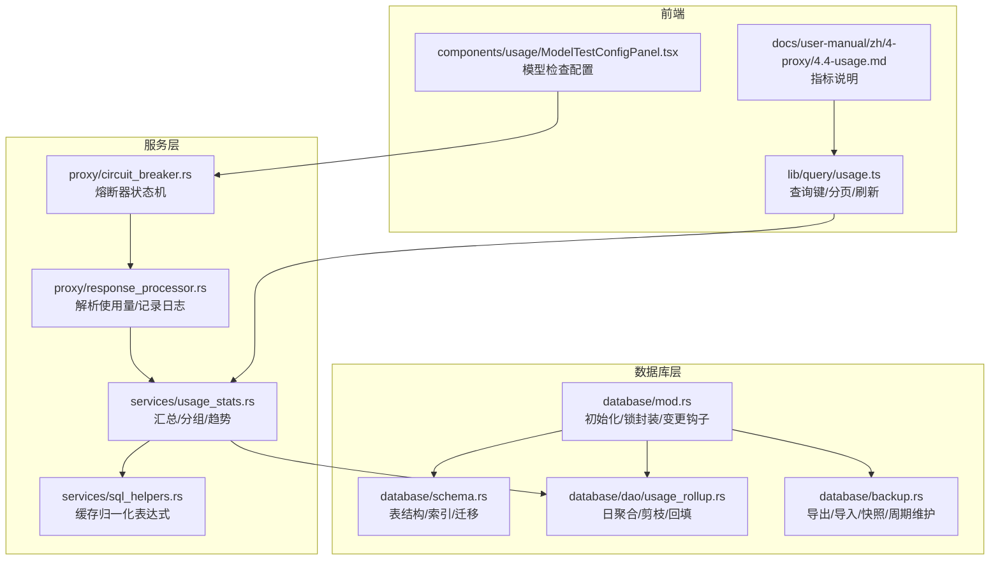
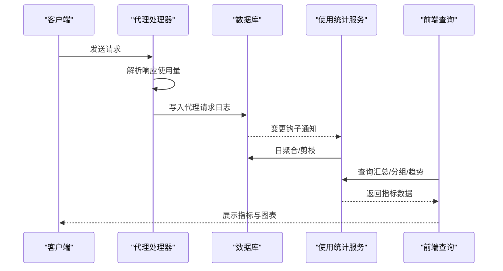
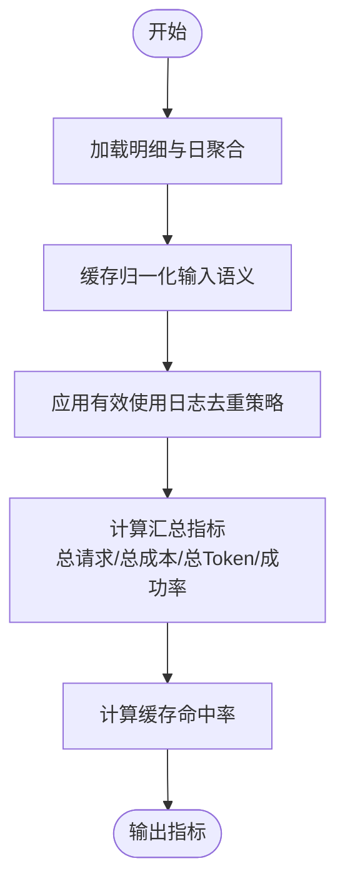
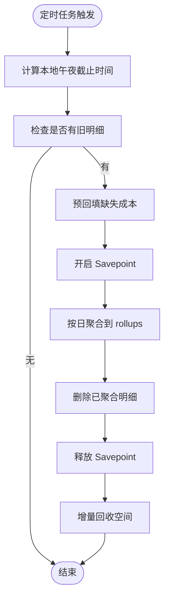
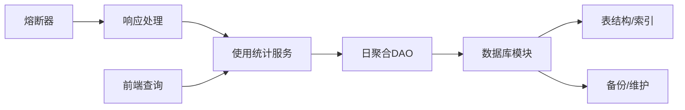

# 性能监控与指标

<cite>
**本文引用的文件**
- [src-tauri/src/database/mod.rs](file://src-tauri/src/database/mod.rs)
- [src-tauri/src/database/schema.rs](file://src-tauri/src/database/schema.rs)
- [src-tauri/src/database/dao/usage_rollup.rs](file://src-tauri/src/database/dao/usage_rollup.rs)
- [src-tauri/src/database/backup.rs](file://src-tauri/src/database/backup.rs)
- [src-tauri/src/services/usage_stats.rs](file://src-tauri/src/services/usage_stats.rs)
- [src-tauri/src/services/sql_helpers.rs](file://src-tauri/src/services/sql_helpers.rs)
- [src-tauri/src/proxy/response_processor.rs](file://src-tauri/src/proxy/response_processor.rs)
- [src-tauri/src/proxy/circuit_breaker.rs](file://src-tauri/src/proxy/circuit_breaker.rs)
- [src/lib/query/usage.ts](file://src/lib/query/usage.ts)
- [docs/user-manual/zh/4-proxy/4.4-usage.md](file://docs/user-manual/zh/4-proxy/4.4-usage.md)
- [docs/user-manual/zh/4-proxy/4.5-model-test.md](file://docs/user-manual/zh/4-proxy/4.5-model-test.md)
- [src/components/usage/ModelTestConfigPanel.tsx](file://src/components/usage/ModelTestConfigPanel.tsx)
- [src-tauri/src/commands/settings.rs](file://src-tauri/src/commands/settings.rs)
</cite>

## 目录
1. [简介](#简介)
2. [项目结构](#项目结构)
3. [核心组件](#核心组件)
4. [架构总览](#架构总览)
5. [详细组件分析](#详细组件分析)
6. [依赖关系分析](#依赖关系分析)
7. [性能考量](#性能考量)
8. [故障排查指南](#故障排查指南)
9. [结论](#结论)
10. [附录](#附录)

## 简介
本文件面向 CC Switch 的数据库性能监控与指标体系，聚焦以下目标：
- 定义关键性能指标（查询响应时间、吞吐量、连接数、缓存命中率）及其测量方法
- 说明性能监控工具与指标采集方式（SQLite 性能分析、系统监控、自定义指标）
- 提供性能基准测试方法（压力测试、负载测试、容量规划）
- 分析性能瓶颈识别与诊断技巧（慢查询日志、锁等待、内存使用）
- 规划性能告警与自动化监控配置
- 阐述性能优化验证与回归测试策略

## 项目结构
围绕数据库与使用统计的关键代码分布在如下模块：
- 数据库层：初始化、表结构、迁移、备份与维护
- 使用统计服务：指标聚合、缓存命中率计算、日趋势与分组统计
- 代理层：请求处理、使用量解析、熔断器
- 前端查询：指标查询键、分页与刷新策略
- 文档与用户手册：指标定义与界面说明

图表来源
- [src-tauri/src/database/mod.rs:1-273](file://src-tauri/src/database/mod.rs#L1-L273)
- [src-tauri/src/database/schema.rs:1-800](file://src-tauri/src/database/schema.rs#L1-L800)
- [src-tauri/src/database/dao/usage_rollup.rs:1-534](file://src-tauri/src/database/dao/usage_rollup.rs#L1-L534)
- [src-tauri/src/database/backup.rs:1-861](file://src-tauri/src/database/backup.rs#L1-L861)
- [src-tauri/src/services/usage_stats.rs:1-3138](file://src-tauri/src/services/usage_stats.rs#L1-L3138)
- [src-tauri/src/services/sql_helpers.rs:1-135](file://src-tauri/src/services/sql_helpers.rs#L1-L135)
- [src-tauri/src/proxy/response_processor.rs:278-303](file://src-tauri/src/proxy/response_processor.rs#L278-L303)
- [src-tauri/src/proxy/circuit_breaker.rs:1-496](file://src-tauri/src/proxy/circuit_breaker.rs#L1-L496)
- [src/lib/query/usage.ts:83-123](file://src/lib/query/usage.ts#L83-L123)
- [docs/user-manual/zh/4-proxy/4.4-usage.md:1-93](file://docs/user-manual/zh/4-proxy/4.4-usage.md#L1-L93)
- [src/components/usage/ModelTestConfigPanel.tsx:32-143](file://src/components/usage/ModelTestConfigPanel.tsx#L32-L143)

章节来源
- [src-tauri/src/database/mod.rs:1-273](file://src-tauri/src/database/mod.rs#L1-L273)
- [src-tauri/src/database/schema.rs:1-800](file://src-tauri/src/database/schema.rs#L1-L800)
- [src-tauri/src/database/dao/usage_rollup.rs:1-534](file://src-tauri/src/database/dao/usage_rollup.rs#L1-L534)
- [src-tauri/src/database/backup.rs:1-861](file://src-tauri/src/database/backup.rs#L1-L861)
- [src-tauri/src/services/usage_stats.rs:1-3138](file://src-tauri/src/services/usage_stats.rs#L1-L3138)
- [src-tauri/src/services/sql_helpers.rs:1-135](file://src-tauri/src/services/sql_helpers.rs#L1-L135)
- [src-tauri/src/proxy/response_processor.rs:278-303](file://src-tauri/src/proxy/response_processor.rs#L278-L303)
- [src-tauri/src/proxy/circuit_breaker.rs:1-496](file://src-tauri/src/proxy/circuit_breaker.rs#L1-L496)
- [src/lib/query/usage.ts:83-123](file://src/lib/query/usage.ts#L83-L123)
- [docs/user-manual/zh/4-proxy/4.4-usage.md:1-93](file://docs/user-manual/zh/4-proxy/4.4-usage.md#L1-L93)
- [src/components/usage/ModelTestConfigPanel.tsx:32-143](file://src/components/usage/ModelTestConfigPanel.tsx#L32-L143)

## 核心组件
- 数据库初始化与锁封装：提供线程安全的连接封装、外键与增量自动回收配置、数据库变更钩子
- 表结构与索引：代理请求日志、模型定价、使用日聚合、流式检查日志等
- 日聚合与剪枝：将明细日志按自然日聚合至 rollups，并删除明细以控制存储规模
- 使用统计服务：提供汇总、分组、趋势、去重策略与缓存命中率计算
- 缓存归一化：统一不同提供商的输入语义，保证统计口径一致
- 代理响应处理：解析响应中的使用量并记录到日志
- 熔断器：基于失败次数、错误率与超时的健康状态机
- 前端查询：查询键、分页、刷新间隔与过滤器

章节来源
- [src-tauri/src/database/mod.rs:72-180](file://src-tauri/src/database/mod.rs#L72-L180)
- [src-tauri/src/database/schema.rs:183-296](file://src-tauri/src/database/schema.rs#L183-L296)
- [src-tauri/src/database/dao/usage_rollup.rs:57-180](file://src-tauri/src/database/dao/usage_rollup.rs#L57-L180)
- [src-tauri/src/services/usage_stats.rs:15-33](file://src-tauri/src/services/usage_stats.rs#L15-L33)
- [src-tauri/src/services/sql_helpers.rs:21-47](file://src-tauri/src/services/sql_helpers.rs#L21-L47)
- [src-tauri/src/proxy/response_processor.rs:278-303](file://src-tauri/src/proxy/response_processor.rs#L278-L303)
- [src-tauri/src/proxy/circuit_breaker.rs:13-73](file://src-tauri/src/proxy/circuit_breaker.rs#L13-L73)
- [src/lib/query/usage.ts:83-123](file://src/lib/query/usage.ts#L83-L123)

## 架构总览
数据库性能监控贯穿“采集—聚合—查询—展示”的闭环：
- 采集：代理层解析响应使用量并写入明细日志
- 聚合：后台任务将明细按自然日聚合到 rollups，并删除明细
- 查询：服务层提供汇总、分组与趋势接口
- 展示：前端查询键驱动 UI 自动刷新与过滤

图表来源
- [src-tauri/src/proxy/response_processor.rs:278-303](file://src-tauri/src/proxy/response_processor.rs#L278-L303)
- [src-tauri/src/database/mod.rs:80-90](file://src-tauri/src/database/mod.rs#L80-L90)
- [src-tauri/src/database/dao/usage_rollup.rs:57-180](file://src-tauri/src/database/dao/usage_rollup.rs#L57-L180)
- [src-tauri/src/services/usage_stats.rs:493-846](file://src-tauri/src/services/usage_stats.rs#L493-L846)
- [src/lib/query/usage.ts:211-285](file://src/lib/query/usage.ts#L211-L285)

## 详细组件分析

### 使用统计与缓存命中率
- 指标定义
  - 实际处理总 Token：输入 + 输出 + 缓存创建 + 缓存读取（缓存归一化后）
  - 缓存命中率：缓存读取 Token / 缓存可命中输入（缓存可命中输入 = 输入（去缓存）+ 缓存创建 + 缓存读取）
  - 成功率：成功请求数 / 总请求数
- 计算逻辑
  - 使用缓存归一化表达式将不同提供商的输入语义统一
  - 汇总时对明细与 rollups 进行联合聚合，并应用去重策略
- 去重策略
  - 对会话来源与代理来源进行对比，优先保留代理来源的明细，避免重复统计

图表来源
- [src-tauri/src/services/usage_stats.rs:43-60](file://src-tauri/src/services/usage_stats.rs#L43-L60)
- [src-tauri/src/services/sql_helpers.rs:21-47](file://src-tauri/src/services/sql_helpers.rs#L21-L47)
- [src-tauri/src/services/usage_stats.rs:226-254](file://src-tauri/src/services/usage_stats.rs#L226-L254)

章节来源
- [src-tauri/src/services/usage_stats.rs:15-33](file://src-tauri/src/services/usage_stats.rs#L15-L33)
- [src-tauri/src/services/usage_stats.rs:43-60](file://src-tauri/src/services/usage_stats.rs#L43-L60)
- [src-tauri/src/services/usage_stats.rs:226-254](file://src-tauri/src/services/usage_stats.rs#L226-L254)
- [src-tauri/src/services/sql_helpers.rs:21-47](file://src-tauri/src/services/sql_helpers.rs#L21-L47)
- [docs/user-manual/zh/4-proxy/4.4-usage.md:46-58](file://docs/user-manual/zh/4-proxy/4.4-usage.md#L46-L58)

### 日聚合与剪枝
- 目的：降低明细日志规模，提升查询性能，保障长期运行的磁盘占用可控
- 截止时间对齐：按本地午夜对齐，确保日聚合完整性
- 剪枝前回填：在删除明细前尽力回填缺失的成本字段，避免计费损失
- 原子性：使用 Savepoint 保证聚合与删除的原子性
- 周期维护：定期清理过期流式检查日志与执行增量回收

图表来源
- [src-tauri/src/database/dao/usage_rollup.rs:10-55](file://src-tauri/src/database/dao/usage_rollup.rs#L10-L55)
- [src-tauri/src/database/dao/usage_rollup.rs:61-113](file://src-tauri/src/database/dao/usage_rollup.rs#L61-L113)
- [src-tauri/src/database/dao/usage_rollup.rs:115-179](file://src-tauri/src/database/dao/usage_rollup.rs#L115-L179)
- [src-tauri/src/database/backup.rs:235-295](file://src-tauri/src/database/backup.rs#L235-L295)

章节来源
- [src-tauri/src/database/dao/usage_rollup.rs:57-180](file://src-tauri/src/database/dao/usage_rollup.rs#L57-L180)
- [src-tauri/src/database/backup.rs:235-295](file://src-tauri/src/database/backup.rs#L235-L295)

### 代理响应处理与使用量记录
- 解析与落库：解析响应中的使用量字段，按优先级确定模型名，记录到明细日志
- 性能注意：在禁用使用量日志时跳过整包 JSON 解析，避免非流式响应的解析开销

章节来源
- [src-tauri/src/proxy/response_processor.rs:278-303](file://src-tauri/src/proxy/response_processor.rs#L278-L303)

### 熔断器与健康状态
- 状态机：Closed / Open / HalfOpen
- 触发条件：连续失败阈值、错误率阈值、最小请求数
- 恢复机制：超时后进入 HalfOpen，成功阈值达标后回到 Closed
- 统计与配置：支持热更新配置，提供统计信息接口

章节来源
- [src-tauri/src/proxy/circuit_breaker.rs:13-73](file://src-tauri/src/proxy/circuit_breaker.rs#L13-L73)
- [src-tauri/src/proxy/circuit_breaker.rs:105-388](file://src-tauri/src/proxy/circuit_breaker.rs#L105-L388)

### 前端查询与刷新策略
- 查询键：按时间范围、应用类型、提供者、模型、状态码等构建键
- 分页与刷新：支持分页、刷新间隔与后台刷新开关
- 与服务端联动：查询触发后自动刷新，保持与日志/统计面板一致

章节来源
- [src/lib/query/usage.ts:83-123](file://src/lib/query/usage.ts#L83-L123)
- [src/lib/query/usage.ts:211-285](file://src/lib/query/usage.ts#L211-L285)

### 模型检查与延迟观测
- 目的：验证模型可用性、API Key 有效性、端点响应、首字节时间与整体延迟
- 配置：超时、重试次数、降级阈值
- 覆盖范围：Claude / Codex / Gemini / OpenCode / OpenClaw

章节来源
- [docs/user-manual/zh/4-proxy/4.5-model-test.md:1-69](file://docs/user-manual/zh/4-proxy/4.5-model-test.md#L1-L69)
- [src/components/usage/ModelTestConfigPanel.tsx:32-143](file://src/components/usage/ModelTestConfigPanel.tsx#L32-L143)

## 依赖关系分析
- 数据库层
  - 初始化与锁封装依赖 rusqlite，提供线程安全连接与变更钩子
  - 表结构与索引定义支撑明细日志与日聚合统计
  - 备份与周期维护保障数据一致性与空间回收
- 服务层
  - 使用统计服务依赖数据库 DAO 与 SQL 辅助函数
  - 代理响应处理依赖使用统计服务进行落库
  - 熔断器与代理处理共同影响上游健康判定
- 前端
  - 查询键与刷新策略驱动 UI 与服务端交互

图表来源
- [src-tauri/src/proxy/response_processor.rs:278-303](file://src-tauri/src/proxy/response_processor.rs#L278-L303)
- [src-tauri/src/services/usage_stats.rs:493-846](file://src-tauri/src/services/usage_stats.rs#L493-L846)
- [src-tauri/src/database/dao/usage_rollup.rs:57-180](file://src-tauri/src/database/dao/usage_rollup.rs#L57-L180)
- [src-tauri/src/database/mod.rs:72-180](file://src-tauri/src/database/mod.rs#L72-L180)
- [src-tauri/src/proxy/circuit_breaker.rs:105-388](file://src-tauri/src/proxy/circuit_breaker.rs#L105-L388)
- [src/lib/query/usage.ts:211-285](file://src/lib/query/usage.ts#L211-L285)

## 性能考量
- 查询响应时间
  - 指标来源：明细日志中的延迟字段与日聚合中的平均延迟
  - 优化建议：合理设置刷新间隔，避免频繁全量查询；利用索引与分区（按日期）减少扫描
- 吞吐量
  - 指标来源：请求计数与时间窗口内的聚合
  - 优化建议：批量写入、异步聚合、限制高基数维度（如模型/提供者）的增长
- 连接数
  - 现状：使用 Mutex 包装 Connection，避免跨线程共享原生连接
  - 优化建议：评估连接池策略（如 per-thread 连接）、减少锁竞争
- 缓存命中率
  - 指标来源：缓存读取 Token / 缓存可命中输入
  - 优化建议：统一输入语义、提升缓存策略命中率、减少重复请求

[本节为通用指导，不直接分析具体文件]

## 故障排查指南
- 慢查询定位
  - 使用 SQLite EXPLAIN QUERY PLAN 分析高频查询的执行计划
  - 关注缺少索引的过滤条件（如 app_type、status_code、created_at）
- 锁等待与并发
  - 观察数据库变更钩子与 Savepoint 使用，避免长时间持有锁
  - 检查聚合/剪枝任务的执行频率与截止时间计算
- 内存与磁盘
  - 监控增量回收与备份策略，确保空间回收及时
  - 关注前端查询的分页与刷新策略，避免一次性加载过多数据

章节来源
- [src-tauri/src/database/dao/usage_rollup.rs:87-113](file://src-tauri/src/database/dao/usage_rollup.rs#L87-L113)
- [src-tauri/src/database/backup.rs:270-295](file://src-tauri/src/database/backup.rs#L270-L295)

## 结论
CC Switch 的数据库性能监控以“明细日志 + 日聚合”的双层结构为核心，结合缓存归一化与去重策略，形成稳定、可审计且可扩展的指标体系。通过熔断器与模型检查，系统能够主动感知上游健康状况并进行自愈。建议在生产环境中配合系统监控与日志分析工具，持续优化查询与写入路径，确保长期稳定运行。

[本节为总结，不直接分析具体文件]

## 附录

### 关键性能指标定义与测量方法
- 实际处理总 Token
  - 定义：输入（去缓存）+ 输出 + 缓存创建 + 缓存读取
  - 计算：使用缓存归一化表达式统一输入语义后求和
- 缓存命中率
  - 定义：缓存读取 Token / 缓存可命中输入
  - 计算：命中率 = cache_read / (fresh_input + cache_creation + cache_read)
- 成功率
  - 定义：状态码在 2xx 的请求占比
  - 计算：成功数 / 总数
- 查询响应时间
  - 定义：明细日志中的延迟字段与日聚合中的平均延迟
  - 计算：按时间窗口聚合，取平均/分位数

章节来源
- [src-tauri/src/services/usage_stats.rs:15-33](file://src-tauri/src/services/usage_stats.rs#L15-L33)
- [src-tauri/src/services/usage_stats.rs:43-60](file://src-tauri/src/services/usage_stats.rs#L43-L60)
- [src-tauri/src/services/sql_helpers.rs:21-47](file://src-tauri/src/services/sql_helpers.rs#L21-L47)
- [docs/user-manual/zh/4-proxy/4.4-usage.md:46-58](file://docs/user-manual/zh/4-proxy/4.4-usage.md#L46-L58)

### 性能监控工具与指标采集
- SQLite 性能分析
  - 使用 EXPLAIN QUERY PLAN 分析慢查询
  - 监控 PRAGMA 指标（如 page_count、cache_size、auto_vacuum）
- 系统监控
  - CPU、内存、磁盘 IO、网络带宽
  - 进程级指标：线程数、上下文切换、缺页异常
- 自定义指标
  - 使用统计服务提供的汇总与趋势接口
  - 代理层延迟与错误码映射

章节来源
- [src-tauri/src/database/mod.rs:182-253](file://src-tauri/src/database/mod.rs#L182-L253)
- [src-tauri/src/proxy/error_mapper.rs:89-118](file://src-tauri/src/proxy/error_mapper.rs#L89-L118)

### 基准测试方法
- 压力测试
  - 逐步提升并发与请求速率，观察延迟与错误率变化
  - 关注熔断器触发与恢复过程
- 负载测试
  - 在稳定负载下运行较长时间，观察缓存命中率与资源占用
- 容量规划
  - 基于日聚合与剪枝策略估算存储增长与查询复杂度
  - 评估索引与分区策略对查询性能的影响

[本节为通用指导，不直接分析具体文件]

### 性能告警与自动化监控配置
- 告警维度
  - 延迟分位数、错误率、吞吐量下降、缓存命中率骤降
  - 熔断器状态切换、数据库空间回收失败
- 自动化
  - 周期性维护任务（清理过期日志、增量回收）
  - 日聚合与剪枝任务的失败告警
  - 日志级别动态调整（通过命令接口）

章节来源
- [src-tauri/src/proxy/circuit_breaker.rs:202-288](file://src-tauri/src/proxy/circuit_breaker.rs#L202-L288)
- [src-tauri/src/database/backup.rs:235-295](file://src-tauri/src/database/backup.rs#L235-L295)
- [src-tauri/src/commands/settings.rs:432-457](file://src-tauri/src/commands/settings.rs#L432-L457)

### 性能优化验证与回归测试策略
- 验证方法
  - 对比优化前后指标（延迟、命中率、成本）
  - 回归测试：针对高频查询与聚合逻辑编写单元测试
- 回归策略
  - 数据库迁移与 schema 变更的兼容性测试
  - 日聚合与剪枝逻辑的边界条件测试（DST、边界日期、重复数据）

章节来源
- [src-tauri/src/database/dao/usage_rollup.rs:182-534](file://src-tauri/src/database/dao/usage_rollup.rs#L182-L534)
- [src-tauri/src/services/usage_stats.rs:2366-2613](file://src-tauri/src/services/usage_stats.rs#L2366-L2613)