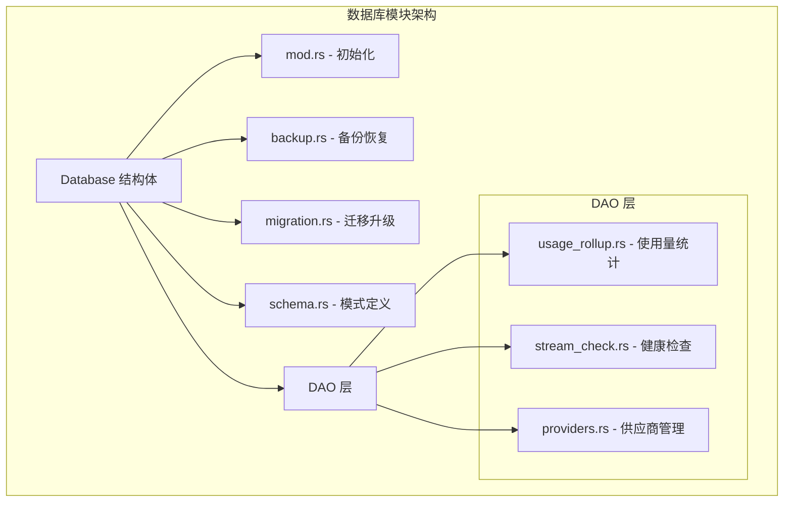
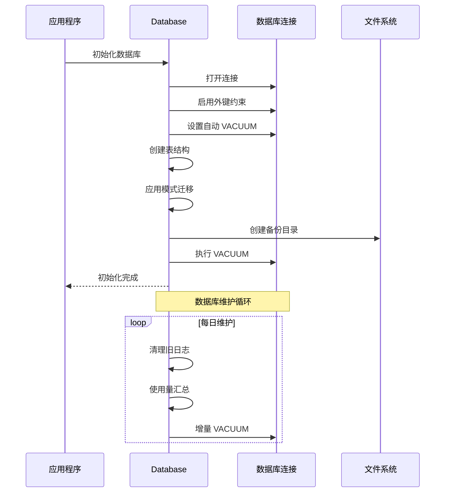
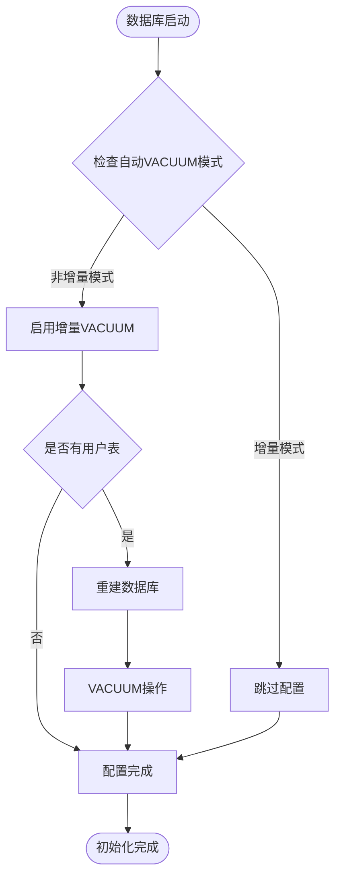
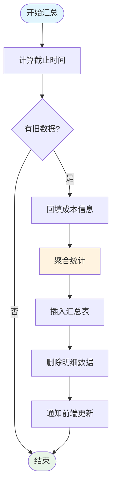
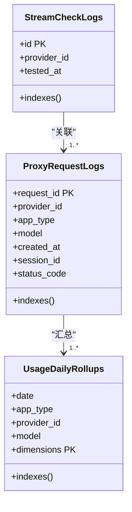
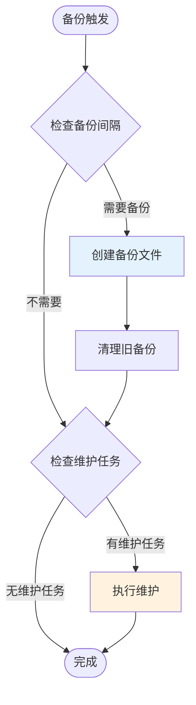
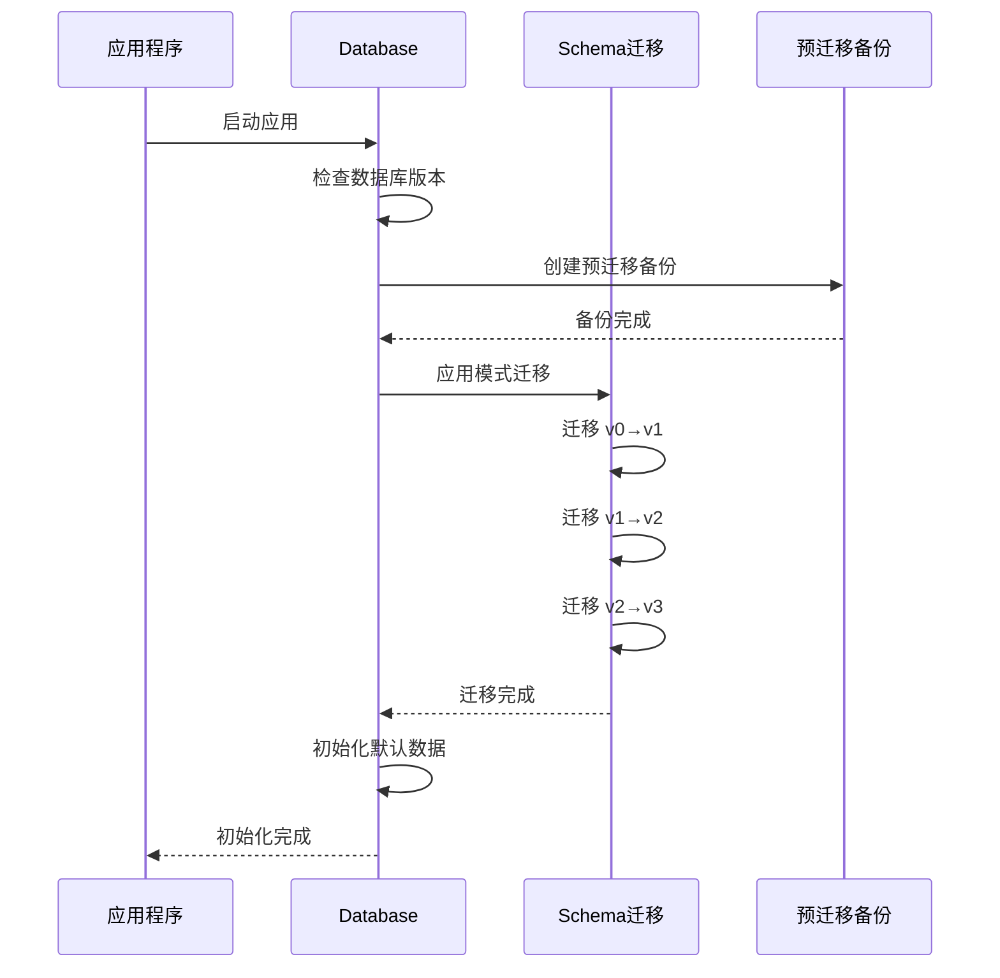
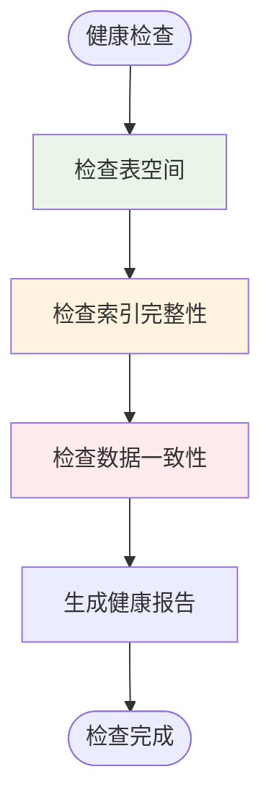
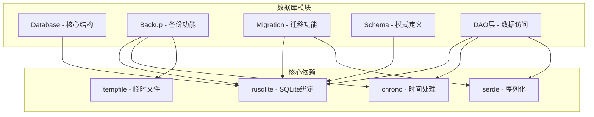

# 数据库维护任务

<cite>
**本文档引用的文件**
- [src-tauri/src/database/mod.rs](file://src-tauri/src/database/mod.rs)
- [src-tauri/src/database/backup.rs](file://src-tauri/src/database/backup.rs)
- [src-tauri/src/database/migration.rs](file://src-tauri/src/database/migration.rs)
- [src-tauri/src/database/schema.rs](file://src-tauri/src/database/schema.rs)
- [src-tauri/src/database/dao/usage_rollup.rs](file://src-tauri/src/database/dao/usage_rollup.rs)
- [src-tauri/src/database/dao/stream_check.rs](file://src-tauri/src/database/dao/stream_check.rs)
- [src-tauri/src/database/dao/providers.rs](file://src-tauri/src/database/dao/providers.rs)
</cite>

## 目录
1. [简介](#简介)
2. [项目结构](#项目结构)
3. [核心组件](#核心组件)
4. [架构概览](#架构概览)
5. [详细组件分析](#详细组件分析)
6. [依赖分析](#依赖分析)
7. [性能考虑](#性能考虑)
8. [故障排除指南](#故障排除指南)
9. [结论](#结论)

## 简介

CC Switch 的数据库维护任务涵盖了完整的数据库生命周期管理，包括 VACUUM 优化、ANALYZE 统计信息更新、索引重建、备份恢复、迁移升级、健康检查和性能调优。本文档详细说明了这些维护任务的执行策略和最佳实践。

## 项目结构

数据库模块采用分层架构设计：

**图表来源**
- [src-tauri/src/database/mod.rs:10-273](file://src-tauri/src/database/mod.rs#L10-L273)
- [src-tauri/src/database/backup.rs:1-861](file://src-tauri/src/database/backup.rs#L1-L861)

**章节来源**
- [src-tauri/src/database/mod.rs:10-273](file://src-tauri/src/database/mod.rs#L10-L273)

## 核心组件

### 数据库初始化与配置

Database 结构体提供了完整的数据库生命周期管理：

- **连接管理**: 使用 Mutex 包装 rusqlite::Connection，支持多线程环境
- **自动配置**: 启用外键约束和增量自动 VACUUM
- **版本管理**: SCHEMA_VERSION 常量定义当前数据库版本
- **安全钩子**: 注册数据库变更监听器

### 备份恢复系统

实现了完整的备份恢复机制：

- **全量备份**: 二进制数据库快照备份
- **增量备份**: 基于时间间隔的自动备份
- **导入导出**: SQL 文本格式的数据交换
- **WebDAV 同步**: 支持云端同步的特殊导出格式

**章节来源**
- [src-tauri/src/database/mod.rs:72-160](file://src-tauri/src/database/mod.rs#L72-L160)
- [src-tauri/src/database/backup.rs:45-164](file://src-tauri/src/database/backup.rs#L45-L164)

## 架构概览

**图表来源**
- [src-tauri/src/database/mod.rs:96-160](file://src-tauri/src/database/mod.rs#L96-L160)
- [src-tauri/src/database/backup.rs:235-295](file://src-tauri/src/database/backup.rs#L235-L295)

## 详细组件分析

### VACUUM 优化策略

#### 自动 VACUUM 配置

数据库启动时自动配置增量 VACUUM：

**图表来源**
- [src-tauri/src/database/mod.rs:182-253](file://src-tauri/src/database/mod.rs#L182-L253)

#### 增量 VACUUM 执行

维护任务中的增量 VACUUM：

- **触发条件**: 清理旧日志和使用量汇总后
- **执行时机**: 批量维护任务完成后
- **性能影响**: 最小化数据库锁定时间

**章节来源**
- [src-tauri/src/database/mod.rs:182-253](file://src-tauri/src/database/mod.rs#L182-L253)
- [src-tauri/src/database/backup.rs:287-292](file://src-tauri/src/database/backup.rs#L287-L292)

### ANALYZE 统计信息更新

#### 自动统计信息维护

数据库维护任务自动更新统计信息：

- **使用量汇总**: 将明细日志聚合到每日汇总表
- **日志清理**: 删除超过保留期的明细日志
- **统计优化**: 为查询优化器提供准确的统计信息

#### 使用量汇总算法

**图表来源**
- [src-tauri/src/database/dao/usage_rollup.rs:61-113](file://src-tauri/src/database/dao/usage_rollup.rs#L61-L113)

**章节来源**
- [src-tauri/src/database/dao/usage_rollup.rs:57-180](file://src-tauri/src/database/dao/usage_rollup.rs#L57-L180)

### 索引重建与优化

#### 索引维护策略

数据库模式定义中包含完整的索引策略：

- **请求日志索引**: 多列复合索引优化查询性能
- **健康检查索引**: 时间序列查询优化
- **表达式索引**: 支持复杂的查询条件

#### 索引创建策略

**图表来源**
- [src-tauri/src/database/schema.rs:183-284](file://src-tauri/src/database/schema.rs#L183-L284)

**章节来源**
- [src-tauri/src/database/schema.rs:183-284](file://src-tauri/src/database/schema.rs#L183-L284)

### 数据库备份与恢复

#### 备份策略

**图表来源**
- [src-tauri/src/database/backup.rs:235-295](file://src-tauri/src/database/backup.rs#L235-L295)

#### 备份文件管理

- **命名规则**: `db_backup_YYYYMMDD_HHMMSS.db`
- **保留策略**: 可配置的备份文件数量限制
- **原子操作**: 使用临时文件确保备份完整性

**章节来源**
- [src-tauri/src/database/backup.rs:297-367](file://src-tauri/src/database/backup.rs#L297-L367)

### 数据库迁移与升级

#### 迁移架构

**图表来源**
- [src-tauri/src/database/mod.rs:123-142](file://src-tauri/src/database/mod.rs#L123-L142)
- [src-tauri/src/database/schema.rs:366-470](file://src-tauri/src/database/schema.rs#L366-L470)

#### 迁移版本控制

- **版本常量**: SCHEMA_VERSION = 11
- **逐版本迁移**: 每个版本都有对应的迁移函数
- **回滚保护**: 使用 SAVEPOINT 确保迁移原子性

**章节来源**
- [src-tauri/src/database/schema.rs:366-470](file://src-tauri/src/database/schema.rs#L366-L470)

### 数据库健康检查

#### 健康检查机制

**图表来源**
- [src-tauri/src/database/backup.rs:369-384](file://src-tauri/src/database/backup.rs#L369-L384)

#### 日志清理策略

- **流式检查日志**: 7天保留期
- **使用量明细**: 30天保留期
- **自动清理**: 维护任务自动执行

**章节来源**
- [src-tauri/src/database/dao/stream_check.rs:52-66](file://src-tauri/src/database/dao/stream_check.rs#L52-L66)
- [src-tauri/src/database/dao/usage_rollup.rs:61-113](file://src-tauri/src/database/dao/usage_rollup.rs#L61-L113)

## 依赖分析

**图表来源**
- [src-tauri/src/database/mod.rs:44-58](file://src-tauri/src/database/mod.rs#L44-L58)

**章节来源**
- [src-tauri/src/database/mod.rs:44-58](file://src-tauri/src/database/mod.rs#L44-L58)

## 性能考虑

### 维护任务调度

数据库维护任务采用智能调度策略：

- **时间对齐**: 使用本地午夜边界对齐，确保统计数据准确性
- **批量处理**: 合并多个维护操作减少数据库锁定时间
- **条件执行**: 仅在有数据需要处理时执行维护操作

### 性能优化技术

- **增量 VACUUM**: 最小化磁盘空间浪费
- **表达式索引**: 支持复杂查询条件的高效执行
- **批量操作**: 减少数据库往返次数

## 故障排除指南

### 常见问题诊断

#### 备份失败排查

1. **权限检查**: 确认应用程序对配置目录有写权限
2. **磁盘空间**: 检查目标磁盘是否有足够空间
3. **文件锁定**: 确认数据库文件未被其他进程占用

#### 迁移失败处理

1. **预备份验证**: 确认预迁移备份成功创建
2. **版本检查**: 验证数据库版本与应用程序版本兼容
3. **回滚策略**: 使用预迁移备份恢复到迁移前状态

**章节来源**
- [src-tauri/src/database/backup.rs:102-147](file://src-tauri/src/database/backup.rs#L102-L147)
- [src-tauri/src/database/schema.rs:374-469](file://src-tauri/src/database/schema.rs#L374-L469)

### 错误处理机制

- **原子性保证**: 使用 SAVEPOINT 确保操作完整性
- **回滚支持**: 失败时自动回滚到操作前状态
- **日志记录**: 详细的错误日志便于问题诊断

## 结论

CC Switch 的数据库维护任务实现了企业级的数据库生命周期管理。通过智能的 VACUUM 优化、自动化的统计信息维护、完善的备份恢复机制和健壮的迁移升级策略，确保了数据库的高性能、高可用性和数据安全性。

关键优势包括：
- **自动化程度高**: 减少人工干预，降低运维成本
- **数据安全保障**: 多层次的备份和恢复机制
- **性能持续优化**: 自适应的维护策略保持最佳性能
- **兼容性强**: 完善的版本迁移支持平滑升级

这些维护任务为 CC Switch 提供了可靠的数据库基础设施，支持其作为桌面应用程序的长期稳定运行。