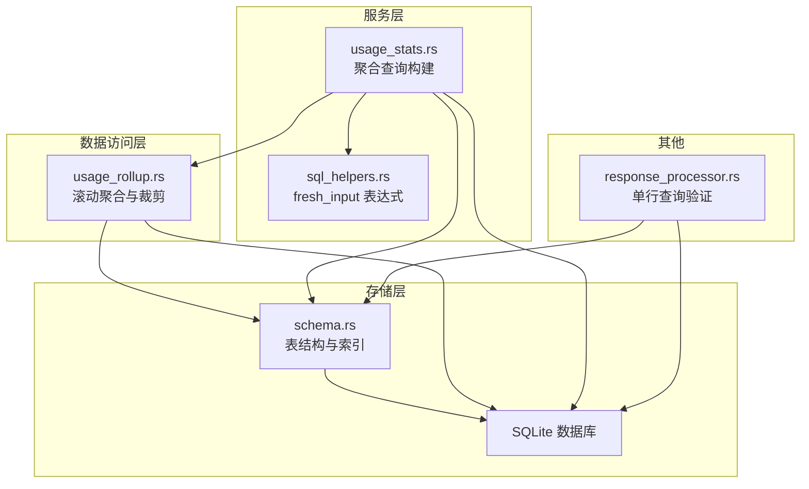
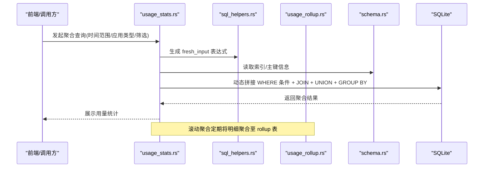
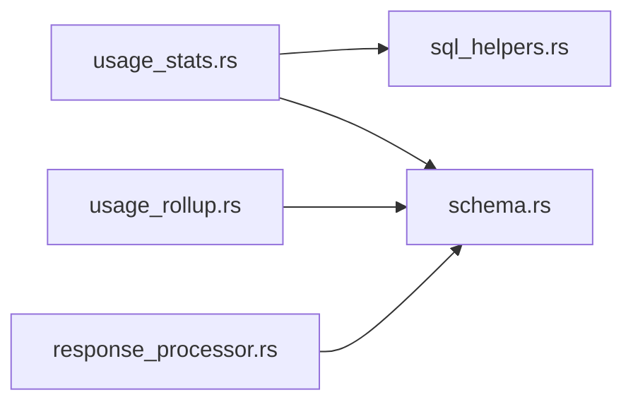

# SQL 查询优化

<cite>
**本文引用的文件**
- [usage_stats.rs](file://src-tauri/src/services/usage_stats.rs)
- [sql_helpers.rs](file://src-tauri/src/services/sql_helpers.rs)
- [usage_rollup.rs](file://src-tauri/src/database/dao/usage_rollup.rs)
- [schema.rs](file://src-tauri/src/database/schema.rs)
- [response_processor.rs](file://src-tauri/src/proxy/response_processor.rs)
- [tests.rs](file://src-tauri/src/database/tests.rs)
</cite>

## 目录
1. [简介](#简介)
2. [项目结构](#项目结构)
3. [核心组件](#核心组件)
4. [架构总览](#架构总览)
5. [详细组件分析](#详细组件分析)
6. [依赖分析](#依赖分析)
7. [性能考量](#性能考量)
8. [故障排查指南](#故障排查指南)
9. [结论](#结论)
10. [附录](#附录)

## 简介
本文件面向 CC Switch 的 SQL 查询优化，聚焦于 WHERE 条件优化、JOIN 操作优化、子查询与派生表优化、EXISTS/IN 优化、查询执行计划分析与性能瓶颈识别。通过对项目中实际使用的查询进行深入剖析，总结可复用的优化策略与最佳实践，帮助开发者在不改变业务逻辑的前提下提升查询性能。

## 项目结构
CC Switch 的数据库层采用 SQLite（rusqlite）实现，查询主要集中在“用量统计”服务模块，配合“滚动聚合”DAO 与“表结构定义”。关键文件如下：
- 用量统计服务：构建复杂聚合查询，包含 WHERE 动态拼接、LEFT JOIN、UNION、GROUP BY、COALESCE 等。
- SQL 辅助函数：提供“新鲜输入令牌”的统一计算表达式，确保跨供应商聚合一致性。
- 滚动聚合 DAO：负责将明细日志按天聚合至 rollup 表，并裁剪明细，减少在线查询压力。
- 表结构定义：包含索引与主键设计，直接影响查询性能。
- 响应处理：对单条记录的查询用于验证成本与倍率字段一致性。

**图表来源**
- [usage_stats.rs](file://src-tauri/src/services/usage_stats.rs)
- [sql_helpers.rs](file://src-tauri/src/services/sql_helpers.rs)
- [usage_rollup.rs](file://src-tauri/src/database/dao/usage_rollup.rs)
- [schema.rs](file://src-tauri/src/database/schema.rs)
- [response_processor.rs](file://src-tauri/src/proxy/response_processor.rs)

**章节来源**
- [usage_stats.rs](file://src-tauri/src/services/usage_stats.rs)
- [sql_helpers.rs](file://src-tauri/src/services/sql_helpers.rs)
- [usage_rollup.rs](file://src-tauri/src/database/dao/usage_rollup.rs)
- [schema.rs](file://src-tauri/src/database/schema.rs)
- [response_processor.rs](file://src-tauri/src/proxy/response_processor.rs)

## 核心组件
- 用量统计服务：动态构建 WHERE 条件、时间范围裁剪、跨源去重过滤、LEFT JOIN 供应商表、UNION 细分日志与滚动聚合、GROUP BY 聚合与排序。
- SQL 辅助函数：统一“新鲜输入令牌”计算，避免不同供应商统计口径差异导致的偏差。
- 滚动聚合 DAO：按本地午夜边界对明细日志进行聚合与裁剪，减少在线查询的数据量。
- 表结构与索引：明细表与聚合表的主键与索引设计，直接影响查询效率与并发能力。
- 单行查询验证：对特定字段进行单行查询以验证成本与倍率一致性。

**章节来源**
- [usage_stats.rs](file://src-tauri/src/services/usage_stats.rs)
- [sql_helpers.rs](file://src-tauri/src/services/sql_helpers.rs)
- [usage_rollup.rs](file://src-tauri/src/database/dao/usage_rollup.rs)
- [schema.rs](file://src-tauri/src/database/schema.rs)
- [response_processor.rs](file://src-tauri/src/proxy/response_processor.rs)

## 架构总览
查询优化贯穿“服务层 -> 数据访问层 -> 存储层”，核心优化点包括：
- WHERE 条件动态拼接与谓词下推，尽量将过滤条件下推到最靠近数据源的位置。
- JOIN 顺序与连接算法：优先使用索引列作为连接键，避免隐式转换与函数包裹。
- 子查询与派生表：通过 UNION 合并明细与聚合，减少多次扫描。
- EXISTS/IN 优化：使用 EXISTS 替代 IN，避免大列表扫描。
- 执行计划分析：结合 SQLite 的 EXPLAIN QUERY PLAN（或等效手段）定位瓶颈。

**图表来源**
- [usage_stats.rs](file://src-tauri/src/services/usage_stats.rs)
- [sql_helpers.rs](file://src-tauri/src/services/sql_helpers.rs)
- [usage_rollup.rs](file://src-tauri/src/database/dao/usage_rollup.rs)
- [schema.rs](file://src-tauri/src/database/schema.rs)

## 详细组件分析

### WHERE 条件优化
- 动态拼接：根据传入参数（开始时间、结束时间、应用类型、状态码、提供商名称、模型名）动态生成 WHERE 条件，避免不必要的列扫描。
- 谓词下推：将时间范围与应用类型过滤尽可能提前，减少 JOIN 与聚合的数据量。
- 跨源去重：通过 effective_usage_log_filter 生成的表达式，排除会话日志与代理日志的重复项，减少冗余计算。

优化要点
- 使用索引列作为过滤条件（如 created_at、app_type、status_code、provider_id）。
- 避免在 WHERE 中对列使用函数或通配符（LIKE '%...%'），必要时改用前缀匹配或覆盖索引。
- 对可选参数进行短路判断，避免生成恒真条件。

**章节来源**
- [usage_stats.rs](file://src-tauri/src/services/usage_stats.rs)
- [schema.rs](file://src-tauri/src/database/schema.rs)

### JOIN 操作优化
- 连接顺序：在聚合查询中，明细表与供应商表通过 LEFT JOIN 连接，连接键为 provider_id 与 app_type，确保即使明细表中存在占位符也能正确映射。
- 连接算法：优先使用索引列（provider_id + app_type）作为连接键，避免隐式类型转换与函数包裹。
- 嵌套循环连接规避：通过合适的索引与连接键，降低嵌套循环的概率，提高 JOIN 性能。

优化要点
- 保证连接键具备索引（schema 中已为明细表创建多处索引）。
- 避免在连接键上使用函数或别名，直接使用原始列。
- 对连接结果进行必要的投影（只选择需要的列），减少中间结果集大小。

**章节来源**
- [usage_stats.rs](file://src-tauri/src/services/usage_stats.rs)
- [schema.rs](file://src-tauri/src/database/schema.rs)

### 子查询与派生表优化
- 子查询去重：通过 EXISTS 子查询判断是否存在对应的代理日志，避免重复插入与重复统计。
- 派生表合并：使用 UNION 合并明细日志与滚动聚合表，统一口径进行聚合，减少多次扫描。
- 分组键设计：在 UNION 的两部分分别 GROUP BY，最终再整体聚合，确保统计口径一致。

优化要点
- EXISTS 优于 IN：当子查询返回大量数据时，EXISTS 更高效。
- UNION ALL 优于 UNION：在已知无重复的情况下使用 UNION ALL，减少去重成本。
- 合理使用 COALESCE 与 CASE 表达式，避免在 WHERE 中对列使用函数。

**章节来源**
- [usage_stats.rs](file://src-tauri/src/services/usage_stats.rs)

### EXISTS/IN 优化
- EXISTS 用于判断是否存在满足条件的记录，避免 IN 子句的大列表扫描。
- 在跨源去重场景中，使用 EXISTS 子查询匹配时间窗口内的代理日志，显著降低重复统计风险。

优化要点
- 将 IN 改写为 EXISTS，尤其是当子查询结果集较大时。
- 确保子查询中的过滤条件与外层查询的连接键一致，便于索引利用。

**章节来源**
- [usage_stats.rs](file://src-tauri/src/services/usage_stats.rs)

### 查询执行计划分析与性能瓶颈识别
- 执行计划：建议在 SQLite 中使用 EXPLAIN QUERY PLAN 或等效手段查看查询计划，关注以下指标：
  - 是否使用索引（避免全表扫描）。
  - JOIN 顺序与连接算法（避免嵌套循环）。
  - WHERE 条件是否被有效下推（减少中间结果集）。
  - GROUP BY 与 ORDER BY 的代价。
- 性能瓶颈识别：
  - 大量 LIKE '%keyword%' 会导致索引失效，应改为前缀匹配或全文检索。
  - 频繁的函数包裹在 WHERE 中会阻止索引使用，应考虑物化列或覆盖索引。
  - 大 UNION 场景需评估内存与临时表使用情况。

**章节来源**
- [usage_stats.rs](file://src-tauri/src/services/usage_stats.rs)
- [schema.rs](file://src-tauri/src/database/schema.rs)

## 依赖分析
- usage_stats.rs 依赖 sql_helpers.rs 提供的 fresh_input 表达式，确保不同供应商的统计口径一致。
- usage_stats.rs 依赖 schema.rs 中的表结构与索引定义，保证 WHERE 条件与 JOIN 键能够命中索引。
- usage_rollup.rs 依赖 schema.rs 中的主键设计，确保 INSERT OR REPLACE 与 DELETE 的原子性与一致性。
- response_processor.rs 依赖 schema.rs 中的表结构，进行单行查询验证。

**图表来源**
- [usage_stats.rs](file://src-tauri/src/services/usage_stats.rs)
- [sql_helpers.rs](file://src-tauri/src/services/sql_helpers.rs)
- [usage_rollup.rs](file://src-tauri/src/database/dao/usage_rollup.rs)
- [schema.rs](file://src-tauri/src/database/schema.rs)
- [response_processor.rs](file://src-tauri/src/proxy/response_processor.rs)

**章节来源**
- [usage_stats.rs](file://src-tauri/src/services/usage_stats.rs)
- [sql_helpers.rs](file://src-tauri/src/services/sql_helpers.rs)
- [usage_rollup.rs](file://src-tauri/src/database/dao/usage_rollup.rs)
- [schema.rs](file://src-tauri/src/database/schema.rs)
- [response_processor.rs](file://src-tauri/src/proxy/response_processor.rs)

## 性能考量
- 索引利用：明细表已创建多处索引（provider_id、created_at、model、session_id、status_code），建议在 WHERE 中优先使用这些列。
- 滚动聚合：通过 usage_rollup.rs 将历史明细按天聚合，显著减少在线查询的数据量，建议定期运行聚合与裁剪任务。
- 统一口径：通过 sql_helpers.rs 的 fresh_input 表达式统一“新鲜输入令牌”计算，避免不同供应商统计口径差异导致的额外计算。
- 并发与原子性：滚动聚合使用 SAVEPOINT 保证原子性，避免长时间锁表影响查询性能。

**章节来源**
- [schema.rs](file://src-tauri/src/database/schema.rs)
- [usage_rollup.rs](file://src-tauri/src/database/dao/usage_rollup.rs)
- [sql_helpers.rs](file://src-tauri/src/services/sql_helpers.rs)

## 故障排查指南
- 单行查询验证：通过 response_processor.rs 中的单行查询验证 total_cost_usd 与 cost_multiplier 的一致性，快速定位计费相关问题。
- 滚动聚合异常：若发现统计异常，检查 usage_rollup.rs 的聚合与裁剪逻辑，确认是否成功回填成本与删除明细。
- 执行计划异常：使用 EXPLAIN QUERY PLAN 检查 WHERE 条件是否被有效下推，JOIN 是否命中索引，是否存在全表扫描。

**章节来源**
- [response_processor.rs](file://src-tauri/src/proxy/response_processor.rs)
- [usage_rollup.rs](file://src-tauri/src/database/dao/usage_rollup.rs)
- [usage_stats.rs](file://src-tauri/src/services/usage_stats.rs)

## 结论
通过对 CC Switch 的查询实现进行系统性分析，可以总结出以下优化主线：
- WHERE 条件动态拼接与谓词下推，优先使用索引列。
- JOIN 顺序与连接键设计，避免嵌套循环连接。
- 子查询与派生表合并，使用 EXISTS 替代 IN，减少重复扫描。
- 统一统计口径，确保跨供应商聚合的一致性。
- 借助滚动聚合与索引设计，显著降低在线查询压力。

## 附录
- 示例 SQL 优化思路（不展示具体代码，仅描述优化方向）
  - 将 LIKE '%keyword%' 改为 LIKE 'keyword%'，并确保前缀列有索引。
  - 将 IN 改写为 EXISTS，减少大列表扫描。
  - 将复杂 WHERE 条件下推到 JOIN 之前，减少中间结果集。
  - 使用 COALESCE 与 CASE 表达式替代 WHERE 中的函数包裹。
  - 通过 UNION ALL 合并明细与聚合，减少多次扫描。

**章节来源**
- [usage_stats.rs](file://src-tauri/src/services/usage_stats.rs)
- [schema.rs](file://src-tauri/src/database/schema.rs)
- [usage_rollup.rs](file://src-tauri/src/database/dao/usage_rollup.rs)
- [sql_helpers.rs](file://src-tauri/src/services/sql_helpers.rs)
- [response_processor.rs](file://src-tauri/src/proxy/response_processor.rs)
- [tests.rs](file://src-tauri/src/database/tests.rs)