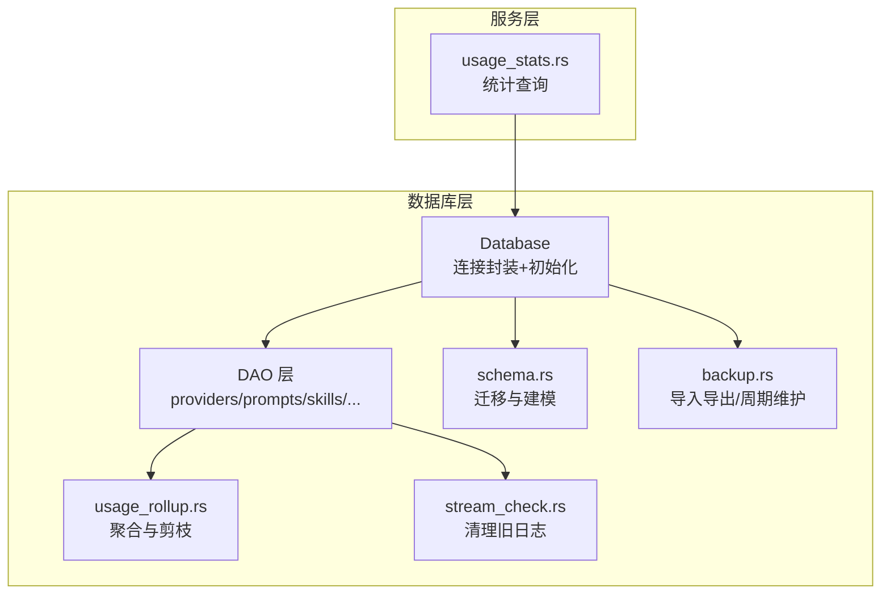
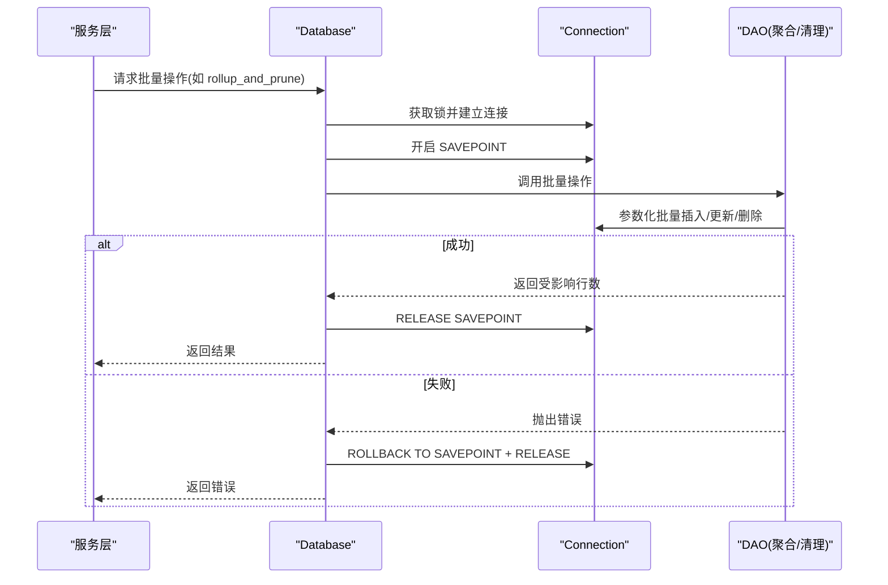
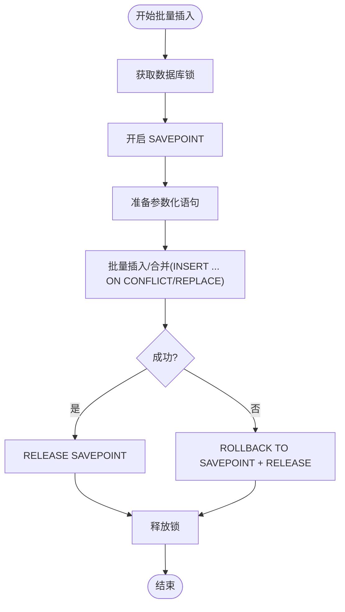
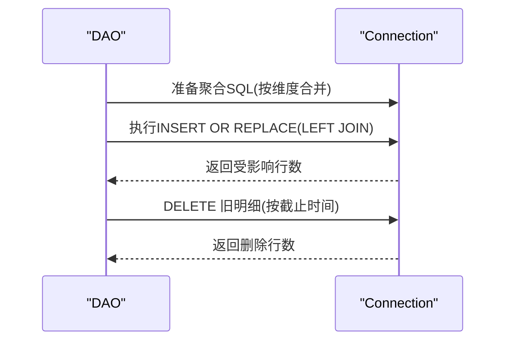
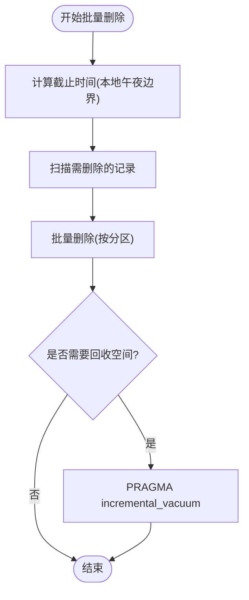
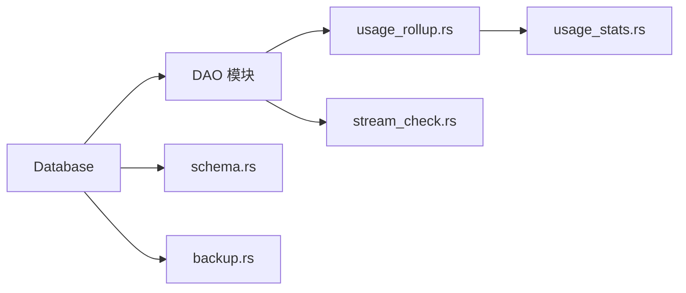

# 批量操作优化

<cite>
**本文引用的文件**
- [src-tauri/src/database/mod.rs](file://src-tauri/src/database/mod.rs)
- [src-tauri/src/database/dao/mod.rs](file://src-tauri/src/database/dao/mod.rs)
- [src-tauri/src/database/dao/usage_rollup.rs](file://src-tauri/src/database/dao/usage_rollup.rs)
- [src-tauri/src/database/dao/stream_check.rs](file://src-tauri/src/database/dao/stream_check.rs)
- [src-tauri/src/database/schema.rs](file://src-tauri/src/database/schema.rs)
- [src-tauri/src/database/backup.rs](file://src-tauri/src/database/backup.rs)
- [src-tauri/src/services/usage_stats.rs](file://src-tauri/src/services/usage_stats.rs)
</cite>

## 目录
1. [简介](#简介)
2. [项目结构](#项目结构)
3. [核心组件](#核心组件)
4. [架构总览](#架构总览)
5. [详细组件分析](#详细组件分析)
6. [依赖分析](#依赖分析)
7. [性能考量](#性能考量)
8. [故障排查指南](#故障排查指南)
9. [结论](#结论)
10. [附录](#附录)

## 简介
本文件聚焦 CC Switch 在数据库层面的“批量操作优化”，围绕以下目标展开：
- 批量插入优化：事务批处理、参数化查询、批量大小调优
- 批量更新优化：条件批量更新、索引维护与锁竞争降低
- 批量删除优化：分区删除、软删除策略、垃圾回收
- 大数据量场景下的最佳实践与错误处理策略
- 提供具体实现示例与性能建议（基于仓库现有实现）

## 项目结构
数据库相关代码主要集中在 Rust 后端模块，采用 DAO 层封装与统一的 Database 封装，配合迁移与备份工具链，形成可维护的批量操作基础设施。

图示来源
- [src-tauri/src/database/mod.rs:92-160](file://src-tauri/src/database/mod.rs#L92-L160)
- [src-tauri/src/database/dao/mod.rs:1-20](file://src-tauri/src/database/dao/mod.rs#L1-L20)
- [src-tauri/src/database/dao/usage_rollup.rs:57-113](file://src-tauri/src/database/dao/usage_rollup.rs#L57-L113)
- [src-tauri/src/database/dao/stream_check.rs:51-66](file://src-tauri/src/database/dao/stream_check.rs#L51-L66)
- [src-tauri/src/database/schema.rs:1234-1271](file://src-tauri/src/database/schema.rs#L1234-L1271)
- [src-tauri/src/database/backup.rs:269-295](file://src-tauri/src/database/backup.rs#L269-L295)
- [src-tauri/src/services/usage_stats.rs:640-702](file://src-tauri/src/services/usage_stats.rs#L640-L702)

章节来源
- [src-tauri/src/database/mod.rs:1-273](file://src-tauri/src/database/mod.rs#L1-L273)
- [src-tauri/src/database/dao/mod.rs:1-20](file://src-tauri/src/database/dao/mod.rs#L1-L20)

## 核心组件
- Database：封装 SQLite 连接、初始化、迁移、自动清理与增量收缩等
- DAO：按领域划分的数据访问对象，统一通过 Database 实现批量操作
- usage_rollup：批量聚合明细日志并删除已归档记录
- stream_check：定期清理过期健康检查日志
- schema：表结构与版本迁移，确保批量操作的结构基础
- backup：导入导出与周期性维护，保障批量操作后的空间回收

章节来源
- [src-tauri/src/database/mod.rs:72-160](file://src-tauri/src/database/mod.rs#L72-L160)
- [src-tauri/src/database/dao/usage_rollup.rs:57-113](file://src-tauri/src/database/dao/usage_rollup.rs#L57-L113)
- [src-tauri/src/database/dao/stream_check.rs:51-66](file://src-tauri/src/database/dao/stream_check.rs#L51-L66)
- [src-tauri/src/database/schema.rs:1234-1271](file://src-tauri/src/database/schema.rs#L1234-L1271)
- [src-tauri/src/database/backup.rs:269-295](file://src-tauri/src/database/backup.rs#L269-L295)

## 架构总览
批量操作在 CC Switch 中遵循“统一入口 + DAO 分域 + 事务保护 + 周期维护”的架构：
- 统一入口：Database 提供连接、锁、迁移与维护能力
- DAO 分域：各领域 DAO 负责具体批量操作（聚合、清理、导入）
- 事务保护：使用 SAVEPOINT 保证批量操作原子性
- 周期维护：定时执行清理与增量收缩，释放磁盘空间

图示来源
- [src-tauri/src/database/dao/usage_rollup.rs:87-113](file://src-tauri/src/database/dao/usage_rollup.rs#L87-L113)
- [src-tauri/src/database/mod.rs:61-70](file://src-tauri/src/database/mod.rs#L61-L70)

## 详细组件分析

### 批量插入优化：事务批处理、参数化查询与批量大小调优
- 事务批处理
  - 使用 SAVEPOINT 保证批量插入/更新/删除的原子性，失败时回滚至保存点并释放，避免部分提交导致的数据不一致。
  - 示例路径：[事务与保存点:87-113](file://src-tauri/src/database/dao/usage_rollup.rs#L87-L113)
- 参数化查询
  - 所有批量写入均使用参数化语句，避免字符串拼接引发的注入风险与解析开销。
  - 示例路径：[参数化插入:18-40](file://src-tauri/src/database/dao/stream_check.rs#L18-L40)
- 批量大小调优
  - 通过分段处理与分页扫描控制单次批量规模，结合“按本地午夜边界对齐”的截止时间，避免一次性处理过多行导致锁争用与内存峰值。
  - 示例路径：[截止时间计算与分段:11-55](file://src-tauri/src/database/dao/usage_rollup.rs#L11-L55)

图示来源
- [src-tauri/src/database/dao/usage_rollup.rs:115-179](file://src-tauri/src/database/dao/usage_rollup.rs#L115-L179)
- [src-tauri/src/database/dao/stream_check.rs:18-40](file://src-tauri/src/database/dao/stream_check.rs#L18-L40)

章节来源
- [src-tauri/src/database/dao/usage_rollup.rs:115-179](file://src-tauri/src/database/dao/usage_rollup.rs#L115-L179)
- [src-tauri/src/database/dao/stream_check.rs:18-40](file://src-tauri/src/database/dao/stream_check.rs#L18-L40)

### 批量更新优化：条件批量更新、索引维护与锁竞争减少
- 条件批量更新
  - 使用 LEFT JOIN + INSERT OR REPLACE 实现“按维度合并”更新，避免逐行 UPDATE 带来的锁竞争与日志放大。
  - 示例路径：[按维度合并更新:121-164](file://src-tauri/src/database/dao/usage_rollup.rs#L121-L164)
- 索引维护
  - 通过“按本地午夜边界对齐”的截止时间，减少跨日期边界的大范围扫描，降低索引扫描成本。
  - 示例路径：[截止时间对齐:19-55](file://src-tauri/src/database/dao/usage_rollup.rs#L19-L55)
- 锁竞争减少
  - 使用 SAVEPOINT 与分段处理，缩短持有排他锁的时间；批量完成后立即释放，降低并发冲突概率。
  - 示例路径：[事务保护与释放:87-113](file://src-tauri/src/database/dao/usage_rollup.rs#L87-L113)

图示来源
- [src-tauri/src/database/dao/usage_rollup.rs:115-179](file://src-tauri/src/database/dao/usage_rollup.rs#L115-L179)

章节来源
- [src-tauri/src/database/dao/usage_rollup.rs:115-179](file://src-tauri/src/database/dao/usage_rollup.rs#L115-L179)

### 批量删除优化：分区删除、软删除策略与垃圾回收
- 分区删除
  - 基于时间分区（本地午夜边界）进行批量删除，避免全表扫描与长事务。
  - 示例路径：[按截止时间删除:171-176](file://src-tauri/src/database/dao/usage_rollup.rs#L171-L176)
- 软删除策略
  - 对于需要审计或可恢复的记录，优先采用状态字段标记而非物理删除；本项目中未见软删除实现，主要采用物理删除与归档。
  - 示例路径：[健康检查日志清理:51-66](file://src-tauri/src/database/dao/stream_check.rs#L51-L66)
- 垃圾回收
  - 周期性维护：清理过期日志 + 执行增量收缩，释放磁盘空间。
  - 示例路径：[周期维护与增量收缩:269-295](file://src-tauri/src/database/backup.rs#L269-L295)

图示来源
- [src-tauri/src/database/dao/usage_rollup.rs:61-179](file://src-tauri/src/database/dao/usage_rollup.rs#L61-L179)
- [src-tauri/src/database/dao/stream_check.rs:51-66](file://src-tauri/src/database/dao/stream_check.rs#L51-L66)
- [src-tauri/src/database/backup.rs:287-292](file://src-tauri/src/database/backup.rs#L287-L292)

章节来源
- [src-tauri/src/database/dao/usage_rollup.rs:61-179](file://src-tauri/src/database/dao/usage_rollup.rs#L61-L179)
- [src-tauri/src/database/dao/stream_check.rs:51-66](file://src-tauri/src/database/dao/stream_check.rs#L51-L66)
- [src-tauri/src/database/backup.rs:269-295](file://src-tauri/src/database/backup.rs#L269-L295)

### 大数据量场景下的批量操作最佳实践
- 控制批次大小
  - 依据“截止时间对齐 + 分段扫描”策略，避免单次处理过多行；必要时可引入分页游标或分桶策略。
  - 参考路径：[截止时间与分段:19-55](file://src-tauri/src/database/dao/usage_rollup.rs#L19-L55)
- 降低锁竞争
  - 使用 SAVEPOINT + 短事务 + 批量提交，减少排他锁持有时间；避免在批量过程中执行长时间 IO 或网络请求。
  - 参考路径：[事务保护:87-113](file://src-tauri/src/database/dao/usage_rollup.rs#L87-L113)
- 参数化与预编译
  - 所有批量写入使用参数化语句，减少 SQL 解析与编译开销。
  - 参考路径：[参数化写入:18-40](file://src-tauri/src/database/dao/stream_check.rs#L18-L40)
- 统计查询与批量联动
  - 批量操作后触发统计刷新，确保前端展示与后端数据一致。
  - 参考路径：[批量后通知统计刷新:97-104](file://src-tauri/src/database/dao/usage_rollup.rs#L97-L104)

章节来源
- [src-tauri/src/database/dao/usage_rollup.rs:19-55](file://src-tauri/src/database/dao/usage_rollup.rs#L19-L55)
- [src-tauri/src/database/dao/usage_rollup.rs:87-113](file://src-tauri/src/database/dao/usage_rollup.rs#L87-L113)
- [src-tauri/src/database/dao/stream_check.rs:18-40](file://src-tauri/src/database/dao/stream_check.rs#L18-L40)
- [src-tauri/src/database/dao/usage_rollup.rs:97-104](file://src-tauri/src/database/dao/usage_rollup.rs#L97-L104)

### 错误处理策略
- 原子性与回滚
  - 批量操作失败时，使用 ROLLBACK TO SAVEPOINT + RELEASE 保证状态一致性。
  - 参考路径：[失败回滚:107-112](file://src-tauri/src/database/dao/usage_rollup.rs#L107-L112)
- 告警与降级
  - 关键流程（如预回填、周期维护）失败仅记录告警，不阻断主流程，确保系统可用性。
  - 参考路径：[预回填告警:83-85](file://src-tauri/src/database/dao/usage_rollup.rs#L83-L85)
- 并发安全
  - 使用 lock_conn 宏获取互斥锁，避免多线程并发访问导致的竞态。
  - 参考路径：[锁获取:61-70](file://src-tauri/src/database/mod.rs#L61-L70)

章节来源
- [src-tauri/src/database/dao/usage_rollup.rs:83-85](file://src-tauri/src/database/dao/usage_rollup.rs#L83-L85)
- [src-tauri/src/database/dao/usage_rollup.rs:107-112](file://src-tauri/src/database/dao/usage_rollup.rs#L107-L112)
- [src-tauri/src/database/mod.rs:61-70](file://src-tauri/src/database/mod.rs#L61-L70)

## 依赖分析
- DAO 层依赖 Database 的连接与锁封装，统一通过 SAVEPOINT 保证批量操作原子性
- usage_rollup 依赖 effective_usage_log_filter 等辅助函数，确保统计口径一致
- backup 依赖 periodic_maintenance 驱动清理与收缩
- schema 提供表结构与迁移，支撑批量操作的稳定性

图示来源
- [src-tauri/src/database/dao/mod.rs:1-20](file://src-tauri/src/database/dao/mod.rs#L1-L20)
- [src-tauri/src/database/dao/usage_rollup.rs:57-113](file://src-tauri/src/database/dao/usage_rollup.rs#L57-L113)
- [src-tauri/src/database/dao/stream_check.rs:51-66](file://src-tauri/src/database/dao/stream_check.rs#L51-L66)
- [src-tauri/src/database/schema.rs:1234-1271](file://src-tauri/src/database/schema.rs#L1234-L1271)
- [src-tauri/src/database/backup.rs:269-295](file://src-tauri/src/database/backup.rs#L269-L295)
- [src-tauri/src/services/usage_stats.rs:640-702](file://src-tauri/src/services/usage_stats.rs#L640-L702)

章节来源
- [src-tauri/src/database/dao/mod.rs:1-20](file://src-tauri/src/database/dao/mod.rs#L1-L20)
- [src-tauri/src/database/dao/usage_rollup.rs:57-113](file://src-tauri/src/database/dao/usage_rollup.rs#L57-L113)
- [src-tauri/src/database/dao/stream_check.rs:51-66](file://src-tauri/src/database/dao/stream_check.rs#L51-L66)
- [src-tauri/src/database/schema.rs:1234-1271](file://src-tauri/src/database/schema.rs#L1234-L1271)
- [src-tauri/src/database/backup.rs:269-295](file://src-tauri/src/database/backup.rs#L269-L295)
- [src-tauri/src/services/usage_stats.rs:640-702](file://src-tauri/src/services/usage_stats.rs#L640-L702)

## 性能考量
- 批量写入
  - 使用参数化语句与事务批处理，显著降低解析与日志开销
  - 参考路径：[参数化写入:18-40](file://src-tauri/src/database/dao/stream_check.rs#L18-L40)
- 聚合与合并
  - INSERT OR REPLACE + LEFT JOIN 的合并策略，避免多次 UPDATE，提升吞吐
  - 参考路径：[合并更新:121-164](file://src-tauri/src/database/dao/usage_rollup.rs#L121-L164)
- 时间分区与截止时间
  - 本地午夜边界对齐减少扫描范围，降低锁持有时间
  - 参考路径：[截止时间对齐:19-55](file://src-tauri/src/database/dao/usage_rollup.rs#L19-L55)
- 空间回收
  - 周期性增量收缩，避免碎片堆积影响后续批量性能
  - 参考路径：[增量收缩:287-292](file://src-tauri/src/database/backup.rs#L287-L292)

## 故障排查指南
- 批量操作失败
  - 检查 SAVEPOINT 是否正确释放；查看回滚日志定位失败点
  - 参考路径：[失败回滚与释放:107-112](file://src-tauri/src/database/dao/usage_rollup.rs#L107-L112)
- 数据不一致或重复
  - 确认合并逻辑是否正确（LEFT JOIN + REPLACE）；核对维度字段（日期/应用类型/提供商/模型/别名/计价模型）
  - 参考路径：[合并维度:121-164](file://src-tauri/src/database/dao/usage_rollup.rs#L121-L164)
- 磁盘空间未释放
  - 确认周期维护是否执行；检查增量收缩是否成功
  - 参考路径：[周期维护与收缩:269-295](file://src-tauri/src/database/backup.rs#L269-L295)
- 并发冲突
  - 检查锁获取是否成功；确认批量事务时长是否过长
  - 参考路径：[锁获取:61-70](file://src-tauri/src/database/mod.rs#L61-L70)

章节来源
- [src-tauri/src/database/dao/usage_rollup.rs:107-112](file://src-tauri/src/database/dao/usage_rollup.rs#L107-L112)
- [src-tauri/src/database/dao/usage_rollup.rs:121-164](file://src-tauri/src/database/dao/usage_rollup.rs#L121-L164)
- [src-tauri/src/database/backup.rs:269-295](file://src-tauri/src/database/backup.rs#L269-L295)
- [src-tauri/src/database/mod.rs:61-70](file://src-tauri/src/database/mod.rs#L61-L70)

## 结论
CC Switch 的批量操作优化以“事务批处理 + 参数化查询 + 时间分区 + 周期维护”为核心，通过 SAVEPOINT 保证原子性，通过维度合并减少锁竞争，通过增量收缩维持长期性能稳定。该方案在大数据量场景下具备良好的扩展性与可靠性，适合进一步推广到其他批量写入场景。

## 附录
- 表结构与迁移
  - 通过 schema.rs 的迁移逻辑，确保批量操作所需的表结构与索引维度保持一致
  - 参考路径：[迁移与重建:1234-1271](file://src-tauri/src/database/schema.rs#L1234-L1271)
- 统计查询与批量联动
  - 批量操作后触发统计刷新，确保前端展示与后端数据一致
  - 参考路径：[统计查询与通知:640-702](file://src-tauri/src/services/usage_stats.rs#L640-L702)

章节来源
- [src-tauri/src/database/schema.rs:1234-1271](file://src-tauri/src/database/schema.rs#L1234-L1271)
- [src-tauri/src/services/usage_stats.rs:640-702](file://src-tauri/src/services/usage_stats.rs#L640-L702)