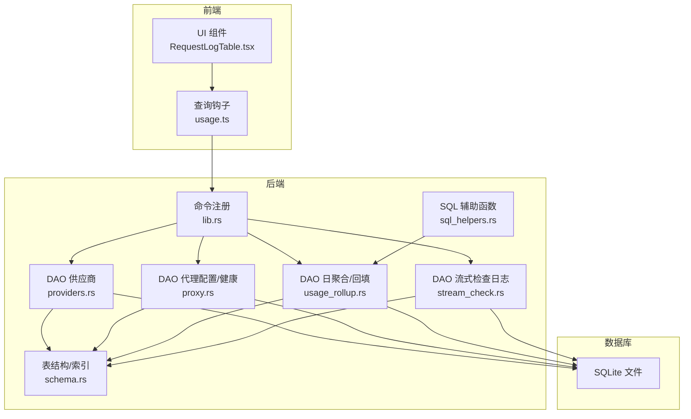
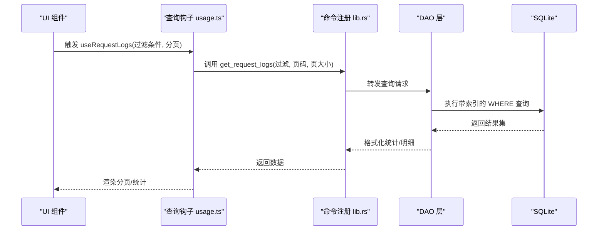
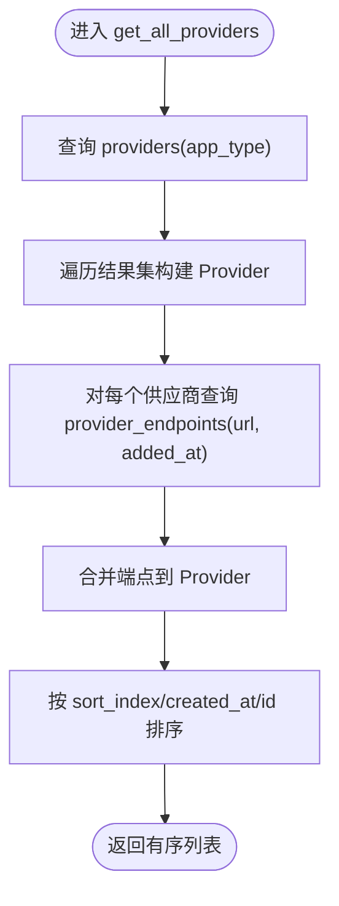
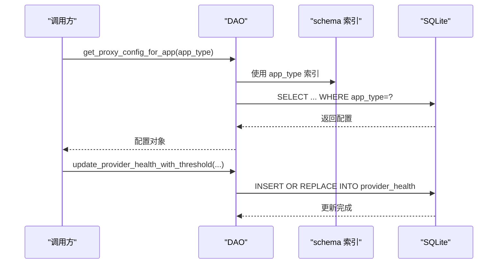
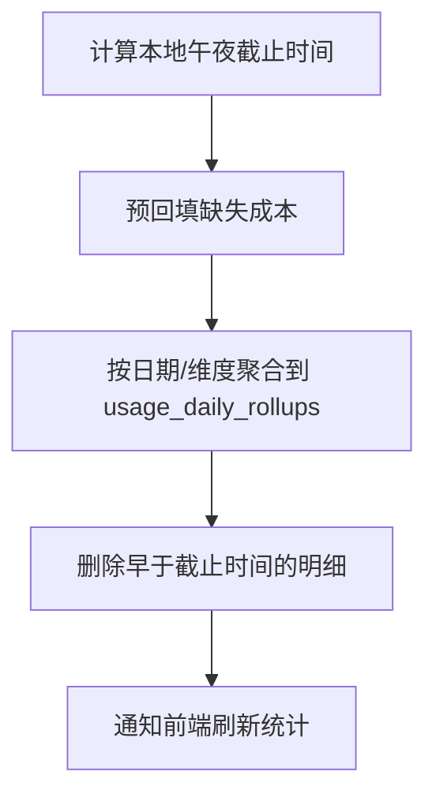
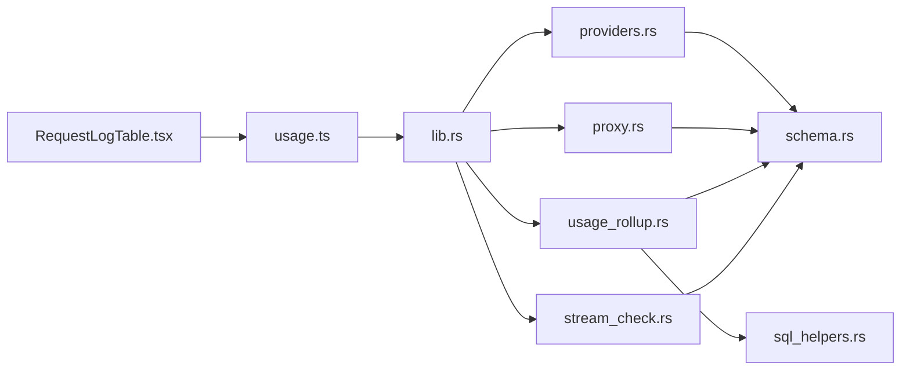

# 查询优化

<cite>
**本文引用的文件**
- [schema.rs](file://src-tauri/src/database/schema.rs)
- [providers.rs](file://src-tauri/src/database/dao/providers.rs)
- [usage_rollup.rs](file://src-tauri/src/database/dao/usage_rollup.rs)
- [proxy.rs](file://src-tauri/src/database/dao/proxy.rs)
- [stream_check.rs](file://src-tauri/src/database/dao/stream_check.rs)
- [sql_helpers.rs](file://src-tauri/src/services/sql_helpers.rs)
- [lib.rs](file://src-tauri/src/lib.rs)
- [RequestLogTable.tsx](file://src/components/usage/RequestLogTable.tsx)
- [usage.ts](file://src/lib/query/usage.ts)
- [response_processor.rs](file://src-tauri/src/proxy/response_processor.rs)
- [backup.rs](file://src-tauri/src/database/backup.rs)
- [tests.rs](file://src-tauri/src/database/tests.rs)
</cite>

## 目录
1. [简介](#简介)
2. [项目结构](#项目结构)
3. [核心组件](#核心组件)
4. [架构总览](#架构总览)
5. [详细组件分析](#详细组件分析)
6. [依赖分析](#依赖分析)
7. [性能考量](#性能考量)
8. [故障排查指南](#故障排查指南)
9. [结论](#结论)
10. [附录](#附录)

## 简介
本文件聚焦 CC Switch 的数据库查询优化，系统性梳理 SQL 查询语句优化技巧（WHERE 条件、JOIN、子查询）、查询计划分析方法（EXPLAIN QUERY PLAN 的使用与瓶颈识别）、高频查询模式（统计查询、供应商列表查询、代理配置查询）、批量操作优化策略（批量插入/更新/删除最佳实践）、查询缓存与结果集优化技巧，以及大数据量场景下的分页、延迟加载与预加载策略。文档同时结合代码库中的实际实现，给出可落地的优化建议与可视化图示。

## 项目结构
CC Switch 的数据库层采用 Rust + SQLite 实现，核心模块包括：
- 数据库初始化与表结构定义：schema.rs
- DAO 层：providers.rs、proxy.rs、usage_rollup.rs、stream_check.rs 等
- 查询辅助工具：sql_helpers.rs
- 前端查询钩子：usage.ts
- UI 层分页与过滤：RequestLogTable.tsx
- 关键运行时使用点：lib.rs（命令注册）、response_processor.rs（运行期查询）、backup.rs（导入导出统计）

图表来源
- [lib.rs:1301-1332](file://src-tauri/src/lib.rs#L1301-L1332)
- [providers.rs:1-109](file://src-tauri/src/database/dao/providers.rs#L1-L109)
- [proxy.rs:55-402](file://src-tauri/src/database/dao/proxy.rs#L55-L402)
- [usage_rollup.rs:57-180](file://src-tauri/src/database/dao/usage_rollup.rs#L57-L180)
- [stream_check.rs:1-75](file://src-tauri/src/database/dao/stream_check.rs#L1-L75)
- [schema.rs:18-364](file://src-tauri/src/database/schema.rs#L18-L364)
- [sql_helpers.rs:1-135](file://src-tauri/src/services/sql_helpers.rs#L1-L135)

章节来源
- [lib.rs:1301-1332](file://src-tauri/src/lib.rs#L1301-L1332)
- [schema.rs:18-364](file://src-tauri/src/database/schema.rs#L18-L364)

## 核心组件
- 数据库初始化与表结构：负责创建表、索引与迁移，确保查询性能与数据一致性。
- DAO 层：封装具体业务查询，如供应商列表、代理配置、使用统计、流式检查日志等。
- 查询辅助：提供跨供应商输入令牌标准化、有效日志过滤等 SQL 片段，提升统计口径一致性。
- 前端查询钩子：统一管理分页、过滤、刷新策略，减少冗余请求与重复计算。
- 运行时查询点：代理响应处理器、备份导入导出等场景中的关键 SQL。

章节来源
- [providers.rs:1-109](file://src-tauri/src/database/dao/providers.rs#L1-L109)
- [proxy.rs:55-402](file://src-tauri/src/database/dao/proxy.rs#L55-L402)
- [usage_rollup.rs:57-180](file://src-tauri/src/database/dao/usage_rollup.rs#L57-L180)
- [stream_check.rs:1-75](file://src-tauri/src/database/dao/stream_check.rs#L1-L75)
- [sql_helpers.rs:1-135](file://src-tauri/src/services/sql_helpers.rs#L1-L135)
- [usage.ts:250-285](file://src/lib/query/usage.ts#L250-L285)

## 架构总览
数据库查询优化贯穿“前端查询钩子 → 后端 DAO → 表结构/索引”的链路。前端通过查询钩子集中管理分页与刷新；DAO 层通过明确的 WHERE 条件、索引与 SQL 片段提升查询效率；schema 层通过合适的索引与表达式索引降低扫描成本；运行时查询点（如代理响应处理器）严格限定字段与过滤条件，避免全表扫描。

图表来源
- [usage.ts:250-285](file://src/lib/query/usage.ts#L250-L285)
- [lib.rs:1301-1332](file://src-tauri/src/lib.rs#L1301-L1332)
- [providers.rs:1-109](file://src-tauri/src/database/dao/providers.rs#L1-L109)
- [schema.rs:201-2472](file://src-tauri/src/database/schema.rs#L201-L2472)

## 详细组件分析

### 供应商列表查询优化
- 查询目标：按 app_type 获取供应商列表，同时加载自定义端点。
- 优化要点：
  - 使用复合索引：providers 表的 app_type + sort_index + created_at + id，确保排序稳定且走索引。
  - 子查询拆分：先主查询获取供应商基础信息，再对每个供应商单独查询端点，避免 N+1。
  - 过滤与排序：COALESCE(sort_index, 999999) 保证未设置排序的项排在末尾，提升用户体验。
  - 事务写入：保存供应商时使用事务，减少锁竞争与回滚成本。

图表来源
- [providers.rs:20-109](file://src-tauri/src/database/dao/providers.rs#L20-L109)

章节来源
- [providers.rs:20-109](file://src-tauri/src/database/dao/providers.rs#L20-L109)
- [schema.rs:26-46](file://src-tauri/src/database/schema.rs#L26-L46)

### 代理配置与健康状态查询优化
- 查询目标：获取/更新代理配置、健康状态与熔断器阈值。
- 优化要点：
  - 三行结构（按 app_type）：避免跨应用扫描，查询直接命中 app_type 索引。
  - UPSERT 使用：健康状态更新采用 INSERT OR REPLACE，减少分支判断与锁持有时间。
  - 阈值参数化：健康状态更新支持传入阈值，避免硬编码导致的不一致。

图表来源
- [proxy.rs:214-272](file://src-tauri/src/database/dao/proxy.rs#L214-L272)
- [proxy.rs:561-627](file://src-tauri/src/database/dao/proxy.rs#L561-L627)
- [schema.rs:174-181](file://src-tauri/src/database/schema.rs#L174-L181)

章节来源
- [proxy.rs:214-272](file://src-tauri/src/database/dao/proxy.rs#L214-L272)
- [proxy.rs:561-627](file://src-tauri/src/database/dao/proxy.rs#L561-L627)
- [schema.rs:174-181](file://src-tauri/src/database/schema.rs#L174-L181)

### 使用统计与日聚合查询优化
- 查询目标：请求日志明细、按天聚合统计、成本回填与去重。
- 优化要点：
  - 表结构与索引：proxy_request_logs 的多列索引（provider_id/app_type、created_at、model、session_id、status_code），以及表达式索引用于跨源去重。
  - 聚合与回填：rollup_and_prune 先进行成本回填，再汇总并删除明细，避免剪枝后无法回填。
  - 有效日志过滤：使用 effective_usage_log_filter 与 COALESCE(data_source, 'proxy')，确保表达式索引命中。
  - 输入令牌标准化：fresh_input_sql 统一不同供应商的输入语义，避免统计偏差。

图表来源
- [usage_rollup.rs:57-180](file://src-tauri/src/database/dao/usage_rollup.rs#L57-L180)
- [schema.rs:2433-2472](file://src-tauri/src/database/schema.rs#L2433-L2472)
- [sql_helpers.rs:31-47](file://src-tauri/src/services/sql_helpers.rs#L31-L47)

章节来源
- [usage_rollup.rs:57-180](file://src-tauri/src/database/dao/usage_rollup.rs#L57-L180)
- [schema.rs:2433-2472](file://src-tauri/src/database/schema.rs#L2433-L2472)
- [sql_helpers.rs:31-47](file://src-tauri/src/services/sql_helpers.rs#L31-L47)

### 流式检查日志查询优化
- 查询目标：保存与清理流式检查日志。
- 优化要点：
  - 清理策略：按 tested_at 截止时间删除过期日志，避免无限增长。
  - 索引：按 app_type + provider_id + tested_at DESC 建立复合索引，加速查询与清理。

章节来源
- [stream_check.rs:51-75](file://src-tauri/src/database/dao/stream_check.rs#L51-L75)
- [schema.rs:242-247](file://src-tauri/src/database/schema.rs#L242-L247)

### 运行时查询点（代理响应处理器）
- 查询目标：根据 provider_id 查询累计成本与倍率。
- 优化要点：
  - 精准投影：仅选择 total_cost_usd 与 cost_multiplier，避免多余列传输。
  - 参数绑定：使用 ?1 占位符，防止 SQL 注入与字符串拼接。

章节来源
- [response_processor.rs:1262-1282](file://src-tauri/src/proxy/response_processor.rs#L1262-L1282)

### 备份导入导出中的统计查询
- 查询目标：导入远程 SQL 后验证表行数与关键统计数据。
- 优化要点：
  - 使用 COUNT(*) 快速验证导入完整性。
  - 对明细表、聚合表与日志表分别统计，确保数据一致性。

章节来源
- [backup.rs:743-782](file://src-tauri/src/database/backup.rs#L743-L782)

## 依赖分析
- DAO 层依赖 schema 层的表结构与索引定义，确保查询命中索引。
- 前端查询钩子依赖后端命令，命令再委托给 DAO。
- 运行时查询点（如代理响应处理器）直接依赖 DAO 与 schema 索引。
- 统计口径一致性依赖 sql_helpers.rs 的 SQL 片段。

图表来源
- [lib.rs:1301-1332](file://src-tauri/src/lib.rs#L1301-L1332)
- [providers.rs:1-109](file://src-tauri/src/database/dao/providers.rs#L1-L109)
- [proxy.rs:55-402](file://src-tauri/src/database/dao/proxy.rs#L55-L402)
- [usage_rollup.rs:57-180](file://src-tauri/src/database/dao/usage_rollup.rs#L57-L180)
- [stream_check.rs:1-75](file://src-tauri/src/database/dao/stream_check.rs#L1-L75)
- [schema.rs:18-364](file://src-tauri/src/database/schema.rs#L18-L364)
- [sql_helpers.rs:1-135](file://src-tauri/src/services/sql_helpers.rs#L1-L135)

章节来源
- [lib.rs:1301-1332](file://src-tauri/src/lib.rs#L1301-L1332)
- [schema.rs:18-364](file://src-tauri/src/database/schema.rs#L18-L364)

## 性能考量
- 索引策略
  - 复合索引：按查询条件顺序建立，如 (app_type, created_at DESC)、(provider_id, app_type)、(model)、(status_code)。
  - 表达式索引：针对 COALESCE(data_source, 'proxy') 建立表达式索引，避免函数包裹导致的索引失效。
- 查询计划分析
  - 使用 EXPLAIN QUERY PLAN 检查执行路径，确认是否命中索引、是否存在全表扫描或临时表排序。
  - 关注关键过滤条件（如 app_type、created_at、provider_id、status_code）是否能利用现有索引。
- 批量操作
  - 使用事务包裹批量插入/更新，减少锁竞争与 WAL 写入次数。
  - 合理分批（如 100-1000 行/批），避免单事务过大导致锁持有时间过长。
- 结果集优化
  - 仅投影必要列，避免 SELECT *。
  - 对大结果集使用 LIMIT + OFFSET 或游标分页，避免一次性加载过多数据。
- 大数据量场景
  - 分页：前端使用页码与页大小，后端按 created_at DESC 与主键联合排序，确保稳定性。
  - 延迟加载：详情页按需加载，避免一次性渲染大量节点。
  - 预加载：对高频使用的供应商列表与代理配置进行缓存，减少重复查询。

## 故障排查指南
- 查询缓慢
  - 检查 WHERE 条件是否能命中索引；优先使用复合索引的最左前缀。
  - 使用 EXPLAIN QUERY PLAN 分析执行计划，定位全表扫描或临时排序。
- 统计口径异常
  - 确认是否使用 fresh_input_sql 统一输入语义，避免不同供应商导致的偏差。
  - 检查 pricing_model 与 request_model 维度是否正确保留。
- 数据不一致
  - 检查 rollup_and_prune 是否先回填成本再汇总删除，避免剪枝后无法回填。
  - 导入导出后验证关键表行数与统计数据。
- 前端分页异常
  - 确认分页参数传递正确，过滤条件变更后重置页码。
  - 检查刷新间隔与缓存策略，避免脏数据。

章节来源
- [usage_rollup.rs:83-113](file://src-tauri/src/database/dao/usage_rollup.rs#L83-L113)
- [backup.rs:743-782](file://src-tauri/src/database/backup.rs#L743-L782)
- [RequestLogTable.tsx:60-120](file://src/components/usage/RequestLogTable.tsx#L60-L120)

## 结论
通过对 CC Switch 数据库层的深入分析，可以总结出以下优化主线：以索引为核心、以查询计划为导向、以统计口径一致性为目标、以批量事务与分页策略为抓手。在实际工程中，建议持续关注 EXPLAIN QUERY PLAN 的输出，定期评估热点查询的索引命中情况，并结合业务场景迭代分页与缓存策略，从而在高并发与大数据量场景下保持稳定的查询性能。

## 附录
- 关键 SQL 片段与索引位置
  - 供应商列表查询：[providers.rs:20-109](file://src-tauri/src/database/dao/providers.rs#L20-L109)
  - 代理配置查询：[proxy.rs:214-272](file://src-tauri/src/database/dao/proxy.rs#L214-L272)
  - 使用统计聚合：[usage_rollup.rs:115-179](file://src-tauri/src/database/dao/usage_rollup.rs#L115-L179)
  - 表达式索引（去重）：[schema.rs:2465-2472](file://src-tauri/src/database/schema.rs#L2465-L2472)
  - 输入令牌标准化：[sql_helpers.rs:31-47](file://src-tauri/src/services/sql_helpers.rs#L31-L47)
- 前端查询与分页
  - 查询钩子与刷新策略：[usage.ts:250-285](file://src/lib/query/usage.ts#L250-L285)
  - UI 分页与过滤交互：[RequestLogTable.tsx:60-120](file://src/components/usage/RequestLogTable.tsx#L60-L120)