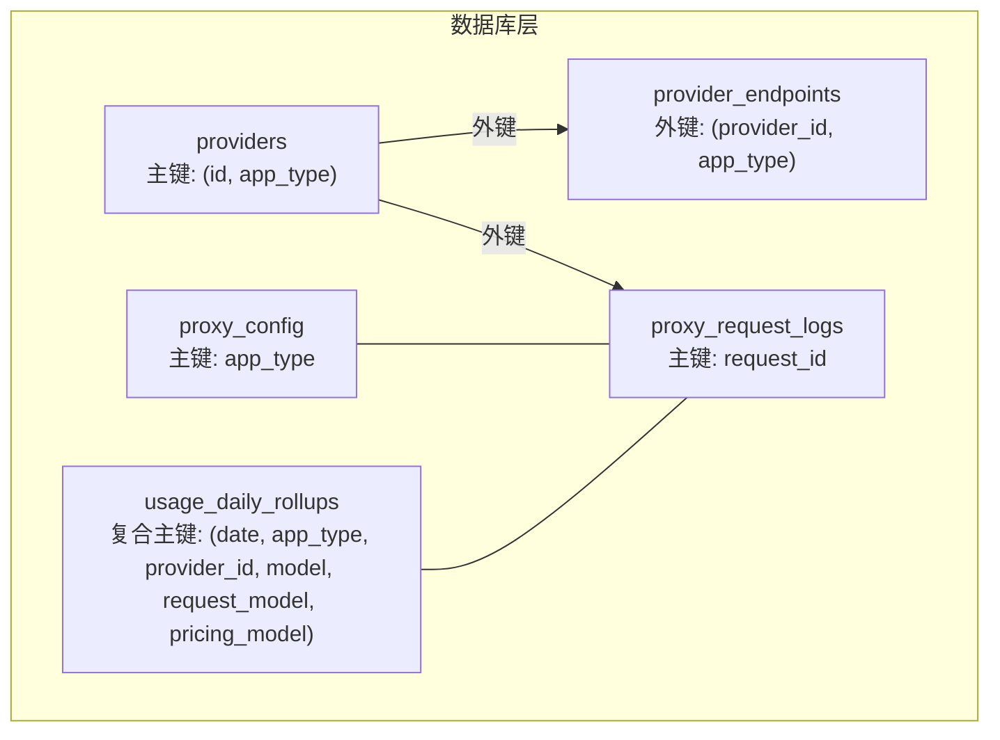
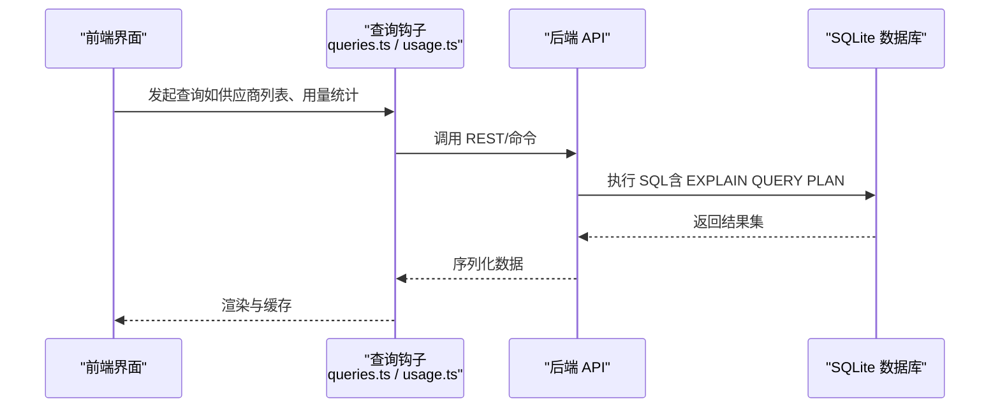
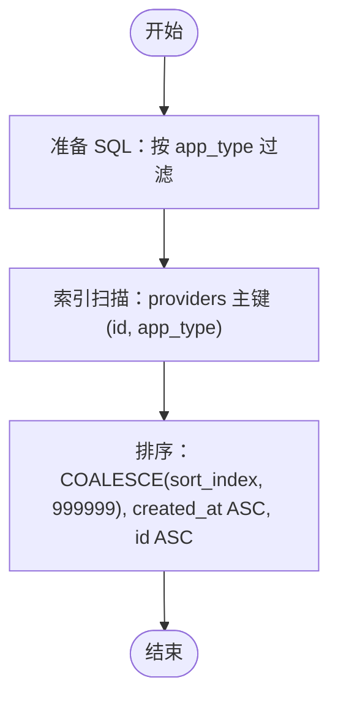
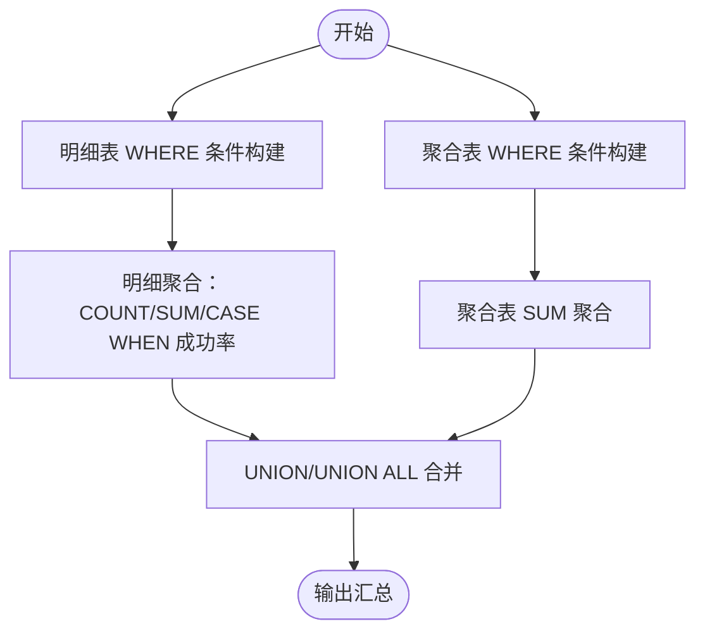
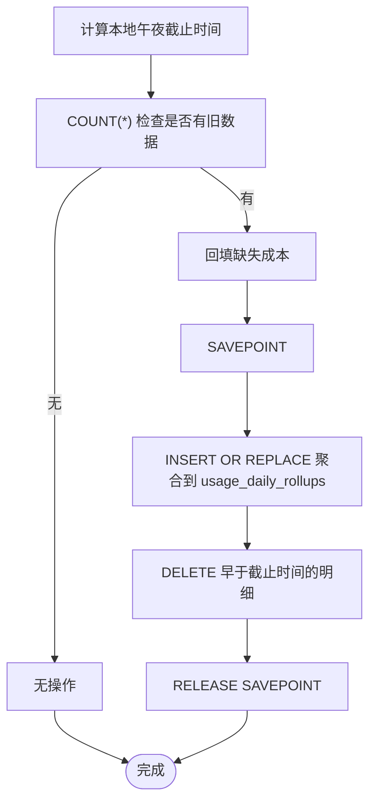
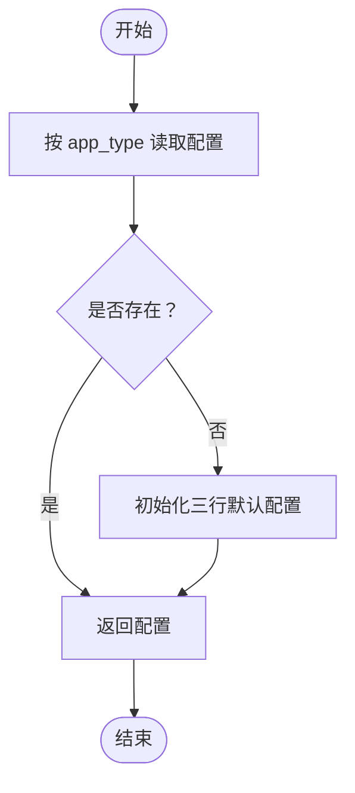
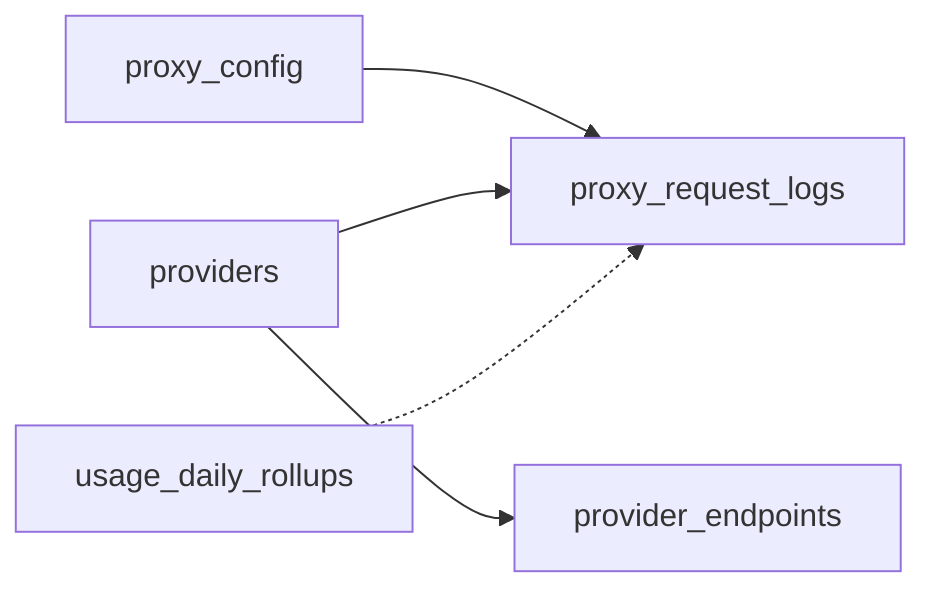

# 查询计划分析

<cite>
**本文引用的文件**
- [schema.rs](file://src-tauri/src/database/schema.rs)
- [providers.rs](file://src-tauri/src/database/dao/providers.rs)
- [usage_rollup.rs](file://src-tauri/src/database/dao/usage_rollup.rs)
- [usage_stats.rs](file://src-tauri/src/services/usage_stats.rs)
- [sql_helpers.rs](file://src-tauri/src/services/sql_helpers.rs)
- [proxy.rs](file://src-tauri/src/database/dao/proxy.rs)
- [queries.ts](file://src/lib/query/queries.ts)
- [usage.ts](file://src/lib/query/usage.ts)
- [mod.rs](file://src-tauri/src/database/mod.rs)
</cite>

## 目录
1. [简介](#简介)
2. [项目结构](#项目结构)
3. [核心组件](#核心组件)
4. [架构总览](#架构总览)
5. [详细组件分析](#详细组件分析)
6. [依赖分析](#依赖分析)
7. [性能考量](#性能考量)
8. [故障排查指南](#故障排查指南)
9. [结论](#结论)
10. [附录](#附录)

## 简介
本文件面向 CC Switch 的数据库查询计划分析，系统性阐述如何使用 SQLite EXPLAIN QUERY PLAN 对关键查询进行剖析与优化。内容涵盖：
- EXPLAIN QUERY PLAN 的使用方法与输出解读
- 关键指标：索引扫描、全表扫描、临时表使用
- 高频查询的执行计划特征与优化策略（统计查询、供应商列表查询、代理配置查询）
- 性能瓶颈识别与优化建议
- 实际案例与优化效果验证路径

## 项目结构
CC Switch 的数据库层采用 SQLite + rusqlite，核心表与索引分布如下：
- 供应商与端点：providers、provider_endpoints
- 代理配置：proxy_config
- 请求日志与用量：proxy_request_logs
- 用量聚合：usage_daily_rollups
- 索引覆盖：按 provider_id/app_type、created_at、model、session_id、status_code 等维度建立

图表来源
- [schema.rs:26-364](file://src-tauri/src/database/schema.rs#L26-L364)

章节来源
- [schema.rs:26-364](file://src-tauri/src/database/schema.rs#L26-L364)

## 核心组件
- 数据库初始化与连接管理：负责外键启用、增量自动收缩、表创建与迁移、启动清理与汇总
- DAO 层：提供供应商、代理配置、用量聚合等数据访问方法
- 用量统计服务：封装复杂聚合查询，包含缓存归一化、跨源去重、按天滚动汇总
- SQL 辅助：提供输入令牌归一化表达式，确保不同提供商统计口径一致

章节来源
- [mod.rs:92-160](file://src-tauri/src/database/mod.rs#L92-L160)
- [providers.rs:19-109](file://src-tauri/src/database/dao/providers.rs#L19-L109)
- [proxy.rs:55-314](file://src-tauri/src/database/dao/proxy.rs#L55-L314)
- [usage_stats.rs:439-566](file://src-tauri/src/services/usage_stats.rs#L439-L566)
- [sql_helpers.rs:21-47](file://src-tauri/src/services/sql_helpers.rs#L21-L47)

## 架构总览
查询链路从 UI 层发起，经前端查询钩子（React Query）到后端 API，最终落到 SQLite 查询与索引。

图表来源
- [queries.ts:60-87](file://src/lib/query/queries.ts#L60-L87)
- [usage.ts:167-209](file://src/lib/query/usage.ts#L167-L209)
- [usage_stats.rs:440-566](file://src-tauri/src/services/usage_stats.rs#L440-L566)

## 详细组件分析

### 供应商列表查询（高频）
- 查询目标：按 app_type 获取供应商列表，并附带自定义端点
- 关键 SQL：按 app_type 过滤，排序优先考虑 sort_index，其次创建时间与 ID
- 索引利用：providers 表具备 (id, app_type) 主键，查询条件包含 app_type，可走主键索引
- 优化要点：避免 SELECT *，仅取必要列；对排序字段建立合适索引可减少排序成本

图表来源
- [providers.rs:20-29](file://src-tauri/src/database/dao/providers.rs#L20-L29)

章节来源
- [providers.rs:20-109](file://src-tauri/src/database/dao/providers.rs#L20-L109)

### 用量统计查询（高频）
- 查询目标：按时间范围、应用类型、状态码等过滤，计算请求总数、成本、令牌总量、成功率等
- 关键 SQL：明细表 proxy_request_logs 与聚合表 usage_daily_rollups 双通道聚合，使用 effective_usage_log_filter 去重
- 索引利用：按 created_at、provider_id/app_type、model、status_code 建立索引，提升过滤效率
- 优化要点：合理使用 WHERE 条件与索引列；避免在 WHERE 中对列进行函数变换导致索引失效

图表来源
- [usage_stats.rs:493-523](file://src-tauri/src/services/usage_stats.rs#L493-L523)

章节来源
- [usage_stats.rs:440-702](file://src-tauri/src/services/usage_stats.rs#L440-L702)
- [sql_helpers.rs:21-47](file://src-tauri/src/services/sql_helpers.rs#L21-L47)

### 用量聚合与剪枝（周期任务）
- 查询目标：将早于截止时间的日志聚合到 usage_daily_rollups 并删除明细
- 关键 SQL：ROLLUP 聚合 + INSERT OR REPLACE 合并旧行；DELETE 剪枝
- 索引利用：按 created_at 建立索引，加速剪枝与聚合扫描
- 优化要点：先回填成本再剪枝，避免不可逆损失；使用 SAVEPOINT 保证原子性

图表来源
- [usage_rollup.rs:61-113](file://src-tauri/src/database/dao/usage_rollup.rs#L61-L113)
- [usage_rollup.rs:115-179](file://src-tauri/src/database/dao/usage_rollup.rs#L115-L179)

章节来源
- [usage_rollup.rs:57-180](file://src-tauri/src/database/dao/usage_rollup.rs#L57-L180)

### 代理配置查询（高频）
- 查询目标：获取全局代理配置或按应用类型获取配置
- 关键 SQL：按 app_type 过滤，三行镜像结构，读取 claude 行作为统一视图
- 索引利用：proxy_config 以 app_type 为主键，查询可走主键索引
- 优化要点：避免不必要的列读取；批量更新时使用同一事务

图表来源
- [proxy.rs:58-95](file://src-tauri/src/database/dao/proxy.rs#L58-L95)
- [proxy.rs:214-272](file://src-tauri/src/database/dao/proxy.rs#L214-L272)

章节来源
- [proxy.rs:55-314](file://src-tauri/src/database/dao/proxy.rs#L55-L314)

## 依赖分析
- 表间依赖：providers 与 provider_endpoints 通过 (provider_id, app_type) 外键关联；代理配置与请求日志通过 app_type 关联
- 索引依赖：查询路径高度依赖 schema 中创建的索引（provider_id/app_type、created_at、model、session_id、status_code）
- 服务依赖：用量统计服务依赖 SQL 辅助函数进行输入令牌归一化与跨源去重

图表来源
- [schema.rs:26-364](file://src-tauri/src/database/schema.rs#L26-L364)

章节来源
- [schema.rs:26-364](file://src-tauri/src/database/schema.rs#L26-L364)

## 性能考量
- 索引扫描 vs 全表扫描
  - 优先使用覆盖索引（如 idx_request_logs_provider、idx_request_logs_created_at）减少回表
  - 避免在 WHERE 中对列施加函数或表达式，防止索引失效
- 临时表与排序
  - 大量排序（ORDER BY）可能触发临时表；可通过合适的索引或物化视图降低排序成本
- 聚合与去重
  - 使用 EXISTS/IN 与 JOIN 时注意谓词下推，尽量将过滤条件前置
- 滚动汇总
  - 使用本地午夜对齐的截止时间，确保聚合完整性；在高写入场景下，适当缩短保留天数或提高剪枝频率

## 故障排查指南
- EXPLAIN QUERY PLAN 使用步骤
  - 在 SQLite shell 或 rusqlite 中执行 EXPLAIN QUERY PLAN 前缀的 SQL
  - 关注输出中的“SCAN TABLE”、“SEARCH TABLE”、“USING INDEX”等关键字
  - 重点关注是否存在全表扫描、临时表排序、哈希连接等高成本操作
- 常见问题定位
  - 全表扫描：检查 WHERE 条件是否命中索引；必要时新增复合索引
  - 临时表排序：优化排序字段与索引；避免不必要的 ORDER BY
  - 聚合异常：核对 effective_usage_log_filter 与 fresh_input_sql 的使用是否正确
- 优化验证
  - 通过对比优化前后 EXPLAIN 输出与实际执行时间，评估优化效果
  - 对高频查询建立基准测试，定期回归验证

章节来源
- [usage_stats.rs:440-566](file://src-tauri/src/services/usage_stats.rs#L440-L566)
- [sql_helpers.rs:21-47](file://src-tauri/src/services/sql_helpers.rs#L21-L47)

## 结论
通过对 CC Switch 数据库层的查询路径与索引策略进行系统性分析，可有效识别性能瓶颈并实施针对性优化。建议在高频查询中优先使用覆盖索引、避免函数变换导致的索引失效，并结合滚动汇总与成本回填机制，确保统计准确性与性能平衡。

## 附录
- EXPLAIN QUERY PLAN 输出解读要点
  - “USING INDEX”：命中索引，通常为最优路径
  - “SEARCH TABLE”：按索引查找，但可能需要回表
  - “SCAN TABLE”：全表扫描，需优化 WHERE 条件或新增索引
  - “USE TEMP B-TREE”：临时排序/去重，关注是否可由索引替代
  - “EXECUTE STATEMENT”：子查询或复杂表达式，评估是否可简化