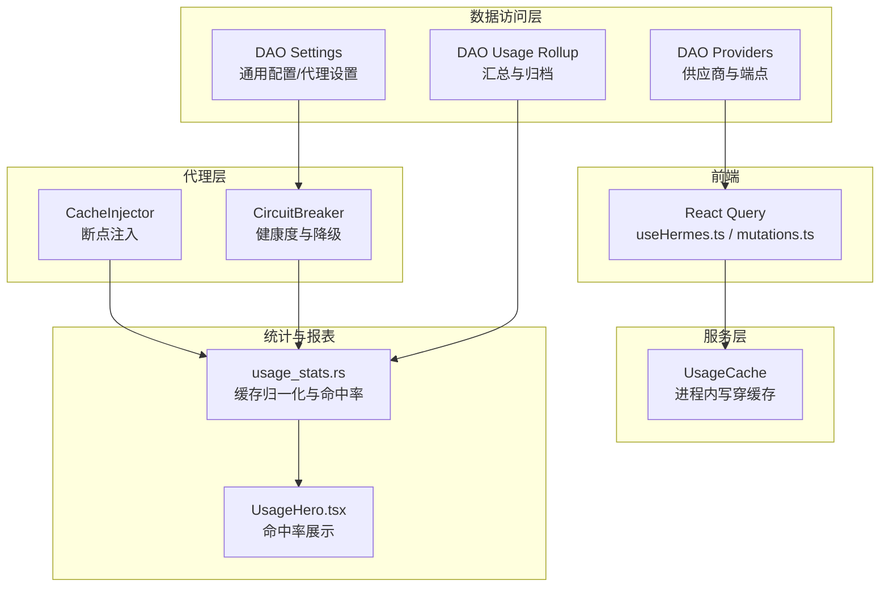
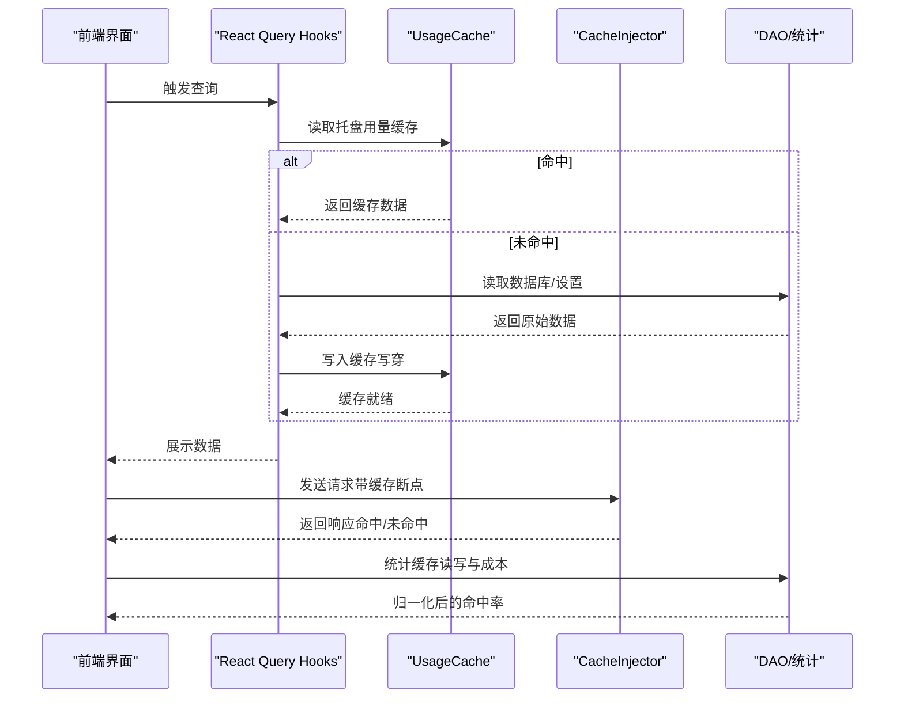
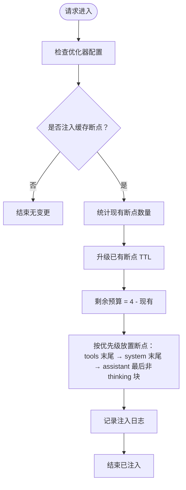
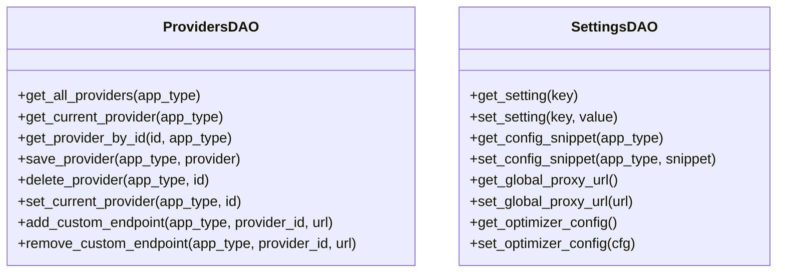
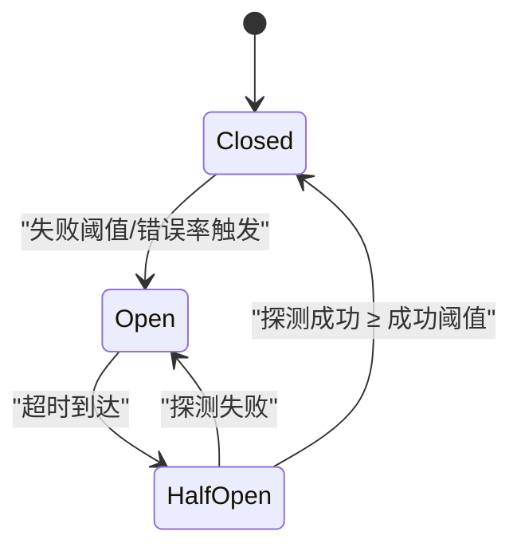
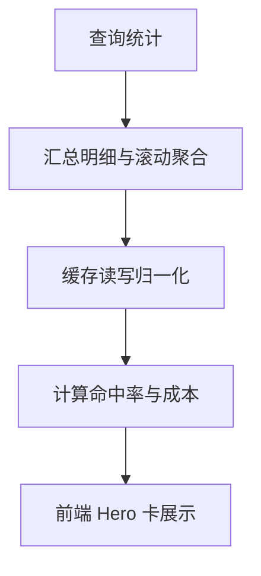
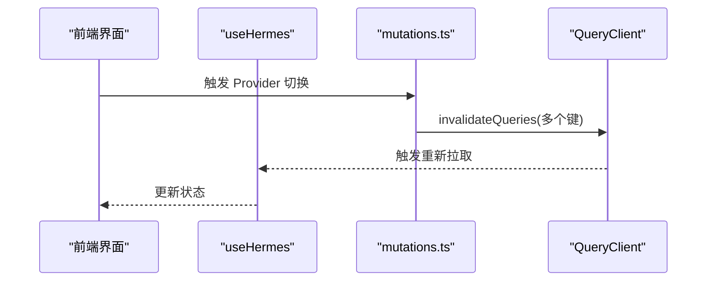
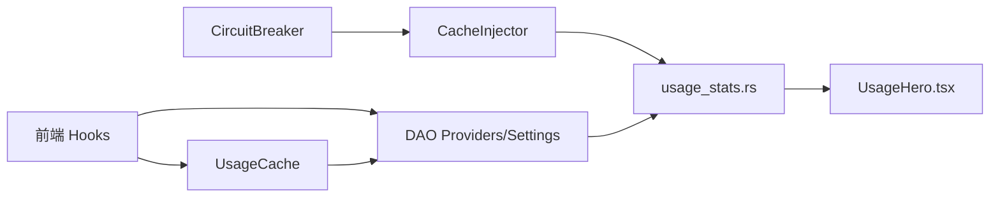

# 缓存策略

<cite>
**本文引用的文件**
- [src-tauri/src/services/usage_cache.rs](file://src-tauri/src/services/usage_cache.rs)
- [src-tauri/src/proxy/cache_injector.rs](file://src-tauri/src/proxy/cache_injector.rs)
- [src-tauri/src/database/dao/providers.rs](file://src-tauri/src/database/dao/providers.rs)
- [src-tauri/src/database/dao/settings.rs](file://src-tauri/src/database/dao/settings.rs)
- [src-tauri/src/proxy/circuit_breaker.rs](file://src-tauri/src/proxy/circuit_breaker.rs)
- [src-tauri/src/proxy/types.rs](file://src-tauri/src/proxy/types.rs)
- [src-tauri/src/services/usage_stats.rs](file://src-tauri/src/services/usage_stats.rs)
- [src-tauri/src/database/dao/usage_rollup.rs](file://src-tauri/src/database/dao/usage_rollup.rs)
- [src-tauri/src/services/proxy.rs](file://src-tauri/src/services/proxy.rs)
- [src/hooks/useHermes.ts](file://src/hooks/useHermes.ts)
- [src/lib/query/mutations.ts](file://src/lib/query/mutations.ts)
- [src/components/usage/UsageHero.tsx](file://src/components/usage/UsageHero.tsx)
- [docs/release-notes/v3.15.0-en.md](file://docs/release-notes/v3.15.0-en.md)
- [docs/user-manual/en/4-proxy/4.4-usage.md](file://docs/user-manual/en/4-proxy/4.4-usage.md)
</cite>

## 目录
1. [简介](#简介)
2. [项目结构](#项目结构)
3. [核心组件](#核心组件)
4. [架构总览](#架构总览)
5. [详细组件分析](#详细组件分析)
6. [依赖关系分析](#依赖关系分析)
7. [性能考量](#性能考量)
8. [故障排查指南](#故障排查指南)
9. [结论](#结论)
10. [附录](#附录)

## 简介
本文件系统化梳理 CC Switch 的数据库与代理层缓存策略，覆盖查询结果缓存（内存缓存、LRU 缓存）、热点数据缓存（常用配置、供应商信息、代理设置）、缓存一致性保障（更新通知、缓存预热、降级策略）、以及缓存性能监控与调优方法。文档基于仓库中的实际实现与发布说明，提供可操作的优化建议与可视化图示。

## 项目结构
围绕缓存策略的关键目录与文件：
- 服务层缓存：托盘用量缓存（进程内、写穿式）
- 代理层缓存：Bedrock Prompt Caching 断点注入
- 数据访问层：供应商与设置 DAO
- 熔断器：健康度与缓存一致性保障
- 统计与报表：缓存命中率与成本归因
- 前端缓存失效：React Query 与 Hooks



图表来源
- [src-tauri/src/services/usage_cache.rs:1-157](file://src-tauri/src/services/usage_cache.rs#L1-L157)
- [src-tauri/src/proxy/cache_injector.rs:1-378](file://src-tauri/src/proxy/cache_injector.rs#L1-L378)
- [src-tauri/src/database/dao/providers.rs:1-787](file://src-tauri/src/database/dao/providers.rs#L1-L787)
- [src-tauri/src/database/dao/settings.rs:1-328](file://src-tauri/src/database/dao/settings.rs#L1-L328)
- [src-tauri/src/proxy/circuit_breaker.rs:1-496](file://src-tauri/src/proxy/circuit_breaker.rs#L1-L496)
- [src-tauri/src/services/usage_stats.rs:493-2384](file://src-tauri/src/services/usage_stats.rs#L493-L2384)
- [src-tauri/src/database/dao/usage_rollup.rs:369-446](file://src-tauri/src/database/dao/usage_rollup.rs#L369-L446)
- [src/components/usage/UsageHero.tsx:202-231](file://src/components/usage/UsageHero.tsx#L202-L231)

章节来源
- [src-tauri/src/services/usage_cache.rs:1-157](file://src-tauri/src/services/usage_cache.rs#L1-L157)
- [src-tauri/src/proxy/cache_injector.rs:1-378](file://src-tauri/src/proxy/cache_injector.rs#L1-L378)
- [src-tauri/src/database/dao/providers.rs:1-787](file://src-tauri/src/database/dao/providers.rs#L1-L787)
- [src-tauri/src/database/dao/settings.rs:1-328](file://src-tauri/src/database/dao/settings.rs#L1-L328)
- [src-tauri/src/proxy/circuit_breaker.rs:1-496](file://src-tauri/src/proxy/circuit_breaker.rs#L1-L496)
- [src-tauri/src/services/usage_stats.rs:493-2384](file://src-tauri/src/services/usage_stats.rs#L493-L2384)
- [src-tauri/src/database/dao/usage_rollup.rs:369-446](file://src-tauri/src/database/dao/usage_rollup.rs#L369-L446)
- [src/components/usage/UsageHero.tsx:202-231](file://src/components/usage/UsageHero.tsx#L202-L231)

## 核心组件
- 托盘用量缓存（进程内写穿式）：用于托盘菜单构建，进程重启即清空，依赖查询成功后写入，读取时避免深拷贝。
- 代理层缓存注入：在请求体关键位置注入 cache_control 断点，提升 Bedrock Prompt Caching 命中率。
- 供应商与设置 DAO：提供供应商列表、当前供应商、端点、通用配置片段、全局代理设置等读写接口。
- 熔断器：根据连续失败次数、错误率与超时控制 Provider 可用性，间接保障缓存一致性。
- 统计与报表：归一化缓存读写与输入，计算缓存命中率与成本，前端 Hero 卡实时展示。

章节来源
- [src-tauri/src/services/usage_cache.rs:1-157](file://src-tauri/src/services/usage_cache.rs#L1-L157)
- [src-tauri/src/proxy/cache_injector.rs:1-378](file://src-tauri/src/proxy/cache_injector.rs#L1-L378)
- [src-tauri/src/database/dao/providers.rs:1-787](file://src-tauri/src/database/dao/providers.rs#L1-L787)
- [src-tauri/src/database/dao/settings.rs:1-328](file://src-tauri/src/database/dao/settings.rs#L1-L328)
- [src-tauri/src/proxy/circuit_breaker.rs:1-496](file://src-tauri/src/proxy/circuit_breaker.rs#L1-L496)
- [src-tauri/src/services/usage_stats.rs:493-2384](file://src-tauri/src/services/usage_stats.rs#L493-L2384)

## 架构总览
缓存策略贯穿前端查询、服务层写穿、代理层注入与数据库统计四个层面，形成“写入即缓存、请求即注入、统计即归一”的闭环。



图表来源
- [src/hooks/useHermes.ts:34-81](file://src/hooks/useHermes.ts#L34-L81)
- [src/lib/query/mutations.ts:258-295](file://src/lib/query/mutations.ts#L258-L295)
- [src-tauri/src/services/usage_cache.rs:1-157](file://src-tauri/src/services/usage_cache.rs#L1-L157)
- [src-tauri/src/proxy/cache_injector.rs:1-378](file://src-tauri/src/proxy/cache_injector.rs#L1-L378)
- [src-tauri/src/services/usage_stats.rs:493-2384](file://src-tauri/src/services/usage_stats.rs#L493-L2384)

## 详细组件分析

### 组件一：托盘用量缓存（进程内写穿式）
- 设计要点
  - 结构：订阅配额与脚本用量两类缓存，分别以 RwLock 保护。
  - 写入：查询成功后写入，避免重复 IO。
  - 读取：借用形式暴露快照，减少深拷贝开销。
  - 失效：按键移除，热路径先读锁快速判断是否存在。
- 适用场景
  - 托盘菜单构建、状态栏显示等高频读取但低频更新的场景。
- 优化建议
  - 为不同 AppType/Provider 维度细化失效粒度，避免跨域污染。
  - 引入轻量级 TTL 或 LRU，限制内存占用。

```mermaid
classDiagram
class UsageCache {
-subscription : RwLock<HashMap<AppType, SubscriptionQuota>>
-script : RwLock<HashMap<(AppType, String), UsageResult>>
+put_subscription(app_type, quota)
+put_script(app_type, provider_id, result)
+with_subscription(app_type, f) Option<R>
+with_script(app_type, provider_id, f) Option<R>
+invalidate_script(app_type, provider_id)
+invalidate_subscription(app_type)
}
```

图表来源
- [src-tauri/src/services/usage_cache.rs:1-157](file://src-tauri/src/services/usage_cache.rs#L1-L157)

章节来源
- [src-tauri/src/services/usage_cache.rs:1-157](file://src-tauri/src/services/usage_cache.rs#L1-L157)

### 组件二：代理层缓存注入（Bedrock Prompt Caching）
- 设计要点
  - 在 tools/system/messages 中注入 cache_control 断点，提升缓存命中。
  - 支持 TTL 升级与预算控制（最多注入 4 处）。
  - 仅在存在真实会话标识时才注入，避免无意义缓存。
- 适用场景
  - Claude/Gemini 等支持 Prompt Caching 的上游。
- 优化建议
  - 对 JSON Key 与工具参数进行规范化排序，提升前缀缓存复用率。
  - 与会话 ID 关联，确保跨请求的稳定缓存键。



图表来源
- [src-tauri/src/proxy/cache_injector.rs:1-378](file://src-tauri/src/proxy/cache_injector.rs#L1-L378)

章节来源
- [src-tauri/src/proxy/cache_injector.rs:1-378](file://src-tauri/src/proxy/cache_injector.rs#L1-L378)
- [docs/release-notes/v3.15.0-en.md:263-265](file://docs/release-notes/v3.15.0-en.md#L263-L265)

### 组件三：供应商与设置 DAO（常用配置与代理设置）
- 设计要点
  - 供应商读取：支持按 app_type 获取全部供应商、当前供应商、按 id 查询，并附带自定义端点。
  - 设置读取：通用配置片段、全局代理 URL、优化器/整流器/日志配置等。
- 适用场景
  - 前端渲染供应商卡片、代理设置面板、通用配置编辑。
- 优化建议
  - 对供应商列表增加分页或懒加载，避免大规模渲染。
  - 设置项采用“延迟写入 + 批量合并”，减少频繁 IO。



图表来源
- [src-tauri/src/database/dao/providers.rs:1-787](file://src-tauri/src/database/dao/providers.rs#L1-L787)
- [src-tauri/src/database/dao/settings.rs:1-328](file://src-tauri/src/database/dao/settings.rs#L1-L328)

章节来源
- [src-tauri/src/database/dao/providers.rs:1-787](file://src-tauri/src/database/dao/providers.rs#L1-L787)
- [src-tauri/src/database/dao/settings.rs:1-328](file://src-tauri/src/database/dao/settings.rs#L1-L328)

### 组件四：熔断器（健康度与缓存一致性）
- 设计要点
  - 状态机：Closed → Open → HalfOpen → Closed。
  - 触发条件：连续失败阈值、错误率阈值、最小请求数。
  - 半开探测：限流放行，成功则恢复，失败则回退。
- 适用场景
  - 保障下游不稳定时的缓存一致性，避免雪崩。
- 优化建议
  - 动态调整阈值与超时，结合历史成功率自适应。
  - 与缓存失效策略联动：熔断打开时主动清理相关缓存键。



图表来源
- [src-tauri/src/proxy/circuit_breaker.rs:1-496](file://src-tauri/src/proxy/circuit_breaker.rs#L1-L496)

章节来源
- [src-tauri/src/proxy/circuit_breaker.rs:1-496](file://src-tauri/src/proxy/circuit_breaker.rs#L1-L496)
- [src-tauri/src/proxy/types.rs:170-195](file://src-tauri/src/proxy/types.rs#L170-L195)

### 组件五：统计与报表（缓存命中率与成本）
- 设计要点
  - 缓存归一化：将缓存写入与读取纳入统一 token 计算。
  - 命中率计算：缓存读取令牌占比可缓存输入。
  - 前端展示：Hero 卡实时更新命中率与成本。
- 适用场景
  - 运行时监控与历史趋势分析。
- 优化建议
  - 引入滑动窗口与多粒度聚合，降低波动影响。
  - 对 OpenAI 协议补充“部分上报”提示，避免误解。



图表来源
- [src-tauri/src/services/usage_stats.rs:493-2384](file://src-tauri/src/services/usage_stats.rs#L493-L2384)
- [src-tauri/src/database/dao/usage_rollup.rs:369-446](file://src-tauri/src/database/dao/usage_rollup.rs#L369-L446)
- [src/components/usage/UsageHero.tsx:202-231](file://src/components/usage/UsageHero.tsx#L202-L231)
- [docs/user-manual/en/4-proxy/4.4-usage.md:44-93](file://docs/user-manual/en/4-proxy/4.4-usage.md#L44-L93)

章节来源
- [src-tauri/src/services/usage_stats.rs:493-2384](file://src-tauri/src/services/usage_stats.rs#L493-L2384)
- [src-tauri/src/database/dao/usage_rollup.rs:369-446](file://src-tauri/src/database/dao/usage_rollup.rs#L369-L446)
- [src/components/usage/UsageHero.tsx:202-231](file://src/components/usage/UsageHero.tsx#L202-L231)
- [docs/user-manual/en/4-proxy/4.4-usage.md:44-93](file://docs/user-manual/en/4-proxy/4.4-usage.md#L44-L93)

### 组件六：前端缓存失效与预热
- 设计要点
  - React Query Hooks：提供查询键与失效函数，支持并行失效。
  - Provider 切换后主动失效相关缓存，避免脏读。
  - 热路径设置合理的 staleTime，平衡新鲜度与性能。
- 适用场景
  - 供应商切换、配置更新、内存编辑保存后刷新。
- 优化建议
  - 将“托盘菜单重建”与“查询失效”解耦，避免阻塞 UI。
  - 对高频读取的键引入 LRU 或 TTL，降低内存压力。



图表来源
- [src/hooks/useHermes.ts:34-81](file://src/hooks/useHermes.ts#L34-L81)
- [src/lib/query/mutations.ts:258-295](file://src/lib/query/mutations.ts#L258-L295)

章节来源
- [src/hooks/useHermes.ts:34-81](file://src/hooks/useHermes.ts#L34-L81)
- [src/lib/query/mutations.ts:258-295](file://src/lib/query/mutations.ts#L258-L295)

## 依赖关系分析
- 前端查询依赖服务层缓存与 DAO；服务层缓存依赖查询成功事件写入。
- 代理层缓存注入依赖优化器配置与会话上下文；统计层依赖代理层上报的缓存读写标记。
- 熔断器影响代理层可用性，间接影响缓存命中稳定性。



图表来源
- [src/hooks/useHermes.ts:34-81](file://src/hooks/useHermes.ts#L34-L81)
- [src-tauri/src/services/usage_cache.rs:1-157](file://src-tauri/src/services/usage_cache.rs#L1-L157)
- [src-tauri/src/database/dao/providers.rs:1-787](file://src-tauri/src/database/dao/providers.rs#L1-L787)
- [src-tauri/src/database/dao/settings.rs:1-328](file://src-tauri/src/database/dao/settings.rs#L1-L328)
- [src-tauri/src/proxy/cache_injector.rs:1-378](file://src-tauri/src/proxy/cache_injector.rs#L1-L378)
- [src-tauri/src/proxy/circuit_breaker.rs:1-496](file://src-tauri/src/proxy/circuit_breaker.rs#L1-L496)
- [src-tauri/src/services/usage_stats.rs:493-2384](file://src-tauri/src/services/usage_stats.rs#L493-L2384)
- [src/components/usage/UsageHero.tsx:202-231](file://src/components/usage/UsageHero.tsx#L202-L231)

章节来源
- [src/hooks/useHermes.ts:34-81](file://src/hooks/useHermes.ts#L34-L81)
- [src-tauri/src/services/usage_cache.rs:1-157](file://src-tauri/src/services/usage_cache.rs#L1-L157)
- [src-tauri/src/database/dao/providers.rs:1-787](file://src-tauri/src/database/dao/providers.rs#L1-L787)
- [src-tauri/src/database/dao/settings.rs:1-328](file://src-tauri/src/database/dao/settings.rs#L1-L328)
- [src-tauri/src/proxy/cache_injector.rs:1-378](file://src-tauri/src/proxy/cache_injector.rs#L1-L378)
- [src-tauri/src/proxy/circuit_breaker.rs:1-496](file://src-tauri/src/proxy/circuit_breaker.rs#L1-L496)
- [src-tauri/src/services/usage_stats.rs:493-2384](file://src-tauri/src/services/usage_stats.rs#L493-L2384)
- [src/components/usage/UsageHero.tsx:202-231](file://src/components/usage/UsageHero.tsx#L202-L231)

## 性能考量
- 写穿式缓存
  - 优点：减少重复查询，降低数据库压力。
  - 风险：内存占用与一致性风险；建议引入 TTL/LRU。
- 缓存注入
  - 通过断点与 TTL 控制命中范围；建议配合 JSON Key 规范化与会话 ID 关联。
- 熔断器
  - 有效防止雪崩；建议动态阈值与半开探测额度自适应。
- 统计归一化
  - 历史与现状规则差异需明确提示，避免误导。
- 前端缓存
  - 合理设置 staleTime 与失效粒度，避免过度刷新或脏读。

## 故障排查指南
- 代理接管与热切换
  - 确认接管状态与备份一致性，避免残留状态导致 Provider 固定。
- 熔断器状态
  - 检查连续失败次数、错误率与超时；必要时手动重置。
- 缓存命中率异常
  - 核对优化器配置（cache_injection、cache_ttl）与会话标识；查看统计归一化规则。
- 前端缓存未刷新
  - 确认失效键是否覆盖到相关查询；检查 staleTime 设置。

章节来源
- [src-tauri/src/services/proxy.rs:2015-2049](file://src-tauri/src/services/proxy.rs#L2015-L2049)
- [src-tauri/src/proxy/circuit_breaker.rs:290-314](file://src-tauri/src/proxy/circuit_breaker.rs#L290-L314)
- [src-tauri/src/services/usage_stats.rs:493-2384](file://src-tauri/src/services/usage_stats.rs#L493-L2384)
- [src/lib/query/mutations.ts:258-295](file://src/lib/query/mutations.ts#L258-L295)

## 结论
CC Switch 的缓存策略以“写穿式服务缓存 + 代理层缓存注入 + 熔断器健康控制 + 统计归一化”为核心，形成闭环。建议在现有基础上引入 TTL/LRU、动态阈值与更细粒度的失效策略，进一步提升缓存命中率与系统稳定性。

## 附录
- 缓存实现示例路径
  - [托盘用量缓存:1-157](file://src-tauri/src/services/usage_cache.rs#L1-L157)
  - [缓存注入器:1-378](file://src-tauri/src/proxy/cache_injector.rs#L1-L378)
  - [供应商 DAO:1-787](file://src-tauri/src/database/dao/providers.rs#L1-L787)
  - [设置 DAO:1-328](file://src-tauri/src/database/dao/settings.rs#L1-L328)
  - [熔断器:1-496](file://src-tauri/src/proxy/circuit_breaker.rs#L1-L496)
  - [统计与命中率:493-2384](file://src-tauri/src/services/usage_stats.rs#L493-L2384)
  - [前端缓存失效:34-81](file://src/hooks/useHermes.ts#L34-L81)
  - [前端失效调用:258-295](file://src/lib/query/mutations.ts#L258-L295)
- 缓存命中率优化技巧
  - 仅在真实会话标识存在时注入缓存断点。
  - 规范化 JSON Key 与工具参数顺序，提升前缀缓存复用。
  - 引入 TTL 升级策略，避免过期断点影响命中。
  - 结合会话 ID 与使用日志，追踪缓存命中路径。