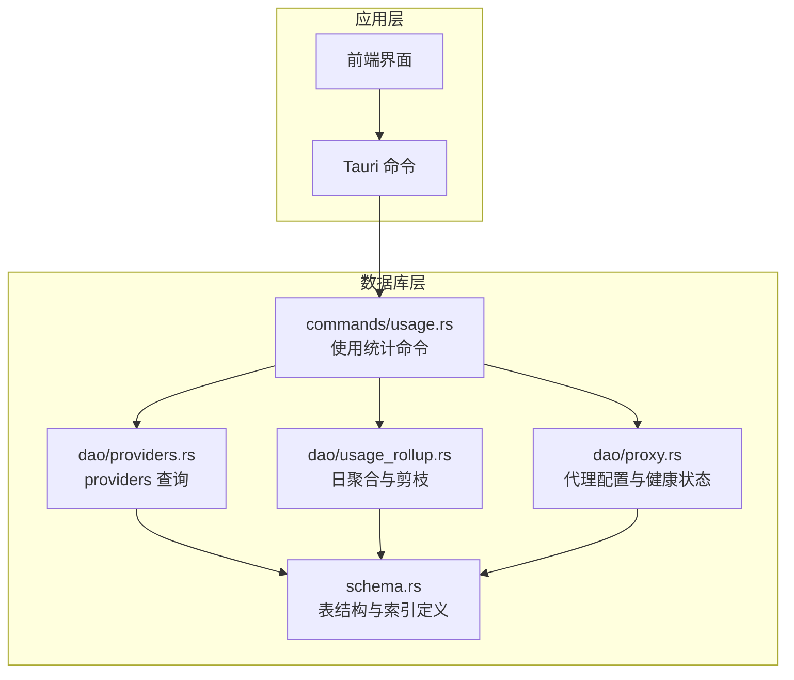
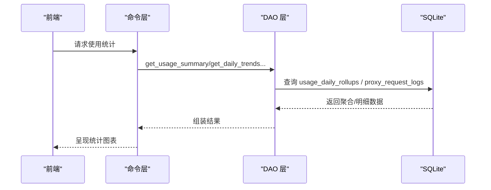
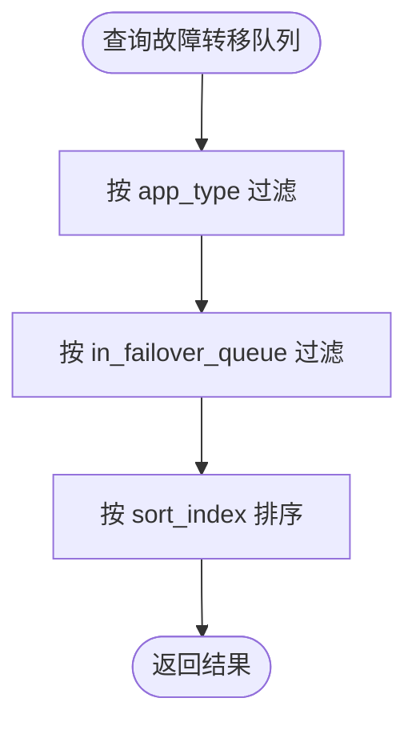
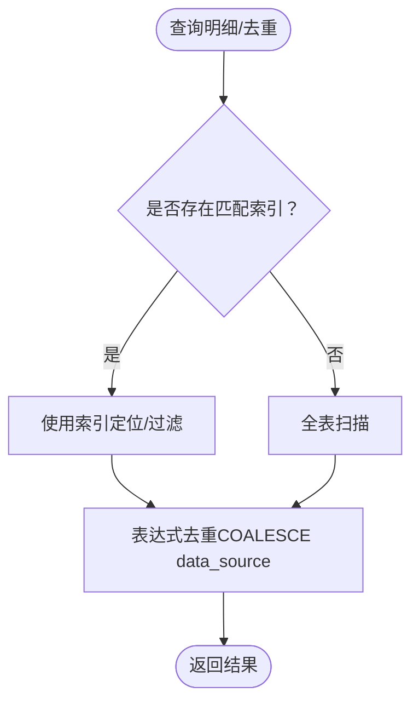
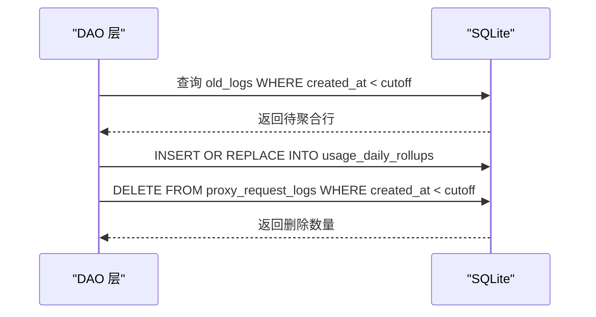
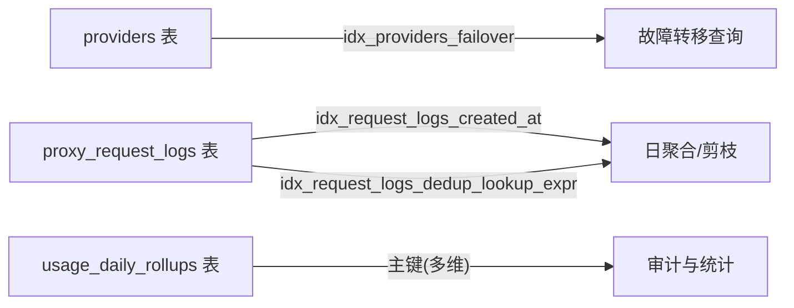

# 索引策略

<cite>
**本文引用的文件**
- [schema.rs](file://src-tauri/src/database/schema.rs)
- [providers.rs](file://src-tauri/src/database/dao/providers.rs)
- [usage_rollup.rs](file://src-tauri/src/database/dao/usage_rollup.rs)
- [proxy.rs](file://src-tauri/src/database/dao/proxy.rs)
- [usage.rs](file://src-tauri/src/commands/usage.rs)
</cite>

## 目录
1. [简介](#简介)
2. [项目结构](#项目结构)
3. [核心组件](#核心组件)
4. [架构总览](#架构总览)
5. [详细组件分析](#详细组件分析)
6. [依赖分析](#依赖分析)
7. [性能考量](#性能考量)
8. [故障排查指南](#故障排查指南)
9. [结论](#结论)
10. [附录](#附录)

## 简介
本文件面向 CC Switch 的数据库索引策略，系统梳理主键设计原则与复合索引策略，结合现有 providers 表的 in_failover_queue 索引与 proxy_request_logs 表的多字段索引现状，给出性能测试方法、查询计划分析技巧、维护最佳实践以及写入性能平衡策略。目标是帮助开发者在不破坏现有功能的前提下，优化查询路径、降低扫描代价，并确保写入吞吐与查询效率的平衡。

## 项目结构
CC Switch 的数据库模式与索引主要集中在数据库层的 schema 定义与 DAO 层的查询实现中：
- schema 层负责表结构与索引的创建与迁移
- DAO 层负责具体业务查询，体现索引的实际使用效果
- 命令层提供对外接口，间接驱动数据库查询

图表来源
- [schema.rs](file://src-tauri/src/database/schema.rs)
- [providers.rs](file://src-tauri/src/database/dao/providers.rs)
- [usage_rollup.rs](file://src-tauri/src/database/dao/usage_rollup.rs)
- [proxy.rs](file://src-tauri/src/database/dao/proxy.rs)
- [usage.rs](file://src-tauri/src/commands/usage.rs)

章节来源
- [schema.rs](file://src-tauri/src/database/schema.rs)
- [providers.rs](file://src-tauri/src/database/dao/providers.rs)
- [usage_rollup.rs](file://src-tauri/src/database/dao/usage_rollup.rs)
- [proxy.rs](file://src-tauri/src/database/dao/proxy.rs)
- [usage.rs](file://src-tauri/src/commands/usage.rs)

## 核心组件
- providers 表：主键为 (id, app_type)，并创建了针对故障转移队列的复合索引 idx_providers_failover(app_type, in_failover_queue, sort_index)。
- proxy_request_logs 表：包含多个单列索引与一个表达式索引，用于加速按 app_type、created_at、data_source 等维度的查询与去重。
- usage_daily_rollups 表：主键包含日期、应用类型、提供商、模型及两个维度（request_model、pricing_model），用于日聚合统计。

章节来源
- [schema.rs](file://src-tauri/src/database/schema.rs)
- [providers.rs](file://src-tauri/src/database/dao/providers.rs)
- [usage_rollup.rs](file://src-tauri/src/database/dao/usage_rollup.rs)

## 架构总览
数据库层通过 schema.rs 统一管理表结构与索引，DAO 层围绕这些索引进行查询优化，命令层提供查询入口。日聚合流程（usage_daily_rollups）依赖 proxy_request_logs 的索引以提升剪枝与汇总效率。

图表来源
- [usage.rs](file://src-tauri/src/commands/usage.rs)
- [usage_rollup.rs](file://src-tauri/src/database/dao/usage_rollup.rs)
- [schema.rs](file://src-tauri/src/database/schema.rs)

## 详细组件分析

### 主键设计原则与复合主键使用场景
- providers 表采用复合主键 (id, app_type)，确保同一应用类型下的唯一性，避免跨应用类型的数据冲突。
- usage_daily_rollups 表采用复合主键 (date, app_type, provider_id, model, request_model, pricing_model)，用于精确聚合与审计，支持路由接管后的模型别名与计价基准分离。
- 设计原则
  - 选择能唯一标识记录的最小字段集合
  - 优先考虑查询最频繁的过滤条件作为前导列
  - 避免在主键中包含易变字段（如 created_at）

章节来源
- [schema.rs](file://src-tauri/src/database/schema.rs)

### providers 表的 in_failover_queue 索引
- 现状：为 providers 表创建了复合索引 idx_providers_failover(app_type, in_failover_queue, sort_index)，用于故障转移队列的快速筛选与排序。
- 查询场景：按 app_type 精确过滤，再按 in_failover_queue 二值过滤，最后按 sort_index 排序，适合故障转移优先级管理。
- 性能影响：该索引可显著减少故障转移场景下的全表扫描，提高查询效率。

图表来源
- [schema.rs](file://src-tauri/src/database/schema.rs)
- [providers.rs](file://src-tauri/src/database/dao/providers.rs)

章节来源
- [schema.rs](file://src-tauri/src/database/schema.rs)
- [providers.rs](file://src-tauri/src/database/dao/providers.rs)

### proxy_request_logs 表的多字段索引
- 现状：包含以下索引
  - idx_request_logs_provider(provider_id, app_type)
  - idx_request_logs_created_at(created_at)
  - idx_request_logs_model(model)
  - idx_request_logs_session(session_id)
  - idx_request_logs_status(status_code)
  - idx_request_logs_app_created_at(app_type, created_at DESC)（条件满足时创建）
  - idx_request_logs_dedup_lookup_expr(app_type, COALESCE(data_source, 'proxy'), input_tokens, output_tokens, cache_read_tokens, created_at, cache_creation_tokens)（条件满足时创建）
- 查询场景与优化效果
  - 按 provider_id + app_type 查询：加速按提供商与应用维度的明细检索
  - 按 created_at 查询：支持按时间范围检索与剪枝
  - 按 model/session/status 等字段查询：满足多维过滤需求
  - 表达式索引 idx_request_logs_dedup_lookup_expr：兼容历史 NULL data_source 的去重逻辑，避免函数应用导致的索引失效，提升去重子查询性能

图表来源
- [schema.rs](file://src-tauri/src/database/schema.rs)
- [usage_rollup.rs](file://src-tauri/src/database/dao/usage_rollup.rs)

章节来源
- [schema.rs](file://src-tauri/src/database/schema.rs)
- [usage_rollup.rs](file://src-tauri/src/database/dao/usage_rollup.rs)

### 日聚合与剪枝流程中的索引利用
- 日聚合（rollup_and_prune）会按 created_at 进行范围过滤，依赖 idx_request_logs_created_at 与 idx_request_logs_app_created_at 提升效率
- 剪枝（DELETE）在 SAVEPOINT 内执行，避免大事务锁表
- 去重与回填成本在剪枝前执行，确保历史 0 成本行能正确计入

图表来源
- [usage_rollup.rs](file://src-tauri/src/database/dao/usage_rollup.rs)
- [schema.rs](file://src-tauri/src/database/schema.rs)

章节来源
- [usage_rollup.rs](file://src-tauri/src/database/dao/usage_rollup.rs)
- [schema.rs](file://src-tauri/src/database/schema.rs)

### 代理配置与健康状态查询中的索引利用
- 代理配置与健康状态查询多为按 app_type 或主键的等值查询，schema 层通过主键与单列索引保障查询效率
- 命令层提供 get_usage_summary、get_daily_trends 等接口，底层依赖上述索引实现快速统计

章节来源
- [proxy.rs](file://src-tauri/src/database/dao/proxy.rs)
- [usage.rs](file://src-tauri/src/commands/usage.rs)

## 依赖分析
- providers 表的故障转移查询依赖 idx_providers_failover
- 日聚合与剪枝依赖 proxy_request_logs 的多字段索引，尤其是 created_at 与表达式索引
- usage_daily_rollups 的主键设计直接影响聚合与审计能力

图表来源
- [schema.rs](file://src-tauri/src/database/schema.rs)
- [usage_rollup.rs](file://src-tauri/src/database/dao/usage_rollup.rs)

章节来源
- [schema.rs](file://src-tauri/src/database/schema.rs)
- [usage_rollup.rs](file://src-tauri/src/database/dao/usage_rollup.rs)

## 性能考量
- 查询计划分析
  - 使用 EXPLAIN QUERY PLAN 或 SQLite 的 EXPLAIN QUERY PLAN（或通过 rusqlite 的执行计划接口）观察 SQL 是否命中预期索引
  - 关注是否发生全表扫描、临时表排序或哈希连接
- 性能测试方法
  - 基准测试：构造与生产规模相近的数据集，测量关键查询（按 app_type+created_at、按 provider_id+app_type、按 model/session/status）的耗时
  - 负载测试：模拟并发查询与日聚合/剪枝，评估索引对写入与读取的综合影响
- 写入性能平衡
  - 索引越多，写入代价越高（INSERT/UPDATE/DELETE 需维护索引）
  - 对高频写入的列谨慎创建索引，优先保证高频查询的过滤列
  - 使用批量写入与事务（如 DAO 层的事务封装）降低索引维护开销

## 故障排查指南
- 索引未生效
  - 检查 WHERE 条件是否与索引前导列一致（如 app_type 在前）
  - 对表达式（如 COALESCE(data_source, 'proxy')）需使用表达式索引
- 查询缓慢
  - 使用 EXPLAIN QUERY PLAN 观察是否发生全表扫描
  - 调整查询条件或补充索引（需评估写入成本）
- 日聚合/剪枝异常
  - 确认 created_at 索引存在且数据类型一致
  - 检查表达式索引是否满足去重需求（data_source 可能为 NULL）

章节来源
- [schema.rs](file://src-tauri/src/database/schema.rs)
- [usage_rollup.rs](file://src-tauri/src/database/dao/usage_rollup.rs)

## 结论
CC Switch 的索引策略围绕高频查询场景（按 app_type、按 provider_id、按 created_at、表达式去重）进行了针对性设计。providers 表的故障转移索引与 proxy_request_logs 的多字段索引共同支撑了高效的明细检索与日聚合流程。建议在新增索引时遵循“查询优先、写入权衡”的原则，并通过查询计划与性能测试持续验证效果。

## 附录

### 索引维护最佳实践
- 定期 ANALYZE：帮助 SQLite 优化器生成更准确的查询计划
- 索引重建策略：当表结构发生重大变更（如新增列、主键变更）时，评估是否需要重建索引
- 监控与回归测试：建立索引变更的回归测试，确保查询性能稳定

### 写入性能与索引的平衡策略
- 识别热点表与热点列，优先为高频过滤列创建索引
- 对写入密集的列避免过度索引化，必要时采用延迟索引或异步维护
- 使用事务与批量写入降低索引维护成本