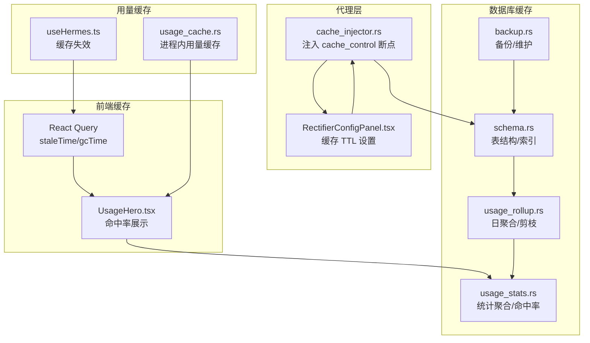
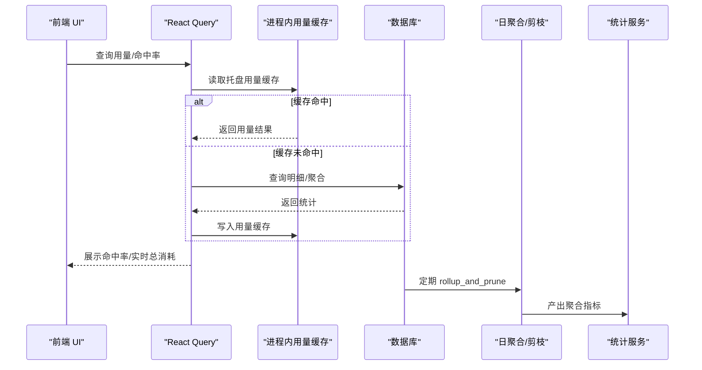
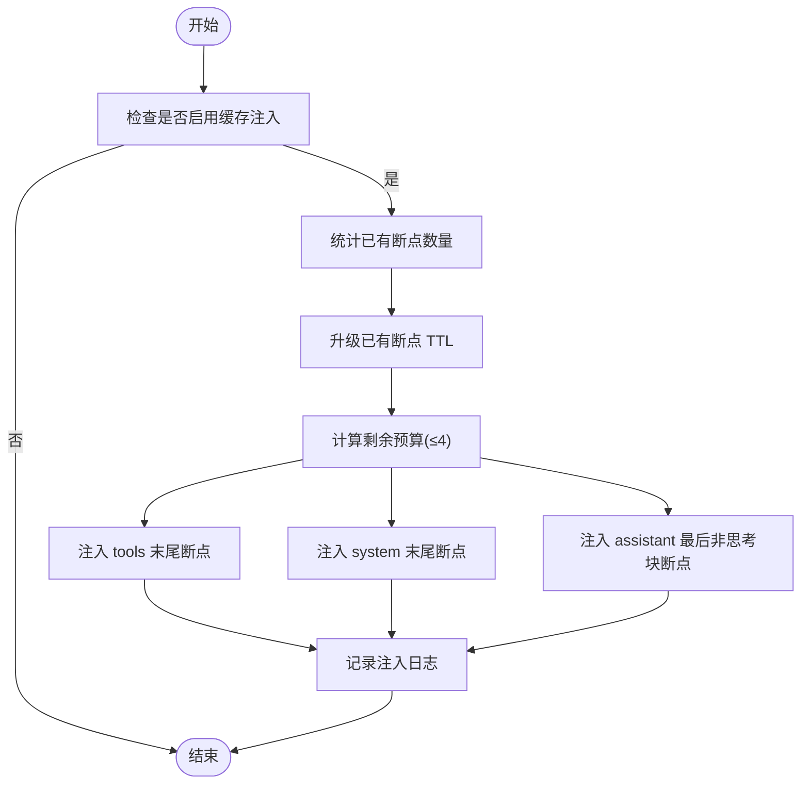
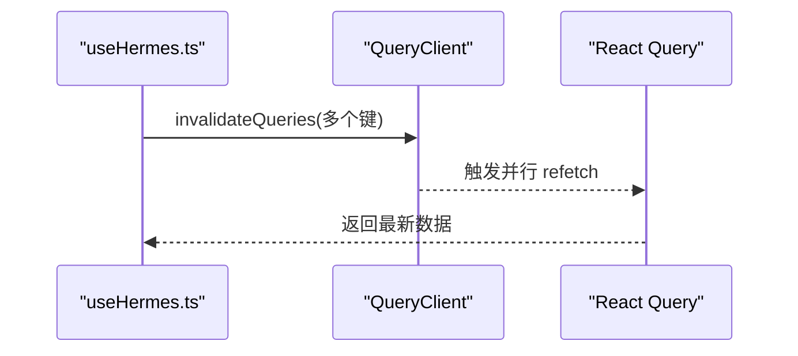
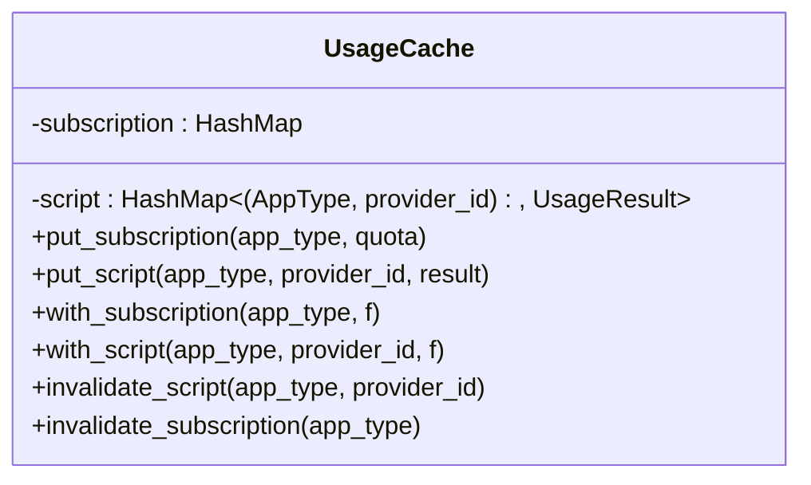
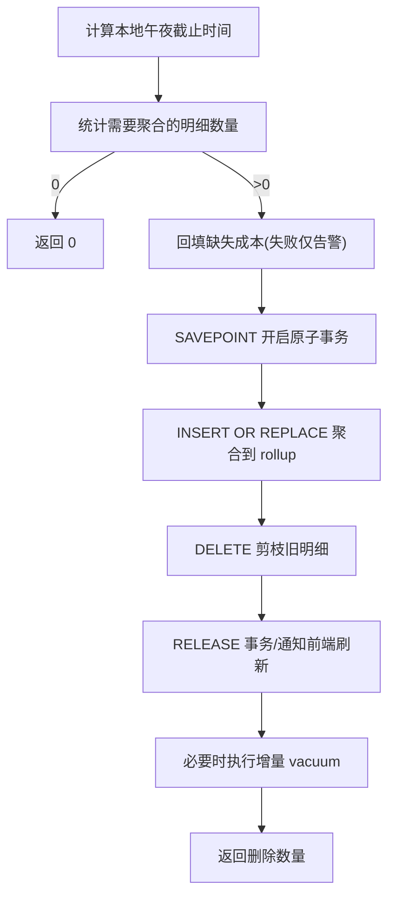
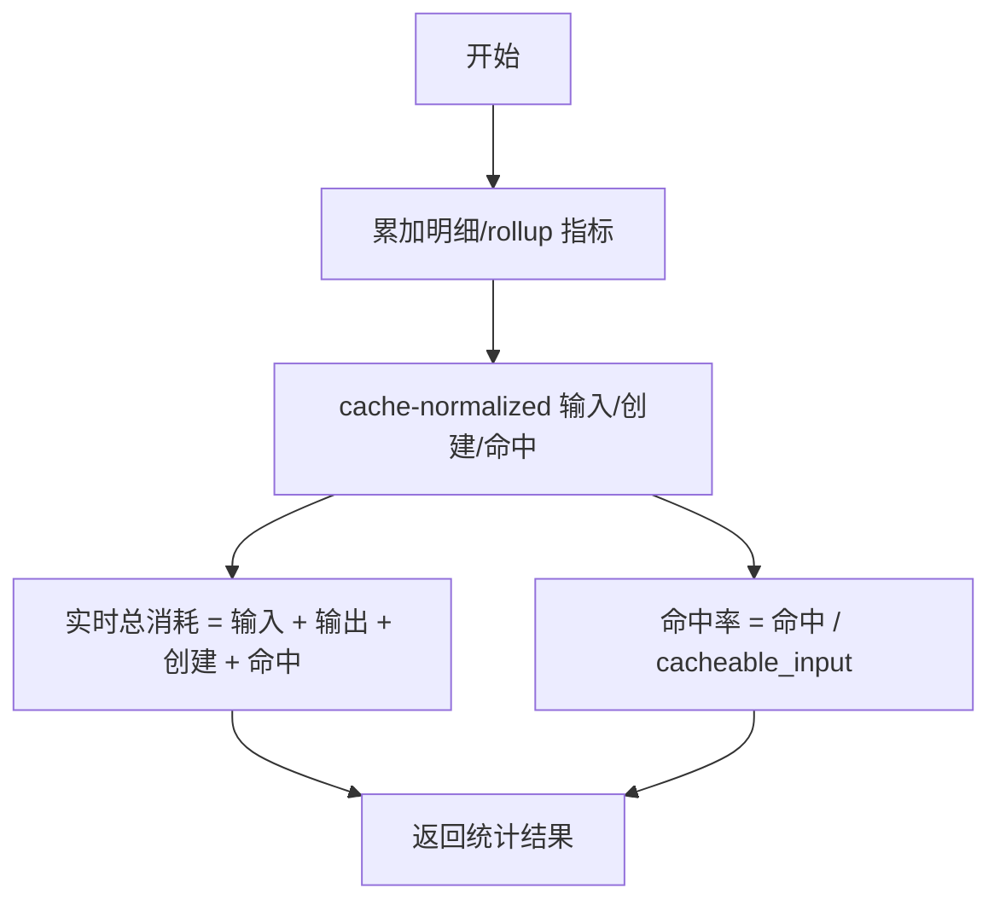
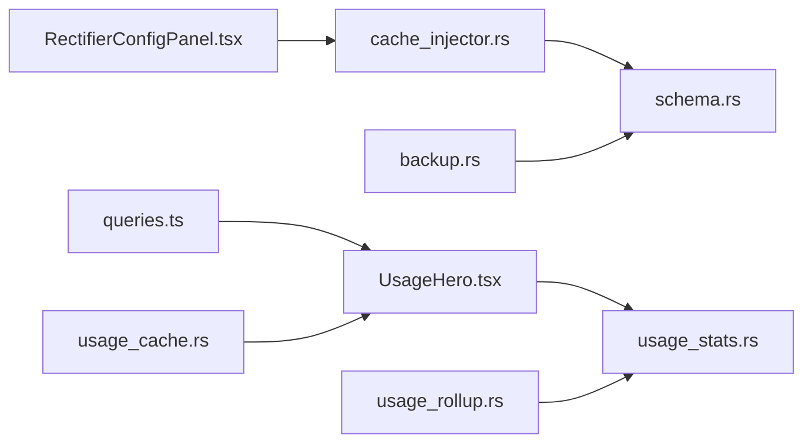

# 缓存策略

<cite>
**本文引用的文件**
- [usage_cache.rs](file://src-tauri/src/services/usage_cache.rs)
- [schema.rs](file://src-tauri/src/database/schema.rs)
- [usage_rollup.rs](file://src-tauri/src/database/dao/usage_rollup.rs)
- [usage_stats.rs](file://src-tauri/src/services/usage_stats.rs)
- [cache_injector.rs](file://src-tauri/src/proxy/cache_injector.rs)
- [RectifierConfigPanel.tsx](file://src/components/settings/RectifierConfigPanel.tsx)
- [queries.ts](file://src/lib/query/queries.ts)
- [useHermes.ts](file://src/hooks/useHermes.ts)
- [UsageHero.tsx](file://src/components/usage/UsageHero.tsx)
- [backup.rs](file://src-tauri/src/database/backup.rs)
- [handlers.rs](file://src-tauri/src/proxy/handlers.rs)
- [sse.rs](file://src-tauri/src/proxy/sse.rs)
- [v3.16.2-en.md](file://docs/release-notes/v3.16.2-en.md)
- [v3.15.0-en.md](file://docs/release-notes/v3.15.0-en.md)
- [4-proxy/4.4-usage.md](file://docs/user-manual/en/4-proxy/4.4-usage.md)
</cite>

## 目录
1. [简介](#简介)
2. [项目结构](#项目结构)
3. [核心组件](#核心组件)
4. [架构总览](#架构总览)
5. [详细组件分析](#详细组件分析)
6. [依赖分析](#依赖分析)
7. [性能考量](#性能考量)
8. [故障排查指南](#故障排查指南)
9. [结论](#结论)
10. [附录](#附录)

## 简介
本文件系统性梳理 CC Switch 的数据库缓存策略，覆盖内存缓存、磁盘缓存（SQLite 持久化与备份）、统计缓存（实时与聚合）与缓存一致性保障，以及缓存性能监控与优化建议。文档特别关注 Prompt Caching（提示缓存）在代理层的注入与用量统计中的归一化处理，帮助读者理解“写穿透”“读放大”“缓存雪崩”等风险的工程化应对。

## 项目结构
围绕缓存策略的关键模块分布如下：
- 代理层缓存注入：在请求体中注入 cache_control 断点，驱动上游 Prompt Caching。
- 用量统计缓存：进程内用量缓存（托盘展示），React Query 前端缓存（staleTime、gcTime）。
- 数据库缓存：SQLite 表 schema、明细日志与每日聚合 rollup、定期维护与备份。
- 性能监控：用量看板的命中率与实时总消耗等指标。

图表来源
- [cache_injector.rs:1-117](file://src-tauri/src/proxy/cache_injector.rs#L1-L117)
- [RectifierConfigPanel.tsx:208-237](file://src/components/settings/RectifierConfigPanel.tsx#L208-L237)
- [queries.ts:109-135](file://src/lib/query/queries.ts#L109-L135)
- [UsageHero.tsx:202-231](file://src/components/usage/UsageHero.tsx#L202-L231)
- [usage_cache.rs:1-85](file://src-tauri/src/services/usage_cache.rs#L1-L85)
- [schema.rs:18-364](file://src-tauri/src/database/schema.rs#L18-L364)
- [usage_rollup.rs:57-179](file://src-tauri/src/database/dao/usage_rollup.rs#L57-L179)
- [usage_stats.rs:43-73](file://src-tauri/src/services/usage_stats.rs#L43-L73)
- [backup.rs:260-295](file://src-tauri/src/database/backup.rs#L260-L295)

章节来源
- [cache_injector.rs:1-117](file://src-tauri/src/proxy/cache_injector.rs#L1-L117)
- [RectifierConfigPanel.tsx:208-237](file://src/components/settings/RectifierConfigPanel.tsx#L208-L237)
- [queries.ts:109-135](file://src/lib/query/queries.ts#L109-L135)
- [UsageHero.tsx:202-231](file://src/components/usage/UsageHero.tsx#L202-L231)
- [usage_cache.rs:1-85](file://src-tauri/src/services/usage_cache.rs#L1-L85)
- [schema.rs:18-364](file://src-tauri/src/database/schema.rs#L18-L364)
- [usage_rollup.rs:57-179](file://src-tauri/src/database/dao/usage_rollup.rs#L57-L179)
- [usage_stats.rs:43-73](file://src-tauri/src/services/usage_stats.rs#L43-L73)
- [backup.rs:260-295](file://src-tauri/src/database/backup.rs#L260-L295)

## 核心组件
- 代理层缓存注入器：在 tools/system/assistant 最后一条非思考块注入 cache_control，支持 TTL 升级与预算控制。
- 前端缓存：React Query 使用动态 staleTime 与固定 gcTime，避免频繁刷新与内存膨胀。
- 进程内用量缓存：托盘展示用的短期缓存，写穿式写入，进程重启即清空。
- 数据库缓存：明细表 + 日聚合表 + 定期剪枝与维护，确保统计口径一致与空间可控。
- 统计服务：产出命中率、实时总消耗等指标，支撑看板展示。

章节来源
- [cache_injector.rs:8-117](file://src-tauri/src/proxy/cache_injector.rs#L8-L117)
- [queries.ts:109-135](file://src/lib/query/queries.ts#L109-L135)
- [usage_cache.rs:13-85](file://src-tauri/src/services/usage_cache.rs#L13-L85)
- [schema.rs:18-364](file://src-tauri/src/database/schema.rs#L18-L364)
- [usage_rollup.rs:57-179](file://src-tauri/src/database/dao/usage_rollup.rs#L57-L179)
- [usage_stats.rs:43-73](file://src-tauri/src/services/usage_stats.rs#L43-L73)

## 架构总览
缓存策略贯穿“请求注入—统计聚合—前端展示”的闭环：
- 请求注入：代理层根据配置在合适位置注入 cache_control，提升上游缓存命中。
- 统计聚合：明细日志按天聚合到 rollup 表，保留 request_model/pricing_model 维度，支持回填计价。
- 前端展示：用量看板显示命中率、实时总消耗等指标，命中率基于 cache-normalized 的输入/创建/命中令牌计算。

图表来源
- [queries.ts:109-135](file://src/lib/query/queries.ts#L109-L135)
- [usage_cache.rs:24-84](file://src-tauri/src/services/usage_cache.rs#L24-L84)
- [schema.rs:260-284](file://src-tauri/src/database/schema.rs#L260-L284)
- [usage_rollup.rs:57-179](file://src-tauri/src/database/dao/usage_rollup.rs#L57-L179)
- [usage_stats.rs:43-73](file://src-tauri/src/services/usage_stats.rs#L43-L73)

## 详细组件分析

### 代理层缓存注入（Prompt Caching）
- 注入位置：tools 末尾、system 末尾、最后一条 assistant 消息的最后一个非 thinking/redacted_thinking 块。
- TTL 控制：支持 5m（无 ttl 字段）与 1h（带 ttl 字段），已有断点优先升级 TTL。
- 预算控制：最多注入 4 个断点，避免过度注入导致上游拒绝。
- 配置入口：设置面板提供缓存 TTL 选项，与代理优化器联动。

图表来源
- [cache_injector.rs:8-117](file://src-tauri/src/proxy/cache_injector.rs#L8-L117)
- [cache_injector.rs:119-190](file://src-tauri/src/proxy/cache_injector.rs#L119-L190)
- [RectifierConfigPanel.tsx:208-237](file://src/components/settings/RectifierConfigPanel.tsx#L208-L237)

章节来源
- [cache_injector.rs:8-117](file://src-tauri/src/proxy/cache_injector.rs#L8-L117)
- [cache_injector.rs:119-190](file://src-tauri/src/proxy/cache_injector.rs#L119-L190)
- [RectifierConfigPanel.tsx:208-237](file://src/components/settings/RectifierConfigPanel.tsx#L208-L237)

### 前端缓存与失效（React Query）
- 动态 staleTime：根据自动刷新间隔调整，避免页面切换时重复查询。
- 固定 gcTime：组件卸载后缓存保留 10 分钟，降低频繁重建成本。
- 缓存失效：提供统一的 invalidateHermesProviderCaches，支持并行失效多个查询键。

图表来源
- [useHermes.ts:39-44](file://src/hooks/useHermes.ts#L39-L44)
- [queries.ts:109-135](file://src/lib/query/queries.ts#L109-L135)

章节来源
- [useHermes.ts:39-44](file://src/hooks/useHermes.ts#L39-L44)
- [queries.ts:109-135](file://src/lib/query/queries.ts#L109-L135)

### 进程内用量缓存（托盘展示）
- 写穿式：用量查询成功后写入进程内缓存，托盘读取时避免深拷贝。
- 失效策略：针对脚本型用量与订阅用量分别提供 invalidate 接口，先读锁快速放行不存在的情况，再写锁删除。
- 生命周期：进程重启即清空，由后续查询或托盘悬停触发刷新。

图表来源
- [usage_cache.rs:13-85](file://src-tauri/src/services/usage_cache.rs#L13-L85)

章节来源
- [usage_cache.rs:13-85](file://src-tauri/src/services/usage_cache.rs#L13-L85)

### 数据库缓存（明细与聚合）
- 明细表：proxy_request_logs 记录每条请求的输入/输出/缓存读写令牌、成本、延迟等。
- 聚合表：usage_daily_rollups 按日聚合，保留 app_type/provider_id/model/request_model/pricing_model 等维度。
- 剪枝与对齐：按本地午夜边界对齐剪枝，确保日聚合完整；剪枝前尽力回填缺失成本，避免永久低估。
- 维护：定期执行增量 vacuum，回收空间。

图表来源
- [usage_rollup.rs:19-55](file://src-tauri/src/database/dao/usage_rollup.rs#L19-L55)
- [usage_rollup.rs:61-113](file://src-tauri/src/database/dao/usage_rollup.rs#L61-L113)
- [usage_rollup.rs:115-179](file://src-tauri/src/database/dao/usage_rollup.rs#L115-L179)
- [backup.rs:260-295](file://src-tauri/src/database/backup.rs#L260-L295)

章节来源
- [schema.rs:183-284](file://src-tauri/src/database/schema.rs#L183-L284)
- [usage_rollup.rs:57-179](file://src-tauri/src/database/dao/usage_rollup.rs#L57-L179)
- [backup.rs:260-295](file://src-tauri/src/database/backup.rs#L260-L295)

### 统计缓存与命中率
- 命中率计算：基于 cache-normalized 的 fresh_input + output + cache_creation + cache_read，cacheable_input = fresh_input + cache_creation + cache_read。
- 实时总消耗：看板顶部卡片展示 cache-normalized 的实时总消耗与命中率，支持按时间范围/应用/提供商/模型筛选。
- 指标来源：明细日志与每日 rollup 合并统计，确保历史与实时一致。

图表来源
- [usage_stats.rs:43-59](file://src-tauri/src/services/usage_stats.rs#L43-L59)
- [usage_stats.rs:18-33](file://src-tauri/src/services/usage_stats.rs#L18-L33)
- [4-proxy/4.4-usage.md:44-143](file://docs/user-manual/en/4-proxy/4.4-usage.md#L44-L143)

章节来源
- [usage_stats.rs:43-59](file://src-tauri/src/services/usage_stats.rs#L43-L59)
- [usage_stats.rs:18-33](file://src-tauri/src/services/usage_stats.rs#L18-L33)
- [4-proxy/4.4-usage.md:44-143](file://docs/user-manual/en/4-proxy/4.4-usage.md#L44-L143)

### 缓存一致性与同步
- 写穿透：用量查询成功后写入进程内缓存，托盘读取时直接命中，减少重复查询。
- 一致性：前端查询与后台定时刷新配合，staleTime 与 refetchInterval 保证数据新鲜度。
- 统计一致性：rollup 对齐本地午夜边界，避免半日聚合导致统计偏差；剪枝前回填成本，防止永久低估。

章节来源
- [queries.ts:109-135](file://src/lib/query/queries.ts#L109-L135)
- [usage_cache.rs:24-84](file://src-tauri/src/services/usage_cache.rs#L24-L84)
- [usage_rollup.rs:19-55](file://src-tauri/src/database/dao/usage_rollup.rs#L19-L55)

## 依赖分析
- 代理层依赖设置面板配置（缓存 TTL），注入器根据配置决定断点数量与 TTL。
- 前端依赖 React Query 的缓存生命周期管理，托盘依赖进程内用量缓存。
- 数据库层依赖 schema 的索引与表结构，rollup 依赖明细表与定价表回填。

图表来源
- [RectifierConfigPanel.tsx:208-237](file://src/components/settings/RectifierConfigPanel.tsx#L208-L237)
- [cache_injector.rs:8-117](file://src-tauri/src/proxy/cache_injector.rs#L8-L117)
- [schema.rs:18-364](file://src-tauri/src/database/schema.rs#L18-L364)
- [UsageHero.tsx:202-231](file://src/components/usage/UsageHero.tsx#L202-L231)
- [usage_stats.rs:43-73](file://src-tauri/src/services/usage_stats.rs#L43-L73)
- [queries.ts:109-135](file://src/lib/query/queries.ts#L109-L135)
- [usage_cache.rs:13-85](file://src-tauri/src/services/usage_cache.rs#L13-L85)
- [usage_rollup.rs:57-179](file://src-tauri/src/database/dao/usage_rollup.rs#L57-L179)
- [backup.rs:260-295](file://src-tauri/src/database/backup.rs#L260-L295)

## 性能考量
- 写穿透与热点数据：用量查询成功即写入进程内缓存，托盘读取时避免重复查询，降低热点查询压力。
- 读放大控制：前端使用动态 staleTime 与固定 gcTime，避免频繁刷新；代理层预算控制注入断点数量，避免过度注入。
- 空间与 IO：rollup_and_prune 按本地午夜边界对齐剪枝，减少碎片与 IO；维护阶段执行增量 vacuum 回收空间。
- 流式解析健壮性：SSE 解析增强 UTF-8 边界处理，避免无效字节累积导致内存膨胀。

章节来源
- [queries.ts:109-135](file://src/lib/query/queries.ts#L109-L135)
- [cache_injector.rs:19-30](file://src-tauri/src/proxy/cache_injector.rs#L19-L30)
- [usage_rollup.rs:87-113](file://src-tauri/src/database/dao/usage_rollup.rs#L87-L113)
- [backup.rs:260-295](file://src-tauri/src/database/backup.rs#L260-L295)
- [sse.rs:302-345](file://src-tauri/src/proxy/sse.rs#L302-L345)

## 故障排查指南
- 命中率异常偏低
  - 检查代理层缓存注入是否生效（断点数量、TTL 设置）。
  - 确认 rollup 剪枝是否正确执行，是否存在回填失败导致的成本低估。
  - 查看前端 staleTime 是否过短导致频繁刷新。
- 实时总消耗与历史不一致
  - 确认 cache-normalized 规则是否一致（v3.15.0 后统一了缓存读取/创建/OpenAI 报告方式）。
  - 检查 rollup 对齐逻辑与边界日是否被裁剪。
- 缓存雪崩
  - 检查前端 refetchInterval 与 staleTime 设置，避免大量并发刷新。
  - 确认 rollup_and_prune 是否定期执行，避免明细表过大导致查询慢。
- 读放大与内存占用
  - 调整 gcTime 与 staleTime，减少缓存驻留时间。
  - 检查代理层注入预算，避免过多断点导致上游拒绝或网络放大。

章节来源
- [v3.15.0-en.md:41-43](file://docs/release-notes/v3.15.0-en.md#L41-L43)
- [v3.16.2-en.md:58-62](file://docs/release-notes/v3.16.2-en.md#L58-L62)
- [usage_rollup.rs:87-113](file://src-tauri/src/database/dao/usage_rollup.rs#L87-L113)
- [queries.ts:109-135](file://src/lib/query/queries.ts#L109-L135)
- [cache_injector.rs:19-30](file://src-tauri/src/proxy/cache_injector.rs#L19-L30)

## 结论
CC Switch 的缓存策略以“代理层注入 + 数据库聚合 + 前端缓存”三位一体：代理层通过精准断点注入提升上游缓存命中，数据库层通过 rollup 对齐与回填保证统计一致性，前端通过动态缓存生命周期避免读放大。结合 v3.15.0 的 cache-normalized 统计口径与 v3.16.2 的用量来源扩展，整体在性能、可观测性与稳定性方面形成闭环。

## 附录
- 缓存配置优化建议
  - 代理层：TTL 优先 1h，5m 仅在需要极短时效时使用；预算控制在 4 以内。
  - 前端：staleTime 与自动刷新间隔对齐，gcTime 设为 10 分钟；refetchOnWindowFocus 关闭以避免后台干扰。
  - 数据库：定期执行 rollup_and_prune（如 30 天保留），维护阶段执行增量 vacuum。
- 缓存性能监控指标
  - 命中率：cache_read / cacheable_input
  - 实时总消耗：fresh_input + output + cache_creation + cache_read
  - 成本估算：按 model_pricing 与 rollup 的 total_cost_usd
  - 延迟指标：avg_latency_ms
- 风险防护
  - 写穿透：用量查询成功后写入进程内缓存。
  - 读放大：前端缓存生命周期与代理层预算控制。
  - 缓存雪崩：合理设置刷新频率与缓存驻留时间，避免并发刷新。

章节来源
- [RectifierConfigPanel.tsx:208-237](file://src/components/settings/RectifierConfigPanel.tsx#L208-L237)
- [queries.ts:109-135](file://src/lib/query/queries.ts#L109-L135)
- [usage_stats.rs:43-73](file://src-tauri/src/services/usage_stats.rs#L43-L73)
- [usage_rollup.rs:87-113](file://src-tauri/src/database/dao/usage_rollup.rs#L87-L113)
- [v3.15.0-en.md:41-43](file://docs/release-notes/v3.15.0-en.md#L41-L43)
- [v3.16.2-en.md:58-62](file://docs/release-notes/v3.16.2-en.md#L58-L62)